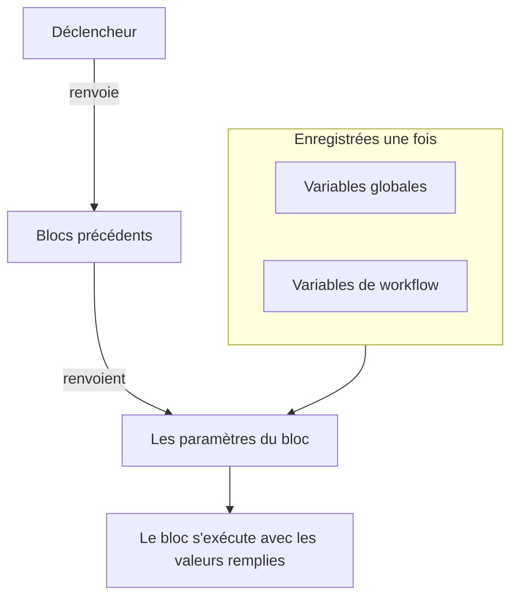
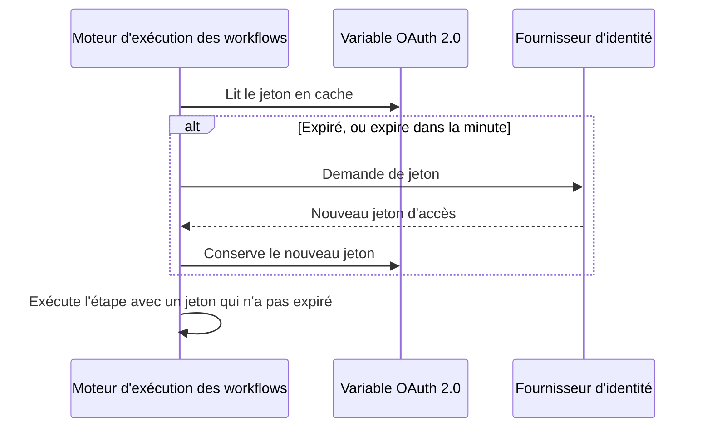

# Variables de workflow

Les variables sont la façon dont les données circulent dans un workflow : du déclencheur au premier bloc, d'un bloc au suivant, et des valeurs que vous enregistrez une fois vers chaque bloc qui en a besoin. Le paramètre d'un bloc lit une valeur grâce à une référence entre doubles accolades, et le moteur d'exécution la remplit juste avant que le bloc s'exécute.

| Valeur                          | D'où elle vient                                                  | Comment un bloc la lit                                |
| ------------------------------- | ---------------------------------------------------------------- | ----------------------------------------------------- |
| **Variable globale**            | Enregistrée sous **Flux de travail → Variables globales**         | `{{global.variables.NAME}}`                          |
| **Variable de workflow**        | Enregistrée sur la page **Variables de flux de travail** d'un workflow | `{{local.variables.NAME}}`                      |
| **La valeur d'un bloc précédent** | Ce que le déclencheur ou un bloc précédent a renvoyé dans cette exécution | `{{local.components.BLOCK_ID.returnValues.VALUE_ID}}` |



Vous tapez rarement une référence. Cliquez sur **{ }** au bout d'un paramètre, ou tapez `{{` dedans, et choisissez la valeur dans une liste. Voir [Utiliser des valeurs des blocs précédents](/docs/workflows/authoring#utiliser-des-valeurs-des-blocs-précédents).

## Variables globales

Des valeurs à l'échelle du projet, que vous enregistrez une fois et réutilisez dans chaque workflow : clés d'API, URL, noms de canaux — tout ce que vous ne voulez pas recopier dans dix workflows différents.

:::steps
### Ouvrir les variables globales

Allez dans **Flux de travail → Variables globales** et cliquez sur **Créer : Variable de flux de travail**.

### Nommer la variable

À l'étape **Variable**, renseignez :

- **Nom** — le nom par lequel vous y ferez référence. Au moins deux caractères, pas d'espaces, et uniquement des lettres, des chiffres, des tirets et des tirets bas. `UPPER_SNAKE_CASE` est une bonne habitude, car il ressort bien dans vos blocs.
- **Description** — facultative, un texte libre pour vous rappeler à quoi elle sert.

Cliquez sur **Suivant**.

### Lui donner une valeur

À l'étape **Valeur**, renseignez :

- **Contenu** — la valeur elle-même. C'est un champ de texte long : les valeurs sur plusieurs lignes fonctionnent.
- **Secret** — une fois activé, la valeur est effacée des journaux d'exécution et des traces des étapes.

Cliquez sur **Créer : Variable de flux de travail**. Pour changer le nom ou la description avant cela, cliquez sur **Variable** dans la liste des étapes à côté du formulaire (affichée sur les écrans larges) ; ce que vous avez saisi dans chaque étape est conservé.
:::

Utilisez une variable globale dans n'importe quel workflow avec :

```text
{{global.variables.NAME}}
```

Par exemple, si vous avez enregistré votre clé PagerDuty sous `PAGERDUTY_KEY`, n'importe quel bloc peut l'utiliser sous la forme `{{global.variables.PAGERDUTY_KEY}}` — l'éditeur enregistre la référence, et la journalisation du workflow efface la valeur secrète résolue.

La liste affiche le nom et la description de chaque variable. Cliquez sur **Voir** sur une ligne pour ouvrir la page de la variable. Elle indique si la variable est statique ou OAuth 2.0, et c'est là que vous faites tout le reste :

| Bouton                                       | Ce qu'il fait                                                                                                                                       |
| -------------------------------------------- | --------------------------------------------------------------------------------------------------------------------------------------------------- |
| **Modifier la variable**                     | Change le nom, la description et — pour une variable statique qui n'est pas encore secrète — l'indicateur secret. Une fois secrète, une variable le reste. |
| **Update Content**                           | Remplace une valeur statique. Le contenu enregistré ne peut pas être relu : vous tapez donc la nouvelle valeur en entier.                           |
| **Use in Workflows**                         | Affiche la référence exacte à coller dans vos blocs, avec un bouton de copie.                                                                      |
| **Supprimer : Variable de flux de travail**  | La supprime, après vous avoir demandé confirmation. La confirmation nomme la variable, pour que vous puissiez vérifier que c'est bien celle-là.     |

Pour créer plutôt une variable **jeton d'accès OAuth 2.0**, ouvrez le menu **Plus** (**⋯**) à côté de **Créer : Variable de flux de travail** et choisissez **Créer une variable OAuth 2.0**. Les variables OAuth 2.0 ont [leur propre section](#variables-oauth-20-des-jetons-qui-se-renouvellent-seuls) plus bas. Le type d'une variable ne peut pas être changé une fois enregistrée.

Vous pouvez aussi mettre à jour une variable via l'API, ce qui est décrit [à la fin de cette page](#mettre-à-jour-une-variable-depuis-un-workflow). Les variables globales et de workflow sont une fonctionnalité du forfait Growth.

## Variables de workflow locales

Des variables propres à un seul workflow, gérées sous **Variables de flux de travail** dans le menu de ce workflow. Elles fonctionnent comme les variables globales : **Créer : Variable de flux de travail** crée une variable statique, le menu **Plus** (**⋯**) crée une variable OAuth 2.0, et **Voir** ouvre la page d'une variable. Faites-y référence avec :

```text
{{local.variables.NAME}}
```

Utilisez-en une pour une valeur dont seul ce workflow a besoin, comme l'URL de webhook Slack d'un modèle. Les modèles qui demandent des paramètres les enregistrent comme variables de workflow, pour que vous puissiez les changer plus tard sans modifier les blocs.

## Variables OAuth 2.0 (des jetons qui se renouvellent seuls)

Un jeton bearer collé dans une variable statique fonctionne jusqu'à son expiration, en général dans l'heure. Ensuite, chaque exécution qui l'utilise échoue avec `401 Unauthorized` jusqu'à ce que quelqu'un en colle un nouveau. Une variable **jeton d'accès OAuth 2.0** enregistre ce dont l'échange de jetons OAuth a besoin plutôt que le jeton lui-même, et OneUptime maintient le jeton à jour.

Vous l'utilisez exactement comme n'importe quelle autre variable :

```http
Authorization: Bearer {{global.variables.CRM_API_TOKEN}}
```

### Comment le jeton reste valide



- La première fois qu'un workflow utilise la variable, OneUptime demande un jeton d'accès au point de terminaison de jetons de votre fournisseur d'identité et le conserve.
- Avant chaque étape qui fait référence à la variable, le moteur d'exécution vérifie le jeton. S'il a expiré, ou expire dans la minute qui vient, un nouveau jeton est récupéré avant que l'étape s'exécute. Le composant reçoit toujours un jeton qui n'a pas expiré, quelle que soit la durée pendant laquelle la variable est restée inutilisée et quelle que soit la durée de l'exécution.
- Seules les étapes qui font réellement référence à la variable déclenchent un renouvellement. Une exécution qui n'utilise jamais une variable ne récupère jamais son jeton, et n'échoue pas parce que ce fournisseur est en panne.
- Quand beaucoup d'exécutions ont besoin d'un nouveau jeton au même moment, l'une d'elles le récupère et les autres l'utilisent.
- Si le fournisseur n'indique pas quand un jeton expire (pas de `expires_in`, et le jeton n'est pas un JWT avec une revendication `exp`), OneUptime récupère un nouveau jeton une fois par exécution et le partage entre les étapes de cette exécution.

### Types d'autorisation

| Type d'autorisation          | À utiliser pour                                                                                                                                                                                                                                       |
| ---------------------------- | ----------------------------------------------------------------------------------------------------------------------------------------------------------------------------------------------------------------------------------------------------- |
| **Client Credentials**       | OneUptime se connecte en tant que votre application. Le choix habituel pour les API de serveur à serveur comme Microsoft Graph, les API d'Auth0 ou d'Okta, ou un service interne derrière Keycloak.                                                   |
| **Jeton d'actualisation**    | Un accès délégué au nom d'un utilisateur. Autorisez l'application une fois (par exemple dans l'OAuth playground de votre fournisseur ou avec Postman) et collez le jeton d'actualisation obtenu. OneUptime l'échange contre des jetons d'accès, et enregistre chaque nouveau jeton d'actualisation si votre fournisseur les fait tourner. Un client public sans secret client fonctionne aussi. |

### En créer une

**Créer une variable OAuth 2.0** demande une chose par étape :

1. **Variable** : le nom par lequel les workflows y font référence, et une description.
2. **Fournisseur** : choisissez votre **Fournisseur d'identité**, et OneUptime remplit son **URL du jeton** :

   | Fournisseur d'identité | URL du jeton qu'il remplit |
   |---|---|
   | Microsoft Entra ID | `https://login.microsoftonline.com/{tenant-id}/oauth2/v2.0/token` |
   | Google | `https://oauth2.googleapis.com/token` |
   | Okta | `https://{your-domain}/oauth2/default/v1/token` |
   | Auth0 | `https://{your-domain}/oauth/token` |

   Remplacez la partie entre accolades par votre propre valeur, comme votre ID d'annuaire (tenant) ou votre domaine Okta. Le formulaire ne vous laisse pas continuer tant que l'URL en contient une. Pour tout autre fournisseur, choisissez **Autre fournisseur** et saisissez vous-même son point de terminaison de jetons. Choisissez ensuite le **Type d'autorisation**. Choisir Google sélectionne **Jeton d'actualisation**, car les clients OAuth de Google ne peuvent pas utiliser Client Credentials. Le fournisseur ne fait que remplir le formulaire ; il n'est pas enregistré avec la variable.
3. **Identifiants** : l'**ID client** et le **Secret client** de l'application que vous avez enregistrée auprès du fournisseur et, pour le type Refresh Token, le **Jeton d'actualisation**. Un client public sur le type Refresh Token peut laisser le secret client vide.
4. **Avancé**, entièrement facultatif :
   - **Portée** : séparée par des espaces. Laissez-la vide pour obtenir les portées par défaut du fournisseur. Pour Client Credentials, Microsoft Entra ID a besoin d'une portée qui se termine par `/.default` (comme `https://graph.microsoft.com/.default`) et Okta a besoin d'une portée personnalisée.
   - **Paramètres supplémentaires** : des champs de formulaire supplémentaires pour la demande de jeton, comme `audience` pour Auth0 (nécessaire pour Client Credentials) ou `resource` pour Azure AD v1. Toute personne qui peut lire la variable peut les lire : n'y mettez donc pas de secrets.
   - **Authentification du client** : si l'ID et le secret client partent dans un en-tête HTTP Basic (par défaut) ou dans le corps de la requête. Si votre fournisseur répond `invalid_client`, essayez l'autre option.

Sous certains champs, le formulaire ajoute une ligne d'aide pour le fournisseur choisi, par exemple l'endroit où Microsoft Entra ID affiche votre ID de locataire, et le fait que son secret client est la **Value** du secret, pas son **Secret ID**.

Quand vous enregistrez une nouvelle variable OAuth 2.0, OneUptime récupère aussitôt son premier jeton et vous dit ce que le fournisseur a répondu. Une faute de frappe dans le secret ou dans l'URL se voit à ce moment-là, pas des heures plus tard dans une exécution en échec. Récupérer un jeton écrit dans la variable : cela demande donc l'autorisation de modifier les variables de workflow ; si vous pouvez créer des variables mais pas les modifier, c'est la première exécution de workflow qui utilise la variable qui récupère son jeton.

La page de la variable (cliquez sur **Voir** sur sa ligne) comporte une carte **Paramètres OAuth 2.0**. **Modifier les paramètres** parcourt les mêmes étapes **Fournisseur** (URL du jeton), **Identifiants** (ID client) et **Avancé** (portée, paramètres supplémentaires, authentification du client). **Suivant** passe à l'étape suivante et **Enregistrer les modifications** se trouve à la dernière étape. Chaque étape est déjà remplie : la liste des étapes à côté du formulaire ouvre donc n'importe laquelle d'entre elles ; modifiez un paramètre à son étape, puis ouvrez la dernière étape et enregistrez. Le type d'autorisation est figé une fois enregistré.

### La carte Jeton d'accès

La carte **Jeton d'accès** sur la page d'une variable OAuth 2.0 affiche l'un des statuts suivants :

| Statut                     | Ce que cela signifie                                                                                                                       |
| -------------------------- | ------------------------------------------------------------------------------------------------------------------------------------------ |
| **Valid**                  | Le jeton en cache n'a pas encore expiré.                                                                                                   |
| **Expiré**                 | Normal pour une variable qu'aucun workflow n'a utilisée récemment. La prochaine exécution qui l'utilise récupère un nouveau jeton.          |
| **Pas encore récupéré**    | Aucun jeton n'a été récupéré depuis la création de la variable ou la modification de ses paramètres.                                      |
| **No expiry reported**     | Le fournisseur n'a pas dit quand le jeton expire : chaque exécution en récupère donc un nouveau.                                           |
| **Refresh failed**         | La dernière tentative pour obtenir un jeton a échoué. La raison donnée par le fournisseur est affichée en entier, avec le moment de l'échec. Le prochain renouvellement réussi l'efface. |

**Actualiser maintenant**, sous le statut, récupère aussitôt un nouveau jeton. Utilisez-le pour vérifier de nouveaux paramètres sans exécuter de workflow. **Update Credentials**, sur la carte **Paramètres OAuth 2.0**, remplace le secret client ou le jeton d'actualisation, puis récupère un jeton avec eux. Modifier n'importe quel paramètre (URL du jeton, ID client, portée, etc.) supprime le jeton en cache, si bien que la prochaine exécution en récupère un avec les nouveaux paramètres.

### Quand le fournisseur refuse

L'étape qui avait besoin du jeton échoue avant de s'exécuter, et le journal de l'exécution nomme la variable et cite la réponse du fournisseur, par exemple `Could not get an OAuth 2.0 access token for {{global.variables.CRM_API_TOKEN}}: The token endpoint refused the request (HTTP 400): invalid_grant - Token has been expired or revoked.` La même raison apparaît sur la carte **Jeton d'accès** de la variable. `invalid_grant` sur une variable Refresh Token signifie presque toujours que le jeton d'actualisation lui-même a expiré ou a été révoqué, et la solution est **Update Credentials**.

Si le renouvellement échoue alors que le jeton en cache n'a pas réellement expiré (il était seulement dans la marge d'une minute), l'étape continue avec le jeton en cache et le journal le signale.

### Sécurité

- Les variables OAuth 2.0 sont toujours secrètes. Le jeton d'accès est remplacé par `[REDACTED]` dans les journaux d'exécution et les traces des étapes, y compris un jeton remplacé en cours d'exécution.
- Le secret client, le jeton d'actualisation et le jeton d'accès sont chiffrés dans la base de données et ne peuvent jamais être relus via l'API ou le tableau de bord. **Actualiser maintenant** indique quand le nouveau jeton expire, jamais le jeton.
- L'URL du jeton doit être en `http` ou `https`. Les requêtes vers les adresses de bouclage, de lien local et de métadonnées cloud sont refusées. Sur OneUptime Cloud, les adresses de réseau privé sont refusées aussi. Les installations auto-hébergées peuvent atteindre un fournisseur d'identité sur leur propre réseau. OneUptime ne suit pas les redirections lors des demandes de jeton : pointez donc l'URL du jeton vers l'adresse sur laquelle le point de terminaison répond réellement. Une demande de jeton abandonne au bout de 20 secondes.

### Passer d'un jeton statique existant à OAuth 2.0

Le type d'une variable est figé une fois enregistrée. Supprimez la variable statique et créez une variable OAuth 2.0 avec le **même nom**. Les workflows font référence aux variables par leur nom : ils prennent donc la nouvelle sans aucun changement.

## Sorties des composants (données des blocs précédents)

Chaque déclencheur et chaque composant peut produire des données pendant une exécution. Insérez une référence avec le bouton **{ }** de n'importe quel paramètre, ou en tapant `{{` dedans, plutôt que de la taper en entier — cela insère les ID exacts qu'attend le moteur d'exécution, et affiche la valeur comme une puce qui nomme le bloc et la valeur.

Vous pouvez aussi partir du bloc qui produit la valeur : ses paramètres listent chaque sortie sous **Returns**, avec la référence exacte et un bouton pour la copier.

Faites référence à la sortie d'un bloc précédent ainsi :

```text
{{local.components.COMPONENT_ID.returnValues.FIELD_ID}}
```

`COMPONENT_ID` est l'**Identifiant** du bloc — l'ID court affiché sur le bloc, pas le nom qui y est affiché. Les nouveaux blocs en reçoivent un comme `api-get-1`, et vous pouvez le renommer dans la section **ID** du bloc. Le renommer casse toutes les références qui pointent déjà vers lui, tout comme renommer une variable. `FIELD_ID` est l'ID de la valeur, et un chemin après lui lit un champ d'une valeur JSON.

| Après un bloc comme…                                     | Lisez                                                                                  |
| -------------------------------------------------------- | -------------------------------------------------------------------------------------- |
| Un bloc **API** dont l'ID est `lookup-user`              | Son code de statut : `{{local.components.lookup-user.returnValues.response-status}}`. Son corps : `{{local.components.lookup-user.returnValues.response-body}}`. |
| Un bloc **Run Custom JavaScript** dont l'ID est `transform` | Ce qu'il a renvoyé : `{{local.components.transform.returnValues.returnValue}}`.     |
| Un déclencheur **On Create Incident** dont l'ID est `incident-on-create-1` | Le titre de l'incident : `{{local.components.incident-on-create-1.returnValues.model.title}}`. Les déclencheurs d'enregistrement renvoient une seule valeur, `model`, dans laquelle vous descendez. |

Les valeurs des blocs n'existent que pendant l'exécution en cours. Chaque nouvelle exécution repart de zéro.

## Où fonctionnent les variables

Presque tous les champs de texte acceptent des variables :

- L'URL d'un bloc API.
- Le texte du message sur Slack, Teams, Discord, Telegram, IRC, Email.
- L'objet et le corps d'un e-mail.
- Les en-têtes et les champs du corps (à l'intérieur des valeurs de chaîne).
- Les deux côtés d'un bloc **If / Else**.

Dans les champs JSON — **Data (JSON Object)**, **Query** et **Select Fields** sur les composants d'enregistrement, le **Request Body** d'un bloc API, les **Arguments** de **Run Custom JavaScript** — une référence est remplie selon l'endroit où elle se trouve :

- **Entre guillemets, c'est du texte.** `{"title": "Down: {{local.components.ci-webhook.returnValues.request-body.service}}"}` place la valeur dans la chaîne. Les guillemets, les barres obliques inverses et les sauts de ligne de la valeur sont échappés : le JSON reste valide et la valeur reste une seule chaîne.
- **Seule, c'est la valeur elle-même.** `{"customFields": {{local.components.transform.returnValues.returnValue}}}` insère l'objet entier, une liste reste une liste et un nombre reste un nombre. Un texte qui est lui-même du JSON — `5`, `true`, ou un objet qu'un bloc a renvoyé sous forme de texte JSON — est inséré comme cette valeur. Tout autre texte est inséré comme une chaîne.

Une référence entre les guillemets d'une clé est aussi du texte. S'il vous faut construire une structure dynamiquement, construisez-la dans un bloc **Run Custom JavaScript**, puis transmettez sa sortie au bloc suivant.

Le bloc **Run Custom JavaScript** ne reçoit pas les variables automatiquement — rien n'est injecté dans le bac à sable. Placez `{{global.variables.NAME}}` (ou n'importe quelle référence de composant) dans le champ JSON **Arguments** du bloc ; ces valeurs sont substituées avant l'exécution du script et arrivent comme `args`.

## Boucler sur des tableaux

Dans un champ de texte, vous pouvez répéter un morceau de texte pour chaque élément d'une liste avec `{{#each path}}…{{/each}}`. À l'intérieur du bloc, `{{property}}` lit dans l'élément courant, `{{@index}}` est sa position à partir de 0, et `{{this}}` est l'élément lui-même pour les listes de valeurs simples. Les noms à l'intérieur d'un bloc `{{#each}}` sont nettoyés de leurs espaces : les espaces parasites y sont donc sans effet — contrairement à partout ailleurs.

Par exemple, ce **Message Text** liste chaque alerte envoyée par un webhook :

```text title="Message Text"
{{#each local.components.ci-webhook.returnValues.request-body.alerts}}
- {{@index}}: {{name}} is {{status}}
{{/each}}
```

## Exemples

### Construire une charge utile à partir d'un webhook

Un webhook arrive avec un corps comme `{ "service": "checkout", "status": "failed" }`. Pour en faire un incident OneUptime :

1. Un déclencheur **Webhook** avec l'ID `ci-webhook`.
2. Un bloc **If / Else** : **Value to check** est le champ `status` du Request Body du webhook (`{{local.components.ci-webhook.returnValues.request-body.status}}`), **Comparison** est **is equal to**, et **Compare with** est `failed`.
3. Depuis la branche **Yes**, un bloc **Create One Incident** avec :
   - Titre : `CI build failed: {{local.components.ci-webhook.returnValues.request-body.service}}`
   - Description : `See {{local.components.ci-webhook.returnValues.request-body.url}} for the logs.`

### Utiliser un secret dans un appel d'API

Un workflow qui appelle PagerDuty :

1. Enregistrez `PAGERDUTY_KEY` comme variable globale secrète.
2. Sur le bloc **API**, définissez l'en-tête `Authorization` sur `Token token={{global.variables.PAGERDUTY_KEY}}`.

La clé reste hors du workflow et des journaux.

### Enchaîner deux appels d'API

Le premier appel vous donne un ID dont le second a besoin :

1. Composant **API** `lookup-order` : dans son **URL**, après `/orders?email=`, utilisez **{ }** pour insérer le JSON du déclencheur manuel avec le chemin `email`.
2. Composant **API** `cancel-order` : `POST /orders/{{local.components.lookup-order.returnValues.response-body.id}}/cancel`.

Si `lookup-order` échoue, c'est sa sortie **Error** qui se produit au lieu de **Success**. Reliez-la à un bloc Email ou Slack pour que les échecs ne passent pas inaperçus.

## Mettre à jour une variable depuis un workflow

Un schéma courant consiste à faire tourner un identifiant selon une planification : récupérer un jeton neuf auprès d'un tiers, puis le réenregistrer dans la variable pour que la prochaine exécution le prenne. Faites-le avec un bloc **API** qui appelle l'API OneUptime.

Si l'identifiant est un jeton d'accès OAuth 2.0, vous n'avez pas besoin de construire cela vous-même. Une [variable OAuth 2.0](#variables-oauth-20-des-jetons-qui-se-renouvellent-seuls) récupère et renouvelle le jeton toute seule.

Envoyez `PUT /api/workflow-variable/<variable-id>` avec un en-tête `ApiKey` et — c'est le point qui piège les gens — les champs à modifier **enveloppés dans un objet `data`** :

```json title="Request Body"
{
  "data": {
    "content": "{{local.components.get-token.returnValues.response-body.access_token}}"
  }
}
```

Un corps plat sans l'enveloppe `data` est rejeté avec un 400. N'envoyez que les champs que vous voulez réellement modifier ; `name` et `description` peuvent rester hors de la charge utile.

La clé d'API a besoin de **Edit Workflow Variables**. Aucune autorisation de lecture n'est nécessaire — la mise à jour ne relit pas la ligne.

Deux points à surveiller :

- **Ne renommez pas une variable que vous référencez.** `name` fait partie de `{{local.variables.NAME}}`. Le changer laisse toutes les références existantes non résolues, et une référence non résolue est transmise telle quelle sous forme de texte littéral — voir [Pièges](#pièges).
- **Une variable peut être écrite ainsi, mais jamais relue.** `content` est en écriture seule via l'API pour toutes les variables, secrètes ou non. C'est ce qui fait d'une variable un endroit sûr pour garer un jeton qui tourne. La marquer comme secrète garde en plus la valeur hors des journaux d'exécution et des traces des étapes.

## Pièges

- **Utilisez { } (ou tapez `{{`).** Cela insère les ID exacts de composant, de valeur de retour et de variable qu'attend le moteur d'exécution, et ne propose que des valeurs qui existent quand le bloc s'exécute.
- **Les noms de variables sont sensibles à la casse.** `{{global.variables.MyKey}}` et `{{global.variables.mykey}}` sont différents.
- **Une référence qui ne se résout pas est laissée telle quelle, pas vidée.** Faire référence à quelque chose qui n'existe pas n'est pas une erreur, et ne donne pas non plus une chaîne vide : les accolades passent telles quelles, si bien que `{{local.components.api-get-1.returnValues.body}}` avec un ID d'étape mal tapé se retrouve mot pour mot dans votre message Slack, votre URL ou le corps de votre requête, et l'exécution indique quand même **Exécuté**. L'onglet **Étapes** de l'exécution affiche sur l'étape un avertissement qui nomme toute référence passée telle quelle, et marque le paramètre où elle se trouvait **Non résolu** ; le journal de l'exécution contient la même ligne d'avertissement.
- **Le panneau des problèmes ne peut pas vérifier les noms de variables.** Il signale les références de composant qu'il ne peut pas associer — un ID d'étape inconnu, une valeur de retour inconnue, une racine mal formée — avant l'enregistrement. Il ne peut pas savoir si une variable existe. Les paramètres d'un bloc, eux, le peuvent : une référence à une variable manquante y apparaît comme une puce orange. Sinon, une variable renommée n'est repérée que par le journal de l'exécution.
- **Les espaces à l'intérieur des accolades ne sont pas supprimés.** `{{ local.variables.NAME }}` est une recherche différente de `{{local.variables.NAME}}` et ne se résout jamais. La seule exception est l'intérieur d'un bloc `{{#each}}`, où les noms sont nettoyés.

## Étapes suivantes

:::cards
- [Composants](/docs/workflows/components): Ce dont chaque bloc a besoin et ce qu'il renvoie.
- [Exécutions](/docs/workflows/runs-and-logs): Voyez la valeur qu'est devenue chaque référence lors d'une exécution.
- [Configuration et sécurité](/docs/workflows/configuration#secrets): Gardez les secrets hors des blocs, des exports et des journaux.
:::
