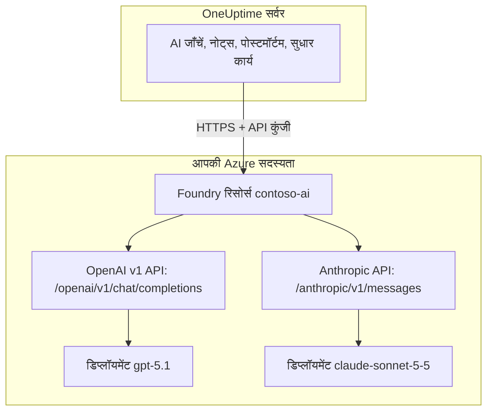

# Microsoft Foundry और Azure OpenAI

OneUptime की AI सुविधाओं को उन मॉडलों पर चलाएँ जिन्हें आप Microsoft Foundry (पहले Azure AI Foundry) या Azure OpenAI में डिप्लॉय करते हैं। OneUptime हर अनुरोध सीधे आपकी Azure सदस्यता में मौजूद आपके रिसोर्स को भेजता है, इसलिए प्रॉम्प्ट और जवाब उसी डिप्लॉयमेंट द्वारा प्रोसेस होते हैं जिसे आपने चुना, उसी जगह जहाँ आपने चुना। यह पेज आपको एक खाली सदस्यता से एक काम करते प्रदाता तक ले जाता है: Azure रिसोर्स, मॉडल का डिप्लॉयमेंट, एंडपॉइंट और कुंजी, OneUptime की सेटिंग्स, नेटवर्क, और कोई अनुरोध विफल होने पर क्या करें।

:::cards
- [Azure सेट अप करें](#microsoft-foundry-सेट-अप-करें): रिसोर्स बनाएँ, मॉडल डिप्लॉय करें, उसका एंडपॉइंट और कुंजी कॉपी करें।
- [OneUptime कनेक्ट करें](#oneuptime-कनेक्ट-करें): प्रोजेक्ट सेटिंग्स में चार फ़ील्ड, फिर परीक्षण बटन।
- [सेल्फ-होस्टेड](#एनवायरनमेंट-वेरिएबल-से-सेल्फ-होस्टेड-इंस्टेंस-कॉन्फ़िगर-करें): एनवायरनमेंट वेरिएबल से सभी प्रोजेक्ट के लिए एक प्रदाता।
- [समस्या निवारण](#समस्या-निवारण): 401, 403, न मिलने वाला डिप्लॉयमेंट, api-version।
:::

## यह कैसे काम करता है

OneUptime आपके Foundry रिसोर्स को HTTPS पर OneUptime सर्वर से कॉल करता है, कभी भी लोगों के ब्राउज़र से नहीं। हर अनुरोध में रिसोर्स की API कुंजियों में से एक होती है और वह उस डिप्लॉयमेंट का नाम बताता है जिसे जवाब देना है।



एक ही प्रदाता प्रकार, **Azure OpenAI / Microsoft Foundry**, रिसोर्स के हर डिप्लॉयमेंट को कवर करता है। बेस URL OneUptime को बताता है कि कौन-सा API कॉल करना है:

| आप जो मॉडल डिप्लॉय करते हैं | OneUptime जो API कॉल करता है | बेस URL |
| --- | --- | --- |
| OpenAI मॉडल, जैसे GPT-5.1 और GPT-4.1 | OpenAI v1 chat completions | `https://contoso-ai.openai.azure.com/openai/v1` |
| chat completions वाले Foundry Models, जैसे DeepSeek और Grok | OpenAI v1 chat completions | `https://contoso-ai.services.ai.azure.com/openai/v1` |
| Claude | Anthropic Messages | `https://contoso-ai.services.ai.azure.com/anthropic` |

> [!IMPORTANT]
> OneUptime की AI सुविधाएँ टूल कॉल करती हैं: काम करते समय वे आपके मॉनिटर, इंसिडेंट और टेलीमेट्री से पूछताछ करती हैं। ऐसा मॉडल डिप्लॉय करें जो टूल कॉलिंग (function calling) का समर्थन करता हो। प्रदाता का **परीक्षण** बटन आपके लिए इसकी जाँच करता है।

## शुरू करने से पहले

आपको एक Azure सदस्यता चाहिए, ऐसी भूमिका जिससे आप रिसोर्स बना और पढ़ सकें, और OneUptime की ऐसी भूमिका जो LLM प्रदाता जोड़ सके।

| इसके लिए | Azure में आपको चाहिए |
| --- | --- |
| रिसोर्स बनाना | रिसोर्स समूह पर **Owner** या **Contributor**, या **Foundry Account Owner** |
| मॉडल डिप्लॉय करना | रिसोर्स समूह पर **Owner** या **Contributor**, या रिसोर्स पर **Foundry Owner** या **Foundry Account Owner**। Claude के लिए Azure Marketplace की पेशकशों की सदस्यता लेने की अनुमति भी चाहिए |
| रिसोर्स की कुंजियाँ पढ़ना | `Microsoft.CognitiveServices/accounts/listKeys/action` वाली भूमिका, जैसे **Owner**, **Contributor** या **Cognitive Services Contributor** |

OneUptime को खुद किसी Azure भूमिका की ज़रूरत नहीं है। एक कुंजी अपने आप में, बिना भूमिका जाँच के, रिसोर्स के हर डिप्लॉयमेंट तक पहुँच देती है, इसलिए इसे पासवर्ड की तरह सँभालें।

OneUptime में किसी प्रोजेक्ट में प्रदाता जोड़ने के लिए **Project Owner**, **Project Admin**, **Project Member**, **Settings Admin**, **Settings Member** या **Create LLM** चाहिए। इसके बजाय, एक सेल्फ-होस्टेड इंस्टेंस एनवायरनमेंट वेरिएबल से सभी प्रोजेक्ट के लिए एक प्रदाता रजिस्टर कर सकता है, जिसके लिए सर्वर तक पहुँच चाहिए।

## Microsoft Foundry सेट अप करें

:::steps
### रिसोर्स बनाएँ

[Foundry पोर्टल](https://ai.azure.com) में एक Foundry रिसोर्स बनाएँ, या कोई मौजूदा रिसोर्स चुनें। Azure OpenAI रिसोर्स भी इसी तरह काम करता है। रिसोर्स का नाम लिख लें: यह उसके एंडपॉइंट का पहला हिस्सा है, जैसे `https://contoso-ai.openai.azure.com` में `contoso-ai`।

ऐसा क्षेत्र चुनें जिसमें आपका चाहा मॉडल उपलब्ध हो। अभी के लिए रिसोर्स की नेटवर्क पहुँच सभी नेटवर्क के लिए खुली रहने दें; [नेटवर्क आवश्यकताएँ](#नेटवर्क-आवश्यकताएँ) बताती हैं कि इसे कब और कैसे बंद करें।

### मॉडल डिप्लॉय करें

Foundry पोर्टल में **Discover**, फिर **Models** चुनें, और एक मॉडल चुनें, जैसे `gpt-5.1` या `claude-sonnet-5-5`। **Deploy**, फिर **Custom settings** चुनें:

- **Deployment name**: Foundry मॉडल का नाम भर देता है। OneUptime इसी नाम से डिप्लॉयमेंट माँगता है, इसलिए इसे ठीक-ठीक लिख लें।
- **Deployment type**: तय करता है कि प्रॉम्प्ट कहाँ प्रोसेस होंगे। देखें [आपका डेटा कहाँ प्रोसेस होता है](#आपका-डेटा-कहाँ-प्रोसेस-होता-है)।

**Deploy** चुनें और डिप्लॉयमेंट की स्थिति **Succeeded** होने तक प्रतीक्षा करें।

### एंडपॉइंट और एक कुंजी कॉपी करें

[Azure पोर्टल](https://portal.azure.com) में रिसोर्स खोलें, फिर **Resource Management** > **Keys and Endpoint** पर जाएँ। **Endpoint** और **KEY 1** कॉपी करें। **KEY 2** को रोटेशन के लिए रखें: OneUptime को उस पर बदलें, फिर **KEY 1** दोबारा बनाएँ।

Foundry पोर्टल में यही कुंजी डिप्लॉयमेंट के **Details** टैब पर, उसके **Target URI** के बगल में मिलती है।
:::

:::details कमांड लाइन पसंद है?
यही चरण Azure CLI से। `--model-version` में वह संस्करण दें जो मॉडल कैटलॉग उस मॉडल के लिए दिखाता है।

```bash
az cognitiveservices account create \
  --name contoso-ai --resource-group oneuptime-ai \
  --kind AIServices --sku S0 --location eastus2 \
  --custom-domain contoso-ai

az cognitiveservices account deployment create \
  --name contoso-ai --resource-group oneuptime-ai \
  --deployment-name gpt-5.1 \
  --model-name gpt-5.1 --model-version <version> --model-format OpenAI \
  --sku-name GlobalStandard --sku-capacity 50

# KEY 1
az cognitiveservices account keys list \
  --name contoso-ai --resource-group oneuptime-ai \
  --query key1 --output tsv
```

`--custom-domain contoso-ai` के साथ, रिसोर्स का एंडपॉइंट `https://contoso-ai.openai.azure.com` होता है।
:::

## OneUptime कनेक्ट करें

:::steps
### LLM प्रदाता खोलें

**प्रोजेक्ट सेटिंग्स** > **एआई** > **LLM प्रदाता** पर जाएँ और **LLM प्रदाता बनाएँ** पर क्लिक करें।

### प्रदाता को नाम दें

**मूल जानकारी** में एक **नाम** डालें, जैसे `Azure gpt-5.1`, और चाहें तो एक **विवरण** भी। **अगला** पर क्लिक करें।

### प्रदाता सेटिंग्स भरें

| फ़ील्ड | क्या डालें |
| --- | --- |
| **LLM प्रदाता** | **Azure OpenAI / Microsoft Foundry** |
| **API कुंजी** | रिसोर्स की **KEY 1** या **KEY 2** |
| **मॉडल नाम** | डिप्लॉयमेंट का नाम, ठीक वैसा ही जैसा Foundry दिखाता है, जैसे `gpt-5.1` |
| **बेस URL** | `/openai/v1` के साथ रिसोर्स का एंडपॉइंट, जैसे `https://contoso-ai.openai.azure.com/openai/v1`। Claude के लिए: `https://contoso-ai.services.ai.azure.com/anthropic` |

**और फ़ील्ड** के नीचे **डिफ़ॉल्ट के रूप में सेट करें** चालू है: AI सुविधाएँ प्रोजेक्ट के डिफ़ॉल्ट प्रदाता का उपयोग करती हैं। **LLM प्रदाता बनाएँ** पर क्लिक करें।

### कनेक्शन का परीक्षण करें

प्रदाता की पंक्ति में **परीक्षण** पर क्लिक करें। काम करता प्रदाता जवाब देता है "Connection successful. The LLM provider responded to a test prompt and used tool calling." अगर परीक्षण विफल हो, तो संदेश बताता है कि Azure ने क्या जवाब दिया और क्या बदलना है; देखें [समस्या निवारण](#समस्या-निवारण)।
:::

तैयार प्रदाता, उदाहरण के तौर पर:

```text
नाम: Azure gpt-5.1
LLM प्रदाता: Azure OpenAI / Microsoft Foundry
API कुंजी: <contoso-ai की KEY 1>
मॉडल नाम: gpt-5.1
बेस URL: https://contoso-ai.openai.azure.com/openai/v1
```

अब से प्रोजेक्ट की AI सुविधाएँ इसी डिप्लॉयमेंट का उपयोग करती हैं। OneUptime Cloud पर उनके अनुरोधों का भुगतान प्रोजेक्ट के AI क्रेडिट से नहीं होता: Azure उनका बिल आपकी सदस्यता पर बनाता है।

## बेस URL के प्रारूप

OneUptime एंडपॉइंट को उन रूपों में स्वीकार करता है जिनमें Azure पोर्टल और Foundry पोर्टल उसे दिखाते हैं, और हर अनुरोध बगल वाले पते पर भेजता है। छोटे रूप चुनें: बेस URL में अधिकतम 100 वर्ण आते हैं।

| बेस URL | अनुरोध यहाँ जाते हैं |
| --- | --- |
| `https://contoso-ai.openai.azure.com` | `https://contoso-ai.openai.azure.com/openai/v1/chat/completions` |
| `https://contoso-ai.openai.azure.com/openai/v1` | `https://contoso-ai.openai.azure.com/openai/v1/chat/completions` |
| `https://contoso-ai.services.ai.azure.com/openai/v1` | `https://contoso-ai.services.ai.azure.com/openai/v1/chat/completions` |
| `https://contoso-ai.openai.azure.com/openai/deployments/gpt-4o` | `https://contoso-ai.openai.azure.com/openai/deployments/gpt-4o/chat/completions?api-version=2024-10-21` |
| `https://contoso-ai.services.ai.azure.com/anthropic` | `https://contoso-ai.services.ai.azure.com/anthropic/v1/messages` |

- **v1 API** (`/openai/v1`) Microsoft का वर्तमान API है। इसे `api-version` की ज़रूरत नहीं होती, यह डिप्लॉयमेंट के नाम को मॉडल मानता है, और OpenAI मॉडलों व दूसरे Foundry Models दोनों को सेवा देता है। नए प्रदाताओं के लिए इसी का उपयोग करें।
- **डिप्लॉयमेंट URL** (`/openai/deployments/<name>`) खुद डिप्लॉयमेंट का नाम बताता है, और Azure **मॉडल नाम** की जगह इसी नाम को मानता है। जब तक बेस URL में अपना `api-version` न हो, OneUptime `api-version=2024-10-21` जोड़ता है। इस तरह सहेजे गए प्रदाता पहले की तरह काम करते रहते हैं।
- **डिप्लॉयमेंट का Target URI**, Foundry पोर्टल से पूरा चिपकाया गया, भी काम करता है, बशर्ते वह 100 वर्णों में आ जाए।
- **Claude**: Foundry Claude को सिर्फ़ Anthropic Messages API से देता है, रिसोर्स के `/anthropic` पाथ पर। OneUptime उसे उसी कुंजी से कॉल करता है। प्रदाता प्रकार **Anthropic** भी उसी बेस URL से वहाँ पहुँचता है।

## एनवायरनमेंट वेरिएबल से सेल्फ-होस्टेड इंस्टेंस कॉन्फ़िगर करें

सेल्फ-होस्टेड इंस्टेंस पर, `GLOBAL_LLM_PROVIDER_*` वेरिएबल स्टार्टअप पर एक ग्लोबल LLM प्रदाता रजिस्टर करते हैं, जिसका उपयोग हर वह प्रोजेक्ट करता है जिसका अपना प्रदाता नहीं है, AI सुधार कार्य भी। किसी प्रोजेक्ट का अपना प्रदाता हमेशा पहले आता है।

```bash
GLOBAL_LLM_PROVIDER_TYPE=AzureOpenAI
GLOBAL_LLM_PROVIDER_NAME=Azure gpt-5.1
GLOBAL_LLM_PROVIDER_BASE_URL=https://contoso-ai.openai.azure.com/openai/v1
GLOBAL_LLM_PROVIDER_MODEL_NAME=gpt-5.1
GLOBAL_LLM_PROVIDER_API_KEY=<KEY 1 of contoso-ai>
```

:::tabs
@tab Docker Compose
वेरिएबल `config.env` में जोड़ें, फिर OneUptime को उसी तरह दोबारा शुरू करें जैसे आपने उसे शुरू किया था:

```bash
(export $(grep -v '^#' config.env | xargs) && docker compose up --remove-orphans -d)
```
@tab Kubernetes
कुंजी को एक Secret में रखें, और वेरिएबल चार्ट-व्यापी `extraEnv` से भेजें:

```bash
kubectl create secret generic azure-foundry \
  --namespace oneuptime --from-literal=api-key='<KEY 1 of contoso-ai>'
```

```yaml title="values.yaml"
extraEnv:
  - name: GLOBAL_LLM_PROVIDER_TYPE
    value: AzureOpenAI
  - name: GLOBAL_LLM_PROVIDER_NAME
    value: Azure gpt-5.1
  - name: GLOBAL_LLM_PROVIDER_BASE_URL
    value: https://contoso-ai.openai.azure.com/openai/v1
  - name: GLOBAL_LLM_PROVIDER_MODEL_NAME
    value: gpt-5.1
  - name: GLOBAL_LLM_PROVIDER_API_KEY
    valueFrom:
      secretKeyRef:
        name: azure-foundry
        key: api-key
```

फिर इन मानों के साथ `helm upgrade` चलाएँ।
:::

प्रदाता वेरिएबल के अनुसार चलता है: उन्हें बदलने पर वह अगली शुरुआत में अपडेट होता है, और `GLOBAL_LLM_PROVIDER_TYPE` हटाने पर हटा दिया जाता है। इस प्रकार के लिए कुंजी या बेस URL न हो, तो स्टार्टअप लॉग उसका नाम बताता है। हर वेरिएबल और प्रदाता प्रकार के लिए देखें [LLM प्रदाता](/docs/ai/llm-provider)।

## नेटवर्क आवश्यकताएँ

OneUptime सर्वर रिसोर्स के होस्ट नाम पर, जैसे `contoso-ai.openai.azure.com` या `contoso-ai.services.ai.azure.com`, पोर्ट 443 पर HTTPS कनेक्शन खोलता है। अपने फ़ायरवॉल या प्रॉक्सी में इस आउटबाउंड ट्रैफ़िक की अनुमति दें।

- **OneUptime Cloud** इंटरनेट से रिसोर्स तक पहुँचता है, इसलिए रिसोर्स को सार्वजनिक ट्रैफ़िक स्वीकार करना होगा। रिसोर्स को इंटरनेट से दूर रखने के लिए OneUptime को सेल्फ-होस्ट करें।
- **सेल्फ-होस्टेड, निजी एंडपॉइंट**: रिसोर्स को ऐसे वर्चुअल नेटवर्क के निजी एंडपॉइंट के पीछे रखें जिस तक OneUptime सर्वर पहुँच सके, और निजी DNS ज़ोन `privatelink.openai.azure.com`, `privatelink.services.ai.azure.com` और `privatelink.cognitiveservices.azure.com` को उससे लिंक करें, ताकि रिसोर्स का सामान्य होस्ट नाम उसके निजी पते पर रिज़ॉल्व हो। बेस URL वही रहता है।
- **निजी पते**: सेल्फ-होस्टेड इंस्टेंस निजी पतों से जुड़ता है, जब तक `DATA_SOURCE_BLOCK_PRIVATE_ADDRESSES=true` सेट न हो। ग्लोबल LLM प्रदाता दोनों ही स्थितियों में उनसे जुड़ता है।
- **रिसोर्स पर नेटवर्क नियम**: रिसोर्स के **Networking** में **Selected networks and private endpoints** बाकी सब कुछ बाहर रखता है। जिस अनुरोध को कोई नियम ठुकराता है, वह 403 के साथ विफल होता है।

## आपका डेटा कहाँ प्रोसेस होता है

मॉडल डिप्लॉय करते समय चुना गया डिप्लॉयमेंट प्रकार तय करता है कि Azure OneUptime के प्रॉम्प्ट और मॉडल के जवाब कहाँ प्रोसेस करता है। संग्रहीत डेटा रिसोर्स के Azure भूगोल में ही रहता है।

| डिप्लॉयमेंट प्रकार | प्रॉम्प्ट और जवाब कहाँ प्रोसेस होते हैं |
| --- | --- |
| Global Standard, Global Provisioned | किसी भी Azure क्षेत्र में |
| Data Zone Standard, Data Zone Provisioned | केवल डेटा ज़ोन के भीतर: संयुक्त राज्य अमेरिका, यूरोपीय संघ या एशिया प्रशांत |
| Standard, Regional Provisioned | रिसोर्स के Azure भूगोल के भीतर |

Claude डिप्लॉयमेंट या तो **Hosted on Azure** होते हैं या **Hosted on Anthropic**। प्रॉम्प्ट और जवाब Azure के भीतर रखने के लिए **Hosted on Azure** चुनें। विवरण के लिए Microsoft के [डिप्लॉयमेंट प्रकार](https://learn.microsoft.com/en-us/azure/foundry/foundry-models/concepts/deployment-types) देखें।

## अनुरोध और जवाब का उदाहरण

OneUptime के बाहर किसी डिप्लॉयमेंट की जाँच करने के लिए, उसे `curl` से वही अनुरोध भेजें जो OneUptime भेजता है:

:::tabs
@tab OpenAI v1 API
```bash
curl https://contoso-ai.openai.azure.com/openai/v1/chat/completions \
  -H "Content-Type: application/json" \
  -H "api-key: $AZURE_API_KEY" \
  -d '{
    "model": "gpt-5.1",
    "messages": [
      { "role": "user", "content": "Reply with the word: OK" }
    ]
  }'
```

जवाब, संक्षेप में:

```json
{
  "id": "chatcmpl-7R1nGnsXO8n4oi9UPz2f3UHdgAYMn",
  "object": "chat.completion",
  "model": "gpt-5.1",
  "choices": [
    {
      "index": 0,
      "finish_reason": "stop",
      "message": { "role": "assistant", "content": "OK" }
    }
  ],
  "usage": { "prompt_tokens": 12, "completion_tokens": 2, "total_tokens": 14 }
}
```
@tab Anthropic API
```bash
curl https://contoso-ai.services.ai.azure.com/anthropic/v1/messages \
  -H "Content-Type: application/json" \
  -H "x-api-key: $AZURE_API_KEY" \
  -H "anthropic-version: 2023-06-01" \
  -d '{
    "model": "claude-sonnet-5-5",
    "max_tokens": 1024,
    "messages": [
      { "role": "user", "content": "Reply with the word: OK" }
    ]
  }'
```

जवाब, संक्षेप में:

```json
{
  "id": "msg_01XFDUDYJgAACzvnptvVoYEL",
  "type": "message",
  "role": "assistant",
  "model": "claude-sonnet-5-5",
  "content": [{ "type": "text", "text": "OK" }],
  "stop_reason": "end_turn",
  "usage": { "input_tokens": 14, "output_tokens": 4 }
}
```
:::

OneUptime के अपने अनुरोधों में और भी बहुत कुछ होता है: उसके निर्देश, बातचीत, वे टूल जिन्हें मॉडल कॉल कर सकता है, और टोकन की सीमा। जवाब से वह टेक्स्ट, टूल कॉल, मॉडल के रुकने का कारण और टोकन उपयोग पढ़ता है, जिसे **प्रोजेक्ट सेटिंग्स** > **एआई** > **AI लॉग** हर अनुरोध के लिए दिखाता है। प्रदाता के **अतिरिक्त पैरामीटर** हर अनुरोध में जोड़े जाते हैं।

## Microsoft Entra ID और बिना कुंजी वाले रिसोर्स

OneUptime रिसोर्स में उसकी किसी एक API कुंजी से साइन इन करता है। Microsoft Entra ID से साइन इन, सर्विस प्रिंसिपल या मैनेज्ड आइडेंटिटी के रूप में, अभी समर्थित नहीं है।

अगर आपका संगठन AI रिसोर्स के लिए कुंजी पहुँच बंद कर देता है (`disableLocalAuth`), तो अनुरोध `AuthenticationTypeDisabled` के साथ विफल होते हैं। या तो उस रिसोर्स पर कुंजी पहुँच की अनुमति दें जिसका OneUptime उपयोग करता है, या उसके आगे Azure API Management लगाएँ:

1. रिसोर्स के डिप्लॉयमेंट को Azure OpenAI API के रूप में API Management में इंपोर्ट करें। तब API Management अपनी मैनेज्ड आइडेंटिटी से रिसोर्स में साइन इन करता है।
2. API की सदस्यता कुंजी के हेडर का नाम `api-key` सेट करें।
3. OneUptime में **बेस URL** को डिप्लॉयमेंट के लिए API Management में API के पते पर सेट करें, जैसे `https://contoso-apim.azure-api.net/aoai/openai/deployments/gpt-5.1`, उस `api-version` के साथ जिसकी डिप्लॉयमेंट को ज़रूरत है, जैसा किसी भी डिप्लॉयमेंट URL के साथ होता है। **API कुंजी** को API Management की सदस्यता कुंजी पर सेट करें।

जो Claude मॉडल केवल Microsoft Entra ID स्वीकार करते हैं, जैसे Claude Mythos, उनका अभी उपयोग नहीं किया जा सकता।

## समस्या निवारण

OneUptime त्रुटि की शुरुआत में बताता है कि क्या बदलना है, फिर Azure का अपना जवाब। **परीक्षण** बटन पूरी त्रुटि दिखाता है; **AI लॉग** पहले 490 वर्ण रखते हैं।

:::details "Azure did not accept the API key" (401)
कुंजी गलत है, दोबारा बनाई गई है, या किसी दूसरे रिसोर्स की है। बेस URL जिस रिसोर्स को बताता है, उसके **Keys and Endpoint** से **KEY 1** फिर से कॉपी करें और उसे **API कुंजी** में चिपकाएँ।
:::

:::details "Key-based authentication is turned off for this resource" (403)
Azure ने `AuthenticationTypeDisabled` जवाब दिया: रिसोर्स केवल Microsoft Entra ID स्वीकार करता है। देखें [Microsoft Entra ID और बिना कुंजी वाले रिसोर्स](#microsoft-entra-id-और-बिना-कुंजी-वाले-रिसोर्स)।
:::

:::details "Azure refused the request" (403)
रिसोर्स के किसी नेटवर्क नियम ने अनुरोध को बाहर रखा। रिसोर्स की **Networking** सेटिंग्स को [नेटवर्क आवश्यकताओं](#नेटवर्क-आवश्यकताएँ) से मिलाकर देखें।
:::

:::details "This resource has no deployment named ..." (404)
Azure ने `DeploymentNotFound` जवाब दिया। **मॉडल नाम** को डिप्लॉयमेंट के नाम पर सेट करें, ठीक वैसा ही जैसा Foundry पोर्टल दिखाता है। पिछले कुछ मिनटों में बना डिप्लॉयमेंट शायद अभी तैयार न हो। अगर बेस URL एक डिप्लॉयमेंट URL है, तो `/openai/deployments/` के बाद वाला नाम जाँचें।
:::

:::details "Azure found nothing at this address" (404)
बेस URL किसी Azure OpenAI API तक नहीं ले जाता। `/openai/v1` के साथ रिसोर्स के एंडपॉइंट का उपयोग करें, जैसे `https://contoso-ai.openai.azure.com/openai/v1`। बंद हो चुके Azure AI Inference SDK का मॉडल इन्फ़रेंस एंडपॉइंट (`/models`) ऐसा API नहीं है: उसी रिसोर्स पर `/openai/v1` का उपयोग करें।
:::

:::details "This model needs api-version ... or later" (400)
डिप्लॉयमेंट URL तब तक `api-version=2024-10-21` माँगता है जब तक वह कोई दूसरा संस्करण न बताए, और नए मॉडल, जैसे o-सीरीज़ और GPT-5, इतने पुराने संस्करणों को ठुकरा देते हैं। बेस URL को v1 API, `https://contoso-ai.openai.azure.com/openai/v1`, पर बदलें, और डिप्लॉयमेंट के नाम को **मॉडल नाम** में डालें। या Azure जो संस्करण बताता है, जैसे `?api-version=2024-12-01-preview`, उसे बेस URL में जोड़ें।
:::

:::details "Azure's v1 API takes no dated api-version" (400)
बेस URL `/openai/v1` पर खत्म होता है और उसमें तारीख वाला `api-version` भी है। बेस URL से `api-version` हटाएँ।
:::

:::details "बेस URL 100 वर्णों से अधिक नहीं हो सकता।"
अपने `api-version` के साथ Target URI अक्सर इससे लंबा होता है। `/openai/v1` के साथ रिसोर्स के एंडपॉइंट का उपयोग करें और डिप्लॉयमेंट का नाम **मॉडल नाम** में डालें।
:::

:::details "...could not be reached" या "...host name could not be resolved"
OneUptime सर्वर रिसोर्स से कनेक्ट नहीं कर सका। OneUptime Cloud पर रिसोर्स इंटरनेट से पहुँच योग्य होना चाहिए। सेल्फ-होस्टेड इंस्टेंस पर जाँचें कि सर्वर रिसोर्स का होस्ट नाम रिज़ॉल्व करता है, निजी एंडपॉइंट हो तो निजी DNS ज़ोन से, और आउटबाउंड HTTPS की अनुमति है।
:::

:::details बहुत अधिक अनुरोध (429)
डिप्लॉयमेंट का प्रति मिनट टोकन कोटा खत्म हो गया। AI सुविधाएँ प्रतीक्षा करती हैं और दोबारा कोशिश करती हैं, लगभग पाँच मिनट में दस प्रयासों तक, फिर विफलता बताती हैं; **परीक्षण** बटन इससे पहले हार मान लेता है। Foundry पोर्टल में डिप्लॉयमेंट का कोटा बढ़ाएँ, या उसे किसी दूसरे डिप्लॉयमेंट प्रकार पर ले जाएँ।
:::

## अगले कदम

:::cards
- [LLM प्रदाता](/docs/ai/llm-provider): हर प्रदाता प्रकार, और प्रोजेक्ट कैसे एक को चुनता है।
- [AI SRE](/docs/ai/ai-sre): इस प्रदाता पर चलने वाली जाँचें।
- [Ask AI](/docs/ai/ask-ai): आपके सिस्टम के बारे में सवाल, जिनके जवाब डैशबोर्ड में मिलते हैं।
:::
