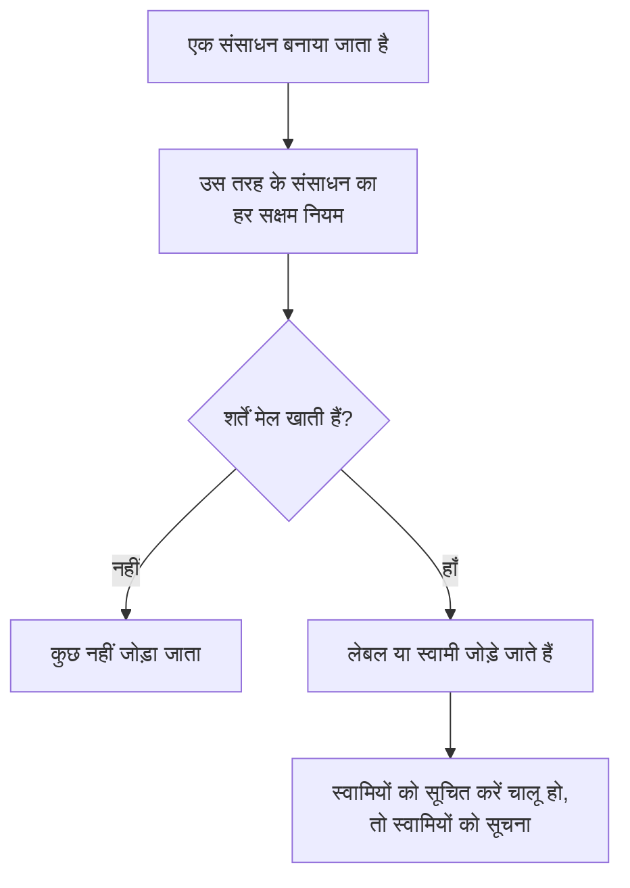

# लेबल और स्वामी नियम

लेबल नियम और स्वामी नियम आपके संसाधनों को आपके लिए व्यवस्थित रखते हैं। **लेबल नियम** उससे मेल खाने वाले हर नए संसाधन पर लेबल लगाता है, और **स्वामी नियम** उसमें स्वामी उपयोगकर्ता और टीमें जोड़ता है। इस तरह डेटाबेस की कोई नई घटना अपने आप _Database_ लेबल पाती है और डेटाबेस टीम की हो जाती है, बिना किसी को यह याद रखे।

:::cards
- [नियम बनाएँ](#नियम-बनाना): दो चरण: पहले नियम किससे मेल खाता है, फिर वह क्या जोड़ता है।
- [लेबल और स्वामी इनहेरिट करें](#लेबल-और-स्वामी-इनहेरिट-करना): किसी इवेंट के मॉनिटर, होस्ट और सेवाओं पर जो है, उसे आगे बढ़ाएँ।
- [नियम कब चलते हैं](#नियम-कब-चलते-हैं): नए संसाधनों पर, और पहले से मौजूद संसाधनों के लिए **Run Now**।
:::

## यह कैसे काम करता है

नियम तब चलते हैं जब कोई संसाधन बनाया जाता है। हर सक्षम नियम नए संसाधन पर अपनी शर्तें जाँचता है, और मेल खाने वाला हर नियम वह जोड़ता है जो वह जोड़ता है।

लेबल और स्वामी से तय होता है कि आप संसाधनों को कैसे फ़िल्टर और समूहित करते हैं, OneUptime उनके बारे में किसे सूचित करता है, और [लेबल-सीमित और स्वामित्व-सीमित अनुमतियाँ](/docs/permissions/index) किन तक पहुँचती हैं। नियम इन्हें एक जैसा रखते हैं, बिना किसी को यह याद रखे।

## नियम कहाँ मिलते हैं

लेबल और स्वामी वाले हर प्रोडक्ट में दोनों नियम उसकी **सेटिंग्स** के नीचे होते हैं (घटनाओं, अलर्ट और अनुसूचित रखरखाव में **नियम** के नीचे): मॉनिटर, घटनाएं और घटना एपिसोड, अलर्ट और अलर्ट एपिसोड, अनुसूचित रखरखाव इवेंट, स्थिति पृष्ठ, सेवाएं, होस्ट, Kubernetes क्लस्टर, Docker होस्ट, Docker Swarm क्लस्टर, Podman होस्ट, Proxmox क्लस्टर, VMware vCenter, Ceph क्लस्टर, स्टोरेज ऐरे, डेटाबेस, क्यू, IoT फ़्लीट, सर्वरलेस फ़ंक्शन, क्लाउड संसाधन, RUM एप्लिकेशन, डैशबोर्ड, ऑन-कॉल नीतियां, ऑन-कॉल अनुसूचियां, इनकमिंग कॉल नीतियां, वर्कफ़्लो, रनबुक, नेटवर्क डिवाइस और SLO।

उदाहरण के लिए, मॉनिटर लेबल नियम **मॉनिटर → सेटिंग्स → लेबल नियम** पर हैं, और घटना लेबल नियम **घटनाएं → नियम → लेबल नियम** पर। साइड मेनू में **सेटिंग्स** और **नियम** शुरू में फ़ोल्ड रहते हैं: खोलने के लिए सेक्शन के शीर्षक पर क्लिक करें। घटनाओं और अलर्ट के पेजों पर एक **Incident Rules** (या **Alert Rules**) टैब और एक **Episode Rules** टैब होता है।

## नियम बनाना

हर लेबल और स्वामी नियम एक ही तरह से, दो चरणों में बनाया जाता है।

:::steps
### नियमों की सूची खोलें

प्रोडक्ट का **लेबल नियम** या **स्वामी नियम** पेज खोलें और उसका बनाने वाला बटन क्लिक करें, जिसका नाम नियम पर रखा गया है, जैसे **Monitor Label Rule बनाएँ**।

### चुनें कि नियम किससे मेल खाता है

**मिलान** चरण पर, संसाधन को जो भी शर्त पूरी करनी है, उसके लिए **शर्त जोड़ें** क्लिक करें। दो या ज़्यादा शर्तें हों, तो **सभी से मिलान** या **किसी से भी मिलान** चुनें। बिना शर्त वाला नियम हर नए संसाधन से मेल खाता है।

### चुनें कि नियम क्या जोड़ता है

**लेबल** चरण पर, **जोड़ने के लिए लेबल** चुनें। स्वामी नियम पर यह चरण **मालिक** है: **स्वामी जोड़ें** लोगों और टीमों की एक ही सूची खोलता है।

**नाम** आपके चुनाव से अपने आप भर जाता है (*Production जोड़ें*, *Platform को स्वामी के रूप में जोड़ें*) और तब तक आपके चुनाव के साथ बदलता है जब तक आप अपना नाम नहीं लिखते। जो नियम केवल इनहेरिट करता है, उसका नाम इसके बजाय उस पर रखा जाता है जिससे वह इनहेरिट करता है (नीचे देखें)।

### फ़ोल्ड किए गए फ़ील्ड जाँचें

**और फ़ील्ड** में वैकल्पिक **विवरण** है और, स्वामी नियम पर, **स्वामियों को सूचित करें**, जो डिफ़ॉल्ट रूप से चालू रहता है: नियम जिन स्वामियों को जोड़ता है, उन्हें वही "आपको स्वामी के रूप में जोड़ा गया" सूचना मिलती है जो हाथ से जोड़े गए स्वामी को मिलती है। स्वामियों को चुपचाप जोड़ने के लिए इसे बंद करें।

### नियम सहेजें

आखिरी चरण पर, नियम के नाम वाला बटन फिर से क्लिक करें, जैसे **Monitor Label Rule बनाएँ**। नियम सक्षम स्थिति में शुरू होता है, और सूची उसे हरे **सक्षम** पिल के साथ दिखाती है।
:::

नए नियम को कुछ जोड़ना ही होता है: कम से कम एक लेबल (या स्वामी), या घटना, अलर्ट या अनुसूचित रखरखाव नियम पर, कुछ ऐसा जिसे वह इनहेरिट करता है (नीचे देखें)। किसी नियम को हटाए बिना रोकने के लिए, उसके संपादन फ़ॉर्म पर **सक्षम** बंद करें; तब सूची लाल **अक्षम** पिल दिखाती है।

### नियम चाहे जैसे भी बना हो

API, Terraform, वर्कफ़्लो या [लेबल नियम आयात](/docs/configuration/label-rule-import-export) से बने नियम पर भी यही लागू होता है: OneUptime कुछ न जोड़ने वाले नए नियम को अस्वीकार करता है, और एक संदेश देता है जो बताता है कि कौन से फ़ील्ड भरने हैं। ये संदेश हर भाषा में अंग्रेज़ी में दिखते हैं।

| नियम | संदेश |
| --- | --- |
| लेबल नियम | This label rule adds nothing. Choose at least one label in Labels to Add. |
| घटना, अलर्ट या अनुसूचित रखरखाव लेबल नियम | This label rule adds nothing. Choose at least one label in Labels to Add, or turn on an Inherit Labels switch. |
| स्वामी नियम | This owner rule adds nothing. Choose at least one user or team in Owner Users or Owner Teams. |
| घटना, अलर्ट या अनुसूचित रखरखाव स्वामी नियम | This owner rule adds nothing. Choose at least one user or team in Owner Users or Owner Teams, or turn on an Inherit Owners switch. |

- **API**: `labelsToAdd` (या `ownerUsers` / `ownerTeams`) को प्रोजेक्ट के कम से कम एक रिकॉर्ड पर सेट करें, या नियम के `inheritLabelsFrom…` (`inheritOwnersFrom…`) स्विच में से किसी एक को `true` पर, जो एक JSON boolean है।
- **Terraform**: जिस लेबल या स्वामी नियम रिसोर्स में जोड़ने को कुछ नहीं है, वह ऊपर दिए संदेश के साथ `terraform apply` पर विफल होता है। उसे `labels_to_add` (या `owner_users` / `owner_teams`) दें, या उसका कोई इनहेरिट स्विच चालू करें।

आपके पहले से मौजूद नियमों को छुआ नहीं जाता: [नियम संपादित करना](#नियम-संपादित-करना) देखें।

## लेबल और स्वामी इनहेरिट करना

घटना, अलर्ट और अनुसूचित रखरखाव नियम उन संसाधनों पर जो है उसे भी आगे बढ़ा सकते हैं जिन्हें कोई इवेंट छूता है। **जोड़ने के लिए लेबल** (या **मालिक**) के नीचे, फ़ोल्ड किए गए **लेबल इनहेरिट करें** (या **स्वामी इनहेरिट करें**) सेक्शन में छह स्विच हैं:

- **मॉनिटर से लेबल इनहेरिट करें**: घटना के मॉनिटरों का हर लेबल घटना पर भी लगता है। अलर्ट का एक ही मॉनिटर होता है, इसलिए अलर्ट नियम पर यह स्विच **मॉनिटर से लेबल इनहेरिट करें** है (और अलर्ट स्वामी नियम पर **मॉनिटर से स्वामी इनहेरिट करें**)।
- **होस्ट्स से लेबल इनहेरिट करें**, **Kubernetes क्लस्टर्स से लेबल इनहेरिट करें**, **Docker होस्ट्स से लेबल इनहेरिट करें**, **Inherit Labels From Podman Hosts** और **सेवाओं से लेबल इनहेरिट करें** उन संसाधनों के लिए यही करते हैं।

स्वामी नियमों में स्वामियों के लिए यही छह स्विच हैं (**मॉनिटर से स्वामी इनहेरिट करें** आदि)। जब तक कोई स्विच चालू नहीं होता, फ़ोल्ड किया गया सेक्शन बताता है कि वह किसलिए है; इनहेरिट करने वाले नियम पर वह अपने आप खुल जाता है। एपिसोड नियमों में इनहेरिट स्विच नहीं होते।

इनहेरिट करने वाला नियम **जोड़ने के लिए लेबल** (या **मालिक**) खाली छोड़ सकता है: वह वही जोड़ता है जो वह इनहेरिट करता है। ऐसे नियम का नाम उस पर रखा जाता है जिससे वह इनहेरिट करता है:

| चालू स्विच | नाम |
| --- | --- |
| **मॉनिटर से लेबल इनहेरिट करें** | *मॉनिटर से लेबल इनहेरिट करें* |
| **मॉनिटर से लेबल इनहेरिट करें** और **होस्ट्स से लेबल इनहेरिट करें** | *मॉनिटर, होस्ट से लेबल इनहेरिट करें* |
| अलर्ट नियम पर **मॉनिटर से लेबल इनहेरिट करें** | *मॉनिटर से लेबल इनहेरिट करें* |

नाम तब तक स्विचों के साथ बदलता है जब तक आप कोई लेबल नहीं चुनते (तब नियम का नाम उसके लेबलों पर रखा जाता है) या अपना नाम नहीं लिखते।

## नियम संपादित करना

नियम के संपादन फ़ॉर्म में वही दो चरण होते हैं और **सक्षम** स्विच जुड़ जाता है। यह इस पर ज़ोर नहीं देता कि नियम क्या जोड़ता है: OneUptime के यह पूछने से पहले सहेजा गया नियम, चाहे API, Terraform, आयात या पुराने फ़ॉर्म से, कुछ भी न जोड़ता हो, यह संभव है, और संपादन से नियम का जोड़ा हुआ सब कुछ हटाया भी जा सकता है।

ऐसे नियम का नाम अब भी बदला जा सकता है, उसे बंद किया या हटाया जा सकता है, API और Terraform से भी। सूची कुछ न जोड़ने वाले नियम की स्थिति के बगल में **कुछ नहीं जोड़ता** दिखाती है, और नियम का अपना पेज भी। यह चुनने के लिए कि वह क्या जोड़े, उसे संपादित करें, या उसे हटा दें।

## नियम कब चलते हैं

हर सक्षम नियम तब चलता है जब कोई संसाधन बनाया जाता है, चाहे डैशबोर्ड से या API से, और मेल खाने वाला हर नियम वह जोड़ता है जो वह जोड़ता है:

- मेल खाने वाले कई नियम अपने सभी लेबल और स्वामी जोड़ते हैं।
- नियम कभी कुछ नहीं हटाता: न किसी के हाथ से जोड़े गए लेबल या स्वामी, न वे जो उसने खुद जोड़े।
- अक्षम नियम कुछ नहीं करता।

आज लिखा गया नियम उसके बाद बनने वाले संसाधनों पर लागू होता है। इसे पहले से मौजूद संसाधनों पर लागू करने के लिए **Run Now** का इस्तेमाल करें: [मौजूदा संसाधनों पर नियम चलाना](/docs/configuration/run-rules-now) देखें। लेबल नियमों को प्रोजेक्ट्स के बीच कॉपी भी किया जा सकता है: [लेबल नियम आयात और निर्यात करना](/docs/configuration/label-rule-import-export) देखें।

## अगले कदम

:::cards
- [मौजूदा संसाधनों पर नियम चलाना](/docs/configuration/run-rules-now): किसी नियम को उन संसाधनों पर लागू करें जो आपके पास पहले से हैं।
- [लेबल नियम आयात और निर्यात करना](/docs/configuration/label-rule-import-export): लेबल नियमों को JSON के रूप में प्रोजेक्ट्स के बीच कॉपी करें।
- [घटना सेटिंग्स और स्वचालन](/docs/incidents/settings): घटना पर चल सकने वाले दूसरे नियम।
- [SLO लेबल और स्वामी नियम](/docs/slo/label-and-owner-rules): SLO नियम किससे मेल खाते हैं।
:::
