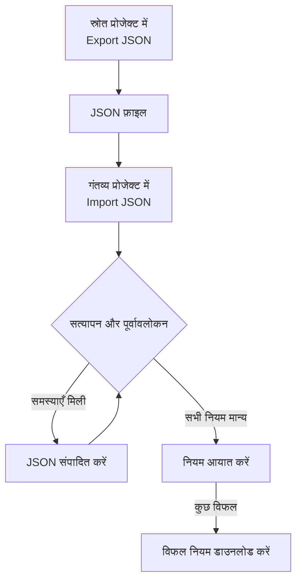

# लेबल नियम आयात और निर्यात करना

लेबल नियमों को JSON फ़ाइल के रूप में प्रोजेक्ट्स के बीच कॉपी करें, या एक साथ कई नियम बनाएँ। हर **लेबल नियम** पेज के **अधिक विकल्प** (**⋯**) मेनू में **Export JSON** और **Import JSON** एक्शन होते हैं, घटनाओं, अलर्ट, मॉनिटर और नेटवर्क डिवाइस सहित। एकमात्र अपवाद VMware है: उसके vCenter लेबल नियमों में इनमें से कोई नहीं है।



## नियम निर्यात करना

**अधिक विकल्प** खोलें और **Export JSON** चुनें, ताकि मौजूदा प्रोजेक्ट में उस प्रकार के सभी नियम डाउनलोड हो जाएँ। निर्यात में तालिका के दूसरे पेजों के नियम भी शामिल होते हैं, और तालिका के फ़िल्टर अनदेखे किए जाते हैं।

फ़ाइल हर नियम की सक्षम स्थिति, शर्तें, जोड़ने के लिए लेबल और लेबल इनहेरिटेंस विकल्प रखती है। प्रोजेक्ट ID, नियम ID और ऑडिट फ़ील्ड छोड़ दिए जाते हैं।

जुड़े हुए लेबल, मॉनिटर और गंभीरताएँ उनके सटीक नामों से लिखी जाती हैं। आयात इन्हें नहीं बनाता: ये गंतव्य प्रोजेक्ट में पहले से मौजूद होने चाहिए।

## नियम आयात करना

:::steps
### Import JSON खोलें

गंतव्य प्रोजेक्ट का **लेबल नियम** पेज खोलें और **अधिक विकल्प → Import JSON** चुनें।

### फ़ाइल जोड़ें

JSON निर्यात फ़ाइल अपलोड करें, या उसकी सामग्री पेस्ट करें।

### सत्यापित करें और पूर्वावलोकन देखें

**Validate and preview** चुनें। कोई भी नियम बनने से पहले हर नियम की जाँच होती है, और संदर्भित संसाधन गंतव्य प्रोजेक्ट में अद्वितीय, मेल खाते नामों के साथ मौजूद होने चाहिए।

### पूर्वावलोकन की समीक्षा करें

नियमों के नाम, सक्षम स्थिति, लेबल और शर्तें जाँचें। बड़ा बैच एक बार में एक पेज दिखाया जाता है। कुछ ठीक करने के लिए, **Edit JSON** चुनें और फिर से सत्यापित करें।

### आयात करें

आयात बटन चुनें, जो नियमों की गिनती दिखाता है (उदाहरण के लिए **Import 2 rules**), और नतीजे दिखने तक विंडो खुली रखें।
:::

आयात नए नियम जोड़ता है और मौजूदा नियम बनाए रखता है, इसलिए वही फ़ाइल दोबारा आयात करने पर एक और कॉपी बनती है। हर नियम पर सामान्य बनाने की अनुमतियाँ और सर्वर सत्यापन लागू होते हैं।

अगर कुछ नियम विफल हों, तो केवल उन पंक्तियों को सहेजने के लिए **Download failed rules** चुनें, उन्हें ठीक करें और वह फ़ाइल फिर से आयात करें। अगर किसी अनुरोध का समय समाप्त हो जाए, तो दोबारा कोशिश करने से पहले नियमों की सूची देखें: हो सकता है सर्वर ने जवाब खोने से पहले नियम सहेज लिया हो।

## JSON में बैच बनाना

अपने संसाधन प्रकार का उदाहरण पाने के लिए किसी मौजूदा नियम को निर्यात करें, फिर `items` ऐरे में एंट्री संपादित करें या जोड़ें। यह उदाहरण दो मॉनिटर लेबल नियम बनाता है। लेबल `Production` और `Infrastructure` गंतव्य प्रोजेक्ट में पहले से मौजूद होने चाहिए।

```json title="monitor-label-rules.json"
{
  "fileType": "oneuptime-label-rules",
  "schemaVersion": 1,
  "resourceType": "MonitorLabelRule",
  "items": [
    {
      "name": "Production API monitors",
      "description": "Label production API monitors automatically",
      "isEnabled": true,
      "monitorNamePattern": "^api-prod-",
      "monitorLabels": [],
      "labelsToAdd": ["Production"]
    },
    {
      "name": "Database monitors",
      "isEnabled": false,
      "monitorNamePattern": "^database-",
      "labelsToAdd": ["Infrastructure"]
    }
  ]
}
```

| फ़ील्ड | इसमें क्या होता है |
| --- | --- |
| `fileType` | हमेशा `oneuptime-label-rules`। |
| `schemaVersion` | हमेशा `1`। |
| `resourceType` | फ़ाइल में किस प्रकार के नियम हैं, जैसे `MonitorLabelRule`। |
| `items` | नियम, हर नियम के लिए एक ऑब्जेक्ट। फ़ाइल में कम से कम एक होना चाहिए। |

`isEnabled` के लिए JSON boolean, पैटर्न के लिए टेक्स्ट, और जुड़े हुए संसाधनों के लिए नामों के ऐरे इस्तेमाल करें।

ये आयात चरण से पहले पूरे बैच को रोक देते हैं: अमान्य पैटर्न, अज्ञात फ़ील्ड, गायब नाम और अस्पष्ट संदर्भ। कुछ न जोड़ने वाला नियम भी ऐसा ही करता है, यानी खाली `labelsToAdd` और, घटना, अलर्ट या अनुसूचित रखरखाव नियम पर, `true` पर सेट कोई भी `inheritLabelsFrom…` स्विच नहीं, क्योंकि OneUptime ऐसा नियम बनाने से इनकार करता है ([लेबल और स्वामी नियम](/docs/configuration/label-and-owner-rules#नियम-चाहे-जैसे-भी-बना-हो) देखें)। अगर ऐसा नियम उस जाँच से पहले सहेजा गया था, तो निर्यात में वह हो सकता है; आयात करने से पहले उसे कोई लेबल दें या उसे फ़ाइल से हटा दें।

> [!NOTE]
> फ़ाइलें और पेस्ट किया गया JSON 10 MB तक सीमित हैं।

## संसाधन प्रकारों के बीच कॉपी करना

फ़ाइल में मूल `resourceType` रहने दें और गंतव्य पेज पर **Import JSON** खोलें। संगत मुख्य नाम या शीर्षक पैटर्न, विवरण पैटर्न और पूर्वापेक्षित लेबल गंतव्य के फ़ील्ड से मैप किए जाते हैं, और पूर्वावलोकन इन मैपिंग की सूची दिखाता है ताकि आप उनकी समीक्षा कर सकें। घटना और अलर्ट की गंभीरता के संदर्भ गंतव्य के गंभीरता नामों से मिलाए जाते हैं।

गंतव्य जिन शर्तों या एक्शन का समर्थन नहीं करता, वे आयात को रोक देते हैं। उदाहरण के लिए, विशिष्ट मॉनिटरों तक सीमित घटना नियम को उन शर्तों को संपादित किए बिना नेटवर्क डिवाइस नियमों में कॉपी नहीं किया जा सकता।

> [!WARNING]
> नेटवर्क डिवाइस और SLO लेबल नियम रेगुलर एक्सप्रेशन के साथ-साथ वाइल्डकार्ड मिलान का भी समर्थन करते हैं। इन नियमों और दूसरे प्रकार के नियमों के बीच स्थानांतरण में `*` वाले या आगे-पीछे खाली जगह वाले पैटर्न अस्वीकार किए जाते हैं, क्योंकि वहाँ वे अलग तरह से मेल खाते हैं। गंतव्य के लिए उन पैटर्न को संपादित करें, या नियम को उसी संसाधन प्रकार के भीतर रखें। नेटवर्क डिवाइस और SLO लेबल नियम एक-दूसरे से कोई भी पैटर्न बदल सकते हैं, क्योंकि वे एक ही तरह से मेल खाते हैं।

## अगले कदम

:::cards
- [लेबल और स्वामी नियम](/docs/configuration/label-and-owner-rules): लेबल नियम किससे मेल खाता है और क्या जोड़ता है।
- [मौजूदा संसाधनों पर नियम चलाना](/docs/configuration/run-rules-now): आयात किए गए नियमों को उन संसाधनों पर लागू करें जो आपके पास पहले से हैं।
:::
