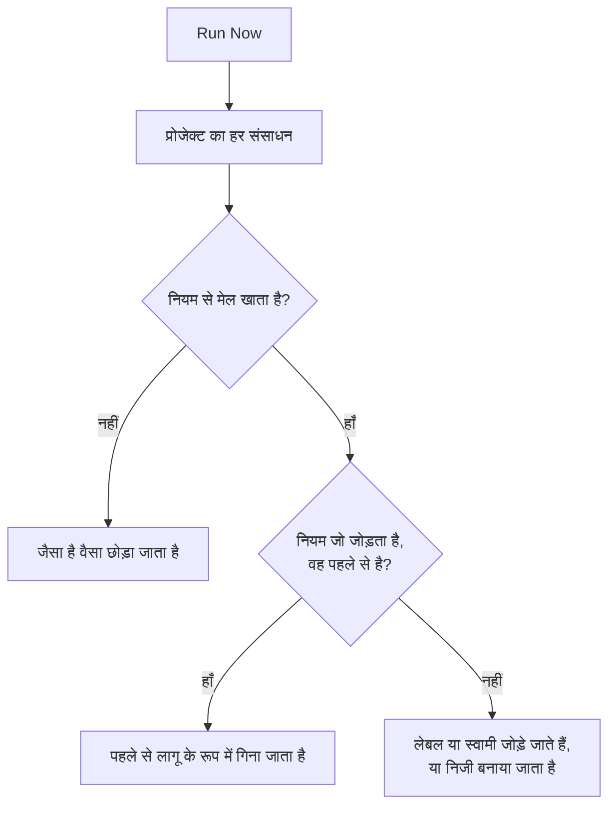

# मौजूदा संसाधनों पर नियम चलाना

लेबल नियम, स्वामी नियम और गोपनीयता नियम किसी संसाधन के **बनाए जाने** पर अपने आप चलते हैं। इसलिए आज लिखा गया नियम उन मॉनिटरों, घटनाओं या होस्ट पर कुछ नहीं करता जो आपके पास पहले से हैं। **Run Now** यह कमी पूरी करता है: यह एक नियम को प्रोजेक्ट में पहले से मौजूद हर संसाधन पर लागू करता है।

## कौन से नियम चलाए जा सकते हैं

- **लेबल नियम** और **स्वामी नियम**, हर उस संसाधन के लिए जिसमें ये हैं: मॉनिटर, घटनाएं, घटना एपिसोड, अलर्ट, अलर्ट एपिसोड, अनुसूचित रखरखाव इवेंट, स्थिति पृष्ठ, सेवाएं, होस्ट, Kubernetes क्लस्टर, Docker होस्ट, Docker Swarm क्लस्टर, Podman होस्ट, Proxmox क्लस्टर, VMware vCenter, Ceph क्लस्टर, स्टोरेज ऐरे, डेटाबेस, क्यू, IoT फ़्लीट, सर्वरलेस फ़ंक्शन, क्लाउड संसाधन, RUM एप्लिकेशन, डैशबोर्ड, ऑन-कॉल नीतियां, ऑन-कॉल अनुसूचियां, इनकमिंग कॉल नीतियां, वर्कफ़्लो, रनबुक, नेटवर्क डिवाइस और SLO।
- **गोपनीयता नियम**, घटनाओं, अलर्ट, घटना एपिसोड और अलर्ट एपिसोड के लिए।
- स्थिति पृष्ठ पर **Monitor Rules**। ये हर बार नियम सहेजे जाने पर पेज को पहले से फिर से सिंक करते हैं; इन्हें चलाने पर पेज तुरंत फिर से सिंक होता है।
- SLO पर **Monitor Rules**। ये हर बार नियम सहेजे जाने पर SLO को पहले से फिर से सिंक करते हैं; इन्हें चलाने पर SLO के मॉनिटर तुरंत फिर से सिंक होते हैं। [मॉनिटर और मॉनिटर नियम](/docs/slo/monitor-rules) देखें।

जो नियम किसी संसाधन का वर्णन करने के बजाय कोई कार्रवाई करते हैं, यानी **ऑन-कॉल नियम**, **Runbook नियम**, **स्वचालित सुधार नियम** और **समूहीकरण नियम**, वे मौजूदा रिकॉर्ड पर नहीं चलाए जा सकते। उन्हें चलाने पर पहले ही खत्म हो चुकी घटनाओं के लिए लोगों को पेज किया जाता, रनबुक चलाई जातीं, सुधार शुरू किए जाते या एपिसोड फिर से व्यवस्थित किए जाते।

## शुरू करने से पहले

कोई नियम चलाने के लिए आपको नियम संपादित करने की अनुमति **और** उन संसाधनों को संपादित करने की अनुमति चाहिए जिन्हें वह बदलता है। उदाहरण के लिए, मॉनिटर लेबल नियम को मॉनिटर लेबल नियम और मॉनिटर, दोनों की संपादन अनुमतियाँ चाहिए। स्वामी नियमों को स्वामी जोड़ने की अनुमति भी चाहिए। स्थिति पृष्ठ या SLO पर मॉनिटर नियमों को केवल नियम संपादित करने की अनुमति चाहिए।

> [!IMPORTANT]
> विशिष्ट लेबलों तक, या आपके स्वामित्व वाले संसाधनों तक सीमित अनुमति काफ़ी नहीं है: एक रन प्रोजेक्ट के हर संसाधन को बदल सकता है। टीम की ब्लॉक सूचियाँ वैसे ही लागू होती हैं जैसे हर जगह, और कुछ लेबलों तक सीमित ब्लॉक भी गिना जाता है: रन उन लेबलों वाले संसाधनों को बदलता, इसलिए नियम जिन संसाधनों को बदलता है उनके संपादन पर लेबल वाला ब्लॉक रन को अस्वीकार कर देता है।

नेटवर्क के नियम भी पहले से मौजूद डिवाइस पर चलाने पर यही माँगते हैं। साइट असाइनमेंट या डिवाइस लेबल नियम के **Run Now** को नियम संपादित करने की अनुमति और **Edit Network Device** चाहिए। ऑटो इंपोर्ट नियम के **Dry Run** और **Run Rule** को नियम संपादित करने की अनुमति, **Create Network Device** और, जब नियम में मॉनिटर टेम्पलेट हो, **Create Monitor** चाहिए। हर अनुमति पूरे प्रोजेक्ट तक पहुँचनी चाहिए। [ऑटो इंपोर्ट नियमों से अपने आप इंपोर्ट करना](/docs/monitor/network-device-monitor#importing-automatically-with-auto-import-rules) देखें।

## एक नियम चलाना

:::steps
### नियमों की सूची खोलें

नियमों का पेज खोलें, उदाहरण के लिए **मॉनिटर → सेटिंग्स → लेबल नियम**।

### Run Now चुनें

नियम की पंक्ति के अंत में **⋯** मेनू खोलें और **Run Now** चुनें, या **देखें** चुनें और फिर नियम के अपने पेज पर **Run Now**। एक डायलॉग बताता है कि रन क्या करेगा।

### चुनें कि नए स्वामियों को सूचित करना है या नहीं

स्वामी नियम के लिए, चुनें कि **Notify the owners this run adds** चालू करना है या नहीं। यह डिफ़ॉल्ट रूप से बंद रहता है, और तभी असर करता है जब नियम में खुद **स्वामियों को सूचित करें** चालू हो। किसी स्वामी को हर उस संसाधन के लिए एक बार सूचना मिलती है जिसमें उसे जोड़ा जाता है।

### नियम चलाएँ

**Run Rule** चुनें और डायलॉग खुला रखें। बड़े प्रोजेक्ट पर डायलॉग दिखाता है कि रन कितना आगे बढ़ा है।

### रिपोर्ट पढ़ें

रन पूरा होने पर डायलॉग बताता है कि नियम कितने संसाधनों से मेल खाया, उसने कितने बदले, और कितनों में पहले से वह था जो नियम जोड़ता है।
:::

## कई नियम चलाना

तालिका में नियम चुनें, बल्क एक्शन मेनू खोलें और **Run Now** चुनें। चुने गए नियम एक के बाद एक चलते हैं।

- बल्क रन से जोड़े गए स्वामियों को कभी सूचित नहीं किया जाता। उन्हें सूचित करने के लिए, इसके बजाय एक नियम चलाएँ।
- जो नियम नहीं चल सकता, उदाहरण के लिए क्योंकि वह अक्षम है, उसे कारण के साथ सूची में दिखाया जाता है, और बाकी नियम फिर भी चलते हैं।

## रन क्या करता है

- **यह केवल जोड़ता है।** लेबल लगाए जाते हैं, स्वामी जोड़े जाते हैं, संसाधन निजी बनाए जाते हैं। कुछ भी हटाया नहीं जाता और कुछ भी सार्वजनिक नहीं किया जाता, इसलिए नियम दोबारा चलाना सुरक्षित है: दूसरा रन बताता है कि सब कुछ पहले से लागू था।
- **प्रोजेक्ट के हर संसाधन का मूल्यांकन होता है**, हल हो चुकी घटनाओं और अलर्ट सहित।
- **मौजूदा स्वामी छोड़ दिए जाते हैं**, कभी दो बार नहीं जोड़े जाते।
- **केवल आपके प्रोजेक्ट के अपने लेबल जोड़े जाते हैं।** नियम में दिया गया कोई लेबल अगर अब आपके प्रोजेक्ट का लेबल नहीं है, तो उसे छोड़ दिया जाता है, और नियम के दूसरे लेबल फिर भी जोड़े जाते हैं। नए संसाधन पर नियम चलने पर भी यही होता है।
- **नियम उसी तरह लागू होता है जैसे बनाते समय**, घटना के मॉनिटर, होस्ट और सेवाओं से इनहेरिट किए गए लेबल और स्वामी सहित। जहाँ संसाधन की गतिविधि फ़ीड होती है, फ़ीड दर्ज करती है कि किस नियम ने उसे बदला।
- **अक्षम नियम नहीं चलते।** पहले नियम को सक्षम करें।
- **स्थिति पृष्ठ मॉनिटर नियम** उन मॉनिटरों को जोड़ते हैं जिनसे वे मेल खाते हैं, और उन मॉनिटरों को हटाते हैं जो उन्होंने पहले जोड़े थे पर अब मेल नहीं खाते। पेज पर हाथ से जोड़े गए मॉनिटरों को कभी छुआ नहीं जाता।
- **एक रन अधिकतम 100,000 संसाधनों को कवर करता है।** इससे बड़े प्रोजेक्ट पर रन रुक जाता है और यह बताता है; जारी रखने के लिए नियम फिर से चलाएँ।

## अगले कदम

:::cards
- [लेबल और स्वामी नियम](/docs/configuration/label-and-owner-rules): वे नियम लिखें जिन्हें रन लागू करता है।
- [लेबल नियम आयात और निर्यात करना](/docs/configuration/label-rule-import-export): पहले किसी दूसरे प्रोजेक्ट से लेबल नियम लाएँ।
- [घटना सेटिंग्स और स्वचालन](/docs/incidents/settings): घटना नियम, गोपनीयता नियमों सहित।
:::
