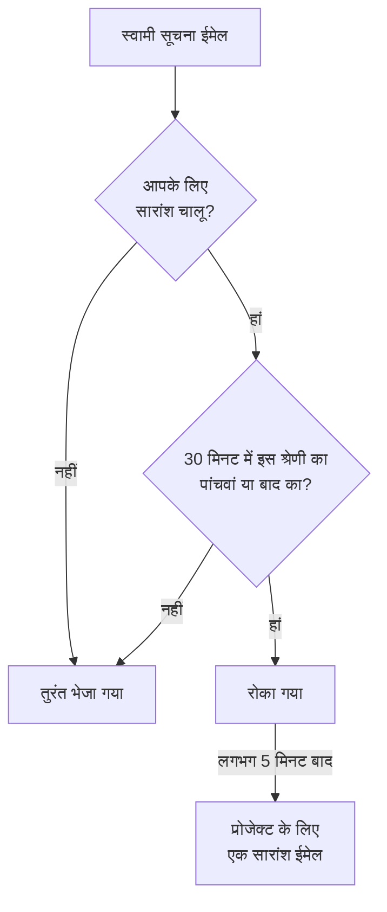

# सूचना सारांश

जब कुछ बुरी तरह बिगड़ता है, तो वह शायद ही कभी एक बार बिगड़ता है। एक अस्थिर अपस्ट्रीम लिंक चालीस मॉनिटर गिरा देता है, चालीस घटनाएं घोषित, स्वीकार और हल की जाती हैं, और हर स्वामी को हर कदम पर एक ईमेल मिलता है: एक ही इनबॉक्स में दो सौ संदेश, और कोई उन्हें अब पढ़ता नहीं।

OneUptime ऐसी बौछारों को अपने आप एक ईमेल में समेट देता है। यह सबके लिए चालू है और इसमें कुछ कॉन्फ़िगर नहीं करना पड़ता — लेकिन अगर आप हर सूचना को अलग ईमेल के रूप में पाना चाहते हैं, तो आप प्रोजेक्ट-दर-प्रोजेक्ट [अपने लिए सारांश बंद कर सकते हैं](#अपने-लिए-सारांश-बंद-करना)।

:::cards
- [यह कैसे काम करता है](#यह-कैसे-काम-करता-है): चार ईमेल तुरंत जाते हैं; बाकी एक साथ आते हैं।
- [जिसका सारांश कभी नहीं बनता](#जिसका-सारांश-कभी-नहीं-बनता): ऑन-कॉल पेजिंग, सुरक्षा, बिलिंग और सब्सक्राइबर ईमेल।
- [सारांश बंद करें](#अपने-लिए-सारांश-बंद-करना): हर सूचना फिर से अलग ईमेल के रूप में पाएं।
- [कम नियमित ईमेल](#और-कम-करना): सूचनात्मक ईमेल एक बार में बंद करें।
:::

## यह कैसे काम करता है

आपको मिलने वाला हर स्वामी सूचना ईमेल एक छोटे बजट में गिना जाता है, जो प्रोजेक्ट, प्राप्तकर्ता, ईमेल पते और संसाधन की **श्रेणी** के हिसाब से अलग-अलग रखा जाता है — घटनाएं, अलर्ट, मॉनिटर, अनुसूचित रखरखाव, स्थिति पृष्ठ, प्रोब, SLO वगैरह।



- किसी भी तीस मिनट की अवधि में किसी श्रेणी के **पहले चार** ईमेल तुरंत भेजे जाते हैं, ठीक पहले की तरह। वही विषय, वही टेम्पलेट, वही लिंक।
- उस अवधि का **पांचवां और उसके बाद का हर** ईमेल रोक लिया जाता है।
- लगभग पांच मिनट बाद, उस प्रोजेक्ट में आपके लिए रोकी गई हर चीज़ — सभी श्रेणियों में — **एक** ईमेल के रूप में आती है, जिसमें बताया जाता है कि क्या हुआ और हर संसाधन का लिंक होता है।

सारांश में वे सूचनाएं शामिल होती हैं जिनकी सदस्यता भेजे जाने के समय भी आपके पास है। अगर किसी इवेंट की सूचनाएं कतार में रहते हुए आप उसका ईमेल बंद कर देते हैं, तो वे सूचनाएं सारांश से हटा दी जाती हैं। बाद में ईमेल फिर से चालू करने पर छोड़े गए अपडेट दोबारा नहीं भेजे जाते।

सीमा से नीचे यह सुविधा कुछ नहीं करती। जो प्रोजेक्ट दिन में तीन स्वामी ईमेल बनाता है, वह अब भी उन तीनों को अलग-अलग भेजता है।

## सारांश ईमेल कैसा दिखता है

विषय पंक्ति ईमेल खोलने से पहले ही तूफ़ान का पैमाना *और प्रकार* बता देती है:

```text
[Acme Production] 112 notifications: 63 Monitors, 41 Incidents, 6 Alerts +2 more
```

अंदर एक सारांश कार्ड कुल संख्या, सारांश की समय-सीमा और श्रेणी के अनुसार विवरण दिखाता है। उसके नीचे सूचनाएं हर श्रेणी के एक खंड में समूहित होती हैं, सबसे ज़रूरी पहले — घटनाएं, फिर अलर्ट, फिर वे मॉनिटर और प्रोब जिन्होंने उन्हें पकड़ा — ताकि सारांश के नीचे पहली चीज़ वही हो जिस पर सबसे पहले क्लिक करना चाहिए।

हर खंड में हर इवेंट के लिए एक पंक्ति के बजाय हर संसाधन के लिए एक पंक्ति होती है:

- **पंक्तियां दिखाती हैं कि संसाधन आख़िर में किस स्थिति में पहुंचा।** अगर कोई घटना बनाई गई, फिर स्वीकार की गई, फिर हल की गई, तो वह अपनी नवीनतम स्थिति वाली एक ही पंक्ति है, जिससे सारांश तीन अलग ईमेल की तुलना में *ज़्यादा* ताज़ा रहता है।
- **गिनती मेल खाती है।** हर पंक्ति में उसके सबसे हाल के अपडेट का समय होता है, और कई अपडेट समेटने वाली पंक्ति बताती है कि कितने, ताकि खंड और सारांश कार्ड हमेशा एक ही कुल संख्या दें।
- **गंभीरता और स्थिति दिखाई जाती है।** अलर्ट और घटना के कार्ड अपनी नवीनतम सूचना की गंभीरता और स्थिति दिखाते हैं, कस्टम नामों सहित। इन जानकारियों के बिना कतार में पड़ी पुरानी सूचनाएं भी दिखती हैं, बस उपलब्ध न होने वाले लेबल छोड़ दिए जाते हैं।

समय UTC में दिखाया जाता है, और जब सारांश एक से ज़्यादा दिन का हो तो तारीख़ भी।


## जिसका सारांश कभी नहीं बनता

सारांश केवल स्वामी और सदस्य सूचनाओं पर लागू होता है — "जिसके आप ज़िम्मेदार हैं उसमें कुछ बदला" वाला परिवार। यह किसी और चीज़ तक पहुंच ही नहीं सकता, क्योंकि यह उसी एक कोड पथ के अंदर है जिससे ये सूचनाएं गुज़रती हैं, और कोई दूसरी नहीं।

कभी देर नहीं होती, और कभी गिना नहीं जाता:

| श्रेणी | उदाहरण |
| ----------------------------------------- | ---------------------------------------------------------------------------------------------------- |
| ऑन-कॉल पेजिंग | हर एस्केलेशन नीति का पेज और हर स्वीकृति अनुरोध |
| ऑन-कॉल समय | "आप अभी ऑन-कॉल हैं", "अगले ऑन-कॉल आप हैं", "आपकी शिफ़्ट जल्द शुरू होगी", "आपकी शिफ़्ट फिर से सौंपी गई" |
| खाते की सुरक्षा | पासवर्ड रीसेट, ईमेल सत्यापन, पासवर्ड बदला गया, दो-चरणीय बैकअप कोड इस्तेमाल हुआ या फिर से बनाया गया |
| आपके खाते से जुड़ी प्रशासनिक सूचनाएं | किसी व्यवस्थापक ने आपकी सूचना विधियां या आपके ऑन-कॉल नियम बदले |
| बिलिंग और बैलेंस | चालान, सदस्यता बकाया, "कार्ड अस्वीकार होने से हम किसी को पेज नहीं कर सके" |
| इंस्टेंस की सेहत | इंस्टेंस व्यवस्थापकों को Postgres, Valkey और ClickHouse की चेतावनियां |
| स्थिति पृष्ठ के सब्सक्राइबर | आपका स्थिति पृष्ठ आपके अपने सब्सक्राइबरों को जो भी ईमेल भेजता है |
| SLA उल्लंघन | घटना-बनाई-गई सूचना प्रकार का दोबारा उपयोग करने के बावजूद तुरंत भेजे जाते हैं |

केवल ईमेल प्रभावित होता है। SMS, फ़ोन कॉल, पुश सूचनाएं, WhatsApp, Telegram, Slack, Microsoft Teams और वेबहुक तुरंत पहुंचाए जाते हैं, ठीक पहले की तरह — उन सूचनाओं के लिए भी जिनका ईमेल रोका गया था।

## सीमाएं

| सीमा | मान |
| --- | --- |
| एक सारांश ईमेल में सूचनाएं | अधिकतम **500**। इससे ज़्यादा कतार में रहती हैं और अगले सारांश में जाती हैं, अधिकतम पांच मिनट बाद। |
| एक सारांश ईमेल में दिखाई गई पंक्तियां | अधिकतम **100**। पंक्तियां हर संसाधन के हिसाब से समेटी जाती हैं, इसलिए यह 100 अलग संसाधन हैं; इसके आगे ईमेल पूरी कुल संख्या बताता है और प्रोजेक्ट का लिंक देता है। |
| एक प्रोजेक्ट से एक प्राप्तकर्ता को सारांश ईमेल | प्रति घंटा अधिकतम **12**। |
| रोकी गई सूचना में जुड़ने वाली देरी | सबसे खराब स्थिति में लगभग छह मिनट। |

प्रति घंटे की सीमा टाइमर नहीं, डेटाबेस लागू करता है, इसलिए घंटों चलने वाले तूफ़ान में भी यह बनी रहती है।

## अपने लिए सारांश बंद करना

कुछ लोगों को एक साथ पाना पसंद है। दूसरे हर सूचना को आते ही फ़ाइल करते हैं, या मेलबॉक्स को ऐसी चीज़ को सौंप देते हैं जो यह करती है, और सारांश ईमेल इसमें बाधा डालता है। इसलिए सारांश को हर व्यक्ति और हर प्रोजेक्ट के लिए बंद किया जा सकता है।

:::steps
### ईमेल प्राथमिकताएँ खोलें

प्रोजेक्ट में **उपयोगकर्ता सेटिंग्स → ईमेल प्राथमिकताएँ** पर जाएं — यही वह पेज है जिसका लिंक हर सारांश ईमेल के नीचे होता है।

### Email Rollup बंद करें

**Email Rollup** कार्ड में स्विच बंद करें। यह अपने आप सहेज जाता है, और फिर कार्ड पर "Off: every notification arrives as its own email, immediately." दिखता है।
:::

इसे बंद करने पर उस प्रोजेक्ट का हर स्वामी और सदस्य सूचना ईमेल फिर से आपको अलग-अलग और तुरंत भेजा जाता है: वही विषय, वही टेम्पलेट, वही लिंक, कोई सीमा नहीं और पांच मिनट का कोई इंतज़ार नहीं। बंद करते समय जो कुछ पहले से आपके लिए कतार में था, वह कुछ मिनट बाद एक आख़िरी सारांश के रूप में आता है; उसके बाद सब कुछ एक-एक करके आता है।

यह स्विच **सिर्फ़ आपका है और एक ही प्रोजेक्ट तक सीमित है**। इसे बंद करने से आपके सहकर्मियों को मिलने वाली चीज़ें नहीं बदलतीं, और यह दूसरे प्रोजेक्टों पर लागू नहीं होता — इसलिए शोर वाला प्रोडक्शन प्रोजेक्ट सारांश बनाता रह सकता है जबकि शांत आंतरिक प्रोजेक्ट सब कुछ अलग से भेजता है, या इसका उल्टा। जब तक लोग इसे बंद न करें, यह सबके लिए चालू रहता है।

यह किन चीज़ों को **नहीं** छूता:

- **आपको कौन-सी सूचनाएं मिलती हैं।** यह **उपयोगकर्ता सेटिंग्स → सूचना सेटिंग्स** के तहत हर इवेंट प्रकार और हर चैनल वाली सेटिंग है, ठीक अगले पेज पर। सारांश और यह स्विच सिर्फ़ यह बदलते हैं कि वे सूचनाएं कितने ईमेल में समाती हैं।
- **ऑन-कॉल पेजिंग और शिफ़्ट ईमेल**, **खाते की सुरक्षा के ईमेल**, **बिलिंग ईमेल**, इंस्टेंस की सेहत की चेतावनियां और स्थिति पृष्ठ सब्सक्राइबर ईमेल। इनमें से किसी का भी कभी सारांश नहीं बनता, इसलिए सारांश बंद करने से इन पर कोई असर नहीं पड़ता — देखें [जिसका सारांश कभी नहीं बनता](#जिसका-सारांश-कभी-नहीं-बनता)।
- **कोई भी दूसरा चैनल।** SMS, फ़ोन कॉल, पुश, WhatsApp, Telegram, Slack, Microsoft Teams और वेबहुक पहले से तुरंत होते हैं।

## और कम करना

सारांश नियमित अपडेट को एक साथ समेटता है; आप उनमें से ज़्यादातर पाना बंद भी कर सकते हैं।

:::steps
### सारांश ईमेल से प्राथमिकताएँ खोलें

किसी सारांश ईमेल के नीचे प्राथमिकताओं का लिंक खोलें, या **उपयोगकर्ता सेटिंग्स → ईमेल प्राथमिकताएँ** पर जाएं।

### Reduce routine emails चुनें

**Fewer routine emails** कार्ड में **Reduce routine emails** चुनें। बदलाव सहेजे जाने पर कार्ड बताता है: **नियमित ईमेल बंद कर दिए गए।**
:::

इससे मौजूदा प्रोजेक्ट में आपके लिए ये सूचनात्मक ईमेल बंद हो जाते हैं:

- घटनाओं, अलर्ट, एपिसोड और अनुसूचित रखरखाव पर पोस्ट किए गए नोट।
- यह सूचना कि आपको किसी संसाधन का स्वामी जोड़ा गया।
- नए मॉनिटर और स्थिति पृष्ठ।
- मौजूदा एपिसोड में जोड़ी गई घटनाएं या अलर्ट।
- किसी ऑन-कॉल नीति में जोड़ा जाना या उससे हटाया जाना।

घटना और अलर्ट बनने, स्थिति बदलने, रिमाइंडर, घटना असाइनमेंट, मॉनिटर की सेहत और ऑन-कॉल शिफ़्ट के लिए आपकी मौजूदा पसंद बनी रहती है, और आपने जो ईमेल बंद किया था वह चालू नहीं होता। पेजिंग, दूसरे डिलीवरी चैनल, खाते के ईमेल, बिलिंग ईमेल और स्थिति पृष्ठ सब्सक्राइबर ईमेल पर कोई असर नहीं पड़ता।

बदलाव एक साथ सहेजे जाते हैं। किसी एक ईमेल को फिर से चालू करने के लिए **उपयोगकर्ता सेटिंग्स → सूचना सेटिंग्स** के तहत हर इवेंट वाले स्विच देखें। ये प्राथमिकताएँ सारांश की प्रतीक्षा कर रही सूचनाओं पर भी लागू होती हैं; पहले से भेजा गया ईमेल वापस नहीं लिया जा सकता। ईमेल सारांश एक अलग सेटिंग बनी रहती है जो उन इवेंट को समेटने का तरीका तय करती है जिन्हें आप रखते हैं।

## समस्या निवारण

:::details एक सूचना ईमेल कुछ मिनट देर से आया
वह तीस मिनट के भीतर अपनी श्रेणी का पांचवां या बाद का ईमेल था, इसलिए उसे रोका गया और लगभग पांच मिनट बाद सारांश में भेजा गया। उसी प्रोजेक्ट का सारांश ईमेल खोजें: सूचना उसमें एक पंक्ति है। पेजिंग और दूसरे चैनलों में देरी नहीं हुई।
:::

:::details मैंने सारांश बंद किया फिर भी सारांश ईमेल आया
बंद करते समय जो सूचनाएं पहले से आपके लिए कतार में थीं, वे कुछ मिनट बाद एक आख़िरी सारांश के रूप में आती हैं। उसके बाद सब कुछ एक-एक ईमेल में आता है।
:::

:::details सारांश ईमेल में एक अपेक्षित अपडेट नहीं है
हर पंक्ति किसी संसाधन को उसकी नवीनतम स्थिति में दिखाती है, इसलिए बनाई, स्वीकार और हल की गई घटना एक ही पंक्ति है, जिसमें समेटे गए अपडेट की संख्या होती है। अगर सूचना कतार में रहते हुए आपने **उपयोगकर्ता सेटिंग्स → सूचना सेटिंग्स** के तहत उस इवेंट का ईमेल बंद कर दिया था, तो भी वह सूचना हटा दी जाती है।
:::

## अगले कदम

:::cards
- [SMTP कॉन्फ़िगरेशन](/docs/emails/smtp): OneUptime के ईमेल अपने मेल सर्वर से भेजें।
- [एस्केलेशन नियम](/docs/on-call/escalation-rules): ऑन-कॉल पेजिंग लोगों तक कैसे पहुंचती है, बिना कभी सारांश बने।
:::
