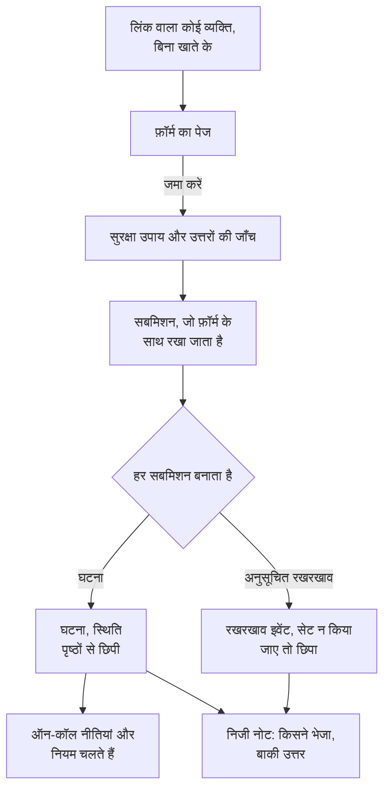

# फ़ॉर्म का अवलोकन

फ़ॉर्म एक पेज है जिसे उसके लिंक वाला कोई भी व्यक्ति OneUptime खाते के बिना भर सकता है। हर सबमिशन आपके प्रोजेक्ट में कुछ बनाता है: समस्या की रिपोर्ट के लिए एक **घटना**, या बदलाव और रखरखाव के अनुरोधों के लिए एक **अनुसूचित रखरखाव इवेंट**। आप फ़ॉर्म के प्रश्न ड्रैग-एंड-ड्रॉप बिल्डर में बनाते हैं, तय करते हैं कि उत्तर रिकॉर्ड कैसे बनें, और लिंक उन लोगों के साथ साझा करते हैं जिन्हें इसका इस्तेमाल करना है।

फ़ॉर्म तब इस्तेमाल करें जब समस्या को नोटिस करने वाले, या जिन्हें बदलाव चाहिए, वे लोग आपकी घटनाओं और रखरखाव को चलाने वाले लोग न हों: सपोर्ट एजेंट, किसी दूसरे विभाग के सहकर्मी, स्टोर मैनेजर, किसी ग्राहक की ऑपरेशंस टीम। वे लिंक खोलते हैं, आपके प्रश्नों के उत्तर देते हैं और **जमा करें** दबाते हैं। आपकी टीम को एक सामान्य घटना या इवेंट मिलता है, जिसके फ़ील्ड में उत्तर होते हैं और एक निजी नोट होता है जो दर्ज करता है कि इसे किसने भेजा।

:::cards
- [अपना पहला फ़ॉर्म बनाएँ](#अपना-पहला-फ़ॉर्म-बनाएँ): खाली फ़ॉर्म से लेकर साझा करने योग्य लिंक तक।
- [फ़ॉर्म बनाना](/docs/forms/building): प्रश्न, उत्तर के प्रकार, छिपे प्रश्न, टेम्पलेट और ब्रांडिंग।
- [सबमिशन क्या बनाता है](/docs/forms/on-submit): उत्तर और सेटिंग्स कैसे घटना या रखरखाव इवेंट बनते हैं।
- [साझा करना और सुरक्षा](/docs/forms/sharing-and-security): लिंक, IP अनुमति सूची, रेट लिमिट और समस्या निवारण।
:::

## फ़ॉर्म कैसे काम करता है



हर अनुरोध पहले फ़ॉर्म के सुरक्षा उपायों से गुज़रता है: उसका अपना पेज, रेट लिमिट, IP अनुमति सूची और कैप्चा। जिस सबमिशन के उत्तर सही बैठते हैं, वह रखा जाता है और एक रिकॉर्ड बनाता है, जो उत्तरों, फ़ॉर्म की **सबमिट करने पर** सेटिंग्स और, घटना के लिए, उसके घटना टेम्पलेट से भरा जाता है। उसका बनाया कुछ भी तब तक किसी स्थिति पृष्ठ तक नहीं पहुँचता जब तक आपकी टीम यह तय न करे।

## एक नज़र में

- **अपना अलग प्रोडक्ट** — **फ़ॉर्म** प्रोडक्ट मेनू में `/dashboard/{projectId}/forms` पर है। हर फ़ॉर्म का अपना लिंक होता है, जैसे OneUptime Cloud पर `https://oneuptime.com/accounts/form/<share-key>`।
- **किसी खाते की ज़रूरत नहीं** — लिंक वाला कोई भी व्यक्ति साइन इन किए बिना फ़ॉर्म खोल और जमा कर सकता है।
- **बिल्डर, सेटिंग्स पेज नहीं** — अपने खुद के प्रश्न जोड़ें (छोटे उत्तर, अनुच्छेद, ड्रॉपडाउन, तारीखें, चेकबॉक्स और भी बहुत कुछ), फ़ॉर्म जो बनाता है उसके फ़ील्ड (शीर्षक, विवरण, गंभीरता, मॉनिटर, लेबल, शुरुआत और अंत), आपके कस्टम फ़ील्ड, और भेजने वाले का नाम और ईमेल। उन्हें खींचकर क्रम में लगाएँ, फ़ॉर्म का पूर्वावलोकन देखें, सहेजें।
- **हर मान कहाँ से आता है, यह आप तय करते हैं** — **सबमिट करने पर** पेज नई घटना या इवेंट के हर फ़ील्ड को उसके स्रोत के साथ दिखाता है: कोई उत्तर, कोई डिफ़ॉल्ट, हमेशा लागू होने वाली कोई सेटिंग, या घटना टेम्पलेट।
- **किसी के प्रकाशित करने तक छिपा** — फ़ॉर्म से बनी घटनाएँ घोषित होने पर कभी स्थिति पृष्ठों पर नहीं दिखतीं या सब्सक्राइबरों को नहीं भेजी जातीं; रखरखाव इवेंट भी नहीं, जब तक फ़ॉर्म ऐसा न कहे।
- **कई परतों में सुरक्षित** — **सबमिशन स्वीकार करना** स्विच, वैकल्पिक **IP अनुमति सूची**, दूसरी वेबसाइटों से आए अनुरोधों का अस्वीकार, रेट लिमिट, इंस्टेंस का कैप्चा, और हर उत्तर पर आकार की सीमाएँ।
- **हर सबमिशन रखा जाता है** — हर फ़ॉर्म का **सबमिशन** पेज, और सभी फ़ॉर्म के लिए **फ़ॉर्म → सबमिशन**, उत्तरों की सूची दिखाते हैं और हर सबमिशन ने जो बनाया उससे लिंक करते हैं।
- **आपकी अपनी ब्रांडिंग** — **बनाएँ** पेज के **ब्रांडिंग** सेक्शन में फ़ॉर्म के पेज के ऊपर के लिए लोगो और ब्राउज़र टैब के लिए फ़ेविकॉन अपलोड करें। जब तक आप ऐसा नहीं करते, फ़ॉर्म OneUptime का दिखाता है।
- **आम मामलों के लिए टेम्पलेट** — उत्तरों के नाम वाले सेट सहेजें, जैसे **एप्लिकेशन आउटेज** या **नियोजित रखरखाव**, और लोग फ़ॉर्म के ऊपर उनमें से एक चुनकर उसे भरते हैं, या उसका अपना लिंक खोलते हैं। हर टेम्पलेट अपने मामले के लिए किसी प्रश्न को आवश्यक, वैकल्पिक या छिपा भी बना सकता है। एक फ़ॉर्म, और एक बुकमार्क, पूरी टीम के काम आता है।
- **छिपे प्रश्न** — ऐसा प्रश्न छिपाएँ जिसका उत्तर किसी को न देना पड़े, जैसे घटना का विवरण, और हर टेम्पलेट को उसका उत्तर देने दें, या उन मामलों में पूछें जिन्हें उसकी ज़रूरत है।
- **फ़ॉर्म डुप्लिकेट करें** — किसी चलते हुए फ़ॉर्म से, उसके प्रश्नों, टेम्पलेट और सेटिंग्स के साथ, किसी दूसरी टीम के लिए फ़ॉर्म शुरू करें।

## फ़ॉर्म क्या बना सकता है

फ़ॉर्म बनाते समय आप चुनते हैं कि **हर सबमिशन बनाता है** क्या। आप इसे बाद में फ़ॉर्म के **सबमिट करने पर** पेज पर बदल सकते हैं।

| हर सबमिशन बनाता है | किसके लिए | क्या होता है |
| --- | --- | --- |
| **घटना** | समस्या की रिपोर्ट | घटना तुरंत घोषित होती है, इसलिए आपकी ऑन-कॉल नीतियां और नियम चलते हैं और ऑन-कॉल लोगों को बताया जाता है। जब तक कोई रिस्पॉन्डर इसे प्रकाशित नहीं करता, यह स्थिति पृष्ठों से दूर रहती है। |
| **अनुसूचित रखरखाव** | बदलाव और रखरखाव के अनुरोध | भेजने वाले के माँगे गए समय के लिए रखरखाव इवेंट निर्धारित होता है। जब तक फ़ॉर्म कुछ और न कहे, यह अपने स्थिति पृष्ठों से दूर रहता है और किसी सब्सक्राइबर को नहीं बताता। |

फ़ॉर्म इन दो से शुरू होते हैं, और आगे और तरह के रिकॉर्ड आएँगे।

## शुरू करने से पहले

- **ऐसा प्लान जिसमें फ़ॉर्म शामिल हों।** OneUptime Cloud पर फ़ॉर्म के लिए **Growth** प्लान या उससे ऊपर चाहिए। [प्लान](#प्लान) देखें।
- **फ़ॉर्म बनाने की अनुमति।** **Create Form** प्रोजेक्ट के स्वामियों और एडमिन के पास होती है, और उन भूमिकाओं के पास जिन्हें आप यह देते हैं। [अनुमतियाँ](#अनुमतियाँ) देखें।
- **घटना फ़ॉर्म के लिए, एक गंभीरता।** हर घटना को एक गंभीरता चाहिए: किसी प्रश्न से, फ़ॉर्म की सेटिंग्स से या उसके घटना टेम्पलेट से। इसके बिना हर सबमिशन अस्वीकार हो जाता है। [सबमिशन क्या बनाता है](/docs/forms/on-submit#how-a-submission-becomes-an-incident) देखें।

## अपना पहला फ़ॉर्म बनाएँ

:::steps
### फ़ॉर्म बनाना शुरू करें

प्रोडक्ट मेनू से **फ़ॉर्म** खोलें और **फ़ॉर्म बनाएँ** क्लिक करें। फ़ॉर्म को एक नाम दें (उसके सार्वजनिक पेज का शीर्षक, प्रोजेक्ट में अद्वितीय), चुनें कि **हर सबमिशन बनाता है** क्या, और चाहें तो Markdown में एक विवरण दें, जो सार्वजनिक पेज के ऊपर दिखता है।

### उसके प्रश्न तैयार करें

फ़ॉर्म अपने **बनाएँ** पेज पर खुलता है, जो पहले से ही शीर्षक, विवरण और भेजने वाले के बारे में पूछ रहा होता है (और, रखरखाव फ़ॉर्म के लिए, यह कि रखरखाव कब शुरू और खत्म होता है)। प्रश्न जोड़ें, हटाएँ और उनका क्रम बदलें, फिर **परिवर्तन सहेजें** क्लिक करें। [फ़ॉर्म बनाना](/docs/forms/building) देखें।

### तय करें कि सबमिशन क्या बनाता है

**सबमिट करने पर** पर जाँचें कि सबमिशन कैसे घटना या इवेंट बनता है, और उसे डिफ़ॉल्ट देने के लिए **सेटिंग्स संपादित करें** क्लिक करें: गंभीरता, घटना टेम्पलेट, हमेशा जोड़े जाने वाले मॉनिटर और लेबल, और बताए जाने वाले स्वामी। [सबमिशन क्या बनाता है](/docs/forms/on-submit) देखें।

### अगर लोग एक जैसे मामले रिपोर्ट करते हैं, तो टेम्पलेट जोड़ें

**टेम्पलेट** पर, हर उस मामले के लिए टेम्पलेट सहेजें जिसे लोग अक्सर रिपोर्ट करते हैं: फ़ॉर्म उन्हें अपने प्रश्नों के ऊपर दिखाता है, चुने गए टेम्पलेट से खुद भर जाता है, और प्रश्न वैसे पूछता है जैसा वह टेम्पलेट कहता है। किसी एक मामले को जिस प्रश्न की ज़रूरत है, वह उसके टेम्पलेट में आवश्यक और बाकी में छिपा हो सकता है। [टेम्पलेट](/docs/forms/building#templates) देखें।

### लिंक साझा करें

**साझा करें** पर लिंक कॉपी करें और उन लोगों को भेजें जिन्हें फ़ॉर्म इस्तेमाल करना है। [साझा करना और सुरक्षा](/docs/forms/sharing-and-security) देखें।
:::

> [!IMPORTANT]
> नया फ़ॉर्म बनते ही **सबमिशन स्वीकार करना** स्थिति में होता है, लेकिन जब तक आप उसका लिंक साझा नहीं करते, कोई उस तक नहीं पहुँच सकता। पहले उसके प्रश्न और सुरक्षा उपाय सेट करें।

## फ़ॉर्म के पेज

| पेज | इसमें क्या होता है |
| --- | --- |
| **बनाएँ** | फ़ॉर्म का नाम और विवरण, उसकी **ब्रांडिंग** (लोगो और फ़ेविकॉन, फ़ोल्ड की हुई), और बिल्डर: उसके प्रश्न, प्रश्न पैलेट और **पूर्वावलोकन**। |
| **टेम्पलेट** | उत्तरों के नाम वाले सेट जिनसे लोग फ़ॉर्म शुरू कर सकते हैं, हर एक प्रश्न कैसे पूछता है, वह टेम्पलेट जिसके साथ फ़ॉर्म खुलता है, और हर एक का अपना लिंक। |
| **सबमिट करने पर** | हर सबमिशन क्या बनाता है, और उसका हर फ़ील्ड कैसे भरा जाता है। **सेटिंग्स संपादित करें** डिफ़ॉल्ट और हमेशा लागू होने वाली चीज़ें बदलता है। |
| **साझा करें** | **सबमिशन स्वीकार करना**, **साझा करने का लिंक**, जमा करने के बाद दिखने वाला संदेश, और **IP अनुमति सूची**। |
| **सबमिशन** | फ़ॉर्म से किया गया हर सबमिशन, सबसे नया पहले, उसके उत्तरों और उसके बनाए रिकॉर्ड के साथ। |
| **फ़ॉर्म डुप्लिकेट करें** | **उन्नत** के नीचे: फ़ॉर्म की एक कॉपी, जिसका नाम आपके लिए रखा जाता है, उसके प्रश्नों, टेम्पलेट, सबमिट करने पर सेटिंग्स, ब्रांडिंग, धन्यवाद संदेश और IP अनुमति सूची के साथ, और उसका अपना लिंक। कॉपी बंद स्थिति में शुरू होती है, और अपने बिल्डर पर खुलती है। |
| **फ़ॉर्म हटाएँ** | **उन्नत** के नीचे, फ़ॉर्म को हटाना। उसके सबमिशन उसके साथ हट जाते हैं; उसकी बनाई घटनाएँ और इवेंट नहीं हटते। |

फ़ॉर्म के मेनू के **डेवलपर** सेक्शन में, हर दूसरे संसाधन की तरह, उसके Terraform, API और AI असिस्टेंट पेज होते हैं।

## फ़ॉर्म और घटना टेम्पलेट

टेम्पलेट और फ़ॉर्म, दोनों आपको एक ही घटना दो बार टाइप करने से बचाते हैं, लेकिन वे अलग-अलग लोगों के काम आते हैं:

| | घटना टेम्पलेट | फ़ॉर्म |
| --- | --- | --- |
| कौन इस्तेमाल करता है | आपकी टीम, OneUptime में साइन इन करके | लिंक वाला कोई भी व्यक्ति, बिना खाते के |
| कहाँ | घटनाओं की सूची पर **टेम्पलेट से बनाएँ** | फ़ॉर्म के लिंक पर उसका अपना पेज |
| वे क्या बदल सकते हैं | घोषित करने से पहले घटना का हर फ़ील्ड | केवल आपके चुने प्रश्नों के उत्तर |
| उन्हें क्या दिखता है | आपके मॉनिटर, नीतियां, स्वामी और हर फ़ील्ड | फ़ॉर्म का नाम, विवरण और प्रश्न, और केवल वे विकल्प जो आपने देने चुने |
| स्थिति पृष्ठ | जो टेम्पलेट और घोषणा फ़ॉर्म कहें | किसी रिस्पॉन्डर के घटना प्रकाशित करने तक छिपा |

ये साथ मिलकर काम करते हैं। किसी घटना फ़ॉर्म को उसके **सबमिट करने पर** पेज पर एक **घटना टेम्पलेट** दें, और उसकी घोषित हर घटना उस टेम्पलेट से घोषित होगी: टेम्पलेट उसके लिए बनाएँ जो आपकी टीम को घटना पर चाहिए, और फ़ॉर्म उसके लिए जो आप भेजने वाले से पूछना चाहते हैं।

## सबमिशन

फ़ॉर्म का **सबमिशन** पेज उससे किए गए हर सबमिशन की सूची दिखाता है, सबसे नया पहले, **सबमिट किया गया**, **सबमिट करने वाला** (भेजने वाले का दिया नाम और ईमेल, या **गुमनाम**) और **बनाया गया** के साथ, जो उसकी बनाई घटना या इवेंट का लिंक है। **उत्तर देखें** हर उत्तर वैसा ही दिखाता है जैसा भेजने वाले ने दिया। **फ़ॉर्म → सबमिशन** प्रोजेक्ट के हर फ़ॉर्म के सबमिशन की सूची दिखाता है।

सबमिशन फ़ॉर्म लिखता है, कभी हाथ से नहीं, और उन्हें संपादित नहीं किया जा सकता। किसी एक को हटाने पर उसके उत्तर और भेजने वाले का नाम और ईमेल सूची से हट जाते हैं; उसकी बनाई घटना या इवेंट बनी रहती है, और उस पर का निजी नोट भी, जो भेजने वाले के विवरण और उत्तर दोहराता है। जब घटना या इवेंट हटाई जाती है, तो उसका सबमिशन बना रहता है, और उसके **बनाया गया** कॉलम में **बाद में हटाया गया** लिखा होता है।

> [!WARNING]
> जब आप किसी का व्यक्तिगत डेटा हटाते हैं, तो सबमिशन हटाना काफ़ी नहीं है: उसकी बनाई घटना या इवेंट पर का निजी नोट भी संपादित करें या हटाएँ।

## अनुमतियाँ

फ़ॉर्म आपकी टीम से बाहर के लोगों को आपके प्रोजेक्ट में घटनाएँ और रखरखाव इवेंट बनाने देते हैं, इसलिए इन्हें प्रोजेक्ट के स्वामी और एडमिन, और वे भूमिकाएँ प्रबंधित करती हैं जिन्हें आप **Form** अनुमतियाँ देते हैं। ये [अनुमति संदर्भ](/docs/permissions/reference) के **Form** समूह में हैं:

| अनुमति | यह क्या करने देती है | डिफ़ॉल्ट रूप से किसके पास |
| --- | --- | --- |
| **Create Form** | फ़ॉर्म बनाना, और उन्हें डुप्लिकेट करना। | Project Owner, Project Admin |
| **Edit Form** | फ़ॉर्म बदलना: उसके प्रश्न, उसकी ब्रांडिंग, उसके टेम्पलेट, उसकी सबमिट करने पर सेटिंग्स, **सबमिशन स्वीकार करना**, उसका लिंक और **IP अनुमति सूची**। | Project Owner, Project Admin |
| **Delete Form** | फ़ॉर्म हटाना, और उसके साथ उसके सबमिशन। | Project Owner, Project Admin |
| **Read Form** | फ़ॉर्म, उनके प्रश्न, उनकी सेटिंग्स और उनके लिंक देखना। | ऊपर वाले, साथ ही Project Member, Viewer, और घटना और अनुसूचित रखरखाव की भूमिकाएँ |
| **Read Form Submission** | सबमिशन और उनके उत्तर देखना। | Project Owner, Project Admin |
| **Delete Form Submission** | सबमिशन हटाना। | Project Owner, Project Admin |

सबमिशन में वह होता है जो अजनबियों ने टाइप किया (नाम, ईमेल पते, और ऐसे उत्तर जो शायद कभी रिकॉर्ड तक न पहुँचें), इसलिए जब तक आप **Read Form Submission** नहीं देते, उन्हें केवल प्रोजेक्ट के स्वामी और एडमिन देखते हैं। जो भी फ़ॉर्म पढ़ सकता है, वह उसका लिंक देख और साझा कर सकता है। फ़ॉर्म जमा करने के लिए किसी अनुमति की ज़रूरत नहीं होती। भूमिकाएँ और बारीक अनुमतियाँ कैसे मिलती हैं, इसके लिए [उपयोगकर्ता, टीमें और अनुमतियाँ](/docs/permissions/index) देखें।

## प्लान

OneUptime Cloud पर फ़ॉर्म के लिए **Growth** प्लान या उससे ऊपर चाहिए, और फ़ॉर्म की **IP अनुमति सूची** के लिए **Scale**, चाहे वह फ़ॉर्म बनाते समय सेट की जाए या बाद में संपादित की जाए। **Growth** प्लान से नीचे के, या जिनकी सदस्यता का भुगतान नहीं हुआ है, ऐसे प्रोजेक्ट के लिंक उपलब्ध-नहीं वाला संदेश दिखाते हैं, और कुछ नहीं बनता।

## API से फ़ॉर्म

फ़ॉर्म `/api/form` पर एक सामान्य API संसाधन हैं, और उनके सबमिशन `/api/form-submission` पर, जिन्हें आप पढ़ और हटा सकते हैं लेकिन बना या संपादित नहीं कर सकते। [API संदर्भ](/reference) में पूरे अनुरोध और प्रतिक्रिया के ढाँचे हैं।

### प्रश्न और सेटिंग्स

फ़ॉर्म के प्रश्न उसका `fields` कॉलम हैं, एक JSON सूची उसी क्रम में जिसमें फ़ॉर्म उन्हें पूछता है, और उसकी सबमिट करने पर सेटिंग्स उसका `targetSettings`:

```json
{
  "data": {
    "targetType": "Incident",
    "fields": [
      {
        "id": "what",
        "source": "TargetField",
        "targetField": "title",
        "label": "What is wrong?",
        "isRequired": true
      },
      {
        "id": "office",
        "source": "Question",
        "type": "Dropdown",
        "label": "Which office are you in?",
        "dropdownOptions": "Berlin\nLondon",
        "isRequired": false
      },
      {
        "id": "email",
        "source": "Submitter",
        "submitterField": "Email",
        "label": "Your Email",
        "isRequired": true
      }
    ],
    "targetSettings": {
      "incidentSeverityId": "<severity-id>",
      "labelIds": ["<label-id>"]
    }
  }
}
```

हर प्रश्न का अपना `id` (अक्षर, अंक, `-` और `_`), एक `source`, एक `label`, और वैकल्पिक `helpText` और `isRequired` होते हैं:

| `source` | यह क्या पूछता है |
| --- | --- |
| `Question` | फ़ॉर्म का अपना प्रश्न, जिसका उत्तर `type` के अनुसार दिया जाता है: `Text`, `LongText`, `Markdown`, `Number`, `Dropdown`, `MultiSelectDropdown`, `Boolean`, `Date` या `DateTime`। ड्रॉपडाउन अपने `dropdownOptions` दिखाता है, हर पंक्ति में एक। |
| `TargetField` | फ़ॉर्म जो बनाता है उसका एक फ़ील्ड, जिसे `targetField` से बताया जाता है: घटना के लिए `title`, `description`, `incidentSeverityId`, `monitors`, `labels` और `impactStartedAt`; रखरखाव इवेंट के लिए `title`, `description`, `startsAt`, `endsAt`, `monitors`, `statusPages` और `labels`। चुनकर उत्तर दिए जाने वाला फ़ील्ड अपने दिए जाने वाले रिकॉर्ड `allowedOptionIds` में बताता है। |
| `TargetCustomField` | घटना या इवेंट का कोई कस्टम फ़ील्ड, जिसे `customFieldId` से बताया जाता है। |
| `Submitter` | भेजने वाले का `Name` या `Email`, जिसे `submitterField` से बताया जाता है। |

जिस प्रश्न का `isHidden` `true` पर सेट है, वह सार्वजनिक पेज पर नहीं दिखता, कभी आवश्यक नहीं होता, और उसका उत्तर केवल उस टेम्पलेट से आता है जिसका नाम सबमिशन देता है, जब तक वह टेम्पलेट उसे पूछे नहीं। `isRequired` और `isHidden` फ़ॉर्म का डिफ़ॉल्ट हैं; हर टेम्पलेट प्रश्न को अपने तरीके से पूछ सकता है।

### API में टेम्पलेट

फ़ॉर्म के टेम्पलेट उसका `templates` कॉलम हैं, एक JSON सूची उसी क्रम में जिसमें फ़ॉर्म उन्हें दिखाता है। हर टेम्पलेट का अपना `id` (अक्षर, अंक, `-` और `_`), फ़ॉर्म के भीतर अद्वितीय, अधिकतम 100 अक्षरों का एक `name`, और प्रश्न id के अनुसार `answers` होते हैं, हर एक वैसा जैसा सबमिशन भेजता है: टेक्स्ट, कोई संख्या, `true` या `false`, किसी विकल्प का मान, या मल्टी-सेलेक्ट के लिए मानों की सूची। `isDefault` को `true` पर सेट करने से वह टेम्पलेट बनता है जिसके साथ फ़ॉर्म खुलता है; किसी फ़ॉर्म में ऐसा अधिकतम एक होता है, और अधिकतम 50 टेम्पलेट।

`fieldSettings`, जो भी प्रश्न id के अनुसार होता है, बताता है कि टेम्पलेट प्रश्न कैसे पूछता है: `Required`, `Optional` या `Hidden`। जिस प्रश्न को यह सूची में नहीं रखता (या `null` के रूप में रखता है), वह वैसे पूछा जाता है जैसे फ़ॉर्म पूछता है, और रखरखाव इवेंट के `startsAt` और `endsAt` प्रश्न केवल `Required` हो सकते हैं:

```json
{
  "data": {
    "templates": [
      {
        "id": "outage",
        "name": "Application Outage",
        "isDefault": true,
        "answers": {
          "what": "The application is down",
          "office": "Berlin"
        },
        "fieldSettings": {
          "office": "Required",
          "email": "Optional"
        }
      }
    ]
  }
}
```

प्रश्न, टेम्पलेट और सेटिंग्स हर बार सहेजे जाने पर जाँचे जाते हैं, चाहे डैशबोर्ड, API, Terraform या वर्कफ़्लो से, और नियम तोड़ने वाली सूची ऐसे संदेश के साथ अस्वीकार की जाती है जो बताता है कि क्या गलत है। `shareKey`, यानी फ़ॉर्म के लिंक की कुंजी, फ़ॉर्म बनने पर OneUptime सेट करता है, और इसे बदलना ही **लिंक रीसेट करें** का काम है।

### API में ब्रांडिंग

फ़ॉर्म की ब्रांडिंग उसके `logoFileId`, `logoAltText` और `faviconFileId` हैं। पहले फ़ॉर्म के प्रोजेक्ट में `POST /api/file` से इमेज अपलोड करें, उस प्रोजेक्ट की API कुंजी के साथ, या उसके सदस्य के रूप में साइन इन करके और `tenantid` हेडर में उसका id देकर। उसका `name`, उसका `fileType` (जैसे `image/png`), और `file` में base64 बाइट्स भेजें, और लौटाया गया `_id` सेट करें। जिस प्रोजेक्ट के आप सदस्य नहीं हैं, उसमें अपलोड "You can upload files only to a project you are a member of." के साथ अस्वीकार किया जाता है। हर अपलोड निजी होता है: `isPublic` OneUptime सेट करता है, अनुरोध चाहे जो कहे। फ़ॉर्म सहेजने पर हर इमेज की जाँच होती है: वह फ़ॉर्म के प्रोजेक्ट में अपलोड की गई होनी चाहिए, लोगो 512 KB या उससे छोटी PNG, JPEG, GIF, WebP या SVG इमेज होनी चाहिए, और फ़ेविकॉन इनमें से कोई या 128 KB या उससे छोटा ICO। OneUptime की इमेज पर लौटने के लिए id को `null` पर सेट करें। [ब्रांडिंग](/docs/forms/building#branding) देखें।

### सबमिशन पढ़ना

किसी फ़ॉर्म के सबमिशन की सूची पाने के लिए:

```bash
curl -X POST https://oneuptime.com/api/form-submission/get-list \
  -H "apikey: $ONEUPTIME_API_KEY" \
  -H "Content-Type: application/json" \
  -d '{
    "query": { "formId": "<form-id>" },
    "select": { "submitterName": true, "submitterEmail": true, "answers": true, "incidentId": true, "scheduledMaintenanceId": true, "createdAt": true },
    "limit": 50,
    "skip": 0
  }'
```

### वर्कफ़्लो

फ़ॉर्म में अपने आप बने वर्कफ़्लो कंपोनेंट होते हैं: **On Create Form**, **On Update Form** आदि। फ़ॉर्म ने जो बनाया उस पर कार्रवाई करने के लिए **On Create Incident** या **On Create Scheduled Maintenance** इस्तेमाल करें।

### सार्वजनिक पेज के अपने एंडपॉइंट

सार्वजनिक पेज दो रूट से बात करता है जिन्हें API कुंजी की ज़रूरत नहीं होती: `GET /api/form/public/<shareKey>`, जो फ़ॉर्म का नाम, विवरण और प्रश्न लौटाता है, और, जब हों, उसका लोगो, लोगो का वैकल्पिक टेक्स्ट और उसका फ़ेविकॉन (इमेज base64 में), और उसके टेम्पलेट, पेज के पूछे प्रश्नों के उनके उत्तरों के साथ; और `POST /api/form/public/<shareKey>/submit`, जो उसे जमा करता है और `templateId` में वह टेम्पलेट बताता है जिससे भेजने वाले ने शुरुआत की। ये पेज के अपने एंडपॉइंट हैं, इन पर कुछ बनाने के लिए API नहीं: हर कॉल फ़ॉर्म के सुरक्षा उपायों से गुज़रती है ([साझा करना और सुरक्षा](/docs/forms/sharing-and-security) देखें), और ये पेज के साथ बदलते हैं। अपने कोड से घटनाएँ बनाने के लिए API कुंजी के साथ `POST /api/incident` इस्तेमाल करें: [घटना घोषित करना](/docs/incidents/declaring-incidents) देखें।

## आपके घटना फ़ॉर्म कहाँ गए

फ़ॉर्म उन **Incident Forms** की जगह लेते हैं जो **घटनाएं → सेटिंग्स → फ़ॉर्म** के नीचे थे। अपग्रेड करते समय हर घटना फ़ॉर्म को उसी लिंक और उन्हीं सबमिशन के साथ यहाँ लाया गया:

- उसके प्रश्न बिल्डर के प्रश्न बन गए: शीर्षक, विवरण जब तक वह छिपा न हो, गंभीरता जब भेजने वाला उसे चुन सकता था, उसका पूछा हर कस्टम फ़ील्ड (उसी क्रम में जिसमें कस्टम फ़ील्ड लगे थे), और **Your Name** और **Your Email**, जो तब तक आवश्यक हैं जब तक फ़ॉर्म गुमनाम रिपोर्ट करने देता हो।
- उसकी गंभीरता और घटना टेम्पलेट उसके **सबमिट करने पर** डिफ़ॉल्ट बन गए।
- उसका **सक्षम** स्विच, सफलता संदेश और **IP अनुमति सूची** नहीं बदले, और न ही उसका लिंक: पुराने `/accounts/incident-form/<share-key>` लिंक फ़ॉर्म को उसके नए पते पर खोलते हैं।
- **Incident Form** अनुमतियाँ हर उस टीम और API कुंजी के लिए **Form** अनुमतियाँ बन गईं जिनके पास वे थीं।

पुराने डैशबोर्ड पेज नए पेजों पर रीडायरेक्ट होते हैं।

## अगले कदम

:::cards
- [फ़ॉर्म बनाना](/docs/forms/building): प्रश्न, उत्तर के प्रकार, जुड़े फ़ील्ड, कस्टम फ़ील्ड और पूर्वावलोकन।
- [सबमिशन क्या बनाता है](/docs/forms/on-submit): उत्तर और सबमिट करने पर सेटिंग्स कैसे घटना या रखरखाव इवेंट बनते हैं।
- [साझा करना और सुरक्षा](/docs/forms/sharing-and-security): लिंक, IP अनुमति सूची, रेट लिमिट, कैप्चा और समस्या निवारण।
- [घटना घोषित करना](/docs/incidents/declaring-incidents): घटनाएँ घोषित करने के दूसरे तरीके।
:::
