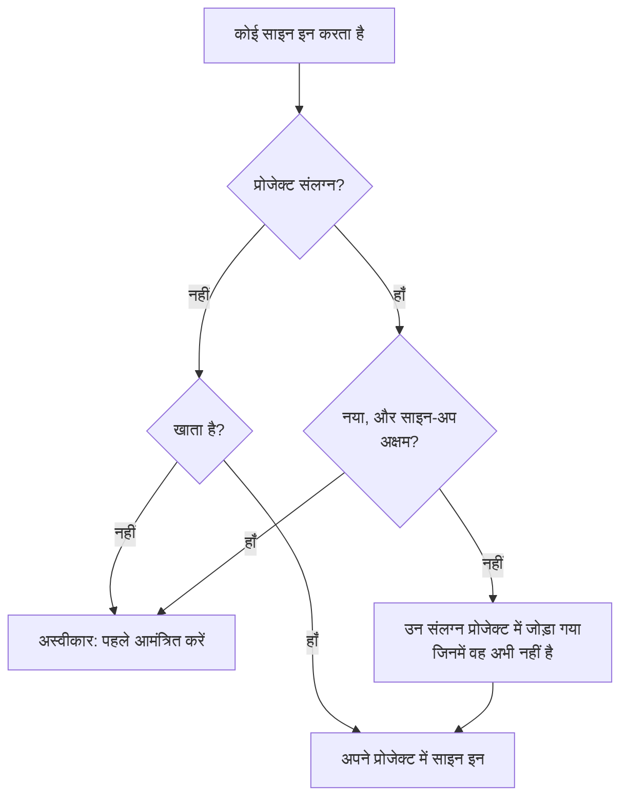

# ग्लोबल SSO

ग्लोबल SSO से OneUptime का **इंस्टेंस व्यवस्थापक** (मास्टर एडमिन) SAML 2.0 या OpenID Connect (OIDC) पहचान प्रदाता को इंस्टेंस स्तर पर **एक बार** सेट अप करता है, और उसे सर्वर के किसी भी प्रोजेक्ट से जोड़ सकता है। हर प्रोजेक्ट स्वामी के अपना पहचान प्रदाता सेट अप करने के बजाय, एक मास्टर एडमिन ऐसा प्रदाता सेट अप करता है जो पूरे इंस्टेंस की सेवा करता है।

> [!NOTE]
> ग्लोबल SSO, पूरे इंस्टेंस के "Require SSO for Login" स्विच सहित, OneUptime के हर संस्करण का हिस्सा है: हर स्व-होस्टेड इंस्टेंस में यह है, Community Edition में भी, और इसके लिए किसी लाइसेंस की ज़रूरत नहीं है। यह इंस्टेंस का प्रशासन है, इसलिए यह OneUptime Cloud पर लागू नहीं होता। हर संस्करण में क्या शामिल है, यह जानने के लिए [एंटरप्राइज़ संस्करण](/docs/self-hosted/enterprise) देखें।

:::cards
- [प्रदाता सेट अप करें](#ग्लोबल-sso-सेट-अप-करना): इसे बनाएँ, अपने पहचान प्रदाता को OneUptime के URL दें, और इसका परीक्षण करें।
- [उपयोगकर्ता कैसे साइन इन करते हैं](#उपयोगकर्ता-कैसे-साइन-इन-करते-हैं): केवल मौजूदा सदस्य, या आपके संलग्न प्रोजेक्ट में जोड़े गए नए लोग।
- [SSO लागू करें](#sso-लागू-करना): किसी एक प्रोजेक्ट या पूरे इंस्टेंस के लिए SSO अनिवार्य करें।
- [प्रदाता बंद करें](#प्रदाता-बंद-करना-या-हटाना): क्या समाप्त होता है, और OneUptime कौन-से बदलाव अस्वीकार करता है।
:::

## ग्लोबल SSO बनाम प्रोजेक्ट SSO

|                    | प्रोजेक्ट SSO                                   | ग्लोबल SSO                                            |
| ------------------ | ----------------------------------------------- | ----------------------------------------------------- |
| कौन सेट अप करता है | प्रोजेक्ट स्वामी/एडमिन (प्रोजेक्ट सेटिंग्स)       | इंस्टेंस का मास्टर एडमिन (Admin Dashboard)             |
| दायरा              | एक अकेला प्रोजेक्ट                              | पूरा इंस्टेंस, किसी भी प्रोजेक्ट से जोड़ा जा सकता है    |
| साइन-इन का परिणाम  | उसी एक प्रोजेक्ट तक पहुँच                       | हर उस प्रोजेक्ट तक पहुँच जहाँ उपयोगकर्ता पहुँच सकता है |

किसी एक प्रोजेक्ट के अपने प्रदाता के लिए [SSO](/docs/identity/sso) देखें।

## ग्लोबल SSO सेट अप करना

:::steps
### प्रदाताओं की सूची खोलें

:::tabs
@tab SAML
मास्टर एडमिन के रूप में साइन इन करें और अपने उपयोगकर्ता मेनू में **व्यवस्थापक सेटिंग्स** से Admin Dashboard खोलें। फिर **सेटिंग्स** > **प्रमाणीकरण** > **Global SSO** पर जाएँ।
@tab OpenID Connect
मास्टर एडमिन के रूप में साइन इन करें और अपने उपयोगकर्ता मेनू में **व्यवस्थापक सेटिंग्स** से Admin Dashboard खोलें। फिर **सेटिंग्स** > **प्रमाणीकरण** > **Global OIDC** पर जाएँ।
:::

### प्रदाता बनाएँ

:::tabs
@tab SAML
- **Create Global SSO** पर क्लिक करें।
- एक **नाम**, अपने पहचान प्रदाता से **Sign On URL** और **Issuer** दर्ज करें, और **Public Certificate** चिपकाएँ। बाकी सब **और फ़ील्ड** में पहले से भरा होता है: **Signature Method** (`RSA-SHA256`), **Digest Method** (`SHA256`) और एक विवरण (`Sign in with` और नाम)। इन्हें तभी बदलें जब आपके IdP को इसकी ज़रूरत हो। सहेजने पर प्रदाता का पृष्ठ खुलता है।
@tab OpenID Connect
- **Create Global OIDC** पर क्लिक करें।
- एक **नाम**, **Issuer URL**, और आपके IdP में पंजीकृत ऐप का **Client ID** और **Client Secret** दर्ज करें। IdP का डिस्कवरी URL **Issuer URL** में चिपकाना भी काम करता है। बाकी सब **और फ़ील्ड** में पहले से भरा होता है: **Discovery URL** (जारीकर्ता के बाद `/.well-known/openid-configuration`), **Scopes** (`openid email profile`), `email` और `name` claim नाम, और एक विवरण (`Sign in with` और नाम)। इन्हें तभी बदलें जब आपके IdP को इसकी ज़रूरत हो। सहेजने पर प्रदाता का पृष्ठ खुलता है।
:::

### OneUptime के URL अपने पहचान प्रदाता में कॉपी करें

:::tabs
@tab SAML
प्रदाता के पृष्ठ पर **Identity Provider URLs** कार्ड **ACS URL (Assertion Consumer Service / Reply URL)** और **Issuer (Entity ID)** दिखाता है। दोनों को अपने पहचान प्रदाता (Okta, Microsoft Entra ID, OneLogin, JumpCloud और अन्य) में चिपकाएँ।
@tab OpenID Connect
प्रदाता के पृष्ठ पर **Identity Provider URL** कार्ड **Redirect URI (Callback URL)** दिखाता है। इसे अपने पहचान प्रदाता के अनुमत रीडायरेक्ट URI में जोड़ें।
:::

### प्रदाता चालू करें

नया प्रदाता बंद स्थिति में शुरू होता है। प्रदाता के पृष्ठ पर **Edit Configuration** पर क्लिक करें और **सक्षम** चालू करें।

ग्लोबल प्रदाता को सक्षम करने से लॉगिन पृष्ठ पर केवल "Sign in with SSO" विकल्प जुड़ता है — यह कभी SSO को ज़बरदस्ती लागू नहीं करता और न किसी को बाहर करता है, इसलिए इसे सक्षम करना, परखना और ज़रूरत हो तो फिर से अक्षम करना सुरक्षित है।

### प्रदाता का परीक्षण करें

अपने पहचान प्रदाता के ज़रिए शुरू से अंत तक साइन-इन चलाने के लिए **Test this SSO provider** कार्ड (OpenID Connect के लिए **Test this OIDC provider**) के लिंक का उपयोग करें। आपको पहले कोई प्रोजेक्ट संलग्न करने की ज़रूरत नहीं है: परीक्षण आपको उन प्रोजेक्ट में साइन इन कराता है जिनके आप पहले से सदस्य हैं। लिंक के काम करने के लिए प्रदाता सक्षम होना चाहिए।
:::

## उपयोगकर्ता कैसे साइन इन करते हैं

कोई ग्लोबल प्रदाता कैसे व्यवहार करता है, यह इस पर निर्भर करता है कि आप उससे कोई प्रोजेक्ट संलग्न करते हैं या नहीं:

- **कोई प्रोजेक्ट संलग्न नहीं (सभी प्रोजेक्ट / पहले आमंत्रण):** उपयोगकर्ता प्रदाता से साइन इन करके **हर उस प्रोजेक्ट तक पहुँच सकते हैं जिसके वे पहले से सदस्य हैं**। नए उपयोगकर्ता अपने-आप **नहीं** बनाए जाते — उपयोगकर्ता को पहले किसी प्रोजेक्ट में आमंत्रित किया जाना चाहिए। इसका उपयोग पूरी कंपनी के SSO के लिए करें जहाँ सदस्यता कहीं और प्रबंधित होती है।

- **प्रोजेक्ट संलग्न (ऑटो-प्रोविजनिंग):** प्रदाता खोलें और एक या अधिक प्रोजेक्ट संलग्न करने के लिए **Attached Projects** तालिका का उपयोग करें, हर एक के साथ डिफ़ॉल्ट टीमों का एक सेट। साइन इन करने वाले उपयोगकर्ता पहले लॉगिन पर उन प्रोजेक्ट में **अपने-आप प्रोविजन** हो जाते हैं और डिफ़ॉल्ट टीमों में जुड़ जाते हैं। आप जो प्रोजेक्ट संलग्न करते हैं, वह शुरुआत में अपनी सदस्य टीम पर रहता है; अगर नए लोगों को अलग पहुँच से शुरू करना है तो दूसरी टीमें चुनें। सूची बनाने के लिए एक बार में एक प्रोजेक्ट + टीमें जोड़ें; किसी संलग्नक को बदलने के लिए उसे हटाएँ और फिर से जोड़ें।

जो व्यक्ति पहले से किसी संलग्न प्रोजेक्ट का सदस्य है, वह वहाँ अपनी टीमें बनाए रखता है।

प्रदाता पर दो स्विच इसे बदलते हैं। दोनों बंद स्थिति में शुरू होते हैं, **और फ़ील्ड** के नीचे समेटे हुए:

| स्विच | चालू होने पर यह क्या करता है |
| --- | --- |
| **Disable Sign Up with SSO** | प्रोजेक्ट संलग्न होने पर भी, लोगों को इस प्रदाता से साइन इन करने से पहले किसी प्रोजेक्ट में आमंत्रित होना चाहिए। पहले साइन-इन पर कोई नया व्यक्ति नहीं बनाया जाता। |
| **Restrict to Attached Projects** | इस प्रदाता से साइन इन करना केवल इससे संलग्न प्रोजेक्ट में SSO की शर्त पूरी करता है, इसलिए पहले से साइन इन किए लोग दूसरे प्रोजेक्ट तक पहुँच खो सकते हैं। बंद होने पर यह उस व्यक्ति के हर प्रोजेक्ट में शर्त पूरी करता है, और संलग्न प्रोजेक्ट केवल यह तय करते हैं कि नए लोग कहाँ जोड़े जाएँ। |

## SSO लागू करना

ग्लोबल प्रदाता सेट अप करने से किसी को उसका उपयोग करने के लिए मजबूर नहीं किया जाता; पासवर्ड से लॉगिन अब भी काम करता है। SSO अनिवार्य करने के लिए, किसी प्रोजेक्ट या पूरे इंस्टेंस के लिए यह शर्त चालू करें:

- **हर प्रोजेक्ट के लिए:** कोई प्रोजेक्ट SSO अनिवार्य कर सकता है, और चाहे तो कोई _खास_ प्रदाता (प्रोजेक्ट का या ग्लोबल) भी अनिवार्य कर सकता है। देखें [अपने प्रोजेक्ट के लिए SSO अनिवार्य करना](/docs/identity/sso#अपने-प्रोजेक्ट-के-लिए-sso-अनिवार्य-करना)।
- **पूरे इंस्टेंस के लिए:** **Admin** > **सेटिंग्स** > **प्रमाणीकरण** में **लॉगिन के लिए SSO अनिवार्य करें** स्विच है जो इंस्टेंस के हर उपयोगकर्ता के लिए SSO लागू करता है। चालू होने से पहले यह आपसे पुष्टि माँगता है, और पुष्टि करते ही सहेजा जाता है। मास्टर एडमिन छूट में रहते हैं ताकि वे बाहर न हो सकें।

**लॉगिन के लिए SSO अनिवार्य करें** चालू करने के लिए ऐसा SSO प्रदाता चाहिए जो लोगों को साइन इन कराए, ताकि इससे कोई बाहर न हो:

- पूरे इंस्टेंस के लिए, हर उस प्रोजेक्ट को जो खुद SSO अनिवार्य नहीं करता, एक प्रदाता चाहिए: प्रोजेक्ट का अपना कोई चालू SAML या OIDC प्रदाता, या कोई चालू ग्लोबल प्रदाता जो लोगों को उस प्रोजेक्ट में साइन इन कराता हो। जब तक किसी प्रोजेक्ट के पास ऐसा कोई नहीं है, स्विच चालू करना अस्वीकार किया जाता है, और संदेश उन प्रोजेक्ट के नाम बताता है (या, जब वे बहुत हों, पहले कुछ और कुल कितने)। पहले कोई ग्लोबल प्रदाता, या उन प्रोजेक्ट में कोई प्रदाता, चालू करें। जो प्रोजेक्ट कोई खास प्रदाता अनिवार्य करता है, उसे वही चाहिए: जब तक वह बंद है, हटाया गया है, या लोगों को प्रोजेक्ट में साइन इन नहीं कराता, संदेश उस प्रोजेक्ट का नाम अलग से बताता है — पहले वह प्रदाता चालू करें, या वहाँ कोई दूसरा प्रदाता अनिवार्य करें।
- किसी प्रोजेक्ट के लिए, यही बात उस प्रोजेक्ट से, और अगर वह कोई प्रदाता अनिवार्य करता है तो उस प्रदाता से, माँगी जाती है।
- जो सहेजना **लॉगिन के लिए SSO अनिवार्य करें** को चालू के रूप में भेजता है जबकि वह पहले से चालू है — दूसरी सेटिंग्स के साथ, या API से — उसकी भी इसी तरह जाँच होती है, इंस्टेंस के लिए या किसी प्रोजेक्ट के लिए, और उस सहेजने की भी जो उस प्रदाता का नाम देता है जो किसी प्रोजेक्ट को पहले से अनिवार्य है।
- किसी नए प्रोजेक्ट के लिए, जिसके पास अभी अपना कोई प्रदाता नहीं है: जब तक इंस्टेंस SSO अनिवार्य करता है, प्रोजेक्ट बनाने के लिए एक चालू ग्लोबल प्रदाता चाहिए जो लोगों को हर प्रोजेक्ट में साइन इन कराता हो, नहीं तो उसे बनाने वाले समेत कोई भी उसे नहीं खोल पाएगा। ऐसा न होने पर प्रोजेक्ट बनाना अस्वीकार कर दिया जाता है, और संदेश किसी सर्वर एडमिन से एक प्रदाता चालू करने को कहता है। मास्टर एडमिन अब भी प्रोजेक्ट बना सकते हैं। **लॉगिन के लिए SSO अनिवार्य करें** पहले से चालू रखकर बनाए गए प्रोजेक्ट को भी यही चाहिए, चाहे उसे कोई भी बनाए।

इसे बंद करना कभी अस्वीकार नहीं किया जाता।

## प्रदाता बंद करना या हटाना

किसी ग्लोबल प्रदाता को बंद करने, हटाने या उसे उसके संलग्न प्रोजेक्ट तक सीमित करने से उसके दिए गए साइन-इन वहाँ समाप्त हो जाते हैं जहाँ वह अब लोगों को साइन इन नहीं कराता। जहाँ SSO अनिवार्य है, वहाँ इससे साइन इन किए लोगों को अगले अनुरोध पर फिर से SSO से साइन इन करना होगा, उनके खुले पृष्ठों को तुरंत लाइव अपडेट मिलना बंद हो जाता है, और किसी ने इससे साइन इन करने के बाद जो MCP क्लाइंट जोड़ा था, वह प्रोजेक्ट में काम करना बंद कर देता है।

प्रदाता को फिर से चालू करने से वे साइन-इन वापस नहीं आते: लोग इससे फिर से साइन इन करते हैं। जो प्रदाता आपके अपग्रेड करते समय पहले से बंद था, उसे अपग्रेड के समय बंद किया गया माना जाता है।

नया प्रमाणपत्र या क्लाइंट सीक्रेट, दूसरे URL या नया नाम होने पर सभी साइन इन रहते हैं।

### SSO अनिवार्य करने वाला हर प्रोजेक्ट अंदर आने का एक रास्ता रखता है

जो प्रोजेक्ट SSO अनिवार्य करता है, खुद या इसलिए कि पूरा इंस्टेंस ऐसा करता है, उसके पास हमेशा ऐसा प्रदाता रहता है जिससे लोग उसमें साइन इन कर सकें। इसलिए ये बदलाव तब तक अस्वीकार किए जाते हैं जब तक वे ऐसे प्रोजेक्ट को बिल्कुल बिना प्रदाता के छोड़ दें, या उससे उसका अनिवार्य प्रदाता छीन लें:

- किसी ग्लोबल प्रदाता को बंद करना, हटाना, या उसे उसके संलग्न प्रोजेक्ट तक सीमित करना;
- संलग्न प्रोजेक्ट तक सीमित प्रदाता के लिए: उसका पहला प्रोजेक्ट संलग्न करना (तब तक वह लोगों को हर प्रोजेक्ट में साइन इन कराता है), किसी संलग्नक को बंद करना, उसे किसी दूसरे प्रोजेक्ट या प्रदाता पर ले जाना, या उसे हटाना।

संदेश प्रोजेक्ट के नाम बताता है, या पहले कुछ और कुल कितने हैं। पहले उनके लिए कोई दूसरा प्रदाता चालू करें, उनका अपना या कोई ग्लोबल, या वहाँ **लॉगिन के लिए SSO अनिवार्य करें** बंद करें। जो प्रोजेक्ट ठीक यही प्रदाता अनिवार्य करता है, उसका नाम अलग से बताया जाता है: पहले वहाँ कोई दूसरा प्रदाता अनिवार्य करें, या **लॉगिन के लिए SSO अनिवार्य करें** बंद करें।

जो बदलाव किसी प्रदाता को ज़्यादा लोगों को साइन इन कराने देते हैं — उसे या किसी संलग्नक को चालू करना, सीमा हटाना — वे कभी अस्वीकार नहीं किए जाते। वे तुरंत हर ऐप सर्वर तक पहुँचते हैं, जैसे **लॉगिन के लिए SSO अनिवार्य करें** बंद करना: लोग तुरंत उस प्रदाता से साइन इन कर सकते हैं। केवल तब, जब उसी पल उसी प्रदाता का कोई दूसरा बदलाव सहेजा जा रहा हो, किसी ऐप सर्वर को साथ आने में एक मिनट तक लग सकता है।

कौन साइन इन कर सकता है, इसके दो बदलाव एक के बाद एक जाँचे जाते हैं। अगर उसी पल कोई दूसरा बदलाव सहेजा जा रहा हो और उसमें सामान्य से ज़्यादा समय लगे — पूरे इंस्टेंस के लिए **लॉगिन के लिए SSO अनिवार्य करें** चालू करना हर प्रोजेक्ट को पढ़ता है — तो बदलाव "Another change to who can sign in with SSO is being saved. Try again in a moment." के साथ अस्वीकार किया जाता है: उसे फिर से सहेजें। उस पल बनाया जा रहा प्रोजेक्ट भी बदलाव का इंतज़ार करता है, और अगर बहुत देर तक इंतज़ार करे तो "The server's SSO settings are being changed. Create the project again in a moment." के साथ अस्वीकार किया जाता है।

## समस्या निवारण

:::details "You must be invited to a project on this OneUptime instance before you can sign in with SSO"
उस व्यक्ति का अभी कोई OneUptime खाता नहीं है, और प्रदाता खाता नहीं बनाता: या तो उससे कोई प्रोजेक्ट संलग्न नहीं है, या **Disable Sign Up with SSO** चालू है। उस व्यक्ति को किसी प्रोजेक्ट में आमंत्रित करें, या प्रदाता से कोई प्रोजेक्ट संलग्न करें।
:::

:::details "This SSO provider does not grant access to any project you are a member of"
**Restrict to Attached Projects** चालू है, और वह व्यक्ति प्रदाता से संलग्न किसी भी प्रोजेक्ट का सदस्य नहीं है। उसका कोई प्रोजेक्ट संलग्न करें, या उसे किसी संलग्न प्रोजेक्ट में जोड़ें।
:::

:::details "You are not a member of any project on this OneUptime instance"
उस व्यक्ति का खाता है लेकिन वह किसी प्रोजेक्ट का सदस्य नहीं है, और प्रदाता के पास उसे जोड़ने के लिए कुछ नहीं है। उसे किसी प्रोजेक्ट में आमंत्रित करें, या डिफ़ॉल्ट टीमों वाला कोई प्रोजेक्ट प्रदाता से संलग्न करें।
:::

:::details "Issuer URL does not match"
SAML प्रदाता के लिए, आपके पहचान प्रदाता की प्रतिक्रिया का जारीकर्ता वह **Issuer** नहीं है जो प्रदाता पर सहेजा गया है। इसे अपने पहचान प्रदाता से फिर से कॉपी करें; दोनों बिल्कुल मेल खाने चाहिए।
:::

## अगले कदम

:::cards
- [SSO](/docs/identity/sso): किसी प्रोजेक्ट का अपना SAML या OIDC प्रदाता सेट अप करें।
- [SCIM](/docs/identity/scim): अपने पहचान प्रदाता को लोगों को अपने-आप जोड़ने और हटाने दें।
- [उपयोगकर्ता, टीमें और अनुमतियाँ](/docs/permissions/index): नए लोग जिन टीमों में शामिल होते हैं, वे उन्हें क्या करने देती हैं।
:::
