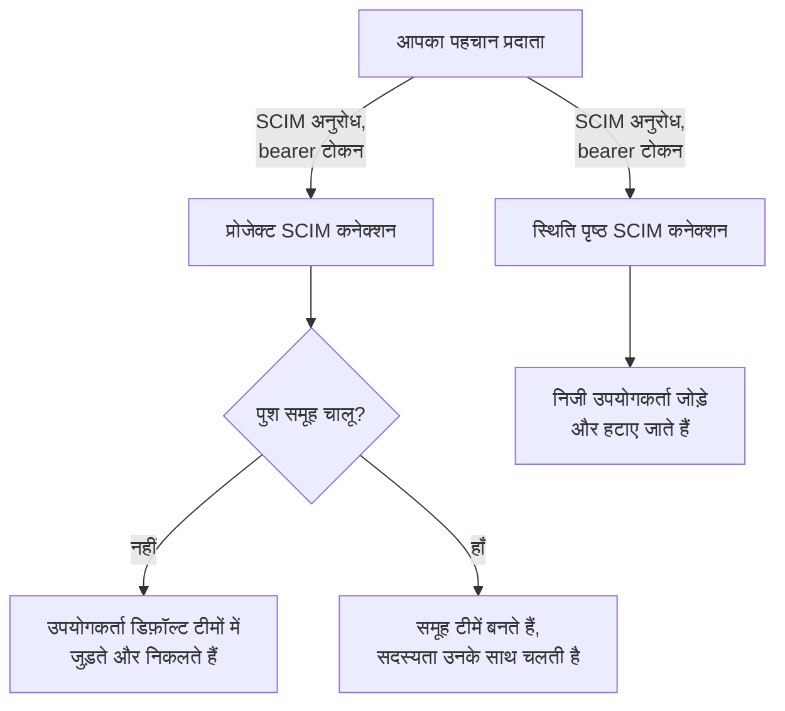
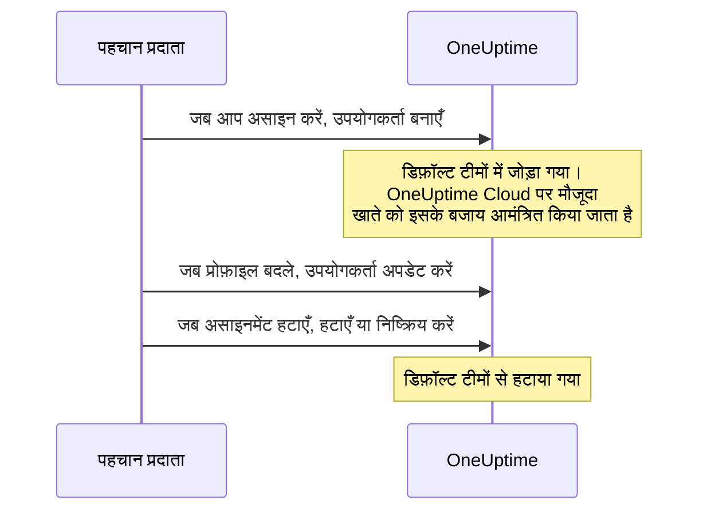
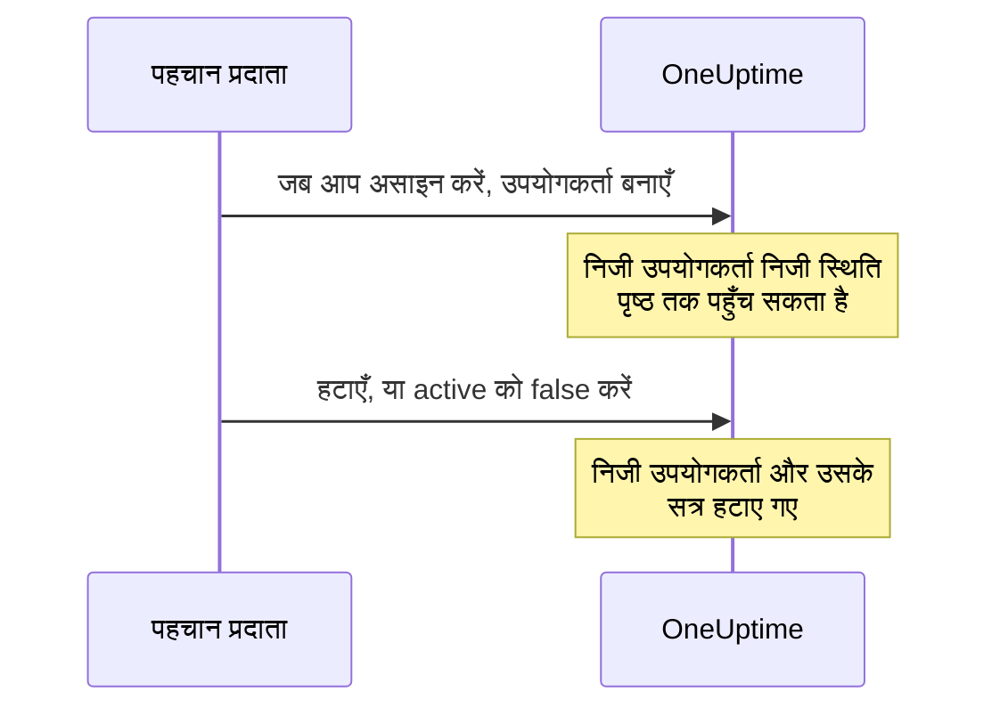

# SCIM

SCIM (System for Cross-domain Identity Management) लोगों को अपने-आप प्रोविजन और डीप्रोविजन करता है। आपका पहचान प्रदाता (IdP) — Microsoft Entra ID, Okta या कोई भी दूसरा SCIM 2.0 सिस्टम — जब आप लोगों को असाइन करते हैं तो उन्हें आपके OneUptime प्रोजेक्ट और निजी स्थिति पृष्ठों में जोड़ता है, और जब आप असाइनमेंट हटाते हैं तो उन्हें हटा देता है।

> [!NOTE]
> **संस्करण:** SCIM, OneUptime Enterprise Edition का हिस्सा है। OneUptime Cloud पर यह **Scale** प्लान और उससे ऊपर उपलब्ध है। स्व-होस्टेड इंस्टॉलेशन को Enterprise Edition इमेज और एक लाइसेंस चाहिए। देखें [एंटरप्राइज़ संस्करण](/docs/self-hosted/enterprise)। मान्य लाइसेंस के बिना (14 दिन के ट्रायल के बाद, या लाइसेंस समाप्त होने के 30 दिन बाद) SCIM अनुरोध तब तक अस्वीकार किए जाते हैं जब तक कोई लाइसेंस सक्रिय न हो।

:::cards
- [प्रोजेक्ट SCIM सेट अप करें](#प्रोजेक्ट-scim-सेट-अप-करना): एक कनेक्शन बनाएँ और अपने IdP को उसका URL और टोकन दें।
- [स्थिति पृष्ठ SCIM सेट अप करें](#स्थिति-पृष्ठ-scim-सेट-अप-करना): किसी स्थिति पृष्ठ के निजी उपयोगकर्ताओं को प्रोविजन करें।
- [अपना पहचान प्रदाता जोड़ें](#अपना-पहचान-प्रदाता-जोड़ें): Microsoft Entra ID और Okta के लिए चरण-दर-चरण।
- [अक्सर पूछे जाने वाले प्रश्न](#अक्सर-पूछे-जाने-वाले-प्रश्न): मौजूदा उपयोगकर्ता, डीप्रोविजनिंग, ईमेल में बदलाव।
:::

## यह कैसे काम करता है

जब भी आप किसी को असाइन करते हैं, कुछ बदलते हैं या असाइनमेंट हटाते हैं, आपका पहचान प्रदाता bearer टोकन से प्रमाणित होकर OneUptime के SCIM एंडपॉइंट को कॉल करता है। अनुरोध क्या बदलता है, यह इस पर निर्भर करता है कि कनेक्शन कहाँ है:



SCIM एकीकरण ये लाभ देता है:

- **स्वचालित उपयोगकर्ता प्रोविजनिंग**: जब उपयोगकर्ताओं को आपके IdP में असाइन किया जाता है, तो वे OneUptime में बनाए जाते हैं।
- **स्वचालित उपयोगकर्ता डीप्रोविजनिंग**: जब आपके IdP में उनका असाइनमेंट हटाया जाता है, तो उपयोगकर्ता OneUptime से हटा दिए जाते हैं।
- **उपयोगकर्ता गुणों का सिंक्रनाइज़ेशन**: उपयोगकर्ता की जानकारी आपके IdP और OneUptime के बीच एक जैसी रहती है।
- **केंद्रीकृत पहुँच प्रबंधन**: OneUptime तक पहुँच आपके मौजूदा पहचान प्रबंधन सिस्टम से प्रबंधित होती है।

SCIM और [SSO](/docs/identity/sso) एक-दूसरे से स्वतंत्र हैं: SCIM तय करता है कि प्रोजेक्ट में कौन है, SSO यह कि वे कैसे साइन इन करते हैं। ज़्यादातर संगठन दोनों का उपयोग करते हैं।

## प्रोजेक्ट के लिए SCIM

प्रोजेक्ट SCIM से पहचान प्रदाता OneUptime प्रोजेक्ट के भीतर टीम सदस्यों को प्रबंधित करते हैं।

### प्रोजेक्ट SCIM सेट अप करना

केवल प्रोजेक्ट स्वामी ही किसी प्रोजेक्ट का SCIM कनेक्शन जोड़ या बदल सकता है, या उसका bearer टोकन देख या रीसेट कर सकता है: SCIM के ज़रिए आपका पहचान प्रदाता प्रोजेक्ट की किसी भी टीम में लोगों को जोड़ सकता है।
:::steps
1. **प्रोजेक्ट सेटिंग्स पर जाएँ**

   - अपने OneUptime प्रोजेक्ट पर जाएँ
   - **प्रोजेक्ट सेटिंग्स** > **सुरक्षा** > **SCIM** पर जाएँ

2. **SCIM सेटिंग्स कॉन्फ़िगर करें**

   - एक **नाम** दर्ज करें। **डिफ़ॉल्ट टीमें** आपके प्रोजेक्ट की सदस्य टीम से शुरू होती हैं: नए उपयोगकर्ता इन टीमों में जोड़े जाते हैं
   - **और फ़ील्ड** के नीचे **उपयोगकर्ताओं को ऑटो प्रोविजन करें** (जब उपयोगकर्ता आपके IdP में असाइन हों तो उन्हें जोड़ें) और **उपयोगकर्ताओं को ऑटो डीप्रोविजन करें** (जब आपके IdP में उनका असाइनमेंट हटे तो उन्हें हटाएँ) चालू हैं, और **पुश समूह सक्षम करें** बंद है। ज़रूरत हो तो इन्हें वहीं बदलें
   - सहेजें। आपके IdP कॉन्फ़िगरेशन के लिए **SCIM Base URL** और **Bearer Token** वाला डायलॉग तुरंत खुलता है

3. **अपना पहचान प्रदाता कॉन्फ़िगर करें**

   - डायलॉग से **SCIM Base URL** का उपयोग करें। OneUptime Cloud पर यह `https://oneuptime.com/identity/scim/v2/<scim-id>` है; स्व-होस्टेड इंस्टॉलेशन अपना होस्ट दिखाता है
   - डायलॉग के **Bearer Token** से bearer टोकन प्रमाणीकरण कॉन्फ़िगर करें
   - उपयोगकर्ता गुणों को मैप करें (ईमेल आवश्यक है)। Microsoft Entra ID और Okta का विवरण [अपना पहचान प्रदाता जोड़ें](#अपना-पहचान-प्रदाता-जोड़ें) में है
:::

URL फिर से देखने के लिए कनेक्शन की पंक्ति में **SCIM URL देखें** चुनें। **Bearer टोकन रीसेट करें** टोकन को बदल देता है; अपने पहचान प्रदाता को नए टोकन से अपडेट करें।

### प्रोजेक्ट उपयोगकर्ता कैसे प्रोविजन होता है



जिस व्यक्ति का पहले से OneUptime खाता था, वह OneUptime Cloud पर आमंत्रण स्वीकार करते ही शामिल हो जाता है (देखें [अक्सर पूछे जाने वाले प्रश्न](#अक्सर-पूछे-जाने-वाले-प्रश्न))। कनेक्शन की डिफ़ॉल्ट टीमों के बाहर की टीमों से मिली पहुँच पर कोई असर नहीं पड़ता।

## स्थिति पृष्ठों के लिए SCIM

स्थिति पृष्ठ SCIM से पहचान प्रदाता उन स्थिति पृष्ठ निजी उपयोगकर्ताओं को प्रोविजन और डीप्रोविजन करते हैं जो निजी स्थिति पृष्ठों तक पहुँच सकते हैं।

### स्थिति पृष्ठ SCIM सेट अप करना

:::steps
1. **स्थिति पृष्ठ सेटिंग्स पर जाएँ**

   - **स्थिति पृष्ठ** खोलें और अपना स्थिति पृष्ठ चुनें
   - **सुरक्षा** > **SCIM** पर जाएँ

2. **SCIM सेटिंग्स कॉन्फ़िगर करें**

   - एक **नाम** दर्ज करें। **और फ़ील्ड** के नीचे **उपयोगकर्ताओं को ऑटो प्रोविजन करें** (जब निजी उपयोगकर्ता आपके IdP में असाइन हों तो उन्हें जोड़ें) और **उपयोगकर्ताओं को ऑटो डीप्रोविजन करें** (जब आपके IdP में उनका असाइनमेंट हटे तो निजी उपयोगकर्ताओं को हटाएँ) चालू हैं। ज़रूरत हो तो इन्हें वहीं बदलें
   - सहेजें। आपके IdP कॉन्फ़िगरेशन के लिए **SCIM Base URL** और **Bearer Token** वाला डायलॉग तुरंत खुलता है

3. **अपना पहचान प्रदाता कॉन्फ़िगर करें**

   - डायलॉग से **SCIM Base URL** का उपयोग करें। OneUptime Cloud पर यह `https://oneuptime.com/identity/status-page-scim/v2/<scim-id>` है
   - दिखाए गए टोकन से bearer टोकन प्रमाणीकरण कॉन्फ़िगर करें
   - उपयोगकर्ता गुणों को मैप करें (ईमेल आवश्यक है)
:::

URL फिर से देखने के लिए कनेक्शन की पंक्ति में **SCIM एंडपॉइंट URL दिखाएं** चुनें।

स्थिति पृष्ठ SCIM केवल उपयोगकर्ताओं का समर्थन करता है। यह समूहों या समूह प्रोविजनिंग का समर्थन नहीं करता।

### निजी उपयोगकर्ता कैसे प्रोविजन होता है



> [!WARNING]
> डीप्रोविजनिंग स्थिति पृष्ठ के निजी उपयोगकर्ता और उस स्थिति पृष्ठ के लिए उसके सभी सत्रों को स्थायी रूप से हटा देती है। अगर बाद में उपयोगकर्ता को फिर से असाइन किया जाता है, तो वह एक नए निजी उपयोगकर्ता के रूप में प्रोविजन होता है। जब **उपयोगकर्ताओं को ऑटो डीप्रोविजन करें** बंद होता है, तो `active` को `false` करने वाले अपडेट अनदेखे किए जाते हैं और DELETE अनुरोध अस्वीकार किए जाते हैं।

## अपना पहचान प्रदाता जोड़ें

नीचे हर प्रदाता OneUptime में प्रोजेक्ट SCIM कनेक्शन बनाने से शुरू होता है, फिर आपके पहचान प्रदाता को उससे जोड़ता है।

### Microsoft Entra ID (पहले Azure AD)

Microsoft Entra ID, SCIM प्रोविजनिंग के साथ एंटरप्राइज़-स्तर का पहचान प्रबंधन देता है। आपको चाहिए:

- Premium P1 या P2 लाइसेंस वाला एक Microsoft Entra ID टेनेंट (स्वचालित प्रोविजनिंग के लिए आवश्यक)।
- OneUptime Cloud पर **Scale** प्लान या उससे ऊपर का एक OneUptime प्रोजेक्ट।
- Microsoft Entra ID और OneUptime दोनों में व्यवस्थापक पहुँच।

:::steps
#### Entra ID के लिए SCIM कनेक्शन बनाएँ

1. अपने OneUptime डैशबोर्ड में लॉग इन करें
2. **प्रोजेक्ट सेटिंग्स** > **सुरक्षा** > **SCIM** पर जाएँ
3. **SCIM बनाएँ** पर क्लिक करें
4. एक पहचानने योग्य नाम दर्ज करें (जैसे, "Microsoft Entra ID Provisioning")
5. विकल्प जाँचें:
   - **डिफ़ॉल्ट टीमें**: आपके प्रोजेक्ट की सदस्य टीम से शुरू होती हैं; नए उपयोगकर्ता इन टीमों में जोड़े जाते हैं
   - **उपयोगकर्ताओं को ऑटो प्रोविजन करें** और **उपयोगकर्ताओं को ऑटो डीप्रोविजन करें**: चालू, **और फ़ील्ड** के नीचे
   - **पुश समूह सक्षम करें**: **और फ़ील्ड** के नीचे; अगर आप Entra ID समूहों से टीम सदस्यता प्रबंधित करना चाहते हैं तो इसे चालू करें
6. कॉन्फ़िगरेशन सहेजें
7. खुलने वाले डायलॉग से **SCIM Base URL** और **Bearer Token** कॉपी करें — Entra ID के लिए आपको इनकी ज़रूरत होगी

#### Entra ID में एक एंटरप्राइज़ ऐप्लिकेशन बनाएँ

1. [Microsoft Entra admin center](https://entra.microsoft.com) में साइन इन करें
2. **Identity** > **Applications** > **Enterprise applications** पर जाएँ
3. **+ New application** पर क्लिक करें, फिर **+ Create your own application** पर
4. एक नाम दर्ज करें (जैसे, "OneUptime")
5. **Integrate any other application you don't find in the gallery (Non-gallery)** चुनें और **Create** पर क्लिक करें

#### Entra ID को OneUptime से जोड़ें

1. अपने OneUptime एंटरप्राइज़ ऐप्लिकेशन में **Provisioning** पर जाएँ और **Get started** पर क्लिक करें
2. **Provisioning Mode** को **Automatic** पर सेट करें
3. **Admin Credentials** के नीचे **Tenant URL** को OneUptime के **SCIM Base URL** (जैसे, `https://oneuptime.com/identity/scim/v2/<scim-id>`) पर और **Secret Token** को **Bearer Token** पर सेट करें
4. कॉन्फ़िगरेशन जाँचने के लिए **Test Connection** पर क्लिक करें, फिर **Save** पर

#### Entra ID में उपयोगकर्ता गुण मैप करें

1. Provisioning अनुभाग में **Mappings** पर क्लिक करें, फिर **Provision Azure Active Directory Users** पर
2. नीचे दिए गुण मैपिंग कॉन्फ़िगर करें, जिनकी ज़रूरत नहीं उन्हें हटाएँ, और **Save** पर क्लिक करें:

| Azure AD गुण                                                  | OneUptime SCIM गुण             | आवश्यक   |
| ------------------------------------------------------------- | ------------------------------ | -------- |
| `userPrincipalName`                                           | `userName`                     | हाँ      |
| `mail`                                                        | `emails[type eq "work"].value` | अनुशंसित |
| `displayName`                                                 | `displayName`                  | अनुशंसित |
| `givenName`                                                   | `name.givenName`               | वैकल्पिक |
| `surname`                                                     | `name.familyName`              | वैकल्पिक |
| `Switch([IsSoftDeleted], , "False", "True", "True", "False")` | `active`                       | अनुशंसित |

#### Entra ID में समूह मैप करें (वैकल्पिक)

अगर आपने OneUptime में **पुश समूह सक्षम करें** चालू किया है:

1. **Mappings** पर वापस जाएँ और **Provision Azure Active Directory Groups** पर क्लिक करें
2. **Enabled** को **Yes** पर सेट करें
3. नीचे दिए गुण मैपिंग कॉन्फ़िगर करें और **Save** पर क्लिक करें:

| Azure AD गुण  | OneUptime SCIM गुण |
| ------------- | ------------------ |
| `displayName` | `displayName`      |
| `members`     | `members`          |

#### Entra ID में उपयोगकर्ता और समूह असाइन करें

1. अपने OneUptime एंटरप्राइज़ ऐप्लिकेशन में **Users and groups** पर जाएँ
2. **+ Add user/group** पर क्लिक करें, OneUptime में प्रोविजन करने के लिए उपयोगकर्ता और समूह चुनें, और **Assign** पर क्लिक करें

#### Entra ID में प्रोविजनिंग शुरू करें

1. **Provisioning** > **Overview** पर जाएँ और **Start provisioning** पर क्लिक करें
2. पहला प्रोविजनिंग चक्र शुरू होता है; पहले सिंक में 40 मिनट तक लग सकते हैं
3. **Provisioning logs** में त्रुटियाँ देखें। आपके असाइन किए लोग OneUptime में प्रोजेक्ट की टीमों में दिखते हैं
:::

### Okta

Okta, SCIM समर्थन के साथ लचीला पहचान प्रबंधन देता है। आपको चाहिए:

- प्रोविजनिंग (Lifecycle Management सुविधा) वाला एक Okta टेनेंट।
- OneUptime Cloud पर **Scale** प्लान या उससे ऊपर का एक OneUptime प्रोजेक्ट।
- Okta और OneUptime दोनों में व्यवस्थापक पहुँच।

:::steps
#### Okta के लिए SCIM कनेक्शन बनाएँ

1. अपने OneUptime डैशबोर्ड में लॉग इन करें
2. **प्रोजेक्ट सेटिंग्स** > **सुरक्षा** > **SCIM** पर जाएँ
3. **SCIM बनाएँ** पर क्लिक करें
4. एक पहचानने योग्य नाम दर्ज करें (जैसे, "Okta Provisioning")
5. विकल्प जाँचें:
   - **डिफ़ॉल्ट टीमें**: आपके प्रोजेक्ट की सदस्य टीम से शुरू होती हैं; नए उपयोगकर्ता इन टीमों में जोड़े जाते हैं
   - **उपयोगकर्ताओं को ऑटो प्रोविजन करें** और **उपयोगकर्ताओं को ऑटो डीप्रोविजन करें**: चालू, **और फ़ील्ड** के नीचे
   - **पुश समूह सक्षम करें**: **और फ़ील्ड** के नीचे; अगर आप Okta समूहों से टीम सदस्यता प्रबंधित करना चाहते हैं तो इसे चालू करें
6. कॉन्फ़िगरेशन सहेजें
7. खुलने वाले डायलॉग से **SCIM Base URL** और **Bearer Token** कॉपी करें — Okta के लिए आपको इनकी ज़रूरत होगी

#### Okta ऐप्लिकेशन बनाएँ या खोलें

Okta Admin Console में **Applications** > **Applications** पर जाएँ:

- अगर आप OneUptime में SSO के लिए पहले से Okta का उपयोग करते हैं, तो वह ऐप्लिकेशन खोलें।
- नहीं तो **Create App Integration** पर क्लिक करें, **SAML 2.0** चुनें, उसका नाम "OneUptime" रखें और SAML सेटअप पूरा करें (देखें [SSO](/docs/identity/sso))।

#### Okta में SCIM प्रोविजनिंग चालू करें

1. अपने OneUptime ऐप्लिकेशन के **General** टैब पर जाएँ
2. **App Settings** अनुभाग में **Edit** पर क्लिक करें, **Provisioning** के नीचे **SCIM** चुनें, और **Save** पर क्लिक करें
3. एक नया **Provisioning** टैब दिखाई देता है

#### Okta को OneUptime से जोड़ें

1. **Provisioning** टैब पर **Integration** पर क्लिक करें, फिर **Configure API Integration** पर, और **Enable API integration** चुनें
2. ये कॉन्फ़िगर करें:
   - **SCIM connector base URL**: OneUptime का **SCIM Base URL** (जैसे, `https://oneuptime.com/identity/scim/v2/<scim-id>`)
   - **Unique identifier field for users**: `userName`
   - **Supported provisioning actions**: Import New Users and Profile Updates, Push New Users, Push Profile Updates और, अगर आप समूह-आधारित प्रोविजनिंग का उपयोग करते हैं, तो Push Groups
   - **Authentication Mode**: **HTTP Header**
   - **Authorization**: OneUptime का **Bearer Token**। OneUptime `Authorization: Bearer <token>` हेडर की अपेक्षा करता है; अगर Okta फ़ील्ड के आगे पहले से Bearer शब्द दिखाता है, तो केवल टोकन दर्ज करें
3. कनेक्शन जाँचने के लिए **Test API Credentials** पर क्लिक करें, फिर **Save** पर

#### चुनें कि Okta क्या प्रोविजन करे

1. **Provisioning** टैब पर **To App** पर क्लिक करें, फिर **Edit** पर
2. **Create Users**, **Update User Attributes** और **Deactivate Users** चालू करें, और **Save** पर क्लिक करें

#### Okta में उपयोगकर्ता गुण मैप करें

**Attribute Mappings** तक स्क्रॉल करें और ये मैपिंग जाँचें। जिनकी ज़रूरत नहीं, उन्हें हटाएँ:

| Okta गुण           | OneUptime SCIM गुण              | दिशा              |
| ------------------ | ------------------------------- | ----------------- |
| `userName`         | `userName`                      | Okta से ऐप        |
| `user.email`       | `emails[primary eq true].value` | Okta से ऐप        |
| `user.firstName`   | `name.givenName`                | Okta से ऐप        |
| `user.lastName`    | `name.familyName`               | Okta से ऐप        |
| `user.displayName` | `displayName`                   | Okta से ऐप        |

#### Okta से समूह पुश करें (वैकल्पिक)

अगर आपने OneUptime में **पुश समूह सक्षम करें** चालू किया है:

1. **Push Groups** टैब पर जाएँ और **+ Push Groups** पर क्लिक करें
2. **Find groups by name** या **Find groups by rule** चुनें
3. पुश करने के लिए समूह खोजें और चुनें, और **Save** पर क्लिक करें

#### Okta में लोगों को असाइन करें

1. **Assignments** टैब पर जाएँ
2. **Assign** > **Assign to People** या **Assign to Groups** पर क्लिक करें, चुनें कि किसे प्रोविजन करना है, हर एक के लिए **Assign** पर क्लिक करें, फिर **Done** पर

#### Okta में प्रोविजनिंग जाँचें

1. Okta Admin Console में **Reports** > **System Log** पर जाएँ और अपने OneUptime ऐप्लिकेशन से फ़िल्टर करें
2. जाँचें कि प्रोविजनिंग इवेंट सफल रहे और लोग OneUptime में प्रोजेक्ट की टीमों में दिखते हैं
:::

### दूसरे पहचान प्रदाता

OneUptime का SCIM कार्यान्वयन SCIM v2.0 विनिर्देश का पालन करता है और किसी भी अनुरूप पहचान प्रदाता के साथ काम करता है:

| सेटिंग | मान |
| --- | --- |
| SCIM Base URL | OneUptime का **SCIM Base URL**: प्रोजेक्ट के लिए `https://oneuptime.com/identity/scim/v2/<scim-id>`, या स्थिति पृष्ठ के लिए `https://oneuptime.com/identity/status-page-scim/v2/<scim-id>` |
| प्रमाणीकरण | HTTP Bearer टोकन |
| अद्वितीय उपयोगकर्ता पहचानकर्ता | `userName`, जो एक मान्य ईमेल पता होना चाहिए |
| ऑपरेशन | प्रोजेक्ट SCIM और स्थिति पृष्ठ SCIM में Users के लिए GET, POST, PUT, PATCH और DELETE। Groups केवल प्रोजेक्ट SCIM में समर्थित हैं। |

## SCIM API संदर्भ

पथ कनेक्शन के **SCIM Base URL** के सापेक्ष हैं।

| एंडपॉइंट                 | विधियाँ                 | विवरण                                                  |
| ------------------------ | ----------------------- | ------------------------------------------------------ |
| `/ServiceProviderConfig` | GET                     | SCIM सर्वर की क्षमताएँ                                  |
| `/Schemas`               | GET                     | उपलब्ध संसाधन स्कीमा                                   |
| `/ResourceTypes`         | GET                     | उपलब्ध संसाधन प्रकार                                   |
| `/Users`                 | GET, POST               | उपयोगकर्ताओं की सूची देखें और उन्हें बनाएँ             |
| `/Users/{id}`            | GET, PUT, PATCH, DELETE | अलग-अलग उपयोगकर्ताओं को प्रबंधित करें                  |
| `/Groups`                | GET, POST               | समूहों/टीमों की सूची देखें और उन्हें बनाएँ (केवल प्रोजेक्ट SCIM) |
| `/Groups/{id}`           | GET, PUT, PATCH, DELETE | अलग-अलग समूहों को प्रबंधित करें (केवल प्रोजेक्ट SCIM)   |
| `/Bulk`                  | POST                    | एक अनुरोध में कई ऑपरेशन                                |

`/ServiceProviderConfig` क्या बताता है:

| क्षमता | समर्थित |
| --- | --- |
| PATCH | हाँ |
| Bulk | हाँ, प्रति अनुरोध 1,000 ऑपरेशन और 1 MB तक |
| Filter | हाँ, 200 परिणामों तक |
| क्रमबद्ध करना | हाँ |
| पासवर्ड बदलना | नहीं |
| ETag | नहीं |
| प्रमाणीकरण | HTTP Bearer टोकन |

आपका पहचान प्रदाता जो समूह बनाता है, वह प्रोजेक्ट में उसी नाम की टीम बन जाता है; अगर उस नाम की टीम पहले से है, तो नई टीम के बजाय उसी का उपयोग होता है।

:::details SCIM उपयोगकर्ता स्कीमा
```json
{
  "schemas": ["urn:ietf:params:scim:schemas:core:2.0:User"],
  "userName": "user@example.com",
  "name": {
    "givenName": "John",
    "familyName": "Doe",
    "formatted": "John Doe"
  },
  "displayName": "John Doe",
  "emails": [
    {
      "value": "user@example.com",
      "type": "work",
      "primary": true
    }
  ],
  "active": true
}
```
:::

:::details SCIM समूह स्कीमा
```json
{
  "schemas": ["urn:ietf:params:scim:schemas:core:2.0:Group"],
  "displayName": "Engineering Team",
  "members": [
    {
      "value": "user-id-here",
      "display": "user@example.com"
    }
  ]
}
```
:::

## प्लान और लाइसेंस

OneUptime Cloud पर SCIM के लिए **Scale** प्लान चाहिए। स्व-होस्टेड इंस्टॉलेशन को Enterprise Edition और एक लाइसेंस चाहिए, जैसा पृष्ठ के ऊपर का नोट बताता है।

### Scale प्लान से नीचे

OneUptime Cloud पर SCIM प्रोविजनिंग तभी पूरी तरह काम करती है जब प्रोजेक्ट **Scale** या उससे ऊपर हो। उससे नीचे — Scale ट्रायल खत्म होने या प्लान घटने के बाद — प्रोजेक्ट के SCIM कनेक्शन, और उसके स्थिति पृष्ठों के भी, केवल लोगों को हटाते हैं, ताकि जाने वाला हर व्यक्ति फिर भी अपनी पहुँच खो दे:

- **अब भी काम करता है:** किसी उपयोगकर्ता को निष्क्रिय करना (`active` को `false` पर सेट करना, ऐसे कनेक्शन पर जो निष्क्रिय किए गए लोगों को हटाने के लिए सेट है), किसी उपयोगकर्ता को हटाना, किसी समूह से सदस्यों को हटाना (Entra ID का `members` पर सदस्यों को मान बनाकर `Remove`, Okta का `members[value eq "..."]` पर `remove`, या सदस्यों को समूह में पहले से मौजूद कुछ सदस्यों से बदलना), किसी समूह को हटाना, और केवल `DELETE` से बना `Bulk` अनुरोध। खोज के अनुरोधों का भी जवाब दिया जाता है — उपयोगकर्ताओं और समूहों की सूची बनाना और उन्हें फ़िल्टर करना, जो पहचान प्रदाता किसी को हटाने से पहले करते हैं — लेकिन प्लान से नीचे कोई खोज कभी किसी को नहीं बनाती।
- **अस्वीकार:** कोई उपयोगकर्ता या समूह बनाना, किसी उपयोगकर्ता को फिर से सक्रिय करना (ऐसे व्यक्ति के लिए `active` को `true` पर सेट करना जिसे कनेक्शन अपनी किसी टीम में वापस जोड़ देता), किसी को ऐसे समूह में जोड़ना जिसमें वह नहीं है, और केवल किसी उपयोगकर्ता का ईमेल या नाम, या किसी समूह का नाम बदलना। जो अनुरोध किसी को जोड़ता है, वह पूरा का पूरा अस्वीकार होता है, भले ही वह साथ में लोगों को हटाता भी हो, क्योंकि SCIM `PATCH` या तो पूरा लागू होता है या बिल्कुल नहीं। अस्वीकृति SCIM प्रारूप की त्रुटि वाला `402` है, जिसे आपका पहचान प्रदाता दिखाता है: `SCIM provisioning needs the Scale plan. This project's plan does not include it, so its SCIM connections can only remove people: requests that add or change people or groups are refused. The connections are kept: upgrade the project to Scale in Project Settings > Billing and they work fully again.` हर अस्वीकृति कनेक्शन के SCIM लॉग में भी दर्ज होती है।
- **ऐसा हटाना जो प्रोफ़ाइल भी बदले** — नया ईमेल या नया नाम भेजने वाला निष्क्रियकरण, या सदस्यों को हटाने और समूह का नाम बदलने वाला समूह अपडेट — पास हो जाता है, और ईमेल, नाम या समूह का नाम जैसा था वैसा ही रहता है। पहचान प्रदाता जो अलग देखते हैं उसे फिर से भेजते हैं, इसलिए एक बार अस्वीकार हुआ बदलाव उनके बाद के अनुरोधों के साथ लौटता है, और हटाना कभी प्लान का इंतज़ार नहीं करता। ऐसे कनेक्शन पर निष्क्रियकरण जो निष्क्रिय किए गए लोगों को नहीं हटाता (ऑटो डीप्रोविजनिंग बंद, या इसके बजाय समूह पुश किए जाते हैं) किसी को नहीं हटाता, इसलिए उसके साथ भेजा गया नया ईमेल या नया नाम एक अलग बदलाव के रूप में अस्वीकार होता है।
- **जो अनुरोध कुछ नहीं बदलता, उसका जवाब सामान्य रूप से दिया जाता है** — Okta का किसी उपयोगकर्ता का जस-का-तस `PUT`, `active` को `true` पर रखकर, ऐसे व्यक्ति के लिए जो पहले से कनेक्शन की हर टीम में है; किसी को ऐसे समूह में जोड़ना जिसमें वह पहले से है; अलग केस में फिर से भेजा गया ईमेल; ऐसे गुण जिन्हें OneUptime संग्रहीत नहीं करता, जैसे पद या विभाग। स्थिति पृष्ठ का निजी उपयोगकर्ता या तो पृष्ठ पर होता है या बिल्कुल नहीं, इसलिए `active` को `true` पर सेट करना ऐसे उपयोगकर्ता को कभी नहीं बदलता।

कुछ भी हटाया नहीं जाता। **Scale** पर अपग्रेड करें और कनेक्शन जैसे हैं वैसे ही फिर से पूरी तरह काम करने लगते हैं, उसी bearer टोकन के साथ और आपके पहचान प्रदाता में फिर से कुछ सेट अप किए बिना; प्लान का बदलाव एक मिनट के भीतर लागू हो जाता है। पहचान प्रदाता अपने समय-क्रम पर कॉल करते रहते हैं: Okta अस्वीकृतियों को अपनी प्रोविजनिंग त्रुटियों में दिखाता है, और Entra ID उन्हें अपने प्रोविजनिंग लॉग में दिखाता है और बार-बार विफल होने वाले जॉब को क्वारंटीन में डाल सकता है, जिससे सिंक — हटाने समेत — लगभग दिन में एक बार तक धीमे हो जाते हैं। अपग्रेड के बाद वहाँ प्रोविजनिंग फिर से शुरू करें, ताकि इस बीच जोड़े गए लोग प्रोविजन हो जाएँ।

**Scale** से नीचे, **प्रोजेक्ट सेटिंग्स** > **सुरक्षा** > **SCIM** और किसी स्थिति पृष्ठ का **SCIM** पृष्ठ कनेक्शनों को प्लान के अपग्रेड संदेश के नीचे दिखाते हैं (**अभी भी सेट अप किए गए SCIM कनेक्शन**) और बताते हैं कि वे केवल लोगों को हटाते हैं। किसी कनेक्शन से छुटकारा पाने के लिए उसे हटाएँ। कनेक्शन जोड़ने, बदलने या उसका bearer टोकन बदलने के लिए **Scale** चाहिए। सूची bearer टोकन नहीं दिखाती, और हर प्लान पर केवल प्रोजेक्ट स्वामी ही टोकन पढ़ सकते हैं।

## समस्या निवारण

**प्रोजेक्ट सेटिंग्स** > **सुरक्षा** > **SCIM** (या स्थिति पृष्ठ के **SCIM** पृष्ठ) के नीचे **लॉग** टैब से शुरू करें। यह आपके पहचान प्रदाता के भेजे SCIM अनुरोधों को उनकी स्थिति के साथ सूचीबद्ध करता है, और **विवरण देखें** अनुरोध और OneUptime का जवाब दिखाता है।

:::details Entra ID: Test Connection विफल होता है
जाँचें कि **Tenant URL** बिल्कुल वही **SCIM Base URL** है जो OneUptime दिखाता है, और **Secret Token** मौजूदा **Bearer Token** है। **Bearer टोकन रीसेट करें** के बाद पुराना टोकन काम करना बंद कर देता है।
:::

:::details Okta: API क्रेडेंशियल परीक्षण विफल होता है, या अनुरोधों को 401 Unauthorized मिलता है
**SCIM connector base URL** और टोकन जाँचें। OneUptime `Authorization: Bearer <token>` हेडर पढ़ता है, इसलिए पक्का करें कि Bearer शब्द ठीक एक बार भेजा जाए। अगर टोकन खो गया है या लीक हो गया है, तो OneUptime में **Bearer टोकन रीसेट करें** चुनें और Okta को अपडेट करें।
:::

:::details उपयोगकर्ता प्रोविजन नहीं हो रहे
जाँचें कि उपयोगकर्ता आपके पहचान प्रदाता में ऐप्लिकेशन को असाइन हैं, वहाँ प्रोविजनिंग चालू है, और गुण मैपिंग सही हैं। Entra ID में **Provisioning logs** हर त्रुटि दिखाते हैं; Okta में **System Log**।
:::

:::details Okta में डुप्लिकेट उपयोगकर्ता
पक्का करें कि `userName` अद्वितीय है और उपयोगकर्ता के ईमेल पते से मेल खाता है।
:::

:::details समूह पुश करने में त्रुटियाँ
जाँचें कि समूह आपके पहचान प्रदाता में मौजूद हैं और उनमें सही सदस्य हैं, और OneUptime में **पुश समूह सक्षम करें** चालू है।
:::

:::details Entra ID के बदलाव आने में समय लगता है
Entra ID अपने समय-क्रम पर प्रोविजन करता है: पहले सिंक में 40 मिनट तक लग सकते हैं, और बाद के सिंक लगभग हर 40 मिनट में चलते हैं। जिस जॉब को Entra ID ने क्वारंटीन में डाला है, वह कम बार सिंक करता है; **Provisioning logs** में त्रुटियाँ ठीक करें और जॉब फिर से शुरू करें।
:::

## अक्सर पूछे जाने वाले प्रश्न

:::details जब किसी उपयोगकर्ता को डीप्रोविजन किया जाता है तो क्या होता है?
डीप्रोविजनिंग का अनुरोध DELETE अनुरोध से, या PUT/PATCH अपडेट में `active` को `false` पर सेट करके किया जा सकता है:

- **प्रोजेक्ट SCIM**: **उपयोगकर्ताओं को ऑटो डीप्रोविजन करें** चालू होने पर उपयोगकर्ता को SCIM सेटिंग्स में कॉन्फ़िगर की गई डिफ़ॉल्ट टीमों से हटा दिया जाता है, जबकि OneUptime खाता बना रहता है। दूसरी टीमों से मिली पहुँच पर कोई असर नहीं पड़ता। जब पुश समूह चालू होते हैं, तो टीम सदस्यता समूह प्रोविजनिंग से प्रबंधित होती है।
- **स्थिति पृष्ठ SCIM**: **उपयोगकर्ताओं को ऑटो डीप्रोविजन करें** चालू होने पर स्थिति पृष्ठ का निजी उपयोगकर्ता और उस स्थिति पृष्ठ के लिए उसके सभी सत्र स्थायी रूप से हटा दिए जाते हैं। इससे किसी प्रोजेक्ट का अलग OneUptime उपयोगकर्ता खाता नहीं हटता।
:::

:::details क्या मैं SSO के बिना SCIM का उपयोग कर सकता हूँ?
हाँ, SCIM और SSO स्वतंत्र सुविधाएँ हैं। आप उपयोगकर्ताओं को प्रोविजन करने के लिए SCIM का उपयोग कर सकते हैं और उन्हें उनके OneUptime पासवर्ड या किसी दूसरी प्रमाणीकरण विधि से साइन इन करने दे सकते हैं।
:::

:::details OneUptime में पहले से मौजूद उपयोगकर्ताओं को मैं कैसे संभालूँ?
जब SCIM किसी ऐसे उपयोगकर्ता को बनाने की कोशिश करता है जो पहले से मौजूद है (ईमेल से मिलान), तो OneUptime डुप्लिकेट उपयोगकर्ता नहीं बनाता। आगे क्या होता है, यह इस पर निर्भर करता है कि OneUptime कहाँ चलता है:

- **स्व-होस्टेड**: मौजूदा उपयोगकर्ता को तुरंत कॉन्फ़िगर की गई डिफ़ॉल्ट टीमों में (या, पुश समूहों के साथ, समूह की टीमों में) जोड़ दिया जाता है।
- **OneUptime Cloud**: OneUptime खाता व्यक्ति का होता है, किसी एक प्रोजेक्ट का नहीं, इसलिए SCIM अपनी मर्ज़ी से किसी को आपके प्रोजेक्ट का सदस्य नहीं बना सकता। इसके बजाय मौजूदा उपयोगकर्ता को टीमों में **आमंत्रित** किया जाता है, और उसे सामान्य आमंत्रण ईमेल मिलता है। वह तब शामिल होता है जब वह OneUptime में **प्रोजेक्ट आमंत्रण** से आमंत्रण स्वीकार करता है, या जब वह पहली बार SSO से साइन इन करने पर OneUptime के भेजे ईमेल से आपके प्रोजेक्ट के सिंगल साइन-ऑन (SSO) की पुष्टि करता है। तब तक वह लंबित दिखता है। यही बात तब भी लागू होती है जब कोई समूह किसी ऐसे मौजूदा उपयोगकर्ता को जोड़ता है जो अभी आपके प्रोजेक्ट का सदस्य नहीं है।

SCIM जिन उपयोगकर्ताओं को खुद बनाता है और जो उपयोगकर्ता आपके प्रोजेक्ट के सदस्य हैं, उन्हें दोनों ही स्थितियों में तुरंत जोड़ दिया जाता है। आपके प्रोजेक्ट के SSO की पुष्टि करने से कोई सदस्य बन जाता है, इसलिए उसे भी तुरंत जोड़ा जाता है; जिसने तब से आपका प्रोजेक्ट छोड़ दिया है, उसे फिर से आमंत्रित किया जाता है।
:::

:::details क्या SCIM किसी उपयोगकर्ता का ईमेल पता या नाम बदल सकता है?
किसी OneUptime खाते का ईमेल पता वही है जिससे व्यक्ति अपने हर प्रोजेक्ट में साइन इन करता है, और जिस पर पासवर्ड रीसेट लिंक भेजे जाते हैं। इसलिए:

- **OneUptime Cloud**: SCIM कभी ईमेल पता नहीं बदलता। जो अनुरोध ईमेल पता बदलता, उसे `mutability` प्रकार की SCIM `400` त्रुटि के साथ अस्वीकार कर दिया जाता है, और उस अनुरोध का कुछ भी लागू नहीं होता; आपका पहचान प्रदाता इसका कारण दिखाता है। उपयोगकर्ता से कहें कि वह अपनी OneUptime प्रोफ़ाइल से खुद अपना पता बदले। जो अनुरोध वही पता दोहराता है जो खाते में पहले से है, वह बदलाव नहीं है और सफल होता है।
- **स्व-होस्टेड**: SCIM केवल उसी उपयोगकर्ता का ईमेल पता बदलता है जो इस प्रोजेक्ट में शामिल हुआ है, किसी दूसरे प्रोजेक्ट का सदस्य नहीं है और OneUptime एडमिन नहीं है। बाकी सभी बदलाव इसी तरह अस्वीकार किए जाते हैं।

नामों पर हर जगह यही नियम लागू होता है: SCIM केवल उसी उपयोगकर्ता का नाम अपडेट करता है जो इस प्रोजेक्ट में शामिल हुआ है, किसी दूसरे प्रोजेक्ट का सदस्य नहीं है और OneUptime एडमिन नहीं है। बाकी सभी का नाम जैसा है वैसा रहता है, और अनुरोध का बाकी हिस्सा फिर भी सफल होता है।
:::

:::details डिफ़ॉल्ट टीमों और पुश समूहों में क्या अंतर है?
- **डिफ़ॉल्ट टीमें**: SCIM से प्रोविजन होने वाले सभी उपयोगकर्ता एक ही पहले से तय टीमों में जोड़े जाते हैं
- **पुश समूह**: टीम सदस्यता आपका पहचान प्रदाता प्रबंधित करता है, इसलिए अलग-अलग उपयोगकर्ता IdP में अपने समूहों के आधार पर अलग-अलग टीमों में हो सकते हैं
:::

:::details सिंक कितनी बार होता है?
यह आपके पहचान प्रदाता पर निर्भर करता है:

- **Microsoft Entra ID**: पहले सिंक में 40 मिनट तक लग सकते हैं; बाद के सिंक हर 40 मिनट में होते हैं
- **Okta**: ज़्यादातर ऑपरेशन के लिए लगभग रीयल-टाइम, समय-समय पर पूरे सिंक के साथ
:::

## अगले कदम

:::cards
- [SSO](/docs/identity/sso): SCIM जिन लोगों को प्रोविजन करता है, उन्हें अपने पहचान प्रदाता से साइन इन करने दें।
- [उपयोगकर्ता, टीमें और अनुमतियाँ](/docs/permissions/index): डिफ़ॉल्ट टीमें नए उपयोगकर्ताओं को क्या करने देती हैं।
- [ग्लोबल SSO](/docs/identity/global-sso): स्व-होस्टेड इंस्टेंस पर हर प्रोजेक्ट के लिए एक पहचान प्रदाता।
:::
