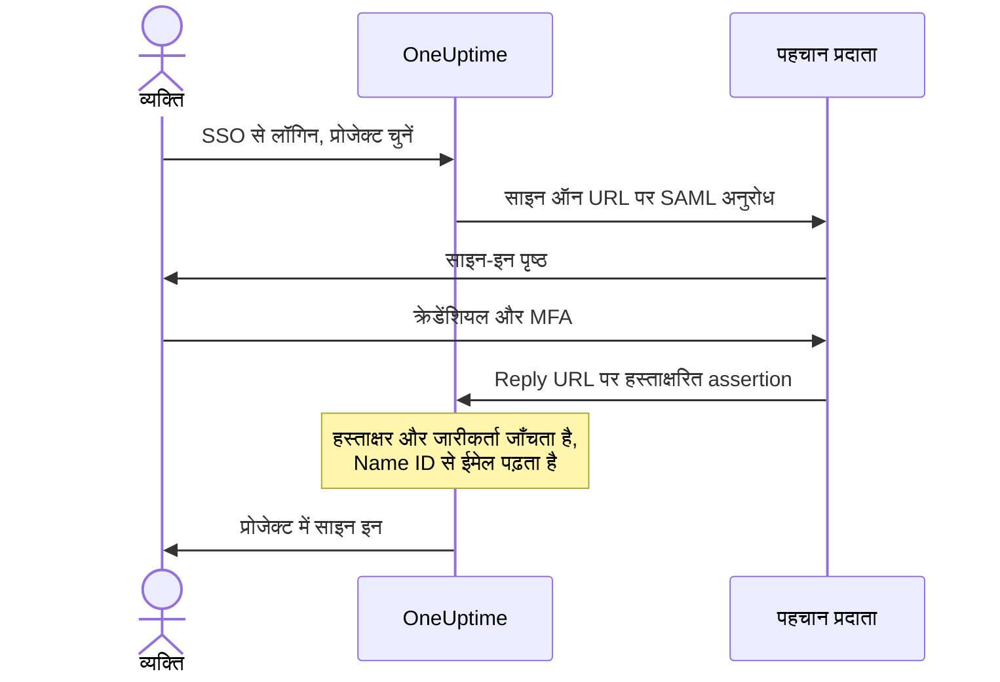

# SSO

सिंगल साइन-ऑन (SSO) से आपके प्रोजेक्ट के लोग आपके संगठन के पहचान प्रदाता (IdP) के ज़रिए, SAML 2.0 या OpenID Connect पर, OneUptime में साइन इन करते हैं। आप पहुँच, पासवर्ड और बहु-कारक प्रमाणीकरण को एक ही जगह से प्रबंधित करते हैं, और प्रोजेक्ट के हर व्यक्ति के लिए SSO अनिवार्य कर सकते हैं।

> [!NOTE]
> **संस्करण:** SSO, "Require SSO for login" सहित, OneUptime के हर संस्करण का हिस्सा है: स्व-होस्टेड इंस्टॉलेशन को यह Community Edition में मिलता है, और इसके लिए किसी लाइसेंस की ज़रूरत नहीं है। OneUptime Cloud पर यह **Scale** प्लान और उससे ऊपर उपलब्ध है। हर संस्करण में क्या शामिल है, यह जानने के लिए [एंटरप्राइज़ संस्करण](/docs/self-hosted/enterprise) देखें।

:::cards
- [SAML प्रदाता सेट अप करें](#sso-सेट-अप-करना): इसे OneUptime में बनाएँ और अपने IdP को दो URL दें।
- [पहचान प्रदाता गाइड](#पहचान-प्रदाता-गाइड): Keycloak, Microsoft Entra ID और Okta, चरण-दर-चरण।
- [OpenID Connect](#openid-connect-oidc): इसके बजाय किसी OIDC ऐप से साइन इन करें।
- [SSO अनिवार्य करें](#अपने-प्रोजेक्ट-के-लिए-sso-अनिवार्य-करना): SSO को प्रोजेक्ट में आने का एकमात्र तरीका बनाएँ।
:::

## SAML साइन-इन कैसे काम करता है

एक SAML प्रदाता एक प्रोजेक्ट को आपके पहचान प्रदाता के एक ऐप्लिकेशन से जोड़ता है। साइन इन करने वाला व्यक्ति OneUptime के **SSO से लॉगिन** पृष्ठ पर प्रोजेक्ट चुनता है, आपके IdP पर साइन इन करता है, और साइन इन होकर वापस आता है।



आपका IdP जो assertion भेजता है, OneUptime उसमें से केवल कुछ चीज़ें पढ़ता है:

| assertion से | OneUptime उसके साथ क्या करता है |
| --- | --- |
| हस्ताक्षर | इसे प्रदाता के **सार्वजनिक प्रमाणपत्र** से जाँचता है। प्रतिक्रिया हस्ताक्षरित होनी चाहिए, और एन्क्रिप्टेड नहीं होनी चाहिए। |
| Issuer | प्रदाता के **जारीकर्ता** से बिल्कुल मेल खाना चाहिए। |
| Name ID | व्यक्ति का ईमेल पता। यह एक मान्य ईमेल पता होना चाहिए। |
| `http://schemas.microsoft.com/identity/claims/displayname` | व्यक्ति का नाम, जिसका उपयोग OneUptime उसका खाता बनाते समय करता है। वैकल्पिक। |

पहली बार साइन इन करने वाले लोग प्रदाता की **टीमें** में शामिल होते हैं, जो तय करती हैं कि वे क्या कर सकते हैं: देखें [SSO उपयोगकर्ताओं के लिए भूमिकाएँ और टीमें](#sso-उपयोगकर्ताओं-के-लिए-भूमिकाएँ-और-टीमें)।

> [!NOTE]
> OneUptime Cloud पर, जब कोई व्यक्ति प्रोजेक्ट के किसी SAML या OIDC प्रदाता से उस प्रोजेक्ट में पहली बार साइन इन करता है, तो OneUptime उसे साइन इन कराने के बजाय ईमेल से एक लिंक भेजता है। वह व्यक्ति लिंक खोलता है, पुष्टि करता है कि प्रोजेक्ट का सिंगल साइन-ऑन उसे साइन इन करा सकता है, और साइन इन जारी रखता है। लिंक 24 घंटे तक काम करता है। यह हर प्रोजेक्ट के लिए एक बार होता है, और तब फिर से होता है जब वह व्यक्ति प्रोजेक्ट छोड़कर वापस आता है। स्व-होस्टेड इंस्टॉलेशन लोगों को तुरंत साइन इन करा देते हैं।

## SSO सेट अप करना

आपको SSO प्रदाता जोड़ने की अनुमति चाहिए — **Project Owner**, **Project Admin** या **Create Project SSO** — और OneUptime Cloud पर **Scale** प्लान। अपने पहचान प्रदाता की ओर के लिए [पहचान प्रदाता गाइड](#पहचान-प्रदाता-गाइड) देखें।

:::steps
1. **प्रोजेक्ट सेटिंग्स पर जाएँ**

   - अपने OneUptime प्रोजेक्ट पर जाएँ
   - **प्रोजेक्ट सेटिंग्स** > **सुरक्षा** > **SSO** पर जाएँ

2. **SSO कॉन्फ़िगरेशन बनाएँ**

   - **SSO बनाएँ** पर क्लिक करें
   - SSO कॉन्फ़िगरेशन के लिए एक **नाम** दर्ज करें (जैसे, "Keycloak SAML" या "Okta SAML")
   - अपने पहचान प्रदाता से **साइन ऑन URL** दर्ज करें
   - अपने पहचान प्रदाता से **जारीकर्ता** (Entity ID) दर्ज करें
   - अपने पहचान प्रदाता से **सार्वजनिक प्रमाणपत्र** चिपकाएँ
   - **साइन-इन** चरण पर, **टीमें** आपके प्रोजेक्ट की सदस्य टीम से शुरू होती हैं: पहली बार साइन इन करने वाले लोग इन टीमों में शामिल होते हैं। केवल वही टीमें स्वीकार की जाती हैं जिनमें आप खुद किसी को आमंत्रित कर सकते हैं: जो टीम आपसे ज़्यादा पहुँच देती है, उसका नाम **टीमें** के नीचे बताया जाता है
   - बाकी सब **और फ़ील्ड** में पहले से भरा होता है: **हस्ताक्षर विधि** (`RSA-SHA256`), **डाइजेस्ट विधि** (`SHA256`) और एक विवरण ("Sign in with" और नाम)। इन्हें तभी बदलें जब आपके पहचान प्रदाता को इसकी ज़रूरत हो

3. **OneUptime का SSO मेटाडेटा प्राप्त करें**
   - सहेजने पर **SSO Configuration** डायलॉग खुलता है। आप इसे **SSO कॉन्फ़िग देखें** बटन से फिर से खोल सकते हैं
   - **Identifier (Entity ID)** कॉपी करें, जैसे `https://oneuptime.com/<project-id>/<provider-id>` — यह आपके IdP कॉन्फ़िगरेशन में चाहिए
   - **Reply URL (Assertion Consumer Service URL)** कॉपी करें, जैसे `https://oneuptime.com/identity/idp-login/<project-id>/<provider-id>` — यह आपके IdP कॉन्फ़िगरेशन में चाहिए
   - नया प्रदाता बंद स्थिति में शुरू होता है। जब आपके IdP में ये दोनों मान आ जाएँ, तो प्रदाता संपादित करें और **सक्षम** चालू करें

4. **प्रदाता का परीक्षण करें**
   - **Test Single Sign On (SSO)** कार्ड में दिया लिंक खोलें और खुलने वाले पृष्ठ पर प्रदाता चुनें। आपको आपके पहचान प्रदाता के साइन-इन पृष्ठ पर भेजा जाता है, फिर साइन इन होकर OneUptime पर वापस
   - जब यह काम करने लगे, तो आप प्रोजेक्ट के लिए [SSO अनिवार्य कर](#अपने-प्रोजेक्ट-के-लिए-sso-अनिवार्य-करना) सकते हैं
:::

## पहचान प्रदाता गाइड

अपना पहचान प्रदाता चुनें। हर गाइड IdP के मान लेती है, OneUptime में प्रदाता बनाती है, और फिर IdP को OneUptime का **Identifier (Entity ID)** और **Reply URL** देती है।

:::tabs
@tab Keycloak
Keycloak एक लोकप्रिय ओपन-सोर्स पहचान और पहुँच प्रबंधन समाधान है। आपको realm वाला एक चालू Keycloak इंस्टेंस चाहिए, और Keycloak तथा OneUptime दोनों में व्यवस्थापक पहुँच।

:::steps
1. **अपने realm के मान इकट्ठा करें**

   - **साइन ऑन URL**: `https://<your-keycloak-domain>/auth/realms/<your-realm>/protocol/saml`
   - **जारीकर्ता**: `https://<your-keycloak-domain>/auth/realms/<your-realm>`
   - **प्रमाणपत्र**: realm का हस्ताक्षर प्रमाणपत्र। `https://<your-keycloak-domain>/auth/realms/<your-realm>/protocol/saml/descriptor` खोलें और `X509Certificate` का मान कॉपी करें, या **Realm settings** > **Keys** खोलें और RS256 कुंजी पर **Certificate** क्लिक करें

   Keycloak 17 और उसके बाद के संस्करण ये URL `/auth` उपसर्ग के बिना देते हैं। प्रमाणपत्र को उसकी अपनी पंक्तियों के बीच रखें, इस तरह:

   ```text
   -----BEGIN CERTIFICATE-----
   MIICnzCCAYcCBgFyPZ8QFzANBgkqhkiG.......
   -----END CERTIFICATE-----
   ```

2. **OneUptime में प्रदाता बनाएँ**

   **प्रोजेक्ट सेटिंग्स** > **सुरक्षा** > **SSO** पर जाएँ, **SSO बनाएँ** पर क्लिक करें और भरें:
   - **नाम**: एक वर्णनात्मक नाम (जैसे, `my-project-oneuptime`)
   - **साइन ऑन URL** और **जारीकर्ता**: ऊपर के मान
   - **सार्वजनिक प्रमाणपत्र**: प्रमाणपत्र, उसकी अपनी `BEGIN CERTIFICATE` और `END CERTIFICATE` पंक्तियों के बीच
   - **हस्ताक्षर विधि** और **डाइजेस्ट विधि**: **और फ़ील्ड** में पहले से सेट (`RSA-SHA256` और `SHA256`)

   सहेजें, और खुलने वाले डायलॉग से **Identifier (Entity ID)** और **Reply URL (Assertion Consumer Service URL)** कॉपी करें।

3. **Keycloak क्लाइंट बनाएँ**

   Keycloak में अपने realm के **Clients** खोलें और एक क्लाइंट बनाएँ, या किसी मौजूदा क्लाइंट को संपादित करें:
   - **Client Protocol** (क्लाइंट प्रकार): `saml`
   - **Client ID**: OneUptime का **Identifier (Entity ID)**
   - **Root URL** और **Valid Redirect URIs**: आपका OneUptime URL
   - **Assertion Consumer Service POST Binding URL**: OneUptime का **Reply URL (Assertion Consumer Service URL)**

4. **क्लाइंट सेटिंग्स समायोजित करें**

   - **Name ID Format** को `email` पर सेट करें और **Force Name ID Format** चालू करें, ताकि Keycloak हमेशा ईमेल को Name ID के रूप में भेजे
   - क्लाइंट के **Keys** टैब पर **Client signature required** (**Signing keys config** में) बंद करें: OneUptime अपने अनुरोधों पर हस्ताक्षर नहीं करता

5. **प्रदाता चालू करें और उसका परीक्षण करें**

   OneUptime में प्रदाता संपादित करें और **सक्षम** चालू करें, फिर **Test Single Sign On (SSO)** कार्ड में दिया लिंक खोलें और प्रदाता चुनें। आपको Keycloak के साइन-इन पृष्ठ पर भेजा जाना चाहिए और फिर OneUptime पर वापस।
:::
@tab Microsoft Entra ID
Microsoft Entra ID (पहले Azure AD / Active Directory) Microsoft की क्लाउड पहचान सेवा है। आपको एक ऐसा टेनेंट चाहिए जो SAML SSO वाले एंटरप्राइज़ ऐप्लिकेशन का समर्थन करता हो, और Entra ID तथा OneUptime दोनों में व्यवस्थापक पहुँच।

:::steps
1. **Entra ID में एक एंटरप्राइज़ ऐप्लिकेशन बनाएँ**

   - [Microsoft Entra admin center](https://entra.microsoft.com) में साइन इन करें
   - **Identity** > **Applications** > **Enterprise applications** पर जाएँ, **+ New application** पर क्लिक करें, फिर **+ Create your own application** पर
   - एक नाम दर्ज करें (जैसे, "OneUptime"), **Integrate any other application you don't find in the gallery (Non-gallery)** चुनें और **Create** पर क्लिक करें

2. **Entra ID के SAML मान कॉपी करें**

   - ऐप्लिकेशन में **Single sign-on** पर जाएँ और **SAML** चुनें
   - **SAML Certificates** में **Certificate (Base64)** डाउनलोड करें, फ़ाइल को किसी टेक्स्ट एडिटर में खोलें और उसकी सामग्री कॉपी करें
   - **Set up OneUptime** में **Login URL** और **Microsoft Entra Identifier** (पुराने टेनेंट में **Azure AD Identifier**) कॉपी करें

3. **OneUptime में प्रदाता बनाएँ**

   **प्रोजेक्ट सेटिंग्स** > **सुरक्षा** > **SSO** पर जाएँ, **SSO बनाएँ** पर क्लिक करें और भरें:
   - **नाम**: एक वर्णनात्मक नाम (जैसे, `Azure AD SAML`)
   - **साइन ऑन URL**: **Login URL**
   - **जारीकर्ता**: **Microsoft Entra Identifier**
   - **सार्वजनिक प्रमाणपत्र**: Base64 प्रमाणपत्र, `BEGIN CERTIFICATE` और `END CERTIFICATE` पंक्तियों सहित
   - **हस्ताक्षर विधि** और **डाइजेस्ट विधि**: **और फ़ील्ड** में पहले से सेट (`RSA-SHA256` और `SHA256`)

   सहेजें, और खुलने वाले डायलॉग से **Identifier (Entity ID)** और **Reply URL (Assertion Consumer Service URL)** कॉपी करें।

4. **Entra ID को OneUptime के URL दें**

   **Basic SAML Configuration** में **Edit** पर क्लिक करें और सेट करें:
   - **Identifier (Entity ID)**: OneUptime का **Identifier (Entity ID)**
   - **Reply URL (Assertion Consumer Service URL)**: OneUptime का **Reply URL**

   **Save** पर क्लिक करें।

5. **ईमेल को Name ID के रूप में भेजें**

   **Attributes & Claims** में **Edit** पर क्लिक करें:
   - **Unique User Identifier (Name ID)** को उपयोगकर्ता के ईमेल पते पर सेट करें: `user.mail`, या जहाँ वही ईमेल पता हो वहाँ `user.userprincipalname`
   - **Name identifier format** को `Email address` पर सेट करें
   - वैकल्पिक रूप से, `http://schemas.microsoft.com/identity/claims/displayname` नाम का एक claim जोड़ें जिसका स्रोत गुण `user.displayname` हो, ताकि नए खातों को व्यक्ति का नाम मिले। OneUptime बाकी claims को अनदेखा करता है

6. **उपयोगकर्ता और समूह असाइन करें**

   ऐप्लिकेशन के **Users and groups** में **+ Add user/group** पर क्लिक करें, जिन उपयोगकर्ताओं और समूहों को SSO पहुँच देनी है उन्हें चुनें, और **Assign** पर क्लिक करें।

7. **प्रदाता चालू करें और उसका परीक्षण करें**

   OneUptime में प्रदाता संपादित करें और **सक्षम** चालू करें, फिर **Test Single Sign On (SSO)** कार्ड में दिया लिंक खोलें और प्रदाता चुनें। आपको Microsoft के साइन-इन पृष्ठ पर भेजा जाना चाहिए और फिर OneUptime पर वापस।
:::
@tab Okta
Okta SAML SSO वाला एक व्यापक रूप से उपयोग किया जाने वाला पहचान प्लेटफ़ॉर्म है। आपको व्यवस्थापक पहुँच वाला एक Okta संगठन चाहिए, और OneUptime में व्यवस्थापक पहुँच।

:::steps
1. **Okta में एक SAML ऐप्लिकेशन बनाएँ**

   - Okta Admin Console में **Applications** > **Applications** पर जाएँ और **Create App Integration** पर क्लिक करें
   - **SAML 2.0** चुनें और **Next** पर क्लिक करें, **App name** के रूप में "OneUptime" दर्ज करें और **Next** पर क्लिक करें
   - Okta अपने URL दिखाने से पहले OneUptime के URL माँगता है। अभी के लिए अपना OneUptime पता (उदाहरण के लिए `https://oneuptime.com`) **Single sign-on URL** और **Audience URI (SP Entity ID)** के रूप में दर्ज करें: चरण 4 में आप दोनों को बदल देंगे
   - **Name ID format** को `EmailAddress` पर और **Application username** को `Email` पर सेट करें
   - **Next** पर क्लिक करें, **I'm an Okta customer adding an internal app** चुनें और **Finish** पर क्लिक करें

2. **Okta के SAML मान कॉपी करें**

   ऐप्लिकेशन के **Sign On** टैब पर, **SAML Signing Certificates** में सक्रिय प्रमाणपत्र ढूँढें:
   - **Actions** > **View IdP metadata** पर क्लिक करें, और **साइन ऑन URL** (Identity Provider Single Sign-On URL) तथा **जारीकर्ता** (Identity Provider Issuer) कॉपी करें
   - **Actions** > **Download certificate** पर क्लिक करें, `.cert` फ़ाइल को किसी टेक्स्ट एडिटर में खोलें और उसकी सामग्री कॉपी करें

3. **OneUptime में प्रदाता बनाएँ**

   **प्रोजेक्ट सेटिंग्स** > **सुरक्षा** > **SSO** पर जाएँ, **SSO बनाएँ** पर क्लिक करें और भरें:
   - **नाम**: एक वर्णनात्मक नाम (जैसे, `Okta SAML`)
   - **साइन ऑन URL** और **जारीकर्ता**: Okta के मान
   - **सार्वजनिक प्रमाणपत्र**: प्रमाणपत्र, `BEGIN CERTIFICATE` और `END CERTIFICATE` पंक्तियों सहित
   - **हस्ताक्षर विधि** और **डाइजेस्ट विधि**: **और फ़ील्ड** में पहले से सेट (`RSA-SHA256` और `SHA256`)

   सहेजें, और खुलने वाले डायलॉग से **Identifier (Entity ID)** और **Reply URL (Assertion Consumer Service URL)** कॉपी करें।

4. **Okta को OneUptime के URL दें**

   ऐप्लिकेशन के **General** टैब पर, **SAML Settings** में **Edit** और फिर **Next** पर क्लिक करें, और सेट करें:
   - **Single sign-on URL**: OneUptime का **Reply URL (Assertion Consumer Service URL)**
   - **Audience URI (SP Entity ID)**: OneUptime का **Identifier (Entity ID)**

   वैकल्पिक रूप से, `http://schemas.microsoft.com/identity/claims/displayname` नाम का एक attribute statement जोड़ें जिसका मान `user.firstName + " " + user.lastName` हो, ताकि नए खातों को व्यक्ति का नाम मिले। **Next** पर क्लिक करें, फिर **Finish** पर।

5. **लोगों को असाइन करें**

   **Assignments** टैब पर **Assign** > **Assign to People** या **Assign to Groups** पर क्लिक करें, चुनें कि किसे SSO पहुँच मिले, हर एक के लिए **Assign** पर क्लिक करें, फिर **Done** पर।

6. **प्रदाता चालू करें और उसका परीक्षण करें**

   OneUptime में प्रदाता संपादित करें और **सक्षम** चालू करें, फिर **Test Single Sign On (SSO)** कार्ड में दिया लिंक खोलें और प्रदाता चुनें। आपको Okta के साइन-इन पृष्ठ पर भेजा जाना चाहिए और फिर OneUptime पर वापस।
:::
@tab अन्य
OneUptime का SSO SAML 2.0 का उपयोग करता है और किसी भी अनुरूप पहचान प्रदाता के साथ काम करता है:

:::steps
1. अपने पहचान प्रदाता का **साइन ऑन URL** (उसका SSO एंडपॉइंट), **जारीकर्ता** (उसका entity ID) और **सार्वजनिक प्रमाणपत्र** (उसका X.509 हस्ताक्षर प्रमाणपत्र) प्राप्त करें। अगर आपका IdP इन्हें तभी दिखाता है जब कोई ऐप्लिकेशन मौजूद हो, तो अपने OneUptime पते को अस्थायी URL के रूप में रखकर ऐप्लिकेशन बनाएँ।
2. OneUptime में इन मानों से प्रदाता बनाएँ, और **SSO Configuration** डायलॉग (या **SSO कॉन्फ़िग देखें**) से **Identifier (Entity ID)** और **Reply URL (Assertion Consumer Service URL)** कॉपी करें।
3. अपने पहचान प्रदाता के SAML ऐप्लिकेशन में **Assertion Consumer Service URL / Reply URL** और **Entity ID / Audience URI** को OneUptime के मानों पर, और **Name ID Format** को ईमेल पते पर सेट करें।
4. **हस्ताक्षर विधि** (`RSA-SHA256`) और **डाइजेस्ट विधि** (`SHA256`) **और फ़ील्ड** में पहले से सेट हैं; इन्हें तभी बदलें जब आपका पहचान प्रदाता अलग तरह से हस्ताक्षर करता हो
5. प्रदाता के लिए **सक्षम** चालू करें, और **Test Single Sign On (SSO)** कार्ड के लिंक से उसका परीक्षण करें।
:::
:::

## OpenID Connect (OIDC)

कोई प्रोजेक्ट OpenID Connect प्रदाता के ज़रिए भी साइन इन कर सकता है, जैसे Google Workspace, Okta, Microsoft Entra ID, Auth0 या Keycloak। आपको OIDC प्रदाता जोड़ने की अनुमति (**Project Owner**, **Project Admin** या **Create Project OIDC**) चाहिए, और OneUptime Cloud पर **Scale** प्लान।

:::steps
1. अपने पहचान प्रदाता में एक ऐप (एक OIDC क्लाइंट) पंजीकृत करें जो PKCE के साथ authorization code flow का उपयोग कर सके, और उसका **जारीकर्ता URL**, **क्लाइंट ID** और **क्लाइंट सीक्रेट** कॉपी करें।
2. OneUptime में **प्रोजेक्ट सेटिंग्स** > **सुरक्षा** > **OIDC** पर जाएँ और **OIDC बनाएँ** पर क्लिक करें।
3. एक **नाम** (जो लोग साइन-इन पृष्ठ पर देखते हैं), **जारीकर्ता URL**, **क्लाइंट ID** और **क्लाइंट सीक्रेट** दर्ज करें। आप इसके बजाय प्रदाता का डिस्कवरी URL भी **जारीकर्ता URL** में चिपका सकते हैं।
4. **साइन-इन** चरण पर, **टीमें** आपके प्रोजेक्ट की सदस्य टीम से शुरू होती हैं: पहली बार साइन इन करने वाले लोग इन टीमों में शामिल होते हैं। बाकी सब **और फ़ील्ड** में पहले से भरा होता है: **डिस्कवरी URL** (जारीकर्ता के बाद `/.well-known/openid-configuration`), **दायरे** (`openid email profile`), `email` और `name` claim नाम, और एक विवरण ("Sign in with" और नाम)। इन्हें तभी बदलें जब आपके प्रदाता को इसकी ज़रूरत हो। केवल वही टीमें स्वीकार की जाती हैं जिनमें आप खुद किसी को आमंत्रित कर सकते हैं: जो टीम आपसे ज़्यादा पहुँच देती है, उसका नाम **टीमें** के नीचे बताया जाता है।
5. सहेजें। **OIDC Configuration** डायलॉग **Redirect URI** के साथ खुलता है: इसे अपने ऐप के अनुमत रीडायरेक्ट URI में जोड़ें। नया प्रदाता बंद स्थिति में शुरू होता है, इसलिए फिर उसे संपादित करें और **सक्षम** चालू करें।
6. प्रोजेक्ट के लिए SSO अनिवार्य करने से पहले, **Test OpenID Connect (OIDC)** कार्ड के लिंक से प्रदाता के ज़रिए साइन इन करके देखें।
:::

## SSO उपयोगकर्ताओं के लिए भूमिकाएँ और टीमें

OneUptime आपके पहचान प्रदाता की भूमिकाओं या समूहों को मैप नहीं करता। कोई व्यक्ति क्या कर सकता है, यह उन टीमों से तय होता है जिनमें वह है: प्रदाता नए लोगों को अपनी **टीमें** में जोड़ता है, और आप टीमों और उनकी अनुमतियों को OneUptime में प्रबंधित करते हैं, जैसा [उपयोगकर्ता, टीमें और अनुमतियाँ](/docs/permissions/index) बताता है। टीम सदस्यता को अपने पहचान प्रदाता के साथ मेल में रखने के लिए [SCIM](/docs/identity/scim) का उपयोग करें।

किसी प्रदाता की टीमें तय करती हैं कि उससे साइन इन करने वाले लोग क्या कर सकते हैं, इसलिए प्रदाता केवल उन्हीं टीमों के साथ सहेजा जाता है जिनमें उसे सहेजने वाला व्यक्ति किसी को आमंत्रित कर सकता है। हर बार सहेजने पर इनकी फिर से जाँच होती है: जिस प्रदाता की टीमें आपसे ज़्यादा पहुँच देती हैं, उसे केवल वही बदल सकता है जिसकी पहुँच उन्हें कवर करती है, जैसे कोई प्रोजेक्ट स्वामी। इस जाँच से पहले सहेजे गए प्रदाता लोगों को उनकी टीमों में साइन इन कराते रहते हैं। जो कोई भी प्रदाता संपादित कर सकता है, वह अब भी उसे बंद कर सकता है, ताकि उसे तुरंत रोका जा सके।

## अपने प्रोजेक्ट के लिए SSO अनिवार्य करना

प्रदाता सेट अप करने से किसी को पासवर्ड से साइन इन करने से नहीं रोका जाता। SSO को प्रोजेक्ट में आने का एकमात्र तरीका बनाने के लिए, **प्रोजेक्ट सेटिंग्स** > **सुरक्षा** > **SSO** पर अपने प्रदाताओं के नीचे **लॉगिन के लिए SSO अनिवार्य करें** स्विच का उपयोग करें:

:::steps
1. पहले **Test Single Sign On (SSO)** कार्ड के लिंक से अपने प्रदाता का परीक्षण करें।
2. **लॉगिन के लिए SSO अनिवार्य करें** चालू करें। OneUptime कुछ भी सहेजने से पहले पूछता है: उसके बाद से प्रोजेक्ट के हर व्यक्ति को, आपको भी, प्रोजेक्ट खोलने के लिए SSO से साइन इन करना होगा, और पासवर्ड से साइन इन किया हुआ हर व्यक्ति तब तक प्रोजेक्ट से बाहर रहेगा जब तक वह SSO से साइन इन नहीं करता।
3. पुष्टि करने के लिए **SSO अनिवार्य करें** पर क्लिक करें। स्विच तुरंत सहेजा जाता है; कोई अलग सहेजें बटन नहीं है।
:::

**लॉगिन के लिए SSO अनिवार्य करें** चालू करने के लिए ऐसा प्रदाता चाहिए जो लोगों को प्रोजेक्ट में साइन इन कराए: प्रोजेक्ट का अपना कोई चालू SAML या OIDC प्रदाता, या कोई चालू ग्लोबल प्रदाता जो लोगों को उस प्रोजेक्ट में साइन इन कराता हो। ऐसा न होने पर OneUptime मना कर देता है, और पहले प्रोजेक्ट के लिए कोई प्रदाता चालू करके उसका परीक्षण करने को कहता है। अगर आप वह प्रदाता चुनते हैं जो प्रोजेक्ट को अनिवार्य है, तो वह इन्हीं में से एक होना चाहिए, और बाद में किसी दूसरे प्रदाता को अनिवार्य करने पर भी यही पूछा जाता है।

जो सहेजना **लॉगिन के लिए SSO अनिवार्य करें** को चालू के रूप में भेजता है जबकि वह पहले से चालू है, या उस प्रदाता का नाम देता है जो प्रोजेक्ट को पहले से अनिवार्य है, उसकी भी इसी तरह जाँच होती है — API, Terraform और दूसरे टूल अक्सर हर बार सहेजते समय सारी सेटिंग्स भेजते हैं। इसलिए जब तक प्रोजेक्ट में लोगों को साइन इन कराने वाला कोई प्रदाता नहीं है, या उसके अनिवार्य प्रदाता को बाद में बंद कर दिया गया है, ऐसा सहेजना उन्हीं शब्दों में अस्वीकार किया जाता है, चाहे वह और कुछ भी बदले: पहले कोई प्रदाता चालू करें, किसी दूसरे को अनिवार्य करें, या **लॉगिन के लिए SSO अनिवार्य करें** बंद करें।

नया प्रोजेक्ट भी इसी नियम से बँधा है। उसके पास अभी अपना कोई प्रदाता नहीं होता, इसलिए उसे **लॉगिन के लिए SSO अनिवार्य करें** पहले से चालू रखकर बनाने के लिए — ऐसा केवल मास्टर एडमिन कर सकता है — एक चालू ग्लोबल प्रदाता चाहिए जो लोगों को हर प्रोजेक्ट में साइन इन कराता हो, और ऐसा न होने पर इसे उन्हीं शब्दों में अस्वीकार किया जाता है। प्रोजेक्ट बनाएँ, उसका प्रदाता सेट अप करके परीक्षण करें, फिर स्विच चालू करें।

जब तक पूरा सर्वर SSO अनिवार्य करता है (**Admin** > **सेटिंग्स** > **प्रमाणीकरण** > **लॉगिन के लिए SSO अनिवार्य करें**), कोई भी प्रोजेक्ट बनाने के लिए भी ऐसा ग्लोबल प्रदाता चाहिए, नहीं तो उसे बनाने वाले समेत कोई भी उस प्रोजेक्ट को नहीं खोल पाएगा। ऐसा न होने पर प्रोजेक्ट बनाना अस्वीकार कर दिया जाता है, और संदेश किसी सर्वर एडमिन से एक प्रदाता चालू करने को कहता है। मास्टर एडमिन अब भी प्रोजेक्ट बना सकते हैं।

**लॉगिन के लिए SSO अनिवार्य करें** बंद करना स्विच पलटते ही सहेजा जाता है और सदस्यों को तुरंत उनके पासवर्ड से वापस आने देता है — जब तक कि ठीक उसी पल कोई उसे फिर से चालू न कर दे; तब किसी ऐप सर्वर को साथ आने में एक मिनट तक लग सकता है। प्रोजेक्ट स्वामी, प्रोजेक्ट एडमिन और **Edit Project** अनुमति वाले सदस्य इसे बदल सकते हैं; बाकी सभी को स्विच लॉक दिखता है, साथ में वह अनुमति जो उन्हें चाहिए होगी।

> [!NOTE]
> OneUptime Cloud पर SSO अनिवार्य करने के लिए **Scale** प्लान चाहिए, और इसे बंद करना हर प्लान पर काम करता है। Scale से नीचे, **प्रोजेक्ट सेटिंग्स** > **सुरक्षा** > **SSO** प्लान का अपग्रेड संदेश दिखाता है; जिस प्रोजेक्ट को Scale ट्रायल ने SSO अनिवार्य स्थिति में छोड़ा है, उसे वहीं, अपग्रेड संदेश के नीचे, **लॉगिन के लिए SSO अनिवार्य करें** भी मिलता है, ताकि उसे बंद किया जा सके। इसे फिर से चालू करने के लिए **Scale** चाहिए।

## प्रदाता बंद करना या हटाना

| आप क्या बदलते हैं | प्रदाता से साइन इन किए हुए लोग |
| --- | --- |
| इसे बंद करना, या हटाना | जहाँ SSO अनिवार्य है, वहाँ अगले अनुरोध पर फिर से SSO से साइन इन करते हैं |
| नया प्रमाणपत्र या क्लाइंट सीक्रेट, दूसरे URL, नया नाम या दूसरी टीमें | साइन इन रहते हैं |
| इसे चालू करना | तुरंत इससे साइन इन कर सकते हैं |

किसी SAML या OIDC प्रदाता को बंद करने या हटाने से उसके दिए गए साइन-इन समाप्त हो जाते हैं। ऐसे प्रोजेक्ट में जो SSO अनिवार्य करता है, खुद या इसलिए कि पूरा सर्वर ऐसा करता है:

- जिसने भी इससे साइन इन किया है, उसे अगले अनुरोध पर फिर से SSO से साइन इन करना होगा, और उनके खुले पृष्ठों को तुरंत लाइव अपडेट मिलना बंद हो जाता है।
- किसी ने इससे साइन इन करने के बाद जो MCP क्लाइंट जोड़ा था, वह प्रोजेक्ट में काम करना बंद कर देता है। SSO से साइन इन करने के बाद उसे फिर से जोड़ें।
- प्रदाता को फिर से चालू करने से वे साइन-इन वापस नहीं आते: लोग इससे फिर से साइन इन करते हैं।

किसी प्रदाता में बाकी कुछ भी बदलने से सभी साइन इन रहते हैं: नया प्रमाणपत्र या क्लाइंट सीक्रेट, दूसरे URL, नया नाम या दूसरी टीमें। उनके साइन-इन बनते समय जाँचे गए थे, और अगला साइन-इन नई सेटिंग्स का उपयोग करता है।

जब तक प्रोजेक्ट SSO अनिवार्य करता है, OneUptime अंदर आने का एक रास्ता बनाए रखता है: आप उस आखिरी प्रदाता को बंद या हटा नहीं सकते जिससे लोग प्रोजेक्ट में साइन इन कर सकते हैं — उन ग्लोबल प्रदाताओं को गिनकर जो लोगों को उसमें साइन इन कराते हैं — और न ही उस प्रदाता को जो प्रोजेक्ट को अनिवार्य है। पहले **लॉगिन के लिए SSO अनिवार्य करें** बंद करें।

किसी प्रदाता को चालू करने से लोग तुरंत उससे साइन इन कर सकते हैं।

जब पूरा सर्वर SSO अनिवार्य करता है (**Admin** > **सेटिंग्स** > **प्रमाणीकरण** > **लॉगिन के लिए SSO अनिवार्य करें**), तो हर प्रोजेक्ट इसी तरह अंदर आने का एक रास्ता बनाए रखता है, वह भी जो खुद SSO अनिवार्य नहीं करता: पहले उसके लिए कोई दूसरा प्रदाता चालू करें।

ग्लोबल प्रदाता भी इसी नियम से बँधे हैं: किसी ग्लोबल प्रदाता या उससे संलग्न प्रोजेक्ट में ऐसा बदलाव, जो SSO अनिवार्य करने वाले किसी प्रोजेक्ट को बिना प्रदाता के छोड़ दे, प्रोजेक्ट का नाम बताते हुए अस्वीकार किया जाता है। देखें [ग्लोबल SSO](/docs/identity/global-sso#प्रदाता-बंद-करना-या-हटाना)।

जहाँ न प्रोजेक्ट और न सर्वर SSO अनिवार्य करता है, वहाँ प्रदाता बंद करने से उससे नए साइन-इन रुक जाते हैं। जो लोग पहले से साइन इन हैं, वे साइन इन रहते हैं, जैसे पासवर्ड से साइन इन किए लोग रहते हैं।

## Scale प्लान से नीचे बचे प्रदाता

किसी प्रोजेक्ट के पास बचा SAML या OIDC प्रदाता Scale ट्रायल खत्म होने या प्लान घटने के बाद भी लोगों को साइन इन कराता रहता है। इसलिए Scale से नीचे, **SSO** और **OIDC** पृष्ठ अपग्रेड संदेश के नीचे प्रोजेक्ट के प्रदाताओं की सूची दिखाते हैं (**अभी भी सेट अप किए गए SAML प्रदाता**, **अभी भी सेट अप किए गए OIDC प्रदाता**):

- **बंद करें** किसी प्रदाता को तुरंत रोक देता है। OneUptime पहले पूछता है।
- **हटाएं** उसे हटा देता है।

कोई प्रदाता जोड़ने, उसे बदलने या फिर से चालू करने के लिए **Scale** चाहिए। कौन क्या कर सकता है, यह Scale जैसा ही है: किसी प्रदाता को बंद करने के लिए उसे संपादित करने की अनुमति चाहिए, हटाने के लिए उसे हटाने की अनुमति।

जब तक प्रोजेक्ट अब भी SSO अनिवार्य करता है, उसके **SSO** और **OIDC** पृष्ठ **लॉगिन के लिए SSO अनिवार्य करें** भी दिखाते हैं: आखिरी प्रदाता को बंद करने से पहले इसे बंद करें। तब तक जिस आखिरी प्रदाता से लोग साइन इन कर सकते हैं, उसे बंद या हटाया नहीं जा सकता, ताकि कोई भी प्रोजेक्ट से बाहर न हो।

किसी स्थिति पृष्ठ के **SSO** और **OIDC** पृष्ठ भी इसी तरह उसके अपने प्रदाताओं की सूची दिखाते हैं। जब तक स्थिति पृष्ठ अब भी SSO अनिवार्य करता है, दोनों पृष्ठ **लॉगिन के लिए SSO अनिवार्य करें** भी दिखाते हैं: उसके प्रदाताओं को बंद करने से पहले इसे बंद करें, नहीं तो उसके निजी उपयोगकर्ता बिल्कुल साइन इन नहीं कर पाएँगे।

## समस्या निवारण

:::details "SSO Config not found"
प्रदाता बंद है, या लिंक ऐसे प्रदाता के लिए है जो अब मौजूद नहीं है। नया प्रदाता बंद स्थिति में शुरू होता है: उसे संपादित करें और **सक्षम** चालू करें।
:::

:::details "No teams added."
वह व्यक्ति अभी प्रोजेक्ट में नहीं है, और प्रदाता के पास उसे जोड़ने के लिए कोई **टीमें** नहीं हैं। प्रदाता संपादित करें और कम से कम एक टीम चुनें, जैसे आपके प्रोजेक्ट की सदस्य टीम।
:::

:::details "Issuer URL does not match"
आपके IdP के assertion का जारीकर्ता प्रदाता का **जारीकर्ता** नहीं है। इसे अपने IdP से फिर से कॉपी करें — Keycloak का realm URL, **Microsoft Entra Identifier**, या Okta का Identity Provider Issuer — ताकि दोनों बिल्कुल मेल खाएँ।
:::

:::details साइन-इन हस्ताक्षर या प्रमाणपत्र त्रुटि के साथ विफल होता है
IdP का मौजूदा हस्ताक्षर प्रमाणपत्र **सार्वजनिक प्रमाणपत्र** में चिपकाएँ, `BEGIN CERTIFICATE` और `END CERTIFICATE` पंक्तियों सहित। Entra ID के लिए **Base64** प्रमाणपत्र डाउनलोड करें, कच्चा नहीं; Okta के लिए सक्रिय हस्ताक्षर प्रमाणपत्र; Keycloak के लिए सही realm का प्रमाणपत्र।
:::

:::details "Encrypted SAML Responses are not supported"
OneUptime assertions को डिक्रिप्ट नहीं करता। अपने IdP में ऐप्लिकेशन के लिए assertion एन्क्रिप्शन बंद करें, ताकि वह एक बिना एन्क्रिप्ट किया हुआ, हस्ताक्षरित assertion भेजे।
:::

:::details "SAML response did not include a valid email address"
OneUptime ईमेल पता Name ID से पढ़ता है। Name ID को उपयोगकर्ता के ईमेल पर सेट करें: Keycloak में **Force Name ID Format** के साथ **Name ID Format** `email`, Entra ID में **Unique User Identifier (Name ID)**, या Okta में **Name ID format** `EmailAddress` और **Application username** `Email`। पता व्यक्ति के OneUptime खाते से मेल खाना चाहिए।
:::

:::details Entra ID: AADSTS700016
Entra ID में **Identifier (Entity ID)** OneUptime के मान से मेल नहीं खाता। इसे **SSO कॉन्फ़िग देखें** से फिर से कॉपी करें; दोनों मान एक जैसे होने चाहिए।
:::

:::details Okta: 404, या audience का मेल न खाना
Okta में **Single sign-on URL** बिल्कुल OneUptime का **Reply URL** होना चाहिए, और **Audience URI** बिल्कुल OneUptime का **Identifier (Entity ID)**। जाँचें कि दोनों ने अस्थायी मानों की जगह ले ली है।
:::

:::details उपयोगकर्ता ऐप्लिकेशन को असाइन नहीं है
Entra ID और Okta केवल उन्हीं लोगों को साइन इन कराते हैं जो ऐप्लिकेशन को असाइन हैं। उपयोगकर्ता को, या उसके किसी समूह को, असाइन करें।
:::

:::details Keycloak: रीडायरेक्ट लूप
जाँचें कि सही realm के क्लाइंट पर **Valid Redirect URIs** और **Assertion Consumer Service POST Binding URL** ऊपर बताए अनुसार सेट हैं।
:::

## अगले कदम

:::cards
- [ग्लोबल SSO](/docs/identity/global-sso): स्व-होस्टेड इंस्टेंस पर हर प्रोजेक्ट के लिए एक पहचान प्रदाता।
- [SCIM](/docs/identity/scim): अपने पहचान प्रदाता को लोगों को अपने-आप जोड़ने और हटाने दें।
- [उपयोगकर्ता, टीमें और अनुमतियाँ](/docs/permissions/index): नए लोग जिन टीमों में शामिल होते हैं, वे उन्हें क्या करने देती हैं।
:::
