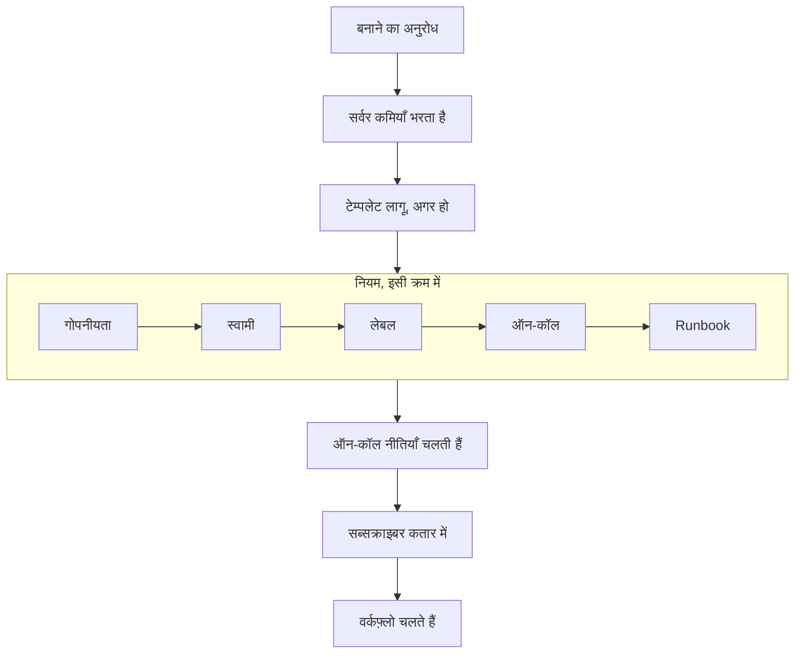

# घटना घोषित करना

घटना घोषित करने से वह रिकॉर्ड बनता है जिस पर आपकी टीम काम करती है: उसे एक संख्या, एक गंभीरता और एक शुरुआती स्थिति मिलती है, उसकी ऑन-कॉल नीतियाँ लोगों को पेज करती हैं, और — जब तक आप मना न करें — स्थिति पृष्ठ के सब्सक्राइबर को इसकी ख़बर मिलती है। यह पेज घटना घोषित करने के पाँचों तरीकों को फ़ील्ड दर फ़ील्ड समझाता है, और बताता है कि घटना बनते ही क्या होता है।

:::cards
- [हाथ से घोषित करें](#हाथ-से-घोषित-करना): तीन चरणों वाला फ़ॉर्म, फ़ील्ड दर फ़ील्ड।
- [टेम्पलेट से घोषित करें](#टेम्पलेट-से-घोषित-करना): एक ही तरह की घटना, हर बार पहले से भरी हुई।
- [मॉनिटर मानदंड से घोषित करें](#मॉनिटर-मानदंड-से-अपने-आप-घोषित-करना): किसी विफल जाँच को आपके लिए घटना खोलने दें।
- [API से घोषित करें](#api-से-घोषित-करना): अपने कोड, किसी स्क्रिप्ट या किसी दूसरे टूल से।
:::

## घटना घोषित होने के पाँच तरीके

कोई घटना पाँच तरीकों से OneUptime में आती है, और सब एक ही जगह पहुँचते हैं: `Incident` तालिका की एक पंक्ति, जिसमें एक गंभीरता, एक वर्तमान स्थिति और प्रभावित संसाधनों की एक सूची होती है। फ़र्क केवल इतना है कि फ़ील्ड कौन भरता है — रात 3 बजे आप, कोई सहेजा हुआ टेम्पलेट, किसी मॉनिटर का मानदंड, API को कॉल करने वाला आपका अपना कोड, या आपकी टीम से बाहर का कोई व्यक्ति जो फ़ॉर्म भरता है।

| अगर आप चाहते हैं…                                              | चुनें                                                                        |
| ------------------------------------------------------------ | --------------------------------------------------------------------------- |
| हाथ से घटना खोलना, सब कुछ ख़ुद भरते हुए                       | **घटना घोषित करें** विज़ार्ड                                                  |
| बार-बार होने वाली तरह की घटना पहले से भरे फ़ील्ड के साथ खोलना  | **टेम्पलेट से बनाएँ**                                                         |
| मॉनिटर की जाँचें विफल होने पर अपने आप घटना खोलना               | **जब फ़िल्टर मेल खाते हैं, तो एक घटना घोषित करें।** वाला मॉनिटर मानदंड फ़िल्टर |
| अपने कोड, किसी स्क्रिप्ट या किसी दूसरे टूल से घटना खोलना       | `POST /api/incident`                                                        |
| टीम से बाहर के लोगों को लिंक के ज़रिए समस्या बताने देना         | एक [फ़ॉर्म](/docs/forms/index)                                                |

पाँचों एक ही मॉडल में लिखते हैं, इसलिए किसी प्रोब की खोली गई घटना ठीक वैसी ही दिखती है जैसी किसी प्रतिक्रिया देने वाले की हाथ से खोली गई घटना — सिवाय कुछ हिसाब-किताब वाले कॉलम के जिन्हें सर्वर अपने आप बनी घटनाओं पर सेट करता है। इंटीग्रेशन भी इसमें लिखते हैं: [Huntress](/docs/integrations/huntress) अपने SOC की भेजी हर घटना रिपोर्ट के लिए एक घटना खोलता है।

> [!TIP]
> आप अलर्ट से भी घटना घोषित कर सकते हैं: अलर्ट की सूची पर, किसी अलर्ट के हेडर में या किसी अलर्ट के **लिंक की गई घटनाएं** पेज पर **घटना घोषित करें** वही विज़ार्ड खोलता है, अलर्ट से पहले से भरा हुआ, और उन्हें नई घटना से लिंक करता है। फ़ॉर्म पर एक बॉक्स, जो डिफ़ॉल्ट रूप से चुना रहता है, अलर्ट को स्वीकार भी करता है, ताकि उनका एस्केलेशन रुक जाए। [लिंक किए गए अलर्ट](/docs/incidents/linked-alerts) देखें।

## हाथ से घोषित करना

**नई घटना घोषित करें** फ़ॉर्म घटना को तीन चरणों में पूछता है — **घटना विवरण**, **प्रभावित संसाधन** और **ऑन-कॉल और भूमिकाएं** — फिर जाँचने के लिए एक सारांश दिखाता है। जब आपका प्रोजेक्ट बनाते समय अपने कुछ घटना कस्टम फ़ील्ड पूछता है, तो **प्रभावित संसाधन** के ठीक बाद चौथा चरण, **विवरण**, आता है।

:::steps
1. **घटनाएं → सभी घटनाएं** खोलें और **घटनाएं** सूची के ऊपर दाईं ओर **घटना घोषित करें** पर क्लिक करें। फ़ॉर्म **घटना विवरण** पर खुलता है।
2. एक **शीर्षक** डालें और एक **घटना गंभीरता** चुनें। फ़ॉर्म का बाकी हिस्सा वैकल्पिक है।
3. बाकी चरणों से **अगला** पर क्लिक करते हुए गुज़रें, और जो अभी पता है वह भरें: मॉनिटर और दूसरे संसाधन, ऑन-कॉल नीतियाँ, भूमिकाएँ।
4. सारांश पढ़ें और **घटना घोषित करें** पर क्लिक करें। आप नई घटना पर पहुँचते हैं, और उसकी **घटना फ़ीड** रिकॉर्ड करना शुरू कर देती है।
:::

केवल पहले चरण में आवश्यक फ़ील्ड हैं, साथ में हर वह कस्टम फ़ील्ड जिसे आपके एडमिन ने **बनाते समय आवश्यक** चिह्नित किया है, जिसे **विवरण** चरण पूछता है। सारांश से पहले के हर चरण पर एक साधारण **अगला** होता है, और **घटना घोषित करें** सारांश पर है, जो आख़िरी चरण है। जल्दी में हों तो **घटना विवरण** भरें और बाकी चरणों को भरे बिना **अगला** दबाते जाएँ: संसाधन जोड़ना, ऑन-कॉल नीतियाँ जोड़ना और भूमिकाएँ असाइन करना घटना के अपने पेजों के लिए भी छोड़ा जा सकता है। किसी फ़ील्ड में **Enter** दबाने से भी आगे बढ़ते हैं; यह सारांश से पहले कभी घोषित नहीं करता।

> [!TIP]
> वे विकल्प जिनकी ज़्यादातर घटनाओं को कभी ज़रूरत नहीं होती, अपने चरण के अंत में एक **और फ़ील्ड** हेडर के नीचे मुड़े हुए इंतज़ार करते हैं; उन्हें खोलने के लिए उस पर क्लिक करें। मुड़ा रहने पर हेडर बताता है कि अंदर क्या है और सेट किया गया हर विकल्प उसके मान के साथ दिखाता है — जैसे किसी टेम्पलेट से, या उस निजी अलर्ट से जिससे आप घोषित कर रहे हैं, सेट हुआ विकल्प — और जब उसके अंदर कुछ ठीक करना हो तो वह अपने आप खुल जाता है। सारांश इनमें से किसी विकल्प को तभी सूचीबद्ध करता है जब वह सेट हो — सिवाय **स्थिति पृष्ठ ग्राहकों को सूचित करें** के, जिसे वह हमेशा सूचीबद्ध करता है, यह बताते हुए कि किसे सूचित किया जाएगा।

**किसी संसाधन के अपने पेज से।** किसी मॉनिटर, होस्ट, सेवा, क्लस्टर या ज़्यादातर दूसरे संसाधनों के **घटनाएं** टैब पर **घटना घोषित करें** वही फ़ॉर्म खोलता है, जिसमें **प्रभावित संसाधन** पर वह संसाधन पहले से चुना होता है, इसलिए बस एक शीर्षक और एक गंभीरता चाहिए, और घटना उसी टैब पर दिखती है जहाँ से आपने शुरू किया था।

:::details कौन-से संसाधन पेज यह देते हैं, और वे क्या चुनते हैं
किसी मॉनिटर, होस्ट, Kubernetes, Proxmox, Ceph या Docker Swarm क्लस्टर, Docker या Podman होस्ट, vCenter, स्टोरेज ऐरे, IoT फ़्लीट, डेटाबेस या सेवा के **घटनाएं** टैब पर **घटना घोषित करें** वही विज़ार्ड खोलता है, जिसमें **प्रभावित संसाधन** पर वह संसाधन पहले से चुना होता है (मॉनिटर **मॉनिटर** के नीचे, बाकी कुछ भी **अन्य प्रभावित संसाधन** के नीचे), किसी टेम्पलेट के जोड़े हुए किसी भी संसाधन से पहले। उस टैब पर **टेम्पलेट से बनाएँ** भी संसाधन बनाए रखता है। ब्रेडक्रंब संसाधन के टैब से होकर वापस जाते हैं, और घोषित होने के बाद आप नई घटना पर पहुँचते हैं, जैसे घटनाओं की सूची से।

किसी इन्वेंटरी आइटम का **घटनाएं** टैब वह होस्ट, सेवा या Kubernetes क्लस्टर चुनता है जिसकी ओर आइटम इशारा करता है, और ब्रेडक्रंब उस संसाधन के टैब से होकर वापस जाते हैं। किसी संसाधन के **अलर्ट** टैब पर **अलर्ट बनाएं** भी ऐसे ही काम करता है: मॉनिटर से यह अलर्ट का **मॉनिटर** भरता है, बाकी किसी भी चीज़ से **अन्य प्रभावित संसाधन**।

संसाधन आपकी अपनी अनुमतियों से खोजा जाता है: अगर आप उसे पढ़ नहीं सकते, या उसे हटा दिया गया है, तो फ़ॉर्म बस बिना कुछ चुने खुलता है।
:::

### चरण 1 — घटना विवरण

- **शीर्षक** — आवश्यक। एक पंक्ति का सारांश जो सब सूची में, Slack में, और (अगर घटना दृश्यमान है) आपके स्थिति पृष्ठ पर देखेंगे। प्लेसहोल्डर: `Incident Title`।
- **घटना गंभीरता** — आवश्यक। आपके प्रोजेक्ट के लिए कॉन्फ़िगर की गई गंभीरताओं में से एक; नए प्रोजेक्ट में **Critical Incident**, **Major Incident** और **Minor Incident** पहले से बनी होती हैं।
- **विवरण** — वैकल्पिक, Markdown में लिखा जाता है। यही वह फ़ील्ड है जो स्थिति पृष्ठ पर दिखता है, इसलिए इसे अपनी टीम के बजाय ग्राहकों के लिए लिखें। इसमें डाली गई छवि, घटना स्थिति पृष्ठों पर दृश्यमान रहने तक सभी को दिखती है, और छिपी रहने पर केवल आपके प्रोजेक्ट के सदस्यों को। आप इसे बाद में घटना के साइड मेनू में **विवरण** से संपादित कर सकते हैं।

**और फ़ील्ड** के नीचे:

- **घोषित किया गया** — उस पल से शुरू होता है जब आपने पेज खोला। घटना की हर अवधि इसी टाइमस्टैम्प से मापी जाती है, इसलिए अगर आप पहले शुरू हुई किसी चीज़ को दर्ज कर रहे हैं, तो इसे पीछे की तारीख़ पर रखें।
- **प्रारंभिक स्थिति** — वैकल्पिक, और शुरू में ख़ाली। ख़ाली छोड़ने पर घटना `isCreatedState` फ़्लैग वाली स्थिति में शुरू होती है, जिसे नए प्रोजेक्ट **Identified** के रूप में बनाते हैं — या, टेम्पलेट से घोषित करने पर, टेम्पलेट की प्रारंभिक स्थिति में। बाद की कोई स्थिति केवल तब चुनें जब आप ऐसी घटना दर्ज कर रहे हों जो पहले ही उस बिंदु से आगे थी, स्वीकार की गई या सुलझाई गई। ऐसी घटना किसी को पेज नहीं करती — [पहले से स्वीकार या सुलझी हुई घोषित](#पहले-से-स्वीकार-या-सुलझी-हुई-घोषित) देखें।
- **लेबल** — वैकल्पिक। लेबल संबंधित घटनाओं को समूह में रखते हैं ताकि आप उनसे फ़िल्टर कर सकें, और जिस टीम की अनुमतियाँ लेबल तक सीमित हैं, वह केवल वे घटनाएँ देखती है जिन पर उसका कोई लेबल हो।
- **निजी घटना** — चेकबॉक्स, डिफ़ॉल्ट रूप से बंद (`isPrivate`)। निजी घटना केवल उसके स्वामी उपयोगकर्ताओं, उसकी स्वामी टीमों के सदस्यों, प्रोजेक्ट एडमिन और प्रोजेक्ट स्वामियों को दिखती है — और वह हर स्थिति पृष्ठ से छिपी रहती है, चाहे कोई भी दूसरी सेटिंग हो, उन स्थिति पृष्ठों सहित जिन तक वह सीमित है। घटनाओं की सूची इन्हें एक लाल **Private** पिल से चिह्नित करती है।

> [!NOTE]
> **अलर्ट और एपिसोड भी आपकी चुनी हुई स्थिति में शुरू होते हैं।** **अलर्ट बनाएं**, और घटना व अलर्ट एपिसोड की सूचियों पर **एपिसोड बनाएँ**, में भी **और फ़ील्ड** के नीचे वही **प्रारंभिक स्थिति** होती है। ख़ाली छोड़ने पर अलर्ट या एपिसोड प्रोजेक्ट की बनाई गई स्थिति में शुरू होता है। जो पहले ही स्वीकार या सुलझाया जा चुका हो, उसे दर्ज करने के लिए बाद की स्थिति चुनें: वह उसी स्थिति में शुरू होता है, उसकी स्थिति टाइमलाइन उसी से शुरू होती है, और सुलझे हुए के रूप में दर्ज एपिसोड तुरंत सुलझा हुआ माना जाता है। उसके स्वामियों को उस पहली स्थिति के बारे में अलग से नहीं बताया जाता, और घटना एपिसोड के स्थिति पृष्ठ सब्सक्राइबर को इसकी ख़बर एक बार मिलती है, जब एपिसोड बनता है। इस तरह दर्ज अलर्ट या एपिसोड, घटना की तरह, किसी को पेज नहीं करता: [पहले से स्वीकार या सुलझी हुई घोषित](#पहले-से-स्वीकार-या-सुलझी-हुई-घोषित) देखें। API से यही चुनाव `currentAlertStateId` या `currentIncidentStateId` है — [OneUptime API संदर्भ](/docs/api-reference/api-reference) देखें।

:::details Markdown एडिटर में लिखना
विवरण — नोट, मूल कारण, सुधार और रिच टेक्स्ट कस्टम फ़ील्ड की तरह — Markdown एडिटर में लिखा जाता है। यह विज़ुअल मोड में खुलता है, जो टेक्स्ट को फ़ॉर्मेट करके दिखाता है; उसके टूलबार पर **Markdown** Markdown मोड में ले जाता है, जो Markdown स्रोत दिखाता है, और **Visual** वापस ले आता है। किसी सूची में, टूलबार पर **इंडेंट बढ़ाएँ** और **इंडेंट घटाएँ**, या Tab और Shift+Tab, किसी आइटम को ऊपर वाले आइटम के नीचे नेस्ट करते हैं और फिर बाहर ले आते हैं; जहाँ नेस्ट करने के लिए कुछ न हो, और किसी सूची के बाहर, Tab हमेशा की तरह अगले फ़ील्ड पर जाता है। विज़ुअल मोड में, किसी पंक्ति के बीच में या अंत में **कोड ब्लॉक**, **तालिका** और **कार्य सूची** पंक्ति को कर्सर पर बाँटते हैं और नया ब्लॉक उसकी अपनी पंक्तियों पर रखते हैं — किसी बोल्ड शब्द, लिंक या इनलाइन कोड के किनारे पर भी, पीछे ख़ाली फ़ॉर्मेटिंग छोड़े बिना — और किसी सूची आइटम में **कार्य सूची** अपना कार्य उप-कार्य के रूप में नहीं, बल्कि उस आइटम की सूची में जोड़ता है। Markdown मोड में, **कोड ब्लॉक** और **तालिका** कर्सर पर जाते हैं, इसलिए उनके लिए पहले नई पंक्ति शुरू करें, **कार्य सूची** कर्सर वाली पंक्ति को कार्य में बदल देता है, और **क्रमांकित सूची** नेस्टेड सूची के हर स्तर को 1 से गिनती है। टूलबार एक ही पंक्ति में रहता है: एडिटर वाले फ़ॉर्म एक चौड़े डायलॉग में खुलते हैं, इसलिए ज़्यादातर स्क्रीन पर हर बटन समा जाता है, और जहाँ नहीं समाता — फ़ोन पर, या संकरी विंडो में — वहाँ न समाने वाले बटन टूलबार के अंत में **अधिक फ़ॉर्मेटिंग** (**⋯**) के नीचे होते हैं, उसी क्रम में, और वहाँ चुना गया हर बटन वहीं लागू होता है जहाँ कर्सर था। सबसे संकरी स्क्रीन पर **Markdown** स्विच भी उसी के नीचे चला जाता है।

**पूर्ववत करना।** विज़ुअल मोड में Ctrl+Z (Mac पर Cmd+Z) आपके बदलावों को एक-एक करके, सबसे नए से शुरू करते हुए, वापस लेता है — आपका टाइप किया हुआ भी और एडिटर के अपने बदलाव भी: इंडेंट बढ़ाना या घटाना, किसी पंक्ति में डाला गया ब्लॉक, फ़ॉर्मेट किया हुआ या ब्लॉक वाला पेस्ट — और Ctrl+Shift+Z (Cmd+Shift+Z) या Ctrl+Y उन्हें उसी क्रम में वापस लाते हैं। Markdown मोड में Ctrl+Z इंडेंट बढ़ाना या घटाना, किसी सूची बटन का बदलाव और फ़ॉर्मेट किया हुआ पेस्ट वापस लेता है, लेकिन वह नहीं जो **कोड ब्लॉक**, **तालिका** और **क्षैतिज रेखा** बटन डालते हैं।

**इसमें पेस्ट करना।** Word, Google Docs या किसी OneUptime पेज से — जैसे किसी दूसरी घटना के विवरण से — पेस्ट करने पर सूचियाँ और उनका नेस्टिंग, लिंक और फ़ॉर्मेटिंग बनी रहती है, और पेस्ट किए गए `•` बुलेट असली सूची बन जाते हैं। जो लिंक केवल एक आइकन होते हैं, जैसे GitHub पर किसी हेडिंग के बगल का एंकर, छोड़ दिए जाते हैं। विज़ुअल मोड में, किसी पंक्ति में पेस्ट किया गया कोड या उद्धरण पंक्ति को बाँटकर अपना अलग ब्लॉक बन जाता है, और किसी सूची आइटम में पेस्ट की गई सूची उसके अंदर नेस्ट होने के बजाय उस आइटम की सूची में जुड़ जाती है — Enter से बने ख़ाली आइटम में पेस्ट करने पर वह उस आइटम की जगह ले लेती है — जबकि किसी आइटम में पेस्ट किया गया कोड ब्लॉक, उद्धरण या तालिका उसके अंदर ही रहता है। Markdown मोड में, पेस्ट से जो ब्लॉक बनते हैं — कोड, उद्धरण, सूची, हेडिंग, कई पैराग्राफ़ — वे किसी पंक्ति के बीच में आने पर अपनी अलग पंक्तियों पर, दोनों ओर एक ख़ाली पंक्ति के साथ, जाते हैं, और किसी सूची आइटम की पंक्ति के अंत में, या अकेले `- ` के बाद, पेस्ट की गई सूची आइटम के इंडेंटेशन पर उस सूची में जुड़ जाती है; सादे टेक्स्ट के रूप में कॉपी किया गया Markdown कर्सर पर ठीक वैसा ही जाता है। किसी कोड ब्लॉक के अंदर जो भी पेस्ट करें, वह ठीक वैसा ही रहता है जैसा आपने कॉपी किया था। कई आइटम, पैराग्राफ़ या तालिका सेल में फैले चयन पर पेस्ट करना उसे बदल देता है, जैसे टाइप करना बदलता। विज़ुअल मोड में, तालिका के सेल पर पेस्ट या **कोड** बटन हर सेल और कॉलम को बनाए रखता है, पेस्ट पीछे कोई ख़ाली बुलेट, उद्धरण या कोड ब्लॉक नहीं छोड़ता, और जब चयन किसी कोड ब्लॉक के अंदर ख़त्म होता है, तो केवल उस कोड पंक्ति का बाकी हिस्सा टेक्स्ट में जुड़ता है।

**किसी नोट से कॉपी करना।** किसी नोट या विवरण से कॉपी किया गया कोड ब्लॉक अपनी भाषा के कोड ब्लॉक के रूप में ही वापस पेस्ट होता है, और उसकी एक पंक्ति भी, अगर पंक्ति-विराम के साथ कॉपी की गई हो, जैसे Chrome, Edge और Safari में ट्रिपल-क्लिक कॉपी करता है। कोड ब्लॉक से कॉपी किया गया कोई शब्द या पंक्ति का हिस्सा इनलाइन कोड के रूप में पेस्ट होता है। Chrome, Edge और Safari में, तालिका के रूप में बने कोड व्यू से कॉपी की गई पंक्तियाँ — किसी Kubernetes संसाधन का YAML टैब, किसी अपवाद के स्टैक ट्रेस के फ़्रेम — अपने सादे टेक्स्ट के रूप में, इंडेंटेशन के साथ, पेस्ट होती हैं।
:::

### चरण 2 — प्रभावित संसाधन

मॉनिटर सबसे पहले आते हैं, अलग से, क्योंकि स्थिति पृष्ठ घटना को उसके मॉनिटर के ज़रिए देखते हैं, और मॉनिटर जिस स्थिति में बदलेंगे वह ठीक उनके नीचे होती है।

- **मॉनिटर** — एक सर्च बॉक्स जो घटना से प्रभावित मॉनिटर जोड़ता है; इसका **लेबल** टैब किसी लेबल वाले हर मॉनिटर को एक साथ जोड़ता है। कोई स्थिति पृष्ठ घटना को दिखाता है, और उसके बारे में अपने सब्सक्राइबर को सूचित करता है, जब वह घटना के किसी मॉनिटर को सूचीबद्ध करता है, इसलिए यही तय करते हैं कि किन स्थिति पृष्ठों को इसकी ख़बर मिलेगी (घटना पर `monitors`)।
- **मॉनिटर स्थिति बदलकर करें** — वैकल्पिक, और केवल तब दिखता है जब कम से कम एक मॉनिटर चुना गया हो। एक मॉनिटर स्थिति चुनता है जो इस घटना से जुड़े हर मॉनिटर पर लागू होती है, ताकि घटना घोषित करना और मॉनिटर को डिग्रेडेड चिह्नित करना दो नहीं, एक ही काम हो। जो टेम्पलेट इसे सेट करता है, उससे घोषित करने पर शुरुआत टेम्पलेट की स्थिति से होती है, जो मॉनिटर चुनते ही दिख जाती है। कोई मॉनिटर न चुना हो तो कोई स्थिति नहीं सहेजी जाती, टेम्पलेट वाली भी नहीं; आख़िरी मॉनिटर हटाने पर फ़ील्ड तब तक हट जाता है जब तक आप दूसरा न चुनें, जो आपका चुनाव वापस ले आता है। किसी मॉनिटर की स्थिति उसे सूचीबद्ध करने वाले हर स्थिति पृष्ठ पर एक ही होती है, इसलिए **और फ़ील्ड** के नीचे स्थिति पृष्ठ चुने होने पर फ़ॉर्म आपको याद दिलाता है कि बदलाव उन पृष्ठों पर भी दिखता है जिन्हें आपने नहीं चुना।
- **अन्य प्रभावित संसाधन** — घटना से प्रभावित बाकी सब के लिए दूसरा सर्च बॉक्स: होस्ट, Kubernetes क्लस्टर, Docker और Podman होस्ट, Proxmox, Ceph और Docker Swarm क्लस्टर, vCenter, स्टोरेज ऐरे, IoT फ़्लीट, डेटाबेस और सेवाएँ — मॉनिटर के अलावा वह सब कुछ जो घटना का अपना **प्रभावित संसाधन** कार्ड देता है। अंदर से ये घटना पर अलग-अलग संबंध हैं (`hosts`, `kubernetesClusters`, `dockerHosts`, `podmanHosts`, `services` और भी), लेकिन फ़ॉर्म इन्हें एक ही पिकर में समेट देता है।

कोई मॉनिटर बता सकता है कि वह किस पर नज़र रखता है — **मॉनिटर → अवलोकन → लिंक किए गए संसाधन**, उसी तरह के संसाधन जो **अन्य प्रभावित संसाधन** में होते हैं। ऐसा मॉनिटर चुनें, और जिनसे वह लिंक है वे तुरंत **अन्य प्रभावित संसाधन** में जुड़ जाते हैं, और फ़ील्ड के नीचे एक पंक्ति बताती है कि क्या जोड़ा गया। घोषित करने से पहले जो नहीं चाहिए उसे हटा दें: जब तक आप फ़ॉर्म पर हैं, उस मॉनिटर के लिए कुछ भी फिर से नहीं जोड़ा जाता, और मॉनिटर हटाने से उसका जोड़ा हुआ बना रहता है। यही तब भी होता है जब मॉनिटर किसी टेम्पलेट से या उस पेज से आता है जहाँ से आपने घोषित किया, और **अलर्ट बनाएं** व **Schedule Maintenance** पर भी।

घटना का **प्रभावित संसाधन** कार्ड, जब आप उसे बाद में संपादित करते हैं, उसी तरह पूछता है: **मॉनिटर**, मॉनिटर होने पर **मॉनिटर स्थिति बदलकर करें**, फिर **अन्य प्रभावित संसाधन**। बिना किसी मॉनिटर के बची घटना को सहेजने पर उसकी पहले वाली स्थिति बनी रहती है।

**और फ़ील्ड** के नीचे:

- **इन स्थिति पृष्ठों तक सीमित करें** — वैकल्पिक। ख़ाली छोड़ने पर घटना उसके मॉनिटर को सूचीबद्ध करने वाले हर स्थिति पृष्ठ पर दिखती है, और उनके सब्सक्राइबर को सूचित करती है। यहाँ पृष्ठ चुनें, तो उनमें से केवल चुने हुए पृष्ठों का उपयोग होता है; **लेबल** टैब किसी लेबल वाले हर पृष्ठ को एक साथ जोड़ता है। फ़ॉर्म आपको चेतावनी देता है जब कोई चुना हुआ पृष्ठ घटना के किसी भी मॉनिटर को सूचीबद्ध नहीं करता, और जब घटना निजी है, जो उसे हर स्थिति पृष्ठ से छिपा देता है। [हर ऑडियंस के लिए एक स्थिति पृष्ठ](/docs/status-pages/one-status-page-per-audience) देखें।
- **स्थिति पृष्ठ ग्राहकों को सूचित करें** — चेकबॉक्स, डिफ़ॉल्ट रूप से चालू। यह तय करता है कि घटना बनने के बारे में सब्सक्राइबर को सूचित किया जाए या नहीं (`shouldStatusPageSubscribersBeNotifiedOnIncidentCreated`)। इसे **और फ़ील्ड** के नीचे मोड़ने से इसका काम नहीं बदलता: यह अब भी चुना हुआ शुरू होता है, और सारांश इसे हमेशा सूचीबद्ध करता है। इसके नीचे, और भेजने से पहले सारांश पर फिर से, **Will notify** उन स्थिति पृष्ठों को सूचीबद्ध करता है जिन्हें बताया जाएगा, हर चैनल के लिए "अधिकतम" सब्सक्राइबर संख्या के साथ, और उन पृष्ठों को जिन्हें नहीं बताया जाएगा और क्यों। जब किसी को नहीं बताया जाएगा (कोई मॉनिटर जुड़ा नहीं है, कोई स्थिति पृष्ठ उन मॉनिटर को सूचीबद्ध नहीं करता, या पृष्ठों पर अभी कोई सब्सक्राइबर नहीं है), तो यह कुछ नहीं दिखाता, और चेतावनी केवल तब देता है जब कारण घटना का स्थिति पृष्ठ दायरा हो। सारांश पर, **हाँ** के बगल में **पूर्वावलोकन** वह ईमेल दिखाता है जो उनमें से हर स्थिति पृष्ठ के सब्सक्राइबर को मिलेगा, और **मुझे टेस्ट भेजें** उसे आपके अपने खाते के ईमेल पर भेजता है; [सब्सक्राइबर और घोषणाएँ](/docs/status-pages/subscribers#घटनाएँ) देखें। आंतरिक शोर के लिए, जिसे आप फिर भी दर्ज करना चाहते हैं, इसे बंद करें। तब घटना डिफ़ॉल्ट रूप से चुप रहती है: उस पर नए सार्वजनिक नोट, और उसके अवलोकन पेज पर स्थिति बदलने वाला मोडल (**स्वीकार करें**, **सुलझाएं**, या कोई दूसरी स्थिति चुनना), अपने **स्थिति पृष्ठ ग्राहकों को सूचित करें** चेकबॉक्स के बंद रहते शुरू होते हैं। **स्थिति टाइमलाइन** पेज पर हाथ वाला फ़ॉर्म और घटनाओं की सूची में बल्क **स्थिति बदलें** कार्रवाई अब भी इसे चालू रखकर शुरू होते हैं।

> [!IMPORTANT]
> **मॉनिटर जोड़ें, भले ही यह बेकार लगे।** किसी घटना और स्थिति पृष्ठ के बीच का संबंध घटना के मॉनिटर से होकर जाता है: कोई स्थिति पृष्ठ घटना को दिखाता है, और उसके बारे में अपने सब्सक्राइबर को सूचित करता है, जब उसका कोई संसाधन घटना के मॉनिटर में से एक हो। **इन स्थिति पृष्ठों तक सीमित करें** उस सूची को केवल छोटा कर सकता है, उसमें कुछ जोड़ नहीं सकता, और **केवल इस पृष्ठ तक सीमित घटनाएँ दिखाएँ** चालू वाला स्थिति पृष्ठ केवल वे घटनाएँ दिखाता है जो उस तक सीमित हैं। बिना मॉनिटर वाली घटना किसी भी स्थिति पृष्ठ सब्सक्राइबर को सूचित नहीं करती। [स्थिति पृष्ठ संसाधन और समूह](/docs/status-pages/resources-and-groups) देखें।

**Should be visible on status page?** फ़्लैग (`isVisibleOnStatusPage`) विज़ार्ड पर नहीं है; यह डिफ़ॉल्ट रूप से true होता है। इसे बाद में घटना के साइड मेनू में **सेटिंग्स** से बदलें, जहाँ इसका लेबल **स्थिति पृष्ठ पर दृश्यमान** है।

**छिपाकर घोषित करना और बाद में प्रकाशित करना।** जो घटना बनते समय स्थिति पृष्ठों से छिपी होती है, वह किसी सब्सक्राइबर को नहीं बताती, और उसकी सूचना स्थिति **छोड़ा गया: स्थिति पृष्ठों से छिपा हुआ** पढ़ती है। जब आप बाद में **स्थिति पृष्ठ पर दृश्यमान** चालू करते हैं, तो संपादन फ़ॉर्म **सब्सक्राइबर को सूचित करें कि यह घटना बनाई गई थी** देता है, ताकि छिपाकर घोषित करने, कौन प्रभावित है यह पता करने और फिर प्रकाशित करने का तरीका भी उन्हें बता सके। घटना अनसुलझी रहने तक यह चुना हुआ शुरू होता है, और सुलझ जाने के बाद बिना चुने, ताकि रिकॉर्ड के लिए किसी पुरानी घटना को प्रकाशित करने पर उसे नई घटना के रूप में घोषित न किया जाए। यह केवल तब दिया जाता है जब घटना **स्थिति पृष्ठ ग्राहकों को सूचित करें** चालू रखकर घोषित की गई थी और निजी नहीं है — इसलिए [फ़ॉर्म](/docs/forms/on-submit) के ज़रिए बताई गई घटना के लिए नहीं, जो इसे बंद रखकर छिपी हुई घोषित होती है। API से, `isVisibleOnStatusPage` को `true` करने वाले अपडेट के साथ `"miscDataProps": {"notifySubscribersOfIncidentCreatedOnPublish": true}` भेजें, या `subscriberNotificationStatusOnIncidentCreated` को ख़ुद वापस `Pending` पर सेट करें। घटना छिपी रहते हुए प्रकाशित पोस्टमॉर्टम को किसी बॉक्स की ज़रूरत नहीं: **स्थिति पृष्ठ पर दृश्यमान** चालू करने से वह एक बार भेजा जाता है, जैसा [सब्सक्राइबर और घोषणाएँ](/docs/status-pages/subscribers#घटनाएँ) में बताया गया है।

### विवरण — आपके घटना कस्टम फ़ील्ड

यह चरण केवल तब दिखता है जब **घटनाएं → सेटिंग्स → कस्टम फ़ील्ड** में कम से कम एक घटना कस्टम फ़ील्ड पर **बनाते समय दिखाएँ** चालू हो — या, टेम्पलेट से घोषित करने पर, जब टेम्पलेट का **बनाते समय कस्टम फ़ील्ड** कोई फ़ील्ड माँगे। यह उन फ़ील्ड को उनके **क्रम** में पूछता है — वह क्रम जिसमें उन्हें उस सेटिंग्स पेज पर खींचकर रखा गया है — उस इनपुट के साथ जो उनका प्रकार माँगता है: ड्रॉपडाउन, संख्या, तारीख़, हाँ/नहीं स्विच, लंबा टेक्स्ट, या Markdown एडिटर में रिच टेक्स्ट। जो व्यक्ति प्रोजेक्ट के घटना कस्टम फ़ील्ड नहीं पढ़ सकता, उसके लिए भी यह छोड़ दिया जाता है: OneUptime Cloud पर इसके लिए **Growth** प्लान या उससे ऊपर, और घटना कस्टम फ़ील्ड देख सकने वाली भूमिका चाहिए।

- **बनाते समय आवश्यक** चिह्नित फ़ील्ड घोषित करने से पहले भरना ज़रूरी है। आवश्यक हाँ/नहीं फ़ील्ड — जैसे कोई पुष्टि — चालू करना ज़रूरी है।
- 0 या बंद छोड़ा गया स्विच भी एक जवाब है, और जवाब के रूप में ही सहेजा जाता है।
- जिस फ़ील्ड का मान किसी मॉनिटर कस्टम फ़ील्ड से कॉपी होता है, घटना पर मॉनिटर होने के बाद वह पूछा नहीं जाता, क्योंकि घटना बनते समय मान मॉनिटर से कॉपी हो जाता है।
- टेम्पलेट से घोषित करने पर चरण टेम्पलेट के मानों से शुरू होता है, और जिन फ़ील्ड को चरण नहीं पूछता उनके लिए टेम्पलेट के मान जैसे हैं वैसे रखे जाते हैं। चरण पर आपके साफ़ किए मान साफ़ ही रहते हैं। टेम्पलेट का कोई मान जो अब अपने फ़ील्ड में फ़िट नहीं होता — जैसे बाद में हटाया गया ड्रॉपडाउन विकल्प — घटना को अस्वीकार करने के बजाय छोड़ दिया जाता है।
- टेम्पलेट से घोषित करना टेम्पलेट के **बनाते समय कस्टम फ़ील्ड** का भी पालन करता है। जिस फ़ील्ड को वह **आवश्यक** या **वैकल्पिक** चिह्नित करता है वह पूछा जाता है, भले ही प्रोजेक्ट उसे बनाते समय न दिखाता हो, जिसे वह **छिपा हुआ** चिह्नित करता है वह पूछा नहीं जाता — उसके लिए टेम्पलेट का मान फिर भी लागू होता है — और **डिफ़ॉल्ट** पर छोड़ा गया फ़ील्ड अपने **बनाते समय दिखाएँ** और **बनाते समय आवश्यक** का पालन करता है। [बनाते समय कस्टम फ़ील्ड](/docs/incidents/settings#बनाते-समय-कस्टम-फ़ील्ड) देखें।

**बनाते समय आवश्यक** केवल डैशबोर्ड जाँचता है, और टेम्पलेट का **बनाते समय कस्टम फ़ील्ड** भी। मॉनिटर, API, Slack, Microsoft Teams या AI से बनी घटनाएँ कोई फ़ील्ड ख़ाली छोड़ सकती हैं, और बाद में घटना के **कस्टम फ़ील्ड** पेज पर हर फ़ील्ड वैकल्पिक रहता है, ताकि आउटेज के बीच एक मान ठीक करने के लिए कभी बाकी सब न माँगा जाए। फ़ील्ड प्रकारों और सेटिंग्स के लिए [कस्टम फ़ील्ड](/docs/incidents/settings#कस्टम-फ़ील्ड) देखें।

### चरण 3 — ऑन-कॉल और भूमिकाएं

- **ऑन-कॉल नीति** — उन ऑन-कॉल ड्यूटी नीतियों का बहु-चयन जिन्हें यह घटना बनने पर चलाना है। यह घटना पर `onCallDutyPolicies` से जुड़ता है।
- **घटना भूमिकाएं असाइन करें** — आपके प्रोजेक्ट में परिभाषित हर भूमिका कौन लेगा, हर भूमिका के लिए एक कार्ड। **प्राथमिक** टैग वाली भूमिका जिसे आप ख़ाली छोड़ते हैं, आपकी होती है: घटना घोषित होने पर आप उसे लेते हैं, और सारांश यह बताता है। एक व्यक्ति वाली भूमिका, किसी के चुने जाने पर यह बता देती है; कई लोगों वाली भूमिका अपना पिकर बनाए रखती है।

यह अकेली जगह है जहाँ ऑन-कॉल नीति सीधे घटना से जोड़ी जाती है। गंभीरताओं के साथ कोई ऑन-कॉल नीति नहीं होती — गंभीरता एक लेबल है, और वह पेजिंग को केवल किसी ऑन-कॉल नियम के अंदर *मिलान मानदंड* के रूप में प्रभावित करती है। **घटनाएं → नियम → ऑन-कॉल नियम** में कॉन्फ़िगर किए गए नियम यहाँ आपके चुने हुए के ऊपर अपनी नीतियाँ जोड़ते हैं; अंत में चलने वाला सेट दोनों का दोहराव-रहित मेल है। बाद की किसी स्थिति में घोषित घटना इनमें से कोई नहीं चलाती — [पहले से स्वीकार या सुलझी हुई घोषित](#पहले-से-स्वीकार-या-सुलझी-हुई-घोषित) देखें।

भूमिकाएँ ख़ुद **घटनाएं → सेटिंग्स → घटना भूमिकाएं** में कॉन्फ़िगर होती हैं। नए प्रोजेक्ट में एक भूमिका होती है, घटना कमांडर; Responder, Communications Lead या आपकी प्रक्रिया को जो भी चाहिए, वहाँ जोड़ें। अगर आप घटना कमांडर के लिए किसी को नहीं चुनते, तो घटना घोषित होने पर आप ही वह बन जाते हैं।

## टेम्पलेट से घोषित करना

अगर आप बार-बार एक ही ढाँचे की घटना घोषित करते हैं — वही शीर्षक पैटर्न, वही गंभीरता, वही ऑन-कॉल नीति — तो उसे एक बार टेम्पलेट के रूप में सहेजें, फिर उससे घोषित करें:

:::steps
1. **घटनाएं** सूची पर **टेम्पलेट से बनाएँ** पर क्लिक करें (**घटना घोषित करें** के बगल वाला आउटलाइन बटन)। एक **टेम्पलेट से घटना बनाएँ** मोडल खुलता है, जिसमें **घटना टेम्पलेट चुनें** ड्रॉपडाउन होता है।
2. एक टेम्पलेट चुनें। बनाने का फ़ॉर्म पहले से भरा हुआ खुलता है।
3. इस बार जो अलग है उसे बदलें, फिर हमेशा की तरह चरणों से गुज़रकर घोषित करें।
:::

अगर आपके प्रोजेक्ट में अभी कोई टेम्पलेट नहीं है, तो इसके बजाय एक **No Incident Templates** मोडल मिलता है, जिसमें एक **Create Template** बटन होता है जो आपको **घटनाएं → सेटिंग्स → घटना टेम्पलेट** पर ले जाता है।

टेम्पलेट अपने चार चरणों वाले विज़ार्ड से बनते हैं — **टेम्पलेट जानकारी**, **घटना विवरण**, **प्रभावित संसाधन**, **ऑन-कॉल** — और जब आपके प्रोजेक्ट में घटना कस्टम फ़ील्ड हों, तो **प्रभावित संसाधन** के बाद **कस्टम फ़ील्ड** और **बनाते समय कस्टम फ़ील्ड** चरण भी। टेम्पलेट की **प्रारंभिक घटना स्थिति**, **मालिक** और **लेबल** **घटना विवरण** के अंत में **और फ़ील्ड** के नीचे हैं। **प्रभावित संसाधन** घोषणा फ़ॉर्म की तरह पूछता है — **मॉनिटर**, फिर **मॉनिटर स्थिति बदलकर करें**, फिर **अन्य प्रभावित संसाधन**, और **और फ़ील्ड** के नीचे **इन स्थिति पृष्ठों तक सीमित करें** — सिवाय इसके कि टेम्पलेट मॉनिटर स्थिति हमेशा पूछता है: वह टेम्पलेट से घटना घोषित करते समय चुने गए मॉनिटर पर भी लागू होती है। फ़ील्ड ये हैं:

| फ़ील्ड                          | उद्देश्य                                                |
| ------------------------------- | ------------------------------------------------------ |
| **टेम्पलेट नाम**                | पिकर में टेम्पलेट की पहचान कैसे होती है।               |
| **टेम्पलेट विवरण**              | आगे के लिए ख़ुद को एक नोट कि इसे कब इस्तेमाल करना है।   |
| **शीर्षक**                      | घटना पर पहले से भरा जाने वाला शीर्षक।                  |
| **विवरण**                       | घटना पर पहले से भरा जाने वाला Markdown विवरण।           |
| **घटना गंभीरता**                | घटना पर पहले से भरी जाने वाली गंभीरता।                 |
| **प्रारंभिक घटना स्थिति**        | वह स्थिति जिसमें इस टेम्पलेट की घटनाएँ शुरू होती हैं। ख़ाली छोड़ने पर, सामान्य शुरुआती स्थिति। स्वीकार की गई या सुलझी हुई शुरू होने वाली घटना किसी को पेज नहीं करती। |
| **मॉनिटर**                      | जोड़े जाने वाले मॉनिटर।                                 |
| **मॉनिटर स्थिति बदलकर करें**     | घटना के मॉनिटर पर लागू होने वाली मॉनिटर स्थिति, घोषित करते समय चुने गए मॉनिटर सहित। |
| **अन्य प्रभावित संसाधन**        | जोड़े जाने वाले होस्ट, क्लस्टर और सेवाएँ।                |
| **इन स्थिति पृष्ठों तक सीमित करें** | वे स्थिति पृष्ठ जिन तक घटना सीमित है।                |
| **ऑन-कॉल नीति**                 | घटना बनने पर चलाई जाने वाली नीतियाँ।                    |
| **मालिक**                       | इस टेम्पलेट से बनी घटनाओं के स्वामी लोग और टीमें, एक ही सूची से चुने गए। |
| **लेबल**                        | घटना पर लगाए जाने वाले लेबल।                           |
| **कस्टम फ़ील्ड**                 | घटना के कस्टम फ़ील्ड के मान।                            |
| **बनाते समय कस्टम फ़ील्ड**        | **विवरण** चरण कौन-से कस्टम फ़ील्ड पूछता है, और कौन-से भरने ज़रूरी हैं। |

कुछ आसान नियम:

- टेम्पलेट की सूची से टेम्पलेट संपादित नहीं किए जा सकते — आप एक बनाते हैं, फिर उसे बदलने के लिए खोलते हैं।
- टेम्पलेट केवल वही फ़ील्ड भरता है जिसे आपने ख़ाली छोड़ा है। बनाने वाले पेज पर टेम्पलेट पहले से भरे मानों के रूप में लागू होता है जिन्हें आप बदल सकते हैं; सर्वर पर — उस फ़ॉर्म के लिए जो टेम्पलेट से घोषित करता है — कोई फ़ील्ड टेम्पलेट से केवल तब भरा जाता है जब अनुरोध ने उस फ़ील्ड को `undefined` छोड़ा हो। कॉल करने वाले ने जो दिया, वही हमेशा जीतता है।
- **विवरण** चरण टेम्पलेट के **बनाते समय कस्टम फ़ील्ड** का पालन करता है, जैसा [ऊपर बताया गया है](#विवरण-आपके-घटना-कस्टम-फ़ील्ड)।
- कस्टम फ़ील्ड के मान एक-एक फ़ील्ड करके मिलाए जाते हैं। टेम्पलेट के मान उन कस्टम फ़ील्ड को भरते हैं जिनके बिना घटना घोषित होती है; **विवरण** चरण पर सेट किया गया, या अनुरोध के `customFields` में भेजा गया मान हमेशा जीतता है — `0`, `false` और `null` सहित। किसी मॉनिटर कस्टम फ़ील्ड से कॉपी होने वाला फ़ील्ड फिर भी मॉनिटर का मान लेता है।
- मौजूदा टेम्पलेट के कस्टम फ़ील्ड मान उसके **कस्टम फ़ील्ड** कार्ड पर होते हैं, उसके दूसरे कार्डों के बगल में।
- टेम्पलेट के **मालिक** घटना के Slack और Microsoft Teams चैनल बन जाने के बाद जोड़े जाते हैं, ताकि घटना स्वामियों को नए चैनल में बुलाने वाला सूचना नियम उन्हें भी बुलाए। डैशबोर्ड में टेम्पलेट से घोषित करना उन्हें "आपको जोड़ा गया" सूचना के बिना जोड़ता है; टेम्पलेट वाला [फ़ॉर्म](/docs/forms/on-submit) उन्हें सूचित करता है, और घटना की **घटना बनाई गई** सूचना को उनके जुड़ने तक रोके रखता है, ताकि वह प्रोजेक्ट के स्वामियों के बजाय उन्हें जाए।

## मॉनिटर मानदंड से अपने आप घोषित करना

ज़्यादातर घटनाओं को किसी इंसान के टाइप करने की ज़रूरत नहीं होनी चाहिए। मॉनिटर का मानदंड फ़िल्टर मेल खाते ही घटना घोषित कर सकता है:

:::steps
1. मॉनिटर खोलें, उसके साइड मेनू में **मानदंड** चुनें और **Edit Monitoring Criteria** पर क्लिक करें। (नया मॉनिटर बनाते समय भी यही मानदंड पूछे जाते हैं।)
2. जिस मानदंड फ़िल्टर को घोषित करना है, उसमें **जब फ़िल्टर मेल खाते हैं, तो एक घटना घोषित करें।** चालू करें। एक **घटना बनाएं** सेक्शन दिखता है जिसमें **घटना जोड़ें** बटन होता है — एक मानदंड फ़िल्टर एक से ज़्यादा घटनाएँ घोषित कर सकता है।
3. घटना के फ़ील्ड (नीचे) भरें और सहेजें। अगली बार फ़िल्टर मेल खाने पर घटना घोषित होती है और अपनी ऑन-कॉल नीतियों को पेज करती है।
:::

हर घटना प्रविष्टि में होता है:

- **घटना शीर्षक** — टेम्पलेटिंग चलती है; प्लेसहोल्डर `{{monitorName}} is down` जैसा कुछ सुझाता है।
- **गंभीरता** — आवश्यक।
- **घटना विवरण** — इसमें भी टेम्पलेटिंग चलती है।
- **ऑन-कॉल → ऑन-कॉल नीतियां** — यह घटना बनने पर चलाई जाने वाली नीतियाँ।
- **घटना भूमिकाएं** — घटना पर हर भूमिका कौन लेगा, उन्हीं कार्डों पर चुना जाता है जिन पर घोषणा फ़ॉर्म का **घटना भूमिकाएं असाइन करें** होता है, हर भूमिका के लिए एक। तब दिखता है जब आपके प्रोजेक्ट में घटना भूमिकाएँ हों।
- **स्वामित्व और लेबल → मालिक** (लोग और टीमें, एक ही सूची से चुने गए), **लेबल**।
- **और फ़ील्ड → घटना स्वतः सुलझाएं** (मानदंड मेल खाना बंद होने पर घटना अपने आप सुलझा देता है), **स्थिति पृष्ठ पर घटना दिखाएं**, **निजी घटना** और **सुधार नोट**।

शीर्षक, विवरण और सुधार नोट में इस्तेमाल किए जा सकने वाले `{{variable}}` प्लेसहोल्डर की पूरी सूची के लिए [घटना और अलर्ट टेम्पलेट](/docs/monitor/incident-alert-templating) देखें।

इस तरह बनी घटनाओं को सर्वर टैग करता है: `isCreatedAutomatically` सेट होता है, `createdCriteriaId` दर्ज करता है कि कौन-सा मानदंड फ़िल्टर चला, और `createdByProbe` दर्ज करता है कि किस प्रोब ने इसे देखा। इनके बारे में बाकी सब बिल्कुल हाथ से घोषित घटना की तरह व्यवहार करता है।

मॉनिटर की घोषित घटना उससे लिंक होती है जिस पर मॉनिटर नज़र रखता है: उसका कॉन्फ़िगरेशन जो कुछ बताता है (होस्ट मॉनिटर का होस्ट, Kubernetes मॉनिटर का क्लस्टर, लॉग मॉनिटर की सेवाएँ) और उसके **लिंक किए गए संसाधन** के नीचे का सब कुछ। वेबसाइट या API मॉनिटर का कॉन्फ़िगरेशन कोई इन्फ्रास्ट्रक्चर नहीं बताता, इसलिए उसे साइट के पीछे के क्लस्टर, होस्ट या डेटाबेस से लिंक करें: तब उसकी घटनाएँ उन संसाधनों के पेजों पर होती हैं, और OneUptime AI वहाँ उनकी जांच कर सकता है और क्लस्टर या संसाधन का AI सुधार उन पर काम कर सकता है ([AI SRE](/docs/ai/ai-sre#which-incidents-a-clusters-fixes-act-on) देखें)। मॉनिटर के बनाए अलर्ट भी इसी तरह लिंक होते हैं।

## API से घोषित करना

घटना मॉडल एक मानक CRUD एंडपॉइंट देता है, इसलिए `POST /api/incident` एक घटना बनाता है। **प्रोजेक्ट सेटिंग्स → उन्नत → API कुंजियाँ** में बनाई गई API कुंजी से प्रमाणित करें, जिसे `apikey` हेडर में भेजा जाता है — कुंजी प्रोजेक्ट की पहचान करती है, इसलिए आपको अलग से प्रोजेक्ट id भेजने की ज़रूरत नहीं।

```bash
curl -X POST https://oneuptime.com/api/incident \
  -H "apikey: $ONEUPTIME_API_KEY" \
  -H "Content-Type: application/json" \
  -d '{
    "data": {
      "title": "Checkout latency above SLO",
      "description": "Investigating elevated p99 latency on the checkout service.",
      "incidentSeverityId": "<incident-severity-id>"
    }
  }'
```

अनुरोध बॉडी के उपयोगी फ़ील्ड:

| फ़ील्ड                   | आवश्यक   | टिप्पणी                                                                                                                                                                                                                                     |
| ------------------------ | -------- | ------------------------------------------------------------------------------------------------------------------------------------------------------------------------------------------------------------------------------------------- |
| `title`                  | हाँ      | घटना का शीर्षक।                                                                                                                                                                                                                             |
| `incidentSeverityId`     | हाँ      | आपके प्रोजेक्ट की गंभीरताओं में से एक। सर्वर जाँचता है कि यह API कुंजी वाले प्रोजेक्ट की ही है, और न हो तो अनुरोध अस्वीकार कर देता है।                                                                                                    |
| `declaredAt`             | नहीं     | यहाँ वैकल्पिक, भले ही फ़ॉर्म इसे आवश्यक मानता है। इसे छोड़ दें तो सर्वर वर्तमान समय का उपयोग करता है।                                                                                                                                     |
| `currentIncidentStateId` | नहीं     | शुरू करने की स्थिति; छोड़ने पर, बनाई गई स्थिति। गंभीरता की तरह, API कुंजी के प्रोजेक्ट से जाँची जाती है। यही जाँच **मॉनिटर स्थिति बदलकर करें** के पीछे की मॉनिटर स्थिति पर भी लागू होती है।                                            |
| `statusPages`            | नहीं     | उन स्थिति पृष्ठों की id जिन तक घटना को सीमित करना है, सभी एक ही प्रोजेक्ट से। घटना के मॉनिटर को सूचीबद्ध करने वाले हर स्थिति पृष्ठ तक पहुँचने के लिए इसे छोड़ दें। `isScopedToStatusPages` इसी से तय होता है, और उसके लिए भेजा गया मान अनदेखा किया जाता है। [हर ऑडियंस के लिए एक स्थिति पृष्ठ](/docs/status-pages/one-status-page-per-audience) देखें। |
| `customFields`           | नहीं     | घटना के कस्टम फ़ील्ड मान, हर फ़ील्ड के नाम से की किए गए। भेजा गया हर मान अपने फ़ील्ड में फ़िट होना चाहिए — **संख्या** फ़ील्ड के लिए एक संख्या, **ड्रॉपडाउन (एकल चयन)** के लिए उसका एक विकल्प — वरना अनुरोध फ़ील्ड का नाम बताते हुए `400` त्रुटि के साथ अस्वीकार कर दिया जाता है। **बनाते समय आवश्यक** यहाँ नहीं जाँचा जाता। [API से कस्टम फ़ील्ड मान](/docs/incidents/settings#api-से-कस्टम-फ़ील्ड-मान) देखें। |

API कुंजी टेम्पलेट से घोषित नहीं कर सकती: `createdIncidentTemplateId` भेजने वाला अनुरोध अस्वीकार कर दिया जाता है। OneUptime वह कॉलम ख़ुद सेट करता है, [फ़ॉर्म](/docs/forms/on-submit) के ज़रिए बताई गई घटनाओं के लिए और वर्कफ़्लो के **Create One Incident** चरण के लिए, जो अपनी **Incident Template** सेटिंग में चुने गए टेम्पलेट से घोषित करता है ([वर्कफ़्लो घटक](/docs/workflows/components) देखें)। API से टेम्पलेट के आधार पर घोषित करने के लिए, `/api/incident-templates` से टेम्पलेट पढ़ें और उसके मान अनुरोध में भेजें।

संबंधित एंडपॉइंट `/api/incident-state`, `/api/incident-severity` और `/api/incident-state-timeline` हैं। बनाए गए [API संदर्भ](/reference) में हर एक के अनुरोध और जवाब का सटीक ढाँचा है, जिसमें यह भी कि मॉनिटर जैसे संबंध फ़ील्ड कैसे लिखे जाते हैं।

## फ़ॉर्म के ज़रिए बताना

पाँचवाँ रास्ता आपकी टीम से बाहर के लोगों के लिए है। फ़ॉर्म एक पेज है जिसे आप लिंक के रूप में साझा करते हैं: जिसके पास भी यह हो, वह बिना OneUptime खाते के समस्या बता सकता है, और हर सबमिशन एक घटना घोषित करता है। फ़ॉर्म क्या पूछता है, यह आप बनाते हैं — एक शीर्षक, एक विवरण, एक गंभीरता, मॉनिटर, कस्टम फ़ील्ड, आपके अपने सवाल — और तय करते हैं कि जवाब घटना कैसे बनते हैं: एक डिफ़ॉल्ट गंभीरता, घोषित करने के लिए एक घटना टेम्पलेट, और हमेशा जोड़े जाने वाले मॉनिटर, लेबल, ऑन-कॉल नीतियाँ और स्वामी।

इस तरह बताई गई घटनाएँ स्थिति पृष्ठों से छिपी हुई घोषित होती हैं, **स्थिति पृष्ठ ग्राहकों को सूचित करें** बंद रखकर, ताकि कुछ भी सार्वजनिक होने से पहले कोई प्रतिक्रिया देने वाला उन्हें परख ले, और एक निजी नोट दर्ज करता है कि उन्हें किसने बताया। फ़ॉर्म अपना अलग उत्पाद हैं, **उत्पाद** मेनू में **फ़ॉर्म** के नीचे, और वे रखरखाव इवेंट भी शेड्यूल कर सकते हैं; [फ़ॉर्म का अवलोकन](/docs/forms/index) देखें।

## घटना संख्याएँ और उपसर्ग

हर घटना को प्रोजेक्ट के अपने काउंटर से एक क्रमिक संख्या मिलती है, जिसे सर्वर बनाते समय असाइन करता है। इसे दो कॉलम रखते हैं: `incidentNumber` (कच्चा पूर्णांक) और `incidentNumberWithPrefix` (जो आप असल में देखते हैं)। कोई उपसर्ग कॉन्फ़िगर न हो, तो दिखने वाला मान `#42` होता है।

:::steps
1. **घटनाएं → सेटिंग्स → संख्या उपसर्ग** पर जाएँ और **अपडेट करें** पर क्लिक करें।
2. **घटना संख्या उपसर्ग** में उपसर्ग टाइप करें। फ़ील्ड टाइप करते समय संख्या का पूर्वावलोकन दिखाता है: `INC-` उसे `INC-42` बनाता है। डिफ़ॉल्ट `#` रखने के लिए इसे ख़ाली छोड़ें।
3. **परिवर्तन सहेजें** पर क्लिक करें। अब से घोषित घटनाओं को नया उपसर्ग मिलता है; मौजूदा घटनाओं की संख्याएँ वही रहती हैं।
:::

उसी डायलॉग में एपिसोड की संख्या के लिए **घटना एपिसोड संख्या उपसर्ग** है। [संख्या उपसर्ग](/docs/incidents/settings#संख्या-उपसर्ग) उन नियमों की सूची देता है जिनका उपसर्ग पालन करता है।

संख्या घटनाओं की सूची के पहले कॉलम के रूप में दिखती है, घटना से लिंक होती है, और घटना के **अवलोकन** पर **घटना संख्या** के रूप में दिखती है।

## घटना घोषित होते ही क्या होता है

बनाने वाला कॉल केवल एक पंक्ति लिखने से ज़्यादा करता है:



क्रम से:

1. **सर्वर कमियाँ भरता है।** `declaredAt` डिफ़ॉल्ट रूप से अभी का समय होता है, वर्तमान स्थिति डिफ़ॉल्ट रूप से प्रोजेक्ट की `isCreatedState` स्थिति होती है, और घटना संख्या व उपसर्ग वाली संख्या प्रोजेक्ट के काउंटर से असाइन होती है।
2. **टेम्पलेट लागू होता है**, जब कोई फ़ॉर्म या वर्कफ़्लो का **Create One Incident** चरण किसी टेम्पलेट से घटना घोषित करता है (`createdIncidentTemplateId`) — केवल वे फ़ील्ड भरते हुए जिन्हें कॉल करने वाले ने undefined छोड़ा; कॉल करने वाले की बताई स्थिति टेम्पलेट वाली पर जीतती है। डैशबोर्ड इसके बजाय, अनुरोध भेजने से पहले, फ़ॉर्म में टेम्पलेट लागू करता है।
3. **गोपनीयता नियम चलते हैं**, और कोई मेल खाता नियम कहे तो घटना को निजी चिह्नित करते हैं। यह चलने वाला पहला नियम इंजन है, इसलिए इसके बाद का सब कुछ सही गोपनीयता सेटिंग देखता है।
4. **स्वामी नियम चलते हैं**, और मेल खाने वाले नियमों में बताए स्वामी उपयोगकर्ता और टीमें जोड़ते हैं।
5. **लेबल नियम चलते हैं**, और घटना से मेल खाने वाले लेबल जोड़ते हैं।
6. **ऑन-कॉल नियम चलते हैं।** **घटनाएं → नियम → ऑन-कॉल नियम** में हर सक्षम नियम, जिसका मानदंड मेल खाता है, अपनी नीतियाँ घटना में जोड़ता है। कोई प्राथमिकता क्रम नहीं है और कोई बीच में रुकना नहीं — सभी मेल खाने वाले नियम चलते हैं और नीतियों से दोहराव हटा दिया जाता है।
7. **Runbook नियम चलते हैं**, और मेल खाने वाली रनबुक जोड़कर शुरू करते हैं। [Runbook का अवलोकन](/docs/runbooks/index) देखें।
8. **ऑन-कॉल नीतियाँ चलती हैं।** घटना पर हर नीति — विज़ार्ड में चुनी गई, टेम्पलेट से मिली, या किसी नियम से जोड़ी गई — `IncidentCreated` इवेंट प्रकार के साथ समानांतर में चलाई जाती है। एक नीति के विफल होने से बाकी नहीं रुकतीं। संग्रहीत (archived) नीति किसी को पेज नहीं करती: घटना पर उसका निष्पादन लॉग बताता है कि नीति संग्रहीत होने के कारण वह नहीं चलाई गई। पहले से स्वीकार की गई या सुलझाई गई घोषित घटना इनमें से कोई नहीं चलाती; नीचे [पहले से स्वीकार या सुलझी हुई घोषित](#पहले-से-स्वीकार-या-सुलझी-हुई-घोषित) देखें।
9. **सब्सक्राइबर कतार में डाले जाते हैं**, अगर **स्थिति पृष्ठ ग्राहकों को सूचित करें** चालू छोड़ा गया था और घटना स्थिति पृष्ठ पर दृश्यमान है। डिलीवरी एक बैकग्राउंड जॉब संभालता है, आपके अनुरोध के साथ-साथ नहीं, और यह उन स्थिति पृष्ठों तक जाती है जहाँ घटना पहुँचती है: वे जो उसके मॉनिटर को सूचीबद्ध करते हैं, **इन स्थिति पृष्ठों तक सीमित करें** से छोटे किए गए, और जब घटना सीमित नहीं है तो उन पृष्ठों के बिना जो केवल अपने तक सीमित घटनाएँ दिखाते हैं। संग्रहीत स्थिति पृष्ठ कुछ नहीं भेजता। इसकी प्रगति घटना के **अवलोकन** पर **ग्राहक सूचना स्थिति** के रूप में दिखती है: हर स्थिति पृष्ठ पर क्या भेजा गया और क्या विफल हुआ, और पूरा होने के बाद **फिर से प्रयास करें** या **फिर से भेजें**। [सब्सक्राइबर और घोषणाएँ](/docs/status-pages/subscribers) देखें।
10. **वर्कफ़्लो चलते हैं।** **On Create Incident** ट्रिगर उस पर बने हर वर्कफ़्लो को शुरू करता है। [वर्कफ़्लो अवलोकन](/docs/workflows/index) देखें।

इसके बाद घटना सक्रिय है: यह घटनाओं के साइड मेनू में **सक्रिय घटनाएं** बैज में गिनी जाती है (आपकी सुलझी हुई स्थिति से ऊपर की कोई भी स्थिति सक्रिय मानी जाती है), यह उन स्थिति पृष्ठों पर दिखती है जिन पर इसका कोई मॉनिटर है (अगर आपने इसे सीमित किया है तो केवल चुने हुए पृष्ठों पर), और इसकी **स्थिति टाइमलाइन** रिकॉर्ड करना शुरू कर देती है।

### पहले से स्वीकार या सुलझी हुई घोषित

बाद की कोई **प्रारंभिक स्थिति** चुनना — फ़ॉर्म पर, टेम्पलेट की **प्रारंभिक घटना स्थिति** से, या API, Terraform या किसी वर्कफ़्लो से `currentIncidentStateId` के साथ — ऐसी घटना दर्ज करता है जिसे कोई पहले से संभाल रहा है, या जो पहले ही ख़त्म हो चुकी है। इसे नई आपात स्थिति नहीं माना जाता:

```mermaid title="नई घटना क्या-क्या शुरू करती है, उस स्थिति के अनुसार जिसमें वह शुरू होती है"
flowchart TB
    start{"शुरुआती स्थिति"} -->|"बनाई गई स्थिति, डिफ़ॉल्ट"| live["नई मानी जाती है: ऑन-कॉल को पेज करती है"]
    start -->|"स्वीकार की गई या उसके बाद"| acked["दर्ज: किसी को पेज नहीं करती"]
    start -->|"सुलझी हुई या उसके बाद"| over["ख़त्म के रूप में दर्ज"]
    over --> quiet["कोई समूहीकरण, रनबुक, AI, चैनल या SLA नहीं"]
```

- **आपकी स्वीकार की गई स्थिति पर या उसके बाद** — **स्वीकार किया गया**, या **घटनाएं → सेटिंग्स → घटना स्थिति** में उसके नीचे रखी कोई भी स्थिति — कोई ऑन-कॉल नीति नहीं चलती, इसलिए किसी को पेज नहीं किया जाता। घटना फिर भी अपनी नीतियाँ सूचीबद्ध करती है, आपकी चुनी हुई और ऑन-कॉल नियमों की जोड़ी हुई, और उसकी फ़ीड एक पंक्ति में कारण बताती है: _No one was paged. This incident was created already acknowledged, so its on-call policy **Primary** was not run._ अगर कोई नियम उसे SLA देता है, तो वह पहले से जवाब दिया हुआ शुरू होता है। नीचे का बाकी सब किसी भी नई घटना की तरह चलता है।
- **आपकी सुलझी हुई स्थिति पर या उसके बाद** — **सुलझाया गया**, या उसके नीचे रखी कोई भी स्थिति — घटना ख़त्म हो चुकी है, इसलिए उसके ऊपर, सक्रिय घटना का जवाब देने वाला कुछ भी नहीं चलता:
  - उसे किसी एपिसोड में समूहित नहीं किया जाता, जो फिर से पेज कर सकता था;
  - कोई Runbook नियम और कोई स्वचालित सुधार नियम उस पर काम नहीं करता;
  - OneUptime AI उसकी जांच नहीं करता — उसका **AI Investigation** कार्ड बताता है कि वह पहले से सुलझी हुई बनाई गई थी, और उसके नीचे **Ask OneUptime AI** फिर भी उसके बारे में सवालों के जवाब देता है;
  - उसके लिए कोई Slack या Microsoft Teams चैनल नहीं बनाया जाता;
  - उसके मॉनिटर अपनी स्थिति बनाए रखते हैं और उनकी निगरानी जारी रहती है, **मॉनिटर स्थिति बदलकर करें** कुछ भी कहे;
  - उसके लिए कोई SLA शुरू नहीं होता।
- **फिर भी क्या होता है:** गोपनीयता, स्वामी, लेबल और ऑन-कॉल नियम चलते हैं, उसके स्वामी जोड़े जाते हैं और उन्हें बताया जाता है कि वह बनाई गई, **घटना बनाई गई** प्रविष्टि उसकी फ़ीड में लिखी जाती है और आपके नियमों में बताए Slack और Microsoft Teams चैनलों पर पोस्ट होती है, और स्थिति पृष्ठ के सब्सक्राइबर को तब बताया जाता है जब **स्थिति पृष्ठ ग्राहकों को सूचित करें** चालू हो और घटना उनके स्थिति पृष्ठ पर दिखती हो। पहले से ख़त्म हो चुकी घटना भी उनके लिए ख़बर है।

अलर्ट, अलर्ट एपिसोड और घटना एपिसोड भी इसी नियम का पालन करते हैं: पहले से स्वीकार की गई बनाई गई चीज़ किसी को पेज नहीं करती, और सुलझी हुई बनाई गई चीज़ न समूहित होती है, न उसका सुधार होता है, न AI उसकी जांच करता है, और उसे अपना कोई चैनल नहीं मिलता। बनाई गई स्थिति में घटना या अलर्ट — डिफ़ॉल्ट, और हर वह जिसे मॉनिटर खोलता है — पहले की तरह सब कुछ शुरू करता है।

## समस्या निवारण

:::details घोषित करना विफल होता है और बनाई गई घटना स्थिति माँगता है
अगर आपके प्रोजेक्ट में `isCreatedState` फ़्लैग वाली कोई स्थिति नहीं है, तो बनाने वाला कॉल विफल होता है और आपसे सेटिंग्स से बनाई गई घटना स्थिति जोड़ने को कहता है। आमतौर पर यह केवल उस प्रोजेक्ट में होता है जिसकी स्थितियाँ बहुत ज़्यादा बदली गई हों — [घटना स्थितियाँ और गंभीरता](/docs/incidents/states-and-severities) देखें।
:::

:::details घटना घोषित हो गई, लेकिन किसी स्थिति पृष्ठ सब्सक्राइबर को इसकी ख़बर नहीं मिली
क्रम से जाँचें: **स्थिति पृष्ठ ग्राहकों को सूचित करें** चालू था; घटना से कम से कम एक मॉनिटर जुड़ा है, और कोई स्थिति पृष्ठ उस मॉनिटर को सूचीबद्ध करता है; घटना स्थिति पृष्ठों पर दृश्यमान है और निजी नहीं है; और पृष्ठ **इन स्थिति पृष्ठों तक सीमित करें** से बाहर नहीं हुआ है। घटना के **अवलोकन** पर **ग्राहक सूचना स्थिति** बताती है कि इनमें से किसने उसे रोका।
:::

:::details हमारे कस्टम फ़ील्ड वाला विवरण चरण नहीं दिखता
यह चरण केवल तब दिखता है जब किसी फ़ील्ड पर **बनाते समय दिखाएँ** चालू हो, या किसी टेम्पलेट का **बनाते समय कस्टम फ़ील्ड** कोई फ़ील्ड माँगे, और केवल उस व्यक्ति के लिए जो प्रोजेक्ट के घटना कस्टम फ़ील्ड पढ़ सकता है — OneUptime Cloud पर इसके लिए **Growth** प्लान या उससे ऊपर चाहिए।
:::

## आगे क्या पढ़ें

:::cards
- [घटना स्थितियाँ और गंभीरता](/docs/incidents/states-and-severities): स्थिति फ़्लैग क्या करते हैं और अपनी स्थितियाँ कैसे जोड़ें।
- [घटना नोट्स, स्वामी और फ़ीड](/docs/incidents/notes-owners-and-feed): सार्वजनिक नोट, निजी नोट, स्वामी और गतिविधि फ़ीड।
- [घटना सेटिंग्स और स्वचालन](/docs/incidents/settings): टेम्पलेट, कस्टम फ़ील्ड, भूमिकाएँ, नियम और वर्कफ़्लो ट्रिगर।
- [सब्सक्राइबर और घोषणाएँ](/docs/status-pages/subscribers): आपकी अभी घोषित घटना की ख़बर किसे मिलती है।
:::
