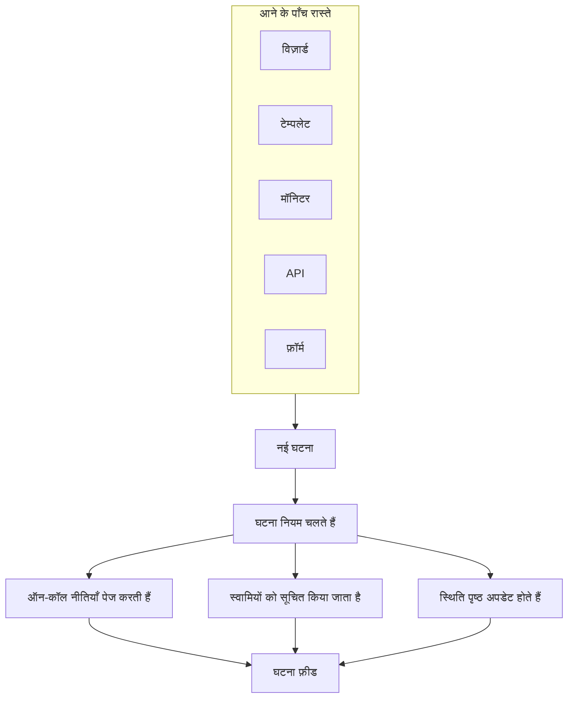
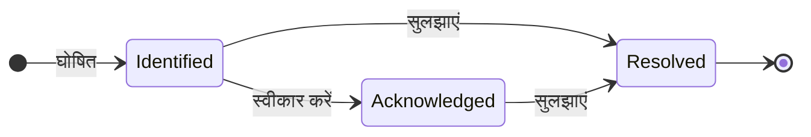

# घटनाओं का अवलोकन

घटना वह रिकॉर्ड है जिस पर कुछ टूटने पर आपकी टीम काम करती है: क्या प्रभावित है, स्थिति कितनी गंभीर है, प्रतिक्रिया कहाँ तक पहुँची है, इसका स्वामी कौन है, और रास्ते में लिखी गई हर बात। घटना घोषित करने से सही ऑन-कॉल रोटेशन को पेज किया जाता है, उसके स्वामियों को बताया जाता है और — अगर आप चाहें — आउटेज आपके स्थिति पृष्ठ पर दिखाया जाता है, ताकि ग्राहक जानें कि आप उस पर काम कर रहे हैं।

:::cards
- [घटना घोषित करना](/docs/incidents/declaring-incidents): हाथ से, टेम्पलेट से, मॉनिटर से, API से या फ़ॉर्म के ज़रिए।
- [घटना स्थितियाँ और गंभीरता](/docs/incidents/states-and-severities): जीवनचक्र, और स्वीकार करने और सुलझाने से क्या होता है।
- [घटना नोट्स, स्वामी और फ़ीड](/docs/incidents/notes-owners-and-feed): ग्राहकों और आपकी टीम के लिए अपडेट, और उनके बारे में किसे पता चलता है।
- [लिंक किए गए अलर्ट](/docs/incidents/linked-alerts): किसी आउटेज से उठे अलर्ट को उस घटना से जोड़ें जो उन्हें समझाती है।
- [घटना सेटिंग्स और स्वचालन](/docs/incidents/settings): टेम्पलेट, कस्टम फ़ील्ड, भूमिकाएँ, माप और नियम।
:::

## एक नज़र में

- **अपना अलग उत्पाद** — टॉप बार के **उत्पाद** मेनू से **घटनाएं** खोलें; सूची `/dashboard/{projectId}/incidents` पर है।
- **तीन पहले से बनी स्थितियाँ** — हर नए प्रोजेक्ट के लिए **Identified**, **स्वीकार किया गया** और **सुलझाया गया** बनाई जाती हैं। आप अपनी स्थितियाँ जोड़ सकते हैं; पहले से बनी तीनों का नाम और रंग बदला जा सकता है, लेकिन उन्हें कभी हटाया नहीं जा सकता।
- **तीन पहले से बनी गंभीरताएँ** — **Critical Incident**, **Major Incident** और **Minor Incident**। गंभीरता रंग और क्रम वाला एक लेबल है — इसका अपना कोई व्यवहार नहीं होता।
- **आने के पाँच रास्ते** — **घटना घोषित करें** विज़ार्ड, **टेम्पलेट से बनाएँ**, मॉनिटर का मानदंड नियम, `POST /api/incident`, या एक [फ़ॉर्म](/docs/forms/index) जिसे उसका लिंक रखने वाला कोई भी भर सकता है।
- **हर प्रोजेक्ट की अपनी संख्या** — हर घटना को प्रोजेक्ट के अपने काउंटर से एक घटना संख्या मिलती है, जो आपके प्रोजेक्ट के उपसर्ग के साथ दिखती है: नए प्रोजेक्ट में `INC-42`, या बिना उपसर्ग के `#42`।
- **दो तरह के नोट** — आपकी टीम के लिए निजी नोट (आंतरिक नोट), स्थिति पृष्ठ के सब्सक्राइबर के लिए सार्वजनिक नोट।
- **अलर्ट घटनाओं से लिंक होते हैं** — किसी घटना का हिस्सा रहे अलर्ट को उससे लिंक करें, या सीधे अलर्ट से घटना घोषित करें — अलर्ट की सूची से या किसी अलर्ट के अपने पेज से — और ऐसा करते समय उन्हें स्वीकार करें। [लिंक किए गए अलर्ट](/docs/incidents/linked-alerts) देखें।
- **सेटिंग्स घटनाओं के अंदर रहती हैं, प्रोजेक्ट सेटिंग्स में नहीं** — स्थितियाँ, गंभीरताएँ, टेम्पलेट, कस्टम फ़ील्ड और नियम इंजन सभी **घटनाएं → सेटिंग्स** और **घटनाएं → नियम** में हैं।

## यह कैसे काम करता है

आप रात 3 बजे हाथ से घटना घोषित कर सकते हैं, या किसी मॉनिटर को उसी पल घटना घोषित करने दे सकते हैं जब उसका मानदंड मेल खाए। दोनों ही तरह घटना एक ही ऑब्जेक्ट है, उसी जीवनचक्र और अंत में उसी लिखित रिकॉर्ड के साथ।

### 1. घटना घोषित होती है

पाँच रास्ते एक ही ऑब्जेक्ट तक ले जाते हैं:

- **हाथ से** — घटनाओं की सूची से **घटना घोषित करें** पर क्लिक करें। इससे तीन चरणों वाला **नई घटना घोषित करें** विज़ार्ड खुलता है: **घटना विवरण**, **प्रभावित संसाधन**, **ऑन-कॉल और भूमिकाएं**। पहला चरण शीर्षक, गंभीरता और विवरण माँगता है, और जो चीज़ें ज़्यादातर घटनाओं को कभी नहीं चाहिए, वे **और फ़ील्ड** के नीचे मुड़ी रहती हैं। केवल पहला चरण ऐसी चीज़ें पूछता है जिनका जवाब देना ज़रूरी है: **अगला** बाकी चरणों से गुज़रता है, और **घटना घोषित करें** अंत के सारांश पर है।
  - **अलर्ट से** — अलर्ट के किसी चयन पर, या किसी एक अलर्ट के हेडर में, **घटना घोषित करें** वही विज़ार्ड खोलता है, अलर्ट से पहले से भरा हुआ, उन्हें नई घटना से लिंक करता है और, जब तक आप बॉक्स से निशान न हटाएँ, उन्हें स्वीकार करता है ताकि उनका एस्केलेशन रुक जाए — [लिंक किए गए अलर्ट](/docs/incidents/linked-alerts) देखें।
- **टेम्पलेट से** — **टेम्पलेट से बनाएँ** पर क्लिक करें और कोई सहेजा हुआ **घटना टेम्पलेट** चुनें। टेम्पलेट शीर्षक, विवरण, गंभीरता, प्रारंभिक स्थिति, संसाधन, ऑन-कॉल नीतियाँ, स्वामी और लेबल पहले से भर देते हैं।
- **मॉनिटर से** — मॉनिटर का वह मानदंड नियम जिसमें "घटना घोषित करें" टॉगल चालू है, फ़िल्टर मेल खाते ही अपने आप घटना बना देता है। वहाँ शीर्षक और विवरण में `{{variable}}` टेम्पलेटिंग चलती है।
- **API से** — API कुंजी के साथ `POST /api/incident`। सर्वर आपके लिए `declaredAt`, बनाई गई स्थिति और घटना संख्या भर देता है।
- **फ़ॉर्म के ज़रिए** — आपकी टीम से बाहर का कोई व्यक्ति, बिना OneUptime खाते के, वह फ़ॉर्म भरता है जिसे आपने लिंक के रूप में साझा किया था। घटना स्थिति पृष्ठों से छिपी हुई घोषित होती है, और अगर फ़ॉर्म में घटना टेम्पलेट है तो उसी से। [फ़ॉर्म का अवलोकन](/docs/forms/index) देखें।

इंटीग्रेशन भी घटनाएँ खोलते हैं: [Huntress](/docs/integrations/huntress) अपने SOC की भेजी हर घटना रिपोर्ट को एक घटना में बदल देता है, जो आपकी चुनी हुई ऑन-कॉल नीतियों को पेज करती है। हर फ़ील्ड की विस्तृत जानकारी के लिए [घटना घोषित करना](/docs/incidents/declaring-incidents) देखें।

### 2. सही लोगों को पता चलता है

घटना बनते ही OneUptime आपके कॉन्फ़िगर किए गए स्वचालन चलाता है: गोपनीयता नियम, स्वामी नियम, लेबल नियम, ऑन-कॉल नियम और Runbook नियम। घटना से जुड़ी सभी ऑन-कॉल ड्यूटी नीतियाँ — हाथ से जोड़ी गई, टेम्पलेट से आई, या किसी मेल खाते ऑन-कॉल नियम से मिलाई गई — समानांतर में चलाई जाती हैं।

स्वामियों को उन चैनलों पर सूचित किया जाता है जिन्हें हर किसी ने **उपयोगकर्ता सेटिंग्स → सूचना सेटिंग्स** में चालू किया है: ईमेल, SMS, वॉइस कॉल, पुश, WhatsApp, Telegram, Slack, Microsoft Teams या webhook। अगर किसी घटना का कोई स्वामी ही नहीं है, तो सूचना छोड़ी नहीं जाती, बल्कि प्रोजेक्ट के स्वामियों को भेजी जाती है।

अगर घटना किसी स्थिति पृष्ठ पर दिखाई देती है और सब्सक्राइबर सूचनाएँ चालू हैं, तो सब्सक्राइबर को भी बताया जाता है: हर उस स्थिति पृष्ठ के सब्सक्राइबर को जो उसके किसी मॉनिटर को सूचीबद्ध करता है, या केवल उन पृष्ठों के सब्सक्राइबर को जिन तक आपने उसे सीमित किया है। हर ऑडियंस को अपना स्थिति पृष्ठ देने के लिए [हर ऑडियंस के लिए एक स्थिति पृष्ठ](/docs/status-pages/one-status-page-per-audience) देखें।

> [!NOTE]
> सूचनाएँ cron से चलती हैं और हर मिनट चलती हैं, इसलिए तुरंत भेजे जाने के बजाय लगभग एक मिनट तक की देरी की उम्मीद रखें।

### 3. आपकी टीम उस पर काम करती है

प्रतिक्रिया देने वाले घटना को स्वीकार करते हैं, प्रभावित संसाधन जोड़ते हैं, उससे संबंधित अलर्ट लिंक करते हैं, रनबुक चलाते हैं, घटना भूमिकाएँ असाइन करते हैं, और जो सीखते हैं उसे लिखते जाते हैं — टीम के लिए निजी नोट, ग्राहकों के लिए सार्वजनिक नोट, और तस्वीर साफ़ होने पर **मूल कारण** और **सुधार** पेज। वे जो कुछ भी करते हैं, वह **अवलोकन** पेज पर **घटना फ़ीड** में दर्ज होता है।

### 4. घटना सुलझाई जाती है

**सुलझाएं** पर क्लिक करने से घटना सुलझी हुई स्थिति में चली जाती है, स्थिति टाइमलाइन पर समय दर्ज होता है, अवधि की घड़ी रुक जाती है, उसके रोके हुए मॉनिटर लौटा दिए जाते हैं, और घटना हर उस स्थिति पृष्ठ के सक्रिय हिस्से से हट जाती है जिस पर वह दिख रही थी। इसके लिए और कुछ बदलने की ज़रूरत नहीं — स्थिति पृष्ठ केवल वे घटनाएँ दिखाता है जिनकी स्थिति सुलझी हुई स्थिति से ऊपर है। [सुलझाने से क्या होता है](/docs/incidents/states-and-severities#सुलझाने-से-क्या-होता-है) देखें।

इसके बाद आप पोस्टमॉर्टम लिख सकते हैं और, चाहें तो, उसे स्थिति पृष्ठ पर प्रकाशित कर सकते हैं।

## मुख्य शब्द

कुछ शब्द इस सेक्शन के हर दूसरे पेज पर आते हैं। पहले इन्हें ठीक से समझ लें।

| शब्द                   | इसका मतलब                                                                                                                                           |
| ---------------------- | --------------------------------------------------------------------------------------------------------------------------------------------------- |
| **घटना**               | रिकॉर्ड ख़ुद — शीर्षक, विवरण, गंभीरता, वर्तमान स्थिति, प्रभावित संसाधन, और प्रतिक्रिया के दौरान उस पर लिखी गई हर बात।                               |
| **घटना स्थिति**        | घटना अपने जीवनचक्र में कहाँ है। नाम, रंग और `order` वाली प्रोजेक्ट-स्तर की एक पंक्ति, साथ में वे फ़्लैग जो उसे अर्थ देते हैं।                        |
| **घटना गंभीरता**       | स्थिति कितनी गंभीर है। नाम, रंग और `order` वाली प्रोजेक्ट-स्तर की एक पंक्ति। केवल एक वर्गीकरण — उत्पाद में कुछ भी किसी गंभीरता से अलग बर्ताव नहीं करता। |
| **घटना संख्या**        | प्रोजेक्ट का अपना काउंटर, जो `#42` के रूप में, या आपके कॉन्फ़िगर किए उपसर्ग के साथ `INC-42` के रूप में दिखता है।                                      |
| **प्रभावित संसाधन**    | मॉनिटर, होस्ट, Kubernetes क्लस्टर, Docker होस्ट, सेवाएँ और दूसरा इन्फ्रास्ट्रक्चर जिसे आप घटना से जोड़ते हैं।                                         |
| **सार्वजनिक नोट**      | स्थिति पृष्ठ के पाठकों और सब्सक्राइबर के लिए लिखा गया अपडेट। यह स्थिति पृष्ठ की टाइमलाइन पर दिखता है।                                             |
| **निजी नोट**           | प्रतिक्रिया देने वाली टीम के लिए एक आंतरिक नोट (`IncidentInternalNote` मॉडल)। यह कभी किसी स्थिति पृष्ठ तक नहीं पहुँचता।                              |
| **स्वामी**             | घटना के लिए ज़िम्मेदार उपयोगकर्ता या टीम। घटना बनने पर, नोट पोस्ट होने पर और स्थिति बदलने पर स्वामियों को सूचित किया जाता है।                       |
| **घटना फ़ीड**          | घटना के **अवलोकन** पर केवल-जोड़ने-योग्य गतिविधि टाइमलाइन, जो स्थिति बदलाव, नोट, स्वामी बदलाव, नियमों के चलने और सूचनाओं को दर्ज करती है।           |
| **स्थिति टाइमलाइन**    | घटना किस स्थिति में, कब और कितनी देर रही, इसका रिकॉर्ड — हर बदलाव की सब्सक्राइबर सूचना स्थिति के साथ।                                              |
| **लिंक किया गया अलर्ट** | प्रतिक्रिया के हिस्से के रूप में घटना से लिंक किया गया अलर्ट। एक अलर्ट एक से ज़्यादा घटनाओं से लिंक हो सकता है, और उसकी अपनी स्थिति बनी रहती है।     |

## OneUptime हर प्रोजेक्ट के लिए जो तीन स्थितियाँ बनाता है

जब प्रोजेक्ट बनता है, OneUptime ठीक तीन घटना स्थितियाँ, इसी क्रम में, बनाता है:

| स्थिति                 | क्रम  | रंग                | इसका मतलब                                                                 |
| ---------------------- | ----- | ------------------ | ------------------------------------------------------------------------- |
| **Identified**         | 1     | लाल (`#fd625e`)    | वह स्थिति जिसमें बिल्कुल नई घटना आती है। यही बनाई गई स्थिति है।           |
| **स्वीकार किया गया**   | 2     | पीला (`#ffbf53`)   | किसी ने घटना उठा ली है और उस पर काम कर रहा है।                            |
| **सुलझाया गया**        | 3     | हरा (`#2ab57d`)    | घटना ख़त्म हो गई है। उसे सुलझाना ही उसे आपके स्थिति पृष्ठ से हटाता है।     |

नाम केवल लेबल हैं — व्यवहार असल में स्थिति की पंक्ति पर तीन बूलियन तय करते हैं: `isCreatedState`, `isAcknowledgedState` और `isResolvedState`। हर प्रोजेक्ट में हर फ़्लैग केवल एक स्थिति पर होना अपेक्षित है।

यह अंतर जितना लगता है उससे ज़्यादा मायने रखता है:

- `isCreatedState` तय करता है कि नई घटना कहाँ से शुरू हो। अगर बनाते समय कोई स्थिति स्पष्ट रूप से नहीं चुनी गई, तो OneUptime प्रोजेक्ट की बनाई गई स्थिति ढूँढकर उसका उपयोग करता है।
- `isAcknowledgedState` और `isResolvedState` स्वीकार की गई और सुलझी हुई स्थितियों को चिह्नित करते हैं। घटना की स्थिति उनके मुकाबले कहाँ है, यही घटना के हेडर में **स्वीकार करें** और **सुलझाएं** बटन, घटना के **अवलोकन** पर दो आँकड़ा टाइल, और साइड मेनू में **सक्रिय घटनाएं** की गिनती वाला बैज तय करता है: स्वीकार की गई स्थिति या उसके बाद की किसी भी स्थिति में घटना स्वीकार की गई मानी जाती है, और सुलझी हुई स्थिति या उसके बाद की किसी भी स्थिति में घटना सुलझी हुई मानी जाती है।
- **सक्रिय घटनाएं** की परिभाषा केवल यह है कि "वर्तमान स्थिति सुलझी हुई स्थिति से ऊपर है"। इसलिए सुलझी हुई स्थिति से ऊपर जोड़ी गई आपकी कस्टम स्थिति सक्रिय है; उसके बाद रखी गई स्थिति, सुलझी हुई स्थिति की तरह, सुलझी हुई मानी जाती है।

> [!NOTE]
> पहली पहले से बनी स्थिति का नाम **Identified** है, हालाँकि उत्पाद के अंदर कई विवरण अब भी उसे बनाई गई स्थिति कहते हैं। अगर आप अपने प्रोजेक्ट की स्थितियों की सूची में "Created" ढूँढ रहे हैं, तो वह **Identified** नाम वाली पंक्ति है।

आप **घटनाएं → सेटिंग्स → घटना स्थिति** में अपनी स्थितियाँ जोड़ सकते हैं। नई स्थिति सुलझी हुई स्थिति के ठीक ऊपर जुड़ती है, और पंक्तियों को खींचकर आप उनका क्रम बदलते हैं; **माना जाता है** कॉलम दिखाता है कि हर स्थिति में घटना क्या मानी जाती है — स्वीकार नहीं की गई, स्वीकार की गई या सुलझी हुई। फ़्लैग वाली तीनों स्थितियों पर **अंतर्निर्मित** टैग होता है: उनका क्रम बना रहता है और उन्हें हटाया नहीं जा सकता, लेकिन आप उनका नाम, रंग और जगह बदल सकते हैं, इसीलिए UI स्थितियों के नाम गतिशील रूप से पढ़ता है।

क्रम लागू किया जाता है, यह केवल दिखावे के लिए नहीं है: घटना ऐसी स्थिति में नहीं जा सकती जो क्रम में उसकी वर्तमान स्थिति से पहले आती हो। पूरी जानकारी [घटना स्थितियाँ और गंभीरता](/docs/incidents/states-and-severities) में है।

## OneUptime हर प्रोजेक्ट के लिए जो तीन गंभीरताएँ बनाता है

हर नए प्रोजेक्ट को तीन गंभीरताएँ भी मिलती हैं:

| गंभीरता               | क्रम  | रंग                  | इसका मतलब                                                  |
| --------------------- | ----- | -------------------- | ---------------------------------------------------------- |
| **Critical Incident** | 1     | मैरून (`#b70400`)    | ग्राहकों पर बहुत ज़्यादा असर, तुरंत प्रतिक्रिया ज़रूरी।        |
| **Major Incident**    | 2     | लाल (`#fd625e`)      | उल्लेखनीय असर, आमतौर पर तुरंत प्रतिक्रिया ज़रूरी।               |
| **Minor Incident**    | 3     | पीला (`#ffbf53`)     | कम असर, आमतौर पर काम के घंटों में निपटाया जाता है।             |

गंभीरताओं में `name`, `description`, `color` और `order` होते हैं, और कुछ नहीं। कोई फ़्लैग नहीं है, और कोई भी कोड "Critical Incident" के साथ किसी दूसरी पंक्ति से अलग बर्ताव नहीं करता। गंभीरता वह तरीका है जिससे लोग प्राथमिकता तय करते हैं, और ऑन-कॉल नियम लिखते समय यह मिलान के मानदंड के रूप में उपलब्ध है — लेकिन गंभीरता चुनने से, अपने आप, किसी को पेज नहीं किया जाता।

**घटनाएं → सेटिंग्स → घटना गंभीरता** में गंभीरताएँ संपादित करें या जोड़ें। पहले से बनी गंभीरताओं के पूरे विवरण [घटना स्थितियाँ और गंभीरता](/docs/incidents/states-and-severities) में हैं।

## डैशबोर्ड में घटनाएँ कहाँ हैं

टॉप बार के **उत्पाद** मेनू से **घटनाएं** खोलें। इसका साइड मेनू सेक्शन में बँटा है:

| सेक्शन        | वहाँ आप क्या करते हैं                                                                                                                                                      |
| ------------- | -------------------------------------------------------------------------------------------------------------------------------------------------------------------------- |
| **अवलोकन**    | **सभी घटनाएं** और **सक्रिय घटनाएं** — दूसरे पर एक लाल बैज होता है, जो सुलझी हुई स्थिति से ऊपर की स्थिति वाली घटनाओं की गिनती दिखाता है।                                  |
| **एपिसोड**    | घटना एपिसोड, अपने पेजों वाली एक अलग समूहीकरण सुविधा।                                                                                                                       |
| **एआई**       | **इनसाइट्स**, **लॉग**, **सेटिंग्स**: OneUptime AI ने आपकी घटनाओं से क्या सीखा और उनके लिए क्या-क्या किया, और वह अपने आप क्या कर सकता है — साथ में वे नियम कि वह किन घटनाओं की जांच करता है और उन्हें ठीक करता है। [AI SRE](/docs/ai/ai-sre) देखें। |
| **वर्कस्पेस** | वे चैट वर्कस्पेस जिन्हें इस प्रोजेक्ट ने कनेक्ट किया है: **Slack**, **Microsoft Teams** या दोनों, हर एक के घटनाओं के लिए अपने सूचना नियमों के साथ। दोनों में से कोई कनेक्ट न हो, तो इसमें **Slack या Teams कनेक्ट करें** होता है, एक पेज जो दोनों को और उन्हें कनेक्ट करने का तरीका दिखाता है। |
| **इंटीग्रेशन** | वे टूल जो अपने आप घटनाएँ खोलते हैं: **Huntress**, जिसकी घटना रिपोर्ट ऐसी घटनाएँ बन जाती हैं जो ऑन-कॉल को पेज करती हैं। [Huntress](/docs/integrations/huntress) देखें। |
| **नियम**      | नियम इंजन: **समूहीकरण नियम**, **ऑन-कॉल नियम**, **स्वामी नियम**, **Runbook नियम**, **गोपनीयता नियम**, **लेबल नियम**, **SLA नियम**, **Reminder Rules**। |
| **सेटिंग्स**  | **घटना स्थिति**, **घटना गंभीरता**, **घटना टेम्पलेट**, **नोट टेम्पलेट**, **पोस्टमॉर्टम टेम्पलेट**, **कस्टम फ़ील्ड**, **घटना भूमिकाएं**, **माप**, **लिंक किए गए अलर्ट**, **संख्या उपसर्ग**। |

**अवलोकन** और **एपिसोड** खुले रहते हैं; **एआई**, **वर्कस्पेस**, **इंटीग्रेशन**, **नियम**, **सेटिंग्स** और **डेवलपर** डिफ़ॉल्ट रूप से मुड़े रहते हैं, ताकि मेनू उन सूचियों पर खुले जिनका आप रोज़ उपयोग करते हैं। किसी सेक्शन को खोलने के लिए उसके शीर्षक पर क्लिक करें और वे पेज ढूँढें जिनका ज़िक्र इन दस्तावेज़ों में आगे है; जब आप किसी सेक्शन के किसी पेज पर होते हैं तो वह सेक्शन अपने आप भी खुल जाता है। घटनाओं का कॉन्फ़िगरेशन प्रोजेक्ट सेटिंग्स में नहीं है; वह सब यहीं है।

घटनाओं की सूची ख़ुद **घटना संख्या**, **शीर्षक**, **स्थिति**, **गंभीरता**, **प्रभावित संसाधन**, **घोषित**, **अवधि**, **लेबल** और **मालिक** दिखाती है, साथ में एक साथ कई घटनाएँ बंद करने के लिए **स्थिति बदलें** बल्क कार्रवाई।

## किसी घटना का हर पेज क्या दिखाता है

किसी घटना को खोलें, तो उसका अपना साइड मेनू उसके पेजों को इस तरह समूहों में रखता है:

| साइड मेनू सेक्शन  | पेज                                                                                       |
| ----------------- | ----------------------------------------------------------------------------------------- |
| **अवलोकन**        | **अवलोकन**, **स्थिति टाइमलाइन**, **SLA**                                                  |
| **जांच**          | **विवरण**, **मूल कारण**, **सुधार**, **रनबुक**, **पोस्टमॉर्टम**, **लिंक किए गए अलर्ट**     |
| **टीम**           | **भूमिकाएं**, **ऑन-कॉल निष्पादन**, **मालिक**                                              |
| **सूचनाएं**       | **सूचना लॉग**, **AI लॉग** — जब तक आप **सूचनाएं** पर क्लिक न करें, मुड़ा रहता है           |
| **नोट**           | **निजी नोट**, **सार्वजनिक नोट**                                                           |
| **डेवलपर**        | **Terraform**, **API**, **AI सहायक** — जब तक आप **डेवलपर** पर क्लिक न करें, मुड़ा रहता है |
| **उन्नत**         | **कस्टम फ़ील्ड**, **सेटिंग्स**, **ऑडिट लॉग**, **घटना हटाएं** — जब तक आप **उन्नत** पर क्लिक न करें, मुड़ा रहता है |

हर एक में क्या है:

- **अवलोकन** — एक नज़र में प्रतिक्रिया। हेडर के नीचे आँकड़ा टाइल स्वीकार करने में लगा समय, सुलझाने में लगा समय और कुल **अवधि** दिखाते हैं। पेज की शुरुआत **AI Investigation** कार्ड से होती है — OneUptime AI ने क्या पाया, या वह क्यों शुरू नहीं हुआ — और उसके नीचे **घटना फ़ीड** है। उनके बगल में **Video Call** कार्ड, **घटना विवरण** कार्ड (शीर्षक, गंभीरता, लेबल, घटना संख्या, घोषित होने का समय, घोषित करने वाला, ऑन-कॉल नीतियाँ, और नीचे एक छोटी **ID** पंक्ति पर घटना की ID, क्लिपबोर्ड से एक क्लिक दूर), **घटना भूमिकाएं**, एक **प्रभावित संसाधन** कार्ड और घटना के कस्टम फ़ील्ड होते हैं। जब आपके प्रोजेक्ट में [माप](/docs/incidents/settings#माप) हों, तो **घटना विवरण** के नीचे एक **माप** कार्ड बताता है कि इस घटना के लिए हर माप क्या पढ़ता है: **12 मिनट**, **5 मिनट से चल रहा है**, **नहीं पहुँचा**।
- **स्थिति टाइमलाइन** — हर वह स्थिति जिसमें घटना रही, हर बदलाव के **शुरू होता है**, **समाप्त होता है**, **अवधि** और सब्सक्राइबर सूचना स्थिति के साथ। **कारण देखें** और **लॉग्स देखें** समझाते हैं कि हर बदलाव क्यों हुआ।
- **SLA** — इस घटना के लिए SLA ट्रैकिंग।
- **विवरण**, **मूल कारण**, **सुधार** — तीन markdown पेज। विवरण वह है जो आपके स्थिति पृष्ठ पर दिखता है।
- **रनबुक** — इस घटना से जुड़े Runbook निष्पादन।
- **पोस्टमॉर्टम** — लिखित समीक्षा और उसके अटैचमेंट, जिन्हें आप चाहें तो स्थिति पृष्ठ पर प्रकाशित कर सकते हैं। **पोस्टमॉर्टम नोट संपादित करें** नोट और अटैचमेंट माँगता है, फिर **स्थिति पृष्ठ पर प्रकाशित करें**; केवल जब वह चालू हो, तभी वह **सब्सक्राइबर्स को सूचित करें** और **पोस्टमॉर्टम प्रकाशित किया गया** पूछता है, जिसे प्रकाशन चालू करना अभी के समय पर सेट कर देता है। **Generate with AI** आपके लिए नोट का मसौदा बनाता है, और **टेम्पलेट लागू करें** — जो प्रोजेक्ट में पोस्टमॉर्टम टेम्पलेट होने पर दिखता है — उसे किसी टेम्पलेट से शुरू करता है। सब्सक्राइबर को एक बार बताया जाता है, जब पोस्टमॉर्टम प्रकाशित होता है: पहली बार जब स्थिति पृष्ठ उसे दिखाता है, जिसके लिए **स्थिति पृष्ठ पर प्रकाशित करें** चालू और नोट लिखा होना चाहिए। उसे फिर से सहेजना, या प्रकाशित रहते हुए संपादित करना, स्थिति पृष्ठ को अपडेट करता है और किसी को नहीं बताता; स्थिति पृष्ठ से हटाने के बाद फिर से प्रकाशित करना उन्हें फिर बताता है। घटना छिपी रहते हुए प्रकाशित पोस्टमॉर्टम तब भेजा जाता है जब घटना दिखाई देने लगती है। [पोस्टमॉर्टम](/docs/status-pages/subscribers#घटनाएँ) देखें।
- **लिंक किए गए अलर्ट** — इस घटना से लिंक किए गए अलर्ट, हर अलर्ट की वर्तमान स्थिति के साथ, और किसने व कब लिंक किया। अलर्ट में इसके जोड़ का **लिंक की गई घटनाएं** पेज होता है। [लिंक किए गए अलर्ट](/docs/incidents/linked-alerts) देखें।
- **भूमिकाएं**, **ऑन-कॉल निष्पादन**, **मालिक** — कौन इस पर है, कौन-सी नीतियाँ चलीं, और किसे सूचित किया जाता है।
- **सूचना लॉग**, **AI लॉग**, **ऑडिट लॉग** — क्या भेजा गया और क्या बदला।
- **निजी नोट** और **सार्वजनिक नोट** — आपकी टीम और आपके ग्राहकों को क्या बताया गया। [घटना नोट्स, स्वामी और फ़ीड](/docs/incidents/notes-owners-and-feed) देखें।
- **कस्टम फ़ील्ड**, **सेटिंग्स**, **घटना हटाएं** — **सेटिंग्स** पेज में **स्थिति पृष्ठ पर दृश्यमान** और **निजी घटना** होते हैं, घटना को कुछ स्थिति पृष्ठों तक सीमित करने वाला **स्थिति पृष्ठ दायरा** कार्ड, और **Reminders** कार्ड, जिसका **रिमाइंडर भेजें** स्विच बदलते ही सहेज जाता है और दिखाता है कि अगला रिमाइंडर कब जाएगा।

## घटनाएँ OneUptime के बाकी हिस्सों से कैसे जुड़ती हैं

- **मॉनिटर समस्या पकड़ते हैं; घटनाएँ उसे दर्ज करती हैं।** मॉनिटर का मानदंड नियम अपने आप घटना घोषित कर सकता है, और शीर्षक, गंभीरता, ऑन-कॉल नीतियाँ, स्वामी, लेबल और सुधार नोट पहले से भर सकता है। वहाँ उपलब्ध वेरिएबल के लिए [घटना और अलर्ट टेम्पलेट](/docs/monitor/incident-alert-templating) देखें।
- **अलर्ट संकेत हैं; घटनाएँ प्रतिक्रिया हैं।** जिन अलर्ट को कोई घटना समझाती है, उन्हें किसी भी तरफ़ से उससे लिंक करें, और नए प्रोजेक्ट में चालू रहने वाले दो प्रोजेक्ट स्विच उन अलर्ट को घटना के साथ स्वीकार करते हैं और सुलझाते हैं। [लिंक किए गए अलर्ट](/docs/incidents/linked-alerts) देखें।
- **पेज करने का काम ऑन-कॉल नीतियाँ करती हैं।** नीतियाँ घोषणा विज़ार्ड के **ऑन-कॉल और भूमिकाएं** चरण पर, टेम्पलेट पर, या **घटनाएं → नियम → ऑन-कॉल नियम** के ज़रिए जोड़ें। हर मेल खाता नियम चलता है — चलाई गई नीतियों का सेट सभी मेल खाने वाले नियमों और सीधे जोड़ी गई हर चीज़ का मेल होता है, दोहराव हटाकर।
- **रनबुक लोगों को बताती हैं कि क्या करना है।** Runbook नियम मेल खाती घटना बनने पर अपने आप एक प्रक्रिया जोड़ देते हैं, और प्रतिक्रिया देने वाले घटना से हाथ से भी एक शुरू कर सकते हैं। [Runbook का अवलोकन](/docs/runbooks/index) देखें।
- **स्थिति पृष्ठ ग्राहकों को बताते हैं।** कोई घटना किसी स्थिति पृष्ठ की सक्रिय सूची में तब दिखती है जब पृष्ठ उसके किसी मॉनिटर को सूचीबद्ध करता है, पृष्ठ पर घटनाएँ चालू हैं, घटना स्थिति पृष्ठ पर दृश्यमान चिह्नित है, और उसकी वर्तमान स्थिति सुलझी हुई स्थिति से ऊपर है। कुछ स्थिति पृष्ठों तक सीमित घटना केवल उन्हीं पर दिखती है। निजी घटनाएँ हर स्थिति पृष्ठ से हमेशा छिपी रहती हैं। [स्थिति पृष्ठ अवलोकन](/docs/status-pages/index) और [हर ऑडियंस के लिए एक स्थिति पृष्ठ](/docs/status-pages/one-status-page-per-audience) देखें।
- **वर्कफ़्लो इसके इर्द-गिर्द स्वचालन करते हैं।** **On Create Incident**, **On Update Incident** और **On Delete Incident** ट्रिगर आपको घटना के जीवनचक्र के ऊपर बिना कोड का स्वचालन बनाने देते हैं। [वर्कफ़्लो अवलोकन](/docs/workflows/index) देखें।

## अगले कदम

:::cards
- [घटना घोषित करना](/docs/incidents/declaring-incidents): विज़ार्ड को फ़ील्ड दर फ़ील्ड समझें, या टेम्पलेट, मॉनिटर या API से घोषित करें।
- [घटना स्थितियाँ और गंभीरता](/docs/incidents/states-and-severities): अपनी स्थितियाँ जोड़ें और ठीक-ठीक देखें कि हर एक क्या करती है।
- [स्थिति पृष्ठ अवलोकन](/docs/status-pages/index): घटनाएँ आपके ग्राहकों तक कैसे पहुँचती हैं।
- [सब्सक्राइबर और घोषणाएँ](/docs/status-pages/subscribers): घटना आगे बढ़ने पर किसे सूचित किया जाता है।
:::
