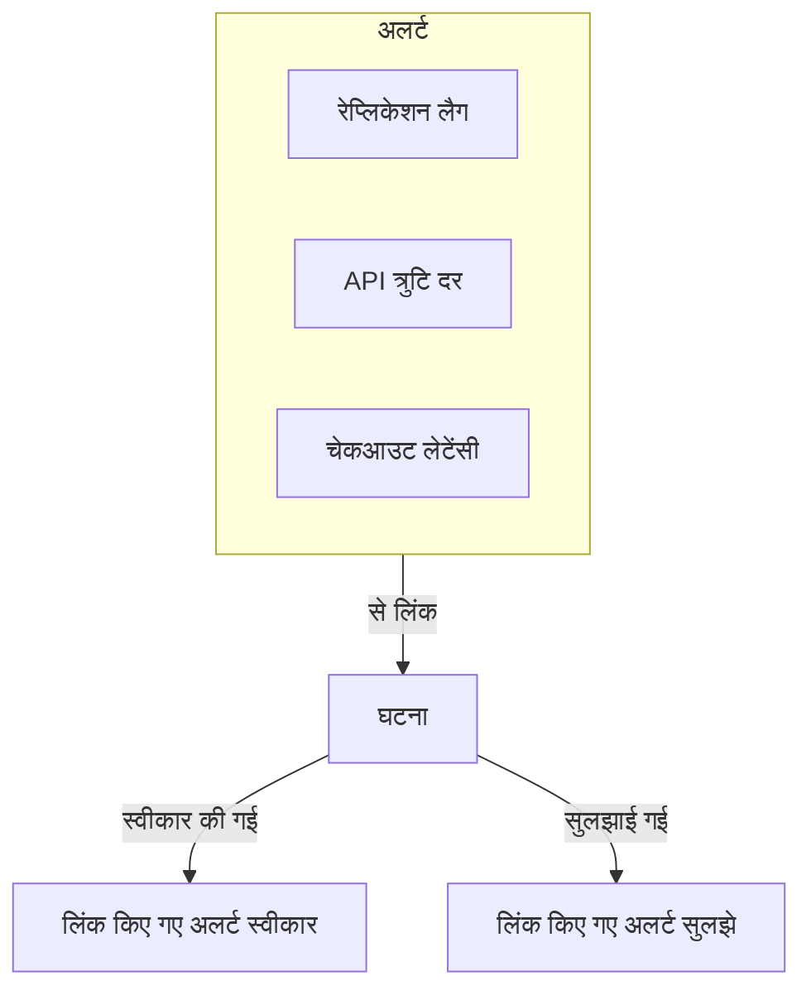
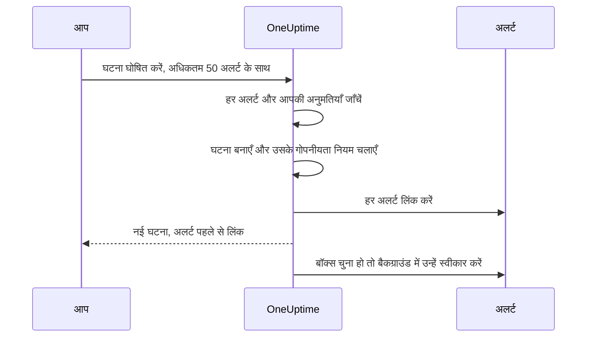

# लिंक किए गए अलर्ट

कोई आउटेज शायद ही कभी एक ही अलर्ट उठाता है। जब प्राइमरी डेटाबेस गिरता है, तो रेप्लिकेशन लैग मॉनिटर चलता है, API त्रुटि दर मॉनिटर चलता है, और चेकआउट लेटेंसी SLO अपना बजट जलाने लगता है — तीन अलर्ट, एक समस्या। उन अलर्ट को घटना से लिंक करना यही कहता है: प्रतिक्रिया घटना पर होती है, और हर अलर्ट दिखाता है कि कौन-सी घटना उसे समझाती है।

लिंक केवल एक लिंक है। अलर्ट अपनी स्थिति, स्वामी, ऑन-कॉल नीतियाँ, नोट और फ़ीड बनाए रखता है; घटना अपनी। लिंक करना कुछ भी मिलाता या कॉपी नहीं करता, और अपने आप कभी किसी अलर्ट को स्वीकार नहीं करता, सुलझाता नहीं या चुप नहीं कराता। (अलर्ट से नई घटना घोषित करना अलग है: नई घटना उनसे पहले से भरी जाती है, जैसा [नीचे बताया गया है](#अलर्ट-से-घटना-घोषित-करना), और जब तक आप फ़ॉर्म पर बॉक्स से निशान न हटाएँ, घोषित करते समय अलर्ट स्वीकार किए जाते हैं, जिससे उनका एस्केलेशन रुक जाता है — [घोषित करते समय अलर्ट स्वीकार करना](#घोषित-करते-समय-अलर्ट-स्वीकार-करना) देखें।) नए प्रोजेक्ट में चालू रहने वाले दो प्रोजेक्ट स्विच, घटना के स्वीकार होने और सुलझने के साथ लिंक किए गए अलर्ट को आगे बढ़ाते हैं — [आगे](#अलर्ट-की-स्थितियों-को-घटना-के-साथ-रखना) देखें।

:::cards
- [घटना से अलर्ट लिंक करें](#घटना-से-अलर्ट-लिंक-करना): घटना से, अलर्ट से, या एक साथ कई।
- [अलर्ट से घटना घोषित करें](#अलर्ट-से-घटना-घोषित-करना): एक नई घटना, एक ही बार में पहले से भरी और लिंक की हुई।
- [अलर्ट की स्थितियाँ साथ रखें](#अलर्ट-की-स्थितियों-को-घटना-के-साथ-रखना): घटना के साथ अलर्ट को स्वीकार करें और सुलझाएँ।
- [अनुमतियाँ](#अनुमतियाँ): कौन लिंक कर सकता है, और लिंक करने से उन्हें क्या करने की छूट मिलती है।
:::

> [!TIP]
> अगर आप Opsgenie से आ रहे हैं, तो यह घटना के साथ अलर्ट जोड़ने का OneUptime वाला तरीका है।

## एक नज़र में

- **कई-से-कई** — किसी घटना से कितने भी अलर्ट लिंक हो सकते हैं, और एक अलर्ट कई घटनाओं से लिंक हो सकता है।
- **लिंक करने की तीन जगहें** — घटना का **लिंक किए गए अलर्ट** पेज, अलर्ट का **लिंक की गई घटनाएं** पेज, और मुख्य अलर्ट सूचियों पर **घटना से लिंक करें** बल्क कार्रवाई, एक बार में अधिकतम **50** अलर्ट के लिए।
- **अलर्ट से घटना घोषित करें** — अलर्ट की सूची पर, किसी अलर्ट के हेडर में या उसके **लिंक की गई घटनाएं** पेज पर **घटना घोषित करें** अलर्ट से एक नई घटना पहले से भरता है और बनते समय उन्हें लिंक कर देता है। फ़ॉर्म पर एक बॉक्स, जो डिफ़ॉल्ट रूप से चुना रहता है, उन्हें स्वीकार भी करता है, जिससे उनका अपना ऑन-कॉल एस्केलेशन रुक जाता है।
- **दोनों तरफ़ दर्ज** — हर लिंक और अनलिंक घटना और अलर्ट पर एक फ़ीड प्रविष्टि लिखता है, सिवाय इसके कि अलर्ट से घोषित घटना को उन सबको सूचीबद्ध करने वाली एक ही प्रविष्टि मिलती है। केवल घटना की प्रविष्टियाँ Slack और Microsoft Teams पर पोस्ट होती हैं, और किसी निजी अलर्ट या घटना का शीर्षक दूसरी तरफ़ कभी नहीं लिखा जाता।
- **अलर्ट की स्थितियाँ घटना का पालन करती हैं** — दो प्रोजेक्ट स्विच, नए प्रोजेक्ट में दोनों चालू, घटना के स्वीकार होने और सुलझने पर लिंक किए गए अलर्ट को स्वीकार करते हैं और सुलझाते हैं। किसी को भी **घटनाएं → सेटिंग्स → लिंक किए गए अलर्ट** में बंद करें।
- **स्वचालित किया जा सकता है** — लिंक एक सामान्य API संसाधन हैं, `/api/incident-alert`।

## यह कैसे काम करता है

अलर्ट संकेत हैं: किसी मॉनिटर का मानदंड मेल खा गया, किसी SLO ने अपना बजट जलाना शुरू कर दिया, कोई सुरक्षा नियम चल गया। घटना किसी समस्या पर समन्वित प्रतिक्रिया है ([घटनाओं का अवलोकन](/docs/incidents/index) देखें)। ज़्यादातर समस्याएँ कई संकेत पैदा करती हैं, और लिंक के बिना, उन्हें प्रतिक्रिया से जोड़ने वाली अकेली चीज़ किसी की याददाश्त होती है।



अलर्ट लिंक होने पर:

- घटना पर प्रतिक्रिया देने वाले एक ही सूची में देखते हैं कि कौन-से अलर्ट उसका हिस्सा हैं और हर एक किस स्थिति में है।
- उनमें से कोई अलर्ट खोलने वाला देखता है कि उसे पहले से संभाला जा रहा है, किस घटना के तहत, बजाय उसी आउटेज के लिए दूसरी घटना घोषित करने के।
- घटना की फ़ीड दर्ज करती है कि हर अलर्ट कब और किसने लिंक किया, ताकि टाइमलाइन दिखाए कि तस्वीर कैसे बनी।
- स्विच चालू होने पर घटना स्वीकार करने से अलर्ट के ऑन-कॉल एस्केलेशन रुक जाते हैं, ताकि घटना पर काम करने वाले लोगों को उसके लक्षणों से फिर से पेज न किया जाए।

## लिंक कैसे काम करते हैं

एक लिंक एक अलर्ट को एक घटना से जोड़ता है। लिंक दोनों तरफ़ से काम करते हैं — वही लिंक घटना के **लिंक किए गए अलर्ट** पेज पर और अलर्ट के **लिंक की गई घटनाएं** पेज पर दिखता है।

- **एक अलर्ट कई घटनाओं से लिंक हो सकता है।** किसी साझा निर्भरता का विफल होना दो अलग-अलग घटनाओं का लक्षण हो सकता है। हर घटना अलर्ट को सूचीबद्ध करती है, और अलर्ट दोनों घटनाओं को।
- **हर जोड़ी एक बार लिंक होती है।** किसी अलर्ट को उस घटना से लिंक करना जिससे वह पहले से लिंक है, "This alert is already linked to this incident." के साथ अस्वीकार होता है — तब भी जब दो लोग उसी पल वही जोड़ी लिंक करें।
- **लिंक बनाए या हटाए जाते हैं, कभी संपादित नहीं होते।** लिंक के अपने कोई फ़ील्ड नहीं होते, उसकी घटना, उसके अलर्ट, उसके बनने के समय और उसे बनाने वाले के अलावा। किसी अलर्ट को दूसरी घटना पर ले जाने के लिए, उसे नई घटना से लिंक करें और पुरानी से अनलिंक करें।
- **लिंक एक प्रोजेक्ट के अंदर रहते हैं।** अलर्ट और घटना एक ही प्रोजेक्ट के होने चाहिए।

## घटना से अलर्ट लिंक करना

:::steps
### घटना का लिंक किए गए अलर्ट पेज खोलें

घटना खोलें और उसके साइड मेनू के **जांच** सेक्शन में **लिंक किए गए अलर्ट** चुनें। तालिका उससे पहले से लिंक हर अलर्ट को सूचीबद्ध करती है।

### अलर्ट चुनें

**अलर्ट लिंक करें** पर क्लिक करें और **अलर्ट** ड्रॉपडाउन से उसे चुनें। ड्रॉपडाउन सबसे हाल के अलर्ट पहले सूचीबद्ध करता है, हर एक उसकी संख्या के साथ — जैसे `ALT-63: Checkout API is offline` — ताकि एक ही शीर्षक वाले अलर्ट, जैसे किसी मॉनिटर के बार-बार आने वाले अलर्ट, अलग पहचाने जा सकें। कोई पुराना अलर्ट ढूँढने के लिए टाइप करें: ड्रॉपडाउन हर अलर्ट को शीर्षक से खोजता है।

### लिंक सहेजें

डायलॉग में **अलर्ट लिंक करें** पर क्लिक करें। अलर्ट तालिका में दिखता है, और दोनों फ़ीड लिंक दर्ज करती हैं। अगर लिंक अस्वीकार होता है, जैसे इसलिए कि अलर्ट पहले से लिंक है, तो डायलॉग खुला रहता है और कारण बताता है।
:::

| कॉलम                       | यह क्या दिखाता है                                 |
| -------------------------- | ------------------------------------------------ |
| **अलर्ट #**                | अलर्ट संख्या, जैसे `#17` या `ALT-17`।            |
| **शीर्षक**                 | अलर्ट का शीर्षक, अलर्ट से लिंक।                   |
| **वर्तमान स्थिति**          | अलर्ट की अपनी स्थिति, जैसे **स्वीकार किया गया**।   |
| **लिंक किया गया**          | अलर्ट कब लिंक किया गया।                          |
| **द्वारा लिंक किया गया**   | उसे किसने लिंक किया।                             |

हर पंक्ति पर अलर्ट खोलने के लिए **अलर्ट देखें** और लिंक हटाने के लिए **अनलिंक करें** होता है।

## अलर्ट से घटनाएँ लिंक करना

अलर्ट वाली तरफ़ घटना वाली तरफ़ का प्रतिबिंब है। कोई अलर्ट खोलें और उसके साइड मेनू के **बेसिक** सेक्शन में **लिंक की गई घटनाएं** चुनें। तालिका हर उस घटना को सूचीबद्ध करती है जिससे अलर्ट लिंक है, घटना संख्या, शीर्षक और वर्तमान स्थिति के साथ, और यह भी कि वह कब और किसने लिंक की।

- **घटना लिंक करें** इस अलर्ट को किसी मौजूदा घटना से लिंक करता है। इसका ड्रॉपडाउन घटना वाली तरफ़ के ड्रॉपडाउन जैसा काम करता है: सबसे हाल की घटनाएँ पहले, हर एक उसकी संख्या के साथ — जैसे `INC-42: Checkout is down` — और टाइप करने से हर घटना शीर्षक से खोजी जाती है।
- **घटना देखें** किसी लिंक की गई घटना को खोलता है।
- **अनलिंक करें** एक लिंक हटाता है।
- **घटना घोषित करें** इस अलर्ट से एक नई घटना शुरू करता है। वही बटन अलर्ट के हेडर में, **स्वीकार करें** और **सुलझाएं** के बगल में है। [अलर्ट से घटना घोषित करना](#अलर्ट-से-घटना-घोषित-करना) देखें।

## एक साथ कई अलर्ट लिंक करना

मुख्य अलर्ट सूचियों में इसके लिए दो बल्क कार्रवाइयाँ हैं: **सभी अलर्ट** और **सक्रिय अलर्ट**, होम पेज पर सक्रिय अलर्ट, और किसी मॉनिटर, सेवा, होस्ट, Kubernetes क्लस्टर, SLO या ऐसे किसी भी दूसरे संसाधन का **अलर्ट** पेज जिसमें यह हो। किसी अलर्ट एपिसोड की **सदस्य अलर्ट** सूची में ये नहीं हैं — इसके बजाय मुख्य सूचियों में से किसी एक पर अलर्ट चुनें। अलर्ट चुनें, फिर चुनें:

- **घटना से लिंक करें** — **घटना** ड्रॉपडाउन में घटना चुनें और **चुने गए अलर्ट लिंक करें** पर क्लिक करें। सबसे हाल की घटनाएँ पहले, उनकी संख्याओं के साथ, सूचीबद्ध होती हैं, और टाइप करने से हर घटना शीर्षक से खोजी जाती है। OneUptime हर चुना हुआ अलर्ट लिंक करता है, साथ-साथ प्रगति दिखाते हुए। जो अलर्ट उस घटना से पहले से लिंक है, वह विफल नहीं बल्कि पूरा गिना जाता है, इसलिए कार्रवाई दो बार चलाने से कोई नुकसान नहीं।
- **घटना घोषित करें** — चुने गए अलर्ट से पहले से भरी नई घटना के लिए घोषणा फ़ॉर्म खोलता है। अगला सेक्शन देखें।

दोनों कार्रवाइयाँ एक बार में अधिकतम **50** अलर्ट लेती हैं। ज़्यादा चुनें तो वे अक्षम हो जाती हैं, कारण बताने वाले टूलटिप के साथ। यह सीमा इसलिए है क्योंकि हर लिंक दोनों फ़ीड में लिखता है, और **घटना से लिंक करें** से बना हर लिंक घटना के Slack और Microsoft Teams चैनलों पर भी पोस्ट होता है — हज़ार अलर्ट का चयन उन्हें भर देगा।

## अलर्ट से घटना घोषित करना

जब अलर्ट की कोई बौछार ऐसी घटना निकलती है जिसे अभी किसी ने घोषित नहीं किया, तो उसे अलर्ट से घोषित करें। तीन रास्ते हैं:

- मुख्य अलर्ट सूचियों में से किसी एक पर अलर्ट चुनें और **घटना घोषित करें** चुनें।
- कोई अलर्ट खोलें और उसके हेडर में, **स्वीकार करें** और **सुलझाएं** के बगल में, **घटना घोषित करें** पर क्लिक करें। अलर्ट स्वीकार या सुलझ जाने के बाद भी यह वहीं रहता है, ताकि आप बाद में भी किसी अलर्ट के लिए घटना घोषित कर सकें — जैसे उस पर पोस्टमॉर्टम करने के लिए।
- किसी एक अलर्ट का **लिंक की गई घटनाएं** पेज खोलें और **घटना घोषित करें** पर क्लिक करें।

तीनों के लिए घटनाएँ बनाने और उनसे अलर्ट लिंक करने की अनुमति चाहिए। इसके बिना बटन लॉक रहता है, और उसका टूलटिप कमी वाली अनुमति का नाम बताता है।

चाहे जो इस्तेमाल करें, आप सामान्य **नई घटना घोषित करें** फ़ॉर्म पर पहुँचते हैं, जिसमें अलर्ट लिंक किए जाने वाले अलर्ट के रूप में सूचीबद्ध होते हैं और ये फ़ील्ड पहले से भरे होते हैं:

| फ़ील्ड                 | किससे पहले से भरा जाता है                                                                                                                                                                                                                                                              |
| ---------------------- | -------------------------------------------------------------------------------------------------------------------------------------------------------------------------------------------------------------------------------------------------------------------------------------- |
| **शीर्षक**             | एक अलर्ट: उसका शीर्षक। कई: सबसे गंभीर अलर्ट का शीर्षक।                                                                                                                                                                                                                                 |
| **विवरण**              | एक अलर्ट: उसका विवरण। कई: हर अलर्ट की एक पंक्ति वाली सूची, उसकी संख्या और शीर्षक के साथ।                                                                                                                                                                                               |
| **घटना गंभीरता**       | सबसे गंभीर अलर्ट की गंभीरता, घटना गंभीरता में बदली गई। एक ही नाम वाली घटना गंभीरता, अक्षरों के छोटे-बड़े होने को अनदेखा करके, जीतती है। वरना OneUptime गंभीरता के क्रम में उसी स्थान वाली घटना गंभीरता लेता है, या आपकी घटना गंभीरताएँ कम हों तो आख़िरी वाली। |
| **प्रभावित संसाधन**    | चुने गए अलर्ट के हर मॉनिटर, होस्ट, Kubernetes क्लस्टर, Docker होस्ट, Podman होस्ट और सेवा, मिलाकर। मॉनिटर **मॉनिटर** के नीचे जाते हैं, बाकी **अन्य प्रभावित संसाधन** के नीचे। दूसरे संसाधन, जैसे SLO या VMware, Proxmox और Ceph क्लस्टर, कॉपी नहीं होते — अगर घटना उन्हें प्रभावित करती है तो उन्हें ख़ुद जोड़ें। |
| **लेबल**               | हर चुने गए अलर्ट का हर लेबल।                                                                                                                                                                                                                                                           |
| **निजी घटना**          | अगर कोई भी अलर्ट निजी है तो चालू। फ़ॉर्म यह बताता है, और अलर्ट के स्वामी घटना के स्वामी बन जाते हैं — नीचे देखें।                                                                                                                                                                       |

"सबसे गंभीर" आपकी अलर्ट गंभीरता के क्रम का पालन करता है: सूची की पहली अलर्ट गंभीरता सबसे गंभीर है। हर प्रोजेक्ट जिन गंभीरताओं से शुरू होता है, उनके साथ **High** अलर्ट **Critical Incident** बन जाता है और **Low** अलर्ट **Major Incident**।

सबमिट करने से पहले सब कुछ संपादित किया जा सकता है। **लेबल** और **निजी घटना** फ़ॉर्म के पहले चरण पर **और फ़ील्ड** के नीचे हैं, जिसका मुड़ा हुआ हेडर इनमें से कोई भी सेट होने पर उसे दिखाता है।

**जिस अलर्ट की पहले से कोई घटना है, उसे चिह्नित किया जाता है।** हर अलर्ट के पेज पर **घटना घोषित करें** होने से, एक ही आउटेज से पेज किए गए दो प्रतिक्रिया देने वाले दोनों उसे घोषित कर सकते हैं। इसलिए अलर्ट को सूचीबद्ध करने वाला बैनर हर उस अलर्ट को चिह्नित करता है जो पहले से किसी घटना से लिंक है — "(already linked to Incident INC-42)", उस घटना से लिंक करते हुए — और एक नोट जोड़ता है, जिसके शब्द इस पर निर्भर करते हैं कि कितने अलर्ट लिंक हैं:

- सभी अलर्ट, और एक ही है: "This alert is already linked to an incident. If it is the same problem, update that incident instead of declaring another one."
- सभी अलर्ट, और कई हैं: "These alerts are already linked to incidents. If it is the same problem, update that incident instead of declaring another one."
- केवल कुछ: "Some of these alerts are already linked to an incident. If it is the same problem, link the other alerts to that incident from the alerts list instead of declaring another one."

घटना के लिंक नए टैब में खुलते हैं, ताकि आप फ़ॉर्म पर भरी चीज़ें खोए बिना मौजूदा घटना जाँच सकें। नोट एक याद दिलाना है, रोक नहीं, और केवल वही घटनाएँ नाम से बताई जाती हैं जिन्हें आप देख सकते हैं।

**ऑन-कॉल नीतियाँ कॉपी नहीं होतीं।** अलर्ट बनते समय उन्होंने अपनी ऑन-कॉल नीतियाँ चलाईं, इसलिए उन्हें घटना पर कॉपी करने से वही लोग दूसरी बार पेज होते। घटना की ऑन-कॉल नीतियाँ वही हैं जो आप **ऑन-कॉल और भूमिकाएं** चरण पर चुनते हैं, और जो आपके घटना ऑन-कॉल नियम जोड़ते हैं — बिल्कुल किसी भी दूसरी घटना की तरह।

**अलर्ट के मॉनिटर प्रभावित मॉनिटर के रूप में पहले से भरे जाते हैं।** हाथ से घोषित किसी भी घटना की तरह, घटना के मॉनिटर पर सक्रिय निगरानी घटना सुलझने तक रुक जाती है। अगर किसी मॉनिटर की जाँच जारी रहनी चाहिए, तो सबमिट करने से पहले उसे **प्रभावित संसाधन** चरण पर **मॉनिटर** से हटा दें।

**निजी अलर्ट निजी घटना बनाता है।** अगर कोई भी अलर्ट निजी है, तो **निजी घटना** चालू शुरू होता है, और अलर्ट को सूचीबद्ध करने वाला बैनर यह बताता है। निजी घटना केवल उसके स्वामियों, Project Owners और Project Admins को दिखती है, इसलिए OneUptime यह पक्का करता है कि जो लोग अलर्ट देख सकते थे वे घटना देख सकें: घटना घोषित होते ही, हर घोषित अलर्ट के स्वामी — उपयोगकर्ता और टीमें दोनों — बिना सूचना के घटना के स्वामी के रूप में जोड़े जाते हैं। वे घटना के Slack और Microsoft Teams चैनल बनने के ठीक बाद जोड़े जाते हैं, इसलिए उन्हें किसी भी दूसरे स्वामी की तरह उन चैनलों में बुलाया जाता है। आप भी एक स्वामी होते हैं, जैसे आपकी घोषित किसी भी घटना में। जब कोई घटना गोपनीयता नियम नई घटना को निजी बनाता है, तब भी यही होता है। अगर आप सबमिट करने से पहले **निजी घटना** बंद कर दें और कोई गोपनीयता नियम लागू न हो, तो घटना निजी नहीं होती और कोई स्वामी कॉपी नहीं होता।



जब आप सबमिट करते हैं, सर्वर कुछ भी बनाने से पहले अलर्ट जाँचता है: अधिकतम 50, हर एक इस प्रोजेक्ट का ऐसा अलर्ट जिसे आप देख सकते हैं, और आपको घटनाओं से अलर्ट लिंक करने की अनुमति होनी चाहिए। कोई भी जाँच विफल हो, तो अनुरोध अस्वीकार होता है और कोई घटना नहीं बनती — इसलिए ग़लत अलर्ट id कभी कोई घटना संख्या बर्बाद नहीं करती। घटना बन जाने के बाद — और उसके गोपनीयता नियम चल जाने के बाद, ताकि लिंक जानें कि वह निजी है या नहीं — अनुरोध लौटने से पहले हर अलर्ट लिंक हो जाता है, इसलिए घटना का **लिंक किए गए अलर्ट** पेज उन्हें पहले से सूचीबद्ध करता है। अगर कोई एक लिंक विफल होता है — जैसे इसलिए कि अलर्ट एक पल पहले हटाया गया था — तो घटना फिर भी घोषित होती है और बाकी अलर्ट फिर भी लिंक होते हैं।

घटना की फ़ीड को हर अलर्ट के लिए एक के बजाय, **घटना बनाई गई** के बाद लिखी गई, अलर्ट को सूचीबद्ध करने वाली एक **अलर्ट लिंक किया गया** प्रविष्टि मिलती है — [फ़ीड, Slack और Microsoft Teams](#फ़ीड-slack-और-microsoft-teams) देखें।

### घोषित करते समय अलर्ट स्वीकार करना

घटना घोषित करने से, अपने आप, उसके अलर्ट का पेज करना नहीं रुकता: अलर्ट का ऑन-कॉल एस्केलेशन तभी रुकता है जब अलर्ट ख़ुद स्वीकार हो जाए। इसलिए जब कोई भी अलर्ट अभी स्वीकार नहीं हुआ है, तो फ़ॉर्म के बैनर में एक चेकबॉक्स होता है, डिफ़ॉल्ट रूप से चुना हुआ — एक अलर्ट के लिए **Acknowledge this alert to stop its escalation**, कई के लिए **Acknowledge these 3 alerts to stop their escalation**। अगर उनमें से कुछ पहले से स्वीकार हैं, तो यह केवल बाकी के नाम बताता है और कहता है कि बाकी जैसे हैं वैसे छोड़ दिए जाते हैं।

इसे चुना रहने दें और, घटना घोषित होने और अलर्ट लिंक होने के बाद:

- **अलर्ट आपके रूप में स्वीकार किए जाते हैं।** हर एक आपकी अलर्ट **स्वीकार किया गया** स्थिति में जाता है, जैसे आपने ख़ुद उस पर **स्वीकार करें** पर क्लिक किया हो: अलर्ट की **स्थिति टाइमलाइन** और फ़ीड आपका नाम बताती हैं, अलर्ट के स्वामियों को सूचित किया जाता है, और बदलाव किसी भी दूसरे अलर्ट स्थिति बदलाव की तरह अलर्ट के Slack और Microsoft Teams चैनलों पर पोस्ट होता है। कारण यह पढ़ता है: "Acknowledged because Incident INC-42 was declared from this alert." — या, निजी घटना के लिए, "Acknowledged because a private incident was declared from this alert.", ताकि निजी घटना का नाम कभी वहाँ न आए जहाँ अलर्ट के पाठक उसे पढ़ सकें।
- **उनका अपना ऑन-कॉल एस्केलेशन लगभग एक मिनट में रुक जाता है।** अगला एस्केलेशन चरण एक स्वीकार किया गया अलर्ट देखता है और रुक जाता है। जो पेज पहले ही जा चुके हैं, वे वापस नहीं लिए जाते।
- **रिमाइंडर केवल तब रुकते हैं जब रिमाइंडर नियम ऐसा कहे।** किसी अलर्ट के रिमाइंडर स्वीकार होने पर केवल तब रुकते हैं जब उसके रिमाइंडर नियम में **Stop Reminders When** को **स्वीकार किया गया** पर सेट किया गया हो; वरना वे अलर्ट सुलझने तक चलते रहते हैं।
- **अलर्ट एपिसोड का एस्केलेशन जारी रहता है।** अगर कोई अलर्ट ऐसे एपिसोड का हिस्सा है जो अपनी ऑन-कॉल नीति से पेज करता है, तो एपिसोड का एस्केलेशन तब तक जारी रहता है जब तक एपिसोड ख़ुद स्वीकार न हो जाए।
- **पहले से स्वीकार या सुलझे अलर्ट को छेड़ा नहीं जाता।** हर जगह की तरह, स्थितियों की तुलना उनके क्रम से होती है, इसलिए **स्वीकार किया गया** के बाद की किसी कस्टम स्थिति वाला अलर्ट स्वीकार किया गया माना जाता है, और कुछ भी कभी पीछे नहीं ले जाया जाता।

स्वीकार किए बिना घोषित करने के लिए बॉक्स से निशान हटाएँ। जब भी अलर्ट बिना स्वीकार किए छोड़े जाएँगे — बॉक्स से निशान हटा है या वह लॉक है — फ़ॉर्म यह बताता है: "Declaring the incident does not acknowledge the alert: it keeps escalating until it is acknowledged." और अगर आप घटना के लिए कोई ऑन-कॉल नीति चुने बिना अलर्ट स्वीकार करते हैं, तो **ऑन-कॉल और भूमिकाएं** चरण का सारांश बताता है: "The alerts it is declared from are acknowledged too, so their own escalation stops. An alert episode they belong to keeps escalating until the episode is acknowledged, and an incident on-call rule, if any, may still page."

**अलर्ट स्वीकार करने के लिए आपको अनुमति चाहिए।** घोषित करते समय उन्हें स्वीकार करने के लिए **Create Alert State Timeline** और **Edit Alert** चाहिए (किसी अलर्ट को उसके अपने पेज पर स्वीकार करने के लिए केवल पहली चाहिए: [स्थिति बदलना](/docs/permissions/index#स्थिति-बदलना) देखें): Project Owner, Project Admin, Project Member, Alert Admin और Alert Member के पास दोनों हैं, जबकि Incident Admin और Incident Member, जो अलर्ट से घटनाएँ घोषित कर सकते हैं, के पास कोई नहीं। अलर्ट पर आपके लेबल और स्वामी दायरे में भी हर वह अलर्ट होना चाहिए जिसे स्वीकार किया जाएगा — केवल अभी तक स्वीकार न किए गए जाँचे जाते हैं। पहले से स्वीकार या सुलझे अलर्ट को किसी अनुमति की ज़रूरत नहीं होती और वे कभी घोषणा नहीं रोकते। अनुमतियों के बिना बॉक्स लॉक रहता है, कमी वाली अनुमति का नाम बताने वाले टूलटिप के साथ, और आप फिर भी घटना घोषित कर सकते हैं। सर्वर कुछ भी बनाने से पहले, हर उस अलर्ट के लिए जिसे वह स्वीकार करेगा, फिर से जाँचता है: अगर आप उनमें से किसी को स्वीकार नहीं कर सकते, तो कोई घटना नहीं बनती और फ़ॉर्म कारण बताता है — बॉक्स से निशान हटाएँ और फिर से सबमिट करें।

**प्रोजेक्ट में एक स्वीकार किया गया अलर्ट स्थिति होनी चाहिए।** हर प्रोजेक्ट एक के साथ शुरू होता है। अगर आपके प्रोजेक्ट में कोई नहीं है, तो बॉक्स नहीं दिया जाता।

अलर्ट बैकग्राउंड में स्वीकार किए जाते हैं, लिंक होने के ठीक बाद, कुछ-कुछ करके — एक साथ अधिकतम 5 — इसलिए घटना का पेज उनके स्वीकार होने से एक पल पहले खुल सकता है, और कई अलर्ट से घोषित करने पर आख़िरी अलर्ट बाकी सबके पीछे इंतज़ार नहीं करते। जो अलर्ट स्वीकार नहीं किया जा सकता — जैसे इसलिए कि इस बीच उसे हटा दिया गया — वह लॉग होता है और कभी बाकी अलर्ट या घटना को नहीं रोकता, और जिस अलर्ट को इस बीच किसी और ने स्वीकार किया या सुलझाया, उसे वैसे ही छोड़ दिया जाता है जैसे उन्होंने छोड़ा।

**प्रोजेक्ट के लिंक किए गए अलर्ट स्विच चालू हों, तो स्विच अलर्ट को आगे बढ़ा सकते हैं।** अगर घटना सीधे किसी स्वीकार की गई या सुलझी हुई स्थिति में घोषित होती है और [लिंक किए गए अलर्ट स्विचों](#अलर्ट-की-स्थितियों-को-घटना-के-साथ-रखना) में से कोई उस स्थिति पर काम करता है, तो स्विच लिंक होते समय लिंक किए गए अलर्ट को आगे बढ़ाता है, और बॉक्स उन अलर्ट को उसी पर छोड़ देता है, ताकि हर अलर्ट का एक ही लेखक हो। वे उसी तरह स्वीकार या सुलझाए जाते हैं जैसे स्विच करता है — स्विच के कारण के साथ, जैसे "Acknowledged because linked Incident INC-42 was acknowledged.", जो घटना को उसकी संख्या से बताता है, घटना निजी हो तब भी — उनका श्रेय आपको नहीं जाता, और उनके स्वामियों को सूचित नहीं किया जाता। हमेशा की तरह अपनी पहली घटना स्थिति में घोषित करना, या स्विच बंद रखकर घोषित करना, हर अलर्ट को बॉक्स पर छोड़ता है।

### API से घोषित करना

`POST /api/incident` लिंक करने वाले अलर्ट की id `miscDataProps` में `alertIdsToLink` के नीचे लेता है, और यह कि उन अलर्ट को स्वीकार करना है या नहीं, `acknowledgeAlertsToLink` के नीचे:

```bash
curl -X POST https://oneuptime.com/api/incident \
  -H "apikey: $ONEUPTIME_API_KEY" \
  -H "Content-Type: application/json" \
  -d '{
    "data": {
      "title": "Primary database unavailable",
      "incidentSeverityId": "<incident-severity-id>"
    },
    "miscDataProps": {
      "alertIdsToLink": ["<alert-id>", "<another-alert-id>"],
      "acknowledgeAlertsToLink": true
    }
  }'
```

`alertIdsToLink` 1 से 50 अलर्ट id की एक array है। दोहराव अनदेखे किए जाते हैं, और घटना बनने से पहले वही जाँचें लागू होती हैं जो डैशबोर्ड में। API पर कुछ भी पहले से नहीं भरा जाता — जो शीर्षक, गंभीरता और संसाधन चाहिए वे भेजें। API कुंजी को घटनाएँ बनाने और उनसे अलर्ट लिंक करने की अनुमति चाहिए, और उसे अलर्ट पढ़ने में सक्षम होना चाहिए। API कुंजी कोई उपयोगकर्ता नहीं है, इसलिए उससे बने लिंक में कोई **द्वारा लिंक किया गया** नहीं होता। अनुरोध बॉडी के बाकी हिस्से के लिए [घटना घोषित करना](/docs/incidents/declaring-incidents) देखें।

`acknowledgeAlertsToLink` वैकल्पिक है, और जब तक आप इसे न भेजें, बंद रहता है। लिंक होने के बाद अलर्ट स्वीकार करने के लिए इसे `true` पर सेट करें, जैसा फ़ॉर्म का बॉक्स करता है — पहले से स्वीकार या सुलझे अलर्ट को छेड़ा नहीं जाता और उन्हें किसी अनुमति की ज़रूरत नहीं होती। उन्हें स्वीकार किए बिना घोषित करने के लिए इसे छोड़ दें, या `false` भेजें। घटना बनने से पहले, अलर्ट id के साथ इसकी भी जाँच होती है, और अनुरोध 400 के साथ अस्वीकार होता है जब:

- यह `true` या `false` के अलावा कुछ और है;
- यह `alertIdsToLink` के बिना भेजा गया है;
- प्रोजेक्ट में कोई स्वीकार किया गया अलर्ट स्थिति नहीं है;
- API कुंजी अभी तक स्वीकार न किए गए हर अलर्ट को स्वीकार नहीं कर सकती — इसके लिए **Create Alert State Timeline** और **Edit Alert** चाहिए, ऐसे लेबल दायरे के साथ जिसमें उनमें से हर अलर्ट हो।

API कुंजी कोई उपयोगकर्ता नहीं है, इसलिए उससे स्वीकार किए गए अलर्ट का श्रेय किसी को नहीं जाता, जैसे उसके लिंक में कोई **द्वारा लिंक किया गया** नहीं होता।

## API से लिंक और अनलिंक करना

लिंक `/api/incident-alert` पर एक मानक CRUD संसाधन हैं। किसी अलर्ट को घटना से लिंक करने के लिए, एक बनाएँ:

```bash
curl -X POST https://oneuptime.com/api/incident-alert \
  -H "apikey: $ONEUPTIME_API_KEY" \
  -H "Content-Type: application/json" \
  -d '{
    "data": {
      "incidentId": "<incident-id>",
      "alertId": "<alert-id>"
    }
  }'
```

किसी घटना के लिंक किए गए अलर्ट सूचीबद्ध करने के लिए, `incidentId` से क्वेरी करें। किसी अलर्ट से लिंक घटनाएँ ढूँढने के लिए इसके बजाय `alertId` से क्वेरी करें:

```bash
curl -X POST https://oneuptime.com/api/incident-alert/get-list \
  -H "apikey: $ONEUPTIME_API_KEY" \
  -H "Content-Type: application/json" \
  -d '{
    "query": { "incidentId": "<incident-id>" },
    "select": { "_id": true, "alertId": true, "createdAt": true },
    "limit": 50,
    "skip": 0
  }'
```

अनलिंक करने के लिए, लिंक को उसकी अपनी id से हटाएँ — लिंक की `_id`, अलर्ट या घटना की नहीं:

```bash
curl -X DELETE https://oneuptime.com/api/incident-alert/<link-id> \
  -H "apikey: $ONEUPTIME_API_KEY"
```

दोनों id आवश्यक हैं। लिंक अनुरोध तब भी अस्वीकार होता है जब अलर्ट या घटना किसी दूसरे प्रोजेक्ट की हो या ऐसी हो जिसे आप नहीं देख सकते। त्रुटि वही पढ़ती है चाहे अलर्ट या घटना मौजूद न हो या केवल आपसे छिपी हो, इसलिए वह कभी यह नहीं बताती कि कोई निजी अलर्ट या घटना मौजूद है।

यही संसाधन बनाए गए वर्कफ़्लो घटक चलाता है — अलर्ट लिंक होने पर **On Create Incident Alert** चलता है और अनलिंक होने पर **On Delete Incident Alert** — और MCP सर्वर के Incident Alert टूल। [API संदर्भ](/reference) में अनुरोध और जवाब का पूरा ढाँचा है।

## अनलिंक करना

किसी भी तरफ़ से अनलिंक करें: घटना के **लिंक किए गए अलर्ट** पेज या अलर्ट के **लिंक की गई घटनाएं** पेज की किसी पंक्ति पर **अनलिंक करें**, फिर पुष्टि करें। एक साथ कई अनलिंक करने के लिए, पंक्तियाँ चुनें और बल्क **अनलिंक करें** कार्रवाई चुनें। यह केवल लिंक हटाती है — अलर्ट और घटनाएँ ख़ुद नहीं हटतीं।

अनलिंक करना लिंक हटाता है और कुछ नहीं। अलर्ट और घटना अपनी स्थितियाँ बनाए रखते हैं, और घटना की वजह से स्वीकार या सुलझाया गया अलर्ट वैसा ही रहता है — अलर्ट की स्थितियाँ कभी पीछे नहीं जातीं। दोनों फ़ीड अनलिंक दर्ज करती हैं।

## अनुमतियाँ

लिंक करने की अपनी चार विस्तृत अनुमतियाँ हैं, [अनुमति संदर्भ](/docs/permissions/reference) के **Incident** समूह में:

| अनुमति                    | यह क्या करने देती है                                                                                                   | इसे शामिल करने वाली भूमिकाएँ                                                                              |
| ------------------------- | ---------------------------------------------------------------------------------------------------------------------- | -------------------------------------------------------------------------------------------------------- |
| **Create Incident Alert** | किसी अलर्ट को घटना से लिंक करना, अलर्ट से घटना घोषित करते समय भी। आपको दोनों पढ़ने में भी सक्षम होना चाहिए।             | Project Owner, Project Admin, Project Member, Incident Admin, Incident Member, Alert Admin, Alert Member |
| **Delete Incident Alert** | अनलिंक करना।                                                                                                           | Project Owner, Project Admin, Project Member, Incident Admin, Incident Member, Alert Admin, Alert Member |
| **Read Incident Alert**   | **लिंक किए गए अलर्ट** और **लिंक की गई घटनाएं** सूचियाँ देखना।                                                          | ऊपर के सभी, साथ में Viewer, Incident Viewer और Alert Viewer                                              |
| **Edit Incident Alert**   | असल में कुछ नहीं — लिंक के ऐसे कोई फ़ील्ड नहीं जिन्हें आप बदल सकें।                                                     | Project Owner, Project Admin, Project Member, Incident Admin, Incident Member, Alert Admin, Alert Member |

अलर्ट भूमिकाएँ इसलिए शामिल हैं ताकि अलर्ट पर काम करने वाले उन्हें लिंक कर सकें, और घटना भूमिकाएँ इसलिए ताकि घटनाओं पर काम करने वाले कर सकें। कोई भी अकेले काफ़ी नहीं है, क्योंकि लिंक केवल तब बनता है जब आप दोनों तरफ़ पढ़ सकें:

- **अलर्ट भूमिका को घटनाओं की पढ़ने की पहुँच भी चाहिए** — Viewer, Incident Viewer या Read Incident जोड़ें।
- **घटना भूमिका को अलर्ट की पढ़ने की पहुँच भी चाहिए** — Viewer, Alert Viewer या Read Alert जोड़ें।

इनके ऊपर तीन और नियम लागू होते हैं:

- **आपको दोनों तरफ़ देख पाना चाहिए।** लिंक केवल तब बनता है जब आप अलर्ट और घटना दोनों पढ़ सकें। निजी अलर्ट और घटनाएँ, और लेबल प्रतिबंध, हमेशा की तरह लागू होते हैं।
- **लिंक अपनी घटना का होता है।** आप कोई लिंक देख सकते हैं या नहीं, यह उसकी घटना तक आपकी पहुँच पर निर्भर है: घटनाओं पर लेबल प्रतिबंध और स्वामी दायरा लिंक पर भी लागू होते हैं।
- **लिंक करने के लिए अलर्ट की पढ़ने की पहुँच चाहिए, संपादन की नहीं।** प्रोजेक्ट के लिंक किए गए अलर्ट स्विच चालू हों, जैसे नए प्रोजेक्ट में होते हैं, तो इतना ही किसी लिंक के लिए अलर्ट को स्वीकार करने या सुलझाने को काफ़ी है — [लिंक किए गए अलर्ट को कौन आगे बढ़ाता है](#लिंक-किए-गए-अलर्ट-को-कौन-आगे-बढ़ाता-है) देखें।

अलर्ट से घटना घोषित करने के लिए घटनाएँ बनाने की अनुमति भी चाहिए, और घोषित करते समय उसके अलर्ट स्वीकार करने के लिए, उनमें से अभी तक स्वीकार न किए गए हर एक पर **Create Alert State Timeline** और **Edit Alert** चाहिए — [घोषित करते समय अलर्ट स्वीकार करना](#घोषित-करते-समय-अलर्ट-स्वीकार-करना) देखें। डैशबोर्ड में, जिस कार्रवाई की अनुमति आपके पास नहीं है वह लॉक रहती है, और उसका टूलटिप कमी वाली अनुमति का नाम बताता है। इसमें दूसरी तरफ़ की पढ़ने की पहुँच भी शामिल है: अगर आप अलर्ट नहीं पढ़ सकते तो **अलर्ट लिंक करें** लॉक रहता है, और अगर घटनाएँ नहीं पढ़ सकते तो **घटना लिंक करें** और **घटना से लिंक करें**। भूमिकाएँ, विस्तृत अनुमतियाँ, लेबल और स्वामी दायरा कैसे मिलकर काम करते हैं, इसके लिए [उपयोगकर्ता, टीमें और अनुमतियाँ](/docs/permissions/index) देखें।

## फ़ीड, Slack और Microsoft Teams

हर लिंक और अनलिंक दोनों फ़ीड में लिखा जाता है, बदलाव करने वाले के नाम से:

| बदलाव     | घटना फ़ीड                                       | अलर्ट फ़ीड                                             |
| --------- | ----------------------------------------------- | ------------------------------------------------------ |
| लिंक करना   | **अलर्ट लिंक किया गया** (`AlertLinked`)         | **घटना से लिंक किया गया** (`LinkedToIncident`)          |
| अनलिंक करना | **अलर्ट अनलिंक किया गया** (`AlertUnlinked`)     | **घटना से अनलिंक किया गया** (`UnlinkedFromIncident`)    |

हर प्रविष्टि दूसरी तरफ़ को उसकी संख्या से बताती है और उससे लिंक करती है, ताकि आप घटना की फ़ीड से अलर्ट पर और वापस जा सकें। यह दूसरी तरफ़ का शीर्षक भी देती है, जब तक वह तरफ़ निजी न हो:

- **निजी अलर्ट का शीर्षक घटना की प्रविष्टि से बाहर रहता है**, और इसलिए Slack और Microsoft Teams से भी। प्रविष्टि, उदाहरण के लिए, यह पढ़ती है: "Linked Alert #12 (private alert) to Incident #5"।
- **निजी घटना का शीर्षक अलर्ट की प्रविष्टि से बाहर रहता है**, जो यह पढ़ती है: "Linked to Incident #5 (private incident)"।

यह तब भी लागू होता है जब दोनों निजी हों, क्योंकि निजी अलर्ट और निजी घटना के स्वामी अलग हो सकते हैं। लिंक किए गए अलर्ट या घटना को खोलना, हमेशा की तरह, उसकी अपनी गोपनीयता के अधीन है।

**केवल घटना की प्रविष्टियाँ Slack और Microsoft Teams तक पहुँचती हैं।** **अलर्ट लिंक किया गया** और **अलर्ट अनलिंक किया गया** वहीं पोस्ट होते हैं जहाँ घटना के दूसरे फ़ीड अपडेट जाते हैं। अलर्ट वाली तरफ़ की प्रविष्टियाँ डैशबोर्ड में रहती हैं, इसलिए एक लिंक दो के बजाय एक संदेश बनाता है। उन चैनलों को सेट करने के लिए [Slack](/docs/workspace-connections/slack) और [Microsoft Teams](/docs/workspace-connections/microsoft-teams) देखें।

**अलर्ट से घटना घोषित करना हर अलर्ट के लिए एक नहीं, एक ही प्रविष्टि लिखता है।** घटना घोषित होते समय बने लिंक अपनी कोई **अलर्ट लिंक किया गया** प्रविष्टि नहीं लिखते। इसके बजाय, घटना की **घटना बनाई गई** प्रविष्टि निकल जाने के बाद — और घटना के अपने Slack और Microsoft Teams चैनल, अगर आप उनका उपयोग करते हैं, बन जाने के बाद — घटना को एक ही **अलर्ट लिंक किया गया** प्रविष्टि मिलती है: "Declared from 3 alerts:", जिसके बाद हर अलर्ट की उसकी संख्या और शीर्षक के साथ एक पंक्ति होती है (निजी अलर्ट बिना शीर्षक के)। Slack और Microsoft Teams पर पोस्ट होने वाला अकेला संदेश यही है। हर अलर्ट को फिर भी अपनी **घटना से लिंक किया गया** प्रविष्टि मिलती है।

दोनों फ़ीड के **इवेंट प्रकार के अनुसार फ़िल्टर करें** डायलॉग, हर फ़ीड के **⋯** मेनू में, ये इवेंट प्रकार सूचीबद्ध करते हैं, ताकि आप लिंक गतिविधि को किसी भी दूसरी तरह की प्रविष्टि की तरह दिखा या छिपा सकें। घटना फ़ीड के बारे में और [घटना नोट्स, स्वामी और फ़ीड](/docs/incidents/notes-owners-and-feed) में।

## अलर्ट की स्थितियों को घटना के साथ रखना

दो प्रोजेक्ट स्विच घटना को अपने लिंक किए गए अलर्ट साथ ले जाने देते हैं। नए प्रोजेक्ट में दोनों चालू हैं। उनके डिफ़ॉल्ट रूप से चालू होने से पहले बना प्रोजेक्ट अपनी पहले वाली सेटिंग रखता है, जो बंद है जब तक किसी ने उन्हें चालू न किया हो। उनका अपना सेटिंग्स पेज है, **घटनाएं → सेटिंग्स → लिंक किए गए अलर्ट**, जहाँ हर एक उसके **लिंक किए गए अलर्ट** कार्ड पर एक स्विच है जो बदलते ही सहेज जाता है। केवल Project Owners और Project Admins इन्हें बदल सकते हैं; बाकी सबके लिए स्विच लॉक रहते हैं और बताते हैं कि उन्हें कौन-सी अनुमति चाहिए:

- **घटना स्वीकार होने पर लिंक किए गए अलर्ट स्वीकार करें** — जब घटना आपकी स्वीकार की गई स्थिति में पहुँचती है, तो अभी तक स्वीकार न किया गया हर लिंक किया गया अलर्ट आपकी अलर्ट **स्वीकार किया गया** स्थिति में चला जाता है। यही उन अलर्ट के ऑन-कॉल एस्केलेशन रोकता है: अगला एस्केलेशन चरण एक स्वीकार किया गया अलर्ट देखता है और लगभग एक मिनट में रुक जाता है। जो पेज पहले ही जा चुके हैं, वे वापस नहीं लिए जाते। अलर्ट रिमाइंडर भी रुकते हैं जब अलर्ट के रिमाइंडर नियम में **Stop Reminders When** को **स्वीकार किया गया** पर सेट किया गया हो; वरना वे अलर्ट सुलझने तक चलते रहते हैं।
- **घटना सुलझने पर लिंक किए गए अलर्ट सुलझाएं** — जब घटना आपकी सुलझी हुई स्थिति में पहुँचती है, तो अभी तक न सुलझा हर लिंक किया गया अलर्ट आपकी अलर्ट **सुलझाया गया** स्थिति में चला जाता है, सिवाय उस अलर्ट के जो अब भी किसी दूसरी अनसुलझी घटना से लिंक है। वह अलर्ट दूसरी घटना के लिए खुला छोड़ दिया जाता है — अगर स्वीकार वाला स्विच भी चालू है तो स्वीकार किया हुआ — और उसकी आख़िरी घटना के सुलझने पर सुलझाया जाता है।

दोनों स्विच बंद हों, तो लिंक करना अलर्ट की स्थिति के बारे में कुछ नहीं बदलता। लिंक किया गया अलर्ट तब तक वहीं रहता है जब तक कोई उसे आगे न बढ़ाए, उसकी ऑन-कॉल नीति एस्केलेशन जारी रखती है, और उसके रिमाइंडर आते रहते हैं। अकेला अपवाद फ़ॉर्म का बॉक्स चुना रखकर अलर्ट से घटना घोषित करना है, जो घोषित करते समय उन्हें स्वीकार करता है — [घोषित करते समय अलर्ट स्वीकार करना](#घोषित-करते-समय-अलर्ट-स्वीकार-करना) देखें।

### स्विच कैसे बर्ताव करते हैं

- **क्रम, नाम नहीं।** "पहुँचना" का मतलब है कि घटना की वर्तमान स्थिति आपके स्थिति क्रम में स्वीकार की गई या सुलझी हुई स्थिति पर या उसके बाद है। स्वीकार की गई और सुलझी हुई स्थिति के बीच की कोई कस्टम स्थिति, जैसे **निगरानी** स्थिति, स्वीकार की गई मानी जाती है। अलर्ट की तुलना भी इसी तरह होती है, इसलिए **स्वीकार किया गया** के बाद की किसी कस्टम स्थिति वाला अलर्ट पहले से स्वीकार किया गया माना जाता है।
- **कभी पीछे नहीं।** केवल लक्ष्य स्थिति से पीछे वाले अलर्ट आगे बढ़ते हैं। जो अलर्ट पहले से स्वीकार है, उसे स्वीकार वाला स्विच नहीं छेड़ता, और सुलझे अलर्ट को कभी छुआ नहीं जाता।
- **केवल स्वीकार वाला स्विच चालू रहते सुलझाना** लिंक किए गए अलर्ट को स्वीकार करता है, क्योंकि सुलझी हुई स्थिति स्वीकार की गई के बाद है।
- **पहले से स्वीकार या सुलझी घटना से लिंक करना** नए अलर्ट पर तुरंत स्विच लागू करता है, जैसे घटना ने अभी-अभी स्थिति बदली हो।
- **घटना फिर से खोलने से उसके अलर्ट फिर से नहीं खुलते।** अलर्ट किसी पहले की स्थिति में नहीं जा सकते।
- **केवल वर्तमान स्थिति गिनी जाती है।** घटना की **स्थिति टाइमलाइन** में कोई पिछली प्रविष्टि — **समाप्त होता है** वाली — जोड़ने से कोई अलर्ट नहीं हिलता।
- **केवल लिंक करना कभी अलर्ट की स्थिति नहीं बदलता।** दोनों स्विच बंद हों, तो घटना अपने अलर्ट को कभी आगे नहीं बढ़ाती।

घटना के ठीक बाद, अलर्ट बैकग्राउंड में स्थिति बदलते हैं। हर बदलाव अलर्ट की अपनी स्थिति टाइमलाइन से होकर जाता है, "Acknowledged because linked Incident INC-42 was acknowledged." जैसे कारण के साथ, ताकि अलर्ट की **स्थिति टाइमलाइन** और फ़ीड दिखाएँ कि वह क्यों आगे बढ़ा। अलर्ट के स्वामियों को इसके लिए स्थिति बदलाव सूचना नहीं भेजी जाती, लेकिन स्थिति बदलाव किसी भी दूसरे अलर्ट स्थिति बदलाव की तरह Slack और Microsoft Teams पर पोस्ट होता है। एक अलर्ट के न हिल पाने से बाकी नहीं रुकते।

### लिंक किए गए अलर्ट को कौन आगे बढ़ाता है

कोई स्विच चालू करना, जानबूझकर, लिंक किए गए अलर्ट की स्थितियाँ घटना को सौंप देता है: प्रतिक्रिया घटना पर चलाई जाती है, इसलिए जो घटना चलाता है वही उसके अलर्ट भी चलाता है। तब से:

- **जो घटना की स्थिति बदल सकता है, वह उसके लिंक किए गए अलर्ट आगे बढ़ाता है।** घटना स्वीकार करना या सुलझाना उन्हें स्वीकार करता है या सुलझाता है।
- **जो अलर्ट लिंक कर सकता है, वह उसे आगे बढ़ा सकता है।** किसी अलर्ट को पहले से स्वीकार या सुलझी घटना से लिंक करना लिंक होते समय अलर्ट को आगे बढ़ा देता है।

किसी को भी अलर्ट संपादित करने की अनुमति की ज़रूरत नहीं। OneUptime उन्हें ख़ुद आगे बढ़ाता है, और लिंक करने के लिए अलर्ट की केवल पढ़ने की पहुँच चाहिए। इसलिए स्वीकार वाला स्विच चालू हो, तो जो कोई अलर्ट लिंक कर सकता है या घटना की स्थितियाँ बदल सकता है, वह जो भी अलर्ट देख सकता है उसे स्वीकार कर सकता है — और उसका ऑन-कॉल एस्केलेशन रोक सकता है; सुलझाने वाला स्विच चालू हो, तो वे उसे सुलझा सकते हैं। इसीलिए केवल Project Owners और Project Admins स्विच बदल सकते हैं। नए प्रोजेक्ट में ये चालू होते हैं, इसलिए अगर अलर्ट की स्थितियाँ केवल वही लोग बदलें जो अलर्ट संपादित कर सकते हैं, तो इन्हें बंद कर दें।

### मॉनिटर से आने वाले अलर्ट सुलझाना

मॉनिटर के अलर्ट के लिए स्वीकार करना हमेशा सुरक्षित है: स्वीकार किया गया अलर्ट अब भी खुला माना जाता है, इसलिए मॉनिटर दूसरा खोलने के बजाय उसी का उपयोग करता रहता है।

> [!WARNING]
> सुलझाना अलग है। अगर अलर्ट सुलझाए जाते समय मॉनिटर अब भी विफल हो रहा है, तो मॉनिटर की अगली जाँच एक नया अलर्ट खोलती है — और नया अलर्ट घटना से लिंक नहीं होता। अगर आपकी घटनाएँ अक्सर उनके मॉनिटर ठीक होने से पहले सुलझा दी जाती हैं, तो सुलझाने वाला स्विच बंद करें और केवल स्वीकार वाला स्विच चालू रखें, या घटनाएँ केवल तब सुलझाएँ जब उनके मॉनिटर स्वस्थ हों।

## अलर्ट और घटनाएँ हटाना

- **अलर्ट हटाना** उसे हर उस घटना से हटा देता है जिससे वह लिंक था। घटनाएँ बाकी पहले जैसी रहती हैं।
- **घटना हटाना** उसके लिंक हटा देता है। अलर्ट बाकी पहले जैसे रहते हैं और अपनी स्थितियाँ बनाए रखते हैं।
- **प्रोजेक्ट हटाना** बाकी सबके साथ उसके सारे लिंक हटा देता है।

इनमें से कोई भी **अलर्ट अनलिंक किया गया** या **घटना से अनलिंक किया गया** फ़ीड प्रविष्टि नहीं लिखता — केवल स्पष्ट अनलिंक लिखता है।

## अगले कदम

:::cards
- [घटना घोषित करना](/docs/incidents/declaring-incidents): घोषणा फ़ॉर्म, टेम्पलेट, मॉनिटर मानदंड और API।
- [घटना स्थितियाँ और गंभीरता](/docs/incidents/states-and-severities): वह स्थिति क्रम जिससे स्विच तुलना करते हैं।
- [घटना सेटिंग्स और स्वचालन](/docs/incidents/settings): घटना सेटिंग्स पेज, जिनमें लिंक किए गए अलर्ट भी है।
- [उपयोगकर्ता, टीमें और अनुमतियाँ](/docs/permissions/index): भूमिकाएँ, विस्तृत अनुमतियाँ और दायरा।
:::
