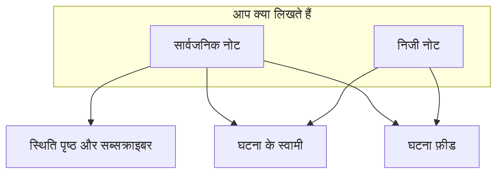

# घटना नोट्स, स्वामी और फ़ीड

हर घटना, जब आप उस पर काम करते हैं, एक लिखित रिकॉर्ड जमा करती है: आपके ग्राहकों के लिए अपडेट, आपकी टीम के लिए काम के नोट, और जो कुछ हुआ उसकी गतिविधि फ़ीड। यह पेज सार्वजनिक और निजी नोट लिखने, हर एक किस तक पहुँचता है, घटना फ़ीड, और उन स्वामियों के बारे में है जिन्हें हर बदलाव की ख़बर दी जाती है।

:::cards
- [सार्वजनिक नोट पोस्ट करें](#सार्वजनिक-नोट-पोस्ट-करना): ग्राहकों को बताएँ कि आप क्या जानते हैं, स्थिति पृष्ठ पर और सूचना के ज़रिए।
- [सब्सक्राइबर को सूचना कब मिलती है](#सार्वजनिक-नोट-असल-में-सब्सक्राइबर-तक-कब-पहुँचता-है): सार्वजनिक नोट किन जाँचों से गुज़रता है, और उसका बैज।
- [घटना फ़ीड](#घटना-फ़ीड): जो कुछ हुआ उसकी टाइमलाइन।
- [स्वामी](#स्वामी): कौन ज़िम्मेदार है, और उन्हें क्या बताया जाता है।
:::

## यह कैसे काम करता है

आप जो लिखते हैं उसमें से कुछ आपके ग्राहकों के लिए होता है — रात 02:14 पर स्थिति पृष्ठ पर जाने वाला वह अपडेट जो बताता है कि आपको ख़राब डिप्लॉय मिल गया है। बाकी आपकी टीम के लिए होता है — किसी का चिपकाया स्टैक ट्रेस, वह ग्राफ़ जो आख़िरकार समझ में आया, फ़ेलओवर का फ़ैसला। OneUptime इन दोनों पाठकों को अलग रखता है, और दोनों को घटना पर दर्ज करता है।



**सार्वजनिक नोट** आपके स्थिति पृष्ठ पर प्रकाशित होते हैं और सब्सक्राइबर को सूचित कर सकते हैं। **निजी नोट** (`IncidentInternalNote` मॉडल) डैशबोर्ड के अंदर ही रहते हैं। दोनों के नीचे **घटना फ़ीड** है, एक केवल-जोड़ने-योग्य टाइमलाइन जो घटना के साथ हुई हर बात दर्ज करती है, और **मालिक** सूची, जो तय करती है कि किसे बताया जाए।

यह सब घटना के साइड मेनू से जुड़ा है: **नोट → सार्वजनिक नोट**, **नोट → निजी नोट**, और **टीम → मालिक**। फ़ीड घटना के **अवलोकन** पेज पर है।

## सार्वजनिक नोट बनाम निजी नोट

दोनों तरह के नोट डैशबोर्ड में एक जैसे दिखते हैं और बहुत अलग बर्ताव करते हैं।

|                          | सार्वजनिक नोट                                                       | निजी नोट                                                        |
| ------------------------ | ------------------------------------------------------------------- | --------------------------------------------------------------- |
| मॉडल                     | `IncidentPublicNote`                                                | `IncidentInternalNote`                                          |
| स्थिति पृष्ठों पर दिखता है | हाँ, घटना की टाइमलाइन के हिस्से के रूप में                          | कभी नहीं — स्थिति पृष्ठ ऐप में कुछ भी इन्हें नहीं पढ़ता           |
| पोस्ट करने का समय        | `postedAt`, जिसे आप ख़ुद सेट कर सकते हैं                             | कोई नहीं: `createdAt` से टाइमस्टैम्प और क्रम                     |
| सब्सक्राइबर को सूचित करता है | जब **Notify status page subscribers** चालू हो                    | कभी नहीं: इसमें सब्सक्राइबर वाले फ़ील्ड हैं ही नहीं               |
| अटैचमेंट कौन खोल सकता है | स्थिति पृष्ठ के विज़िटर, एक स्थिति पृष्ठ रूट से                     | केवल प्रमाणित डैशबोर्ड API                                      |
| स्वामियों को सूचित करता है | हाँ                                                               | हाँ                                                             |

**"निजी" का असली मतलब।** इसका मतलब है "स्थिति पृष्ठ पर प्रकाशित नहीं" — न कि "लोगों के छोटे समूह तक सीमित"। जो अंतर्निर्मित भूमिकाएँ किसी घटना को पढ़ सकती हैं, वे दोनों तरह के नोट पढ़ती हैं, इसलिए जो भी घटना पढ़ सकता है, वह आमतौर पर उसके निजी नोट भी पढ़ सकता है; कस्टम भूमिका में ये अलग-अलग अनुमतियाँ हैं, **Read Incident Status Page Note** और **Read Incident Internal Note**। अगर आपको सीमित करना है कि घटना ही कौन देख सकता है, तो घटना पर ही **निजी घटना** फ़्लैग (`isPrivate`) का उपयोग करें, जो घटना को हर स्थिति पृष्ठ से छिपा देता है और उसे घटना के स्वामी उपयोगकर्ताओं, उसकी स्वामी टीमों के सदस्यों, और प्रोजेक्ट एडमिन व स्वामियों तक सीमित कर देता है।

**स्वामी दोनों देखते हैं।** स्वामियों को सूचना भेजने वाला जॉब सार्वजनिक और निजी नोट साथ में खोजता है। निजी नोट आपके सब्सक्राइबर से निजी है, प्रतिक्रिया देने वाले लोगों से नहीं।

| अगर आप चाहते हैं…                                       | चुनें            |
| ------------------------------------------------------ | ---------------- |
| ग्राहकों को बताना कि आप क्या जानते हैं और और जानकारी कब मिलेगी | **सार्वजनिक नोट** |
| किसी अपडेट को पिछली तारीख़ से डालना जो आप कहीं और भेज चुके हैं | **सार्वजनिक नोट** |
| कोई अनुमान, चलाया गया कोई कमांड, या कोई बंद रास्ता दर्ज करना | **निजी नोट**     |
| हीप डंप या किसी आंतरिक डैशबोर्ड का स्क्रीनशॉट जोड़ना      | **निजी नोट**     |

## सार्वजनिक नोट पोस्ट करना

:::steps
### सार्वजनिक नोट खोलें

घटना खोलें और उसके साइड मेनू में **नोट → सार्वजनिक नोट** चुनें। नोटों के ऊपर का कंपोज़र पोस्ट करने से पहले बताता है कि नोट कौन पढ़ेगा: **Public · Visible on your status page**।

### अपडेट लिखें

नोट Markdown में लिखें, या अपने किसी **टेम्पलेट** से या **Draft with AI** से शुरू करें। अगर सब्सक्राइबर को फ़ाइलें दिखनी चाहिए, तो उन्हें **Attach** से जोड़ें।

### तय करें कि किसे बताया जाए

सब्सक्राइबर को सूचित करने के लिए **Notify status page subscribers** चुना रहने दें, या चुपचाप प्रकाशित करने के लिए उसका निशान हटाएँ। उसके नीचे **Will notify** दिखाता है कि नोट किन स्थिति पृष्ठों तक पहुँचेगा, और **पूर्वावलोकन** वह ईमेल दिखाता है जो उन्हें मिलेगा।

### पोस्ट करें

**Post update** पर क्लिक करें, या Ctrl+Enter (Mac पर ⌘+Enter) दबाएँ। नोट सूची में सबसे ऊपर दिखता है, एक बैज के साथ जो उसकी सूचना पर नज़र रखता है।
:::

यही कंपोज़र घटना फ़ीड के **क्रियाएँ** मेनू में **Add Public Note** से एक डायलॉग में खुलता है ([घटना फ़ीड](#घटना-फ़ीड) देखें), इसलिए दोनों जगहों से नोट एक ही तरह लिखा जाता है।

| नियंत्रण                           | उद्देश्य                                                                                                                                       |
| ---------------------------------- | --------------------------------------------------------------------------------------------------------------------------------------------- |
| नोट                                | मुख्य टेक्स्ट, Markdown में। आवश्यक।                                                                                                          |
| **टेम्पलेट**                       | आपके किसी नोट टेम्पलेट को नोट में, आपके पहले से टाइप किए के बाद, डालता है। [नोट टेम्पलेट](#नोट-टेम्पलेट) देखें।                              |
| **Draft with AI**                  | घटना से नोट का मसौदा बनाता है, ताकि आप उसे संपादित करें। [AI से नोट बनाना](#ai-से-नोट-बनाना) देखें।                                  |
| **Attach**                         | स्थिति पृष्ठ पर सब्सक्राइबर के साथ साझा की जाने वाली फ़ाइलें। वैकल्पिक।                                                                        |
| **Posted now**                     | नोट के अनुसार वह कब पोस्ट हुआ: जिस पल आप उसे पोस्ट करते हैं, जब तक आप यहाँ, अपने वर्तमान टाइमज़ोन में, कोई पहले का समय न चुनें।                |
| **Notify status page subscribers** | चेकबॉक्स। डिफ़ॉल्ट रूप से चालू, जब तक घटना सब्सक्राइबर को सूचित किए बिना घोषित न की गई हो — तब यह बंद शुरू होता है। चुपचाप प्रकाशित करने के लिए इसे बंद करें। |

**चुप घटनाएँ चुप रहती हैं।** अगर कोई घटना **स्थिति पृष्ठ ग्राहकों को सूचित करें** बंद रखकर (या निजी घटना के रूप में) घोषित की गई थी, तो उसके सब्सक्राइबर को उसके बारे में कभी बताया ही नहीं गया, इसलिए सार्वजनिक नोट वह पहली चीज़ नहीं होनी चाहिए जो वे सुनें। ऐसी घटना पर चेकबॉक्स बंद शुरू होता है, नीचे कारण बताने वाली एक पंक्ति के साथ। आप फिर भी उस नोट के बारे में सब्सक्राइबर को सूचित करने के लिए उसे चुन सकते हैं। बिना स्पष्ट चुनाव के पोस्ट किए गए नोट भी इसी नियम का पालन करते हैं: Slack और Microsoft Teams के नोट, वर्कफ़्लो, और वे API अनुरोध जो `shouldStatusPageSubscribersBeNotifiedOnNoteCreated` छोड़ देते हैं। स्पष्ट `true` या `false` हमेशा रखा जाता है। [निर्धारित रखरखाव इवेंट](/docs/status-pages/subscribers#निर्धारित-रखरखाव-कार्यक्रम) और [घटना एपिसोड](/docs/status-pages/subscribers) पर सार्वजनिक नोट भी मिलते-जुलते नियम का पालन करते हैं, इस आधार पर कि बनते समय इवेंट या एपिसोड ने ख़ुद सब्सक्राइबर को सूचित किया था या नहीं; एपिसोड को निजी बनाने से इस पर असर नहीं पड़ता।

**देखें कि नोट किस तक पहुँचेगा।** जब तक **Notify status page subscribers** चुना है, उसके नीचे एक **Will notify** पंक्ति उन स्थिति पृष्ठों को सूचीबद्ध करती है जहाँ नोट जाएगा, हर चैनल के लिए "अधिकतम" सब्सक्राइबर संख्या के साथ, और उन पृष्ठों को जो घटना के मॉनिटर को सूचीबद्ध करते हैं पर जिन्हें नहीं बताया जाएगा, कारण के साथ। जब किसी को नहीं बताया जाएगा, तो यह कुछ नहीं दिखाती, जब तक घटना स्थिति पृष्ठों से छिपी न हो या उसका स्थिति पृष्ठ दायरा कारण न हो। यह घटना के स्थिति पृष्ठ दायरे का पालन करती है, इसलिए दो साइट पृष्ठों तक सीमित घटना पर नोट बताता है कि वह उन्हीं दो तक पहुँचेगा। [हर ऑडियंस के लिए एक स्थिति पृष्ठ](/docs/status-pages/one-status-page-per-audience) देखें।

**देखें कि उन्हें क्या मिलेगा।** उसी चेकबॉक्स के बगल में, **पूर्वावलोकन** वह ईमेल दिखाता है जो आपके लिखे जा रहे नोट के लिए उनमें से हर स्थिति पृष्ठ के सब्सक्राइबर को मिलेगा, और यह भी कि वह कौन-सा टेम्पलेट इस्तेमाल करता है और क्यों। नोट में कुछ टेक्स्ट होने तक यह धूसर रहता है। **मुझे टेस्ट भेजें** वह ईमेल आपके अपने खाते के ईमेल पर भेजता है, और किसी को नहीं। [सब्सक्राइबर और घोषणाएँ](/docs/status-pages/subscribers#घटनाएँ) देखें।

> [!TIP]
> **पोस्ट करने का समय ही नोट का असली टाइमस्टैम्प है।** स्थिति पृष्ठ सार्वजनिक नोटों को `postedAt` से क्रम में लगाते और दिखाते हैं, इस बात से नहीं कि आपने उन्हें कब टाइप किया — इसलिए अगर आप स्थिति पृष्ठ पर 40 मिनट पहले भेजे गए किसी अपडेट को दर्ज कर रहे हैं, तो **Posted now** चुनें और वह समय सेट करें जब यह असल में हुआ। अगर कोई नोट API (`/api/incident-public-note`) से बिना समय के आता है, तो OneUptime वर्तमान समय दर्ज करता है।

हर नोट दिखाता है कि उसे किसने लिखा, उसके पोस्ट होने का समय, उसके अटैचमेंट के साथ बना हुआ Markdown, और अपने हेडर में, उसकी सब्सक्राइबर सूचना कहाँ तक पहुँची है। **Search notes…** नोटों को उनकी बात से ढूँढता है, और फ़ीड नए से पुराने या पुराने से नए क्रम में पढ़ी जा सकती है।

## निजी नोट पोस्ट करना

**नोट → निजी नोट** जानबूझकर ज़्यादा सादा है। यह वही कंपोज़र है, जो **Private · Only your team can see this** कहता है, नोट, **टेम्पलेट**, **Draft with AI** और घटना प्रतिक्रिया टीम के लिए फ़ाइलों के वास्ते **Attach** के साथ। घटना फ़ीड के **क्रियाएँ** मेनू में **निजी नोट जोड़ें** इसे एक डायलॉग में खोलता है। API में निजी नोट `/api/incident-internal-note` हैं।

कोई पोस्ट करने का समय नहीं, कोई सब्सक्राइबर चेकबॉक्स नहीं — नोट बनते समय उस पर टाइमस्टैम्प लगता है।

दोनों तरह के नोट Markdown एडिटर में लिखे जाते हैं, जो सूची आइटमों को **इंडेंट बढ़ाएँ** और **इंडेंट घटाएँ** — या Tab और Shift+Tab — से नेस्ट करता है, और Word, Google Docs या किसी दूसरे OneUptime पेज से पेस्ट की गई सामग्री की सूचियाँ, लिंक और फ़ॉर्मेटिंग बनाए रखता है। Ctrl+Z इंडेंट बढ़ाना या घटाना वापस लेता है, और विज़ुअल मोड में एडिटर के डाले ब्लॉक और पेस्ट भी, आपकी टाइपिंग के साथ क्रम में। किसी नोट से कॉपी किया गया कोड ब्लॉक कोड ब्लॉक के रूप में ही वापस पेस्ट होता है, और उससे कॉपी किया गया कोई शब्द इनलाइन कोड के रूप में। [घटना घोषित करना](/docs/incidents/declaring-incidents#चरण-1-घटना-विवरण) देखें।

## नोटों पर अटैचमेंट

दोनों तरह के नोट कंपोज़र के **Attach** बटन से फ़ाइल अटैचमेंट लेते हैं, और दोनों नोट के मुख्य टेक्स्ट के नीचे हर फ़ाइल के लिए **Download attachment** लिंक वाली अटैचमेंट सूची दिखाते हैं।

अंतर इसमें है कि फ़ाइल कौन ला सकता है:

- **सार्वजनिक नोट के अटैचमेंट** स्थिति पृष्ठ के विज़िटर एक स्थिति पृष्ठ रूट से, नोट के साथ ही, डाउनलोड कर सकते हैं।
- **निजी नोट के अटैचमेंट** केवल प्रमाणित डैशबोर्ड API से मिलते हैं। उनके लिए कोई स्थिति पृष्ठ रूट नहीं है।

इससे अटैचमेंट पर भी वही सार्वजनिक/निजी फ़ैसला लागू होता है जो नोट के टेक्स्ट पर। ग्राहकों के लिए टाइमलाइन की छवि सार्वजनिक नोट पर जाती है; कॉन्फ़िग डंप निजी नोट पर।

छवियाँ भी इसी फ़ैसले का पालन करती हैं। जो छवि आप किसी नोट में पेस्ट करते हैं या छोड़ते हैं, या **छवि अपलोड करें** से जोड़ते हैं, वह घटना के प्रोजेक्ट में सहेजी जाती है और नोट के अंदर दिखती है, और उसे कौन देख सकता है यह नोट पर निर्भर करता है:

- **निजी नोट में** — या पोस्ट होने से पहले सार्वजनिक नोट में — छवि केवल प्रोजेक्ट के सदस्यों को दिखती है, जो प्रोजेक्ट के तय तरीके से साइन इन हों। उसका पता खोलने वाले किसी और को कुछ नहीं दिखता, जैसे वहाँ कोई छवि हो ही नहीं।
- **सार्वजनिक नोट में** छवि हर उस व्यक्ति को दिखती है जो नोट देख सकता है: स्थिति पृष्ठ पर, और उसके सब्सक्राइबर को मिलने वाले ईमेल में। सार्वजनिक नोट अपनी घटना के साथ ही दिखता है, उसके बिना कभी नहीं: जब तक घटना स्थिति पृष्ठों से छिपी या निजी है, उसके नोटों की छवियाँ भी केवल प्रोजेक्ट के सदस्यों को दिखती हैं।

हर अपलोड निजी शुरू होता है, डैशबोर्ड से भी और API से भी। कोई छवि सबके लिए केवल तब तक दिखने लायक होती है जब तक आपके स्थिति पृष्ठों पर दिखने वाली किसी चीज़ में वह हो: सार्वजनिक नोट, जब तक उसकी घटना, एपिसोड या निर्धारित रखरखाव इवेंट स्थिति पृष्ठों पर दिख रहा है, कोई घोषणा उसके दिखना शुरू होने के समय से, घटना का विवरण जब तक घटना **स्थिति पृष्ठ पर दृश्यमान** है और निजी नहीं है, उसका पोस्टमॉर्टम वहाँ प्रकाशित होने के बाद, किसी एपिसोड या निर्धारित रखरखाव इवेंट का विवरण जब तक वह स्थिति पृष्ठों पर दिख रहा है (एपिसोड के निजी रहते कभी नहीं), और स्थिति पृष्ठ का अपना अवलोकन, समूह और संसाधन विवरण। जब यह रुकता है — घटना छिपाई जाती है या निजी बनाई जाती है, छवि संपादन में हटाई जाती है, नोट या घटना हटाई जाती है — तो छवि फिर से निजी हो जाती है, जब तक आपके स्थिति पृष्ठों पर दिखने वाली किसी और चीज़ में वह अब भी न हो। फ़ॉर्म का विवरण और धन्यवाद संदेश भी अपनी छवियाँ इसी तरह सबको दिखाते हैं, जब तक फ़ॉर्म सबमिशन ले रहा है।

API, Terraform या किसी वर्कफ़्लो से नोट पढ़ने पर केवल वे अटैचमेंट सूचीबद्ध होते हैं जिन्हें पढ़ने वाला खोल सकता है: नोट के प्रोजेक्ट की फ़ाइलें, और सार्वजनिक फ़ाइलें। किसी दूसरे प्रोजेक्ट का अटैचमेंट, जिसका नाम नोट में है, सूची से छोड़ दिया जाता है, जैसे नोट में वह हो ही नहीं।

## AI से नोट बनाना

कंपोज़र में एक **Draft with AI** बटन है, दोनों नोट पेजों पर और फ़ीड के **Add Public Note** और **निजी नोट जोड़ें** डायलॉग में। यह घटना को आपके प्रोजेक्ट के AI प्रदाता को भेजता है और बना हुआ Markdown नोट में डाल देता है, जहाँ आप पोस्ट करने से पहले उसे संपादित करते हैं — कुछ भी अपने आप प्रकाशित नहीं होता।

| डायलॉग                             | यह क्या लिखता है                                                     | टेम्पलेट                                                          |
| ---------------------------------- | -------------------------------------------------------------------- | ----------------------------------------------------------------- |
| **Generate Public Note with AI**   | ग्राहकों के लिए एक नोट, घटना के डेटा के विश्लेषण से।                  | **Status Update**, **Resolution Notice**, **Maintenance Update**  |
| **Generate Private Note with AI**  | एक आंतरिक तकनीकी नोट।                                                | **Investigation Update**, **Technical Analysis**, **Shift Handoff** |

बटन के पीछे, डैशबोर्ड चुने गए टेम्पलेट और `public` या `internal` नोट प्रकार के साथ `/incident/generate-note-from-ai/{incidentId}` पर पोस्ट करता है।

जो भेजा जाता है वह घटना का टेक्स्ट है। उसमें एम्बेड की गई छवि या फ़ाइल — जैसे विवरण में चिपकाया गया स्क्रीनशॉट — एक छोटे नोट से बदल दी जाती है, जैसे `[image omitted: PNG, 340 KB]`, और हर टेक्स्ट फ़ील्ड 16,000 अक्षरों पर काट दिया जाता है, ताकि एक बड़ा पेस्ट बाकी सबको बाहर न कर दे। घटना ख़ुद अपनी छवियाँ बनाए रखती है।

## नोट टेम्पलेट

अगर आपकी टीम हर आउटेज में वही तीन अपडेट लिखती है, तो उन्हें एक बार सहेज लें। कंपोज़र का **टेम्पलेट** मेनू उन्हें सूचीबद्ध करता है, दोनों नोट पेजों पर और फ़ीड के नोट डायलॉग में, और किसी एक को चुनने से वह नोट में आ जाता है।

टेम्पलेट सार्वजनिक और निजी नोटों के बीच साझा होते हैं: एक ही टेम्पलेट सूची दोनों के काम आती है, और एक ही टेम्पलेट किसी भी तरह के नोट में डाला जा सकता है।

टेम्पलेट के प्लेसहोल्डर — `{{incident.title}}`, `{{incident.state}}`, `{{incident.customFields.impact}}` और [नोट टेम्पलेट](/docs/incidents/settings#नोट-टेम्पलेट) में सूचीबद्ध बाकी — चुनते समय घटना के वर्तमान मानों से भर दिए जाते हैं, नोट पेजों पर भी और **स्वीकार करें** व **सुलझाएं** डायलॉग में भी। आपका पहले से टाइप किया हुआ कभी नहीं बदला जाता, और जिस प्लेसहोल्डर का कोई मान न हो वह जैसा लिखा है वैसा रहता है।

> [!IMPORTANT]
> सार्वजनिक नोट पोस्ट करने से पहले भरा हुआ नोट पढ़ें: `{{incident.affectedStatusPages}}` उन सभी स्थिति पृष्ठों के नाम बताता है जहाँ घटना पहुँचती है, और उन सबके सब्सक्राइबर उसे पढ़ते हैं।

आप इन्हें **घटनाएं → सेटिंग्स → नोट टेम्पलेट** में प्रबंधित करते हैं — कार्ड का शीर्षक **घटनाओं के लिए सार्वजनिक या निजी नोट टेम्पलेट** है और उसका फ़ॉर्म एक ही पेज है: **टेम्पलेट नाम** और **टेम्पलेट विवरण**, दोनों आवश्यक, फिर मुख्य टेक्स्ट। जब तक आपके पास कोई टेम्पलेट नहीं है, **टेम्पलेट** मेनू यही बताता है और वहाँ का लिंक देता है।

## Slack या Microsoft Teams से नोट पोस्ट करना

अगर आपने कोई वर्कस्पेस कनेक्ट किया है, तो प्रतिक्रिया देने वालों को चैनल कभी छोड़ना नहीं पड़ता। Slack और Microsoft Teams दोनों एक नोट जोड़ने वाली कार्रवाई देते हैं जो एक मोडल खोलती है, जिसमें **Note Type** ड्रॉपडाउन — **Public Note** (स्थिति पृष्ठ पर पोस्ट होता है) या **Private Note** (केवल टीम के सदस्यों को दिखता है) — और एक **Note** टेक्स्ट बॉक्स होता है, और नतीजा सीधे घटना पर लिख देती है।

तीन बातें जानने लायक हैं:

- **दोहराव से सुरक्षा** — हर नोट उस Slack संदेश को दर्ज करता है जिससे वह आया (`postedFromSlackMessageId`, `channel_id:message_ts` के रूप में), ताकि एक ही संदेश पर कई लोगों की प्रतिक्रिया से एक नोट बने, पाँच नहीं।
- **नोट वापस गूँजते हैं** — किसी भी तरह का नोट पोस्ट करने से कनेक्ट किए गए घटना चैनल में भी एक संदेश जाता है, क्योंकि नोट का फ़ीड आइटम वर्कस्पेस सूचना चालू रखकर बनाया जाता है।
- **माँगने वाले व्यक्ति के रूप में पोस्ट** — मोडल से या किसी प्रतिक्रिया से आया नोट उस व्यक्ति की OneUptime अनुमतियों के साथ पोस्ट होता है, इसलिए घटना पर उस तरह का नोट पोस्ट करने के लिए उनकी अनुमति चाहिए। अस्वीकार होने पर उन्हें कारण बताया जाता है — Slack में एक सीधे संदेश में, और Microsoft Teams में बातचीत में (प्रतिक्रिया के लिए, संदेश के थ्रेड में) — और कुछ भी पोस्ट नहीं होता।

## सार्वजनिक नोट असल में सब्सक्राइबर तक कब पहुँचता है

**स्थिति पृष्ठ ग्राहकों को सूचित करें** चालू रखकर सार्वजनिक नोट बनाने से अपने आप यह पक्का नहीं होता कि ईमेल जाएगा। नोट को जाँचों की एक कड़ी पार करनी होती है, और हर विफलता त्रुटि देने के बजाय एक ख़ास कारण दर्ज करती है:

```mermaid title="सब्सक्राइबर को ख़बर मिलने से पहले सार्वजनिक नोट किन जाँचों से गुज़रता है"
flowchart TB
    note["सार्वजनिक नोट पोस्ट हुआ"] --> box{"सूचना बॉक्स चालू?"}
    box -->|नहीं| skipped["सब्सक्राइबर को सूचित नहीं किया गया"]
    box -->|हाँ| incident{"घटना स्थिति पृष्ठों पर?"}
    incident -->|नहीं| skipped
    incident -->|हाँ| pages{"पृष्ठ दायरे में?"}
    pages -->|नहीं| skipped
    pages -->|हाँ| prefs{"सब्सक्राइबर ने चुना है?"}
    prefs -->|हाँ| sent["संदेश भेजा गया"]
```

1. **स्थिति पृष्ठ ग्राहकों को सूचित करें** चालू होना चाहिए। अगर नहीं है, तो नोट बनते ही छोड़े गए के रूप में चिह्नित हो जाता है। सब्सक्राइबर को सूचित किए बिना घोषित घटनाओं पर यह बंद शुरू होता है।
2. नोट ऐसी घटना का होना चाहिए जो अब भी मौजूद है।
3. घटना से कम से कम एक मॉनिटर जुड़ा होना चाहिए — बिना मॉनिटर के नोट को भेजने के लिए कोई स्थिति पृष्ठ संसाधन नहीं है।
4. घटना का **स्थिति पृष्ठ पर दृश्यमान** फ़्लैग (`isVisibleOnStatusPage`) true होना चाहिए, और घटना निजी नहीं होनी चाहिए (`isPrivate`)। निजी घटना हर स्थिति पृष्ठ से छिपी रहती है, फ़्लैग चाहे जो कहे — [घटना को स्थिति पृष्ठ से दूर रखना](/docs/incidents/states-and-severities#घटना-को-स्थिति-पृष्ठ-से-दूर-रखना) देखें।
5. घटना जिस भी स्थिति पृष्ठ तक पहुँचती है, उस पर **घटनाएं दिखाएं** (`showIncidentsOnStatusPage`) चालू होना चाहिए। वह जिन पृष्ठों तक पहुँचती है, वे हैं जो उसके मॉनिटर को सूचीबद्ध करते हैं, और अगर घटना कुछ पृष्ठों तक सीमित है तो उन्हीं तक छोटे किए गए। जो घटना किसी पृष्ठ तक सीमित नहीं है, वह उन पृष्ठों को छोड़ देती है जो केवल अपने तक सीमित घटनाएँ दिखाते हैं। [हर ऑडियंस के लिए एक स्थिति पृष्ठ](/docs/status-pages/one-status-page-per-audience) देखें।
6. हर सब्सक्राइबर को अपनी पसंद की शर्तें पूरी करनी होती हैं — सदस्यता रद्द न की हो, और जहाँ पृष्ठ सब्सक्राइबर को चुनने देता है वहाँ इस संसाधन और `Incident` इवेंट प्रकार के लिए सदस्यता ली हो।

> [!NOTE]
> **सूचनाएँ तुरंत नहीं जातीं।** इन्हें भेजने वाला जॉब मिनट में एक बार चलता है, इसलिए नोट सहेजने और मेल निकलने के बीच लगभग एक मिनट तक की उम्मीद रखें। नोट पर **Notifying subscribers soon** और घटना की अपनी सूचनाओं पर **Sending Soon** का यही मतलब है।

सार्वजनिक नोट का हेडर एक बैज से पूरी यात्रा पर नज़र रखता है। सूचना का स्थिति संदेश देखने के लिए उस पर क्लिक करें, जो बताता है कि क्या हुआ:

| बैज                            | इसका मतलब                                                                                                                                         |
| ------------------------------ | ------------------------------------------------------------------------------------------------------------------------------------------------- |
| **Subscribers not notified**   | कुछ नहीं भेजा गया: नोट **स्थिति पृष्ठ ग्राहकों को सूचित करें** का निशान हटाकर पोस्ट हुआ था, या ऊपर का कोई दरवाज़ा बंद था। कारण दर्ज है।          |
| **Notifying subscribers soon** | कतार में, भेजने वाले जॉब के अगली बार चलने का इंतज़ार।                                                                                              |
| **Notifying subscribers**      | जॉब सब्सक्राइबर सूची पर काम कर रहा है।                                                                                                            |
| **Subscribers notified**       | हर सब्सक्राइबर का संदेश भेजा गया। स्थिति संदेश, हर स्थिति पृष्ठ के लिए, बताता है कि हर चैनल पर कितने गए।                                            |
| **Notification failed**        | हर सब्सक्राइबर को नहीं भेजा गया, या जॉब किसी त्रुटि के साथ रुक गया। स्थिति संदेश बताता है कि क्या हुआ।                                            |

**भेजा गया का मतलब है भेजा गया।** जॉब हर संदेश का इंतज़ार करता है: ईमेल या टेक्स्ट संदेश तब भेजा गया गिना जाता है जब मेल सर्वर या SMS प्रदाता उसे ले लेता है, और Slack, Microsoft Teams या webhook संदेश तब जब दूसरी तरफ़ से जवाब आ जाता है। जो संदेश अस्वीकार हो, त्रुटि दे, या 4 मिनट के अंदर कोई जवाब न पाए, वह विफल गिना जाता है, और एक विफलता बैज को **Notification failed** कर देती है; बाकी सब्सक्राइबर को फिर भी भेजा जाता है। तब स्थिति संदेश कुछ ऐसा पढ़ता है: `Not every subscriber was sent this notification: 2 of 61 messages failed. Site 03: 41 email sent. Site 07: 16 email, 2 SMS sent; 2 email failed.` "भेजा गया" वहीं तक है जहाँ तक OneUptime देख सकता है: मेल सर्वर बाद में भी ईमेल लौटा सकता है।

:::details बड़े पृष्ठ और लंबे भेजने
किसी स्थिति पृष्ठ के सब्सक्राइबर एक बार में 10,000 पढ़े जाते हैं जब तक हर एक तक न पहुँच जाएँ, और एक साथ 20 संदेश रास्ते में होते हैं। एक सूचना 20 मिनट बाद नए संदेश शुरू करना बंद कर देती है: तब तक जिन तक वह नहीं पहुँची, वे सूचीबद्ध होते हैं, और वह **Notification failed** चिह्नित होती है। बीच में रुका हुआ भेजना — जिसका सर्वर फिर से शुरू हुआ या जवाब देना बंद कर दिया — भी 40 मिनट तक **Notifying subscribers** रहने के बाद **Notification failed** चिह्नित होता है, `Interrupted:` से शुरू होने वाले संदेश के साथ, ताकि वह हमेशा वहीं न अटका रहे। [सब्सक्राइबर और घोषणाएँ](/docs/status-pages/subscribers) देखें।
:::

### किसी नोट की सूचना फिर से भेजना

क्या हुआ यह देखने के लिए नोट के सूचना बैज पर क्लिक करें। जिस नोट की सूचना विफल हुई, वह **सूचना फिर से प्रयास करें** देता है, और जिसकी सूचना चली गई, वह **सूचना फिर से भेजें**। दोनों पहले पूछते हैं: पुष्टि उन स्थिति पृष्ठों को सूचीबद्ध करती है जहाँ नोट अब पहुँचेगा, हर चैनल के लिए "अधिकतम" संख्या के साथ, या बताती है कि वह किसी तक नहीं पहुँचेगा, और बताती है कि क्या होगा। दोनों में से कोई भी नोट को फिर से लंबित स्थिति में डाल देता है ताकि अगली बार जॉब उसे उठा ले, और उसे हर उस स्थिति पृष्ठ पर भेजता है जहाँ घटना अब पहुँचती है, उन सब्सक्राइबर सहित जिन्हें वह पहले ही मिल चुका है। अगर नोट पोस्ट होने के बाद आपने वे पृष्ठ बदले जिन तक घटना सीमित है, तो वह उन पृष्ठों पर जाता है जिन तक वह अब सीमित है। **स्थिति पृष्ठ ग्राहकों को सूचित करें** का निशान हटाकर पोस्ट किया गया नोट दोनों में से कुछ नहीं देता, क्योंकि उसे कभी भेजा जाना ही नहीं था, और जब तक कोई सूचना अभी कतार में है या भेजी जा रही है, तब तक भी दोनों में से कुछ नहीं दिया जाता। निर्धारित रखरखाव इवेंट और घटना एपिसोड के सार्वजनिक नोट केवल विफलता के बाद **सूचना फिर से प्रयास करें** रखते हैं।

किसी नोट की सूचना फिर से भेजने से हर सब्सक्राइबर को वही बताया जाता है जो नोट कहता है, जैसे उसे पोस्ट करने पर, इसलिए इसके लिए सब्सक्राइबर को सूचित करने वाले सार्वजनिक नोट पोस्ट करने की अनुमति के साथ-साथ सार्वजनिक नोट संपादित करने की अनुमति भी चाहिए। API में यह वही अपडेट है जो डैशबोर्ड करता है, `subscriberNotificationStatusOnNoteCreated` को फिर से `Pending` पर सेट करना; यह उन अनुमतियों के बिना कॉल करने वाले के लिए, सब्सक्राइबर को सूचित किए बिना पोस्ट किए गए नोट के लिए, और नोट की सूचना भेजे जाते समय, अस्वीकार होता है।

:::details घटना की 'बनाई गई' सूचना कैसे वहीं से आगे बढ़ती है
केवल घटना की 'बनाई गई' सूचना वहीं से आगे बढ़ती है जहाँ रुकी थी: वह उन स्थिति पृष्ठों का रिकॉर्ड रखती है जिन्हें उसने पूरा भेजा, और घटना के **अवलोकन** पर **फिर से प्रयास करें** उन्हें छोड़ देता है। रिकॉर्ड हर स्थिति पृष्ठ का रखा जाता है, हर सब्सक्राइबर का नहीं, इसलिए जिस पृष्ठ के बीच में वह रुकी थी, उसे फिर से पूरा भेजा जाता है, उस पृष्ठ के उन सब्सक्राइबर सहित जिन्हें वह पहले ही मिल चुकी है। **फिर से प्रयास करें** की पुष्टि **इसे सभी स्थिति पृष्ठों पर फिर से भेजें, पहले से पहुँचे पृष्ठों सहित** देती है, जो उसे **सभी पृष्ठों पर फिर से भेजें** बना देता है, और सफलता के बाद **फिर से भेजें** उसे फिर से हर पृष्ठ पर भेजता है। [हर ऑडियंस के लिए एक स्थिति पृष्ठ](/docs/status-pages/one-status-page-per-audience#adding-status-pages) देखें।
:::

### सार्वजनिक नोट संपादित करना

**सार्वजनिक नोट संपादित करना चुपचाप होता है, जब तक आप न कहें।** नोट के संपादन फ़ॉर्म में एक **इस अपडेट के बारे में सब्सक्राइबर को सूचित करें** चेकबॉक्स होता है, जो हर बार बिना निशान के होता है। सब्सक्राइबर को जिस बदलाव के बारे में जानना चाहिए, उसके लिए इसे चुनें, और उन्हें संपादित नोट अपडेट के रूप में चिह्नित मिलता है; तब नोट मूल बैज के साथ अपडेट का दूसरा बैज दिखाता है, विफलता के बाद अपने **सूचना फिर से प्रयास करें** के साथ:

| अपडेट बैज           | इसका मतलब                                           |
| ------------------- | --------------------------------------------------- |
| **अपडेट कतार में है** | भेजने वाले जॉब के अगली बार चलने का इंतज़ार।          |
| **अपडेट भेजा जा रहा है** | जॉब सब्सक्राइबर सूची पर काम कर रहा है।            |
| **अपडेट भेजा गया**  | हर सब्सक्राइबर को संपादित नोट भेजा गया।             |
| **अपडेट विफल रहा**  | हर सब्सक्राइबर को नहीं भेजा गया।                   |
| **अपडेट नहीं भेजा गया** | ऊपर के किसी दरवाज़े ने इसे रोक दिया।              |

भेजा गया अपडेट फिर से नहीं दिया जाता: सबसे नया टेक्स्ट भेजने के लिए चेकबॉक्स चुनकर नोट संपादित करें, या नोट ख़ुद फिर से भेजें। अगर मूल सूचना अभी नहीं भेजी गई है, तो कोई अलग अपडेट नहीं जाता — मूल सूचना ही बदलाव ले जाती है। अगर वह ठीक उसी समय भेजी जा रही है, तो अपडेट उसके पूरा होने का इंतज़ार करता है और फिर जाता है। चेकबॉक्स और अपडेट के **सूचना फिर से प्रयास करें** के लिए वही अनुमतियाँ चाहिए जो नोट की सूचना फिर से भेजने के लिए; उनके बिना भी आप नोट संपादित कर सकते हैं, किसी को सूचित किए बिना। [सब्सक्राइबर और घोषणाएँ](/docs/status-pages/subscribers) देखें।

सब्सक्राइबर को मिलने वाला असली संदेश हर स्थिति पृष्ठ और हर चैनल के लिए टेम्पलेट से बनता है — ईमेल, SMS, Slack और Microsoft Teams, हर एक के पास **Subscriber Incident Note Created** इवेंट के लिए अपना टेम्पलेट है, जिसमें स्थिति पृष्ठ के नाम और URL, विवरण लिंक, प्रभावित संसाधन, घटना की गंभीरता और शीर्षक, नोट का मुख्य टेक्स्ट, घटना के लेबल, प्रभावित स्थिति पृष्ठ और कस्टम फ़ील्ड, और हर सब्सक्राइबर के लिए सदस्यता रद्द करने के लिंक के वेरिएबल होते हैं। डिफ़ॉल्ट ईमेल, Slack और Microsoft Teams संदेश **सब्सक्राइबर सूचनाओं में शामिल करें** चिह्नित घटना कस्टम फ़ील्ड भी, उनके वर्तमान मानों के साथ, सूचीबद्ध करते हैं। वे टेम्पलेट और चैनल कैसे कॉन्फ़िगर होते हैं, इसके लिए [सब्सक्राइबर और घोषणाएँ](/docs/status-pages/subscribers) देखें।

## घटना फ़ीड

**घटना फ़ीड** कार्ड घटना के **अवलोकन** पेज पर बाएँ कॉलम में सबसे नीचे है। यह क्रम से घटना की कहानी है: हर आइटम एक आइकन, उसे करने वाले का अवतार और नाम, एक सापेक्ष टाइमस्टैम्प जिस पर होवर करने से सटीक स्थानीय समय दिखता है, और एक Markdown मुख्य टेक्स्ट है। डिफ़ॉल्ट रूप से सबसे नए आइटम सबसे ऊपर होते हैं।

कुछ आइटम में अतिरिक्त जानकारी होती है — जैसे स्वामी सूचना उन सबको सूचीबद्ध करती है जिन्हें मेल भेजा गया, और सब्सक्राइबर सूचना हर उस स्थिति पृष्ठ को सूचीबद्ध करती है जहाँ वह गई, हर चैनल पर भेजे और विफल हुए संदेशों की संख्या और उसके ईमेल के विषय के साथ, और अगर उसने कुछ भेजा, तो उसके बाद **Custom fields sent** के नीचे वे कस्टम फ़ील्ड मान जो उसने किसी संदेश में डाले। ऐसे आइटम एक **More Information** बटन दिखाते हैं जो एक **More Information** पैनल खोलता है।

कार्ड के हेडर में एक **क्रियाएँ** मेनू भी है ताकि आप टाइमलाइन छोड़े बिना काम कर सकें:

- **Execute Runbook** — इस घटना पर एक [रनबुक](/docs/runbooks/index) शुरू करें।
- **ऑन-कॉल नीति निष्पादित करें** — ज़रूरत पड़ने पर किसी नीति से पेज करें। संग्रहीत नीति किसी को पेज नहीं करती: घटना पर उसका निष्पादन लॉग बताता है कि नीति संग्रहीत होने के कारण वह नहीं चलाई गई।
- **Add Public Note** — **सार्वजनिक नोट** पेज का कंपोज़र, एक डायलॉग में: नोट लिखें, फिर **Post update**। टेम्पलेट, **Draft with AI**, अटैचमेंट, यह किस तक पहुँचेगा उसके साथ **Notify status page subscribers**, और **पूर्वावलोकन**, सब वहाँ हैं। नोट अभी के समय पर पोस्ट होता है; पिछली तारीख़ देने के लिए **Posted now** चुनें।
- **निजी नोट जोड़ें** — **निजी नोट** पेज का कंपोज़र, एक डायलॉग में: नोट लिखें, फिर **Add note**।

जो व्यक्ति नोट नहीं लिख सकता, उसके लिए दोनों नोट कार्रवाइयाँ लॉक रहती हैं, कमी वाली अनुमति का नाम बताते हुए। नोट पोस्ट होने के बाद डायलॉग बंद होता है और फ़ीड उसे दिखाती है।

बाकी सब उसके बगल वाले **⋯** बटन के पीछे है, वही **अधिक विकल्प** बटन जो किसी तालिका के कार्ड हेडर में होता है, ताकि हेडर में जितने कम हो सकें उतने बटन दिखें:

- **नवीनतम पहले** / **सबसे पुराना पहले** — फ़ीड किस क्रम में पढ़ी जाए। इस्तेमाल हो रहे क्रम पर निशान होता है, और आपका ब्राउज़र हर घटना की फ़ीड के लिए यह चुनाव याद रखता है।
- **इवेंट प्रकार के अनुसार फ़िल्टर करें** — एक डायलॉग जो फ़ीड के इवेंट प्रकारों को, हर एक के आइटम पर लगने वाले आइकन के साथ, सूचीबद्ध करता है, और सूची लंबी होने पर एक सर्च बॉक्स। दिखाने वाले प्रकार चुनें और **फ़िल्टर लागू करें** चुनें; कुछ न चुना हो, तो हर इवेंट प्रकार दिखता है। फ़ीड फ़िल्टर रहते हुए, उसके ऊपर एक बॉक्स बताता है कि वह कितने इवेंट प्रकार दिखा रही है, हर एक के लिए एक चिप, **फ़िल्टर संपादित करें** और **फ़िल्टर साफ़ करें** के साथ। फ़िल्टर सहेजा नहीं जाता: घटना से निकलें, तो उसकी फ़ीड फिर से सब कुछ दिखाती है।
- **रिफ्रेश** — फ़ीड फिर से लाता है।

> [!NOTE]
> **फ़ीड केवल-जोड़ने-योग्य है, और यह आपका ऑडिट लॉग नहीं है।** API फ़ीड आइटम बनाने और पढ़ने देता है, लेकिन अपडेट करने या हटाने नहीं, ताकि कोई चुपचाप किसी घटना का इतिहास फिर से न लिख सके। यह स्थायी भी नहीं है: बिल वाले इंस्टॉलेशन पर तीन साल से पुरानी फ़ीड पंक्तियाँ हटा दी जाती हैं। किसने क्या बदला, इसके टिकाऊ रिकॉर्ड के लिए घटना के साइड मेनू में **उन्नत → ऑडिट लॉग** का उपयोग करें।

## फ़ीड क्या दर्ज करती है

फ़ीड आइटम घटना सेवा ख़ुद, दोनों नोट सेवाएँ, स्थिति टाइमलाइन, स्वामी और सदस्य बदलाव, अलर्ट लिंक और अनलिंक करना, नियम इंजन, ऑन-कॉल निष्पादन, AI जांच और पोस्टमॉर्टम रनर, और सूचना cron जॉब लिखते हैं। इवेंट प्रकारों में शामिल हैं:

- **घटना ख़ुद** — `IncidentCreated`, `IncidentUpdated`, `IncidentStateChanged`। `IncidentUpdated` प्रविष्टि दर्ज करती है कि किसी संपादन ने क्या बदला: शीर्षक, विवरण, मूल कारण, सुधार नोट, लेबल, गंभीरता, मॉनिटर और उन पर डाली गई स्थिति, और घटना के दायरे में जोड़े गए या उससे हटाए गए स्थिति पृष्ठ। इसमें बदले हर मान की एक पंक्ति होती है और जैसा था वैसा सहेजे गए मान की कोई नहीं, इसलिए बिना कुछ बदले कोई कार्ड सहेजना, या किसी API क्लाइंट या वर्कफ़्लो का घटना को जैसी है वैसी वापस लिखना, कोई प्रविष्टि नहीं जोड़ता। जो टेक्स्ट एक जैसा पढ़ा जाए वह एक ही है (पंक्ति के अंत और उसके आसपास के स्पेस को छोड़कर), और लेबल किसी भी क्रम में एक ही सेट हों तो एक ही हैं; साफ़ किया गया मान हटाया गया पढ़ा जाता है, और सारे लेबल हटाना "All labels removed." के रूप में। अलर्ट की **Alert updated** प्रविष्टियाँ भी इसी तरह काम करती हैं।
- **नोट और लिखित समीक्षाएँ** — `PublicNote`, `PrivateNote`, `RootCause`, `RemediationNotes`, `PostmortemNote`। `PostmortemNote` आइटम तब लिखा जाता है जब पोस्टमॉर्टम का नोट बदलता है, हर बार पोस्टमॉर्टम सहेजे जाने पर नहीं।
- **लोग** — `OwnerUserAdded`, `OwnerTeamAdded`, `OwnerUserRemoved`, `OwnerTeamRemoved`, `IncidentMemberAdded`, `IncidentMemberRemoved`।
- **लिंक किए गए अलर्ट** — `AlertLinked` और `AlertUnlinked`, **अलर्ट लिंक किया गया** और **अलर्ट अनलिंक किया गया** के रूप में दिखते हैं।
- **सूचनाएं** — `OwnerNotificationSent`, `SubscriberNotificationSent`, `OnCallPolicy`, `OnCallNotification`।
- **स्वचालन** — `LabelRuleExecuted`, `OwnerRuleExecuted`, `PrivacyRuleExecuted`, `OnCallRuleExecuted`, `AutoRemediation`।
- **वीडियो कॉल** — `VideoCallStarted` और `VideoCallFailed`: घटना के लिए शुरू हुई कॉल, उसके जुड़ने के लिंक के साथ, या वह कारण जिससे कोई प्रदाता कॉल शुरू नहीं कर सका। [वीडियो कॉल](/docs/workspace-connections/video-calls) देखें।

हर प्रकार का अपना आइकन होता है, ताकि आप लंबी फ़ीड पर नज़र डालकर बातचीत के बीच से स्थिति बदलाव चुन सकें। AI से बना मूल कारण विश्लेषण अलग से चिह्नित होता है और सीमित Markdown मोड में दिखाया जाता है। **घटना बनाई गई** आइटम, नया शीर्षक दर्ज करने वाला आइटम, और किसी एपिसोड में जुड़ने या उससे निकलने के आइटम शीर्षक ठीक वैसा दिखाते हैं जैसा टाइप किया गया: वे उसमें `\`, `[`, `]`, `*`, `_`, `~`, बैकटिक और \< को एस्केप करते हैं, ताकि शीर्षक छवि, कच्चा HTML, \<!here\> जैसा Slack मेंशन, अपनी मंज़िल छिपाने वाला लिंक, या बोल्ड, इटैलिक या कोड न बन सके। शीर्षक में दिया गया पता फिर भी उसी पते के लिंक के रूप में दिखता है।

अलर्ट लिंक करना अलर्ट पर भी दर्ज होता है। अलर्ट की अपनी फ़ीड होती है, जहाँ वही बदलाव घटना का नाम बताते हुए **घटना से लिंक किया गया** (`LinkedToIncident`) या **घटना से अनलिंक किया गया** (`UnlinkedFromIncident`) के रूप में दिखता है। केवल घटना की **अलर्ट लिंक किया गया** और **अलर्ट अनलिंक किया गया** प्रविष्टियाँ Slack और Microsoft Teams पर पोस्ट होती हैं, ताकि हर लिंक की घोषणा एक बार हो। अलर्ट से घोषित घटना को हर अलर्ट के लिए एक के बजाय, सबको सूचीबद्ध करने वाली एक ही **अलर्ट लिंक किया गया** प्रविष्टि मिलती है, और निजी अलर्ट या घटना का शीर्षक दूसरी तरफ़ की प्रविष्टि से बाहर रखा जाता है। [लिंक किए गए अलर्ट](/docs/incidents/linked-alerts) देखें।

फ़ीड घटना की गोपनीयता का सम्मान करती है: निजी घटनाओं के लिए फ़ीड पढ़ना उसी तरह फ़िल्टर होता है जैसे घटना।

## स्वामी

स्वामी वे लोग और टीमें हैं जो किसी घटना के लिए ज़िम्मेदार हैं। उसके साथ होने वाली हर बात की सूचना उन्हीं को जाती है — और वही कारण हैं कि घटना तब अनदेखी नहीं रहती जब हर कोई मान लेता है कि कोई और उस पर है।

घटना के साइड मेनू में **टीम → मालिक** खोलें। **मालिक** कार्ड एक गिनती वाला बैज दिखाता है और स्वामियों को इस घटना के लिए ज़िम्मेदार उन लोगों और टीमों के रूप में बताता है जिन्हें बदलावों की सूचना दी जाती है, "2 people · 1 team" जैसी चलती गिनती के साथ। स्वामी एक-दूसरे पर चढ़े अवतार के रूप में दिखते हैं; किसी पर होवर करने से व्यक्ति का ईमेल दिखता है या प्रविष्टि **टीम** के रूप में चिह्नित होती है।

- लोगों या टीमों के लिए सर्च बॉक्स वाला पिकर खोलने के लिए **स्वामी जोड़ें** पर क्लिक करें।
- **स्वामी हटाएं** पुष्टि खोलने के लिए किसी अवतार के हटाने वाले नियंत्रण पर क्लिक करें, फिर **हटाएं**।
- अभी कोई स्वामी न हो, तो कार्ड यही बताता है और आपको किसी साथी या टीम को जोड़ने के लिए कहता है ताकि उन्हें बदलावों की सूचना मिले।

स्वामी उपयोगकर्ता और स्वामी टीमें अलग-अलग रिकॉर्ड हैं — किसी टीम को जोड़ने से, सूचना के लिए, उस टीम का हर सदस्य उन्हें अलग-अलग सूचीबद्ध किए बिना स्वामी बन जाता है। API में ये `/api/incident-owner-user` और `/api/incident-owner-team` हैं।

केवल आपके प्रोजेक्ट की अपनी टीमें और सदस्य स्वामी हो सकते हैं। पिकर केवल उन्हें देता है, और API, Terraform या किसी वर्कफ़्लो से जोड़े गए स्वामियों पर भी यही लागू होता है: किसी दूसरे प्रोजेक्ट की टीम, या कोई व्यक्ति जो प्रोजेक्ट का सदस्य नहीं है, अस्वीकार हो जाता है।

## स्वामी कैसे असाइन होते हैं

स्वामियों की सूची तक पहुँचने के चार रास्ते हैं:

- **किसी घटना टेम्पलेट से** — टेम्पलेट में एक **मालिक** फ़ील्ड होता है: वे लोग और टीमें जो घटना के स्वामी हैं और घटना बनने या अपडेट होने पर सूचित किए जाएँगे, उसी सूची से चुने गए जिससे **स्वामी जोड़ें**। टेम्पलेट से घटना बनाने पर वे पहले से भरे होते हैं, और घटना के Slack और Microsoft Teams चैनल बन जाने के बाद जोड़े जाते हैं, ताकि घटना स्वामियों को नए चैनल में बुलाने वाला सूचना नियम उन्हें भी बुलाए। डैशबोर्ड, और **Incident Template** चुने हुए वर्कफ़्लो का **Create One Incident** चरण, उन्हें "आपको जोड़ा गया" सूचना के बिना जोड़ते हैं; टेम्पलेट वाला [फ़ॉर्म](/docs/forms/on-submit) उन्हें सूचित करता है, और घटना की **घटना बनाई गई** सूचना को उनके जुड़ने तक रोके रखता है। [घटना घोषित करना](/docs/incidents/declaring-incidents) देखें।
- **घटना स्वामी नियमों से** — मेल खाने वाले नियम बनाते समय अपने आप स्वामी जोड़ते हैं।
- **API से बनाते समय** — बनाने वाले कॉल के साथ भेजे गए स्वामी उपयोगकर्ता और टीमें इसी तरह जोड़े जाते हैं, चैनल बन जाने के बाद, और "आपको जोड़ा गया" सूचना के बिना।
- **हाथ से** — घटना के दौरान किसी भी समय **मालिक** पेज पर **स्वामी जोड़ें** नियंत्रण।

एक ही व्यक्ति को दो बार जोड़ना सुरक्षित है; पहले से असाइन स्वामी दोहराए नहीं जाते।

## घटना स्वामी नियम

**घटना स्वामी नियम** मेल खाने वाली घटनाएँ बनने पर अपने आप स्वामी उपयोगकर्ता और टीमें असाइन करते हैं — वह रूटिंग परत जिसकी वजह से डेटाबेस की घटना किसी के सोचे बिना डेटाबेस टीम के पास पहुँच जाती है। आप इन्हें **घटनाएं → नियम → स्वामी नियम** में पाएँगे, और घटना का बाकी स्वचालन [घटना सेटिंग्स और स्वचालन](/docs/incidents/settings) में है।

नियम फ़ॉर्म के दो चरण हैं — **मिलान**, वे शर्तें जो घटना को पूरी करनी हैं, फिर **मालिक**, जो नियम जोड़ता है:

- **मालिक** — **स्वामी जोड़ें** लोगों और टीमों की एक ही सूची खोलता है; हर एक को जोड़ने के लिए उस पर क्लिक करें, और किसी चुनाव को उसकी चिप पर **×** से हटाएँ। नियम मेल खाने पर हर चुना हुआ व्यक्ति और टीम स्वामी के रूप में जोड़ा जाता है, और पहले से असाइन स्वामी दोहराए नहीं जाते।
- **स्वामी इनहेरिट करें**, **मालिक** के नीचे मुड़ा हुआ — नाम लेने के बजाय संबंधित इकाइयों से स्वामी असाइन करें। **मॉनिटर से स्वामी इनहेरिट करें** घटना के मॉनिटर के हर स्वामी को घटना का स्वामी बनाता है, और **होस्ट्स से स्वामी इनहेरिट करें**, **Kubernetes क्लस्टर्स से स्वामी इनहेरिट करें**, **Docker होस्ट्स से स्वामी इनहेरिट करें**, **Inherit Owners From Podman Hosts** और **सेवाओं से स्वामी इनहेरिट करें** उन संसाधनों के लिए यही करते हैं।

नए नियम को किसी को जोड़ना ही होगा: कम से कम एक स्वामी चुनें, या कोई **स्वामी इनहेरिट करें** स्विच चालू करें। API और Terraform भी किसी को न जोड़ने वाला नया नियम अस्वीकार करते हैं। इसका **नाम** आपके चुने स्वामियों से भरा जाता है — या, केवल इनहेरिट करने वाले नियम पर, उसके स्विचों से (_Inherit owners from monitors_) — जब तक आप अपना नाम टाइप न करें। नियम संपादित करते समय स्वामियों पर कभी ज़ोर नहीं दिया जाता, इसलिए कुछ न जोड़ने वाले पुराने नियम का नाम अब भी बदला जा सकता है या उसे बंद किया जा सकता है; सूची उसे **कुछ नहीं जोड़ता** चिह्नित करती है। [लेबल और स्वामी नियम](/docs/configuration/label-and-owner-rules) देखें।

**और फ़ील्ड** के नीचे **स्वामियों को सूचित करें** तय करता है कि लोगों को पता चले या नहीं। असली रूटिंग के लिए इसे चालू रखें; स्वामियों को चुपचाप जोड़ने के लिए इसे बंद करें — तब उपयोगी जब नियम पेज करने के बजाय हिसाब-किताब की सुविधा हो।

हर नियम का चलना घटना फ़ीड में लिखा जाता है, ताकि आप हमेशा बता सकें कि किसी व्यक्ति को नियम ने जोड़ा या किसी इंसान ने।

## स्वामियों को किन बातों की सूचना मिलती है

पाँच जॉब स्वामियों को सूचित करते हैं, हर एक मिनट में एक बार चलता है:

| सूचना                      | कब                                                           | ईमेल विषय                                                      |
| -------------------------- | ------------------------------------------------------------ | -------------------------------------------------------------- |
| **घटना बनाई गई**           | घटना घोषित होती है।                                          | `[New Incident {number}] - {title}`                            |
| **नोट पोस्ट हुआ**          | कोई सार्वजनिक *या* निजी नोट पोस्ट होता है।                   | `[Update Incident {number}] - {title}`                         |
| **स्थिति बदली**            | घटना किसी दूसरी स्थिति में जाती है।                          | `[{State} Incident {number}] - {title}`                        |
| **आपको जोड़ा गया**         | आपको स्वामी के रूप में जोड़ा जाता है।                         | `You have been added as the owner of Incident {number} - {title}` |
| **अब भी अनसुलझी**          | एक रिमाइंडर, घटना के अगले रिमाइंडर के समय से चलने वाला।       | `[Reminder] Incident {number} is still {state} - {title}`      |

हर सूचना उन चैनलों पर जाती है जिन्हें व्यक्ति ने **उपयोगकर्ता सेटिंग्स → सूचना सेटिंग्स** में चालू किया है — ईमेल, SMS, वॉइस कॉल, पुश, WhatsApp, Telegram, Slack, Microsoft Teams या webhook — जो तय करते हैं कि असल में क्या भेजा जाए। हर प्राप्तकर्ता इनमें से हर एक को अलग से बंद कर सकता है — हर उपयोगकर्ता की सेटिंग्स आपको घटना बनने, नोट पोस्ट होने, स्थिति बदलने, स्वामी जोड़े जाने, सदस्य असाइन होने और अब भी खुली होने के रिमाइंडर की सूचनाएँ भेजने के रूप में लिखी गई हैं। जिसे केवल स्थिति बदलाव के लिए कॉल चाहिए, उसे ठीक वही मिल सकता है। स्थिति बदलाव का क्या मतलब है, इसके लिए [घटना स्थितियाँ और गंभीरता](/docs/incidents/states-and-severities) देखें।

**बिना स्वामी वाली घटनाएँ चुप नहीं रहतीं।** अगर किसी घटना का कोई स्वामी ही नहीं है, तो सूचना जॉब प्रोजेक्ट के स्वामियों को भेजते हैं, ताकि कुछ भी छूटे नहीं। किसी फ़ॉर्म के ज़रिए बताई गई ऐसी घटना की **घटना बनाई गई** सूचना, जिसके टेम्पलेट में स्वामी हों, इसके बजाय उन स्वामियों का इंतज़ार करती है। सूचित किया गया हर व्यक्ति मेल खाते फ़ीड आइटम में भी जोड़ा जाता है, ताकि बाद में आप ठीक-ठीक देख सकें कि किसे और किस पते पर बताया गया।

## अगले कदम

:::cards
- [घटना सेटिंग्स और स्वचालन](/docs/incidents/settings): स्वामी नियम, नोट टेम्पलेट और बाकी स्वचालन।
- [सब्सक्राइबर और घोषणाएँ](/docs/status-pages/subscribers): सार्वजनिक नोट कहाँ पहुँचते हैं और उन्हें कौन पाता है।
- [हर ऑडियंस के लिए एक स्थिति पृष्ठ](/docs/status-pages/one-status-page-per-audience): किसी घटना के नोट किन स्थिति पृष्ठों तक पहुँचते हैं।
- [घटना स्थितियाँ और गंभीरता](/docs/incidents/states-and-severities): वह स्टेट मशीन जो आधी फ़ीड चलाती है।
:::
