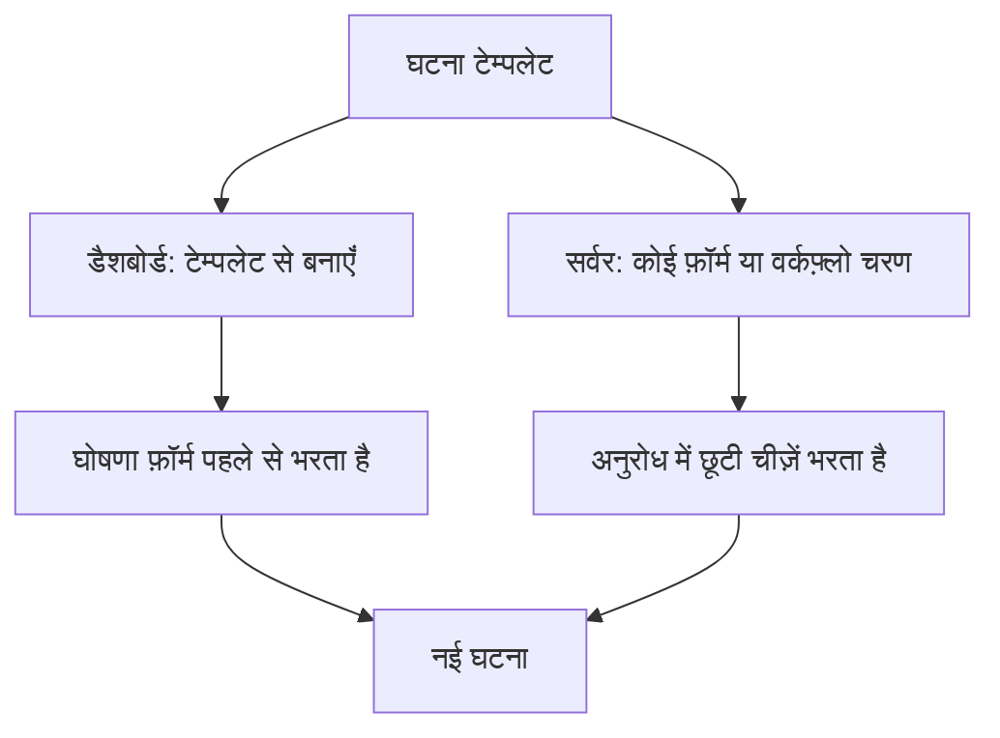
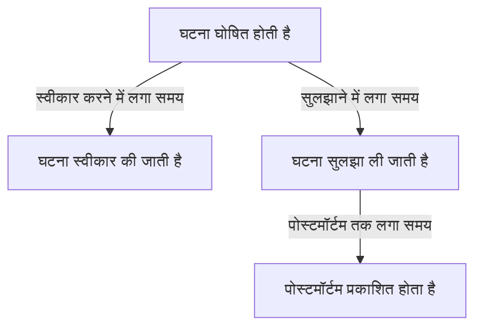
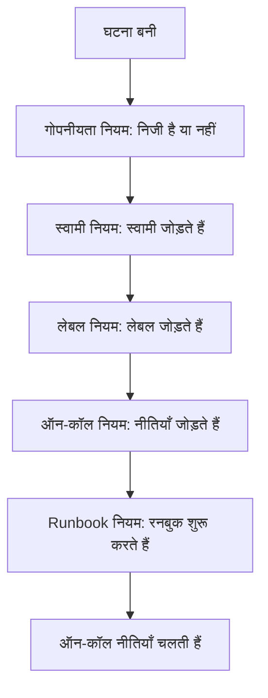

# घटना सेटिंग्स और स्वचालन

घटनाओं का कॉन्फ़िगरेशन **घटनाएं** के अंदर रहता है, **प्रोजेक्ट सेटिंग्स** में नहीं: स्थितियाँ और गंभीरताएँ, टेम्पलेट, कस्टम फ़ील्ड, भूमिकाएँ, माप और संख्या उपसर्ग, और हर नई घटना पर काम करने वाले नियम। यह पेज इनमें से हर पेज का संदर्भ है, और उसका भी जो घटना घोषित होते ही अपने आप चलता है।

:::cards
- [घटना टेम्पलेट](#घटना-टेम्पलेट): एक ही तरह की घटना हर बार पहले से भरी हुई घोषित करें।
- [कस्टम फ़ील्ड](#कस्टम-फ़ील्ड): हर घटना पर आपके अपने फ़ील्ड, घोषित करते समय पूछे जाने वाले।
- [माप](#माप): स्वीकार करने, सुलझाने या शमन में लगा समय, हर घटना के लिए निकाला गया।
- [नियम](#घटना-बनने-पर-चलने-वाले-नियम): स्वामी, लेबल, पेजिंग और एपिसोड, अपने आप सेट।
:::

## घटना सेटिंग्स कहाँ हैं

टॉप बार के **उत्पाद** मेनू से **घटनाएं** खोलें, फिर उसके साइड मेनू में सबसे नीचे **सेटिंग्स** खोलें। **नियम** और **सेटिंग्स** दोनों मुड़े हुए शुरू होते हैं, इसलिए नीचे के पेज दिखने से पहले उन्हें खोलें। यहाँ सब कुछ प्रोजेक्ट-स्तर का है: टेम्पलेट, भूमिकाएँ, कस्टम फ़ील्ड और नियम एक प्रोजेक्ट के होते हैं और उसमें घोषित हर घटना पर लागू होते हैं, `/dashboard/{projectId}/incidents/settings/` से शुरू होने वाले रूट पर।

| पेज                      | वहाँ आप क्या करते हैं                                                                        |
| ------------------------ | -------------------------------------------------------------------------------------------- |
| **घटना स्थिति**          | उन स्थितियों को जोड़ें, नाम बदलें, रंग बदलें और क्रम बदलें जिनसे घटना गुज़रती है।               |
| **घटना गंभीरता**         | गंभीरता के स्तर जोड़ें, नाम बदलें, रंग बदलें और क्रम बदलें।                                     |
| **घटना टेम्पलेट**        | पूरी घटना पहले से भरें — शीर्षक, विवरण, संसाधन, ऑन-कॉल नीतियाँ, स्वामी, लेबल।                  |
| **नोट टेम्पलेट**         | सार्वजनिक और निजी नोटों के लिए दोबारा इस्तेमाल होने वाला टेक्स्ट।                              |
| **पोस्टमॉर्टम टेम्पलेट** | दोबारा इस्तेमाल होने वाले पोस्टमॉर्टम ढाँचे।                                                  |
| **कस्टम फ़ील्ड**          | हर घटना पर दिखने वाले अतिरिक्त फ़ील्ड परिभाषित करें।                                            |
| **घटना भूमिकाएं**        | वे भूमिकाएँ परिभाषित करें जिन पर आप प्रतिक्रिया देने वालों को असाइन करते हैं, जैसे घटना कमांडर। |
| **माप**                  | हर घटना पर गिनें कि चीज़ों में कितना समय लगता है, जैसे स्वीकार करने या सुलझाने में लगा समय।      |
| **लिंक किए गए अलर्ट**    | चुनें कि किसी घटना से लिंक किए गए अलर्ट उसके साथ स्वीकार और सुलझाए जाएँ या नहीं। नए प्रोजेक्ट में दोनों चालू हैं। |
| **संख्या उपसर्ग**        | घटना और एपिसोड संख्याओं के आगे का टेक्स्ट, जैसे `INC-42` में `INC-`।                           |

OneUptime AI अपने आप जो करता है, वह यहाँ सेट नहीं होता: उसका अपना सेक्शन है, **घटनाएं → एआई**, `/dashboard/{projectId}/incidents/ai/` से शुरू होने वाले रूट पर। उसका **सेटिंग्स** पेज नई घटनाओं की जांच करना, उन्हें अपने आप ठीक करना (जब तक आप चालू न करें, बंद), जिसके नीचे सुधार का हिस्सा रहे सुधार और कमी वाली टेलीमेट्री के पुल रिक्वेस्ट आते हैं, और पोस्टमॉर्टम का मसौदा बनाना चालू या बंद करता है, हर एक बदलते ही सहेज जाता है; किन घटनाओं की जांच हो और किन्हें ठीक किया जाए, इसे सीमित करने वाले जांच नियम और स्वचालित सुधार नियम, और AI जिन वैकल्पिक सीमाओं में काम करता है, **और सेटिंग्स** के नीचे मुड़े हुए हैं, और जब तक आप उन्हें सेट न करें, कोई लागू नहीं होता। उसके बगल में **इनसाइट्स** और **लॉग** हैं: AI ने आपकी घटनाओं से क्या सीखा, और उसने जो कुछ किया। [AI SRE](/docs/ai/ai-sre) देखें।

**घटना स्थिति** और **घटना गंभीरता** को [घटना स्थितियाँ और गंभीरता](/docs/incidents/states-and-severities) में विस्तार से बताया गया है — यह पेज आगे **घटना टेम्पलेट** से शुरू होता है। आपकी टीम से बाहर के लोगों को घटनाएँ बताने देने वाले फ़ॉर्म अपना अलग उत्पाद हैं: [फ़ॉर्म का अवलोकन](/docs/forms/index) देखें। अपने आप घटनाएँ खोलने वाले टूल, जैसे [Huntress](/docs/integrations/huntress), **घटनाएं → इंटीग्रेशन** के नीचे सेट होते हैं।

**नियम** खोलें, तो आठ और पेज मिलते हैं: **समूहीकरण नियम**, **ऑन-कॉल नियम**, **स्वामी नियम**, **Runbook नियम**, **गोपनीयता नियम**, **लेबल नियम**, **SLA नियम** और **Reminder Rules**। ये आगे बताए गए हैं।

## घटना टेम्पलेट

घटना टेम्पलेट किसी घटना का सहेजा हुआ ढाँचा है। हर बार पेमेंट क्लस्टर के डगमगाने पर वही शीर्षक, मॉनिटर की वही सूची और वही ऑन-कॉल नीति फिर से टाइप करने के बजाय, आप उसे एक बार सहेजते हैं और उससे घोषित करते हैं।

:::steps
1. **घटनाएं → सेटिंग्स → घटना टेम्पलेट** (`/dashboard/{projectId}/incidents/settings/templates`) पर जाएँ। कार्ड का शीर्षक **घटना टेम्पलेट** है।
2. **घटना टेम्पलेट बनाएँ** पर क्लिक करें। **टेम्पलेट जानकारी** पर टेम्पलेट का नाम रखें, फिर **घटना विवरण** पर वह घटना भरें जिसे वह घोषित करता है: एक **शीर्षक**, एक **घटना गंभीरता** और एक **विवरण**।
3. वैकल्पिक चरणों से **अगला** दबाते हुए गुज़रें — वह किन संसाधनों को प्रभावित करता है, उसके कस्टम फ़ील्ड और उसकी ऑन-कॉल नीतियाँ — और वह भरें जो इस तरह की हर घटना में एक जैसा होता है।
4. आख़िरी चरण पर **घटना टेम्पलेट बनाएँ** पर क्लिक करें। अब से घटनाओं की सूची पर **टेम्पलेट से बनाएँ** यह टेम्पलेट देता है।
:::

टेम्पलेट बनाना आपको चार चरणों वाले विज़ार्ड से ले जाता है, और जब आपके प्रोजेक्ट में घटना कस्टम फ़ील्ड हों तो दो और चरण होते हैं। केवल पहले दो चरण ऐसी चीज़ें पूछते हैं जिनका जवाब देना ज़रूरी है: **अगला** उनके बाद के वैकल्पिक चरणों से गुज़रता है, और **घटना टेम्पलेट बनाएँ** आख़िरी चरण पर है।

- **टेम्पलेट जानकारी** — **टेम्पलेट नाम** और **टेम्पलेट विवरण**। ये टेम्पलेट का ही नाम रखते हैं; ये घटना पर कभी नहीं दिखते।
- **घटना विवरण** — **शीर्षक**, **विवरण** (Markdown) और **घटना गंभीरता**। **और फ़ील्ड** के नीचे, जिसका मुड़ा हुआ हेडर इन तीनों के नाम बताता है और सेट किया गया हर एक दिखाता है:
  - **प्रारंभिक घटना स्थिति** — वह स्थिति जिसमें टेम्पलेट से घोषित घटनाएँ शुरू होती हैं। यह ख़ाली शुरू होती है, घोषणा फ़ॉर्म की तरह, और इसके विकल्प स्थिति के क्रम में सूचीबद्ध होते हैं। ख़ाली छोड़ने पर, जैसा इसका प्लेसहोल्डर कहता है, वे सामान्य शुरुआती स्थिति में शुरू होती हैं: प्रोजेक्ट की बनाई गई स्थिति, जिसमें हर नई घटना शुरू होती है। किसी स्थिति के साथ सहेजा गया टेम्पलेट उसे बनाए रखता है।
  - **मालिक** — टेम्पलेट से घोषित घटनाओं के स्वामी लोग और टीमें। **स्वामी जोड़ें** दोनों की एक ही सूची खोलता है, वही सूची जो किसी घटना के **मालिक** पेज पर होती है; हर चुनाव एक चिप के रूप में दिखता है जिसे आप हटा सकते हैं। मौजूदा टेम्पलेट उन्हें एक **मालिक** कार्ड पर दिखाता है।
  - **लेबल** — वे लेबल जिनके साथ टेम्पलेट से घोषित घटनाएँ शुरू होती हैं।
- **प्रभावित संसाधन** — घोषणा फ़ॉर्म की तरह: **मॉनिटर**, फिर **मॉनिटर स्थिति बदलकर करें**, फिर होस्ट, क्लस्टर और सेवाओं के लिए **अन्य प्रभावित संसाधन**, और **और फ़ील्ड** के नीचे **इन स्थिति पृष्ठों तक सीमित करें**। टेम्पलेट हमेशा **मॉनिटर स्थिति बदलकर करें** पूछता है, मॉनिटर चुने हों या नहीं: यह टेम्पलेट से घटना घोषित करते समय चुने गए मॉनिटर पर भी लागू होता है, जहाँ घोषणा फ़ॉर्म पहला मॉनिटर चुनते ही इसे दिखाता है। मौजूदा टेम्पलेट का **प्रभावित संसाधन** कार्ड भी इसी तरह पूछता है, और टेम्पलेट की चुनी स्थिति दिखाता है, या कोई न चुनी हो तो **मॉनिटर अपनी स्थिति बनाए रखते हैं।**। **इन स्थिति पृष्ठों तक सीमित करें** टेम्पलेट से घोषित घटनाओं को उनके मॉनिटर को सूचीबद्ध करने वाले कुछ स्थिति पृष्ठों तक सीमित करता है — एक `Region East outage` टेम्पलेट पूर्वी साइट के पृष्ठ साथ रख सकता है। मौजूदा टेम्पलेट इसे एक **स्थिति पृष्ठ दायरा** कार्ड पर, **स्थिति पृष्ठ दायरा संपादित करें** के साथ, दिखाता है। [हर ऑडियंस के लिए एक स्थिति पृष्ठ](/docs/status-pages/one-status-page-per-audience) देखें।
- **कस्टम फ़ील्ड** — केवल तब जब आपके प्रोजेक्ट में घटना कस्टम फ़ील्ड हों: वे मान जिनके साथ इस टेम्पलेट से घोषित घटनाएँ शुरू होती हैं। यहाँ हर फ़ील्ड दिया जाता है, केवल वे नहीं जिन्हें **विवरण** चरण पूछता है, और कोई भी आवश्यक नहीं है। मौजूदा टेम्पलेट में इन्हें बदलने के लिए एक **कस्टम फ़ील्ड** कार्ड होता है।
- **बनाते समय कस्टम फ़ील्ड** — यह भी केवल तब जब आपके प्रोजेक्ट में घटना कस्टम फ़ील्ड हों: इस टेम्पलेट से घटना घोषित करते समय **विवरण** चरण उनमें से कौन-से पूछता है, और कौन-से भरने ज़रूरी हैं। मौजूदा टेम्पलेट में इन्हें बदलने के लिए एक **बनाते समय कस्टम फ़ील्ड** कार्ड होता है। [बनाते समय कस्टम फ़ील्ड](#बनाते-समय-कस्टम-फ़ील्ड) देखें।
- **ऑन-कॉल** — **ऑन-कॉल नीति**, वे नीतियाँ जिन्हें इस टेम्पलेट से बनी घटना घोषित होने पर चलाना है।

कुछ आसान नियम:

- टेम्पलेट सूची केवल **नाम** और **विवरण** दिखाती है। सूची में पंक्तियाँ संपादित या हटाई नहीं जा सकतीं — किसी टेम्पलेट को बदलने के लिए उसे खोलें (`/dashboard/{projectId}/incidents/settings/templates/{modelId}`)।
- जो भी टेम्पलेट संपादित कर सकता है, वह उसके विवरण और उसके प्रभावित संसाधन बदल सकता है, **प्रारंभिक घटना स्थिति** और **मॉनिटर स्थिति बदलकर करें** सहित: Project Owners, Project Admins और Project Members, Incident Admins और Incident Members, और **Edit Incident Template** वाली भूमिका।
- टेम्पलेट JSON आयात और निर्यात का समर्थन करते हैं, ताकि आप किसी टेम्पलेट को प्रोजेक्टों के बीच ले जा सकें।
- कोई टेम्पलेट न हो, तो सूची **कोई घटना टेम्पलेट नहीं मिला** कहती है, ठीक उसके नीचे **घटना टेम्पलेट बनाएँ** के साथ।
- कोई टेम्पलेट न होने पर, घटनाओं की सूची पर **टेम्पलेट से बनाएँ** भी एक **No Incident Templates** डायलॉग खोलता है जो बताता है कि टेम्पलेट कहाँ बनाए जाते हैं, और उसका **Create Template** बटन **घटनाएं → सेटिंग्स → घटना टेम्पलेट** खोलता है।

### टेम्पलेट कैसे लागू होता है

दो रास्ते हैं, और दोनों एक ही तरह मिलाते हैं।



- **डैशबोर्ड में** — घटनाओं की सूची पर **टेम्पलेट से बनाएँ** बटन **घटना टेम्पलेट चुनें** पिकर खोलता है, और घोषणा पेज `incidentTemplateId` क्वेरी स्ट्रिंग पैरामीटर से टेम्पलेट पढ़ता है, फिर फ़ॉर्म को टेम्पलेट और उसकी स्वामी टीमों व स्वामी उपयोगकर्ताओं से पहले से भरता है। उसका **विवरण** चरण टेम्पलेट के [बनाते समय कस्टम फ़ील्ड](#बनाते-समय-कस्टम-फ़ील्ड) का पालन करता है। घटना के Slack और Microsoft Teams चैनल बन जाने के बाद स्वामी, बिना सूचना के, घटना के स्वामी बन जाते हैं, ताकि घटना स्वामियों को नए चैनल में बुलाने वाला सूचना नियम उन्हें भी बुलाए।
- **सर्वर पर** — **घटना टेम्पलेट** वाला [फ़ॉर्म](/docs/forms/on-submit#the-incident-template), और **Incident Template** चुने हुए वर्कफ़्लो का **Create One Incident** चरण, सर्वर पर टेम्पलेट से घटना घोषित करते हैं। चरण वर्कफ़्लो के प्रोजेक्ट के Project Admin के रूप में टेम्पलेट पढ़ता है, इसलिए किसी दूसरे प्रोजेक्ट का टेम्पलेट, या हटाया गया टेम्पलेट, अस्वीकार होता है, और जिस प्लान में घटना टेम्पलेट शामिल नहीं हैं, उस पर चरण ज़रूरी प्लान बताते हुए अस्वीकार होता है। डैशबोर्ड की तरह, टेम्पलेट के स्वामी घटना के स्वामी बन जाते हैं। [वर्कफ़्लो घटक](/docs/workflows/components) देखें।

सर्वर पर घोषित घटना टेम्पलेट को `createdIncidentTemplateId` में दर्ज करती है। यह कॉलम केवल OneUptime सेट करता है, किसी टेम्पलेट का नाम बताने वाले फ़ॉर्म या वर्कफ़्लो चरण के लिए: API कुंजी या साइन इन किया हुआ उपयोगकर्ता इसे सेट नहीं कर सकता, और `createdIncidentTemplateId` भेजने वाला अनुरोध अस्वीकार होता है। API से टेम्पलेट के आधार पर घोषित करने के लिए, उसे `/api/incident-templates` से पढ़ें और उसके मान अनुरोध में भेजें।

> [!IMPORTANT]
> ज़रूरी हिस्सा मिलाने का नियम है: **टेम्पलेट केवल वही फ़ील्ड भरता है जिसे आपने undefined छोड़ा**। शीर्षक, विवरण, घटना गंभीरता, प्रारंभिक घटना स्थिति, **मॉनिटर स्थिति बदलकर करें** के पीछे की मॉनिटर स्थिति, मॉनिटर, होस्ट, Kubernetes क्लस्टर, Docker होस्ट, Podman होस्ट, सेवाएँ, ऑन-कॉल नीतियाँ, लेबल और स्थिति पृष्ठ टेम्पलेट से केवल तब कॉपी होते हैं जब कॉल करने वाले ने या फ़ॉर्म ने कुछ नहीं दिया। आपने जो कुछ स्पष्ट रूप से सेट किया, वह हमेशा जीतता है, स्थिति भी: जो घटना अपनी स्थिति बताती है वह उसी में शुरू होती है और बाकी सब फिर भी टेम्पलेट से लेती है, जैसे डैशबोर्ड पर। कस्टम फ़ील्ड मान एक-एक फ़ील्ड करके मिलाए जाते हैं: टेम्पलेट उन फ़ील्ड को भरता है जिनके बिना घटना घोषित हुई, और आपका सेट किया मान — `0`, `false` और `null` सहित — टेम्पलेट के मान पर जीतता है।

### बनाते समय कस्टम फ़ील्ड

घटना घोषित करते समय **विवरण** चरण क्या पूछता है, यह प्रोजेक्ट की सेटिंग्स तय करती हैं: **बनाते समय दिखाएँ** किसी फ़ील्ड को पूछता है, और **बनाते समय आवश्यक** उसे ज़रूरी बनाता है। टेम्पलेट अपने से घोषित घटनाओं के लिए दोनों बदल सकता है। उसका **बनाते समय कस्टम फ़ील्ड** कार्ड — और इसी नाम का विज़ार्ड चरण — हर घटना कस्टम फ़ील्ड को उसके **क्रम** में सूचीबद्ध करता है, हर एक की एक सेटिंग के साथ:

| सेटिंग         | इस टेम्पलेट से घटना घोषित करने पर                                                                                                  |
| -------------- | ---------------------------------------------------------------------------------------------------------------------------------- |
| **डिफ़ॉल्ट**    | फ़ील्ड अपने **बनाते समय दिखाएँ** और **बनाते समय आवश्यक** का पालन करता है। विकल्प बताता है कि कौन-सा, जैसे **डिफ़ॉल्ट (आवश्यक)**।   |
| **आवश्यक**     | **विवरण** चरण फ़ील्ड पूछता है, और उसे भरना ज़रूरी है। हाँ/नहीं फ़ील्ड चालू करना ज़रूरी है।                                          |
| **वैकल्पिक**   | चरण फ़ील्ड पूछता है, और उसे ख़ाली छोड़ा जा सकता है — तब भी जब प्रोजेक्ट उसे आवश्यक मानता है।                                       |
| **छिपा हुआ**   | चरण फ़ील्ड नहीं पूछता, तब भी जब प्रोजेक्ट उसे दिखाता या आवश्यक मानता है। उसके लिए टेम्पलेट का अपना मान फिर भी लागू होता है।          |

कार्ड पर, जिस फ़ील्ड को टेम्पलेट **आवश्यक**, **वैकल्पिक** या **छिपा हुआ** पर सेट करता है, वह अपने प्रकार के नीचे यह भी दिखाता है कि प्रोजेक्ट उसके साथ क्या करता है: **प्रोजेक्ट डिफ़ॉल्ट: आवश्यक**, **प्रोजेक्ट डिफ़ॉल्ट: वैकल्पिक** या **प्रोजेक्ट डिफ़ॉल्ट: नहीं दिखाया जाता**। जो भी टेम्पलेट देख सकता है, वह इसे देखता है।

इसका उपयोग तब करें जब किसी एक टेम्पलेट की घटनाओं को ऐसे जवाब की ज़रूरत हो जो दूसरों को नहीं — जैसे `Customer data exposure` टेम्पलेट पर ग्राहक श्रेणी — या प्रोजेक्ट में हर जगह पूछे जाने वाले किसी सवाल को उस टेम्पलेट से बाहर रखने के लिए जहाँ वह ठीक न बैठे।

- **टेम्पलेट वेरिएबल से की किया गया।** हर सेटिंग फ़ील्ड के **टेम्पलेट वेरिएबल** के नीचे सहेजी जाती है, जो कभी नहीं बदलता, इसलिए फ़ील्ड का नाम बदलने से उसकी सेटिंग बनी रहती है। जो फ़ील्ड हटाया जाए और उसी नाम से फिर बनाया जाए, उसे उसकी सेटिंग वापस मिल जाती है — फ़ॉर्म के सवालों के विपरीत, जो फ़ील्ड को उसकी ID से बताते हैं, इसलिए हटाकर फिर बनाया गया फ़ील्ड तब तक नहीं पूछा जाता जब तक उसे फिर से न जोड़ा जाए।
- **संपादित करें और सहेजें उन्हें नए सिरे से पढ़ते हैं।** कार्ड पर **संपादित करें** फ़ील्ड और टेम्पलेट की सेटिंग्स फिर से पढ़ता है, तब तक डायलॉग में लोडर के साथ, और **सहेजें** उन्हें एक बार और पढ़ता है और केवल वही फ़ील्ड लिखता है जो आपने उसमें बदले। इसलिए इस बीच किसी दूसरे एडमिन का दूसरे फ़ील्ड में किया बदलाव बना रहता है — आपके डायलॉग के खुले रहते बने फ़ील्ड को उन्होंने जो सेटिंग दी, वह भी — और इस बीच हटाए गए फ़ील्ड में आपका बदलाव नहीं लिखा जाता। फिर कार्ड फ़ील्ड को उनकी असली हालत में सूचीबद्ध करता है। अगर आपके **संपादित करें** दबाते समय उन्हें पढ़ा न जा सके, तो डायलॉग कारण बताता है और **सहेजें** के बजाय **फिर से प्रयास करें** देता है; जब आप **सहेजें** दबाते हैं, तो वह कारण बताता है, कुछ नहीं सहेजता और आपके चुनाव बनाए रखता है।
- **केवल डैशबोर्ड इन्हें लागू करता है।** **बनाते समय आवश्यक** की तरह, ये सेटिंग्स **घटना घोषित करें** फ़ॉर्म को आकार देती हैं और कुछ नहीं। API, किसी वर्कफ़्लो, मॉनिटर, Slack, Microsoft Teams या AI से घोषित घटनाएँ इनसे नहीं बँधतीं, और [फ़ॉर्म](/docs/forms/building) अपने सवाल ख़ुद पूछते हैं। [बनाते समय आवश्यक केवल डैशबोर्ड जाँचता है](#बनाते-समय-आवश्यक-केवल-डैशबोर्ड-जाँचता-है) देखें।
- **किसी मॉनिटर कस्टम फ़ील्ड से कॉपी होने वाला फ़ील्ड**, घटना पर मॉनिटर होने के बाद, फिर भी नहीं पूछा जाता, टेम्पलेट चाहे जो कहे।
- **जो भी घटना टेम्पलेट संपादित कर सकता है, वह इन्हें बदल सकता है** — Project Members और Incident Members सहित — उस फ़ील्ड के लिए भी जिसे किसी Project Admin ने पूरे प्रोजेक्ट के लिए **बनाते समय आवश्यक** बनाया है। प्रोजेक्ट-स्तर की सेटिंग्स के लिए ख़ुद Project Owner, Project Admin या **Edit Incident Custom Field** अनुमति चाहिए।
- **ये टेम्पलेट के साथ जाती हैं।** टेम्पलेट के JSON निर्यात में ये शामिल होती हैं, और जिस प्रोजेक्ट में आप उसे आयात करते हैं, वहाँ ये उसी **टेम्पलेट वेरिएबल** वाले फ़ील्ड पर लागू होती हैं।

API में ये टेम्पलेट का `customFieldSettings` हैं: हर फ़ील्ड के **टेम्पलेट वेरिएबल** से की किया गया एक ऑब्जेक्ट, हर फ़ील्ड के लिए `Required`, `Optional`, `Hidden` या `Default` के साथ।

```json title="customFieldSettings"
{
  "customFieldSettings": {
    "impact": "Required",
    "affected_location": "Optional",
    "additional_information": "Hidden"
  }
}
```

जो फ़ील्ड सूचीबद्ध नहीं है, वह `Default` की तरह अपनी सेटिंग्स का पालन करता है। अनुरोध `400` त्रुटि के साथ अस्वीकार होता है जब कोई की वैध **टेम्पलेट वेरिएबल** न हो — छोटे अक्षर, अंक और अंडरस्कोर — या कोई मान इन चारों में से न हो। किसी फ़ील्ड से मेल न खाने वाली की रखी जाती है, और अनदेखी की जाती है।

## नोट टेम्पलेट

नोट टेम्पलेट प्रतिक्रिया देने वालों को घटना अपडेट के लिए तैयार टेक्स्ट देते हैं, ताकि रात 3 बजे का स्थिति पृष्ठ अपडेट कोई आधा सोया व्यक्ति शुरू से न लिखे।

:::steps
1. **घटनाएं → सेटिंग्स → नोट टेम्पलेट** (`/dashboard/{projectId}/incidents/settings/note-templates`) पर जाएँ। कार्ड का शीर्षक **घटनाओं के लिए सार्वजनिक या निजी नोट टेम्पलेट** है — एक ही लाइब्रेरी दोनों तरह के नोट के काम आती है।
2. **घटना नोट टेम्पलेट बनाएँ** पर क्लिक करें और उसका एकमात्र पेज भरें: **टेम्पलेट नाम** और **टेम्पलेट विवरण**, दोनों आवश्यक, फिर **नोट** ख़ुद, Markdown में, आवश्यक: वह टेक्स्ट जिससे टेम्पलेट चुनने पर नोट शुरू होता है।
3. इसे सहेजें। दोनों नोट पेजों पर **टेम्पलेट**, और **घटना स्वीकार करें** व **घटना सुलझाएं** डायलॉग में **नोट टेम्पलेट चुनें** यह टेम्पलेट देते हैं।
:::

घटना टेम्पलेट की तरह, पंक्तियाँ बनाई और देखी जाती हैं, सूची में संपादित नहीं होतीं; टेम्पलेट बदलने के लिए उसे खोलें।

**वेरिएबल।** नोट टेम्पलेट में ऐसे वेरिएबल हो सकते हैं जो टेम्पलेट चुनने पर घटना के मानों से भर जाते हैं, ताकि लेखक पोस्ट करने से पहले तैयार टेक्स्ट देखे — और फिर भी बदल सके:

| वेरिएबल                             | किससे भरा जाता है                                                  |
| ----------------------------------- | ------------------------------------------------------------------ |
| `{{incident.title}}`                | घटना का शीर्षक।                                                    |
| `{{incident.number}}`               | उसकी संख्या, जैसे `INC-42` या `#42`।                               |
| `{{incident.severity}}`             | उसकी गंभीरता।                                                      |
| `{{incident.state}}`                | उसकी वर्तमान स्थिति।                                               |
| `{{incident.startedAt}}`            | वह कब घोषित हुई, लेखक के टाइम ज़ोन में, ज़ोन के नाम के साथ।          |
| `{{incident.labels}}`               | उसके लेबल, अल्पविराम से अलग।                                       |
| `{{incident.affectedStatusPages}}`  | वे स्थिति पृष्ठ जिन पर वह दिखती है और जिन्हें वह सूचित करती है, और जिन्हें लेखक देख सकता है। |
| `{{incident.customFields.<key>}}`   | किसी कस्टम फ़ील्ड का मान, फ़ील्ड के **टेम्पलेट वेरिएबल** से, जिसे **नोट** एडिटर फ़ील्ड के नाम से **टेम्पलेट वेरिएबल** के नीचे सूचीबद्ध करता है। |

कस्टम फ़ील्ड पहले `{{customFields.<key>}}` लिखे जाते थे; जो टेम्पलेट अब भी इसका उपयोग करते हैं, वे भी उसी तरह भरे जाते हैं। जिस वेरिएबल का कोई मान न हो, या जो सूची में न हो, वह ठीक वैसा ही रहता है जैसा लिखा है, ताकि लेखक उसे भरे। मान टेक्स्ट के रूप में रखे जाते हैं: पोस्ट किए गए नोट में घटना का शीर्षक छवि, HTML या अपनी मंज़िल छिपाने वाला लिंक नहीं बन सकता, हालाँकि उसमें दिया गया पता फिर भी उसी पते के लिंक के रूप में दिखता है। **रिच टेक्स्ट (Markdown)** कस्टम फ़ील्ड उसी Markdown के रूप में रखा जाता है जो वह है।

> [!IMPORTANT]
> कस्टम फ़ील्ड, लेबल और स्थिति पृष्ठ वेरिएबल आपकी टीम के अपने रिकॉर्ड से भरते हैं, हर कस्टम फ़ील्ड, चाहे वह **सब्सक्राइबर सूचनाओं में शामिल करें** चिह्नित हो या नहीं, और एक ही लाइब्रेरी सार्वजनिक नोटों के भी काम आती है, जो घटना के स्थिति पृष्ठों पर दिखते हैं और उनके सब्सक्राइबर को ईमेल किए जाते हैं। सार्वजनिक नोट पोस्ट करने से पहले भरा हुआ टेक्स्ट पढ़ें।

**वेरिएबल डालना।** आपको कभी वेरिएबल का नाम टाइप करने की ज़रूरत नहीं। **नोट** एडिटर वेरिएबल तीन तरह से देता है, और हर तरीका वेरिएबल को वहाँ डालता है जहाँ कर्सर है:

- **टेम्पलेट वेरिएबल**, एडिटर के नीचे मुड़ा हुआ: हर वेरिएबल और वह किससे भरता है, यह देखने के लिए इसे खोलें — प्रोजेक्ट के घटना कस्टम फ़ील्ड नाम से — और किसी एक पर क्लिक करें।
- **वेरिएबल डालें**, एडिटर के टूलबार के अंत में: वही सूची, एक सर्च बॉक्स के साथ।
- नोट में `{{` टाइप करने से कर्सर के नीचे सूची खुलती है। उसे छोटा करने के लिए टाइप करते रहें, तीर कुंजियों से चुनें, और वेरिएबल डालने के लिए Enter या Tab दबाएँ; Escape सूची बंद करता है।

वही सूची, बटन और `{{` उन दूसरे टेम्पलेट के साथ भी आते हैं जिनमें वेरिएबल होते हैं: SLA नियम के नोट रिमाइंडर, घटना या अलर्ट समूहीकरण नियम का एपिसोड शीर्षक और विवरण, मॉनिटर नियम का घटना और अलर्ट विवरण और सुधार नोट, SLO बर्न रेट नियम के टेम्पलेट और स्थिति पृष्ठ के कस्टम सब्सक्राइबर सूचना टेम्पलेट।

नोट टेम्पलेट वहीं दिखते हैं जहाँ आपको सच में उनकी ज़रूरत होती है: **घटना स्वीकार करें** और **घटना सुलझाएं** पुष्टि डायलॉग दोनों **सार्वजनिक नोट जोड़ें** के नीचे मुड़े हुए **सार्वजनिक नोट** फ़ील्ड के ऊपर **नोट टेम्पलेट चुनें** देते हैं। सार्वजनिक और निजी नोटों में क्या अंतर है, इसके लिए [घटना नोट्स, स्वामी और फ़ीड](/docs/incidents/notes-owners-and-feed) देखें।

## पोस्टमॉर्टम टेम्पलेट

पोस्टमॉर्टम टेम्पलेट उस लिखित समीक्षा का ढाँचा है जो आप घटना के बाद बनाते हैं — आपकी हेडिंग, आपके संकेत, आपके स्थायी सवाल — ताकि प्रोजेक्ट की हर समीक्षा एक ही ढाँचे का पालन करे।

:::steps
1. **घटनाएं → सेटिंग्स → पोस्टमॉर्टम टेम्पलेट** (`/dashboard/{projectId}/incidents/settings/postmortem-templates`) पर जाएँ। कार्ड का शीर्षक **पोस्टमॉर्टम टेम्पलेट** है।
2. **घटना पोस्टमॉर्टम टेम्पलेट बनाएँ** पर क्लिक करें और उसका एकमात्र पेज भरें: **टेम्पलेट नाम** और **टेम्पलेट विवरण**, दोनों आवश्यक, फिर **पोस्टमॉर्टम टेम्पलेट**, मुख्य टेक्स्ट ख़ुद, Markdown में, आवश्यक।
3. इसे सहेजें। अब हर घटना का **पोस्टमॉर्टम** पेज **टेम्पलेट लागू करें** देता है।
:::

टेम्पलेट घटना से लागू किया जाता है, सेटिंग्स से नहीं। कोई घटना खोलें, उसके साइड मेनू में **पोस्टमॉर्टम** चुनें (`/dashboard/{projectId}/incidents/{incidentId}/postmortem`), और **टेम्पलेट लागू करें** का उपयोग करें। इससे **टेम्पलेट चुनें** ड्रॉपडाउन वाला **पोस्टमॉर्टम टेम्पलेट लागू करें** डायलॉग खुलता है; कोई टेम्पलेट चुनने से उसका मुख्य टेक्स्ट **पोस्टमॉर्टम नोट** एडिटर में आ जाता है, जहाँ आप सहेजने से पहले उसे संपादित करते हैं। घटना एपिसोड का भी वही **पोस्टमॉर्टम** पेज होता है और वे उसी टेम्पलेट लाइब्रेरी से लेते हैं। **टेम्पलेट लागू करें** केवल तब दिखता है जब प्रोजेक्ट में कोई पोस्टमॉर्टम टेम्पलेट हो; केवल एक हो, तो वह पहले से चुना होता है। एडिटर घटना के पोस्टमॉर्टम को उसकी मौजूदा हालत में खोलता है, टेम्पलेट को उसके नोट के रूप में, इसलिए वह स्थिति पृष्ठ पर है या नहीं, कब प्रकाशित हुआ और उसके अटैचमेंट जैसे थे वैसे रहते हैं।

## कस्टम फ़ील्ड

कस्टम फ़ील्ड आपको हर घटना पर अपना मेटाडेटा रखने देते हैं — कोई आंतरिक सेवा का नाम, कोई चेंज टिकट संदर्भ, कोई ग्राहक श्रेणी — और हर बार घटना घोषित करते समय वही सवाल पूछने देते हैं, जैसे उसका असर और उसके कब सुलझने की उम्मीद है।

:::steps
1. **घटनाएं → सेटिंग्स → कस्टम फ़ील्ड** (`/dashboard/{projectId}/incidents/settings/custom-fields`) पर जाएँ। पेज का शीर्षक **घटना कस्टम फ़ील्ड** है और यह फ़ील्ड को उनके **क्रम** में सूचीबद्ध करता है, हर एक केवल अपने **फ़ील्ड नाम** और **फ़ील्ड प्रकार** के साथ।
2. **घटना कस्टम फ़ील्ड बनाएँ** पर क्लिक करें और उसका **फ़ील्ड नाम**, **फ़ील्ड विवरण** और **फ़ील्ड प्रकार** भरें — और, ड्रॉपडाउन प्रकार के लिए, उसके विकल्प, ठीक प्रकार के नीचे।
3. हर बार घटना घोषित करते समय फ़ील्ड पूछने के लिए, **और फ़ील्ड** खोलें और **बनाते समय दिखाएँ** चालू करें, और अगर उसका जवाब देना ज़रूरी हो तो **बनाते समय आवश्यक**।
4. इसे सहेजें, फिर पंक्ति को उसके हैंडल से खींचकर वहाँ ले जाएँ जहाँ फ़ील्ड सूचीबद्ध होना चाहिए। किसी फ़ील्ड की पंक्ति पर **संपादित करें** उसकी बाकी सेटिंग्स खोलता है।
:::

फ़ील्ड बनाना एक ही पेज पर उसका **फ़ील्ड नाम**, **फ़ील्ड विवरण** और **फ़ील्ड प्रकार** पूछता है — और, ड्रॉपडाउन प्रकार के लिए, उसके विकल्प, ठीक प्रकार के नीचे। नए फ़ील्ड के मान टाइप किए जाते हैं। बाकी सब **और फ़ील्ड** के नीचे है, जो फ़ील्ड बनाते या संपादित करते, दोनों समय मुड़ा हुआ शुरू होता है; मुड़ा रहने पर उसका हेडर बताता है कि उसमें क्या है और क्या सेट है। ऐसा फ़ील्ड बनाने के लिए जो अपना मान किसी मॉनिटर कस्टम फ़ील्ड से कॉपी करे, **घटना कस्टम फ़ील्ड बनाएँ** के बगल वाला **अधिक** मेनू (**⋯**) खोलें और **मैप किया गया कस्टम फ़ील्ड बनाएँ** चुनें — [मॉनिटर से कॉपी होने वाले फ़ील्ड](#मॉनिटर-से-कॉपी-होने-वाले-फ़ील्ड) देखें।

हर परिभाषा में होता है:

- **फ़ील्ड नाम** — आवश्यक, कम से कम दो अक्षर। प्लेसहोल्डर `internal-service` जैसा slug जैसा नाम सुझाता है।
- **फ़ील्ड विवरण** — वैकल्पिक।
- **फ़ील्ड प्रकार** — आवश्यक। यह तय करता है कि डेटा कैसे डाला जाता है; प्रकार नीचे सूचीबद्ध हैं। ड्रॉपडाउन प्रकारों के लिए उनके विकल्प भी सूचीबद्ध करने होते हैं।
- **ड्रॉपडाउन विकल्प** — ड्रॉपडाउन में दिखने वाले मान, हर एक एक वैकल्पिक रंग के साथ: विकल्प के बगल का छोटा बटन उसका रंग दिखाता है और वही नाम वाले रंग खोलता है जो हर दूसरे रंग फ़ील्ड में होते हैं, सबसे पहले **कोई रंग नहीं** और सटीक कोड के लिए **कस्टम रंग** के साथ। किसी विकल्प के सूचीबद्ध होने की जगह बदलने के लिए उसे उसकी पंक्ति की शुरुआत के हैंडल से खींचें। घटनाओं में मान आ जाने के बाद भी विकल्प जोड़े, नाम बदले और हटाए जा सकते हैं; [ड्रॉपडाउन के विकल्प बदलना](#ड्रॉपडाउन-के-विकल्प-बदलना) देखें।
- **क्रम** — घटना के कस्टम फ़ील्ड में फ़ील्ड कहाँ दिखता है: घटना के **कस्टम फ़ील्ड** पेज पर, **विवरण** चरण में और सब्सक्राइबर संदेशों में। टाइप करने के लिए कोई संख्या नहीं है: फ़ील्ड को ऊपर या नीचे ले जाने के लिए उसे उसकी पंक्ति की शुरुआत के हैंडल से खींचें, और नया फ़ील्ड अंत में जुड़ता है। जब कोई फ़िल्टर या खोज सूची को छोटा करती है, तब खींचना बंद रहता है।
- **बनाते समय दिखाएँ** — **और फ़ील्ड** के नीचे। डैशबोर्ड से घटना घोषित करते समय **विवरण** चरण में फ़ील्ड पूछता है ([घटना घोषित करना](/docs/incidents/declaring-incidents) देखें)। घटना टेम्पलेट किसी भी फ़ील्ड को शुरुआती मान दे सकता है, चाहे वह बनाते समय दिखाया जाए या नहीं, और अपने से घोषित घटनाओं के लिए किसी फ़ील्ड को पूछ सकता है या छोड़ सकता है — [बनाते समय कस्टम फ़ील्ड](#बनाते-समय-कस्टम-फ़ील्ड) देखें। [फ़ॉर्म](/docs/forms/building#custom-fields) इसका पालन नहीं करते: फ़ॉर्म केवल उसमें जोड़े गए फ़ील्ड पूछता है।
- **बनाते समय आवश्यक** — **और फ़ील्ड** के नीचे, **बनाते समय दिखाएँ** चालू होने पर दिया जाता है। फ़ील्ड भरे जाने तक **विवरण** चरण आपको घटना घोषित नहीं करने देता, और **बूलियन** फ़ील्ड चालू करना ज़रूरी है। यह केवल डैशबोर्ड में जाँचा जाता है; [बनाते समय आवश्यक केवल डैशबोर्ड जाँचता है](#बनाते-समय-आवश्यक-केवल-डैशबोर्ड-जाँचता-है) देखें।
- **सब्सक्राइबर सूचनाओं में शामिल करें** — **और फ़ील्ड** के नीचे। फ़ील्ड और उसका मान घटना के संदेशों के साथ स्थिति पृष्ठ सब्सक्राइबर को भेजता है: डिफ़ॉल्ट ईमेल, Slack और Microsoft Teams संदेश और webhook, लेकिन SMS नहीं। सब्सक्राइबर आमतौर पर आपकी टीम के बाहर होते हैं, इसलिए इसे केवल उन फ़ील्ड के लिए चालू करें जिन्हें साझा करना सुरक्षित है। [सब्सक्राइबर और घोषणाएँ](/docs/status-pages/subscribers#घटनाएँ) देखें।
- **टेम्पलेट वेरिएबल** — वह की जिससे कोई टेम्पलेट फ़ील्ड तक पहुँचता है, `{{incident.customFields.<key>}}`, नोट टेम्पलेट और कस्टम सब्सक्राइबर सूचना टेम्पलेट में। यह फ़ील्ड बनते समय उसके नाम से बनती है — छोटे अक्षर, अंक और अंडरस्कोर, इसलिए `Expected Resolution` बन जाता है `expected_resolution`, और जब किसी दूसरे फ़ील्ड के पास पहले से वह की हो तो `_2`, `_3` आदि जोड़े जाते हैं — और फ़ील्ड का नाम बदलने पर यह नहीं बदलती। इसे कोई हाथ से सेट नहीं करता: API इसके लिए भेजा गया मान अनदेखा करता है। पुराने `{{customFields.<key>}}` से लिखे टेम्पलेट काम करते रहते हैं। आपको इसे कभी देखने की ज़रूरत नहीं: इसे डालने वाले एडिटर — नोट टेम्पलेट का **नोट** और घटना इवेंट के लिए स्थिति पृष्ठ के कस्टम सब्सक्राइबर सूचना टेम्पलेट — हर फ़ील्ड का वेरिएबल **टेम्पलेट वेरिएबल** के नीचे, फ़ील्ड के नाम से, सूचीबद्ध करते हैं। फ़ील्ड का **संपादित करें** फ़ॉर्म भी इसे **और फ़ील्ड** के सबसे नीचे, केवल पढ़ने के लिए, कॉपी करने वाले बटन के साथ दिखाता है।

**क्रम**, **बनाते समय दिखाएँ**, **बनाते समय आवश्यक**, **सब्सक्राइबर सूचनाओं में शामिल करें** और **टेम्पलेट वेरिएबल** केवल घटना कस्टम फ़ील्ड पर होते हैं। मॉनिटर, अलर्ट, निर्धारित रखरखाव इवेंट और दूसरे संसाधनों के कस्टम फ़ील्ड में ये नहीं होते।

परिभाषाएँ अपने मॉडल में रहती हैं; मान घटना पर ही `customFields` कॉलम में रहते हैं। किसी एक घटना पर आप इन्हें घटना के साइड मेनू में **कस्टम फ़ील्ड** (`/dashboard/{projectId}/incidents/{incidentId}/custom-fields`) से भरते हैं, जहाँ फ़ील्ड उनके **क्रम** में सूचीबद्ध होते हैं। घटना टेम्पलेट उन्हीं फ़ील्ड के मान अपने `customFields` में रखते हैं।

**एक कमी जो जानने लायक है।** घटना कस्टम फ़ील्ड परिभाषाएँ घटना परिवार का अकेला हिस्सा हैं जिनका कोई वर्कफ़्लो ट्रिगर नहीं है — नीचे वर्कफ़्लो वाला सेक्शन देखें।

### फ़ील्ड प्रकार

| फ़ील्ड प्रकार                 | कैसे डाला जाता है                                    | किसके लिए अच्छा                                    |
| ---------------------------- | ---------------------------------------------------- | -------------------------------------------------- |
| **टेक्स्ट**                   | टेक्स्ट की एक पंक्ति                                  | चेंज टिकट संदर्भ, आंतरिक सेवा का नाम               |
| **संख्या**                   | एक संख्या                                            | मिनटों में अनुमानित अवधि, प्रभावित उपयोगकर्ता       |
| **बूलियन**                   | हाँ/नहीं स्विच                                       | एक पुष्टि, "ग्राहक के सामने"                       |
| **ड्रॉपडाउन (एकल चयन)**      | सूची से एक विकल्प                                    | असर, क्षेत्र                                       |
| **ड्रॉपडाउन (बहु-चयन)**      | सूची से कई विकल्प                                    | प्रभावित सिस्टम                                    |
| **तारीख**                    | एक तारीख                                             | अनुबंध नवीनीकरण की तारीख                           |
| **तारीख और समय**             | एक तारीख और दिन का एक समय                            | अपेक्षित समाधान                                    |
| **लंबा टेक्स्ट**              | सादे टेक्स्ट की कई पंक्तियाँ                           | प्रभावित उपयोगकर्ता या सिस्टम, अतिरिक्त जानकारी     |
| **रिच टेक्स्ट (Markdown)**    | फ़ॉर्मेट किया टेक्स्ट, Markdown एडिटर में उसके विज़ुअल मोड के साथ | लिंक और सूचियों वाला कोई अस्थायी उपाय |

**लंबा टेक्स्ट** और **रिच टेक्स्ट (Markdown)** हर संसाधन के कस्टम फ़ील्ड के लिए उपलब्ध हैं, केवल घटनाओं के लिए नहीं। रिच टेक्स्ट मान उसी Markdown के रूप में सहेजा जाता है जिसमें वह लिखा गया। रेडियो बटन या चेकबॉक्स समूह वाला कोई प्रकार नहीं है: **ड्रॉपडाउन (एकल चयन)**, **ड्रॉपडाउन (बहु-चयन)** या **बूलियन** का उपयोग करें।

### बनाते समय आवश्यक केवल डैशबोर्ड जाँचता है

**बनाते समय आवश्यक** केवल **घटना घोषित करें** फ़ॉर्म को रोकता है, और कुछ नहीं। मॉनिटर, API, Slack, Microsoft Teams या AI से खुलने वाली घटनाएँ फ़ॉर्म नहीं भर सकतीं, इसलिए वे फ़ील्ड ख़ाली रखकर बनती हैं। घटना बन जाने के बाद उसके **कस्टम फ़ील्ड** पेज पर हर फ़ील्ड वैकल्पिक रहता है, ताकि आउटेज के बीच एक मान ठीक करने वाले प्रतिक्रिया देने वाले से कभी बाकी सब न माँगे जाएँ। इसे घटनाएँ घोषित करने वालों के लिए एक संकेत मानें, यह वादा नहीं कि हर घटना में मान होगा।

टेम्पलेट के [बनाते समय कस्टम फ़ील्ड](#बनाते-समय-कस्टम-फ़ील्ड) भी ऐसे ही हैं: वे **घटना घोषित करें** फ़ॉर्म को आकार देते हैं और कुछ नहीं। [फ़ॉर्म](/docs/forms/building#required-questions) अपवाद हैं, क्योंकि फ़ॉर्म सबमिट होने पर सर्वर उसके **आवश्यक** सवाल जाँचता है।

### मॉनिटर से कॉपी होने वाले फ़ील्ड

कोई कस्टम फ़ील्ड अपना मान टाइप करवाने के बजाय घटना के मॉनिटर के किसी कस्टम फ़ील्ड से ले सकता है — जैसे कोई क्षेत्र या ग्राहक श्रेणी जो आपके मॉनिटर पहले से दर्ज करते हैं। ऐसा फ़ील्ड बनाने के लिए, **घटना कस्टम फ़ील्ड बनाएँ** के बगल वाला **अधिक** मेनू (**⋯**) खोलें और **मैप किया गया कस्टम फ़ील्ड बनाएँ** चुनें। यह तीन चीज़ें पूछता है:

- **मॉनिटर फ़ील्ड** — कॉपी किया जाने वाला मॉनिटर कस्टम फ़ील्ड। हर एक दिया जाता है, हर एक अपने नाम के नीचे अपने प्रकार के साथ। नए फ़ील्ड को वही प्रकार, और ड्रॉपडाउन के विकल्प, मिलते हैं, इसलिए दोनों हमेशा मेल खाते हैं।
- **फ़ील्ड नाम** — मॉनिटर फ़ील्ड के नाम से शुरू होता है, जब तक आप कोई दूसरा टाइप न करें।
- **फ़ील्ड विवरण** — वैकल्पिक।

मान तब भरा जाता है जब घटना किसी मॉनिटर के साथ बनती है, और मॉनिटर का मान बदलने पर अपडेट रहता है। जब घटना के मॉनिटर अलग-अलग मान रखते हैं, तो एक मान वाला फ़ील्ड जैसा है वैसा छोड़ दिया जाता है और बहु-चयन फ़ील्ड को सभी मिलते हैं। कॉपी करना कभी कोई मान साफ़ नहीं करता: बिना मॉनिटर वाली घटना उस पर टाइप किया जो भी है रखती है, और मॉनिटर का मान साफ़ करने से कॉपियाँ नहीं छेड़ी जातीं। घटना पर मॉनिटर होने के बाद **विवरण** चरण कॉपी होने वाला फ़ील्ड नहीं पूछता।

किसी मौजूदा फ़ील्ड का मान मॉनिटर से कॉपी करने, वह कौन-सा मॉनिटर फ़ील्ड कॉपी करे यह बदलने, या फिर से टाइप करने पर लौटने के लिए, फ़ील्ड की पंक्ति पर **संपादित करें** खोलें और **और फ़ील्ड** के नीचे **मान यहाँ से लें** का उपयोग करें। अलर्ट और निर्धारित रखरखाव के कस्टम फ़ील्ड भी अपने मॉनिटर से इसी तरह कॉपी कर सकते हैं।

### API से कस्टम फ़ील्ड मान

`POST /api/incident` पर और घटना के अपडेट पर, `customFields` हर फ़ील्ड के **फ़ील्ड नाम** से की किया गया एक ऑब्जेक्ट है:

```json title="customFields"
{
  "customFields": {
    "Impact": "Major",
    "Estimated Duration": 90,
    "Acknowledgement": true,
    "Expected Resolution": "2026-10-01T14:30:00.000Z"
  }
}
```

जब कोई उपयोगकर्ता या API कुंजी घटना बनाती या अपडेट करती है, तो अनुरोध जो भी मान सेट करता या बदलता है, उसे अपने फ़ील्ड में फ़िट होना चाहिए, वरना अनुरोध फ़ील्ड और भेजे गए मान का नाम बताने वाली `400` त्रुटि के साथ अस्वीकार होता है:

| फ़ील्ड प्रकार                                         | क्या स्वीकार करता है                                         |
| ---------------------------------------------------- | ------------------------------------------------------------ |
| **टेक्स्ट**, **लंबा टेक्स्ट**, **रिच टेक्स्ट (Markdown)** | टेक्स्ट। संख्या, `true` या `false` जैसे भेजे गए वैसे सहेजे जाते हैं। |
| **संख्या**                                           | एक संख्या, या ऐसा टेक्स्ट जो संख्या हो, जैसे `"42"`।          |
| **बूलियन**                                           | `true` या `false`, या टेक्स्ट `"true"` या `"false"`।         |
| **तारीख**, **तारीख और समय**                          | एक तारीख, बेहतर हो ISO 8601 टेक्स्ट के रूप में।               |
| **ड्रॉपडाउन (एकल चयन)**                              | उसका एक विकल्प।                                              |
| **ड्रॉपडाउन (बहु-चयन)**                              | उसके विकल्पों की एक सूची, या अकेला एक विकल्प।                 |

**ड्रॉपडाउन (बहु-चयन)** के लिए, अस्वीकृति उसके विकल्पों में न आने वाली पहली 10 प्रविष्टियों के नाम बताती है, और फिर कितनी और हैं।

जो नहीं जाँचा जाता, ताकि मौजूदा इंटीग्रेशन काम करते रहें:

- **अनुरोध जिन मानों को वैसा ही छोड़ता है।** जब आप उनमें से एक को सहेजते हैं, तो **कस्टम फ़ील्ड** कार्ड हर मान वापस भेजता है, इसलिए इन जाँचों से पहले सहेजा गया मान, या बाद में हटाया गया ड्रॉपडाउन विकल्प, आपको बाकी सहेजने से कभी नहीं रोकता। बहु-चयन फ़ील्ड पहले वाली प्रविष्टियाँ बनाए रखता है।
- **ऐसी की जो किसी घटना कस्टम फ़ील्ड का नाम नहीं हैं**, जैसे वह `jiraIssueKey` जो [Jira इंटीग्रेशन](/docs/integrations/jira) लिखता है।
- **ख़ाली मान।** `null` या ख़ाली स्ट्रिंग फ़ील्ड को साफ़ करता है।
- **किसी मॉनिटर कस्टम फ़ील्ड से कॉपी हुए मान**, और OneUptime ख़ुद जो लिखता है।
- **बनाते समय आवश्यक।** API कभी कोई फ़ील्ड नहीं माँगता।

कोई फ़ॉर्म या वर्कफ़्लो का **Create One Incident** चरण किसी टेम्पलेट से जो घटना घोषित करता है (`createdIncidentTemplateId`), वह टेम्पलेट के कस्टम फ़ील्ड मानों से शुरू होती है, जो एक-एक फ़ील्ड करके उसके भेजे मानों के नीचे मिलाए जाते हैं ([टेम्पलेट कैसे लागू होता है](#टेम्पलेट-कैसे-लागू-होता-है) देखें)। API कुंजी टेम्पलेट से घोषित नहीं कर सकती: `createdIncidentTemplateId` भेजने वाला अनुरोध अस्वीकार होता है।

### फ़ील्ड का नाम बदलना

मान फ़ील्ड के नाम के नीचे सहेजे जाते हैं, इसलिए फ़ील्ड का नाम बदलने पर उन्हें ले जाना पड़ता है। जब आप नया **फ़ील्ड नाम** सहेजते हैं, तो OneUptime प्रोजेक्ट की हर घटना और हर घटना टेम्पलेट पर फ़ील्ड का मान नए नाम पर ले जाता है, और घटनाओं की सूची के उन सहेजे गए व्यू को अपडेट करता है जो फ़ील्ड दिखाते हैं या उससे फ़िल्टर करते हैं। यह ले जाना कोई **On Update Incident** वर्कफ़्लो शुरू नहीं करता, और किसी घटना का आख़िरी अपडेट का समय नहीं बदलता। फ़ील्ड का **टेम्पलेट वेरिएबल** जैसा था वैसा रहता है, इसलिए उसका उपयोग करने वाले नोट टेम्पलेट, कस्टम सब्सक्राइबर सूचना टेम्पलेट और webhook इंटीग्रेशन काम करते रहते हैं।

दो नाम बदलाव अस्वीकार होते हैं: ऐसे नाम पर जो किसी दूसरे घटना कस्टम फ़ील्ड के पास पहले से है (अक्षरों के छोटे-बड़े होने का ध्यान रखे बिना तुलना की जाती है), और ऐसा API अनुरोध जो एक साथ कई फ़ील्ड के नाम बदले। फ़ील्ड के पुराने नाम से मान पढ़ने या लिखने वाले वर्कफ़्लो और API क्लाइंट को नए नाम पर बदलना होगा।

नाम बदलने के बाद फ़ील्ड में केवल उसके अपने मान रहते हैं। फ़ील्ड हटाने से उसके मान उन घटनाओं पर बने रहते हैं जिनमें वे थे, इसलिए घटनाओं में नए नाम के नीचे किसी हटाए गए फ़ील्ड के मान अब भी हो सकते हैं; नाम बदलना उन्हें इस फ़ील्ड के जवाब के रूप में दिखाने या सब्सक्राइबर को भेजने के बजाय साफ़ कर देता है। हर घटना और टेम्पलेट एक साथ बदलते हैं: अगर ले जाना विफल होता है, तो उनमें से कोई नहीं बदलता, फ़ील्ड अपना पुराना नाम रखता है और सहेजना एक त्रुटि बताता है, ताकि आप बस फिर से कोशिश कर सकें। किसी हटाए गए फ़ील्ड के नाम से **बनाया गया** फ़ील्ड अलग है: वह उस फ़ील्ड के छोड़े मान दिखाता है, और **सब्सक्राइबर सूचनाओं में शामिल करें** चालू होने पर उन्हें सब्सक्राइबर को भेजता है।

फ़ील्ड हटाने से उसे पूछने वाले सवाल प्रोजेक्ट के हर [फ़ॉर्म](/docs/forms/building#custom-fields) पर बने रहते हैं, लेकिन वे अब पूछे नहीं जाते: फ़ॉर्म बिल्डर हर एक को आपके हटाने के लिए चिह्नित करता है। उसी नाम से फिर बनाया गया फ़ील्ड एक नया फ़ील्ड है, और जब तक कोई उसे फ़ॉर्म में न जोड़े, फ़ॉर्म पर नहीं पूछा जाता। घटना टेम्पलेट उसके लिए अपनी **बनाते समय कस्टम फ़ील्ड** सेटिंग बनाए रखते हैं।

### ड्रॉपडाउन के विकल्प बदलना

**ड्रॉपडाउन (एकल चयन)** या **ड्रॉपडाउन (बहु-चयन)** फ़ील्ड के विकल्प कभी भी बदले जा सकते हैं: फ़ील्ड की पंक्ति पर **संपादित करें** खोलें। घटना उसे दिए गए विकल्प का टेक्स्ट सहेजती है, इसलिए किसी बदलाव का उन घटनाओं पर क्या असर होता है जिनमें कोई विकल्प है, यह बदलाव पर निर्भर करता है:

| आप किसी विकल्प के साथ क्या करते हैं | उन घटनाओं का क्या होता है जिनमें वह है                                                                             |
| ----------------------------------- | ------------------------------------------------------------------------------------------------------------------ |
| एक **जोड़ते** हैं                    | कुछ नहीं। अब से वह दिया जाता है।                                                                                   |
| उसका **नाम बदलते** हैं (टेक्स्ट बदलते हैं) | वे नया नाम दिखाती हैं। विकल्प के नीचे फ़ॉर्म बताता है कि कितनी घटनाएँ ऐसा करेंगी।                             |
| उसे **हटाते** हैं (बगल का कूड़ेदान)  | वे उसे रखती हैं, _अब विकल्प नहीं_ के रूप में दिखाया जाता है, जब तक आप **अब विकल्प नहीं** के नीचे उनके लिए कोई दूसरा विकल्प न चुनें। |
| उसे उसके हैंडल से **खींचते** हैं     | कुछ नहीं। केवल विकल्पों के सूचीबद्ध होने का क्रम बदलता है।                                                         |

फ़ॉर्म खुलते समय गिनता है कि हर मान कितनी घटनाओं में है। **अब विकल्प नहीं** हर उस हटाए गए विकल्प को सूचीबद्ध करता है जो किसी घटना में अब भी है, और घटनाओं में मौजूद हर उस मान को जो कभी विकल्प था ही नहीं (जैसे API से लिखा गया), हर एक इस संख्या के साथ कि कितनी घटनाओं में वह है। हर एक के लिए, उसे वैसा ही रहने दें या वह विकल्प चुनें जो उन घटनाओं में इसके बजाय होना चाहिए। **पूर्ववत करें** ग़लती से हटाया गया विकल्प वापस लाता है।

सहेजने पर, नाम बदला गया विकल्प और वह मान जिसके लिए आपने विकल्प चुना, ले जाए जाते हैं: प्रोजेक्ट की हर घटना और घटना टेम्पलेट पर, उससे फ़िल्टर करने वाले घटनाओं की सूची के सहेजे गए व्यू में, और उन जवाबों में जो [फ़ॉर्म टेम्पलेट](/docs/forms/building) फ़ील्ड के लिए देते हैं। नाम बदले गए फ़ील्ड की तरह, यह ले जाना कोई **On Update Incident** वर्कफ़्लो शुरू नहीं करता और किसी घटना का आख़िरी अपडेट का समय नहीं बदलता; विफल होने पर कुछ नहीं ले जाया जाता और फ़ील्ड अपने पुराने विकल्प रखता है। पुराने टेक्स्ट से विकल्प लिखने वाले वर्कफ़्लो, API क्लाइंट और Terraform कॉन्फ़िगरेशन को नया टेक्स्ट चाहिए।

जिस घटना का मान उसका फ़ील्ड अब नहीं देता, वह अपने **कस्टम फ़ील्ड** पेज पर और घटनाओं की सूची में वह मान, _अब विकल्प नहीं_ चिह्नित, दिखाती है। उसके दूसरे फ़ील्ड संपादित करने से वह बना रहता है; उसे बदलने के लिए कोई दूसरा विकल्प चुनें।

हर दूसरे संसाधन के कस्टम फ़ील्ड भी इसी तरह काम करते हैं: मॉनिटर, अलर्ट, निर्धारित रखरखाव इवेंट, स्थिति पृष्ठ, ऑन-कॉल नीतियाँ, टीमें, टीम सदस्य और इन्वेंटरी आइटम। किसी मॉनिटर फ़ील्ड के विकल्प का नाम बदलना, या एक जोड़ना, उसे कॉपी करने वाले घटना, अलर्ट और निर्धारित रखरखाव फ़ील्ड में भी यही करता है ([मॉनिटर से कॉपी होने वाले फ़ील्ड](#मॉनिटर-से-कॉपी-होने-वाले-फ़ील्ड) देखें), ताकि वे कॉपी किया हर मान देते रहें।

API में, नई सूची `dropdownOptions` के रूप में, और नाम बदलाव `miscDataProps` में भेजें:

```json
{
  "data": { "dropdownOptions": "Facility Alpha\nFacility B" },
  "miscDataProps": {
    "renamedDropdownOptions": [{ "from": "Facility A", "to": "Facility Alpha" }]
  }
}
```

हर `to` फ़ील्ड सहेजे जाने के बाद उसके विकल्पों में से एक होना चाहिए, और हर `from` का नाम केवल एक बार बदला जा सकता है। `renamedDropdownOptions` के बिना सूची बदलती है और हर सहेजा गया मान वैसा ही रहता है, Terraform में `dropdown_options` बदलने पर भी यही होता है।

### Terraform

सेटिंग्स `oneuptime_incident_custom_field` संसाधन पर `sort_order`, `show_on_create`, `is_required_on_create` और `include_in_subscriber_notifications` के रूप में हैं। `variable_key` केवल पढ़ने के लिए है: वह की जो फ़ील्ड बनते समय OneUptime ने बनाई।

`sort_order` छोड़ दें, तो नया फ़ील्ड सूची के अंत में जाता है। उसे वह संख्या दें जो किसी दूसरे फ़ील्ड के पास पहले से है, तो वह उस जगह को ले लेता है, जबकि रास्ते के फ़ील्ड एक जगह आगे खिसक जाते हैं। जो संख्या किसी दूसरे फ़ील्ड के पास नहीं है, वह जैसी लिखी वैसी रखी जाती है।

## माप

माप किसी घटना के दो पलों के बीच का समय है। **स्वीकार करने में लगा समय** घटना घोषित होने से किसी के उसे स्वीकार करने तक का समय है; **सुलझाने में लगा समय** घोषित होने से सुलझने तक चलता है। आप माप एक बार सेट करते हैं, और OneUptime उसे हर घटना के लिए, पिछली घटनाओं सहित, निकालता है और उसका चार्ट बनाता है, ताकि आप देख सकें कि आपकी टीम तेज़ हो रही है या नहीं।

**घटनाएं → सेटिंग्स → माप** (`/dashboard/{projectId}/incidents/settings/measurements`) पर जाएँ और **Incident Measurement बनाएँ** चुनें। हर परिभाषा में एक **नाम**, एक **शुरुआती बिंदु** और एक **अंतिम बिंदु** होता है। इसकी स्थायी **कुंजी** आपके टाइप करते समय नाम से बनती है — "Time to Detect" को `time-to-detect` मिलता है — इसलिए भरने को कुछ नहीं है। अपनी कुंजी चुनने के लिए, माप बनाने से पहले उसके बगल में **संपादित करें** चुनें।



अलर्ट और निर्धारित रखरखाव इवेंट में भी यही सुविधा है, **अलर्ट → सेटिंग्स → माप** और **अनुसूचित रखरखाव → सेटिंग्स → माप** पर। नीचे का सब कुछ तीनों पर लागू होता है, हर एक के अपने पलों के साथ।

### तैयार माप

फ़ॉर्म **आप क्या मापना चाहते हैं?** पर खुलता है। इनमें से कोई चुनें और उसका नाम, विवरण और दोनों पल भर जाते हैं: **अगला** पल दिखाता है, और माप उसी आख़िरी चरण से बनता है।

| कहाँ                  | माप                                   | कब शुरू होता है                       | कब ख़त्म होता है                  |
| --------------------- | ------------------------------------- | ------------------------------------- | --------------------------------- |
| घटनाएँ                | **स्वीकार करने में लगा समय**          | घटना घोषित होती है                     | घटना स्वीकार की जाती है            |
| घटनाएँ                | **सुलझाने में लगा समय**               | घटना घोषित होती है                     | घटना सुलझा ली जाती है              |
| घटनाएँ                | **पोस्टमॉर्टम तक लगा समय**            | घटना सुलझा ली जाती है                  | पोस्टमॉर्टम प्रकाशित होता है        |
| अलर्ट                 | **स्वीकार करने में लगा समय**          | अलर्ट बनाया जाता है                    | अलर्ट स्वीकार किया जाता है          |
| अलर्ट                 | **सुलझाने में लगा समय**               | अलर्ट बनाया जाता है                    | अलर्ट सुलझा लिया जाता है            |
| निर्धारित रखरखाव      | **शुरुआत में देरी**                   | रखरखाव का निर्धारित शुरुआती समय       | रखरखाव शुरू होता है                |
| निर्धारित रखरखाव      | **समय से ज़्यादा**                    | रखरखाव का निर्धारित अंतिम समय         | रखरखाव ख़त्म होता है               |
| निर्धारित रखरखाव      | **रखरखाव की अवधि**                    | रखरखाव शुरू होता है                    | रखरखाव ख़त्म होता है               |

दोनों पल ख़ुद चुनने के लिए **कुछ और** चुनें। इनमें से कोई चुनने पर आपका टाइप किया नाम बना रहता है।

### दो पल चुनना

दूसरे चरण, **शुरुआत और अंत**, में **कब शुरू होता है** और **कब ख़त्म होता है** हैं। हर एक उन पलों को सादे शब्दों में सूचीबद्ध करता है जिन पर कोई माप शुरू या ख़त्म हो सकता है। नया माप घटना घोषित होने पर शुरू होता है, इसलिए ज़्यादातर समय आप केवल यह चुनते हैं कि वह कहाँ ख़त्म हो।

| पल                                      | यह कब होता है                                                                | API में किस रूप में सहेजा जाता है                     |
| --------------------------------------- | ---------------------------------------------------------------------------- | ----------------------------------------------------- |
| **घटना घोषित होती है**                  | जब घटना OneUptime में शुरू हुई: जब वह बनाई गई, जब तक किसी ने पहले का समय सेट न किया हो। | `Declared At` (`Timeline Start` वही पल है)  |
| **घटना स्वीकार की जाती है**             | जब वह आपकी स्वीकार की गई स्थिति, या उसके बाद की किसी भी स्थिति में पहुँचती है (शुरुआत से सीधे सुलझाना भी गिना जाता है)। | `State Role Entered`, भूमिका `Acknowledged`             |
| **घटना सुलझा ली जाती है**               | जब वह आपकी सुलझी हुई स्थिति में पहुँचती है।                                   | `State Role Entered`, भूमिका `Resolved`                 |
| **पोस्टमॉर्टम प्रकाशित होता है**         | जब घटना का पोस्टमॉर्टम प्रकाशित होता है।                                      | `Postmortem Posted At`                                |
| **घटना आपकी चुनी हुई स्थिति में जाती है** | आपकी घटना स्थितियों में से कोई भी। फिर फ़ॉर्म पूछता है कि कौन-सी।             | `State Entered`, स्थिति के साथ                       |
| **असर शुरू होता है**                    | जब ग्राहक पहली बार प्रभावित हुए — नीचे देखें।                                 | `Impact Started At`                                   |
| **घटना अपनी पहली स्थिति में जाती है**    | जब वह उस स्थिति में पहुँचती है जिसमें नई घटनाएँ शुरू होती हैं, जैसे Identified। | `State Role Entered`, भूमिका `Created`                  |
| **OneUptime में घटना बनाई जाती है**      | आमतौर पर वही पल जब वह घोषित होती है।                                          | `Created At`                                          |

अलर्ट **अलर्ट बनाया जाता है** से शुरू होते हैं और उनमें पोस्टमॉर्टम नहीं होता; निर्धारित रखरखाव **रखरखाव शुरू होता है**, **रखरखाव ख़त्म होता है** और **रखरखाव पूरा होता है** के बगल में योजनाबद्ध समय-सीमा, **रखरखाव का निर्धारित शुरुआती समय** और **रखरखाव का निर्धारित अंतिम समय**, जोड़ता है।

**स्वीकार** या **सुलझी हुई** स्थिति तक पहुँचना उस स्थिति का पालन करता है जो वह भूमिका निभाती है, इसलिए आप स्थिति का नाम बदलें या उसे बदल दें, तब भी यह काम करता रहता है। **आपकी चुनी हुई स्थिति** उसी एक स्थिति से बँधी रहती है।

### और फ़ील्ड

कुछ विकल्प जिन्हें ज़्यादातर माप कभी नहीं बदलते, **शुरुआत और अंत** चरण के अंत में **और फ़ील्ड** के नीचे मुड़े हुए हैं, उन्हीं डिफ़ॉल्ट पर सेट जिनका API भी उपयोग करता है। मुड़ा रहने पर उसका हेडर उनके नाम बताता है और बदले गए विकल्प दिखाता है।

- **अगर शुरुआत एक से ज़्यादा बार हो** और **अगर अंत एक से ज़्यादा बार हो** किसी स्थिति तक पहुँचने वाले पल के लिए दिखते हैं। फिर से खोली गई घटना उसी स्थिति तक फिर पहुँच सकती है। **पहली बार को लें** डिफ़ॉल्ट है और अंतर्निर्मित घटना समयों से मेल खाता है; **आख़िरी बार को लें** फिर से खोली गई घटना का उसके आख़िरी दौर तक पीछा करता है।
- **अवधि इसमें दिखाएँ** वह इकाई है जिसका माप के चार्ट उपयोग करते हैं। **स्वचालित** डिफ़ॉल्ट है: यह सेकंड में चार्ट बनाता है, जिन्हें चार्ट संख्याएँ बढ़ने के साथ सेकंड, मिनट, घंटे या दिन के रूप में दिखाते हैं। **मिनट**, **घंटे** या **दिन** चार्ट को एक ही इकाई में रखते हैं। हर बिंदु आपकी चुनी इकाई में लिखा जाता है, और इसे बदलने से माप के बिंदु नई इकाई में फिर से लिखे जाते हैं।
- **चार्ट सारांश** यह है कि **चार्ट देखें** कई घटनाओं को कैसे समेटता है: डिफ़ॉल्ट रूप से **औसत**, या **माध्यिका**, 90वाँ, 95वाँ या 99वाँ प्रतिशतक, **सबसे लंबी** या **सबसे छोटी**।
- **घटना पेजों पर दिखाएँ** माप को हर घटना के पेज पर **माप** कार्ड में रखता है (नीचे देखें)। यह डिफ़ॉल्ट रूप से चालू है; जिस माप का आप केवल चार्ट चाहते हैं, उसके लिए इसे बंद करें। अलर्ट और निर्धारित रखरखाव इसे **अलर्ट पेजों पर दिखाएँ** और **रखरखाव इवेंट पेजों पर दिखाएँ** कहते हैं।

माप संपादित करने पर एक **सक्षम** स्विच जुड़ता है: घटनाओं को मापना रोकने के लिए इसे बंद करें। पहले से दर्ज संख्याएँ बनी रहती हैं।

### माप क्या बताता है

| स्थिति             | मतलब                                                                                      |
| ------------------ | ----------------------------------------------------------------------------------------- |
| **Recorded**       | दोनों पल हो चुके हैं। अवधि घटना पर है और चार्ट में है।                                      |
| **लंबित**          | कोई पल अभी नहीं हुआ, लेकिन अब भी हो सकता है — घटना अब भी खुली है।                          |
| **Not Applicable** | कोई पल कभी नहीं हो सकता — स्थिति छोड़ दी गई, या समय कभी दर्ज नहीं हुआ।                     |
| **Invalid**        | दोनों पल हो चुके हैं, लेकिन अंत शुरुआत से पहले है। आपके दर्ज समय आपस में मेल नहीं खाते।     |

केवल **Recorded** मान चार्ट बिंदु बनते हैं। छोड़ा गया पल शून्य के बजाय कुछ नहीं लिखता, इसलिए वह औसत को अपनी ओर नहीं खींच सकता।

**Invalid** वह स्थिति है जिस पर नज़र रखनी चाहिए। माप यही कहता है जब जिस टाइमलाइन से उसे निकाला गया वह ग़लत हो — जैसे अंत शुरुआत से 17 मिनट पहले। यह जानबूझकर किसी ऐसी संभावित दिखने वाली संख्या से ज़्यादा ज़ोर से बोलता है जिस पर कोई सवाल नहीं उठाता।

### हर घटना के पेज पर

हर घटना का पेज अपने माप एक **माप** कार्ड में दिखाता है, ठीक **घटना विवरण** के नीचे, इस सेटिंग्स पेज की सूची के क्रम में। हर एक बताता है कि वह क्या मापता है — **घोषित → स्वीकार किया गया** — और इस घटना के लिए क्या पढ़ता है:

| यह क्या पढ़ता है               | कब                                                                                                                               |
| ----------------------------- | -------------------------------------------------------------------------------------------------------------------------------- |
| एक अवधि, जैसे **4 मिनट**      | दोनों पल हो चुके हैं (**Recorded**)। यह माप की इकाई में होती है: **स्वचालित** पेज के दूसरे समयों की तरह पढ़ता है, **1 घंटा और 5 मिनट**, और **घंटे** पढ़ता है **1.5 घंटे**। |
| **12 मिनट से चल रहा है**      | घड़ी शुरू हो चुकी है और अंत अभी नहीं हुआ। पेज खुले रहने तक यह बढ़ता रहता है।                                                      |
| **अभी शुरू नहीं हुआ**         | शुरुआत अभी नहीं हुई, या वह अभी आगे का समय है, जैसे किसी रखरखाव इवेंट की निर्धारित शुरुआत।                                         |
| **नहीं पहुँचा**               | घटना सुलझ चुकी है, और जिस पल का माप इंतज़ार कर रहा था वह कभी नहीं आया — बिना स्वीकार किए सुलझाई गई घटना।                           |
| **मापा नहीं गया**             | कोई पल कभी नहीं हो सकता (**Not Applicable**), कारण के साथ, जैसे छोड़ी गई स्थिति।                                                  |
| **शुरू होने से पहले खत्म होता है** | दर्ज समय आपस में मेल नहीं खाते (**Invalid**), उनके बीच कितना अंतर है इसके साथ।                                              |
| **अभी निकाला नहीं गया**       | OneUptime ने इसे इस घटना के लिए अभी नहीं निकाला, जैसे माप बनने के ठीक बाद।                                                       |

जिस माप की शुरुआत या अंत आप बदलते हैं, वह हर घटना पर तब तक अपना पुराना मान दिखाता रहता है जब तक OneUptime उसे फिर से न निकाल ले, जैसे उसका चार्ट। घटना के हेडर से स्थिति बदलने के ठीक बाद, कार्ड नए मान उतनी ही जल्दी पढ़ता है जितनी जल्दी OneUptime उन्हें निकालता है, आमतौर पर तुरंत।

अलर्ट और निर्धारित रखरखाव इवेंट के पेजों पर भी यही कार्ड होता है। रखरखाव इवेंट के लिए, **नहीं पहुँचा** इवेंट ख़त्म होने के बाद आता है। जब किसी सक्षम माप में **घटना पेजों पर दिखाएँ** चालू न हो, और उस व्यक्ति के लिए जो माप नहीं पढ़ सकता, कार्ड नहीं दिखाया जाता।

### प्रभाव शुरू होने का समय, और यह ख़ाली क्यों है

**प्रभाव शुरू होने का समय** घटना पर, और अलर्ट पर, एक फ़ील्ड है। यह डिफ़ॉल्ट रूप से ख़ाली है और OneUptime इसे कभी नहीं भरता। इसे वह घटना फ़ॉर्म दर्ज करता है जो पूछता है कि असर कब शुरू हुआ ([फ़ॉर्म का अवलोकन](/docs/forms/index) देखें), या API। जब तक यह दर्ज न हो, **असर शुरू होता है** पर शुरू या ख़त्म होने वाले माप के पास उस घटना के लिए कोई संख्या नहीं होती।

यही बात है। `Declared At` दर्ज करता है कि OneUptime को कब पता चला, जो मॉनिटर से शुरू हुई घटना के लिए वह समय है जब मानदंड संसाधित हुआ — न कि जब असर शुरू हुआ। अगर "Time to Detect" अपनी शुरुआत के लिए डिफ़ॉल्ट रूप से वही टाइमस्टैम्प लेता जो उसका अंत लेता है, तो हर घटना शून्य बताती और चार्ट पढ़ता "हम तुरंत पता लगा लेते हैं"। एक ख़ाली फ़ील्ड और एक **Not Applicable** माप सच बात कहते हैं: किसी ने दर्ज नहीं किया कि यह कब शुरू हुआ।

### ग़लत टाइमस्टैम्प ठीक करना

जब भी उसके नीचे का डेटा बदलता है, हर माप शुरू से फिर से निकाला जाता है — स्थिति टाइमलाइन की कोई प्रविष्टि बनाई, संपादित या हटाई जाए, या घटना पर `Impact Started At`, `Declared At` या `Postmortem Posted At` ठीक किया जाए। कुछ भी थोड़ा-थोड़ा करके नहीं जोड़ा जाता, इसलिए ठीक करने के लिए कोई पुराना मान नहीं बचता।

स्थिति टाइमलाइन प्रविष्टि पर **शुरू होता है** फ़ील्ड संपादित किया जा सकता है। अगर कोई घटना 09:12 पर स्वीकार की गई थी लेकिन प्रविष्टि 09:29 कहती है, तो प्रविष्टि ठीक करें और उससे निकला हर माप उसके साथ खिसक जाता है।

### चार्ट, API और Terraform

किसी माप पर **चार्ट देखें** चुनें, तो उसका चार्ट मेट्रिक एक्सप्लोरर में, पिछले महीने का, उसके अपने तरीके से समेटा हुआ खुलता है। हर सक्षम माप `oneuptime.incident.measurement.<key>` नाम का एक मेट्रिक लिखता है, जिसे आप किसी भी डैशबोर्ड में भी जोड़ सकते हैं। अलर्ट `oneuptime.alert.measurement.<key>` और निर्धारित रखरखाव `oneuptime.scheduled-maintenance.measurement.<key>` का उपयोग करते हैं। सूची का **कुंजी** कॉलम, डिफ़ॉल्ट रूप से छिपा, हर माप की कुंजी दिखाता है।

परिभाषाएँ सामान्य API संसाधन हैं, इसलिए Terraform प्रदाता इन्हें `oneuptime_incident_measurement`, `oneuptime_alert_measurement` और `oneuptime_scheduled_maintenance_measurement` के रूप में प्रबंधित करता है। निकाले गए मान केवल पढ़ने के लिए हैं और डेटा स्रोतों के रूप में मिलते हैं। छोड़ दिए जाएँ, तो **और फ़ील्ड** के नीचे के विकल्प वही डिफ़ॉल्ट लेते हैं जो डैशबोर्ड में: `unit` है `seconds` (या `minutes`, `hours`, `days`), `aggregation_type` है `Avg` (या `P50`, `P90`, `P95`, `P99`, `Max`, `Min`), और `start_state_occurrence` व `end_state_occurrence` हैं `First` (या `Last`)। `show_on_incident_view` (`show_on_alert_view`, `show_on_scheduled_maintenance_view`) है `true`।

**कुंजी** स्थायी है क्योंकि वह मेट्रिक के नाम का हिस्सा है — उसे बदलने से सीरीज़ अनाथ हो जाएगी। माप का नाम जितना चाहें बदलें; कुंजी वही रहती है।

API में और Terraform में भी कुंजी छोड़ी जा सकती है: वह नाम से बनती है, और जब प्रोजेक्ट के किसी दूसरे माप के पास पहले से वह हो, तो `-2`, `-3` आदि जोड़े जाते हैं। आपकी भेजी गई कुंजी जैसी लिखी वैसी रखी जाती है। उसमें छोटे अक्षर, अंक और हाइफ़न होने चाहिए, वह किसी अक्षर या अंक से शुरू होनी चाहिए, अधिकतम 50 अक्षर की होनी चाहिए, और प्रोजेक्ट के किसी दूसरे माप के पास वह नहीं होनी चाहिए।

### किसी दूसरे घटना प्लेटफ़ॉर्म से माइग्रेट करना

अगर आप ऐसे टूल से आ रहे हैं जिसमें माप की घोषणात्मक परिभाषाएँ हैं, तो वे सीधे यहाँ मैप होती हैं:

| उनका माप                | इसे यहाँ ऐसे सेट करें                                                                                |
| ----------------------- | --------------------------------------------------------------------------------------------------- |
| Time to Detect          | **कुछ और**: **असर शुरू होता है** → **घटना घोषित होती है**                                           |
| Time to Acknowledge     | तैयार **स्वीकार करने में लगा समय**                                                                  |
| Time to Mitigate        | **कुछ और**: **घटना घोषित होती है** → **घटना आपकी चुनी हुई स्थिति में जाती है**, एक **Mitigated** स्थिति जिसे आप स्वीकार की गई और सुलझी हुई स्थिति के बीच जोड़ते हैं |
| Time to Resolve         | तैयार **सुलझाने में लगा समय**                                                                       |

Time to Mitigate को ऐसी स्थिति चाहिए जो डिफ़ॉल्ट रूप से मौजूद नहीं होती। उसे **घटनाएं → सेटिंग्स → घटना स्थिति** पर जोड़ें — नई स्थिति सुलझी हुई स्थिति के ठीक ऊपर जुड़ती है, और आप उसे बाकी स्थितियों के बीच कहीं भी खींच सकते हैं।

> [!NOTE]
> **इतिहास के बारे में जानने लायक एक बात।** आज बनाया गया माप पिछली घटनाओं के लिए भी, बैकग्राउंड में, निकाला जाता है: हर घटना पर मान और चार्ट पर उसका बिंदु। माप कहाँ शुरू या ख़त्म होता है, या उसकी इकाई बदलने से वह हर घटना के लिए फिर से निकाला जाता है। पुरानी संख्याएँ रखने के लिए, इसके बजाय एक नया माप बनाएँ।

## घटना भूमिकाएँ

घटना भूमिकाएँ वे नामित काम हैं जिन पर आप प्रतिक्रिया के दौरान लोगों को असाइन करते हैं। इन्हें **घटनाएं → सेटिंग्स → घटना भूमिकाएं** (`/dashboard/{projectId}/incidents/settings/roles`) में परिभाषित करें। तालिका हर भूमिका का नाम और विवरण सूचीबद्ध करती है।

नया प्रोजेक्ट एक भूमिका से शुरू होता है, **घटना कमांडर**, जो प्रतिक्रिया का प्रभारी व्यक्ति है। OneUptime इसे आपके लिए भरता है: जब आप भूमिका के लिए किसी को चुने बिना डैशबोर्ड से घटना घोषित करते हैं, तो आप उसके घटना कमांडर बन जाते हैं, और जिस घटना का अब भी कोई नहीं है, उसे वह पहला व्यक्ति मिलता है जो उसकी स्थिति बदलता है, जब तक वह उस पर पहले से कोई दूसरी भूमिका न रखता हो। घटना कमांडर का नाम बदला जा सकता है, लेकिन उसे हटाया नहीं जा सकता, और वह हमेशा एक ही व्यक्ति के पास होता है। उसका **हटाएं** लॉक है, और कारण बताता है।

अपनी टीम की दूसरी भूमिकाएँ, जैसे Responder, Communications Lead या Scribe, **घटना भूमिका बनाएँ** से जोड़ें। फ़ॉर्म एक ही पेज का है: एक नाम और एक विवरण, फिर मुड़ा हुआ **और फ़ील्ड**, जिसमें **एकाधिक उपयोगकर्ताओं को अनुमति दें**, भूमिका का आइकन और उसका रंग है। नई भूमिका का रंग पहले से चुना होता है, ऐसा जो सूची की भूमिकाएँ अभी इस्तेमाल नहीं करतीं, और आइकन वैकल्पिक है, इसलिए आप **और फ़ील्ड** केवल उन्हें बदलने के लिए खोलते हैं। जब तक आप **एकाधिक उपयोगकर्ताओं को अनुमति दें** चालू न करें, हर घटना में एक भूमिका एक व्यक्ति के पास होती है। OneUptime के पुराने संस्करणों से बने प्रोजेक्ट Responder, Communications Lead और Observer के साथ भी शुरू हुए थे। जब तक आप उन्हें हटा न दें, वे बनी रहती हैं।

भूमिकाएँ केवल परिभाषाएँ हैं। आप हर घटना पर उनमें लोगों को असाइन करते हैं — घोषणा विज़ार्ड अपने **ऑन-कॉल और भूमिकाएं** चरण पर **घटना भूमिकाएं असाइन करें** फ़ील्ड से पूछता है, और हर घटना के साइड मेनू में एक **भूमिकाएं** पेज होता है। मॉनिटर का मानदंड और घटना समूहीकरण नियम पहले से उनके लिए लोग चुन सकते हैं। ये सभी फ़ॉर्म एक जैसे कार्डों से पूछते हैं, हर भूमिका के लिए एक: **प्राथमिक** टैग वाली भूमिका घटना कमांडर या कोई दूसरी प्राथमिक भूमिका है, और एक व्यक्ति वाली भूमिका किसी के चुने जाने पर अपना पिकर हटा देती है। किसी घटना के **भूमिकाएं** कार्ड पर, कई लोगों वाली भूमिका **Add More** देती है।

## संख्या उपसर्ग

हर घटना को प्रोजेक्ट के अपने काउंटर से एक संख्या मिलती है। बिना उपसर्ग के यह `#42` के रूप में दिखती है; उपसर्ग के साथ `INC-42` के रूप में। अगर आपकी टीम ज़ोर से "INC-42" बोलती है, तो उत्पाद से भी यही कहलवाएँ। नए प्रोजेक्ट घटनाओं के लिए `INC-` और घटना एपिसोड के लिए `IE-` से शुरू होते हैं।

**घटनाएं → सेटिंग्स → संख्या उपसर्ग** (`/dashboard/{projectId}/incidents/settings/number-prefix`) पर जाएँ। **संख्या उपसर्ग** कार्ड में **घटनाएं** के लिए एक पंक्ति है और **घटना एपिसोड** के लिए एक। हर एक अपना उपसर्ग और उससे बनने वाली संख्या का उदाहरण दिखाती है: `INC-`, फिर **उदाहरण:** `INC-42`। बिना उपसर्ग वाला प्रोजेक्ट **कोई उपसर्ग नहीं** और `#42` दिखाता है।

:::steps
1. **अपडेट करें** पर क्लिक करें। **संख्या उपसर्ग संपादित करें** डायलॉग खुलता है, दो फ़ील्ड के साथ: **घटना संख्या उपसर्ग** (प्लेसहोल्डर `INC-`) और **घटना एपिसोड संख्या उपसर्ग** (प्लेसहोल्डर `IE-`)।
2. उपसर्ग टाइप करें। हर फ़ील्ड के नीचे, **पूर्वावलोकन:** टाइप करते समय संख्या दिखाता है, इसलिए `OPS-` सहेजने से पहले आप `OPS-42` देख लेते हैं। `#` पर लौटने के लिए फ़ील्ड ख़ाली छोड़ दें।
3. **परिवर्तन सहेजें** पर क्लिक करें। अब से बनने वाली घटनाओं और एपिसोड को नया उपसर्ग मिलता है।
:::

उपसर्ग:

- में अधिकतम 20 अक्षर होते हैं;
- अक्षर (किसी भी लिपि के), अंक और `-` `_` `.` `/` `:` `#` का उपयोग करता है — कोई स्पेस नहीं, और ऐसा कुछ नहीं जिसे Markdown, Slack या HTML फ़ॉर्मेटिंग की तरह पढ़ें;
- किसी अंक पर ख़त्म नहीं होता, क्योंकि वह संख्या से मिल जाएगा: `SEV1` घटना 42 को `SEV142` बना देगा।

डायलॉग सहेजने से पहले बताता है कि क्या ग़लत है, और API वही उपसर्ग अस्वीकार करता है। उपसर्ग के आसपास के स्पेस हटा दिए जाते हैं।

**नया उपसर्ग क्या बदलता है।** केवल सहेजने के बाद बनने वाली घटनाओं और एपिसोड को नया उपसर्ग मिलता है। हर मौजूदा घटना अपनी दी गई संख्या रखती है: उपसर्ग वाला मान घटना पर `incidentNumberWithPrefix` के रूप में सहेजा जाता है, जिसका उपयोग घटनाओं की सूची, घटना का हेडर, सूचनाएँ और घटना के Slack व Microsoft Teams चैनल के नाम करते हैं। काउंटर चलता रहता है: अगर आख़िरी घटना `INC-41` थी और आप `OPS-` पर जाते हैं, तो अगली `OPS-42` है।

Project Owners, Project Admins और **Edit Project** वाला कोई भी व्यक्ति उपसर्ग बदल सकता है। बाकी सब उन्हें **अपडेट करें** बटन लॉक के साथ देखते हैं।

अलर्ट और निर्धारित रखरखाव इवेंट का भी यही पेज है: अलर्ट और अलर्ट एपिसोड संख्याओं के लिए **अलर्ट → सेटिंग्स → संख्या उपसर्ग** (नए प्रोजेक्ट में `ALT-` और `AE-`), और इवेंट संख्याओं के लिए **अनुसूचित रखरखाव → सेटिंग्स → संख्या उपसर्ग** (`SM-`)। तीनों में, पुराना **अधिक सेटिंग्स** पता (`…/settings/more`) अब भी काम करता है और **संख्या उपसर्ग** खोलता है।

## लिंक किए गए अलर्ट स्विच

अलर्ट को घटना से लिंक करना अपने आप कभी उनकी स्थिति नहीं बदलता। **घटनाएं → सेटिंग्स → लिंक किए गए अलर्ट** (`/dashboard/{projectId}/incidents/settings/linked-alerts`) के **लिंक किए गए अलर्ट** कार्ड पर दो प्रोजेक्ट स्विच घटना को उसके साथ उसके लिंक किए गए अलर्ट आगे बढ़ाने देते हैं:

- **घटना स्वीकार होने पर लिंक किए गए अलर्ट स्वीकार करें** — घटना स्वीकार करने से अभी तक स्वीकार न किया गया हर लिंक किया गया अलर्ट स्वीकार हो जाता है, जिससे उन अलर्ट के ऑन-कॉल एस्केलेशन रुक जाते हैं।
- **घटना सुलझने पर लिंक किए गए अलर्ट सुलझाएं** — घटना सुलझाने से अभी तक न सुलझा हर लिंक किया गया अलर्ट सुलझ जाता है, सिवाय उस अलर्ट के जो अब भी किसी दूसरी अनसुलझी घटना से लिंक है।

नए प्रोजेक्ट में दोनों चालू हैं; उनके डिफ़ॉल्ट रूप से चालू होने से पहले बना प्रोजेक्ट अपनी पहले वाली सेटिंग रखता है। हर एक ऐसा स्विच है जो बदलते ही सहेज जाता है। केवल Project Owners और Project Admins इन्हें बदल सकते हैं; बाकी सबके लिए स्विच लॉक रहते हैं और बताते हैं कि उन्हें कौन-सी अनुमति चाहिए। स्थितियों की तुलना उनके क्रम से होती है, इसलिए कस्टम स्थितियाँ भी गिनी जाती हैं; अलर्ट कभी पीछे नहीं जाते, घटना फिर से खोलने से उसके अलर्ट फिर से नहीं खुलते, और पहले से स्वीकार या सुलझी घटना से लिंक किया गया अलर्ट लिंक होते समय उसके बराबर लाया जाता है। कोई स्विच चालू करना लिंक किए गए अलर्ट की स्थितियाँ घटना को सौंप देता है: जो घटना की स्थिति बदल सकता है, या किसी अलर्ट को पहले से स्वीकार या सुलझी घटना से लिंक कर सकता है, वह अलर्ट संपादित करने की अनुमति के बिना ही अलर्ट को भी आगे बढ़ाता है। [लिंक किए गए अलर्ट](/docs/incidents/linked-alerts) में पूरे नियम हैं, यह भी कि ऐसे अलर्ट को सुलझाना जिसका मॉनिटर अब भी विफल हो रहा है, मॉनिटर से एक नया अलर्ट क्यों उठवाता है।

## घटना बनने पर चलने वाले नियम

**घटनाएं → नियम** में आठ नियम इंजन हैं, और **घटनाएं → एआई → सेटिंग्स** में **और सेटिंग्स** के नीचे दो और: **स्वचालित सुधार नियम** और **जांच नियम**। सभी एक ही काम करते हैं — घटना बनते ही उसे देखते हैं, और मेल खाने पर कार्रवाई करते हैं — लेकिन वे क्या करते हैं और कई मेल खाते नियमों का फ़ैसला कैसे होता है, इसमें वे अलग हैं।



समूहीकरण, SLA, रिमाइंडर, जांच और स्वचालित सुधार नियम भी नई घटना पर काम करते हैं, हर एक अपने तरीके से: नीचे हर नियम देखें।

- **समूहीकरण नियम** — संबंधित घटनाओं को एपिसोड में समूहित करते हैं। नियमों का मूल्यांकन सूची में ऊपर से नीचे की ओर होता है; किसी नियम की जगह बदलने के लिए उसे खींचें। नीचे विस्तार से बताया गया है।
- **ऑन-कॉल नियम** — मेल खाने वाली घटनाओं के लिए ऑन-कॉल ड्यूटी नीतियाँ चलाते हैं। नीचे विस्तार से बताया गया है।
- **स्वामी नियम** — अपने आप स्वामी असाइन करते हैं।
- **Runbook नियम** — घटना मेल खाने पर एक [रनबुक](/docs/runbooks/index) शुरू करते हैं।
- **स्वचालित सुधार नियम**, **एआई** → **सेटिंग्स** के नीचे — **नई घटनाओं को अपने आप ठीक करें** चालू रहते कौन-सी नई घटनाएँ ठीक की जाती हैं, और कैसे: OneUptime AI से या नियम की रनबुक से, ठीक करने से पहले पूछकर या नहीं। कोई नियम न हो, तो हर नई घटना ठीक की जाती है। अगर घटना के लिए कोई AI जांच कतार में है, तो वे उसके पूरा होने के बाद, उसके विश्लेषण के साथ, चलते हैं।
- **जांच नियम**, **एआई** → **सेटिंग्स** के नीचे — OneUptime AI किन नई घटनाओं की जांच करता है। कोई नियम न हो, तो हर एक की। [AI SRE](/docs/ai/ai-sre) देखें।
- **गोपनीयता नियम** — तय करते हैं कि मेल खाने वाली घटना निजी है या नहीं।
- **लेबल नियम** — अपने आप लेबल लगाते हैं।
- **SLA नियम** — जवाब और समाधान के समय पर नज़र रखते हैं। नियमों का मूल्यांकन सूची में ऊपर से नीचे की ओर होता है; किसी नियम की जगह बदलने के लिए उसे खींचें।
- **Reminder Rules** — घटना के खुले रहते घटना स्वामियों को समय-समय पर याद दिलाते हैं। नियमों का मूल्यांकन सूची में ऊपर से नीचे की ओर होता है और पहला मेल खाने वाला नियम जीतता है; किसी नियम की जगह बदलने के लिए उसे खींचें। जब घटना की गंभीरता या लेबल बदलते हैं, या उसका **रिमाइंडर भेजें** स्विच बदला जाता है, तो घटना का नियम फिर से मिलाया जाता है, और अगले रिमाइंडर का इंतज़ार फिर से शुरू होता है। उसकी मौजूदा गंभीरता और लेबल ही सहेजना — **घटना विवरण** कार्ड का हर सहेजना उन्हें भेजता है — उसका अगला रिमाइंडर वहीं रहने देता है। अलर्ट भी इसी तरह काम करते हैं।

> [!IMPORTANT]
> **क्रम के नियम एक जैसे नहीं हैं।** समूहीकरण नियम, SLA नियम और Reminder Rules क्रम से मूल्यांकित होते हैं, और उनकी सूचियाँ खींचकर क्रम में लगाई जाती हैं: नया नियम अंत में जुड़ता है। ऑन-कॉल नियम ऐसे नहीं हैं — हर मेल खाता नियम चलता है। यह न मानें कि सभी दसों पर एक ही मॉडल लागू होता है।

**ऑन-कॉल नियम**, **स्वामी नियम**, **लेबल नियम** और **गोपनीयता नियम** पेजों में टैब हैं — एक **Incident Rules** टैब और एक **Episode Rules** टैब, हर एक की अपनी तालिका। जब तक आपका मतलब ख़ास तौर पर एपिसोड से न हो, **Incident Rules** टैब कॉन्फ़िगर करें। **समूहीकरण नियम**, **Runbook नियम**, **स्वचालित सुधार नियम**, **जांच नियम**, **SLA नियम** और **Reminder Rules** एक-एक तालिका हैं।

स्वामी, लेबल और गोपनीयता नियम केवल नियम बनने के बाद बनी घटनाओं और एपिसोड पर काम करते हैं। इनमें से किसी को पहले से मौजूद घटनाओं पर लागू करने के लिए, नियम की पंक्ति पर, उसके अपने पेज पर, या तालिका की बल्क कार्रवाइयों से **Run Now** का उपयोग करें — [मौजूदा संसाधनों पर नियम चलाना](/docs/configuration/run-rules-now) देखें। ऑन-कॉल, Runbook, स्वचालित सुधार, जांच, समूहीकरण, SLA और रिमाइंडर नियम मौजूदा घटनाओं पर नहीं चलाए जा सकते।

**नया नियम चालू शुरू होता है।** नियम बनाते समय यह नहीं पूछा जाता कि उसे सक्षम होना चाहिए या नहीं: वह सक्षम शुरू होता है, ठीक वैसे ही जैसे API या Terraform से बना नियम, और फ़ॉर्म का हर दूसरा स्विच उसी तरह शुरू होता है जैसे API उसे सहेजता — जैसे स्वामी नियम पर **स्वामियों को सूचित करें** चालू है। किसी नियम को हटाए बिना रोकने के लिए, उसके संपादन फ़ॉर्म पर **सक्षम** बंद करें; सूची हर नियम के लिए हरा **सक्षम** या लाल **अक्षम** पिल दिखाती है। समूहीकरण नियम अपवाद हैं: उनका बनाने वाला फ़ॉर्म **सक्षम** स्विच, पहले से चालू, दिखाता है।

**नियम केवल आपके प्रोजेक्ट के रिकॉर्ड बताता है।** नियम जो मॉनिटर, लेबल, गंभीरताएँ, ऑन-कॉल नीतियाँ, भूमिकाएँ और टीमें चुनता है, वे आपके प्रोजेक्ट के हैं, और लोग उसके सदस्य हैं — फ़ॉर्म के पिकर कुछ और नहीं देते। API, Terraform या किसी वर्कफ़्लो से सहेजे गए नियमों पर भी यही लागू होता है: किसी दूसरे प्रोजेक्ट का रिकॉर्ड, मौजूद न होने वाला रिकॉर्ड, या प्रोजेक्ट का सदस्य न होने वाला व्यक्ति बताने वाला नियम अस्वीकार होता है, और त्रुटि फ़ील्ड और id बताती है। नियम संपादित करने पर केवल वही जाँचा जाता है जो संपादन जोड़ता है, इसलिए ऐसा नियम जो किसी ऐसे व्यक्ति को बताता है जो तब से प्रोजेक्ट छोड़ चुका है, फिर भी सहेजा जा सकता है। नियम चलने पर वह केवल आपके प्रोजेक्ट की अपनी टीमों को स्वामी के रूप में जोड़ता है और केवल आपके प्रोजेक्ट की अपनी ऑन-कॉल नीतियों को पेज करता है।

## घटना लेबल और स्वामी नियम

**घटनाएं → नियम → लेबल नियम** मेल खाने वाली नई घटनाओं पर लेबल लगाता है, और **स्वामी नियम** उनमें स्वामी उपयोगकर्ता और टीमें जोड़ता है। **अलर्ट → नियम** और **अनुसूचित रखरखाव → नियम** में भी यही दो पेज हैं और वे इसी तरह काम करते हैं। नियम बनाने के दो चरण हैं: **मिलान**, वे शर्तें जो घटना को पूरी करनी हैं, फिर **लेबल** (या **मालिक**), जो नियम जोड़ता है। उसका **नाम** आपके चुनाव से भरा जाता है जब तक आप अपना नाम टाइप न करें, और वैकल्पिक **विवरण** (और स्वामी नियम का **स्वामियों को सूचित करें**) **और फ़ील्ड** के नीचे रहता है।

**नियम इनहेरिट कर सकता है।** **जोड़ने के लिए लेबल** (या **मालिक**) के नीचे, मुड़े हुए **लेबल इनहेरिट करें** (या **स्वामी इनहेरिट करें**) सेक्शन में छह स्विच हैं जो घटना के मॉनिटर, होस्ट, Kubernetes क्लस्टर, Docker होस्ट, Podman होस्ट और सेवाओं के लेबल (या स्वामी) भी आगे देते हैं। इनहेरिट करने वाला नियम **जोड़ने के लिए लेबल** ख़ाली छोड़ सकता है, और तब उसका नाम उसके इनहेरिट करने के स्रोत पर रखा जाता है (_Inherit labels from monitors, hosts_); ऐसा नया नियम जो न कुछ बताए न कुछ इनहेरिट करे, सहेजा नहीं जा सकता — न फ़ॉर्म से, न API से, न Terraform से। **Episode Rules** टैब पर एपिसोड नियमों में इनहेरिट स्विच नहीं होते।

**कुछ न जोड़ने वाले पुराने नियम** — OneUptime के यह पूछने से पहले सहेजे गए कि वे क्या जोड़ते हैं — अब भी नाम बदले, बंद किए या हटाए जा सकते हैं, और सूची हर एक को **कुछ नहीं जोड़ता** चिह्नित करती है। [लेबल और स्वामी नियम](/docs/configuration/label-and-owner-rules) फ़ॉर्म को चरण दर चरण समझाता है।

## घटना समूहीकरण नियम

**घटनाएं → नियम → समूहीकरण नियम** (`/dashboard/{projectId}/incidents/settings/grouping-rules`) संबंधित घटनाओं को एक एपिसोड में रखता है। जब कोई डेटाबेस गिरता है और 20 मॉनिटर पाँच मिनट के अंदर घटनाएँ खोलते हैं, तो एक नियम सभी 20 को एक एपिसोड में रख सकता है जिसे आपकी टीम एक साथ स्वीकार करती है और सुलझाती है। **अलर्ट → नियम → समूहीकरण नियम** अलर्ट के लिए यही करता है।

**किसी टेम्पलेट से शुरू करें।** बिना समूहीकरण नियमों वाला प्रोजेक्ट ख़ाली सूची की जगह चार तैयार नियम देखता है; नियम हो जाने के बाद, कार्ड पर **टेम्पलेट से बनाएँ** वही चारों खोलता है। **नियम जोड़ें** एक ही क्लिक में एक नियम सहेजता है — सक्षम, सूची के अंत में, और हर नई घटना पर लागू। बाद में इसे किसी भी दूसरे नियम की तरह संपादित करें।

| टेम्पलेट                                   | समूह                                                       | समय-सीमा    |
| ------------------------------------------ | ---------------------------------------------------------- | ----------- |
| **एक ही मॉनिटर की घटनाओं को समूहित करें**  | हर मॉनिटर का एक एपिसोड                                     | 30 मिनट     |
| **एक साथ होने वाली घटनाओं को समूहित करें**  | एक साझा एपिसोड, मॉनिटर चाहे जो हो                          | 10 मिनट     |
| **घटनाओं को गंभीरता के अनुसार समूहित करें** | हर गंभीरता का एक एपिसोड                                    | 30 मिनट     |
| **एक ही घटना के दोहराव को समूहित करें**     | हर घटना शीर्षक का एक एपिसोड, संख्याएँ और अक्षरों का छोटा-बड़ा होना अनदेखा | 1 घंटा      |

**या दो सवालों के जवाब दें।** **कस्टम नियम बनाएँ**, या कार्ड का बनाने वाला बटन, ऐसा फ़ॉर्म खोलता है जो एक काम करने वाले नियम के रूप में शुरू होता है:

- **समूहीकरण** — **घटनाओं को इसके अनुसार समूहित करें**: **मॉनिटर**, **सब एक साथ**, **गंभीरता**, **शीर्षक** या **कस्टम**। कस्टम एक **इसके अनुसार समूहित करें** चरण जोड़ता है जिसमें जवाबों के पीछे के पाँच स्विच होते हैं (मॉनिटर, गंभीरता, घटना शीर्षक, घटना लेबल और मॉनिटर लेबल; लेबल अपने ठीक-ठीक सेट से समूहित होते हैं)। **केवल पास-पास आने वाली घटनाओं को समूहित करें** डिफ़ॉल्ट रूप से चालू है: घटना किसी एपिसोड में केवल तब जुड़ती है जब वह एपिसोड की पिछली घटना की समय-सीमा के अंदर आए। बंद करने पर, मेल खाने वाली घटनाएँ खुले एपिसोड में तब तक जुड़ती रहती हैं जब तक वह सुलझ न जाए। **नाम** जवाब का पालन करता है जब तक आप अपना नाम टाइप न करें, और **सक्षम** चालू होता है।
- **कौन-सी घटनाएँ** — नियम को सीमित करने वाली शर्तें। हर नई घटना को समूहित करने के लिए इसे ख़ाली छोड़ें।

नियम जो कुछ और कर सकता है, वह सब **समूहीकरण** चरण के अंत में **और फ़ील्ड** के नीचे, तीन समूहों में, मुड़ा हुआ है: **ऑन-कॉल और स्वामित्व** (नियम के एपिसोड खोलने पर चलने वाली ऑन-कॉल नीतियाँ, **एपिसोड के मालिक**, और एपिसोड भूमिका असाइनमेंट), **एपिसोड जीवनचक्र** (हाल में सुलझे एपिसोड फिर से खोलना, एपिसोड सुलझाने से पहले इंतज़ार करना, और शांत एपिसोड सुलझाना — हर एक अपने मिनटों वाला एक स्विच) और **विवरण** (नियम का विवरण, एपिसोड शीर्षक और विवरण टेम्पलेट, स्थिति पृष्ठों पर एपिसोड दिखाना, और एपिसोड लेबल)। मुड़ा रहने पर उसका हेडर बताता है कि उसमें क्या है, और नियम की इस्तेमाल हर सेटिंग एक चिप है जो बताती है कि वह किस पर सेट है — "On-Call Duty Policies: 2", "Reopen recently resolved episodes: 30 minutes" — इसलिए नियम संपादित करते समय कभी यह नहीं छिपता कि वह क्या करता है। इसे खोलने से कोई चरण नहीं जुड़ता: **घटना समूहन नियम बनाएँ** आख़िरी चरण, **कौन-सी घटनाएँ**, पर है। अलर्ट फ़ॉर्म में स्थिति पृष्ठ या एपिसोड भूमिका सेटिंग्स नहीं होतीं।

सूची का **समूहीकरण** कॉलम बताता है कि हर नियम क्या करता है — "One episode per monitor", "New incidents join while they arrive within 30 minutes of the last one" — चालू हर जीवनचक्र सेटिंग, उसकी चलाई ऑन-कॉल नीतियों और स्थिति पृष्ठों पर एपिसोड दिखाने के लिए एक टिप्पणी के साथ। **मिलान मानदंड** दिखाता है कि वह किन घटनाओं पर लागू होता है, और **स्थिति** कि वह चालू है या नहीं।

**एपिसोड के मालिक** लोगों और टीमों के लिए एक पिकर है, **स्वामी जोड़ें** से खुलता है। आपका चुना हर व्यक्ति और टीम नियम के खोले हर एपिसोड का स्वामी बन जाता है: एपिसोड के **मालिक** पेज पर सूचीबद्ध, और किसी भी दूसरे स्वामी की तरह सूचित। केवल आपके प्रोजेक्ट की टीमें और सदस्य चुने जा सकते हैं, और API ऐसा नियम अस्वीकार करता है जो किसी दूसरे प्रोजेक्ट की टीम या किसी गैर-सदस्य को बताता है। जो व्यक्ति बाद में प्रोजेक्ट छोड़ देता है, उसे छोड़ दिया जाता है, और जिसका निमंत्रण अभी लंबित है, वह जुड़ने के बाद खुले एपिसोड का स्वामी बनता है। स्वामी उन एपिसोड पर लागू होते हैं जिन्हें नियम आपके सहेजने के बाद खोलता है; पहले खोले गए एपिसोड अपने मौजूदा स्वामी रखते हैं।

:::details डिफ़ॉल्ट असाइनी के साथ सहेजे गए नियम
फ़ॉर्म के स्वामी पूछने से पहले सहेजे गए नियमों में अब भी एक डिफ़ॉल्ट टीम और उपयोगकर्ता हो सकते हैं, जिन्हें फ़ॉर्म पहले Default Assign To Team और Default Assign To User के रूप में पूछता था। OneUptime में कुछ भी वह डिफ़ॉल्ट असाइनी नहीं दिखाता था, इसलिए इससे कोई ज़िम्मेदार नहीं बना। ऐसा नियम संपादित करने पर मुड़ा हुआ **और फ़ील्ड** हेडर यह बताता है — एक **डिफ़ॉल्ट असाइनी** चिप, और उसके नीचे एक वाक्य जो आपसे इसका निपटारा करने को कहता है — और फ़ोल्ड खोलने पर **एपिसोड के मालिक** के नीचे एक **डिफ़ॉल्ट असाइनी** पंक्ति दिखती है जो उनके नाम बताती है: **मालिक के रूप में जोड़ें** उन्हें तब से नियम के खोले एपिसोड का स्वामी बनाता है, और **हटाएं** पुरानी सेटिंग हटा देता है। दोनों में से कोई भी सहेजने पर लागू होता है। जब तक कोई ऐसा न करे, नियम इसे रखता है: API अब भी इसे `defaultAssignToUser` और `defaultAssignToTeam` के रूप में लौटाता है, और हर नया एपिसोड अब भी इसे `assignedToUser` और `assignedToTeam` के रूप में रखता है जब तक यह किसी सदस्य और आपके प्रोजेक्ट की किसी टीम को बताता है, लेकिन यह किसी को स्वामी नहीं बनाता और किसी को सूचना नहीं भेजता।
:::

## घटना ऑन-कॉल नियम

**घटनाएं → नियम → ऑन-कॉल नियम** (`/dashboard/{projectId}/incidents/settings/on-call-rules`) वह जगह है जहाँ आप पेजिंग को स्वचालित बनाते हैं। कार्ड, **घटना ऑन-कॉल नियम**, ऐसे नियमों का वर्णन करता है जो मेल खाने वाली घटनाएँ बनने पर अपने आप ऑन-कॉल ड्यूटी नीतियाँ चलाते हैं। पेज में दो टैब हैं: **Incident Rules** और **Episode Rules**।

बनाने वाले फ़ॉर्म के तीन चरण हैं:

:::steps
1. **मूल जानकारी** — **नाम** (प्लेसहोल्डर किसी भी DB घटना के लिए डेटाबेस टीम को पेज करने जैसा कुछ सुझाता है) और **विवरण**। नियम सक्षम शुरू होता है; उसका संपादन फ़ॉर्म **सक्षम** स्विच जोड़ता है, और सूची हर नियम के लिए हरा **सक्षम** या लाल **अक्षम** पिल दिखाती है।
2. **मिलान मानदंड** — नियम की **शर्तें**। हर शर्त एक मानदंड चुनती है — **मॉनिटर**, **घटना गंभीरता**, **घटना लेबल**, **मॉनिटर लेबल**, **घटना शीर्षक**, **घटना विवरण**, **मॉनिटर नाम** या **मॉनिटर विवरण** — एक ऑपरेटर और एक मान, और एक वाक्य की तरह पढ़ी जाती है: "अगर **घटना शीर्षक** में `database` शामिल है", "और **मॉनिटर लेबल** में _Production_ में से कोई भी है"।
3. **ऑन-कॉल नीतियां** — वे नीतियाँ जो यह नियम चलाता है।
:::

### मिलान का फ़ैसला कैसे होता है

पेज के साथ ख़ुद आने वाले नियम याद रखने लायक हैं:

- दो या ज़्यादा शर्तों के साथ आप **सभी से मिलान** (हर शर्त सही होनी चाहिए) या **किसी से भी मिलान** (एक काफ़ी है) चुनते हैं। बिना शर्तों वाला नियम हर घटना से मेल खाता है।
- सूची वाला मानदंड — **मॉनिटर**, **घटना गंभीरता**, **घटना लेबल**, **मॉनिटर लेबल** — आपके चुने मानों के लिए **इनमें से कोई भी है**, **ये सभी हैं** या **इनमें से कोई नहीं है** का उपयोग करता है।
- टेक्स्ट वाला मानदंड — घटना का शीर्षक और विवरण, उसके मॉनिटर के नाम और विवरण — अक्षरों के छोटे-बड़े होने को अनदेखा करते हुए **शामिल है**, **शामिल नहीं है**, **बराबर**, **बराबर नहीं**, **से शुरू होता है** या **पर समाप्त होता है** का उपयोग करता है, या छोटे-बड़े अक्षरों को अनदेखा करने वाले रेगुलर एक्सप्रेशन या `*` वाइल्डकार्ड के लिए **पैटर्न से मेल खाता है** / **पैटर्न से मेल नहीं खाता**। नई टेक्स्ट शर्त **शामिल है** पर शुरू होती है।
- **सभी मेल खाने वाले नियम चलते हैं।** कोई प्राथमिकता नहीं है और बीच में कोई रुकना नहीं।
- असल में चलने वाली नीतियों का सेट हर मेल खाने वाले नियम की नीतियों और घटना से हाथ से या किसी टेम्पलेट से जोड़ी गई किसी भी नीति का मेल है, दोहराव हटाकर, ताकि हर नीति अधिकतम एक बार चले।

> [!NOTE]
> गंभीरता यहाँ एक मिलान मानदंड है और कहीं नहीं। घटना गंभीरता पर कोई ऑन-कॉल फ़ील्ड नहीं है — "Critical Incident" चुनना, अपने आप, किसी को पेज नहीं करता। अगर आप चाहते हैं कि गंभीरता पेजिंग चलाए, तो उससे मिलान करने वाला एक ऑन-कॉल नियम लिखें।

## ऑन-कॉल नीतियाँ सीधे जोड़ना

नियम अकेला रास्ता नहीं हैं। हर घटना की अपनी ऑन-कॉल नीति सूची होती है, जो घोषणा विज़ार्ड के **ऑन-कॉल और भूमिकाएं** चरण पर और घटना टेम्पलेट के **ऑन-कॉल** चरण पर **ऑन-कॉल नीति** फ़ील्ड के रूप में दिखती है। फ़ील्ड का विवरण इसे साफ़ कहता है: ये वे ऑन-कॉल ड्यूटी नीतियाँ हैं जिन्हें यह घटना बनने पर चलाना है।

घटना बनने पर OneUptime लेबल नियम चलाता है, फिर ऑन-कॉल नियम (जो अपनी मेल खाने वाली नीतियाँ घटना की सूची में मिलाते हैं), फिर Runbook नियम — और अगर नतीजे की सूची ख़ाली नहीं है, तो उसकी हर नीति चलाई जाती है। निष्पादन समानांतर में चलते हैं और अलग-अलग पूरे होते हैं, इसलिए एक नीति के विफल होने से बाकी नहीं रुकतीं। हर निष्पादन पर उसे शुरू करने वाली घटना और घटना-बनी सूचना इवेंट प्रकार का टैग लगता है।

क्या हुआ यह देखने के लिए, घटना खोलें और उसके साइड मेनू में **ऑन-कॉल निष्पादन** चुनें (`/dashboard/{projectId}/incidents/{incidentId}/on-call-policy-execution-logs`)।

## वर्कफ़्लो से घटनाएँ चलाना

घटनाओं के वर्कफ़्लो ट्रिगर हाथ से नहीं लिखे जाते — OneUptime उन्हें डेटा मॉडल से बनाता है, इसलिए घटना परिवार के हर मॉडल को **On Create X**, **On Update X** और **On Delete X** घटक मिलते हैं, जिनके नाम मॉडल के एकवचन नाम से रखे जाते हैं। मुख्य तीन **On Create Incident**, **On Update Incident** और **On Delete Incident** हैं। आप इन्हें `/dashboard/{projectId}/workflows` पर **Add Trigger** पैनल में, **OneUptime resources** → **Incident** के नीचे पाएँगे; पहले दो **Popular** के नीचे भी हैं।

वही बनाने की प्रक्रिया आपको कॉन्फ़िगरेशन के लिए भी ट्रिगर देती है: **On Create Incident State**, **On Update Incident Severity**, **On Create Incident Template**, **On Create Incident Note Template**, **On Create Incident State Timeline**, **On Create Incident Public Note**, **On Create Incident Internal Note**, **On Create Incident On-Call Rule**, **On Create Incident Role**, **On Create Incident Member** और भी। हर मॉडल को मेल खाते कार्रवाई घटक भी मिलते हैं — **Find One Incident**, **Create One Incident**, **Update One Incident**, **Delete One Incident** और उनके कई-पंक्ति वाले रूप — इसलिए मिलते-जुलते नामों वाले ट्रिगर और कार्रवाई एक ही श्रेणी में साथ-साथ होते हैं। **On Create Incident** वर्कफ़्लो शुरू करता है; **Create One Incident** एक घटना खोलता है।

इन्हें जोड़ते समय मायने रखने वाली कुछ बातें:

- **On Update X** एक वैकल्पिक **Listen on** आर्ग्युमेंट लेता है जो ट्रिगर को उन अपडेट तक सीमित करता है जो ख़ास फ़ील्ड बदलते हैं, वे चाहे जिस मान पर बदलें: बंद किया गया स्विच या साफ़ किया गया फ़ील्ड भी गिना जाता है। अपने मौजूदा मान से सहेजा गया फ़ील्ड बदलाव नहीं है, इसलिए हर सहेजने पर उसे वापस भेजने वाला संपादन फ़ॉर्म वर्कफ़्लो को नहीं जगाता। किसी भी बदलाव पर चलाने के लिए इसे ख़ाली छोड़ें। अगर कोई अपडेट इस रिकॉर्ड के बिना आता है कि कौन-से फ़ील्ड बदले, तो फ़िल्टर छोड़ दिया जाता है और वर्कफ़्लो फिर भी चलता है।
- **On Create X** और **On Update X** दोनों एक आवश्यक **Select Fields** आर्ग्युमेंट लेते हैं; **On Delete X** कोई आर्ग्युमेंट नहीं लेता।
- तीनों एक ही **Success** आउट-पोर्ट देते हैं, और हर एक एक ID आर्ग्युमेंट स्वीकार करता है ताकि आप वर्कफ़्लो को किसी एक रिकॉर्ड पर हाथ से चला सकें।
- नाम मॉडल के एकवचन नाम से आते हैं, उसकी तालिका के नाम से नहीं — इसीलिए आप तालिका जैसे नामों के बजाय **On Create Incident Team Owner** और **On Create Incident User Owner** देखते हैं।
- घटना कस्टम फ़ील्ड परिभाषाओं के लिए कोई ट्रिगर नहीं हैं। वह मॉडल घटना परिवार का अकेला सदस्य है जिसके वर्कफ़्लो बंद हैं।

वर्कफ़्लो का बाकी हिस्सा बनाने के लिए, [वर्कफ़्लो बनाना](/docs/workflows/authoring) और [वर्कफ़्लो वेरिएबल](/docs/workflows/variables) देखें।

## आगे क्या पढ़ें

:::cards
- [घटना घोषित करना](/docs/incidents/declaring-incidents): घोषित करते समय टेम्पलेट, कस्टम फ़ील्ड और भूमिकाएँ कहाँ दिखती हैं।
- [घटना स्थितियाँ और गंभीरता](/docs/incidents/states-and-severities): स्थिति और गंभीरता के सेटिंग्स पेज, और फ़्लैग क्या करते हैं।
- [लिंक किए गए अलर्ट](/docs/incidents/linked-alerts): लिंक किए गए अलर्ट स्विच किसी घटना के अलर्ट के साथ क्या करते हैं।
- [वर्कफ़्लो अवलोकन](/docs/workflows/index): घटना ट्रिगर के ऊपर स्वचालन करें।
:::
