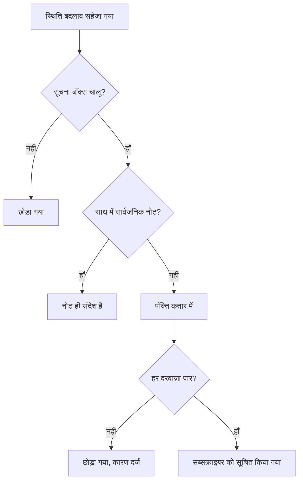

# घटना स्थितियाँ और गंभीरता

हर घटना के दो वर्गीकरण होते हैं: एक **स्थिति**, जो बताती है कि आपकी प्रतिक्रिया में वह कहाँ है, और एक **गंभीरता**, जो बताती है कि उससे कितना नुकसान है। यह पेज बताता है कि हर स्थिति क्या करती है, अपनी स्थितियाँ कैसे जोड़ें, और गंभीरताओं का क्रम कैसे तय होता है — उन सबके लिए जो घटनाएँ कॉन्फ़िगर करते हैं, या जानना चाहते हैं कि किसी घटना ने पेज क्यों किया या नहीं किया, वह क्यों सुलझी या नहीं सुलझी, या स्थिति पृष्ठ पर क्यों दिखी या नहीं दिखी।

:::cards
- [अपनी स्थितियाँ जोड़ें](#अपनी-स्थितियाँ-जोड़ना): अपनी प्रतिक्रिया का ढाँचा बनाएँ, और देखें कि हर स्थिति क्या मानी जाती है।
- [स्वीकार करने से क्या होता है](#स्वीकार-करने-से-क्या-होता-है): पेजिंग रुकती है और SLA जवाब दिया हुआ चिह्नित होता है।
- [सुलझाने से क्या होता है](#सुलझाने-से-क्या-होता-है): मॉनिटर लौटा दिए जाते हैं और SLA बंद हो जाता है।
- [सब्सक्राइबर को बताना](#स्थिति-पृष्ठ-सब्सक्राइबर-को-स्थिति-बदलाव-के-बारे-में-बताना): स्थिति पृष्ठ तक ख़बर पहुँचने से पहले स्थिति बदलाव किन दरवाज़ों से गुज़रता है।
:::

## यह कैसे काम करता है

डैशबोर्ड में स्थितियाँ और गंभीरताएँ एक जैसी दिखती हैं — दोनों घटनाओं की सूची पर रंगीन पिल के रूप में, और जहाँ भी आप उन्हें चुनते हैं वहाँ नाम से पहले एक रंगीन बिंदु के रूप में दिखती हैं, दोनों प्रोजेक्ट-स्तर की सूचियाँ हैं जिनका नाम और रंग आप बदल सकते हैं। पर उनके काम बिल्कुल अलग हैं।

स्थितियाँ व्यवहार तय करती हैं। स्थिति की पंक्तियों पर तीन बूलियन फ़्लैग, स्थितियों के क्रम के साथ मिलकर, तय करते हैं कि कौन-सी घटनाएँ सक्रिय मानी जाती हैं, घटना के हेडर पर कौन-से बटन दिखते हैं, SLA की घड़ी कब रुकती है, और घटना आपके स्थिति पृष्ठ से कब हटती है। गंभीरताएँ अपने आप कुछ तय नहीं करतीं — वे असर का वर्णन करने वाले लेबल हैं, जिनसे दूसरे नियम मिलान कर सकते हैं।

```mermaid title="घटनाएँ सूची में केवल नीचे जाती हैं; स्थिति की जगह तय करती है कि वह क्या मानी जाती है"
flowchart TB
    subgraph open["स्वीकार नहीं की गई मानी जाती है"]
        identified["Identified"]
    end
    subgraph working["स्वीकार की गई मानी जाती है"]
        acknowledged["स्वीकार किया गया"]
        mitigated["Mitigated (कस्टम)"]
    end
    subgraph done["सुलझी हुई मानी जाती है"]
        resolved["सुलझाया गया"]
        closed["Closed (कस्टम)"]
    end
    identified --> acknowledged
    acknowledged --> mitigated
    mitigated --> resolved
    resolved --> closed
    identified -. "आगे छलांग" .-> resolved
```

`IncidentState` मॉडल में `name`, `description`, `color` और `order` होते हैं, साथ में तीन बूलियन: `isCreatedState`, `isAcknowledgedState` और `isResolvedState`। उत्पाद स्थितियों के साथ जो कुछ भी करता है, वह इन बूलियन और `order` पर आधारित है — कभी स्थिति के नाम पर नहीं। इसीलिए आप **सुलझाया गया** का नाम बदलकर "Closed" कर सकते हैं और कुछ नहीं टूटता: फ़्लैग पंक्ति के साथ चलता है।

`IncidentSeverity` मॉडल में `name`, `description`, `color` और `order` होते हैं, और कुछ नहीं। कोई फ़्लैग नहीं है। OneUptime में कुछ भी अपने आप **Critical Incident** के साथ **Minor Incident** से अलग बर्ताव नहीं करता — गंभीरता केवल वहीं मायने रखती है जहाँ आप किसी चीज़ को उसकी ओर इंगित करते हैं, जैसे किसी ऑन-कॉल नियम पर **घटना गंभीरता** मिलान मानदंड।

कुछ आसान नियम:

- **असर बताने के लिए गंभीरता चुनें** — यह घटनाओं की सूची पर, घटना के **अवलोकन** पर दिखती है, और घटना घोषित करते समय यह एक आवश्यक फ़ील्ड है।
- **अपनी प्रक्रिया का ढाँचा बनाने के लिए स्थितियाँ चुनें** — प्रतिक्रिया के वे कदम जिनसे आप असल में गुज़रते हैं, उसी क्रम में जिसमें आप गुज़रते हैं।
- **स्थितियों में तात्कालिकता न डालें** — "Critical" नाम की स्थिति किसी को पेज नहीं करेगी। गंभीरता और एक ऑन-कॉल नियम मिलकर यह करते हैं।

> [!TIP]
> दोनों सूचियाँ आपका प्रोजेक्ट बनते समय बनाई जाती हैं, और दोनों **घटनाएं → सेटिंग्स** के नीचे संपादित होती हैं। घटनाओं के साइड मेनू का वह सेक्शन डिफ़ॉल्ट रूप से मुड़ा रहता है, इसलिए उन्हें ढूँढने से पहले **सेटिंग्स** खोलें।

## पहले से बनी स्थितियाँ

प्रोजेक्ट के साथ तीन स्थितियाँ, इसी क्रम में, बनाई जाती हैं। यह बनाना idempotent है — कोई स्थिति तभी जोड़ी जाती है जब उस नाम की स्थिति पहले से न हो।

| स्थिति                 | `order` | फ़्लैग                 | रंग       | इसका मतलब                                          |
| ---------------------- | ------- | --------------------- | --------- | -------------------------------------------------- |
| **Identified**         | `1`     | `isCreatedState`      | `#fd625e` | वह स्थिति जिसमें नई घटनाएँ आती हैं।                |
| **स्वीकार किया गया**   | `2`     | `isAcknowledgedState` | `#ffbf53` | किसी ने घटना उठा ली है।                            |
| **सुलझाया गया**        | `3`     | `isResolvedState`     | `#2ab57d` | घटना ख़त्म हो गई है और अब सक्रिय नहीं मानी जाती।   |

> [!NOTE]
> पहली स्थिति का नाम **Identified** है, हालाँकि उत्पाद के अंदर कई विवरण अब भी उसे "बनाई गई" स्थिति कहते हैं। जब कोई दस्तावेज़ या टूलटिप "बनाई गई स्थिति" कहता है, तो उसका मतलब वह स्थिति है जिस पर `isCreatedState` है — नए प्रोजेक्ट में वह **Identified** है।

## हर स्थिति फ़्लैग असल में क्या करता है

| फ़्लैग                 | उद्देश्य                                                                                                                                                                                              |
| --------------------- | ---------------------------------------------------------------------------------------------------------------------------------------------------------------------------------------------------- |
| `isCreatedState`      | वह स्थिति जो घटना को तब मिलती है जब किसी ने कोई स्थिति नहीं चुनी। अगर प्रोजेक्ट की किसी भी स्थिति पर यह फ़्लैग नहीं है, तो घटना बनाना एक त्रुटि के साथ विफल होता है जो आपसे सेटिंग्स से बनाई गई घटना स्थिति जोड़ने को कहती है। |
| `isAcknowledgedState` | प्रोजेक्ट की स्वीकार की गई स्थिति को चिह्नित करता है: वह जिसमें **स्वीकार करें** घटना को ले जाता है और जिसके नाम पर स्वीकार करने वाला आँकड़ा टाइल है। उसमें, उसके बाद की किसी भी स्थिति में, या सुलझी हुई घटना स्वीकार की गई मानी जाती है — उसके लिए **स्वीकार करें** अब नहीं दिया जाता, ऑन-कॉल उसके लिए पेज करना बंद कर देता है, और उसका SLA जवाब दिया हुआ चिह्नित होता है। |
| `isResolvedState`     | प्रोजेक्ट की सुलझी हुई स्थिति को चिह्नित करता है: वह जिसमें **सुलझाएं** घटना को ले जाता है और जिसे सुलझाने वाला आँकड़ा टाइल दिखाता है। उसमें, या उसके बाद की किसी भी स्थिति में, घटना सुलझी हुई मानी जाती है — वह **सक्रिय घटनाएं** और स्थिति पृष्ठ के सक्रिय हिस्से से हट जाती है, और उसका SLA सुलझा हुआ चिह्नित होता है। |

हर प्रोजेक्ट में हर फ़्लैग केवल एक स्थिति पर होना अपेक्षित है — खोज क्रम में पहली स्थिति लेती है। फ़्लैग वाली तीनों स्थितियों पर सेटिंग्स पेज पर **अंतर्निर्मित** टैग होता है; OneUptime उस स्थिति के साथ क्या करता है, यह पढ़ने के लिए उस पर होवर करें (या Tab से उस तक पहुँचें)। उनका नाम और रंग बदला जा सकता है और उन्हें खींचा जा सकता है, लेकिन:

- **उनका क्रम बना रहता है।** बनाई गई स्थिति स्वीकार की गई से पहले आती है, और स्वीकार की गई सुलझी हुई से पहले। जो खींचना इसे तोड़ता — जैसे **सुलझाया गया** को **स्वीकार किया गया** के ऊपर ले जाना — वह अस्वीकार हो जाता है, पंक्तियाँ वापस अपनी जगह चली जाती हैं, और पेज कारण बताता है।
- **उन्हें हटाया नहीं जा सकता।** उनका **हटाएं** पंक्ति के मेनू में बना रहता है, लॉक, कारण के साथ। बल्क डिलीट उन्हें छोड़ देता है और उन्हें न हटाई गई के रूप में सूचीबद्ध करता है। API भी प्रोजेक्ट की आख़िरी बनाई गई, स्वीकार की गई या सुलझी हुई स्थिति को हटाने से मना करता है।

चूँकि UI स्थितियों के नाम गतिशील रूप से पढ़ता है, किसी स्थिति का नाम बदलने से हर जगह दिखने वाला बदल जाता है — आँकड़ा टाइल (पहले से बने नामों के साथ **Acknowledged in** और **Resolved in**), किसी कस्टम स्थिति की **घटना को … के रूप में चिह्नित करें** पुष्टि, और घटनाओं की सूची पर पिल, सब उस नाम का पालन करते हैं जो आपने पंक्ति को दिया।

## अपनी स्थितियाँ जोड़ना

आपकी जोड़ी गई स्थिति आपकी प्रतिक्रिया का वह कदम है जिसका नाम पहले से बनी तीनों में नहीं है: "Investigating", "Mitigated", "Monitoring", "Closed"।

:::steps
### स्थितियों की सूची खोलें

**घटनाएं → सेटिंग्स → घटना स्थिति** पर जाएँ। **घटना स्थितियां** कार्ड आपकी स्थितियों को उनके क्रम में सूचीबद्ध करता है, हर एक की एक पंक्ति: खींचने के लिए एक ग्रिप, उसका रंग और नाम, उसमें घटना क्या **माना जाता है**, और उसका विवरण। शीर्षक के नीचे का वाक्य साफ़ कहता है: घटनाएँ इस सूची में हमेशा केवल नीचे जाती हैं।

### स्थिति बनाएँ

कार्ड के हेडर में **घटना स्थिति बनाएँ** पर क्लिक करें, और फ़ॉर्म भरें (फ़ील्ड नीचे हैं)। नई स्थिति **सुलझी हुई स्थिति के ठीक ऊपर** जुड़ती है — जहाँ ज़्यादातर स्थितियाँ होनी चाहिए, और कभी उसके नीचे नहीं, जहाँ वह चुपचाप सुलझी हुई मानी जाती।

### उसे उसकी जगह खींचें

किसी पंक्ति को उसकी ग्रिप से खींचकर हिलाएँ। छोड़ते ही नया क्रम सहेज जाता है; टाइप करने के लिए कोई क्रम संख्या नहीं है। कीबोर्ड से, ग्रिप पर फ़ोकस करें, Space दबाएँ, तीर कुंजियों से हिलाएँ और फिर Space दबाएँ। पंक्ति छोड़ते ही **माना जाता है** कॉलम अपडेट हो जाता है।
:::

**संपादित करें** वही फ़ॉर्म खोलता है जो बनाने वाला। स्थिति की ID पंक्ति के मेनू में **ID दिखाएँ** के नीचे है।

| फ़ील्ड          | आवश्यक   | यह क्या करता है                                                                                                                                                                                                                                                    |
| --------------- | -------- | ------------------------------------------------------------------------------------------------------------------------------------------------------------------------------------------------------------------------------------------------------------------ |
| **नाम**         | हाँ      | कम से कम दो अक्षर। प्लेसहोल्डर "Investigating" जैसा कुछ सुझाता है।                                                                                                                                                                                                 |
| **विवरण**       | नहीं     | खुला टेक्स्ट जो बताता है कि घटना इस स्थिति में कब रहती है।                                                                                                                                                                                                          |
| **रंग**         | हाँ      | फ़ॉर्म खुलते समय पहले से चुना होता है: ऐसा रंग जिसे सूची की कोई स्थिति अभी इस्तेमाल नहीं करती, ताकि नई स्थिति कभी ऊपर वाली के जैसी उसी लाल रंग की न निकले। नाम वाले रंगों की पंक्ति (लाल, नारंगी, नींबू हरा, हरा, हरा-नीला, नीला, नील, बैंगनी, मैजेंटा, गुलाबी) से दूसरा चुनें, या `#fd625e` जैसे सटीक ब्रांड रंग के लिए **कस्टम रंग** का उपयोग करें। |

रंग स्थिति के पिल को और हर स्थिति पिकर में उसके नाम से पहले वाले बिंदु को रंगता है: घोषणा और टेम्पलेट फ़ॉर्म, **स्थिति बदलें** बल्क कार्रवाई, हेडर का स्थिति मेनू, और नियम व फ़िल्टर शर्तें। इनमें से हर पिकर स्थितियों को उसी क्रम में सूचीबद्ध करता है जिसमें यह पेज उन्हें रखता है।

आप इस फ़ॉर्म से तीनों फ़्लैग सेट नहीं कर सकते — वे पहले से बनी पंक्तियों के हैं। इसलिए आपकी जोड़ी गई स्थिति बिना फ़्लैग की स्थिति है, जिसके तीन नतीजे हैं जिनके हिसाब से योजना बनानी चाहिए:

- **उसकी जगह तय करती है कि वह क्या मानी जाती है।** **माना जाता है** कॉलम इसे दिखाता है, और खींचने के साथ बदलता है: स्वीकार की गई स्थिति के ऊपर उसमें घटना **स्वीकार नहीं किया गया** है; स्वीकार की गई स्थिति से नीचे वह **स्वीकार किया गया** मानी जाती है, इसलिए ऑन-कॉल नीतियाँ उसका एस्केलेशन बंद कर देती हैं; सुलझी हुई स्थिति से नीचे वह **सुलझाया गया** मानी जाती है, इसलिए स्थिति पृष्ठ उसे सक्रिय दिखाना बंद कर देते हैं।
- **सुलझी हुई स्थिति के ऊपर, वह घटना को सक्रिय रखती है।** **सक्रिय घटनाएं** में वे घटनाएँ होती हैं जिनकी वर्तमान स्थिति सुलझी हुई स्थिति से ऊपर है, इसलिए वहाँ जोड़ी गई स्थिति घटना को सक्रिय सूची और साइडबार की गिनती में रखती है। सुलझी हुई स्थिति के नीचे खींची गई स्थिति हर जगह सुलझी हुई मानी जाती है — सक्रिय सूचियाँ, स्थिति पृष्ठ, रिमाइंडर और SLA — और **सुलझाया गया** से किसी घटना को उसमें ले जाना दूसरी बार सुलझाना नहीं है।
- **आप घटना को हेडर के मेनू से उसमें ले जाते हैं।** हेडर के बटन केवल **स्वीकार करें** और **सुलझाएं** हैं; कस्टम स्थिति उनके बगल वाले **⋯** मेनू में **Change state to** के नीचे है, जो वर्तमान स्थिति के बाद की हर स्थिति सूचीबद्ध करता है। उसकी पुष्टि का शीर्षक **घटना को `<state name>` के रूप में चिह्नित करें** होता है, और सबमिट बटन **`<state name>` के रूप में चिह्नित करें**।

> [!TIP]
> एक आम ढाँचा स्वीकार की गई और सुलझी हुई स्थितियों के बीच एक शमन (mitigation) कदम है — "Mitigated" बनाइए और वह **सुलझाया गया** के ठीक ऊपर, **स्वीकार किया गया** के बाद आती है, और स्वीकार की गई मानी जाती है। किसी के घटना स्वीकार करने से पहले के छँटाई (triage) कदम के लिए, उसे **स्वीकार किया गया** के ऊपर खींचें।

## क्रम एक असली बाधा है, दिखावे की पसंद नहीं

क्रम केवल सूची बनाते समय नहीं, स्थिति बदलाव लिखते समय लागू किया जाता है:

- **पीछे जाने वाले बदलाव अस्वीकार होते हैं।** किसी घटना को ऐसी स्थिति में ले जाना जो क्रम में उसकी वर्तमान स्थिति से पहले है, दोनों स्थितियों के नाम बताने वाली त्रुटि के साथ विफल होता है।
- **वर्तमान स्थिति को फिर से चुनना अस्वीकार होता है।** किसी घटना को उसी स्थिति में सेट करना जिसमें वह पहले से है, "Incident state cannot be same as previous state." के साथ विफल होता है।
- **पिछली तारीख़ वाली पंक्ति अपने पड़ोसी की नकल नहीं हो सकती।** ऐसी टाइमलाइन पंक्ति डालना भी अस्वीकार होता है जिसकी स्थिति उसके बाद वाली पंक्ति से मेल खाती है।
- **हेडर के बटन क्रम में फ़्लैग वाली स्थितियों की जगह का पालन करते हैं।** **स्वीकार करें** और **सुलझाएं** इस आधार पर दिए जाते हैं कि क्रम से लगी सूची में वर्तमान स्थिति कहाँ है। सुलझी हुई स्थिति के *बाद* रखी कस्टम स्थिति कभी **सुलझाएं** बटन नहीं दिखाती, क्योंकि उसमें घटना पहले से सुलझी हुई मानी जाती है।

इसलिए जब आप कोई स्थिति जोड़ें, तो उसे वहाँ रखें जहाँ घटना सच में उससे गुज़रेगी। ग़लत क्रम केवल अजीब नहीं दिखता — वह बदलाव असंभव बना देता है। किसी स्थिति को बाद में ले जाने से, छोड़ते ही, उसमें पहले से मौजूद घटनाओं की गिनती का तरीका बदल जाता है।

API और Terraform में क्रम `order` कॉलम है: छोटी संख्याएँ पहले आती हैं। बिना संख्या के बनाई गई स्थिति सुलझी हुई स्थिति के ठीक ऊपर जाती है; संख्या के साथ बनाई या अपडेट की गई स्थिति वह जगह ले लेती है, और रास्ते की स्थितियाँ एक कदम नीचे खिसक जाती हैं। जो संख्याएँ किसी और के पास नहीं हैं, वे जैसी लिखी गईं वैसी ही रखी जाती हैं, इसलिए Terraform से प्रबंधित स्थिति वही संख्या वापस पढ़ती है जो उसे दी गई थी।

## पहले से बनी गंभीरताएँ

प्रोजेक्ट के साथ तीन गंभीरताएँ, इसी क्रम में, सबसे गंभीर पहले, बनाई जाती हैं:

| गंभीरता               | `order` | रंग       | पहले से भरा विवरण                                                                                                                                                                         |
| --------------------- | ------- | --------- | ----------------------------------------------------------------------------------------------------------------------------------------------------------------------------------------- |
| **Critical Incident** | `1`     | `#b70400` | Issues causing very high impact to customers. Immediate response is required. Examples include a full outage, or a data breach.                                                          |
| **Major Incident**    | `2`     | `#fd625e` | Issues causing significant impact. Immediate response is usually required. We might have some workarounds that mitigate the impact on customers. Examples include an important sub-system failing. |
| **Minor Incident**    | `3`     | `#ffbf53` | Issues with low impact, which can usually be handled within working hours. Most customers are unlikely to notice any problems. Examples include a slight drop in application performance. |

घटना घोषित करते समय गंभीरता आवश्यक है, और मॉनिटर के मानदंड में हर घटना विवरण पर भी आवश्यक है, इसलिए हर घटना — हाथ से या अपने आप — एक गंभीरता के साथ आती है। घोषणा के तरीके के लिए [घटना घोषित करना](/docs/incidents/declaring-incidents) और मॉनिटर वाले रास्ते के लिए [घटना और अलर्ट टेम्पलेट](/docs/monitor/incident-alert-templating) देखें।

## गंभीरताएँ संपादित करना

**घटनाएं → सेटिंग्स → घटना गंभीरता** पर जाएँ। ढाँचा स्थिति वाले पेज जैसा है — हर गंभीरता की एक पंक्ति, सबसे गंभीर पहले, उसका दर्जा बदलने के लिए पंक्ति खींचें, **घटना गंभीरता बनाएँ** अंत में एक जोड़ता है (सबसे कम गंभीर), फ़ॉर्म पर **नाम**, **विवरण** और **रंग** के साथ, रंग स्थिति वाले फ़ॉर्म की तरह पहले से चुना हुआ।

दर्जा वहाँ मायने रखता है जहाँ भी OneUptime गंभीरताओं की तुलना करता है: एपिसोड अपनी सबसे गंभीर घटना की गंभीरता लेता है, और मॉनिटर सुझाव के Critical और Warning आपकी पहली और दूसरी गंभीरता से जुड़ते हैं।

स्थितियों से दो अंतर:

- **हटाने पर कोई रोक नहीं है।** कोई भी गंभीरता हटाई जा सकती है, पहले से बनी तीनों सहित।
- **विरासत में लेने के लिए कोई फ़्लैग नहीं, और कोई "माना जाता है" नहीं।** नई गंभीरता बिल्कुल पहले से बनी गंभीरताओं जैसा बर्ताव करती है — वह रंग और दर्जे वाला एक लेबल है।

जहाँ गंभीरता वर्णन से ज़्यादा करती है: **घटनाएं → नियम → ऑन-कॉल नियम** पर, नियम का **घटना गंभीरता** फ़ील्ड एक मिलान मानदंड है। वहाँ **Critical Incident** सूचीबद्ध करना ही "किसी भी गंभीर मामले के लिए डेटाबेस टीम को पेज करो" को व्यक्त करने का तरीका है — ऑन-कॉल नीति नियम पर रहती है, गंभीरता पर नहीं।

**किसी घटना की गंभीरता बदलना** — घटना के **घटना विवरण** कार्ड पर **संपादित करें** के नीचे, API या Terraform (`incidentSeverityId`) से, किसी वर्कफ़्लो से या AI टूल से — चाहे जिस तरह भेजा जाए, वही चार काम करता है: घटना फ़ीड में नई गंभीरता का नाम बताने वाली **Incident updated** प्रविष्टि आती है, घटना की SLA समय-सीमाएँ फिर से निकाली जाती हैं, उसका रिमाइंडर नियम फिर से मिलाया जाता है, और घटना मेट्रिक्स एक गंभीरता बदलाव गिनते हैं। घटना की मौजूदा गंभीरता को ही सहेजना इनमें से कुछ नहीं करता, इसलिए किसी घटना का केवल शीर्षक संपादित करने से उसकी SLA समय-सीमाएँ, रिमाइंडर और गंभीरता बदलाव की गिनती जैसी थीं वैसी रहती हैं। अलर्ट की गंभीरता भी अपनी फ़ीड प्रविष्टि और अपने रिमाइंडर के लिए इसी तरह काम करती है।

## घटना को उसकी स्थितियों से आगे ले जाना

घटना की स्थिति चार तरीकों से बदलती है:

| तरीका               | कहाँ                                                                                        | यह क्या पूछता है                                                                                                                                                                                             |
| ------------------- | ------------------------------------------------------------------------------------------- | ------------------------------------------------------------------------------------------------------------------------------------------------------------------------------------------------------------ |
| **हेडर बटन**        | घटना का हेडर: **स्वीकार करें** और **सुलझाएं**, और उसके **⋯** मेनू में **Change state to** | एक छोटी पुष्टि — **घटना स्वीकार करें** या **घटना सुलझाएं** — **स्थिति पृष्ठ ग्राहकों को सूचित करें** के साथ और, **सार्वजनिक नोट जोड़ें** के नीचे मुड़ा हुआ, वैकल्पिक **सार्वजनिक नोट** और उसका **नोट टेम्पलेट चुनें** पिकर (जब प्रोजेक्ट में नोट टेम्पलेट हों)। |
| **स्थिति टाइमलाइन** | घटना के साइड मेनू में **स्थिति टाइमलाइन**                                                   | हाथ से जोड़ी गई पंक्ति, **घटना स्थिति**, **शुरू होता है** और **स्थिति पृष्ठ ग्राहकों को सूचित करें** के साथ।                                                                                                |
| **बल्क बदलाव**      | घटनाओं की सूची में किसी चयन पर **स्थिति बदलें**                                              | एक पेज, जिसमें स्थिति, **स्थिति पृष्ठ ग्राहकों को सूचित करें** और वही मुड़ा हुआ **सार्वजनिक नोट जोड़ें** होता है।                                                                                           |
| **स्वचालित रूप से** | मॉनिटर का कोई मानदंड, या आपका अपना कोड                                                      | **घटना स्वतः सुलझाएं** चालू वाला मानदंड, मानदंड पूरा न रहने पर अपनी घटना सुलझा देता है। API `/api/incident-state-timeline` पर एक पंक्ति बनाकर स्थिति बदलता है।                                              |

अगर वर्तमान स्थिति स्वीकार की गई स्थिति से पहले है, तो हेडर **स्वीकार करें** और **सुलझाएं** देता है; अगर दोनों के बीच है, तो केवल **सुलझाएं**। स्वीकार करना घटना के किसी भी ऑन-कॉल एस्केलेशन को भी रोक देता है।

इनमें से हर एक एक टाइमलाइन पंक्ति लिखता है। स्थिति बदलाव कुछ ऐसी चीज़ें भी करता है जिनके लिए आपको कहना नहीं पड़ता: वह घटना फ़ीड में एक प्रविष्टि पोस्ट करता है, अगर घटना का अभी कोई घटना कमांडर नहीं है तो एक असाइन करता है, और SLA की घड़ी अपडेट करता है। सुलझी हुई घटना को फिर से खोलने पर फिर से खुलने के समय से एक नया SLA रिकॉर्ड शुरू होता है।

## स्वीकार करने से क्या होता है

घटना उस पल से स्वीकार की गई होती है जब वह आपकी स्वीकार की गई स्थिति में, उसके बाद की किसी भी स्थिति में — **स्वीकार किया गया** के नीचे रखी गई कोई **Mitigated** या **Investigating** स्थिति — या किसी सुलझी हुई स्थिति में जाती है, ऊपर के चारों तरीकों में से चाहे जिससे जाए। स्थिति सेटिंग्स पेज पर **माना जाता है** कॉलम दिखाता है कि वे कौन-सी स्थितियाँ हैं। स्वीकार हो जाने के बाद:

- **स्वीकार करें अब नहीं दिया जाता।** न घटना के हेडर में, न मोबाइल ऐप में (उसका बटन और उसका स्वाइप), न Slack या Microsoft Teams में, और न OneUptime MCP सर्वर के `acknowledge_incident` से। फिर भी स्वीकार करना — किसी ऑन-कॉल पेज, Slack या Teams से — उसे सूची में ऊपर वापस ले जाने के बजाय "Incident is already acknowledged." (या "Incident is already resolved.") के साथ अस्वीकार हो जाता है।
- **ऑन-कॉल उसके लिए पेज करना बंद कर देता है।** जो प्रतिक्रिया देने वाला किसी सहकर्मी के घटना स्वीकार करने, या उसे आगे बढ़ाने, के बाद अपना पेज स्वीकार करता है, उसका पेज स्वीकार हो जाता है और घटना जहाँ है वहीं रहती है।
- **SLA जवाब दिया हुआ चिह्नित होता है**, ऐसे पहले बदलाव पर; बाद की स्थितियों से आगे बढ़ने पर वही समय बना रहता है।
- **स्वीकार करने में लगा समय उस पहले बदलाव तक चलता है** — घटना के **अवलोकन** का आँकड़ा टाइल, **Time to Acknowledge** मेट्रिक, **घटना स्वीकार की जाती है** पर ख़त्म होने वाला माप, और Slack व Microsoft Teams सारांशों में MTTA। **Identified** से सीधे **Investigating** में ले जाई गई घटना तभी स्वीकार की गई थी; तुरंत सुलझाई गई घटना सुलझने के समय स्वीकार की गई थी।
- **स्वीकार किया गया फ़िल्टर** — जैसे किसी डैशबोर्ड के घटना सूची विजेट पर — आपकी स्वीकार की गई स्थिति और उसके बाद की किसी भी स्थिति वाली घटनाएँ दिखाता है, सुलझी हुई से पहले तक।

अलर्ट और एपिसोड आपकी अलर्ट स्थितियों के साथ इसी नियम का पालन करते हैं।

## सुलझाने से क्या होता है

घटना तब सुलझी हुई होती है जब वह आपकी सुलझी हुई स्थिति से ऊपर की किसी स्थिति से सुलझी हुई स्थिति में, या उसके बाद की किसी भी स्थिति में जाती है — ऊपर के चारों तरीकों में से चाहे जिससे जाए। हर बार सुलझाना:

- **घटना के रोके हुए मॉनिटर लौटा देता है।** खुली घोषित घटना अपने मॉनिटर रोके रखती है: अगर उसमें कोई स्थिति बताई गई है तो उसने उन्हें अपनी **मॉनिटर स्थिति बदलकर करें** स्थिति में डाला, और, हाथ से घोषित होने पर, उनकी निगरानी रोक दी। खुली रहते हुए किया गया बदलाव — मॉनिटर जोड़ना, या वह स्थिति बदलना — भी उसे उन्हें रोके रखने वाला बनाता है। सुलझाना उनकी निगरानी फिर शुरू करता है और उन्हें operational पर लौटा देता है, जब तक कोई दूसरी खुली घटना अब भी उन पर न हो, और तब से घटना कुछ भी नहीं रोकती। इसलिए पहले से सुलझी हुई घोषित घटना कुछ नहीं लौटाती, और फिर से खोलने के बाद दूसरी बार सुलझाना भी नहीं: बीच में उसके मॉनिटर को मिली स्थिति — उनके प्रोब से, रखरखाव से या हाथ से सेट की गई — बनी रहती है।
- **SLA को सुलझा हुआ चिह्नित करता है** और, जब OneUptime AI के पोस्टमॉर्टम मसौदे चालू हों, एक पोस्टमॉर्टम का मसौदा बनाता है।

**सुलझाया गया** से उसके बाद की किसी स्थिति में — जैसे **Closed** — आगे बढ़ना दूसरी बार सुलझाना नहीं है: इसमें से कुछ भी फिर से नहीं चलता, और कोई नया SLA शुरू नहीं होता। OneUptime के यह दर्ज करना शुरू करने से पहले घोषित घटना, पहले की तरह, अपने अगले सुलझाने पर अपने मॉनिटर लौटा देती है।

## स्थिति टाइमलाइन

घटना के साइड मेनू में घटना का **स्थिति टाइमलाइन** पेज घटना की हर रही स्थिति का ऑडिट रिकॉर्ड है। उस पेज के कार्ड का शीर्षक **स्थिति टाइमलाइन** है, और वह सबसे नए से शुरू होकर क्रम में लगा है।

| कॉलम                               | यह क्या दिखाता है                                                                                                                                                                                                                                              |
| ---------------------------------- | -------------------------------------------------------------------------------------------------------------------------------------------------------------------------------------------------------------------------------------------------------------- |
| **घटना स्थिति**                    | स्थिति के नाम और रंग वाला एक रंगीन पिल।                                                                                                                                                                                                                        |
| **शुरू होता है**                   | घटना कब इस स्थिति में आई।                                                                                                                                                                                                                                      |
| **समाप्त होता है**                 | कब निकली। वर्तमान स्थिति `Currently Active` दिखाती है।                                                                                                                                                                                                         |
| **अवधि**                           | स्थिति में बिताया गया समय, वर्तमान स्थिति के लिए अब तक गिना गया।                                                                                                                                                                                              |
| **ग्राहक सूचना स्थिति**            | इस बदलाव की स्थिति पृष्ठ सूचना भेजी गई, छोड़ी गई या अभी लंबित है, एक **अधिक विवरण** लिंक के साथ, और — भेजना विफल होने पर — एक **फिर से प्रयास करें** कार्रवाई। **फिर से प्रयास करें** स्थिति बदलाव को फिर से हर उस स्थिति पृष्ठ पर भेजता है जहाँ घटना अब पहुँचती है, उन सब्सक्राइबर सहित जिन्हें यह पहले ही मिल चुका है। |

हर पंक्ति पर दो कार्रवाइयाँ होती हैं:

- **कारण देखें** — एक **मूल कारण** मोडल खोलता है, जो उस स्थिति बदलाव के साथ दर्ज markdown दिखाता है।
- **लॉग्स देखें** — एक मोडल खोलता है जो बताता है कि स्थिति क्यों बदली, एक **घटना स्थिति लॉग** व्यूअर के साथ।

डैशबोर्ड में टाइमलाइन पंक्तियाँ जोड़ी और हटाई जा सकती हैं, लेकिन संपादित नहीं की जा सकतीं; घटना में हमेशा कम से कम एक पंक्ति रहती है। API से किसी पंक्ति का `startsAt` ठीक किया जा सकता है, और टाइमलाइन से निकाला गया हर माप उसका पालन करता है।

> [!WARNING]
> ग़लत पंक्ति हटाने से घटना का इतिहास फिर से लिखा जाता है, इसलिए इसे सफ़ाई की आदत नहीं, सुधार का औज़ार मानें।

## सक्रिय घटनाओं की सूची

**घटनाएं → सक्रिय घटनाएं** वह सूची है जिस पर आप शिफ़्ट के दौरान नज़र रखते हैं। इसकी परिभाषा ठीक एक शर्त है: घटना की वर्तमान स्थिति आपकी सुलझी हुई स्थिति से ऊपर है — क्रम में `isResolvedState` फ़्लैग वाली पहली स्थिति से। और कुछ नहीं देखा जाता — न गंभीरता, न उम्र, न यह कि किसी ने उसे स्वीकार किया है या नहीं।

साइड मेनू आइटम पर उसी क्वेरी से बनी लाल गिनती वाला बैज होता है, इसलिए बैज और सूची हमेशा मेल खाते हैं। जब देखने को कुछ न हो, तो पेज यही बताता है।

व्यावहारिक नतीजा: सुलझी हुई स्थिति के ऊपर जोड़ी गई कस्टम स्थिति घटनाओं को इस सूची में रखती है — "Mitigated" का मतलब "हो गया" नहीं है — और उसके बाद रखी गई स्थिति, सुलझी हुई स्थिति की तरह, उन्हें हटा देती है। अलर्ट और एपिसोड अपनी स्थितियों के साथ इसी नियम का पालन करते हैं, और साइड मेनू की गिनतियाँ, रिमाइंडर, स्थिति पृष्ठ और मोबाइल ऐप सभी इसे पढ़ते हैं।

## स्थिति पृष्ठ सब्सक्राइबर को स्थिति बदलाव के बारे में बताना

स्थिति बदलाव आपके स्थिति पृष्ठ सब्सक्राइबर को सूचित कर सकता है, लेकिन वह कई दरवाज़ों से गुज़रता है। इन्हें समझने से "किसी को सूचना क्यों नहीं मिली" वाली बहुत सारी खोजबीन बचती है।



सूचना हर टाइमलाइन पंक्ति के लिए **स्थिति पृष्ठ ग्राहकों को सूचित करें** (`shouldStatusPageSubscribersBeNotified`) से माँगी जाती है, जो स्थिति बदलने वाले मोडल और हाथ वाले टाइमलाइन फ़ॉर्म पर चेकबॉक्स है। स्थिति बदलने वाले मोडल पर यह बंद शुरू होता है जब घटना सब्सक्राइबर को सूचित किए बिना घोषित की गई थी। यही चेकबॉक्स यह भी तय करता है कि मोडल का सार्वजनिक नोट किसी को सूचित करे या नहीं। बंद होने पर पंक्ति छोड़े गए की स्थिति और एक व्याख्या के साथ सहेजी जाती है। चालू होने पर पंक्ति कतार में डाली जाती है और एक बैकग्राउंड जॉब उसे उठाता है — जॉब हर मिनट चलता है, इसलिए डिलीवरी जल्दी होती है पर तुरंत नहीं।

**कतार वाली पंक्ति फिर इनमें से कोई भी बात सही होने पर छोड़ दी जाती है:**

- **नई स्थिति बनाई गई स्थिति है।** घटना घोषित होते समय सब्सक्राइबर को पहले ही बताया जा चुका था, इसलिए पहली टाइमलाइन पंक्ति जानबूझकर दूसरा संदेश नहीं भेजती।
- **घटना से कोई मॉनिटर जुड़ा नहीं है।** बिना संसाधनों के, घटना को जोड़ने के लिए कोई स्थिति पृष्ठ नहीं है।
- **घटना स्थिति पृष्ठ पर दृश्यमान नहीं है** (`isVisibleOnStatusPage` बंद है)।
- **स्थिति पृष्ठ पर घटनाएँ बंद हैं** (`showIncidentsOnStatusPage` बंद है)। यह हर स्थिति पृष्ठ के लिए अलग है — उसी मॉनिटर को दिखाने वाले दूसरे पृष्ठों को फिर भी सूचना मिलती है।
- **स्थिति पृष्ठ घटना के दायरे से बाहर है।** **इन स्थिति पृष्ठों तक सीमित करें** से कुछ स्थिति पृष्ठों तक सीमित घटना, उसके मॉनिटर को सूचीबद्ध करने वाले पृष्ठों में से केवल उन्हीं को सूचित करती है, और **केवल इस पृष्ठ तक सीमित घटनाएँ दिखाएँ** चालू वाले पृष्ठ को ऐसी घटना के बारे में कभी सूचित नहीं किया जाता जो उस तक सीमित नहीं है। यह भी हर स्थिति पृष्ठ के लिए अलग है। [हर ऑडियंस के लिए एक स्थिति पृष्ठ](/docs/status-pages/one-status-page-per-audience) देखें।

**एक और बात जो नतीजा बदल देती है।** अगर आप **स्थिति पृष्ठ ग्राहकों को सूचित करें** चालू रहते हुए स्थिति बदलने वाले मोडल में (**सार्वजनिक नोट जोड़ें** के नीचे) या **स्थिति बदलें** बल्क कार्रवाई में **सार्वजनिक नोट** लिखते हैं, तो टाइमलाइन पंक्ति कतार में डालने के बजाय पहले से सूचित के रूप में चिह्नित होती है, और उसका स्थिति संदेश बताता है कि नोट ने उसे पहुँचाया। सब्सक्राइबर तक नोट ख़ुद पहुँचता है, इसलिए उन्हें दो के बजाय एक संदेश मिलता है। केवल स्पेस वाला नोट पोस्ट नहीं होता, और पंक्ति हमेशा की तरह कतार में जाती है। निर्धारित रखरखाव के स्थिति बदलाव भी इसी तरह काम करते हैं। साधारण स्थिति बदलाव संदेश के पीछे का इवेंट प्रकार `Subscriber Incident State Changed` है।

**नोट बताता है कि घटना अब क्या है।** चूँकि नोट ही एकमात्र संदेश है, वह हर चैनल पर नई स्थिति का नाम बताता है, जैसे स्थिति बदलाव संदेश बताता: ईमेल का विषय `[Resolved Incident] <title>` पढ़ता है और उसके विवरण स्थिति के रंग में एक **Status** पंक्ति दिखाते हैं, SMS कहता है `Incident <title> on <status page> is Resolved.`, Slack और Microsoft Teams संदेशों में `**Status:** Resolved` पंक्ति होती है, और webhook का `IncidentNoteCreated` पेलोड `data` में `incidentState` रखता है। अपने आप में पोस्ट किया गया नोट अपना सामान्य संदेश रखता है, और किसी संपादन की अपडेट सूचना भी।

**नोट पोस्ट करने के लिए अपनी अलग अनुमति चाहिए।** स्थिति बदलना और सार्वजनिक नोट पोस्ट करना अलग-अलग अनुमतियाँ हैं (कस्टम भूमिका में **Create Incident State Timeline** और **Create Incident Status Page Note**; अंतर्निर्मित घटना और प्रोजेक्ट भूमिकाओं के पास दोनों हैं)। स्थिति बदलने के लिए घटना संपादित करने की अनुमति नहीं चाहिए: [स्थिति बदलना](/docs/permissions/index#स्थिति-बदलना) देखें। जो व्यक्ति घटना की स्थिति बदल सकता है पर सार्वजनिक नोट पोस्ट नहीं कर सकता, उसे मोडल में या **स्थिति बदलें** बल्क कार्रवाई में **सार्वजनिक नोट जोड़ें** नहीं दिया जाता। वह API से नोट के साथ जो स्थिति बदलाव भेजता है, वह पूरा का पूरा अस्वीकार होता है, एक संदेश के साथ जो बताता है कि स्थिति नहीं बदली गई और क्यों, ताकि कोई बदलाव कभी ऐसे नोट से बताया गया दर्ज न हो जो कभी पोस्ट ही नहीं हुआ। नोट हटा दें, तो बदलाव हो जाता है। अलर्ट, अलर्ट एपिसोड और घटना एपिसोड इसके बजाय स्थिति बदलाव के साथ एक निजी नोट देते हैं (**निजी नोट जोड़ें**), और वह भी इसी तरह काम करता है: उसे पोस्ट करने के लिए नोट की अपनी अनुमति चाहिए (कस्टम भूमिका में **Create Alert Internal Note**, **Create Alert Episode Internal Note** या **Create Incident Episode Internal Note**; अंतर्निर्मित अलर्ट, घटना और प्रोजेक्ट भूमिकाओं के पास ये हैं), और बिना इस अनुमति वाले व्यक्ति का निजी नोट के साथ भेजा गया स्थिति बदलाव पूरा का पूरा अस्वीकार होता है, इसलिए स्थिति नहीं बदलती।

**भेजा गया का मतलब है हर सब्सक्राइबर को भेजा गया।** जॉब हर संदेश का इंतज़ार करता है और उसे, हर स्थिति पृष्ठ और चैनल के हिसाब से, भेजा गया या विफल गिनता है, और पंक्ति का स्थिति संदेश ये गिनतियाँ सूचीबद्ध करता है। एक विफल संदेश, या समय ख़त्म हो जाने वाला या बीच में रुक जाने वाला भेजना, पंक्ति को **विफल** बना देता है। [सब्सक्राइबर और घोषणाएँ](/docs/status-pages/subscribers) देखें।

ये किसे मिलते हैं और टेम्पलेट कैसे चुने जाते हैं, इसके लिए [सब्सक्राइबर और घोषणाएँ](/docs/status-pages/subscribers) देखें।

## घटना को स्थिति पृष्ठ से दूर रखना

कोई घटना सार्वजनिक पेज पर है भी या नहीं, यह चार अलग चीज़ें तय करती हैं, और चारों का सही होना ज़रूरी है:

- स्थिति पृष्ठ पर ख़ुद **घटनाएं दिखाएं** (`showIncidentsOnStatusPage`)।
- घटना पर **स्थिति पृष्ठ पर दृश्यमान** (`isVisibleOnStatusPage`) — घटना के **सेटिंग्स** पेज पर एक टॉगल। यह डिफ़ॉल्ट रूप से true होता है और घोषणा विज़ार्ड पर नहीं है; मॉनिटर का मानदंड इसे **स्थिति पृष्ठ पर घटना दिखाएं** से सेट कर सकता है। छिपी हुई घोषित घटना बनते समय किसी सब्सक्राइबर को नहीं बताती; जब आप बाद में यह टॉगल चालू करते हैं, तो संपादन फ़ॉर्म **सब्सक्राइबर को सूचित करें कि यह घटना बनाई गई थी** देता है। [घटना घोषित करना](/docs/incidents/declaring-incidents) देखें।
- **पृष्ठ घटना की पहुँच में है।** पृष्ठ घटना के किसी मॉनिटर को सूचीबद्ध करता है और, अगर घटना कुछ स्थिति पृष्ठों तक सीमित है, तो वह उनमें से एक है। **केवल इस पृष्ठ तक सीमित घटनाएँ दिखाएँ** चालू वाला पृष्ठ केवल उस तक सीमित घटनाएँ दिखाता है। [हर ऑडियंस के लिए एक स्थिति पृष्ठ](/docs/status-pages/one-status-page-per-audience) देखें।
- **वर्तमान स्थिति सुलझी हुई स्थिति से ऊपर है।** यही घटना को सक्रिय हिस्से से हटाता है: स्थिति पृष्ठ की क्वेरी वे घटनाएँ लाती है जिनकी वर्तमान स्थिति आपकी सुलझी हुई स्थिति से ऊपर है, इसलिए सुलझी हुई स्थिति और उसके बाद की कोई भी स्थिति घटना को हटा देती है। आप कुछ भी संग्रहीत या बंद नहीं करते — आप उसे सुलझाते हैं, और वह इतिहास में चली जाती है।

**निजी घटनाएँ कभी नहीं दिखतीं।** **निजी घटना** चालू करने से घटना हर स्थिति पृष्ठ से छिप जाती है, ऊपर के टॉगल चाहे जो हों, और वह उसके स्वामियों और प्रोजेक्ट एडमिन व स्वामियों तक सीमित हो जाती है। उसके बारे में कुछ भी किसी स्थिति पृष्ठ सब्सक्राइबर तक नहीं पहुँचता: न उसका बनना, न उसके स्थिति बदलाव, न उसके सार्वजनिक नोट, न उसका पोस्टमॉर्टम। निजी रहने तक उसके विवरण, पोस्टमॉर्टम, कस्टम फ़ील्ड और सार्वजनिक नोट की छवियाँ हर किसी को दिखने लायक नहीं होतीं।

दोनों स्विच साथ-साथ रखे जाते हैं, ताकि घटना का **सेटिंग्स** पेज हमेशा वही दिखाए जो स्थिति पृष्ठ करते हैं:

- किसी घटना को निजी बनाने से उसके साथ **स्थिति पृष्ठ पर दृश्यमान** बंद हो जाता है।
- घटना के निजी रहते हुए **स्थिति पृष्ठ पर दृश्यमान** चालू करने से वह बंद ही रहता है। किसी निजी घटना को प्रकाशित करने के लिए, **निजी घटना** बंद करें और **स्थिति पृष्ठ पर दृश्यमान** चालू करें — एक ही बार सहेजकर, या एक के बाद एक।

यह इस पर लागू होता है कि घटना चाहे जैसे लिखी जाए: डैशबोर्ड, API, Terraform, कोई वर्कफ़्लो, कोई मॉनिटर, कोई घटना टेम्पलेट या कोई गोपनीयता नियम। टेक्स्ट के रूप में भेजा गया मान, जैसे `"true"`, `true` के बराबर ही गिना जाता है। कई घटनाओं पर एक लेखन जो **स्थिति पृष्ठ पर दृश्यमान** चालू करता है — जैसे किसी वर्कफ़्लो का **Update Many** — उन्हें दिखाता है जो निजी नहीं हैं और हर निजी घटना को छिपा रहने देता है। हर घटना का फ़ैसला उसी हालत के हिसाब से होता है जिसमें वह लेखन पहुँचने पर है, इसलिए उसी पल आ रहा उसकी गोपनीयता का बदलाव कभी पीछे नहीं छूटता: कोई घटना कभी निजी और दृश्यमान दोनों के रूप में नहीं सहेजी जाती। निजी बनाई गई घटना छिपी हुई बनती है, और किसी सब्सक्राइबर को नहीं बताती कि वह बनी।

**एपिसोड भी इसी नियम का पालन करते हैं।** निजी घटना एपिसोड हर स्थिति पृष्ठ से छिपा रहता है, उसका **स्थिति पृष्ठ पर दृश्यमान** स्विच चाहे जो कहे, और उसके सब्सक्राइबर को उसके बारे में कुछ पता नहीं चलता। एपिसोड के **सेटिंग्स** पेज पर स्विच यही बताता है, और एपिसोड के निजी रहते बंद रहता है। निजी घटना अपने एपिसोड को कभी किसी स्थिति पृष्ठ पर नहीं लाती: एपिसोड किसी पेज तक केवल उन घटनाओं के ज़रिए पहुँचता है जो निजी नहीं हैं।

:::details इन नियमों के बिना वाले संस्करण से अपग्रेड करना
इन नियमों से पहले के, **स्थिति पृष्ठ पर दृश्यमान** चालू रहते निजी के रूप में सहेजे गए घटनाओं और एपिसोड का यह स्विच अपग्रेड करने पर बंद कर दिया जाता है। किसी को कुछ नहीं भेजा जाता। ऐसी घटना या एपिसोड ने जिन छवियों को सबके लिए दिखने लायक बनाया था, वे फिर से निजी कर दी जाती हैं, जब तक आपके स्थिति पृष्ठों पर दिखने वाली किसी चीज़ में वे अब भी न हों। ऐसा ही उन घटनाओं, एपिसोड और निर्धारित रखरखाव इवेंट के सार्वजनिक नोट की छवियों के साथ होता है जिन्हें आपके स्थिति पृष्ठ नहीं दिखाते, जो पहले सबके लिए दिखने लायक रहती थीं।
:::

पेज कितना सुलझा हुआ इतिहास रखता है, यह स्थिति पृष्ठ की सेटिंग है, घटना की नहीं। पेज पर मॉनिटर कैसे तय करते हैं कि कौन-सी घटनाएँ दिखेंगी भी, इसके लिए [स्थिति पृष्ठ संसाधन और समूह](/docs/status-pages/resources-and-groups) देखें।

## अगले कदम

:::cards
- [घटना घोषित करना](/docs/incidents/declaring-incidents): घोषित करते समय शुरुआती स्थिति और गंभीरता चुनें।
- [घटना नोट्स, स्वामी और फ़ीड](/docs/incidents/notes-owners-and-feed): वह सार्वजनिक नोट पोस्ट करें जो स्थिति बदलाव के साथ जाता है।
- [घटना सेटिंग्स और स्वचालन](/docs/incidents/settings): स्थितियों के बीच का समय मापें, और नियमों में गंभीरताओं से मिलान करें।
- [सब्सक्राइबर और घोषणाएँ](/docs/status-pages/subscribers): स्थिति बदलाव से भेजे गए संदेश किसे मिलते हैं।
:::
