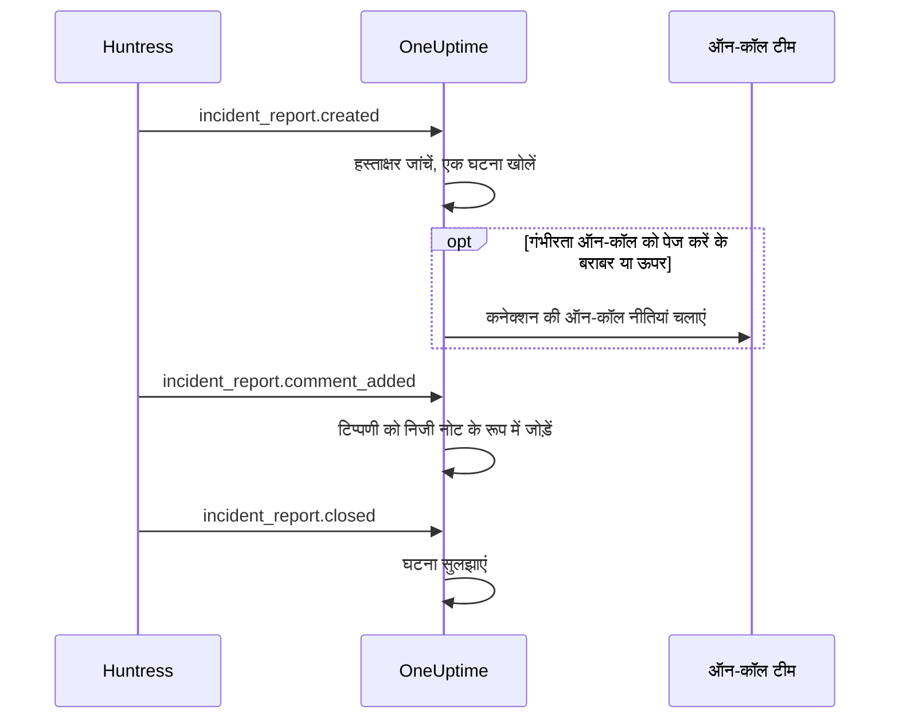

# Huntress इंटीग्रेशन

Huntress घटना रिपोर्टों के लिए अपनी ऑन-कॉल टीम को पेज करें। जब Huntress SOC किसी एंडपॉइंट या पहचान के बारे में घटना रिपोर्ट भेजता है, तो OneUptime उसके लिए एक घटना खोलता है, आपकी चुनी गंभीरता पर, आपकी चुनी ऑन-कॉल नीतियों को पेज करता है, और Huntress में रिपोर्ट बंद होने पर घटना सुलझा देता है।

यह इंटीग्रेशन **इनबाउंड** है: Huntress किसी घटना रिपोर्ट का हर इवेंट OneUptime से मिले वेबहुक URL पर भेजता है, एंडपॉइंट के साइनिंग सीक्रेट से हस्ताक्षरित करके। OneUptime कभी Huntress को कॉल नहीं करता, इसलिए उसे Huntress API कुंजी की ज़रूरत नहीं है।

:::cards
- [यह कैसे काम करता है](#यह-कैसे-काम-करता-है): रिपोर्ट के हर इवेंट के साथ OneUptime क्या करता है।
- [सेट अप](#इंटीग्रेशन-सेट-अप-करें): OneUptime में कनेक्ट करें, Huntress में एंडपॉइंट जोड़ें, उसका साइनिंग सीक्रेट सहेजें, टेस्ट भेजें।
- [सेटिंग्स](#सेटिंग्स): पेजिंग, गंभीरता, संगठन, लेबल और सुलझाना।
- [समस्या निवारण](#समस्या-निवारण): कनेक्शन की त्रुटियों का मतलब, और क्या बदलें।
:::

## यह कैसे काम करता है

Huntress किसी घटना रिपोर्ट के बारे में इवेंट तब भेजता है जब रिपोर्ट भेजी जाती है, जब कोई उस पर टिप्पणी करता है और जब वह बंद होती है। हर इवेंट में पूरी रिपोर्ट होती है।

1. **जांचें।** अनुरोध पर एंडपॉइंट के साइनिंग सीक्रेट से हस्ताक्षर होना चाहिए, पहुंचने से अधिकतम पांच मिनट पहले। बाकी सब अस्वीकार होता है, और कनेक्शन का पेज बताता है क्यों।
2. **एक घटना खोलें।** किसी रिपोर्ट का पहला इवेंट रिपोर्ट के नाम वाली घटना खोलता है, जैसे `Huntress: Incident on DESKTOP-01 (Acme Corp)`। इसके विवरण में रिपोर्ट का सारांश, Huntress में उसकी गंभीरता, संगठन, प्रभावित होस्ट या पहचान, Huntress को मिले संकेतक, और Huntress में रिपोर्ट का लिंक होता है। उसी रिपोर्ट के बाद के इवेंट, और Huntress की दोबारा भेजी डिलीवरी, इसी घटना तक पहुंचती हैं: एक रिपोर्ट कभी दो घटनाएं नहीं खोलती।
3. **पेज करें।** घटना उस घटना गंभीरता पर खुलती है जो कनेक्शन रिपोर्ट की Huntress गंभीरता को देता है। जब वह गंभीरता **ऑन-कॉल को पेज करें** के बराबर या उससे ऊपर हो, तो कनेक्शन की **ऑन-कॉल नीतियां** चलती हैं।
4. **रिपोर्ट के साथ चलें।** Huntress में जोड़ी गई टिप्पणी घटना पर निजी नोट बन जाती है। जब रिपोर्ट बंद या खारिज होती है, तो घटना सुलझ जाती है।

इस तरह खुली घटनाएं कभी स्टेटस पेज पर नहीं दिखतीं। आपके घटना नियम (ऑन-कॉल, मालिक, लेबल और गोपनीयता नियम) इन पर भी किसी दूसरी घटना की तरह लागू होते हैं।

## शुरू करने से पहले

- OneUptime में **Project Owner** या **Project Admin** भूमिका। सदस्य, व्यूअर और घटना भूमिकाएं कनेक्शन और उसकी मिली रिपोर्टें देख सकती हैं, पर उसे बदल नहीं सकतीं।
- Huntress में **Account Admin** भूमिका: केवल खाता एडमिन वेबहुक जोड़ सकते हैं।
- पेज करने के लिए एक ऑन-कॉल नीति। इसके बिना रिपोर्टें घटनाएं खोलती हैं और किसी को पेज नहीं करतीं, जब तक कोई घटना ऑन-कॉल नियम उनसे मेल न खाए।
- सेल्फ-होस्टेड इंस्टॉलेशन पर, ऐसा OneUptime जिस तक Huntress इंटरनेट से HTTPS पर पहुंच सके: Huntress वेबहुक केवल `https://` URL पर भेजता है।

## इंटीग्रेशन सेट अप करें

:::steps
### OneUptime में Huntress कनेक्ट करें

**घटनाएं → इंटीग्रेशन → Huntress** (`/dashboard/{projectId}/incidents/integrations/huntress`) खोलें। घटनाओं के साइड मेनू का **इंटीग्रेशन** सेक्शन डिफ़ॉल्ट रूप से बंद रहता है, इसलिए पहले उसे खोलें। **Huntress कनेक्ट करें** पर क्लिक करें।

पेज करने के लिए **ऑन-कॉल नीतियां** चुनें। फिर **ऑन-कॉल को पेज करें** पूछता है कि कौन-सी रिपोर्टें उन्हें पेज करें, और **उच्च और गंभीर रिपोर्टें** से शुरू होता है। बाकी सब डिफ़ॉल्ट के साथ **और फ़ील्ड** में रहता है ([सेटिंग्स](#सेटिंग्स) देखें)। **Huntress कनेक्ट करें** पर क्लिक करें। कनेक्शन का पेज खुलता है, जिसमें **Huntress कनेक्ट करें** कार्ड अगले तीन चरणों में आपकी मदद करता है।

### Huntress में वेबहुक एंडपॉइंट जोड़ें

कनेक्शन के पेज पर **वेबहुक URL कॉपी करें** पर क्लिक करें। URL `https://oneuptime.com/api/huntress/webhook/<connection-id>` जैसा दिखता है; सेल्फ-होस्टेड इंस्टॉलेशन पर यह आपके अपने होस्ट से शुरू होता है।

Huntress में ऊपर दाईं ओर का मेनू खोलें और **Integrations** चुनें। **Add an Integration** पर क्लिक करें, **Webhooks** चुनें और **Add Endpoint** पर क्लिक करें। URL चिपकाएं, **Incident Reports** चालू करें और सहेजें। **Escalations**, **Platform Actions** और **Account Notices** बंद ही रहने दें: OneUptime ये इवेंट ले लेता है और इनके साथ कुछ नहीं करता।

### एंडपॉइंट का साइनिंग सीक्रेट सहेजें

Huntress में एंडपॉइंट का मेनू (⋯) खोलें और **View Signing Secret** चुनें। पूरा कॉपी करें: यह `whsec_` से शुरू होता है। कनेक्शन के पेज पर **साइनिंग सीक्रेट सहेजें** पर क्लिक करें, इसे चिपकाएं और **साइनिंग सीक्रेट सहेजें** पर क्लिक करें। सीक्रेट एन्क्रिप्ट किया जाता है और फिर कभी नहीं दिखाया जाता।

जब तक सीक्रेट सहेजा नहीं जाता, OneUptime URL पर आने वाला हर अनुरोध अस्वीकार करता है। Huntress अस्वीकार हुए इवेंट को बाद में दोबारा भेजता है, इसलिए अभी अस्वीकार हुआ इवेंट भी पहुंच जाता है।

### टेस्ट भेजें

Huntress में एंडपॉइंट का मेनू (⋯) खोलें और **Send Test** चुनें। कुछ ही सेकंड में कनेक्शन के पेज का कार्ड **कनेक्शन** बन जाता है, जिसकी स्थिति **रिपोर्टें मिल रही हैं** होती है।

> [!NOTE]
> टेस्ट में जो भी हो, कनेक्शन दिखाता है कि वह पहुंच गया। घटना रिपोर्ट वाला टेस्ट किसी दूसरी रिपोर्ट की तरह घटना खोलता है, और काफ़ी गंभीर हो तो ऑन-कॉल को पेज करता है।
:::

## सेटिंग्स

**Huntress कनेक्ट करें** केवल यह पूछता है कि किसे पेज किया जाए और किन रिपोर्टों के लिए। बाकी सब **और फ़ील्ड** में रहता है, ऐसे डिफ़ॉल्ट के साथ जो ज़्यादातर टीमों के लिए ठीक है। बाद में कोई सेटिंग बदलने के लिए कनेक्शन के **सेटिंग्स** कार्ड पर **सेटिंग्स संपादित करें** पर क्लिक करें।

| सेटिंग | यह क्या करती है | डिफ़ॉल्ट |
| --- | --- | --- |
| **ऑन-कॉल नीतियां** | रिपोर्ट काफ़ी गंभीर होने पर चलने वाली नीतियां। किसी को पेज किए बिना घटनाएं खोलने के लिए खाली छोड़ें। | कोई नहीं |
| **ऑन-कॉल को पेज करें** | कौन-सी रिपोर्टें नीतियों को पेज करें: **केवल गंभीर रिपोर्टें**, **उच्च और गंभीर रिपोर्टें** या **हर रिपोर्ट**। हर रिपोर्ट किसी भी हाल में घटना खोलती है। | **उच्च और गंभीर रिपोर्टें** |
| **नाम** | OneUptime में कनेक्शन का नाम। | `Huntress` |
| **गंभीर रिपोर्टों के लिए गंभीरता**, **उच्च रिपोर्टों के लिए गंभीरता**, **निम्न रिपोर्टों के लिए गंभीरता** | हर Huntress गंभीरता किस घटना गंभीरता पर खुलती है। | आपकी तीन सबसे ऊँची घटना गंभीरताएं, क्रम से |
| **केवल ये संगठन** | वे Huntress संगठन जिनकी रिपोर्टें घटनाएं खोलती हैं, हर पंक्ति में एक संगठन का नाम या ID। नामों में बड़े-छोटे अक्षर का फ़र्क नहीं पड़ता। | खाली: हर संगठन |
| **लेबल** | हर घटना में जोड़े जाने वाले लेबल, रिपोर्ट के संगठन के नाम वाले लेबल के अलावा। | कोई नहीं |
| **Huntress के रिपोर्ट बंद करने पर सुलझाएं** | Huntress में रिपोर्ट बंद या खारिज होने पर घटना सुलझाएं। बंद होने पर, इसके बजाय घटना पर एक निजी नोट यह बताता है। | चालू |

### गंभीरता

Huntress हर घटना रिपोर्ट को तीन में से एक गंभीरता देता है। जब तक आप किसी के लिए घटना गंभीरता न चुनें, रिपोर्ट आपकी घटना गंभीरताओं के क्रम से खुलती है, जैसे **घटनाएं → सेटिंग्स → घटना गंभीरता** उन्हें दिखाता है:

| Huntress गंभीरता | Huntress इससे क्या समझता है | घटना गंभीरता |
| --- | --- | --- |
| Critical | कीबोर्ड पर सक्रिय हमलावर, ख़तरनाक मैलवेयर या जारी सेंधमारी, जिसे तुरंत रोकना है। | सबसे ऊँची |
| High | पुष्ट मैलवेयर जिसे तुरंत ठीक करना ज़रूरी है, या पहचान से समझौता जिस पर कार्रवाई चाहिए। | दूसरी |
| Low | संभावित रूप से अवांछित प्रोग्राम, मैलवेयर के अवशेष और पहचान से जुड़े पुराने निष्कर्ष। | तीसरी |

कम गंभीरताओं वाला प्रोजेक्ट बाकी के लिए अपनी सबसे निचली गंभीरता इस्तेमाल करता है। बिना गंभीरता वाली रिपोर्ट को उच्च माना जाता है। अगर आपकी चुनी गंभीरता हटा दी जाए, तो फिर से क्रम तय करता है।

### संगठन

हर घटना को रिपोर्ट के Huntress संगठन के नाम वाला लेबल मिलता है, जैसे _Acme Corp_। एक कनेक्शन आपके Huntress खाते के हर संगठन की रिपोर्टें पाता है, और **केवल ये संगठन** इसे सीमित करता है।

> [!TIP]
> हर ग्राहक की अपनी टीम को पेज करने के लिए, कनेक्शन की **ऑन-कॉल नीतियां** खाली छोड़ें और हर संगठन के लिए एक घटना ऑन-कॉल नियम जोड़ें, जैसे "अगर **घटना लेबल** में _Acme Corp_ में से कोई भी है", जो उस ग्राहक की नीति चलाए। [घटना ऑन-कॉल नियम](/docs/incidents/settings#घटना-ऑन-कॉल-नियम) देखें।

## कनेक्शन के पेज पर रिपोर्टें

कनेक्शन की **घटना रिपोर्टें** सूची Huntress की भेजी हर रिपोर्ट दिखाती है, सबसे नई पहले: प्रभावित होस्ट या पहचान, Huntress में उसकी गंभीरता और स्थिति, और उसका **परिणाम**।

| परिणाम | क्या हुआ |
| --- | --- |
| **घटना खोली गई** | रिपोर्ट ने एक घटना खोली। **घटना देखें** उसे खोलता है; **ऑन-कॉल को पेज किया गया** बताता है कि कनेक्शन ने अपनी नीतियों को पेज किया। |
| **घटना सुलझाई गई** | Huntress ने रिपोर्ट बंद की, और उसकी घटना सुलझा दी गई। |
| **छोड़ा गया: संगठन पर नज़र नहीं रखी जाती** | रिपोर्ट का संगठन **केवल ये संगठन** में नहीं है। |
| **छोड़ा गया: Huntress में पहले से बंद** | जब OneUptime को पहली बार रिपोर्ट की ख़बर मिली, तब वह पहले से बंद थी। |

छोड़ी गई रिपोर्ट बाद में सेटिंग्स बदलने पर भी छोड़ी हुई ही रहती है। जब **Huntress के रिपोर्ट बंद करने पर सुलझाएं** बंद हो, तो बंद रिपोर्ट का परिणाम **घटना खोली गई** ही रहता है।

## सुरक्षा

- **केवल हस्ताक्षरित अनुरोध।** OneUptime, Huntress के भेजे `svix-id`, `svix-timestamp` और `svix-signature` हेडर को अनुरोध की बॉडी से वैसे ही मिलाता है जैसी वह पहुंची। जो अनुरोध सहेजे गए सीक्रेट से हस्ताक्षरित न हो, या पांच मिनट से ज़्यादा पहले या बाद में हस्ताक्षरित हुआ हो, वह अस्वीकार होता है।
- **सीक्रेट गुप्त रहता है।** इसे एन्क्रिप्ट करके रखा जाता है, API इसे कभी नहीं लौटाता और यह फिर कभी नहीं दिखाया जाता। कनेक्शन के पेज पर **साइनिंग सीक्रेट बदलें** दूसरा सीक्रेट सहेजता है, जैसे किसी नए एंडपॉइंट का सीक्रेट।
- **URL एक पता है, पासवर्ड नहीं।** यह कनेक्शन को दर्शाता है; केवल एंडपॉइंट के सीक्रेट से हस्ताक्षरित अनुरोध पर कार्रवाई होती है।
- **हर कनेक्शन के लिए एक एंडपॉइंट।** हर कनेक्शन का अपना URL और सीक्रेट होता है। दूसरे Huntress खाते की रिपोर्टें पाने के लिए फिर से कनेक्ट करें।

## इसके बजाय ईमेल इस्तेमाल करें

Huntress घटना रिपोर्टें ईमेल से भी भेजता है, और एक [आने वाले ईमेल मॉनिटर](/docs/monitor/incoming-email-monitor) उन ईमेल से घटनाएं खोल सकता है, जैसे जब विषय में `Critical Incident Report` हो। लेकिन वह ईमेल को एक मॉनिटर की स्थिति की तरह देखता है: जब तक उसकी घटना खुली है, अगली रिपोर्ट कोई घटना नहीं खोलती, और घटना Huntress के रिपोर्ट बंद करने पर नहीं, बल्कि मॉनिटर के मानदंडों से सुलझती है। Huntress कनेक्शन हर रिपोर्ट के लिए एक घटना खोलता है और हर घटना को उसकी रिपोर्ट के साथ सुलझाता है, इसलिए इसे चुनें। कनेक्शन को रिपोर्टें मिलने लगें, तो मॉनिटर को ईमेल भेजना बंद करें, नहीं तो हर रिपोर्ट दो बार पेज करेगी।

## समस्या निवारण

जब OneUptime कोई अनुरोध अस्वीकार करता है, तो कनेक्शन का पेज **पिछला अनुरोध अस्वीकार किया गया** के नीचे कारण दिखाता है। Huntress में, एंडपॉइंट के मेनू (⋯) में **View Delivery Attempts** हर डिलीवरी को OneUptime के जवाब के साथ दिखाता है।

:::details "A request arrived but was refused, because no signing secret is saved for this connection yet"
एंडपॉइंट का साइनिंग सीक्रेट सहेजें: [इंटीग्रेशन सेट अप करें](#इंटीग्रेशन-सेट-अप-करें) देखें। Huntress अस्वीकार हुआ अनुरोध दोबारा भेजता है।
:::

:::details "The request's signature does not match the signing secret"
सहेजा गया सीक्रेट इस एंडपॉइंट का नहीं है। हर एंडपॉइंट का अपना सीक्रेट होता है: Huntress में एंडपॉइंट का मेनू (⋯) खोलें, **View Signing Secret** चुनें, पूरा कॉपी करें और **साइनिंग सीक्रेट बदलें** से सहेजें।
:::

:::details "The request was signed more than five minutes from now"
Huntress और आपके OneUptime सर्वर की घड़ियों में पांच मिनट से ज़्यादा का अंतर है, या अनुरोध किसी पुराने अनुरोध का दोहराव है। सेल्फ-होस्टेड इंस्टॉलेशन पर जांचें कि सर्वर की घड़ी सही है।
:::

:::details "No Huntress connection has this address."
कनेक्शन हटा दिया गया है, या Huntress में एंडपॉइंट का URL इस कनेक्शन का नहीं है। कनेक्शन के पेज पर **वेबहुक URL कॉपी करें** पर क्लिक करें और URL को Huntress के एंडपॉइंट में फिर से चिपकाएं।
:::

:::details "This project has no incident severities, so a Huntress report cannot open an incident"
**घटनाएं → सेटिंग्स → घटना गंभीरता** में एक गंभीरता जोड़ें। Huntress रिपोर्ट दोबारा भेजता है।
:::

:::details किसी को पेज नहीं किया गया
**ऑन-कॉल को पेज करें** से नीचे की रिपोर्ट बिना पेज किए घटना खोलती है। **घटना रिपोर्टें** सूची में, किसी रिपोर्ट के परिणाम के नीचे **ऑन-कॉल को पेज किया गया** बताता है कि कनेक्शन ने पेज किया। घटना का **ऑन-कॉल निष्पादन** पेज दिखाता है कि हर नीति ने क्या किया।
:::

## अगले कदम

:::cards
- [घटना ऑन-कॉल नियम](/docs/incidents/settings#घटना-ऑन-कॉल-नियम): हर संगठन की अपनी टीम को उसके लेबल से पेज करें।
- [घटना स्थितियाँ और गंभीरता](/docs/incidents/states-and-severities): उन गंभीरताओं का क्रम तय करें जिन पर Huntress रिपोर्टें खुलती हैं।
- [एस्केलेशन नियम](/docs/on-call/escalation-rules): तय करें कि किसे पेज किया जाए, और पेज कब आगे बढ़े।
- [इंटिग्रेशन अवलोकन](/docs/integrations/index): वे दूसरे टूल जिन्हें आप कनेक्ट कर सकते हैं।
:::
