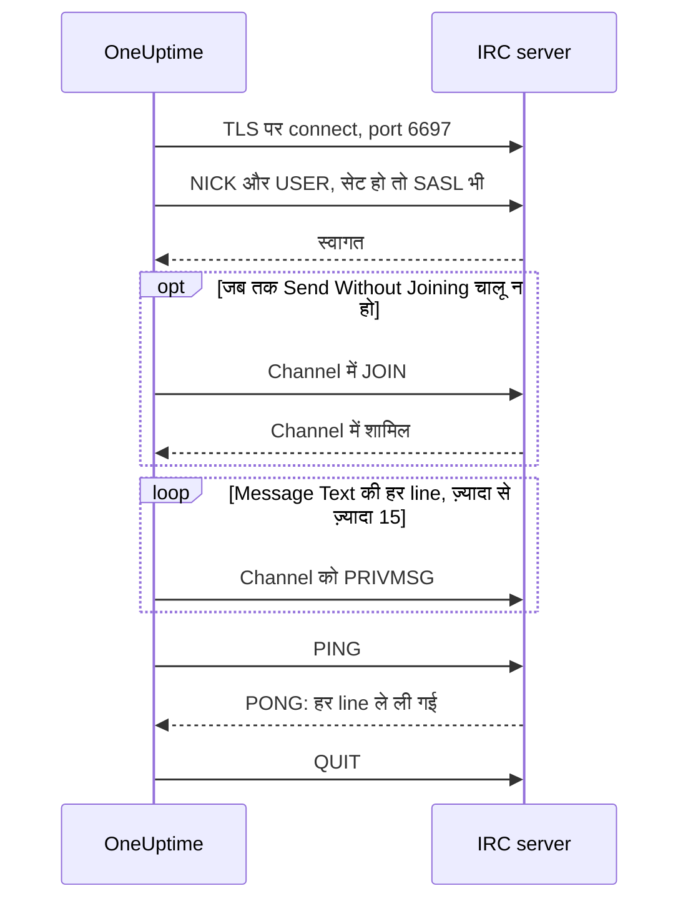

# IRC Integration

किसी भी IRC network के channel में incident updates पोस्ट कीजिए: Libera.Chat, OFTC या आपका अपना server।

IRC में webhooks नहीं होते, इसलिए OneUptime का workflow step **Send Message to IRC** किसी भी IRC client की तरह ख़ुद server से connect होता है। न कुछ install करना है, न कोई app register करना है। यह इंटीग्रेशन **आउटबाउंड** है: OneUptime channel में पोस्ट करता है, और वहाँ कही गई बातें नहीं पढ़ता।

:::cards
- [यह कैसे काम करता है](#यह-कैसे-काम-करता-है): Step का एक run server से क्या बात करता है।
- [सेटअप](#इंटीग्रेशन-सेट-अप-करें): Server और channel, passwords, फिर workflow: template से या शुरू से।
- [सुझाव](#सुझाव): Channel join किए बिना पोस्ट करना, SASL, लंबे messages और एक साथ कई runs।
- [समस्या निवारण](#समस्या-निवारण): Step की errors का मतलब, और क्या बदलना है।
:::

## यह कैसे काम करता है

Step का हर run IRC server से एक छोटी-सी बातचीत करता है, जैसे कोई IRC client करता, और फिर connection बंद कर देता है।

1. **Connect.** Step TLS पर port `6697` से connect होता है और server का certificate जाँचता है।
2. **Register.** जब तक आप कोई और **Nickname** सेट न करें, यह `OneUptime` नाम से register होता है, और **SASL Username** व **SASL Password** भरे हों तो SASL से sign in करता है।
3. **Join.** जब तक **Send Without Joining** चालू न हो, यह channel join करता है; channel की key हो तो **Channel Key** के साथ।
4. **Send.** **Message Text** की हर line अपना अलग IRC message बनकर जाती है, एक `PRIVMSG`।
5. **Confirm.** IRC कभी "delivered" नहीं बताता, इसलिए step एक `PING` भेजता है और server के `PONG` का इंतज़ार करता है। Server क्रम से जवाब देता है, इसलिए तब तक message का कोई भी इनकार पहुँच चुका होता है।
6. **Quit.** यह server छोड़ देता है।

Server के हर line ले लेने पर step अपने **सफलता** output पर जाता है। Server तक न पहुँच पाने पर, या server के connection, nickname, किसी password, channel या message को ठुकराने पर, यह **त्रुटि** output पर जाता है, और server ने कारण बताया हो तो उसी के शब्दों में बताता है।

## शुरू करने से पहले

- OneUptime Cloud पर **Growth** plan या उससे ऊँचा: workflows और उनके variables इसी में आते हैं। बिना billing वाले self-hosted installations पर कोई plan limit नहीं है।
- Workflows बनाने वाला role: **Project Owner**, **Project Admin** या **Workflow Admin**।
- IRC network पर एक account, अगर network sign in माँगता हो। Libera.Chat कुछ cloud और VPN addresses से आने वाले connections के लिए यह माँगता है।

## इंटीग्रेशन सेट अप करें

:::steps
### Server और channel चुनें

तय कीजिए कि messages कहाँ जाएँगे: server का host name, जैसे `irc.libera.chat`, और channel, जैसे `#your-channel`।

- **IRC Server** में सिर्फ़ host name आता है, और कुछ नहीं: न `ircs://`, न port। Step TLS पर port `6697` से connect होता है। अगर आपका server किसी और port पर TLS लेता है, तो उसे **और फ़ील्ड** के नीचे **Port** में सेट कीजिए।
- **Channel** एक channel ही होना चाहिए। वहाँ लिखा nickname ठुकरा दिया जाता है, ताकि step ग़लती से किसी को private message न भेजे।

Server ऐसा होना चाहिए जिससे OneUptime को connect करने की अनुमति हो। Loopback (`localhost`, `127.0.0.1`), link-local और cloud metadata addresses हमेशा ठुकराए जाते हैं। OneUptime Cloud पर private network address वाला server भी ठुकराया जाता है। Self-hosted installation अपने network का IRC server तक पहुँच सकता है, जब तक `DATA_SOURCE_BLOCK_PRIVATE_ADDRESSES` को `true` पर सेट न किया गया हो।

### Passwords को secret variables में रखें

अगर आपके server, network और channel को किसी password की ज़रूरत नहीं है, तो यह step छोड़ दीजिए। वरना हर password को एक secret [ग्लोबल वेरिएबल](/docs/workflows/variables#ग्लोबल-वेरिएबल) में रखिए। तब workflow में password की जगह variable का नाम रहता है, और password बदलने के लिए एक ही जगह बदलना पड़ता है।

| Setting             | कब भरें                                                                                            | Variable, उदाहरण के लिए |
| ------------------- | -------------------------------------------------------------------------------------------------- | ----------------------- |
| **Server Password** | Connect करते समय server या आपका bouncer password माँगता है।                                        | `IRC_SERVER_PASSWORD`   |
| **SASL Password**   | Network चाहता है कि आप अपने account में sign in करें। **SASL Username** में account का नाम आता है। | `IRC_SASL_PASSWORD`     |
| **Channel Key**     | Channel की एक key है (mode `+k`)।                                                                  | `IRC_CHANNEL_KEY`       |

एक variable रखने के लिए **वर्कफ़्लो → ग्लोबल वेरिएबल** खोलिए और **वर्कफ़्लो वेरिएबल बनाएँ** दबाइए। **नाम** में नाम लिखिए और **अगला** दबाइए। Password को **सामग्री** में paste कीजिए, **रहस्य** चालू कीजिए, और **वर्कफ़्लो वेरिएबल बनाएँ** दबाइए। Run logs में secret variable की value की जगह `[REDACTED]` दिखता है।

### Workflow बनाएँ

Template से शुरू कीजिए, जो पूरा workflow आपके लिए बना देता है, या शुरू से बनाइए।

:::tabs
@tab Template से
1. **वर्कफ़्लो** खोलिए और **वर्कफ़्लो बनाएं** दबाइए।
2. **टेम्पलेट खोजें…** में `IRC` लिखिए, **Tell IRC when an incident opens** पर क्लिक कीजिए, फिर **यह टेम्पलेट इस्तेमाल करें** दबाइए।
3. नाम **Notify IRC on new incident** रहने दीजिए या बदल दीजिए, और **अगला** दबाइए।
4. **IRC Server** और **IRC Channel** भरिए और **वर्कफ़्लो बनाएं** दबाइए।

Workflow **बिल्डर** में तीन steps के साथ खुलता है: **On Create Incident**; **Send Message to IRC**, जो incident का number, title, severity और state दो lines में पोस्ट करता है; और उसके **त्रुटि** output पर एक **लॉग** step, जो लिखता है कि message क्यों नहीं पहुँचा। Server और channel workflow के variables `ircServer` और `ircChannel` में रखे जाते हैं। अगर पिछले step में आपने passwords रखे थे, तो **Send Message to IRC** पर क्लिक कीजिए, **और फ़ील्ड** खोलिए, और हर variable को उसकी setting के **{ }** बटन से चुनिए।
@tab शुरू से
1. **वर्कफ़्लो** खोलिए, **वर्कफ़्लो बनाएं** दबाइए, **शुरू से बनाएं** चुनिए, workflow को नाम दीजिए और **वर्कफ़्लो बनाएं** दबाइए।
2. **बिल्डर** में **Choose what starts this workflow** पर क्लिक कीजिए और **Popular** के नीचे **On Create Incident** चुनिए। Trigger पर क्लिक कीजिए और **Select Fields** में incident के वे fields चुनिए जो आपका message दिखाता है, जैसे उसका title।
3. **घटक जोड़ें** दबाइए, `irc` खोजिए और **Send Message to IRC** पर क्लिक कीजिए। Trigger के **सफलता** output को इस step से जोड़िए।
4. नए step पर क्लिक कीजिए और **IRC Server**, **Channel** और **Message Text** भरिए। **Message Text** का **{ }** बटन incident के fields डालता है, जैसे उसका title।
5. अगर पिछले step में आपने passwords रखे थे, तो **और फ़ील्ड** खोलिए। **Server Password**, **SASL Password** या **Channel Key** में **{ }** पर क्लिक कीजिए और **Global variables** के नीचे से variable चुनिए। **SASL Username** में अपने account का नाम लिखिए।
:::

### चालू करें और जाँचें

**बिल्डर** में सबसे ऊपर **सक्षम** switch चालू कीजिए। अब से हर नया incident channel में पोस्ट होगा।

बिना नया incident खोले जाँचने के लिए **वर्कफ़्लो चलाएं** दबाइए और किसी मौजूदा incident का ID **घटना ID** में डालिए। Incident के page पर उसका ID दिखता है। **Run Workflow Manually** दबाइए और **Run** से पुष्टि कीजिए। **वर्कफ़्लो रन** panel run के साथ चलता है: IRC step का log बताता है कि उसने कितनी lines भेजीं, जैसे `Sent 2 lines to #your-channel.`, और message channel में दिख जाता है। अगर step इसके बजाय **त्रुटि** पर जाए, तो उसका log कारण बताता है: [समस्या निवारण](#समस्या-निवारण) देखिए।
:::

## सुझाव

- **Join किए बिना पोस्ट करें।** ज़्यादातर channels सिर्फ़ अपने members के messages लेते हैं (mode `+n`), इसलिए step पोस्ट करने से पहले channel join करता है और तुरंत बाद निकल जाता है। `-n` वाला channel बाहर से आए messages भी लेता है: **और फ़ील्ड** के नीचे **Send Without Joining** चालू कीजिए, तो channel को step आता-जाता नहीं दिखेगा।
- **SASL से sign in करें।** SASL इस्तेमाल करने वाले networks पर, जैसे Libera.Chat, अपने account में sign in करने के लिए **SASL Username** और **SASL Password** भरिए। Libera.Chat कुछ cloud और VPN addresses से आने वाले connections के लिए इसे ज़रूरी रखता है। [Libera.Chat की SASL guide](https://libera.chat/guides/sasl) देखिए।
- **15 lines की सीमा का ध्यान रखें।** **Message Text** की हर line अपना अलग IRC message है, लंबी line फ़िट होने के लिए बाँट दी जाती है, और ख़ाली lines छोड़ दी जाती हैं। एक message ज़्यादा से ज़्यादा 15 IRC lines में भेजा जाता है: इससे लंबा message काट दिया जाता है, और उसकी आख़िरी line यह बताती है। पहली चार lines तुरंत जाती हैं और बाक़ी एक सेकंड में एक, IRC clients की रफ़्तार से, इसलिए 15 lines में लगभग 11 सेकंड लगते हैं।
- **एक साथ आए runs को एक message में समेटें।** हर run अपना अलग connection है, और IRC networks तय करते हैं कि एक address कितनी बार connect कर सकता है। एक साथ बहुत सारे runs `Reconnecting too fast` जैसे कारण से ठुकराए जा सकते हैं, और किसी भी दूसरे इनकार की तरह **त्रुटि** पर जाते हैं। जो workflow एक मिनट में कई बार चल सकता है, उसकी बातें एक message में समेटिए, या उसे अपने server से भेजिए।
- **IRC के अपने codes से formatting करें।** IRC में Markdown नहीं है, इसलिए text जैसा लिखा है वैसा ही जाता है। IRC के formatting codes, जैसे bold और रंग, काम करते हैं।
- **बिना TLS वाला server.** **Disable TLS** सिर्फ़ उस server के लिए चालू कीजिए जो TLS नहीं देता: तब step port `6667` से connect होता है, और कोई भी password बिना encryption के जाता है। अपनी certificate authority के जारी किए server certificate पर भरोसा करने के लिए, self-hosted installation इसके बजाय `NODE_EXTRA_CA_CERTS` सेट करता है।
- **दूसरा nickname.** जब तक आप **Nickname** सेट न करें, messages `OneUptime` से आते हैं। Nickname पहले से लिया हुआ हो, तो step उसमें underscore या कोई number जोड़ देता है।

## समस्या निवारण

जब step **त्रुटि** पर जाता है, तो run log कारण बताता है, ऐसे वाक्य में जो इनमें से किसी एक की तरह शुरू होता है।

:::details "The IRC server refused the connection"
Server ने, या आपके bouncer ने, connection ठुकरा दिया, और message उसके कारण के साथ ख़त्म होता है। जब server password चाहता है, तो message यह बताता है: **Server Password** भरिए, या उसे जाँचिए।
:::

:::details "SASL sign-in failed"
Network ने account या password ठुकरा दिया। **SASL Username** और **SASL Password** जाँचिए।
:::

:::details "Could not join #your-channel"
Channel ने step को अंदर नहीं आने दिया, उस कारण से जो message बताता है। Key वाले channel को वह key **Channel Key** में चाहिए।
:::

:::details "Could not send to #your-channel"
Server ने message ठुकरा दिया, उस कारण से जो error message बताता है। **Send Without Joining** चालू हो, तो हो सकता है channel सिर्फ़ अपने members के messages लेता हो: उसे बंद कीजिए।
:::

:::details "The TLS certificate of the IRC server … is not trusted"
Server का certificate ऐसा नहीं है जिस पर OneUptime भरोसा करता हो। Self-hosted installation `NODE_EXTRA_CA_CERTS` से अपनी certificate authority पर भरोसा कर सकता है। **Disable TLS** सिर्फ़ उस server के लिए चालू कीजिए जो TLS नहीं देता।
:::

## आगे क्या

:::cards
- [Components → IRC](/docs/workflows/components#irc): Step की हर setting, और उसके outputs का मतलब।
- [Variables](/docs/workflows/variables#ग्लोबल-वेरिएबल): Secret global variables, और steps उनका इस्तेमाल कैसे करते हैं।
- [Runs](/docs/workflows/runs-and-logs): पढ़िए कि workflow के हर run ने क्या किया।
- [Integrations का परिचय](/docs/integrations/index): आउटबाउंड pattern, और वे दूसरे tools जिन्हें आप जोड़ सकते हैं।
:::
