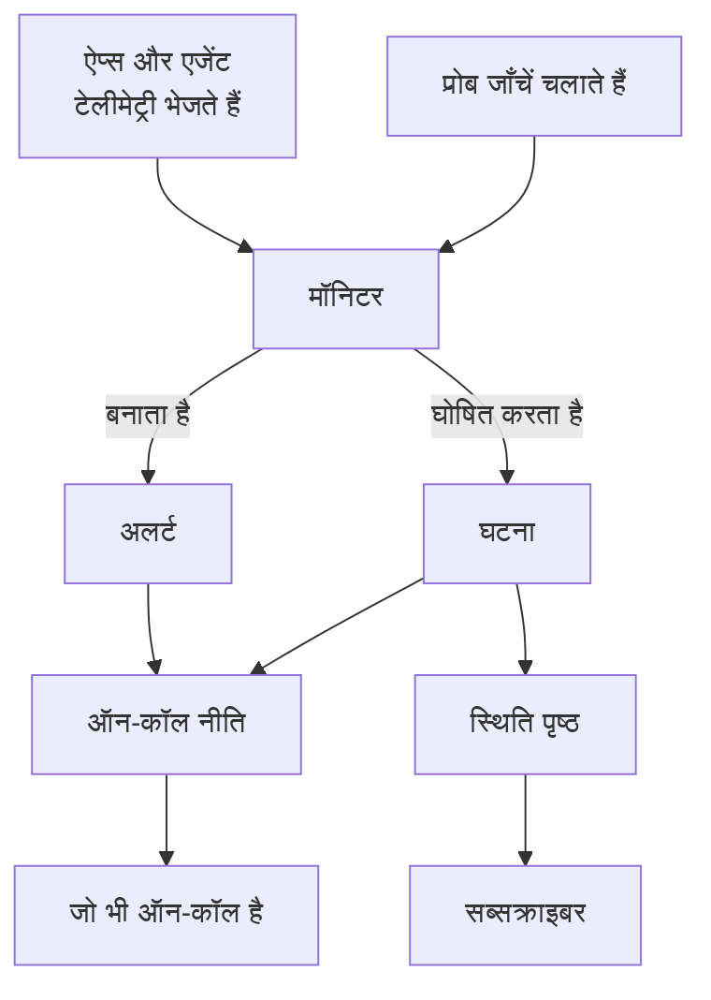

# मुख्य अवधारणाएँ

OneUptime में कई उत्पाद हैं, लेकिन वे कुछ ही विचारों पर टिके हैं: प्रोजेक्ट, मॉनिटर, घटनाएँ और अलर्ट, ऑन-कॉल, स्थिति पृष्ठ और टेलीमेट्री। यह पेज हर विचार को कुछ वाक्यों में समझाता है, दिखाता है कि वे कैसे जुड़ते हैं, और उन पेजों से लिंक करता है जहाँ हर एक का पूरा विवरण है। इसे एक बार पढ़ लें, तो डॉक्स का हर दूसरा पेज आसानी से पढ़ा जाता है।

:::cards
- [प्रोजेक्ट और लोग](#प्रोजेक्ट-और-लोग): सब कुछ कहाँ रहता है, और कौन क्या कर सकता है।
- [मॉनिटर और प्रोब](#मॉनिटर-और-प्रोब): OneUptime कैसे पहचानता है कि कुछ गड़बड़ है।
- [घटनाएँ और अलर्ट](#घटनाएँ-और-अलर्ट): वह रिकॉर्ड जिससे आपकी टीम काम करती है।
- [ऑन-कॉल](#ऑन-कॉल): किसे, कैसे पेज किया जाता है, और अगला कौन है।
:::

## हिस्से कैसे जुड़ते हैं

कोई समस्या OneUptime में एक ही दिशा में चलती है। प्रोब और आपकी अपनी टेलीमेट्री मॉनिटर को डेटा देते हैं। मॉनिटर के मानदंड तय करते हैं कि कब कुछ गड़बड़ है और क्या खोलना है: एक घटना, एक अलर्ट, या दोनों। ऑन-कॉल नीतियाँ उनके बारे में लोगों को पेज करती हैं, और स्थिति पृष्ठ आपके ग्राहकों को घटनाओं के बारे में बताते हैं।

## प्रोजेक्ट और लोग

एक **प्रोजेक्ट** में सब कुछ होता है: मॉनिटर, घटनाएँ, ऑन-कॉल नीतियाँ, स्थिति पृष्ठ, टेलीमेट्री और सेटिंग्स। ज़्यादातर कंपनियों को एक ही चाहिए, और कुछ हर एनवायरनमेंट या बिज़नेस यूनिट के लिए एक रखती हैं। एक प्रोजेक्ट में आप जो बनाते हैं, वह दूसरे में नहीं दिखता।

आपका **खाता** आपके प्रोजेक्ट से अलग है। एक ईमेल और पासवर्ड वाला एक खाता कितने भी प्रोजेक्ट से जुड़ा हो सकता है; ऊपर बाईं ओर के प्रोजेक्ट पिकर से उनके बीच स्विच करें। [आपका खाता](/docs/introduction/your-account) देखें।

लोग **टीमों** के ज़रिए प्रोजेक्ट में होते हैं, और टीम की अनुमतियाँ तय करती हैं कि उसके सदस्य क्या कर सकते हैं। हर नया प्रोजेक्ट तीन टीमों से शुरू होता है: Owners, जिसमें आप हैं, Admin और Members। OneUptime Cloud पर हर प्रोजेक्ट का अपना प्लान होता है।

:::cards
- [उपयोगकर्ता, टीमें और अनुमतियाँ](/docs/permissions/index): लोगों को आमंत्रित करें और तय करें कि वे क्या कर सकते हैं।
:::

## मॉनिटर और प्रोब

एक **मॉनिटर** आपकी चलाई एक चीज़ को जाँचता है और तय करता है कि वह काम कर रही है या नहीं। ज़्यादातर मॉनिटर **प्रोब** से जाँचे जाते हैं: ऐसी मशीनें जो शेड्यूल पर जाँच चलाती हैं, जैसे कोई पेज माँगना, API कॉल करना, किसी होस्ट को ping करना या डेटाबेस से क्वेरी करना। OneUptime Cloud कई क्षेत्रों में प्रोब चलाता है, स्व-होस्टेड इंस्टॉलेशन अपने प्रोब चलाता है, और आप अपने नेटवर्क के अंदर कस्टम प्रोब जोड़ सकते हैं। दूसरे मॉनिटर इसके बजाय वह पढ़ते हैं जो आप भेजते हैं: आपके ऐप्स की टेलीमेट्री, या वह डेटा जो आपके सर्वर, Kubernetes क्लस्टर और दूसरे इंफ्रास्ट्रक्चर पर लगा एजेंट रिपोर्ट करता है।

मॉनिटर के **मानदंड** तय करते हैं कि हर नतीजे का क्या मतलब है। उन्हें क्रम से जाँचा जाता है, और जो पहला मेल खाता है वह मॉनिटर की स्थिति बदल सकता है, एक घटना घोषित कर सकता है, एक अलर्ट बना सकता है, या तीनों कर सकता है। हर नए प्रोजेक्ट में तीन मॉनिटर स्थितियाँ होती हैं: **कार्यरत**, **प्रदर्शन में गिरावट** और **ऑफ़लाइन**।

:::cards
- [मॉनिटर बनाना](/docs/monitor/create-monitor): एक प्रकार चुनें, बताएँ कि क्या और कितनी बार जाँचना है।
- [कस्टम प्रोब](/docs/probe/custom-probe): वह जाँचें जिस तक सिर्फ़ आपका अपना नेटवर्क पहुँच सकता है।
:::

## घटनाएँ और अलर्ट

दोनों एक समस्या दर्ज करते हैं, और दोनों ऑन-कॉल व्यक्ति को पेज कर सकते हैं। फ़र्क इसमें है कि समस्या किसे प्रभावित करती है।

| | घटना | अलर्ट |
| --- | --- | --- |
| **यह क्या है** | वह समस्या जो आपके उपयोगकर्ताओं को प्रभावित करती है, जैसे आउटेज या धीमापन | वह समस्या जिसे उपयोगकर्ताओं के प्रभावित होने से पहले आपकी टीम को देखना चाहिए |
| **स्थिति पृष्ठों पर** | दिख सकती है, और सब्सक्राइबर को बताती है | कभी नहीं |
| **शुरुआती स्थितियाँ** | **Identified**, **स्वीकार किया गया**, **सुलझाया गया** | **Identified**, **स्वीकार किया गया**, **सुलझाया गया** |
| **शुरुआती गंभीरताएँ** | Critical Incident, Major Incident, Minor Incident | **High**, **Low** |

स्वीकार करना बताता है कि कोई इस पर काम कर रहा है, और ऑन-कॉल नीतियों को अगले स्तर को पेज करने से रोकता है। सुलझाना उसे बंद कर देता है। आप अपनी स्थितियाँ और गंभीरताएँ जोड़ सकते हैं, और अलर्ट को उस घटना से लिंक कर सकते हैं जिसका वे हिस्सा निकले।

एक **एपिसोड** संबंधित घटनाओं, या संबंधित अलर्ट को समूहित करता है, ताकि आपकी टीम उन पर एक साथ काम करे। ग्रुपिंग नियम तय करते हैं कि कौन किसके साथ है।

:::cards
- [घटनाओं का अवलोकन](/docs/incidents/index): घटनाएँ कैसे घोषित की जाती हैं, उन पर कैसे काम होता है और वे कैसे सुलझती हैं।
- [लिंक किए गए अलर्ट](/docs/incidents/linked-alerts): किसी आउटेज से उठे अलर्ट को उसकी घटना से जोड़ें।
:::

## ऑन-कॉल

एक **ऑन-कॉल नीति** तय करती है कि किसी घटना या अलर्ट के बारे में किसे पेज किया जाए, और कोई जवाब न दे तो अगला कौन है। इसके **एस्केलेशन नियम** इसके स्तर हैं: हर स्तर अपने लोगों को पेज करता है, फिर अगले स्तर को पेज करने से पहले किसी के स्वीकार करने का इंतज़ार करता है। एक स्तर लोगों, टीमों, या एक **ऑन-कॉल अनुसूची** को पेज कर सकता है, जो एक रोटेशन है जिसे हर पल पता होता है कि कौन ऑन-कॉल है।

हर व्यक्ति तक कैसे पहुँचा जाए, यह उन पर निर्भर है। **उपयोगकर्ता सेटिंग्स** में हर कोई वे तरीके रखता है जिनसे OneUptime उन तक पहुँच सकता है, जैसे ईमेल, SMS, फ़ोन कॉल, पुश सूचनाएँ, Slack या Microsoft Teams, और यह कि पेज किए जाने पर इनमें से कौन-से इस्तेमाल हों।

:::cards
- [एस्केलेशन नियम](/docs/on-call/escalation-rules): किसी के जवाब देने तक लोगों को स्तर-दर-स्तर पेज करें।
- [ऑन-कॉल अनुसूची](/docs/on-call/schedules): रोटेशन, लेयर और हैंड-ऑफ़।
:::

## स्थिति पृष्ठ और रखरखाव

एक **स्थिति पृष्ठ** आपके ग्राहकों को दिखाता है कि आपकी सेवाएँ काम कर रही हैं या नहीं। आप चुनते हैं कि यह कौन-से मॉनिटर दिखाए, ऐसे नामों से जो आपके ग्राहक समझें। जब उनमें से किसी मॉनिटर पर कोई घटना सक्रिय होती है, तो पेज उसे दिखाता है, और उसके **सब्सक्राइबर** को ईमेल, SMS, Slack, Microsoft Teams या वेबहुक से बताया जाता है। स्थिति पृष्ठ सार्वजनिक हो सकता है, या सिर्फ़ उन लोगों के लिए निजी जिन्हें आप अंदर आने देते हैं।

**अनुसूचित रखरखाव** योजनाबद्ध काम की पहले से घोषणा करता है। एक इवेंट **निर्धारित**, **जारी**, **समाप्त** और **पूर्ण** से होकर गुज़रता है, और जिन स्थिति पृष्ठों पर आप उसे दिखाते हैं वे आगंतुकों और सब्सक्राइबर को उसके बारे में बताते हैं।

:::cards
- [स्थिति पृष्ठ अवलोकन](/docs/status-pages/index): एक स्थिति पृष्ठ बनाएँ और तय करें कि वह क्या दिखाए।
- [सब्सक्राइबर और घोषणाएँ](/docs/status-pages/subscribers): किसे बताया जाता है, और कब।
:::

## टेलीमेट्री

**टेलीमेट्री** वह है जो आपके सिस्टम OneUptime को भेजते हैं: लॉग, मेट्रिक्स, ट्रेस, एक्सेप्शन और प्रोफ़ाइल। ऐप्स इसे OpenTelemetry से भेजते हैं, और OneUptime के एजेंट इसे होस्ट, Kubernetes क्लस्टर, Docker होस्ट और दूसरे इंफ्रास्ट्रक्चर से भेजते हैं। हर भेजने वाला एक **इंजेशन कुंजी** इस्तेमाल करता है, जो **प्रोजेक्ट सेटिंग्स → टेलीमेट्री और APM → इंजेशन कुंजियाँ** में बनाई जाती है। आप टेलीमेट्री खोजते हैं, उसे डैशबोर्ड पर चार्ट करते हैं, और टेलीमेट्री मॉनिटर से उस पर नज़र रखते हैं, जो किसी भी दूसरे मॉनिटर की तरह घटनाएँ और अलर्ट उठाते हैं।

:::cards
- [OpenTelemetry](/docs/telemetry/open-telemetry): अपने ऐप्स से लॉग, मेट्रिक्स और ट्रेस भेजें।
- [लॉग मॉनिटर](/docs/monitor/logs-monitor): जब आपके लॉग में कोई पैटर्न दिखे, तो सूचना पाएँ।
:::

## ऑटोमेशन और AI

- **वर्कफ़्लो** कुछ होने पर क्रियाएँ चलाते हैं, जैसे किसी घटना के घोषित होने पर Slack पर पोस्ट करना।
- **रनबुक** किसी प्रतिक्रिया प्रक्रिया को ऐसे कदमों में बदलते हैं जिन्हें आपकी टीम हाथ से या अपने-आप चला सके।
- **OneUptime AI** नई घटनाओं और अलर्ट की जाँच करता है और जो मिला उसे उनकी टाइमलाइन पर पोस्ट करता है, और **Ask AI** आपके प्रोजेक्ट के बारे में सवालों के जवाब देता है। नया प्रोजेक्ट AI चालू के साथ शुरू होता है; **प्रोजेक्ट सेटिंग्स → एआई → AI Features** में **AI सक्षम करें** स्विच इसे पूरी तरह बंद कर देता है।

:::cards
- [वर्कफ़्लो अवलोकन](/docs/workflows/index): ट्रिगर और कंपोनेंट से क्रियाएँ स्वचालित करें।
- [AI SRE](/docs/ai/ai-sre): OneUptime AI घटनाओं और अलर्ट की जाँच कैसे करता है।
:::

## लेबल और मालिक

**लेबल** वे टैग हैं जो आप मॉनिटर, घटनाओं, स्थिति पृष्ठों और ज़्यादातर दूसरे संसाधनों पर लगाते हैं, ताकि उन्हें फ़िल्टर और समूहित कर सकें। किसी टीम की अनुमतियाँ कुछ लेबल वाले संसाधनों तक सीमित की जा सकती हैं। **मालिक** वे लोग और टीमें हैं जो किसी एक संसाधन के लिए ज़िम्मेदार हैं: उसके साथ कुछ होने पर उन्हें बताया जाता है। लेबल नियम और मालिक नियम नए संसाधनों में अपने-आप लेबल और मालिक जोड़ते हैं।

:::cards
- [लेबल और स्वामी नियम](/docs/configuration/label-and-owner-rules): नए संसाधनों पर अपने-आप लेबल लगाएँ और उन्हें मालिक दें।
:::

## अगले कदम

:::cards
- [त्वरित शुरुआत](/docs/introduction/quickstart): इन विचारों को पंद्रह मिनट में अमल में लाएँ।
- [मुख्य पृष्ठ और शॉर्टकट](/docs/introduction/home): डैशबोर्ड में हर उत्पाद खोजें।
- [मॉनिटर बनाना](/docs/monitor/create-monitor): आपका पहला मॉनिटर, फ़ील्ड-दर-फ़ील्ड।
- [घटनाओं का अवलोकन](/docs/incidents/index): मॉनिटर के घटना घोषित करने के बाद क्या होता है।
:::
