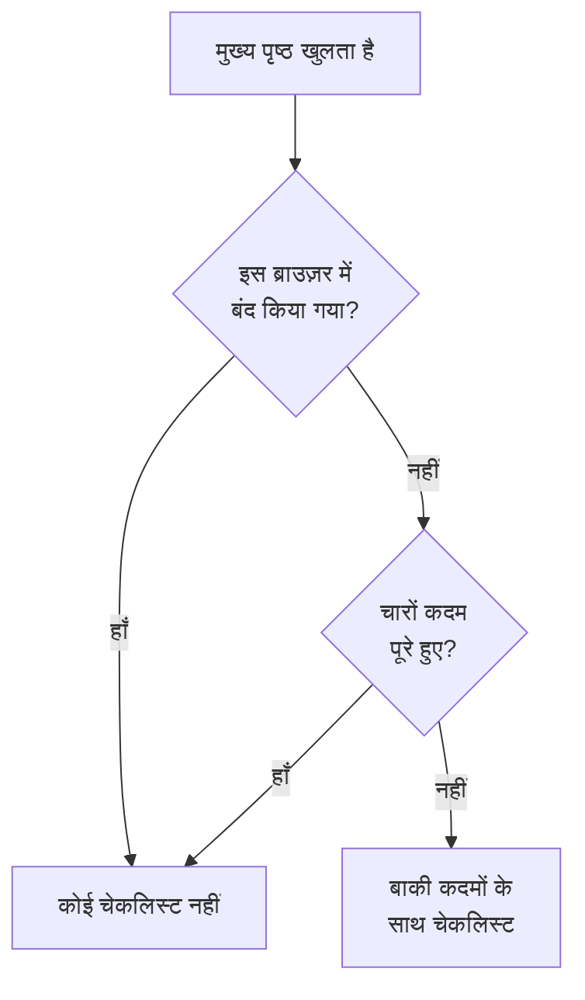

# मुख्य पृष्ठ और शॉर्टकट

मुख्य पृष्ठ वह पहला पेज है जो आप किसी प्रोजेक्ट में देखते हैं। यह एक नज़र में बताता है कि क्या अभी किसी चीज़ को आपकी ज़रूरत है, और नए प्रोजेक्ट को उसके पहले सेटअप से गुज़ारता है। यह पेज बताता है कि मुख्य पृष्ठ क्या दिखाता है, डैशबोर्ड में कोई भी उत्पाद, पेज या क्रिया कैसे खोजें, और वे कीबोर्ड शॉर्टकट जो मेनू में बार-बार जाने से बचाते हैं।

:::cards
- [मुख्य पृष्ठ क्या दिखाता है](#मुख्य-पृष्ठ-क्या-दिखाता-है): स्वागत चेकलिस्ट, पाँच टाइलें और सक्रिय घटनाएँ।
- [रास्ता खोजना](#रास्ता-खोजना): उत्पाद मेनू और हर पेज के ऊपर के बार।
- [खोजना](#कोई-पेज-सेटिंग-या-क्रिया-खोजना): नाम टाइप करके कोई भी पेज, सेटिंग या क्रिया खोजें।
- [कीबोर्ड शॉर्टकट](#कीबोर्ड-शॉर्टकट): दो कुंजियों से मुख्य पृष्ठ, मॉनिटर या घटनाओं पर जाएँ।
:::

## मुख्य पृष्ठ क्या दिखाता है

ऊपर के बार में **मुख्य पृष्ठ** खोलें, या कहीं से भी `g` फिर `h` दबाएँ। ऊपर से नीचे तक, मुख्य पृष्ठ दिखाता है:

1. **OneUptime में आपका स्वागत है 👋**, नए प्रोजेक्ट के लिए एक चेकलिस्ट, जब तक वह पूरी न हो जाए।
2. पाँच टाइलें जो गिनती हैं कि किस पर ध्यान देना है।
3. **सक्रिय घटनाएं**, हर वह घटना जो अभी तक सुलझी नहीं है।

### स्वागत चेकलिस्ट

चेकलिस्ट आपको उन चार चीज़ों से गुज़ारती है जो किसी प्रोजेक्ट को उपयोगी होने से पहले चाहिए। हर कदम वह पेज खोलता है जहाँ आप उसे करते हैं, और जब प्रोजेक्ट में वह चीज़ आ जाती है जो वह माँगता है, तो वह अपने-आप पूरा हो जाता है।

| कदम | कब पूरा होता है | क्या खोलता है |
| --- | --- | --- |
| **अपना पहला मॉनिटर बनाएँ** | प्रोजेक्ट में एक मॉनिटर है। | **मॉनिटर बनाएं** फ़ॉर्म, या जो मॉनिटर नहीं बना सकता उसके लिए **मॉनिटर** सूची। |
| **एक स्थिति पृष्ठ प्रकाशित करें** | प्रोजेक्ट में एक स्थिति पृष्ठ है। | **स्थिति पृष्ठ** |
| **अपनी टीम को आमंत्रित करें** | आपके अलावा कोई और प्रोजेक्ट में है, या उसे आमंत्रित किया गया है। | **उपयोगकर्ता** |
| **एक ऑन-कॉल नीति सेट करें** | प्रोजेक्ट में एक ऑन-कॉल नीति है। | **ऑन-कॉल ड्यूटी** |

कदमों के नीचे, **OneUptime कैसे काम करता है** चार मुख्य उत्पादों को उस क्रम में दिखाता है जिसमें कोई समस्या उनसे होकर गुज़रती है: **मॉनिटर**, **घटनाएं और अलर्ट**, **ऑन-कॉल ड्यूटी** और **स्थिति पृष्ठ**। किसी एक पर क्लिक करके उसे खोलें।

चारों कदम पूरे होते ही चेकलिस्ट हट जाती है। उसे पहले छिपाने के लिए **बंद करें** पर क्लिक करें। बंद करना इस ब्राउज़र में, इस प्रोजेक्ट के लिए याद रखा जाता है; कदम जो कुछ खोलते हैं, वह सब अब भी **उत्पाद** मेनू में है।

### टाइलें

हर टाइल कुछ गिनती है, बताती है कि क्या उस पर आपका ध्यान चाहिए, और संख्या के पीछे की सूची खोलती है।

| टाइल | क्या गिनती है | जब गिनती शून्य हो |
| --- | --- | --- |
| **सक्रिय घटनाएं** | वे घटनाएँ जो सुलझी नहीं हैं | **सब ठीक है** |
| **सक्रिय अलर्ट** | वे अलर्ट जो सुलझे नहीं हैं | **सब ठीक है** |
| **गैर-संचालन मॉनिटर** | वे मॉनिटर जिनकी स्थिति कार्यरत वाली नहीं है। आर्काइव किए गए मॉनिटर नहीं गिने जाते। | **सभी कार्यरत** |
| **चल रहा रखरखाव** | जारी अनुसूचित रखरखाव इवेंट | **कोई जारी नहीं** |
| **जोखिम में SLO** | चालू SLO जो जोखिम में हैं या अपना एरर बजट खर्च कर चुके हैं | **बजट स्वस्थ हैं** |

शून्य से ज़्यादा गिनती पर **ध्यान देने की ज़रूरत** दिखता है, और रखरखाव और SLO टाइलों पर **जारी है** और **बजट खर्च हो रहा है**। जिस प्रोजेक्ट में अभी कोई मॉनिटर नहीं है, उसे मॉनिटर टाइल पर **अभी कोई मॉनिटर नहीं** दिखता है, और जिसमें कोई SLO नहीं है उसे **अभी कोई SLO नहीं**: खाली प्रोजेक्ट, स्वस्थ प्रोजेक्ट जैसा नहीं होता। तब ये दो टाइलें **मॉनिटर** और **SLOs** सूचियाँ खोलती हैं, जहाँ आप पहला बनाते हैं।

### मुख्य पृष्ठ का साइड मेनू

मुख्य पृष्ठ के बगल वाले साइड मेनू में वही सूचियाँ हैं, हर एक के साथ गिनती:

| खंड | पेज |
| --- | --- |
| **घटनाएं** | **सक्रिय घटनाएं** और **सक्रिय एपिसोड** |
| **अलर्ट** | **सक्रिय अलर्ट** और **सक्रिय एपिसोड** |
| **मॉनिटर** | **गैर-संचालन** |
| **अनुसूचित इवेंट** | **जारी** |

एक एपिसोड संबंधित घटनाओं या अलर्ट को समूहित करता है, ताकि आप उन पर एक साथ काम करें। [मुख्य अवधारणाएँ](/docs/introduction/core-concepts#घटनाएँ-और-अलर्ट) देखें।

## रास्ता खोजना

OneUptime में सब कुछ ऊपर के बार में **उत्पाद** के नीचे है। मेनू अपने समूहों को एक ही सूची की पंक्तियों के रूप में दिखाता है, और हमेशा उनमें से पहले, मूल बातें, को खुला रखकर खुलता है: मॉनिटर, घटनाएं, अलर्ट, ऑन-कॉल ड्यूटी, स्थिति पृष्ठ, अनुसूचित रखरखाव और SLOs। हर दूसरा समूह (अवलोकनीयता, AI, कोड, संसाधन, बुनियादी ढांचा, डैशबोर्ड और ऑटोमेशन और सेटिंग्स) उसी सूची की एक पंक्ति में मुड़ा रहता है। हर पंक्ति समूह के उत्पादों के नाम बताती है और बताती है कि कितने हैं। किसी पंक्ति को खोलने या मोड़ने के लिए उस पर क्लिक करें, या तीर कुंजियों से उस पर जाएँ और **Enter** दबाएँ।

- **खोज सब कुछ ढूँढती है।** मेनू के खोज बॉक्स में टाइप करें और किसी भी उत्पाद को उसके नाम से, उसके काम से, या `k8s` या `RUM` जैसे जाने-पहचाने शब्द से खोजें। खोज मुड़े हुए समूहों के अंदर भी देखती है।
- **आप जहाँ हैं, वहीं से शुरू करते हैं।** आप जिस पेज पर हैं उसका समूह अपने-आप खुल जाता है, और हाल में खोले गए उत्पाद सबसे ऊपर दिखते हैं।
- **आपकी पसंद बनी रहती है।** मेनू आपके ब्राउज़र पर याद रखता है कि आपने दूसरे समूहों में से कौन-से खोले या मोड़े। मूल बातें हर बार मेनू खोलने पर फिर से खुली होती हैं, भले ही आपने उन्हें मोड़ दिया हो।
- **फ़ोन पर**, मेनू बटन उत्पादों को उसी तरह दिखाता है: मूल बातें सबसे ऊपर खुली, और हर दूसरा समूह एक पंक्ति के रूप में जो टैप करने पर खुलती है।

### ऊपर के बार

हर पेज के ऊपर दो बार होते हैं।

| कहाँ | वहाँ क्या है |
| --- | --- |
| ऊपर बाएँ | प्रोजेक्ट पिकर: अपने किसी दूसरे प्रोजेक्ट पर स्विच करें, या नया प्रोजेक्ट बनाएँ। |
| ऊपर दाएँ | **खोजें** और **Ask AI**, सूचना घंटी जिसमें वह है जिसे अभी आपकी ज़रूरत है (सक्रिय घटनाएँ और अलर्ट, वे ऑन-कॉल नीतियाँ जिनमें आप ड्यूटी पर हैं, लंबित आमंत्रण), **सहायता**, और आपकी तस्वीर, जो आपके [खाते](/docs/introduction/your-account) का मेनू खोलती है। |
| उनके नीचे | बाईं ओर **मुख्य पृष्ठ** और **उत्पाद**, दाईं ओर **उपयोगकर्ता सेटिंग्स**: इस प्रोजेक्ट में OneUptime आप तक कैसे पहुँचता है। |

**सहायता** ये डॉक्स (**दस्तावेज़ीकरण**) और **Keyboard shortcuts** सूची खोलती है, और ईमेल व Slack पर सहायता देती है। फ़ोन जैसी संकरी स्क्रीन पर जगह बचाने के लिए **खोजें**, **Ask AI** और **सहायता** हटा दिए जाते हैं; घंटी और आपकी तस्वीर बनी रहती हैं।

## कोई पेज, सेटिंग या क्रिया खोजना

**Cmd+K** (Mac) या **Ctrl+K** (Windows और Linux) दबाएँ, या ऊपर के बार में खोज आइकन पर क्लिक करें, और टाइप करना शुरू करें। खोज ये ढूँढती है:

- **मेनू का हर पेज**, उस नाम से जो मेनू उसे देता है: API कुंजियाँ, खतरा क्षेत्र, ऑन-कॉल अनुसूची, घटना गंभीरता, आपकी अपनी सूचना विधियां। हर नतीजा बताता है कि वह कहाँ है, जैसे *प्रोजेक्ट सेटिंग्स › उन्नत*, ताकि एक ही नाम वाले पेज (घटनाओं, अलर्ट और मॉनिटर में कस्टम फ़ील्ड) आसानी से अलग पहचाने जा सकें।
- **क्रियाएँ**, आप क्या करना चाहते हैं उससे: घटना घोषित करें, मॉनिटर बनाएं, या Delete Project, जो खतरा क्षेत्र खोलता है। कुछ बदलने वाली क्रिया सिर्फ़ उन्हीं को दिखाई जाती है जिन्हें उसकी अनुमति है।
- **आपके मॉनिटर, घटनाएँ, अलर्ट, स्थिति पृष्ठ और ऑन-कॉल नीतियाँ**, नाम से।

खोज आपके टाइप किए को उसी तरह पढ़ती है जैसा आपका मतलब होता है:

- बड़े-छोटे अक्षर, एक्सेंट, स्पेस और हाइफ़न से कोई फ़र्क नहीं पड़ता: *on-call*, *on call* और *oncall* एक ही पेज ढूँढते हैं, और शब्द किसी भी क्रम में आ सकते हैं।
- यह कई पेजों के लिए दूसरे शब्द भी जानती है, अंग्रेज़ी में: ऑन-कॉल नीतियों के लिए *pager* या *escalation*, ऑन-कॉल अनुसूची के लिए *rota*, टू-फ़ैक्टर ऑथेंटिकेशन के लिए *2fa*, खतरा क्षेत्र के लिए *delete project*।
- खोज को सीमित करने के लिए उत्पाद का नाम जोड़ें: *incident custom fields* घटनाओं का कस्टम फ़ील्ड पेज ढूँढता है।
- *incidnet* जैसी छोटी टाइपिंग गलती पर भी, जब टाइप किए जैसा कुछ मेल न खाए, खोज वही ढूँढ लेती है जो आपका मतलब था।

खोज बॉक्स खाली होने पर, खोज हाल में खोले गए पेज, क्रियाएँ और उत्पाद दिखाती है।

## कीबोर्ड शॉर्टकट

हर शॉर्टकट देखने के लिए डैशबोर्ड में कहीं भी `?` दबाएँ, या **सहायता** खोलें और **Keyboard shortcuts** चुनें। Mac पर `Mod` Command कुंजी है; Windows और Linux पर यह Ctrl है।

| कुंजियाँ | यह क्या करती हैं |
| --- | --- |
| `Mod` + `K` | कमांड पैलेट खोलें: कोई भी पेज, सेटिंग या क्रिया खोजें। |
| `Mod` + `I` | आप जो देख रहे हैं, उसके बारे में AI से पूछें। |
| `/` | इस पेज की सूची में खोजें। |
| `?` | कीबोर्ड शॉर्टकट दिखाएँ। |
| `Esc` | कोई डायलॉग या पैनल बंद करें। |

### किसी उत्पाद पर जाएँ

सीधे किसी उत्पाद पर जाने के लिए `g` दबाएँ, फिर एक अक्षर। अक्षर `g` के 1.5 सेकंड के अंदर दबाएँ।

| कुंजियाँ | कहाँ ले जाती हैं |
| --- | --- |
| `g` फिर `h` | मुख्य पृष्ठ |
| `g` फिर `m` | मॉनिटर |
| `g` फिर `i` | घटनाएं |
| `g` फिर `a` | अलर्ट |
| `g` फिर `o` | ऑन-कॉल ड्यूटी |
| `g` फिर `s` | स्थिति पृष्ठ |
| `g` फिर `e` | अनुसूचित रखरखाव |
| `g` फिर `d` | डैशबोर्ड |
| `g` फिर `l` | लॉग्स |
| `g` फिर `t` | ट्रेस |

शॉर्टकट आपके रास्ते में नहीं आते। किसी फ़ील्ड में टाइप करते समय `?`, `/` और `g` कुछ नहीं करते, और डायलॉग खुला होने पर कुछ भी पेज से दूर नहीं ले जाता, इसलिए गलती से दबी कुंजी आधा भरा फ़ॉर्म नहीं गँवा सकती। हर दूसरा उत्पाद `Mod` + `K` से एक खोज की दूरी पर है।

## अगले कदम

:::cards
- [त्वरित शुरुआत](/docs/introduction/quickstart): स्वागत चेकलिस्ट को कदम-दर-कदम पूरा करें।
- [आपका खाता](/docs/introduction/your-account): आपकी प्रोफ़ाइल, साइन-इन सुरक्षा, भाषा और थीम।
- [AI से पूछें](/docs/ai/ask-ai): Ask AI आपके लिए किन सवालों के जवाब दे सकता है और क्या कर सकता है।
- [मुख्य अवधारणाएँ](/docs/introduction/core-concepts): मॉनिटर, घटनाएँ, अलर्ट और ऑन-कॉल क्या हैं।
:::
