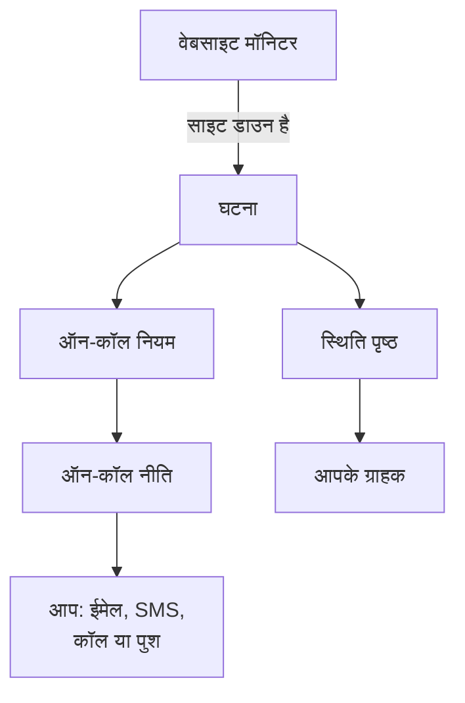

# त्वरित शुरुआत

यह गाइड आपको लगभग पंद्रह मिनट में एक नए खाते से एक काम करते सेटअप तक ले जाती है: एक मॉनिटर जो हर पाँच मिनट में आपकी वेबसाइट जाँचता है, एक ऑन-कॉल नीति जो साइट डाउन होने पर आपको पेज करती है, और एक स्थिति पृष्ठ जो आपके ग्राहकों को बताता है। यह आपके प्रोजेक्ट के मुख्य पृष्ठ पर मौजूद **OneUptime में आपका स्वागत है 👋** चेकलिस्ट के क्रम में चलती है।

## शुरू करने से पहले

- **एक खाता।** OneUptime Cloud पर, [oneuptime.com](https://oneuptime.com/accounts/register) पर साइन अप करें और उसके भेजे ईमेल का लिंक खोलें। अपने इंस्टॉलेशन पर, उसे अपने ब्राउज़र में खोलें और साइन अप करें: पहला खाता मास्टर एडमिन बन जाता है। इंस्टॉल करने के लिए [Docker Compose](/docs/installation/docker-compose) देखें।
- **निगरानी के लिए एक वेबसाइट।** कोई भी पता जो HTTP या HTTPS पर जवाब देता हो, जैसे आपकी कंपनी का होम पेज।

## एक प्रोजेक्ट बनाएँ

OneUptime में सब कुछ एक प्रोजेक्ट में रहता है: आपके मॉनिटर, घटनाएँ, ऑन-कॉल नीतियाँ, स्थिति पृष्ठ और उन पर काम करने वाले लोग।

:::steps
### नया प्रोजेक्ट शुरू करें

पहली बार साइन इन करने पर OneUptime **कोई प्रोजेक्ट नहीं** दिखाता है। **नया प्रोजेक्ट बनाएँ** पर क्लिक करें। अगर किसी ने आपको पहले ही किसी प्रोजेक्ट में आमंत्रित किया है, तो इसके बजाय उसी पेज पर आमंत्रण स्वीकार करें।

### उसे नाम दें

**प्रोजेक्ट नाम** दर्ज करें, जैसे आपकी कंपनी का नाम। OneUptime Cloud पर अगला कदम आपसे एक प्लान चुनने को कहता है।

### उसे बनाएँ

**प्रोजेक्ट बनाएं** पर क्लिक करें। आपके प्रोजेक्ट का मुख्य पृष्ठ खुलता है, जिसमें सबसे ऊपर **OneUptime में आपका स्वागत है 👋** चेकलिस्ट होती है।
:::

## अपनी वेबसाइट की निगरानी करें

:::steps
### मॉनिटर बनाना खोलें

चेकलिस्ट में **अपना पहला मॉनिटर बनाएँ** पर क्लिक करें। आप **उत्पाद** मेनू से **मॉनिटर** खोलकर **मॉनिटर बनाएं** पर भी क्लिक कर सकते हैं।

### वेबसाइट चुनें

**मॉनिटर प्रकार** में **वेबसाइट** चुनें। **नाम** दर्ज करें, जैसे `Website`, और **अगला** पर क्लिक करें।

### पता दर्ज करें

**वेबसाइट URL** में अपनी साइट का पूरा पता दर्ज करें, जैसे `https://example.com`। OneUptime आपके लिए मानदंड जोड़ देता है: जब साइट जवाब नहीं देती, या एरर के साथ जवाब देती है, तो मॉनिटर **ऑफ़लाइन** हो जाता है और एक घटना घोषित करता है। **अगला** पर क्लिक करें।

### मॉनिटर बनाएँ

चुने हुए **प्रोब** और **हर 5 मिनट** का **निगरानी अंतराल** वैसे ही रहने दें, और **मॉनिटर बनाएं** पर क्लिक करें। मॉनिटर का पेज खुलता है, और प्रोब आपकी साइट जाँचना शुरू कर देते हैं।
:::

सेव करने से पहले जाँच आज़माने के लिए, दूसरे कदम पर **मॉनिटर का परीक्षण करें** पर क्लिक करें। बाकी सभी मॉनिटर प्रकार [मॉनिटर बनाना](/docs/monitor/create-monitor) में बताए गए हैं।

## साइट डाउन होने पर पेज पाएँ

अभी, जिस घटना का कोई मालिक नहीं है, उसका ईमेल प्रोजेक्ट के मालिकों को जाता है, और उनमें आप भी शामिल हैं। किसी के जवाब देने तक पेज होते रहने के लिए, एक ऑन-कॉल नीति बनाएँ और हर घटना से उसे पेज करवाएँ।

:::steps
### एक ऑन-कॉल नीति बनाएँ

चेकलिस्ट में **एक ऑन-कॉल नीति सेट करें** पर क्लिक करें, या **उत्पाद** मेनू से **ऑन-कॉल ड्यूटी** खोलें। **ऑन-कॉल नीति बनाएँ** पर क्लिक करें और **नाम** दर्ज करें। **सबसे पहले किसे सूचित किया जाए?** के नीचे **प्रतिक्रियाकर्ता जोड़ें** पर क्लिक करें और खुद को चुनें। **ऑन-कॉल नीति बनाएँ** पर क्लिक करें।

### हर घटना के लिए इसे पेज करें

**उत्पाद** मेनू से **घटनाएं** खोलें, साइड मेनू में **नियम** को फैलाएँ और **ऑन-कॉल नियम** चुनें। **Incident On-Call Rule बनाएँ** पर क्लिक करें, **नाम** दर्ज करें और **अगला** पर क्लिक करें। **मिलान मानदंड** खाली छोड़ दें, ताकि नियम हर घटना से मेल खाए, और **अगला** पर क्लिक करें। **ऑन-कॉल नीतियां** में अपनी नीति चुनें और **Incident On-Call Rule बनाएँ** पर क्लिक करें।

### चुनें कि आप तक कैसे पहुँचा जाए

आपका साइन-इन ईमेल पहले से ही आप तक पहुँचने का एक तरीका है। SMS या कॉल भी पाने के लिए, ऊपरी बार के नीचे वाले बार में **उपयोगकर्ता सेटिंग्स** खोलें, **सूचना विधियां** पर जाएँ और **Direct Contact** टैब पर, **फोन नंबर SMS सूचनाओं के लिए** या **कॉल सूचनाओं के लिए फ़ोन नंबर** में अपना नंबर जोड़ें। **सत्यापित करें** पर क्लिक करें और OneUptime का भेजा कोड दर्ज करें। सत्यापित नंबर तुरंत ऑन-कॉल पेज के लिए इस्तेमाल होता है।
:::

> [!NOTE]
> नए प्रोजेक्ट में SMS और फ़ोन कॉल बंद रहते हैं। प्रोजेक्ट का मालिक, Billing Admin या Manage Billing अनुमति वाला कोई व्यक्ति उन्हें **प्रोजेक्ट सेटिंग्स → सूचनाएं → सूचना सेटिंग्स** में **सूचना चैनल** कार्ड में चालू करता है।

और स्तरों, रोटेशन और हर स्तर कितनी देर इंतज़ार करता है, इसके लिए [एस्केलेशन नियम](/docs/on-call/escalation-rules) और [ऑन-कॉल अनुसूची](/docs/on-call/schedules) देखें।

## एक स्थिति पृष्ठ प्रकाशित करें

:::steps
### स्थिति पृष्ठ बनाएँ

चेकलिस्ट में **एक स्थिति पृष्ठ प्रकाशित करें** पर क्लिक करें, या **उत्पाद** मेनू से **स्थिति पृष्ठ** खोलें। **स्थिति पृष्ठ बनाएं** पर क्लिक करें, **नाम** दर्ज करें, जैसे `Acme Status`, और **स्थिति पृष्ठ बनाएं** पर क्लिक करें।

### अपना मॉनिटर जोड़ें

नया स्थिति पृष्ठ खोलें। उसके साइड मेनू में, **संसाधन** के नीचे, **मॉनिटर** चुनें; मॉनिटर समूह चालू वाले प्रोजेक्ट में इसका नाम **संसाधन** होता है। **मॉनिटर जोड़ें** पर क्लिक करें, अपना वेबसाइट मॉनिटर चुनें और **मॉनिटर जोड़ें** पर क्लिक करें। पंक्ति आगंतुकों को मॉनिटर का नाम दिखाती है; चाहें तो इसे **प्रदर्शन नाम** में बदलें।

### पेज खोलें

साइड मेनू में **अवलोकन** चुनें। **Status Page Preview URL** कार्ड आपके स्थिति पृष्ठ से लिंक करता है: उसे खोलें, और आपकी वेबसाइट कार्यरत दिखती है।
:::

नया स्थिति पृष्ठ सार्वजनिक होता है: जिसके पास भी उसका पता है, वह उसे खोल सकता है। उसे अपना डोमेन, लोगो और रंग देने के लिए [स्थिति पृष्ठ ब्रांडिंग और डोमेन](/docs/status-pages/branding-and-domains) देखें।

## अपनी टीम को आमंत्रित करें

चेकलिस्ट में **अपनी टीम को आमंत्रित करें** पर क्लिक करें, या **उत्पाद** मेनू में **सेटिंग्स** के नीचे से **उपयोगकर्ता** खोलें। **उपयोगकर्ता को आमंत्रित करें** पर क्लिक करें, उनका **ईमेल** दर्ज करें, और एक **टीम** चुनें: शुरुआत में मेंबर्स टीम चुनी होती है। **आमंत्रित करें** पर क्लिक करें। OneUptime उन्हें आमंत्रण ईमेल करता है, और टीम तय करती है कि वे क्या कर सकते हैं। [उपयोगकर्ता, टीमें और अनुमतियाँ](/docs/permissions/index) देखें।

## इसे आज़माएँ

पूरी शृंखला को काम करते देखने के लिए एक परीक्षण घटना घोषित करें।

:::steps
### एक परीक्षण घटना घोषित करें

**घटनाएं** खोलें और **घटना घोषित करें** पर क्लिक करें। **शीर्षक** दर्ज करें, जैसे `Test incident`, एक **घटना गंभीरता** चुनें और **अगला** पर क्लिक करें। **मॉनिटर** में अपना वेबसाइट मॉनिटर चुनें, ताकि घटना आपके स्थिति पृष्ठ पर दिखे। सारांश तक पहुँचने तक **अगला** पर क्लिक करते रहें, फिर **घटना घोषित करें** पर क्लिक करें।

### इसे होते देखें

एक-दो मिनट में आपकी ऑन-कॉल नीति आपको पेज करती है, और घटना आपके स्थिति पृष्ठ पर दिखती है।

### इसे सुलझाएँ

घटना के पेज पर **सुलझाएं** पर क्लिक करें। पेज करना रुक जाता है, और घटना आपके स्थिति पृष्ठ से हट जाती है।
:::

> [!WARNING]
> जब तक आप परीक्षण घटना नहीं सुलझाते, आपका स्थिति पृष्ठ खोलने वाला हर व्यक्ति उसे देखता है। पेज का पता साझा करने से पहले परीक्षण करें।

## समस्या निवारण

:::details मुझे पेज नहीं किया गया
घटना खोलें और उसके साइड मेनू में **ऑन-कॉल निष्पादन** चुनें: यह दिखाता है कि आपकी नीति चली या नहीं, और उसने किसे पेज किया। अगर नहीं चली, तो जाँचें कि आपका ऑन-कॉल नियम सक्षम है और उस नीति का नाम लेता है। अगर चली, तो जाँचें कि **उपयोगकर्ता सेटिंग्स → सूचना विधियां** में आपकी विधियाँ सत्यापित हैं।
:::

:::details घटना मेरे स्थिति पृष्ठ पर नहीं है
स्थिति पृष्ठ किसी घटना को तब दिखाता है जब घटना का कोई मॉनिटर उस पेज पर हो। जाँचें कि घटना के प्रभावित संसाधनों में आपका मॉनिटर है, और वह मॉनिटर स्थिति पृष्ठ पर है।
:::

:::details मॉनिटर ऑफ़लाइन बताता है, पर मेरी साइट चल रही है
मॉनिटर खोलें और देखें कि प्रोब को क्या मिला। [वेबसाइट मॉनिटर](/docs/monitor/website-monitor) का समस्या निवारण खंड देखें।
:::

## अगले कदम

:::cards
- [मुख्य अवधारणाएँ](/docs/introduction/core-concepts): आपने अभी जो सेट किया, उसके पीछे के विचार।
- [ऑन-कॉल अनुसूची](/docs/on-call/schedules): ऑन-कॉल रहने की ज़िम्मेदारी अपनी टीम के साथ बाँटें।
- [स्थिति पृष्ठ ब्रांडिंग और डोमेन](/docs/status-pages/branding-and-domains): स्थिति पृष्ठ को अपना बनाएँ।
- [OpenTelemetry](/docs/telemetry/open-telemetry): अपने ऐप्स से लॉग, मेट्रिक्स और ट्रेस भेजें।
:::
