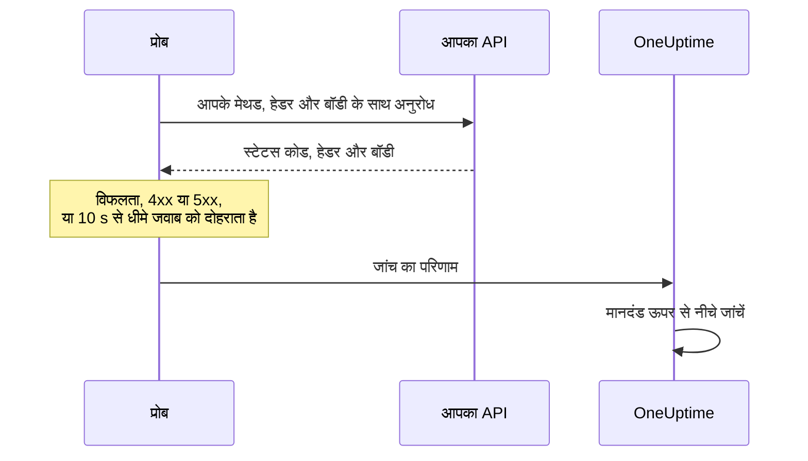

# API मॉनिटर

API मॉनिटर आपके चुने हुए मेथड, हेडर और बॉडी के साथ एक तय समय पर किसी HTTP एंडपॉइंट को कॉल करता है, और जो वापस आता है उसकी जांच करता है: स्टेटस कोड, प्रतिक्रिया समय, हेडर और बॉडी। इसका उपयोग REST, JSON और GraphQL एंडपॉइंट, हेल्थ चेक, और ऐसी किसी भी कॉल के लिए करें जिस पर आपके उपयोगकर्ता निर्भर हैं।

:::cards
- [मॉनिटर बनाएं](#api-मॉनिटर-बनाएं): डैशबोर्ड में छह चरण।
- [कॉन्फ़िगरेशन विकल्प](#कॉन्फ़िगरेशन-विकल्प): मेथड, हेडर, बॉडी, रीडायरेक्ट, प्रमाणपत्र, टाइमआउट और पुनः प्रयास।
- [निगरानी मानदंड](#निगरानी-मानदंड): शुरुआत से ही किसे चालू और किसे बंद माना जाता है।
- [समस्या निवारण](#समस्या-निवारण): जब कोई जांच विफल हो जिसे पास होना चाहिए।
:::

## यह कैसे काम करता है

हर जांच में, प्रोब अनुरोध भेजता है, हर रीडायरेक्ट का अनुसरण करता है, और स्टेटस कोड, प्रतिक्रिया समय, हेडर और बॉडी दर्ज करता है। जो अनुरोध विफल होता है, टाइम आउट होता है, `4xx` या `5xx` स्टेटस के साथ जवाब देता है, या 10 सेकंड से ज़्यादा लेता है, उसे आपकी अनुमति वाली पुनः प्रयास संख्या तक फिर से आज़माया जाता है। फिर OneUptime परिणाम को मॉनिटर के मानदंडों से गुज़ारता है।



जिस प्रोब का अपना नेटवर्क कनेक्शन टूट गया हो, वह कोई परिणाम नहीं भेजता, इसलिए वह आपके API को ऑफ़लाइन नहीं दिखा सकता।

## शुरू करने से पहले

- **ऐसी भूमिका जो मॉनिटर बना सके**: Project Owner, Project Admin, Project Member, Monitor Admin या Monitor Member, या Create Monitor अनुमति वाली कोई कस्टम भूमिका।
- **ऐसा प्रोब जो API तक पहुंच सके।** हर नए मॉनिटर के लिए आपके प्रोजेक्ट के डिफ़ॉल्ट प्रोब चुने जाते हैं। अगर API के सामने फ़ायरवॉल है, तो [OneUptime Cloud के प्रोब IP पतों](/docs/configuration/ip-addresses) को अनुमति दें। निजी नेटवर्क के API के लिए उस नेटवर्क के अंदर ऐसा [कस्टम प्रोब](/docs/probe/custom-probe) चाहिए जिसे निजी पतों तक पहुंचने की अनुमति हो: [निजी नेटवर्क पहुँच](/docs/self-hosted/private-network-access) देखें।
- **मॉनिटर रहस्य के रूप में क्रेडेंशियल।** अगर API को कोई कुंजी या टोकन चाहिए, तो उसे पहले [मॉनिटर रहस्य](/docs/monitor/monitor-secrets) के रूप में सहेजें, ताकि मॉनिटर के पास केवल उसका संदर्भ रहे।

## API मॉनिटर बनाएं

:::steps
### नया मॉनिटर शुरू करें

**मॉनिटर** पर जाएं और **मॉनिटर बनाएं** पर क्लिक करें। **मॉनिटर प्रकार** में **API** चुनें।

### नाम दें

**नाम** डालें, जैसे `Orders API`, फिर **अगला** पर क्लिक करें।

### अनुरोध डालें

**API URL** में एंडपॉइंट का पूरा URL डालें, जैसे `https://api.example.com/health`। **API अनुरोध प्रकार** चुनें (जब तक आप न बदलें, **GET**)। हेडर या बॉडी जोड़ने के लिए **और फ़ील्ड** खोलें और **अनुरोध हेडर** और **अनुरोध बॉडी (JSON में)** भरें।

### जांच कर देखें

**मॉनिटर का परीक्षण करें** पर क्लिक करें, **प्रोब चुनें** में कोई प्रोब चुनें और **परीक्षण चलाएं** पर क्लिक करें। **मॉनिटर परीक्षण परिणाम** दिखाता है कि API ने क्या जवाब दिया।

### मानदंड देखें

**मॉनिटर मानदंड** [डिफ़ॉल्ट मानदंड](#डिफ़ॉल्ट-मानदंड) से शुरू होता है: जब API जवाब नहीं देता या त्रुटि के साथ जवाब देता है तो ऑफ़लाइन, किसी भी `2xx` या `3xx` स्टेटस पर ऑनलाइन। API क्या लौटाता है, यह भी जांचने के लिए एक फ़िल्टर जोड़ें, फिर **अगला** पर क्लिक करें।

### प्रोब चुनें और बनाएं

**प्रोब** और **निगरानी अंतराल** (यह **हर 5 मिनट** से शुरू होता है) रखें या बदलें, फिर **मॉनिटर बनाएं** पर क्लिक करें। मॉनिटर का पेज खुल जाता है।
:::

## कॉन्फ़िगरेशन विकल्प

### API URL

कॉल करने वाला एंडपॉइंट, स्कीम सहित पूरे URL के रूप में, जैसे `https://api.example.com/v1/health`। आप URL में `{{monitorSecrets.NAME}}` के रूप में कोई [मॉनिटर रहस्य](/docs/monitor/monitor-secrets) रख सकते हैं।

### डायनामिक URL प्लेसहोल्डर

जब API के सामने कोई CDN या कैशिंग प्रॉक्सी हो, तो प्रोब को आपके सर्वर की जगह कैश से जवाब मिल सकता है। कैश से आगे जाने के लिए URL में एक प्लेसहोल्डर जोड़ें; प्रोब हर जांच पर उसे एक नए मान से बदल देता है।

| प्लेसहोल्डर | किससे बदला जाता है | उदाहरण मान |
| --- | --- | --- |
| `{{timestamp}}` | मौजूदा Unix समय, सेकंड में | `1719500000` |
| `{{random}}` | 32 हेक्साडेसिमल अक्षरों की एक रैंडम, अनोखी स्ट्रिंग | `3f2b8c1d9e7a4b6c8d0e1f2a3b4c5d6e` |

प्लेसहोल्डर वाला URL:

```text
https://api.example.com/health?cb={{timestamp}}
```

पांच मिनट के अंतर पर दो जांचों में प्रोब किसका अनुरोध करता है:

```text
https://api.example.com/health?cb=1719500000
https://api.example.com/health?cb=1719500300
```

`{{random}}` का उपयोग भी इसी तरह करें: `https://api.example.com/health?nocache={{random}}`।

### API अनुरोध प्रकार

भेजा जाने वाला HTTP मेथड। **GET** डिफ़ॉल्ट है; बाकी **POST**, **PUT**, **PATCH**, **DELETE** और **HEAD** हैं। अगर किसी **HEAD** अनुरोध का जवाब `4xx` या `5xx` स्टेटस से आता है, तो प्रोब उसे `GET` के रूप में दोहराता है।

### और फ़ील्ड

ये सेटिंग्स **और फ़ील्ड** में सिमटी रहती हैं। सिमटा हुआ शीर्षक उनकी सूची दिखाता है और बताता है कि आपने कौन-सी बदली हैं।

| फ़ील्ड | डिफ़ॉल्ट | यह क्या करता है |
| --- | --- | --- |
| **अनुरोध हेडर** | कोई नहीं | भेजे जाने वाले हेडर, नाम और मान की जोड़ियों के रूप में। हर एक के लिए **Request Header जोड़ें** पर क्लिक करें। |
| **अनुरोध बॉडी (JSON में)** | कोई नहीं | बॉडी के रूप में भेजा जाने वाला JSON ऑब्जेक्ट, आमतौर पर **POST**, **PUT** या **PATCH** के साथ। यह मान्य JSON होना चाहिए। |
| **रीडायरेक्ट का अनुसरण न करें** | बंद | रीडायरेक्ट का अनुसरण करने के बजाय पहले जवाब के आधार पर फ़ैसला करता है। [नीचे](#रीडायरेक्ट-का-अनुसरण-न-करें) देखें। |
| **स्व-हस्ताक्षरित प्रमाणपत्रों की अनुमति दें** | बंद | मॉनिटर के अपने होस्ट नाम के लिए TLS प्रमाणपत्र सत्यापन छोड़ देता है। |
| **क्लाइंट प्रमाणपत्र (mTLS) का उपयोग करें** | बंद | एक क्लाइंट प्रमाणपत्र और निजी कुंजी प्रस्तुत करता है। [क्लाइंट प्रमाणपत्र (mTLS)](#क्लाइंट-प्रमाणपत्र-mtls) देखें। |
| **अनुरोध टाइमआउट (सेकंड)** | `60` | हर प्रयास के लिए कितनी देर इंतज़ार करना है। अधिकतम 60 सेकंड है। |
| **विफलता पर पुनः प्रयास** | प्रोब का डिफ़ॉल्ट, आमतौर पर `3` | विफल प्रयास को कितनी बार दोहराना है। अधिकतम 3 है। [पुनः प्रयास और टाइमआउट](#पुनः-प्रयास-और-टाइमआउट) देखें। |

अनुरोध हेडर और अनुरोध बॉडी [मॉनिटर रहस्य](/docs/monitor/monitor-secrets) का उपयोग कर सकते हैं, जैसे `Bearer {{monitorSecrets.ApiKey}}` मान वाला `Authorization` हेडर।

#### रीडायरेक्ट का अनुसरण न करें

डिफ़ॉल्ट रूप से, प्रोब रीडायरेक्ट (`301`, `302`, `303`, `307` और `308`) का अनुसरण करता है, अधिकतम 10 तक, और जिस जवाब पर पहुंचता है उसके आधार पर फ़ैसला करता है। इसकी जगह रीडायरेक्ट वाले जवाब के आधार पर फ़ैसला करने के लिए **रीडायरेक्ट का अनुसरण न करें** चालू करें। [डिफ़ॉल्ट मानदंड](#डिफ़ॉल्ट-मानदंड) रीडायरेक्ट वाले जवाब को ऑनलाइन मानते हैं।

जब यह किसी रीडायरेक्ट का अनुसरण करता है:

- `303`, या किसी `POST` के जवाब में आया `301` या `302`, अनुरोध को बिना बॉडी वाले `GET` में बदल देता है, जैसे ब्राउज़र करते हैं।
- आपके अनुरोध हेडर केवल URL के अपने ओरिजिन (वही स्कीम, होस्ट और पोर्ट) पर जाते हैं। किसी दूसरे ओरिजिन पर रीडायरेक्ट उनके बिना भेजा जाता है।
- अगर अनुरोध में अब भी बॉडी है, या उसका मेथड `GET` या `HEAD` के अलावा कोई और है, तो किसी दूसरे ओरिजिन पर रीडायरेक्ट से जांच विफल हो जाती है।
- **स्व-हस्ताक्षरित प्रमाणपत्रों की अनुमति दें** उन रीडायरेक्ट का अनुसरण करता है जो मॉनिटर के अपने होस्ट नाम पर रहते हैं। किसी दूसरे होस्ट नाम पर रीडायरेक्ट का सत्यापन सामान्य रूप से होता है।

#### क्लाइंट प्रमाणपत्र (mTLS)

अगर API को म्यूचुअल TLS चाहिए, तो **क्लाइंट प्रमाणपत्र (mTLS) का उपयोग करें** चालू करें और भरें:

| फ़ील्ड | क्या डालें |
| --- | --- |
| **क्लाइंट प्रमाणपत्र (PEM)** | प्रस्तुत करने वाला PEM-एन्कोडेड क्लाइंट प्रमाणपत्र। |
| **क्लाइंट निजी कुंजी (PEM)** | उससे मेल खाने वाली PEM-एन्कोडेड निजी कुंजी। |
| **क्लाइंट निजी कुंजी पासफ़्रेज़** | वैकल्पिक। पासफ़्रेज़, केवल तब जब निजी कुंजी एन्क्रिप्टेड हो। |

यह curl के `--cert` और `--key` फ़्लैग के बराबर है:

```bash
curl --cert client.crt --key client.key https://api.example.com/health
```

कुंजी को मॉनिटर की सेटिंग्स से बाहर रखने के लिए, प्रमाणपत्र और कुंजी को [मॉनिटर रहस्य](/docs/monitor/monitor-secrets) के रूप में सहेजें और इन फ़ील्ड में `{{monitorSecrets.NAME}}` डालें। रहस्य सर्वर पर भरे जाते हैं, और उनके मान डैशबोर्ड में कभी नहीं दिखते।

क्लाइंट प्रमाणपत्र केवल तब तक प्रस्तुत किया जाता है जब तक अनुरोध URL के ओरिजिन पर रहता है। किसी दूसरे ओरिजिन पर रीडायरेक्ट के बाद प्रोब उसके बिना आगे बढ़ता है।

#### पुनः प्रयास और टाइमआउट

**विफलता पर पुनः प्रयास** पहले प्रयास के _बाद_ के पुनः प्रयास गिनता है, इसलिए `0` जांच को एक बार चलाता है और `2` अधिकतम तीन बार। खाली छोड़ने पर प्रोब का डिफ़ॉल्ट इस्तेमाल होता है: 3, जब तक प्रोब का `PROBE_MONITOR_RETRY_LIMIT` कुछ और न कहे। प्रोब प्रयासों के बीच एक सेकंड रुकता है, और हर प्रयास को पूरा **अनुरोध टाइमआउट (सेकंड)** मिलता है।

ये विफलताएं दोबारा आज़माई जाती हैं: कनेक्शन त्रुटियां, टाइमआउट, `4xx` और `5xx` जवाब, और 10 सेकंड से धीमे जवाब। ये नहीं, क्योंकि दोबारा आज़माने से इन्हें बदला नहीं जा सकता: अमान्य या ब्लॉक किया गया URL, 10 से ज़्यादा रीडायरेक्ट, और 512 KiB से बड़ा जवाब।

## निगरानी मानदंड

मानदंड तय करते हैं कि API कब ऑनलाइन, डिग्रेडेड या ऑफ़लाइन गिना जाए, और क्या इससे कोई घटना घोषित हो या अलर्ट बने। हर मानदंड एक या अधिक फ़िल्टर जांचता है:

| फ़िल्टर | शर्तें | क्या जांचता है |
| --- | --- | --- |
| **Is Online** | **सही**, **गलत** | क्या API ने जवाब दिया, स्टेटस कोड चाहे जो भी हो। |
| **प्रतिक्रिया स्थिति कोड** | **Equal To**, **Not Equal To**, **Greater Than**, **Less Than**, **Greater Than Or Equal To**, **Less Than Or Equal To** | HTTP स्टेटस कोड। |
| **प्रतिक्रिया समय (ms में)** | **Greater Than**, **Less Than**, **Greater Than Or Equal To**, **Less Than Or Equal To** | अनुरोध में कितना समय लगा, रीडायरेक्ट सहित। |
| **प्रतिक्रिया बॉडी** | **शामिल है**, **Not Contains** | प्रतिक्रिया बॉडी में टेक्स्ट। मिलान केस-सेंसिटिव है। |
| **Response Header** | **शामिल है**, **Not Contains** | क्या जवाब में इस नाम का हेडर है। नाम छोटे अक्षरों में डालें, जैसे `x-request-id`। |
| **Response Header Value** | **शामिल है**, **Not Contains** | क्या किसी हेडर का मान ठीक यही है, छोटे अक्षरों में तुलना करके, जैसे `application/json`। |
| **JavaScript Expression** | **Evaluates To True** | जवाब पर एक एक्सप्रेशन। [JavaScript अभिव्यक्तियाँ](/docs/monitor/javascript-expression) देखें। |
| **Is Request Timeout** | **सही**, **गलत** | क्या हर प्रयास में अनुरोध टाइम आउट हुआ। |

JSON जवाब की जांच उसके संक्षिप्त रूप में होती है, जिसमें कुंजियों और मानों के बीच कोई स्पेस नहीं होता। **प्रतिक्रिया बॉडी** से `"status": "ok"` खोजने के लिए `"status":"ok"` डालें।

**मानदंड जोड़ें** ऐसा मानदंड जोड़ता है जिसका नाम पहले से उसके फ़िल्टर पर रखा होता है, जैसे _Response Time (in ms) is above 3000_। जब तक आप अपना नाम नहीं लिखते, नाम फ़िल्टरों के साथ बदलता रहता है। विवरण वैकल्पिक है: उसे जोड़ने के लिए मानदंड की **सेटिंग्स** खोलें।

दो या अधिक फ़िल्टर होने पर, **मिलान शर्त** तय करती है कि **सभी** का मिलना ज़रूरी है या **कोई भी** एक काफ़ी है। किसी मानदंड की **क्रियाएँ** तय करती हैं कि वह क्या करता है: मॉनिटर की स्थिति बदलना, अलर्ट बनाना, घटना घोषित करना, या इनका कोई भी मेल।

### डिफ़ॉल्ट मानदंड

नया API मॉनिटर दो मानदंडों से शुरू होता है, इसलिए यह कुछ भी बदले बिना काम करता है:

- **ऑफ़लाइन** — API जवाब नहीं देता, या `400` या उससे ऊपर (या `200` से नीचे) के स्टेटस कोड से जवाब देता है। मॉनिटर **ऑफ़लाइन** चिह्नित होता है और एक घटना बनती है। API वापस आने पर घटना अपने आप हल हो जाती है।
- **ऑनलाइन** — API किसी भी `2xx` या `3xx` स्टेटस कोड से जवाब देता है, जैसे `200`, `201`, `202` या `204`। मॉनिटर **कार्यरत** चिह्नित होता है।

मानदंडों की सूची में इनके नाम मॉनिटर पर रखे जाते हैं: _Check if (name) is offline_ और _Check if (name) is online_।

इसलिए `201 Created` या `204 No Content` से जवाब देने वाला एंडपॉइंट चालू गिना जाता है। अगर आपके लिए केवल एक स्टेटस कोड का मतलब स्वस्थ है, तो मॉनिटर के **कॉन्फ़िगरेशन → मानदंड** पेज पर दोनों मानदंड बदलें: जैसे ऑनलाइन मानदंड में **प्रतिक्रिया स्थिति कोड** / **Equal To** / `200` और ऑफ़लाइन वाले में **Not Equal To** / `200`, हर एक के दो स्टेटस कोड फ़िल्टरों की जगह। API क्या लौटाता है, यह भी जांचने के लिए ऑफ़लाइन मानदंड में **प्रतिक्रिया बॉडी** या **JavaScript Expression** फ़िल्टर जोड़ें।

मानदंड ऊपर से नीचे जांचे जाते हैं, और जो पहला मेल खाता है वही तय करता है कि क्या होगा।

जब कोई मेल नहीं खाता, तो मॉनिटर अपनी डिफ़ॉल्ट स्थिति पर लौट आता है: **कार्यरत**, जब तक आप मानदंडों के नीचे **और फ़ील्ड** में कुछ और न चुनें। सिमटा हुआ **और फ़ील्ड** शीर्षक दिखाता है कि वह कौन-सी स्थिति है।

OneUptime के इन डिफ़ॉल्ट को बदलने से पहले बनाए गए मॉनिटर वही मानदंड रखते हैं जिनसे वे बने थे, जो केवल `200` को ऑनलाइन मानते हैं। API या Terraform से बने मॉनिटर वही मानदंड इस्तेमाल करते हैं जो आप भेजते हैं।

### एक समयावधि में मूल्यांकन

**इस मानदंड का एक समयावधि के दौरान मूल्यांकन करें** किसी फ़िल्टर के नीचे एक चेकबॉक्स है, जो **Is Online**, **प्रतिक्रिया स्थिति कोड** और **प्रतिक्रिया समय (ms में)** के लिए उपलब्ध है। सबसे हाल की जांच के बजाय पिछली जांचों की एक विंडो के आधार पर फ़ैसला करने के लिए इसे चालू करें: **मूल्यांकन करें** में एक एग्रीगेट चुनें और **पिछले (मिनटों में) के लिए** में 2 से 60 मिनट की विंडो चुनें।

| एग्रीगेट | कब मेल खाता है |
| --- | --- |
| **औसत**, **योग**, **Maximum Value**, **Minimum Value** | विंडो पर वह आंकड़ा शर्त पूरी करता है। केवल संख्यात्मक फ़िल्टर। |
| **All Values** | विंडो की हर जांच शर्त पूरी करती है। |
| **Any Value** | विंडो की कम से कम एक जांच शर्त पूरी करती है। |

**All Values** तभी मेल खाता है जब विंडो वाकई डेटा से भरी हो। जो मॉनिटर अभी-अभी बना है, या जिसकी जांचें दर्ज होना बंद हो गई हैं, उसके पास पिछले N मिनट के बारे में कुछ कहने लायक इतिहास नहीं होता, इसलिए मानदंड अपने पास के एकमात्र रीडिंग पर मेल खाने के बजाय इंतज़ार करता है। **Any Value** "जैसे ही कोई एक जांच सीमा पार करे, मुझे बताओ" वाली सेटिंग है और अब भी तुरंत ट्रिगर होती है।

**यदि कोई डेटा नहीं** तय करता है कि जब विंडो मानदंड का समर्थन नहीं कर सकती तब क्या होता है:

| विकल्प | क्या होता है | किसके लिए |
| --- | --- | --- |
| **Ignore** (डिफ़ॉल्ट) | मानदंड मेल नहीं खाता। | सामान्य सीमा वाले अलर्ट। |
| **ट्रिगर** | गायब डेटा को ही समस्या माना जाता है। | ऐसी जांचें जिनमें चुप्पी खुद एक विफलता है। |
| **Treat As Zero** | विंडो की तुलना एक अकेले शून्य के रूप में होती है। | ऐसे काउंटर जिनमें कोई इवेंट न होने का सच में मतलब शून्य है। |

### मानदंड के उदाहरण

| लक्ष्य | फ़िल्टर | शर्त | मान |
| --- | --- | --- | --- |
| API धीमा होने पर उसे डिग्रेडेड चिह्नित करें | **प्रतिक्रिया समय (ms में)** | **Greater Than** | `1000` |
| हेल्थ चेक कोई समस्या बताए तो ऑफ़लाइन | **प्रतिक्रिया बॉडी** | **Not Contains** | `"status":"ok"` |
| वही, पार्स किए गए JSON से पढ़कर | **JavaScript Expression** | **Evaluates To True** | `"{{responseBody.status}}" !== "ok"` |
| किसी `POST` से केवल `201` स्वीकार करें | **प्रतिक्रिया स्थिति कोड** | **Equal To** | `201` |

## समस्या निवारण

:::details API मेरे अनुरोधों का जवाब देता है, लेकिन मॉनिटर ऑफ़लाइन है
प्रोब को आपसे अलग जवाब मिला। घटना का मूल कारण, और मॉनिटर पर **निगरानी लॉग**, दिखाते हैं कि प्रोब ने क्या देखा। जांचें कि प्रोब वही भेजता है जिसकी API को उम्मीद है: मेथड, `Authorization` हेडर, बॉडी। API के सामने कोई फ़ायरवॉल या रेट लिमिटर भी प्रोब को ब्लॉक कर सकता है: [OneUptime Cloud के प्रोब IP पतों](/docs/configuration/ip-addresses) को अनुमति दें।
:::

:::details मॉनिटर `{{monitorSecrets.NAME}}` को जस का तस भेजता है
मॉनिटर रहस्य का उपयोग नहीं कर सकता, या नाम मेल नहीं खाता। रहस्य का उपयोग कौन कर सकता है, इसके लिए [मॉनिटर रहस्य](/docs/monitor/monitor-secrets) देखें।
:::

:::details जांच "unsafe cross-origin redirect" के साथ विफल होती है
API ने बॉडी वाले, या `GET` या `HEAD` के अलावा किसी दूसरे मेथड वाले अनुरोध को किसी दूसरे ओरिजिन पर रीडायरेक्ट किया, और प्रोब ऐसे अनुरोध आगे नहीं भेजता। मॉनिटर को उस URL पर लगाएं जिस पर API रीडायरेक्ट करता है, या **रीडायरेक्ट का अनुसरण न करें** चालू करके रीडायरेक्ट की ही जांच करें।
:::

:::details जांच "Remote response exceeded the allowed size." के साथ विफल होती है
प्रोब किसी जवाब का अधिकतम 512 KiB पढ़ता है, और यह जवाब उससे बड़ा है। ऐसे एंडपॉइंट को कॉल करें जो कम लौटाए, जैसे छोटे पेज साइज़ के साथ।
:::

## अगले कदम

:::cards
- [JavaScript अभिव्यक्तियाँ](/docs/monitor/javascript-expression): JSON जवाब के भीतर गहरी फ़ील्ड जांचें।
- [मॉनिटर रहस्य](/docs/monitor/monitor-secrets): API कुंजियों और टोकन को मॉनिटर सेटिंग्स से बाहर रखें।
- [वेबसाइट मॉनिटर](/docs/monitor/website-monitor): किसी एंडपॉइंट की जगह वेब पेज जांचें।
- [घटना और अलर्ट टेम्पलेट](/docs/monitor/incident-alert-templating): जवाब की जानकारी घटना और अलर्ट के शीर्षकों में डालें।
:::
