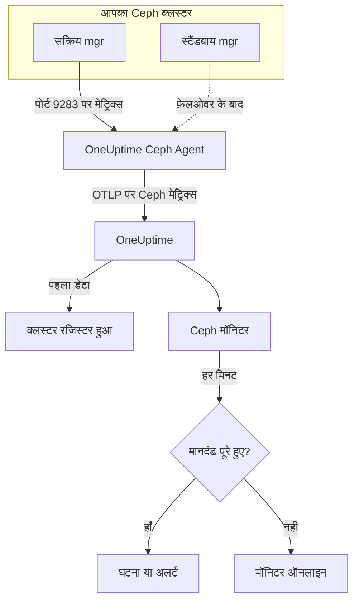

# Ceph मॉनिटर

Ceph मॉनिटर एक Ceph क्लस्टर पर नज़र रखता है — उसकी हेल्थ, हेल्थ चेक, mon कोरम, OSD, पूल और प्लेसमेंट ग्रुप — और जैसे ही हेल्थ बिगड़ती है, कोई OSD डाउन होता है या क्षमता कम पड़ने लगती है, उसी पल आपको बताता है। यह Ceph mgr के `prometheus` मॉड्यूल द्वारा एक्सपोर्ट किए गए और OneUptime Ceph Agent द्वारा इकट्ठा किए गए `ceph_*` मेट्रिक्स पढ़ता है, इसलिए बाहर से कुछ भी प्रोब नहीं किया जाता।

:::cards
- [मॉनिटर बनाएं](#ceph-मॉनिटर-बनाएं): डैशबोर्ड में छह चरण।
- [टेम्पलेट](#पहले-से-बने-अलर्ट-टेम्पलेट): हेल्थ, OSD, प्लेसमेंट ग्रुप और क्षमता के लिए 23 तैयार अलर्ट।
- [हेल्थ चेक](#हेल्थ-चेक-सीरीज़): किसी भी Ceph हेल्थ चेक पर उसके नाम से अलर्ट करें।
- [मेट्रिक्स](#इकट्ठा-किए-गए-मेट्रिक्स): हर `ceph_*` सीरीज़ जिस पर मॉनिटर अलर्ट कर सकता है।
:::

## यह कैसे काम करता है

Ceph mgr का `prometheus` मॉड्यूल क्लस्टर के मेट्रिक्स पोर्ट 9283 पर देता है। OneUptime Ceph Agent हर 30 सेकंड में हर mgr डेमन को स्क्रेप करता है — सक्रिय mgr जवाब देता है, स्टैंडबाय तब तक कुछ नहीं लौटाते जब तक वे काम नहीं संभाल लेते — Ceph के अपने लेबल (`ceph_daemon`, `pool_id`) बनाए रखता है और मेट्रिक्स को क्लस्टर के नाम `ceph.cluster.name` के साथ OTLP पर OneUptime को भेजता है। पहला डेटा आते ही क्लस्टर रजिस्टर हो जाता है।

Ceph मॉनिटर एक क्लस्टर से जुड़ा होता है। हर मिनट यह उस क्लस्टर के मेट्रिक्स पर अपनी क्वेरी चलाता है और नतीजे की तुलना अपने मानदंडों से करता है।



## शुरू करने से पहले

- क्लस्टर पर **mgr का `prometheus` मॉड्यूल चालू करें**:

  ```bash
  ceph mgr module enable prometheus
  ```

- ऐसी मशीन पर **Ceph Agent इंस्टॉल करें** जो पोर्ट 9283 पर हर mgr डेमन तक पहुँच सके, और उन सभी को `CEPH_MGR_ENDPOINTS` में सूचीबद्ध करें। इंस्टॉल करने का तरीका [Ceph एजेंट गाइड](/docs/telemetry/ceph) में है।
- **जाँचें कि क्लस्टर रजिस्टर हो गया है।** पहले स्क्रेप के लगभग एक मिनट बाद यह एजेंट के `CEPH_CLUSTER_NAME` के नाम से **उत्पाद → बुनियादी ढांचा → Ceph → सभी क्लस्टर** में दिखता है।
- **हेल्थ-चेक अलर्ट के लिए** Ceph Quincy या उसके बाद का संस्करण चलाएं। पुराने रिलीज़ `ceph_health_detail` एक्सपोर्ट नहीं करते।

## Ceph मॉनिटर बनाएं

:::steps
### नया मॉनिटर शुरू करें

**मॉनिटर** पर जाएं और **मॉनिटर बनाएं** पर क्लिक करें।

### Ceph चुनें

**मॉनिटर प्रकार** में **और मॉनिटर प्रकार** पर क्लिक करें और **बुनियादी ढांचा** के अंतर्गत **Ceph** चुनें, या खोज बॉक्स में `ceph` टाइप करें। एक **नाम** दर्ज करें — इसका उपयोग घटना और अलर्ट के शीर्षकों में होता है — और **अगला** पर क्लिक करें।

### क्लस्टर चुनें

**Ceph Monitor Configuration** में, **Ceph Cluster** से क्लस्टर चुनें। जिस भी क्लस्टर ने डेटा भेजा है, वह सूची में है।

### तय करें कि किस पर नज़र रखनी है

तीन टैब में से एक चुनें:

- **Quick Setup** — किसी [टेम्पलेट](#पहले-से-बने-अलर्ट-टेम्पलेट) पर क्लिक करें। यह मेट्रिक्स, फ़िल्टर, एकत्रीकरण, समय सीमा और थ्रेशोल्ड सेट करता है, और नीचे के मानदंडों को अपने मानदंडों से बदल देता है। आप **समय सीमा** फिर भी बदल सकते हैं।
- **Custom Metric** — **Ceph Metric** से एक मेट्रिक चुनें, फिर **एकत्रीकरण** और **समय सीमा** सेट करें। **OSD** और **Pool ID** इसे एक डेमन या पूल तक सीमित करते हैं।
- **उन्नत** — **मेट्रिक्स चुनें** में क्वेरी और सूत्र खुद बनाएं, उदाहरण के लिए `ceph_cluster_total_used_bytes / ceph_cluster_total_bytes` से उपयोग की गई क्षमता का अनुपात। हर डेमन या पूल को अलग से आंकने के लिए **Group by** में `ceph_daemon` या `pool_id` का उपयोग करें।

### मानदंड जाँचें

**मॉनिटर मानदंड** में हर मानदंड खोलें और उसकी **मीट्रिक**, **एकत्रीकरण**, **शर्त** और **Threshold** जाँचें। टेम्पलेट इन्हें भर देता है। **Custom Metric** या **उन्नत** के साथ मॉनिटर [डिफ़ॉल्ट मानदंडों](#डिफ़ॉल्ट-मानदंड) से शुरू होता है, जो केवल किसी मेट्रिक के शून्य पर गिरने को पकड़ते हैं, इसलिए अपना थ्रेशोल्ड सेट करें।

### मॉनिटर बनाएं

**मॉनिटर बनाएं** पर क्लिक करें। OneUptime मॉनिटर का पेज खोलता है और हर मिनट उसका मूल्यांकन करता है। इससे बनी घटनाएं और अलर्ट क्लस्टर के **घटनाएं** और **अलर्ट** पेजों पर भी दिखते हैं।
:::

> [!TIP]
> एक साथ कई टेम्पलेट सेट करने के लिए, **उत्पाद → बुनियादी ढांचा → Ceph** से क्लस्टर खोलें और **Recommendations** पर जाएं। अपने चाहे टेम्पलेट चुनें, तय करें कि किसे पेज किया जाए, और OneUptime हर टेम्पलेट के लिए एक मॉनिटर बना देता है।

## मॉनिटर सेटिंग्स

| फ़ील्ड | टैब | यह क्या करता है |
| --- | --- | --- |
| **Ceph Cluster** | सभी | आवश्यक। हर क्वेरी को `resource.ceph.cluster.name` तक सीमित करता है। |
| **OSD** | Custom Metric, उन्नत | वैकल्पिक। `ceph_daemon` लेबल से सटीक मिलान, उदाहरण के लिए `osd.3`। |
| **Pool ID** | Custom Metric, उन्नत | वैकल्पिक। `pool_id` लेबल से सटीक मिलान, उदाहरण के लिए `2`। |
| **Ceph Metric** | Custom Metric | [कैटलॉग](#इकट्ठा-किए-गए-मेट्रिक्स) से एक मेट्रिक। |
| **एकत्रीकरण** | Custom Metric | सैंपल कैसे मिलाए जाते हैं: **औसत**, **अधिकतम**, **न्यूनतम**, **योग** या **गणना**। शुरुआत मेट्रिक के सामान्य एकत्रीकरण से होती है। |
| **समय सीमा** | सभी | क्वेरी जिस रोलिंग विंडो को पढ़ती है, **Past 1 Minute** से **Past 365 Days** तक। नया मॉनिटर **Past 1 Minute** से शुरू होता है; टेम्पलेट अपना मान सेट करते हैं। |
| **मेट्रिक्स चुनें** | उन्नत | क्वेरी बिल्डर: **मीट्रिक**, **Aggregate by**, **Filter by attributes**, **Group by**, साथ में क्वेरी जोड़ने के लिए **मीट्रिक जोड़ें** और **सूत्र जोड़ें**। |

पूल की डेटा सीरीज़ में केवल `pool_id` लेबल होता है: पूल का नाम सिर्फ़ `ceph_pool_metadata` पर मौजूद है। पूल सीरीज़ को `pool_id` से फ़िल्टर और ग्रुप करें, और ज़रूरत पड़ने पर नाम `ceph_pool_metadata` में देखें।

### हेल्थ-चेक सीरीज़

`ceph_health_detail` **हर सक्रिय हेल्थ चेक के लिए एक सीरीज़** एक्सपोर्ट करता है, जिस पर `name` (उदाहरण के लिए `OSD_NEARFULL` या `RECENT_CRASH`) और `severity` लेबल होते हैं। सीरीज़ तभी तक मौजूद रहती है जब तक उसका चेक फ़ायर हो रहा है, इसलिए कोई सीरीज़ न होने का मतलब है कि सब ठीक है। किसी भी Ceph हेल्थ चेक पर अलर्ट करने के लिए उसके `name` पर फ़िल्टर करें, **अधिकतम** के `0` से ऊपर जाने पर फ़ायर करें, और **यदि कोई डेटा नहीं** को **Treat As Zero** पर सेट करके `0` पर रिकवर करें — हेल्थ-चेक टेम्पलेट ठीक इसी तरह बने हैं। `ceph_daemon_health_metrics` हर डेमन के लिए इसी तरह काम करता है, जिसकी कुंजी `type` लेबल (उदाहरण के लिए `SLOW_OPS`) और `ceph_daemon` हैं।

## पहले से बने अलर्ट टेम्पलेट

**Quick Setup** में क्लस्टर हेल्थ, OSD, प्लेसमेंट ग्रुप और क्षमता को कवर करने वाले 23 टेम्पलेट हैं। हर टेम्पलेट एक पूरा मॉनिटर बनाता है — क्वेरी, लेबल फ़िल्टर, एक group-by, फ़ायर होने वाला एक मानदंड और रिकवर होने वाला एक मानदंड। थ्रेशोल्ड शुरुआती बिंदु हैं जिन्हें आप बदल सकते हैं।

जब तक तालिका कुछ और न कहे, टेम्पलेट पिछले 5 मिनट पढ़ते हैं। कोई मानदंड तभी फ़ायर होता है जब शर्त उसकी विंडो के हर मिनट में सही रहे, और थ्रेशोल्ड वाला मानदंड अपने थ्रेशोल्ड से 10% आगे जाकर रिकवर होता है, ताकि रेखा के आसपास मंडराता मान बार-बार स्थिति न बदले। **गंभीरता** वह लेबल है जो पिकर दिखाता है; टेम्पलेट से बनी घटना और अलर्ट आपके प्रोजेक्ट की सबसे गंभीर घटना गंभीरता और अलर्ट गंभीरता से शुरू होते हैं।

### क्लस्टर हेल्थ टेम्पलेट

| टेम्पलेट | गंभीरता | किस पर नज़र | कब फ़ायर होता है | कब रिकवर होता है |
| --- | --- | --- | --- | --- |
| Cluster Health Error | गंभीर | `ceph_health_status`, Max, पिछला 1 मिनट | 2 या अधिक: `HEALTH_ERR` | 1.8 से कम: `HEALTH_WARN` या बेहतर |
| Cluster Health Warning | Warning | `ceph_health_status`, Max | 1 या अधिक: `HEALTH_WARN` या बदतर | 0.9 से कम: `HEALTH_OK` |
| Monitor Quorum Degraded | गंभीर | `ceph_mon_quorum_status`, हर `ceph_daemon` का Min, पिछला 1 मिनट | कोई mon 1 से नीचे जाता है, यानी कोरम से बाहर। हर mon के लिए एक घटना | फिर से 1 |
| Slow Operations | Warning | `ceph_healthcheck_slow_ops`, Max | 0 से ऊपर: क्लस्टर का `SLOW_OPS` चेक सक्रिय है | 0 पर |
| Daemon Slow Operations | Warning | `type = SLOW_OPS` के लिए `ceph_daemon_health_metrics`, हर `ceph_daemon` का Max | 0 से ऊपर। हर OSD या mon के लिए एक घटना | सीरीज़ हट जाती है |
| Daemon Crash | गंभीर | `name = RECENT_CRASH` के लिए `ceph_health_detail`, Max | चेक सक्रिय है: बिना आर्काइव किए डेमन क्रैश मौजूद हैं। mgr में कोई `ceph_crash_*` मेट्रिक नहीं है, इसलिए यही एकमात्र क्रैश संकेत है | क्रैश आर्काइव हो जाते हैं |
| Monitor Clock Skew | Warning | `name = MON_CLOCK_SKEW` के लिए `ceph_health_detail`, Max | चेक सक्रिय है: mon की घड़ियां अनुमत अंतर (डिफ़ॉल्ट 0.05 s) से ज़्यादा खिसक गई हैं | चेक हट जाता है |
| Monitor Disk Critically Low | गंभीर | `name = MON_DISK_CRIT` के लिए `ceph_health_detail`, Max | चेक सक्रिय है: mon की डेटाबेस डिस्क पर 5% से कम जगह खाली है (डिफ़ॉल्ट) | चेक हट जाता है |
| Monitor Disk Space Low | Warning | `name = MON_DISK_LOW` के लिए `ceph_health_detail`, Max | चेक सक्रिय है: 30% से कम जगह खाली है (डिफ़ॉल्ट) | चेक हट जाता है |

### OSD टेम्पलेट

| टेम्पलेट | गंभीरता | किस पर नज़र | कब फ़ायर होता है | कब रिकवर होता है |
| --- | --- | --- | --- | --- |
| OSD Down | गंभीर | `ceph_osd_up`, हर `ceph_daemon` का Min | कोई OSD 1 से नीचे जाता है। हर OSD के लिए एक घटना | फिर से 1 |
| OSD Out | Warning | `ceph_osd_in`, हर `ceph_daemon` का Min | कोई OSD 1 से नीचे जाता है: डेटा वितरण से बाहर चिह्नित | फिर से 1 |
| OSD High Latency | Warning | `ceph_osd_apply_latency_ms`, हर `ceph_daemon` का Avg | 100 ms से ऊपर। हर OSD के लिए एक घटना | 90 ms या उससे कम |
| OSD Slow Heartbeats | Warning | `name = OSD_SLOW_PING_TIME_FRONT` और `name = OSD_SLOW_PING_TIME_BACK` के लिए `ceph_health_detail`, Max | दोनों में से कोई एक चेक सक्रिय है: पब्लिक या क्लस्टर नेटवर्क पर हार्टबीट धीमी हैं। mgr कोई पिंग-टाइम गेज एक्सपोर्ट नहीं करता | दोनों चेक हट जाते हैं |

### प्लेसमेंट ग्रुप टेम्पलेट

| टेम्पलेट | गंभीरता | किस पर नज़र | कब फ़ायर होता है | कब रिकवर होता है |
| --- | --- | --- | --- | --- |
| Inactive Placement Groups | गंभीर | `ceph_pg_total` − `ceph_pg_active`, हर `pool_id` का Max | 0 से ऊपर: PG I/O नहीं संभाल सकते, इसलिए उन तक जाने वाले क्लाइंट अनुरोध अटक जाते हैं। हर पूल के लिए एक घटना | 0 पर |
| Degraded Placement Groups | Warning | `ceph_pg_degraded`, हर `pool_id` का Max | 0 से ऊपर: ऑब्जेक्ट की रेप्लिका कॉन्फ़िगर की गई संख्या से कम हैं | 0 पर |
| Undersized Placement Groups | Warning | `ceph_pg_undersized`, हर `pool_id` का Max | 0 से ऊपर: PG अपनी रेप्लिका संख्या से कम OSD पर मैप होते हैं | 0 पर |
| Damaged Placement Groups | गंभीर | `name = PG_DAMAGED` और `name = OSD_SCRUB_ERRORS` के लिए `ceph_health_detail`, Max | दोनों में से कोई एक चेक सक्रिय है: स्क्रबिंग में नुकसान या रीड त्रुटियां मिलीं | दोनों चेक हट जाते हैं |

### क्षमता टेम्पलेट

| टेम्पलेट | गंभीरता | किस पर नज़र | कब फ़ायर होता है | कब रिकवर होता है |
| --- | --- | --- | --- | --- |
| Cluster Near Full | Warning | `ceph_cluster_total_used_bytes` ÷ `ceph_cluster_total_bytes` × 100 | 85% से ऊपर, Ceph का डिफ़ॉल्ट nearfull अनुपात | 76.5% या उससे कम |
| Cluster Full | गंभीर | वही अनुपात | 95% से ऊपर, Ceph का डिफ़ॉल्ट full अनुपात, जहां पूरे क्लस्टर में लिखना रुक जाता है | 85.5% या उससे कम |
| Pool Near Full | Warning | `ceph_pool_stored` ÷ (`ceph_pool_stored` + `ceph_pool_max_avail`) × 100, हर `pool_id` के लिए | पूल जितना रख सकता है उसके 85% से ऊपर। हर पूल के लिए एक घटना | 76.5% या उससे कम |
| OSD Nearfull | Warning | `name = OSD_NEARFULL` के लिए `ceph_health_detail`, Max | चेक सक्रिय है: किसी OSD ने nearfull थ्रेशोल्ड (डिफ़ॉल्ट 85%) पार किया। अकेले OSD क्लस्टर औसत से बहुत पहले भर जाते हैं | चेक हट जाता है |
| OSD Backfillfull | Warning | `name = OSD_BACKFILLFULL` के लिए `ceph_health_detail`, Max | चेक सक्रिय है: OSD पर बैकफ़िल अस्वीकार हो रहा है (डिफ़ॉल्ट 90%), जिससे रिकवरी रुक जाती है | चेक हट जाता है |
| OSD Full | गंभीर | `name = OSD_FULL` के लिए `ceph_health_detail`, Max, पिछला 1 मिनट | चेक सक्रिय है: कोई OSD full थ्रेशोल्ड (डिफ़ॉल्ट 95%) तक पहुंच गया और लिखना अस्वीकार हो रहा है | चेक हट जाता है |

- **डाउन और कोरम टेम्पलेट न्यूनतम का उपयोग करते हैं**, ताकि एक डाउन OSD या कोरम से बाहर एक mon स्वस्थ बहुमत में छिपने के बजाय उन्हें फ़ायर कर दे।
- **गणना और हेल्थ-चेक टेम्पलेट अधिकतम का उपयोग करते हैं**, ताकि एक खराब स्क्रेप ही काफ़ी हो।
- **PG और पूल सीरीज़ हर पूल के लिए हैं**: पूरे क्लस्टर का कोई गेज नहीं है, इसलिए ये टेम्पलेट `pool_id` से ग्रुप करते हैं और हर पूल के लिए एक घटना खोलते हैं।
- **क्षमता अनुपात** दोनों तरफ़ का **योग** लेते हैं। दोनों एक ही mgr स्क्रेप से आते हैं, इसलिए नतीजा सही प्रतिशत होता है। **Inactive Placement Groups** इसके बजाय हर पूल का **अधिकतम** लेता है, क्योंकि घटाव में योग लेने से स्क्रेप जुड़ जाते।
- **हेल्थ-चेक टेम्पलेट** चेक हटने पर रिकवर होते हैं: उनके रिकवरी मानदंड गायब सीरीज़ को 0 गिनते हैं।

कुछ अलर्ट का कोई टेम्पलेट नहीं है। PG असंतुलन के लिए कई सीरीज़ के आंकड़े चाहिए, जिन्हें मानदंड नहीं निकाल सकते। क्षमता के पूर्वानुमान के लिए वृद्धि का फ़िट चाहिए, जिसे इसके बजाय क्लस्टर का डैशबोर्ड बनाता है। डिस्क विफलता के पूर्वानुमान और पुराने पड़ चुके स्क्रब के लिए कोई mgr मेट्रिक नहीं है, और NVMe-oF, RBD मिररिंग और cephadm के लिए दूसरे एक्सपोर्टर चाहिए।

## इकट्ठा किए गए मेट्रिक्स

एजेंट हर 30 सेकंड में हर mgr डेमन को स्क्रेप करता है और Ceph के अपने लेबल रखता है, इसलिए हर डेमन की सीरीज़ में `ceph_daemon` (`osd.3`, `mon.a`) और हर पूल की सीरीज़ में `pool_id` होता है।

### क्लस्टर हेल्थ मेट्रिक्स

| मेट्रिक | इकाई | विवरण |
| --- | --- | --- |
| `ceph_health_status` | — | कुल हेल्थ: 0 = `HEALTH_OK`, 1 = `HEALTH_WARN`, 2 = `HEALTH_ERR`। |
| `ceph_health_detail` | गिनती | हर **सक्रिय** हेल्थ चेक के लिए एक सीरीज़, `name` और `severity` लेबल के साथ। केवल Quincy और उसके बाद। |
| `ceph_healthcheck_slow_ops` | गिनती | `SLOW_OPS` चेक द्वारा बताए गए धीमे OSD और mon ऑपरेशन। |
| `ceph_daemon_health_metrics` | गिनती | हर डेमन के हेल्थ मेट्रिक्स, `type` (उदाहरण के लिए `SLOW_OPS`) और `ceph_daemon` कुंजी के साथ। |
| `ceph_mon_quorum_status` | गिनती | mon के कोरम में होने पर 1, हर `ceph_daemon` (उदाहरण के लिए `mon.a`) के लिए। |
| `ceph_mon_metadata` | गिनती | mon मेटाडेटा, हमेशा 1। mon गिनने के लिए इसका योग लें। |
| `ceph_cluster_total_bytes` | बाइट | कुल रॉ क्षमता। |
| `ceph_cluster_total_used_bytes` | बाइट | उपयोग में रॉ क्षमता। |

### OSD मेट्रिक्स

| मेट्रिक | इकाई | विवरण |
| --- | --- | --- |
| `ceph_osd_up` | गिनती | OSD के up होने पर 1, हर `ceph_daemon` (उदाहरण के लिए `osd.3`) के लिए। |
| `ceph_osd_in` | गिनती | OSD के डेटा वितरण में होने पर 1। |
| `ceph_osd_apply_latency_ms` | ms | किसी ऑपरेशन को बैकिंग स्टोर पर लागू करने में लगा समय। |
| `ceph_osd_commit_latency_ms` | ms | किसी ऑपरेशन को जर्नल या WAL में कमिट करने में लगा समय। |
| `ceph_osd_stat_bytes` | बाइट | OSD के डिवाइस की रॉ क्षमता। |
| `ceph_osd_stat_bytes_used` | बाइट | OSD पर उपयोग किए गए रॉ बाइट। असमान या लगभग भरे OSD पहचानने के लिए कुल से तुलना करें। |
| `ceph_osd_numpg` | गिनती | OSD पर प्लेसमेंट ग्रुप। |
| `ceph_osd_metadata` | गिनती | OSD मेटाडेटा (होस्टनेम, डिवाइस क्लास, संस्करण), हमेशा 1। OSD गिनने के लिए इसका योग लें। |

### पूल मेट्रिक्स

| मेट्रिक | इकाई | विवरण |
| --- | --- | --- |
| `ceph_pool_stored` | बाइट | पूल में संग्रहीत उपयोगकर्ता डेटा। |
| `ceph_pool_max_avail` | बाइट | पूल की रेप्लिकेशन या इरेज़र-कोडिंग प्रोफ़ाइल को देखते हुए, पूल में अभी भी लिखे जा सकने वाले बाइट। |
| `ceph_pool_objects` | गिनती | पूल में ऑब्जेक्ट। |
| `ceph_pool_rd` | ऑपरेशन | पूल पर रीड ऑपरेशन। आजीवन काउंटर। |
| `ceph_pool_wr` | ऑपरेशन | पूल पर राइट ऑपरेशन। आजीवन काउंटर। |
| `ceph_pool_rd_bytes` | बाइट | पूल से पढ़े गए बाइट। आजीवन काउंटर। |
| `ceph_pool_wr_bytes` | बाइट | पूल में लिखे गए बाइट। आजीवन काउंटर। |
| `ceph_pool_metadata` | गिनती | पूल मेटाडेटा, हमेशा 1 — यही एकमात्र सीरीज़ है जो `pool_id` को नाम से जोड़ती है। |

### प्लेसमेंट ग्रुप मेट्रिक्स

हर `ceph_pg_*` सीरीज़ हर पूल के लिए है, `pool_id` लेबल के साथ; पूरे क्लस्टर की गिनती के लिए सभी पूल का योग लें।

| मेट्रिक | इकाई | विवरण |
| --- | --- | --- |
| `ceph_pg_total` | गिनती | पूल में प्लेसमेंट ग्रुप। |
| `ceph_pg_active` | गिनती | `active` स्थिति वाले PG, जो I/O संभाल सकते हैं। |
| `ceph_pg_clean` | गिनती | `clean` स्थिति वाले PG, पूरी तरह रेप्लिकेट किए हुए। |
| `ceph_pg_degraded` | गिनती | `degraded` स्थिति वाले PG। |
| `ceph_pg_undersized` | गिनती | `undersized` स्थिति वाले PG। |
| `ceph_num_objects_degraded` | गिनती | कॉन्फ़िगर की गई संख्या से कम रेप्लिका वाले ऑब्जेक्ट। |
| `ceph_num_objects_misplaced` | गिनती | ऐसे ऑब्जेक्ट जो वहां नहीं हैं जहां CRUSH उन्हें चाहता है। डेटा सुरक्षित है; केवल प्लेसमेंट गलत है। |

## मॉनिटरिंग मानदंड

मानदंड मॉनिटर की किसी क्वेरी या सूत्र की तुलना एक थ्रेशोल्ड से करता है। Ceph मॉनिटर के मानदंडों में कोई **फ़िल्टर प्रकार** नहीं होता: हर नियम मेट्रिक का मान इन फ़ील्ड के साथ जाँचता है।

| फ़ील्ड | यह क्या करता है |
| --- | --- |
| **मीट्रिक** | जाँचने के लिए क्वेरी या सूत्र, उसके वेरिएबल नाम से। |
| **एकत्रीकरण** | विंडो के मान एक उत्तर कैसे बनते हैं: **औसत**, **योग**, **Maximum Value**, **Minimum Value**, **All Values** (हर मान मेल खाना चाहिए) या **Any Value** (एक काफ़ी है)। |
| **शर्त** | **Greater Than**, **Less Than**, **Greater Than Or Equal To**, **Less Than Or Equal To** या **Equal To** — या कोई विसंगति शर्त: **Anomalously High**, **Anomalously Low** या **Anomalous**। |
| **Threshold** | तुलना के लिए मान। मेट्रिक की इकाई होने पर इसके बगल में इकाइयों की सूची होती है। विसंगति शर्तों के लिए नहीं दिखता। |
| **संवेदनशीलता** | केवल विसंगति शर्तें। **Low** (4σ), **Medium** (3σ, डिफ़ॉल्ट) या **High** (2σ)। |
| **बेसलाइन विंडो** | केवल विसंगति शर्तें। 14 दिन (डिफ़ॉल्ट), 28, 60 या 90 दिन का इतिहास। |
| **यदि कोई डेटा नहीं** | **और फ़ील्ड** के अंतर्गत। विंडो में कोई सैंपल न होने पर क्या होता है: **Ignore** (डिफ़ॉल्ट), **Treat As Zero** या **ट्रिगर**। |

विसंगति शर्तें हर मान की तुलना बेसलाइन में हफ़्ते के उसी घंटे से करती हैं। जब तक बेसलाइन विंडो में पर्याप्त इतिहास न हो, वे "Learning" स्थिति में रहती हैं और कुछ नहीं उठातीं।

हर मानदंड यह भी बताता है कि मेल खाने पर क्या करना है: मॉनिटर की स्थिति बदलना, अलर्ट बनाना या घटना घोषित करना। मानदंड ऊपर से नीचे जाँचे जाते हैं, और जो पहला मेल खाता है वही तय करता है।

### डिफ़ॉल्ट मानदंड

जो मॉनिटर आप टेम्पलेट से नहीं बनाते, वह दो मानदंडों से शुरू होता है:

| क्रम | मानदंड | कब मेल खाता है | फिर |
| --- | --- | --- | --- |
| 1 | Check if _मॉनिटर का नाम_ is offline | पहली क्वेरी का कोई भी मान `0` है | मॉनिटर को **ऑफ़लाइन** चिह्नित करता है और घटना "_मॉनिटर का नाम_ is offline" घोषित करता है, जो मॉनिटर के रिकवर होने पर अपने आप हल हो जाती है। |
| 2 | Check if _मॉनिटर का नाम_ is online | कोई भी मान `0` से ऊपर है | मॉनिटर को **कार्यरत** चिह्नित करता है। |

ये डिफ़ॉल्ट कुछ ही Ceph मेट्रिक्स पर ठीक बैठते हैं: क्लस्टर स्वस्थ होने पर `ceph_health_status` 0 होता है। कोई टेम्पलेट चुनें, या अपने मानदंड सेट करें।

> [!IMPORTANT]
> खामोशी किसी भी मानदंड से मेल नहीं खाती: जो क्लस्टर डेटा भेजना बंद कर देता है, वह मॉनिटर को वैसा ही छोड़ देता है जैसा वह था। डेटा रुकने पर सूचना पाने के लिए, किसी मानदंड पर **यदि कोई डेटा नहीं** को **ट्रिगर** पर सेट करें।

## समस्या निवारण

:::details क्लस्टर Ceph Cluster सूची में नहीं है
क्लस्टर एजेंट के डेटा से खुद रजिस्टर होते हैं। जाँचें कि एजेंट चल रहा है और डेटा भेज रहा है ([Ceph एजेंट गाइड](/docs/telemetry/ceph) देखें), और `CEPH_CLUSTER_NAME` सेट है।
:::

:::details mgr फ़ेलओवर के बाद मेट्रिक्स रुक गए
एजेंट को केवल सक्रिय mgr नहीं, बल्कि **हर** mgr डेमन को स्क्रेप करना होता है: स्टैंडबाय तब तक कुछ नहीं लौटाते जब तक वे काम नहीं संभाल लेते। `CEPH_MGR_ENDPOINTS` में हर mgr सूचीबद्ध करें।
:::

:::details ceph_health_status 1 है लेकिन कुछ फ़ायर नहीं होता
जाँचें कि मानदंड **Greater Than** नहीं, बल्कि **Greater Than Or Equal To** `1` का उपयोग करता है, और मॉनिटर की **समय सीमा** कम से कम एक 30-सेकंड स्क्रेप को कवर करती है।
:::

:::details हेल्थ-चेक टेम्पलेट कभी फ़ायर नहीं होते
जो टेम्पलेट `ceph_health_detail` पर नज़र रखते हैं — Daemon Crash, Monitor Clock Skew, OSD Nearfull, OSD Backfillfull, OSD Full, दो mon-डिस्क टेम्पलेट, Damaged Placement Groups और OSD Slow Heartbeats — उन्हें Quincy या उसके बाद का mgr `prometheus` मॉड्यूल चाहिए। जब कोई चेक सक्रिय हो, तब पुष्टि करें कि सीरीज़ मौजूद है:

```bash
curl http://ACTIVE_MGR:9283/metrics | grep ceph_health_detail
```

हेल्थ-चेक सीरीज़, `ceph_daemon_health_metrics` समेत, केवल तभी मौजूद होती हैं जब कोई चेक फ़ायर हो रहा हो, इसलिए क्लस्टर स्वस्थ होने पर कोई सीरीज़ न मिलना अपेक्षित है।
:::

:::details ceph_pool_wr_bytes जैसे काउंटर केवल बढ़ते हैं
पूल I/O सीरीज़ आजीवन काउंटर हैं, और मानदंड रॉ मानों की तुलना करते हैं: कोई रेट ऑपरेटर नहीं है, और क्वेरी बिल्डर में **Convert to per-second rate** केवल चार्ट बदलता है। उन्हें रेट के रूप में चार्ट करें, या किसी सूत्र से उनकी वृद्धि पर अलर्ट करें, जैसे उसी काउंटर की **अधिकतम** क्वेरी में से **न्यूनतम** क्वेरी घटाना।
:::

## अगले कदम

:::cards
- [Ceph एजेंट](/docs/telemetry/ceph): वह एजेंट इंस्टॉल और अपग्रेड करें जिसे यह मॉनिटर पढ़ता है।
- [Proxmox मॉनिटर](/docs/monitor/proxmox-monitor): स्टोरेज का उपयोग करने वाले Proxmox VE क्लस्टर पर नज़र रखें।
- [स्टोरेज ऐरे मॉनिटर](/docs/monitor/storage-array-monitor): Pure Storage ऐरे के लिए इसी तरह का मॉनिटर।
- [घटनाएं](/docs/incidents/index): किसी मानदंड के घटना घोषित करने के बाद क्या होता है।
:::
