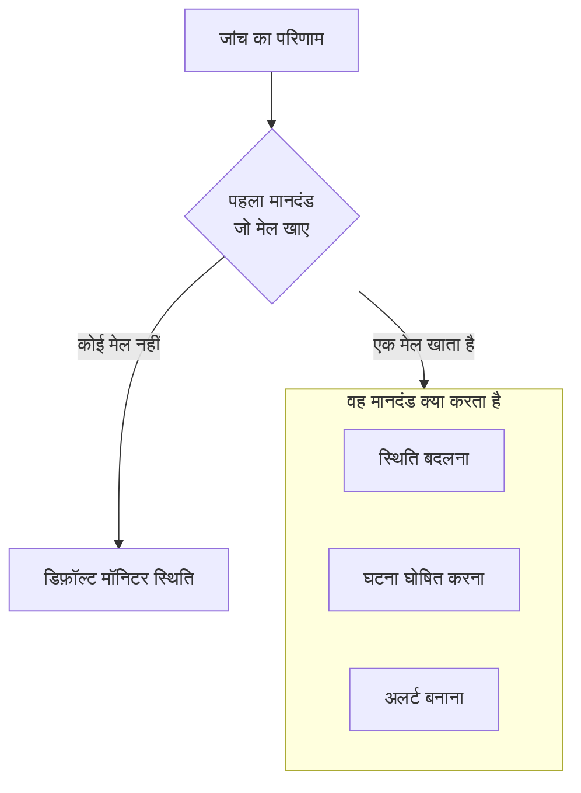

# मॉनिटर बनाना

मॉनिटर आपकी चलाई जाने वाली किसी चीज़ की जांच करता है, जैसे वेबसाइट, API, होस्ट या Kubernetes क्लस्टर, और जब वह काम करना बंद कर दे तो आपको बताता है। **मॉनिटर बनाएं** पहले पूछता है कि क्या मॉनिटर करना है, फिर क्या जांचना है, फिर कितनी बार। प्रकार, नाम और जांचने वाली चीज़ के अलावा सब कुछ ऐसे डिफ़ॉल्ट से शुरू होता है जो ज़्यादातर मॉनिटरों के लिए ठीक हैं।

> [!NOTE]
> मॉनिटर बनाने के लिए आपके पास Project Owner, Project Admin, Project Member, Monitor Admin या Monitor Member भूमिका, या Create Monitor अनुमति वाली कोई कस्टम भूमिका होनी चाहिए।

## मॉनिटर जानकारी

पहला चरण पूछता है कि क्या मॉनिटर करना है और मॉनिटर का नाम क्या रखना है।

:::steps
### मॉनिटर बनाएं खोलें

**मॉनिटर** पर जाएं और **मॉनिटर बनाएं** पर क्लिक करें। फ़ॉर्म अपने पहले चरण, **मॉनिटर जानकारी**, पर खुलता है।

### मॉनिटर का प्रकार चुनें

पहला सवाल **मॉनिटर प्रकार** है: आप क्या मॉनिटर करना चाहते हैं?

- सबसे ज़्यादा बनाए जाने वाले छह प्रकार सबसे पहले आते हैं: **वेबसाइट**, **API**, **Ping**, **पोर्ट**, **SSL Certificate** और cron जॉब व वेबहुक की हार्टबीट के लिए **Incoming Request**।
- **और मॉनिटर प्रकार** बाकी हर प्रकार को उसकी श्रेणी में दिखाता है, जैसे **बुनियादी ढांचा** (Kubernetes, Docker, होस्ट) और **टेलीमेट्री** (लॉग, मेट्रिक्स, ट्रेस)। **Manual**, ऐसा मॉनिटर जिसकी स्थिति आप खुद सेट करते हैं, **अन्य** के अंतर्गत है।
- या खोज बॉक्स में लिखें। यह वे शब्द पहचानता है जो आप पहले से इस्तेमाल करते हैं, जैसे `k8s`, `postgres`, `heartbeat` या `tls`, और **Enter** पहला मिलान चुन लेता है।

चुना गया प्रकार सिमटकर एक पंक्ति बन जाता है। दूसरा प्रकार चुनने के लिए **बदलें** पर क्लिक करें; चुनते समय **Escape** दबाने से पहले वाला प्रकार बना रहता है।

### मॉनिटर का नाम रखें

**नाम** भरें। इसका उपयोग अलर्ट और घटना के शीर्षकों में होता है। **विवरण** और **लेबल** वैकल्पिक हैं और **और फ़ील्ड** में मिलते हैं।

**Manual** मॉनिटर को और कुछ नहीं चाहिए, इसलिए **मॉनिटर बनाएं** इसी चरण पर है। किसी भी दूसरे प्रकार के लिए **अगला** पर क्लिक करें।
:::

## मानदंड

दूसरा चरण पूछता है कि क्या जांचना है, और तय करता है कि किसे समस्या माना जाए।

:::steps
### जांचने वाली चीज़ डालें

यह चरण इस बात से शुरू होता है कि क्या जांचना है। वेबसाइट के लिए यह उसका URL है, और बॉक्स में एक उदाहरण दिखता है; दूसरे प्रकार होस्ट, क्वेरी, क्लस्टर या लॉग फ़िल्टर मांगते हैं। जिन सेटिंग्स को ज़्यादातर मॉनिटर कभी नहीं बदलते, जैसे टाइमआउट और पुनः प्रयास, वे **और फ़ील्ड** में सिमटी रहती हैं।

जिन मॉनिटरों की जांच प्रोब करते हैं, उनके लिए **मॉनिटर का परीक्षण करें** सहेजने से पहले जांच को एक बार चलाता है: **प्रोब चुनें** में कोई प्रोब चुनें और **परीक्षण चलाएं** पर क्लिक करें। जवाब **मॉनिटर परीक्षण परिणाम** में खुलता है।

### मानदंड देखें

उसके नीचे, **मॉनिटर मानदंड** तय करते हैं कि मॉनिटर कब अपनी स्थिति बदलता है, घटना घोषित करता है या अलर्ट बनाता है। नया मॉनिटर ऐसे मानदंडों से शुरू होता है जो ज़्यादातर मॉनिटरों के लिए ठीक हैं, और हर मानदंड सिमटकर एक पंक्ति में बताता है कि वह क्या जांचता है और क्या करता है। उदाहरण के लिए, नया वेबसाइट मॉनिटर तब ऑफ़लाइन दिखता है और घटना घोषित करता है जब साइट जवाब नहीं देती या त्रुटि वाले स्टेटस कोड से जवाब देती है।

किसी मानदंड को खोलकर बदलने के लिए उस पर क्लिक करें। **मानदंड जोड़ें** एक खुला हुआ मानदंड जोड़ता है, जो भरने के लिए तैयार होता है। क्रम बदलने के लिए किसी मानदंड को उसके बाईं ओर के हैंडल से खींचें।

### अगले चरण पर जाएं

**अगला** पर क्लिक करें। जब तक आप **अगला** पर क्लिक नहीं करते, इस चरण पर किसी चीज़ को छूटा हुआ नहीं दिखाया जाता।
:::

### मानदंडों का मूल्यांकन कैसे होता है

हर जांच का परिणाम ऊपर से नीचे तक मानदंडों से होकर गुज़रता है, और जो पहला मानदंड मेल खाता है वही तय करता है कि क्या होगा। वह मानदंड मॉनिटर की स्थिति बदल सकता है, घटना घोषित कर सकता है, अलर्ट बना सकता है, या इन तीनों का कोई भी मेल कर सकता है। जब कोई मेल नहीं खाता, तो मॉनिटर अपनी **डिफ़ॉल्ट मॉनिटर स्थिति** दिखाता है, जो मानदंडों के नीचे **और फ़ील्ड** में सेट होती है (जब तक आप कुछ और न चुनें, यह **कार्यरत** होती है)।

अपने आप हल होने के लिए सेट की गई घटनाएं और अलर्ट, जैसे डिफ़ॉल्ट मानदंडों वाले, अपने मानदंड के मेल खाना बंद करते ही खुद हल हो जाते हैं। एक से ज़्यादा प्रोब से जांचा जाने वाला मॉनिटर तभी बदलता है जब उसके प्रोब सहमत हों: डिफ़ॉल्ट रूप से, चालू और जुड़े हुए हर प्रोब को एक ही परिणाम पर पहुंचना होता है। कम प्रोब की ज़रूरत रखने के लिए, मॉनिटर के **कॉन्फ़िगरेशन → प्रोब और अंतराल** पेज पर **प्रोब सहमति** सेट करें।

## प्रोब और अंतराल

जिन मॉनिटरों की जांच प्रोब करते हैं, वे इसी चरण पर खत्म होते हैं: वेबसाइट, API, Ping, IP, पोर्ट, SSL Certificate, DNS, DNSSEC, NTP, डोमेन, SQL Query, Database Health, Synthetic Monitor, Custom JavaScript Code और External Status Page। **प्रोब** वे मशीनें हैं जो जांच चलाती हैं, और आपके प्रोजेक्ट के डिफ़ॉल्ट प्रोब पहले से चुने रहते हैं। **निगरानी अंतराल** **हर 5 मिनट** से शुरू होता है।

:::steps
### प्रोब चुनें

चुने गए **प्रोब** रखें, या दूसरे चुनें। बिना प्रोब वाले मॉनिटर की कभी जांच नहीं होती। किसी निजी नेटवर्क की चीज़ जांचने के लिए उस नेटवर्क के अंदर [कस्टम प्रोब](/docs/probe/custom-probe) चलाएं और उसे यहां चुनें।

### जांच कितनी बार हो, चुनें

**हर मिनट** से **हर सप्ताह** तक में से कोई **निगरानी अंतराल** चुनें। Synthetic Monitor, Custom JavaScript Code और SSL Certificate मॉनिटरों के लिए 5 मिनट या उससे लंबे अंतराल ही उपलब्ध हैं।

### मॉनिटर बनाएं

**मॉनिटर बनाएं** पर क्लिक करें। नए मॉनिटर का पेज खुल जाता है। बाद में उसके प्रोब या अंतराल बदलने के लिए, उस पेज पर **कॉन्फ़िगरेशन → प्रोब और अंतराल** खोलें।
:::

Manual को छोड़कर बाकी हर प्रकार **मानदंड** चरण से बनाया जाता है।

## टेम्पलेट या लिंक से शुरुआत

मॉनिटर टेम्पलेट, और OneUptime में दूसरी जगहों (मेट्रिक चार्ट, नेटवर्क डिवाइस या डिटेक्शन रूल) पर मॉनिटर बनाने वाले लिंक, **मॉनिटर बनाएं** को इस तरह खोलते हैं कि प्रकार चुना हुआ हो और बाकी सब भरा हुआ हो। दूसरा प्रकार चुनने के लिए **बदलें** पर क्लिक करें। टेम्पलेट का अपना फ़ॉर्म भी यही प्रकार चुनने वाला उपयोग करता है: [मॉनिटर टेम्पलेट](/docs/monitor/monitor-templates) देखें।

हर मॉनिटर प्रकार का अपना पेज है, जिसमें उसकी सेटिंग्स, उसके डिफ़ॉल्ट मानदंड और उदाहरण हैं। आगे जाने के लिए अच्छी जगहें:

:::cards
- [वेबसाइट मॉनिटर](/docs/monitor/website-monitor): जांचें कि पेज लोड होता है या नहीं, और वह क्या जवाब देता है।
- [API मॉनिटर](/docs/monitor/api-monitor): मेथड, हेडर और बॉडी के साथ किसी एंडपॉइंट को कॉल करें।
- [मॉनिटर टेम्पलेट](/docs/monitor/monitor-templates): एक कॉन्फ़िगरेशन से कई मॉनिटर बनाएं और उन्हें एक जैसा रखें।
- [घटनाएं](/docs/incidents/index): मॉनिटर के घटना घोषित करने के बाद क्या होता है।
:::
