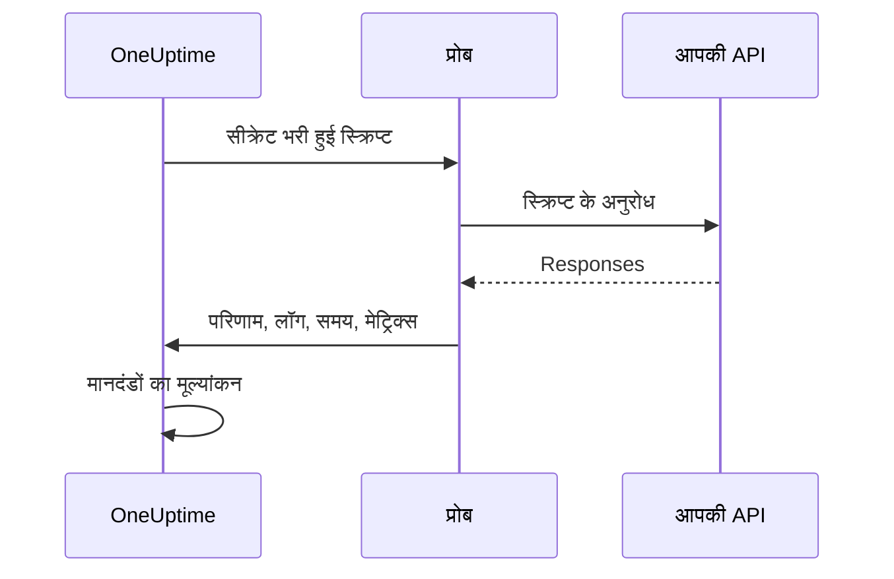

# कस्टम कोड मॉनिटर

कस्टम कोड मॉनिटर आपकी लिखी JavaScript स्क्रिप्ट को एक प्रोब से, एक तय शेड्यूल पर चलाता है। इसका उपयोग उन जाँचों के लिए करें जिन्हें बाकी मॉनिटर प्रकार व्यक्त नहीं कर सकते — लॉग इन के बाद एक प्रमाणित API कॉल, कई चरणों वाला लेन-देन, या कई responses से निकाला गया कोई मान। अगर स्क्रिप्ट कोई त्रुटि फेंकती है, तो जाँच विफल होती है; स्क्रिप्ट जो लौटाती है, वह आपके मानदंडों और घटना टेम्पलेट के लिए उपलब्ध रहता है।

:::cards
- [मॉनिटर बनाएं](#कस्टम-कोड-मॉनिटर-बनाएं): स्क्रिप्ट लिखें और उसे चलाने वाले प्रोब चुनें।
- [स्क्रिप्ट लिखें](#स्क्रिप्ट-लिखें): शुरुआत के लिए चलने लायक, कई चरणों वाली API जाँच।
- [सीक्रेट का उपयोग करें](#मॉनिटर-सीक्रेट-का-उपयोग): पासवर्ड और टोकन को स्क्रिप्ट से बाहर रखें।
- [कस्टम मेट्रिक्स दर्ज करें](#कस्टम-मेट्रिक्स): स्क्रिप्ट जो भी संख्या निकाले, उसका चार्ट बनाएं।
:::

## यह कैसे काम करता है

हर जाँच पर, एक प्रोब आपकी स्क्रिप्ट को एक अलग-थलग JavaScript sandbox में चलाता है, जिसमें आपके मॉनिटर सीक्रेट पहले से भरे होते हैं। स्क्रिप्ट जो चाहिए उसे कॉल करती है, फिर एक परिणाम लौटाती है या त्रुटि फेंकती है। प्रोब परिणाम, स्क्रिप्ट के लॉग संदेश, स्क्रिप्ट कितनी देर चली और उसने कौन से मेट्रिक्स दर्ज किए, यह सब रिपोर्ट करता है, और OneUptime इन्हीं पर आपके मानदंडों का मूल्यांकन करता है।



यह sandbox Node.js नहीं है: इसमें `require`, `process`, `fetch` या फ़ाइल सिस्टम नहीं है, केवल [नीचे दिए गए मॉड्यूल](#स्क्रिप्ट-में-उपलब्ध-मॉड्यूल) हैं।

## शुरू करने से पहले

- एक **प्रोब** जो स्क्रिप्ट द्वारा कॉल किए गए हर endpoint तक पहुँच सके। अपने नेटवर्क के अंदर के endpoints के लिए [कस्टम प्रोब](/docs/probe/custom-probe) का उपयोग करें।
- किसी निजी पते (जैसे `10.0.0.5`) को कॉल करने के लिए प्रोब को इसकी अनुमति देनी होगी: उस प्रोब पर `PROBE_ALLOW_PRIVATE_NETWORK_MONITORS=true` सेट करें। Loopback, link-local और क्लाउड मेटाडेटा पते हमेशा अस्वीकार किए जाते हैं। देखें [निजी नेटवर्क पहुँच](/docs/self-hosted/private-network-access)।
- स्क्रिप्ट को जिन पासवर्ड, API कुंजियों या टोकन की ज़रूरत है, वे सब [मॉनिटर सीक्रेट](/docs/monitor/monitor-secrets) के रूप में सहेजे हुए हों।

## कस्टम कोड मॉनिटर बनाएं

:::steps
### नया मॉनिटर शुरू करें

**मॉनिटर** पर जाएँ और **मॉनिटर बनाएं** पर क्लिक करें। **मॉनिटर प्रकार** में **और मॉनिटर प्रकार** पर क्लिक करें और **Synthetic Monitoring** के अंतर्गत **Custom JavaScript Code** चुनें, या खोज बॉक्स में `script` टाइप करें। एक **नाम** दर्ज करें, फिर **अगला** पर क्लिक करें।

### स्क्रिप्ट जोड़ें

अपनी स्क्रिप्ट **JavaScript कोड** editor में लिखें। [नीचे दिए गए उदाहरण](#स्क्रिप्ट-लिखें) से शुरू करें।

### परीक्षण करें

स्क्रिप्ट को एक प्रोब से एक बार चलाने के लिए **मॉनिटर का परीक्षण करें** पर क्लिक करें, और उसका परिणाम जाँचें।

### मानदंडों की समीक्षा करें

मॉनिटर दो मानदंडों के साथ शुरू होता है: स्क्रिप्ट विफल होने पर वह ऑफ़लाइन हो जाता है और एक घटना घोषित करता है, और विफल न होने पर ऑनलाइन रहता है। इन्हें बदलें या अपने मानदंड जोड़ें — देखें [मानदंड](#मानदंड) — फिर **अगला** पर क्लिक करें।

### प्रोब चुनें और बनाएं

वे **प्रोब** चुनें जो आपके endpoints तक पहुँच सकते हैं, और एक **निगरानी अंतराल** चुनें — कस्टम कोड मॉनिटर के लिए 5 मिनट या उससे लंबे अंतराल मिलते हैं — फिर **मॉनिटर बनाएं** पर क्लिक करें।
:::

## स्क्रिप्ट लिखें

स्क्रिप्ट एक `async` फ़ंक्शन की body है: आप सबसे ऊपरी स्तर पर `await` कर सकते हैं, `return` से परिणाम लौटा सकते हैं, और `throw` से जाँच को विफल कर सकते हैं। यह उदाहरण लॉग इन करता है, मिले हुए टोकन के साथ एक endpoint को कॉल करता है, और अपेक्षित response न मिलने पर विफल होता है:

```javascript title="Custom code monitor script"
// 1. Log in. axios rejects a 4xx or 5xx response, which fails the check.
const login = await axios.post("https://api.example.com/v1/login", {
  username: "monitoring@example.com",
  password: "{{monitorSecrets.ApiPassword}}",
});

// 2. Call an endpoint that needs the token.
const orders = await axios.get("https://api.example.com/v1/orders?limit=10", {
  headers: { Authorization: `Bearer ${login.data.token}` },
  timeout: 10000,
});

// 3. Fail the check when the data is wrong, not only when the request fails.
if (!Array.isArray(orders.data.items)) {
  throw new Error("The orders endpoint returned no items");
}

console.log(`Fetched ${orders.data.items.length} orders`);

// 4. Return what the criteria and incident templates should see.
return {
  data: orders.data.items.length,
};
```

| इसके लिए | यह करें | OneUptime क्या दर्ज करता है |
| --- | --- | --- |
| परिणाम रिपोर्ट करना | किसी भी JSON मान के साथ `return { data: ... }` | **परिणाम**। केवल `data` property रखी जाती है: `return 5` कोई परिणाम दर्ज नहीं करता। |
| जाँच विफल करना | `throw new Error("...")` | **स्क्रिप्ट त्रुटि**, जिसे डिफ़ॉल्ट मानदंड एक घटना में बदल देते हैं। |
| निशान छोड़ना | `console.log(...)` | **लॉग संदेश**, हर रन में अधिकतम 1,000। |

किसी रन को देखने के लिए मॉनिटर का **अवलोकन** खोलें: **मॉनिटर सारांश** कार्ड प्रोब, निष्पादन समय और त्रुटि दिखाता है, और **अधिक विवरण दिखाएं** परिणाम, स्क्रिप्ट त्रुटि और लॉग संदेश दिखाता है। पिछली जाँचों के लिए **निगरानी लॉग** में यही सारांश है।

> [!NOTE]
> इस sandbox में `axios` redirects का पालन नहीं करता, और उसके अनुरोध प्रोब पर कॉन्फ़िगर किए गए proxy से होकर नहीं जाते। अंतिम URL का अनुरोध करें।

## मॉनिटर सीक्रेट का उपयोग

स्क्रिप्ट में कहीं भी किसी सीक्रेट को `{{monitorSecrets.NAME}}` के रूप में संदर्भित करें। स्क्रिप्ट के प्रोब तक पहुँचने से पहले OneUptime इस संदर्भ को सीक्रेट के मान से, सादे टेक्स्ट के रूप में, बदल देता है। इसलिए किसी सीक्रेट को string के रूप में इस्तेमाल करने के लिए उसे उद्धरण चिह्नों में रखें, और number या boolean के रूप में इस्तेमाल करने के लिए बिना उद्धरण चिह्नों के छोड़ें:

```javascript
// Used as a string: wrap it in quotes.
const apiKey = "{{monitorSecrets.ApiKey}}";

// Used as a number or a boolean: leave it bare.
const retryLimit = {{monitorSecrets.RetryLimit}};
const verbose = {{monitorSecrets.Verbose}};

// Check the secret was filled in without logging the secret itself.
console.log(apiKey.length > 0);
```

जिस सीक्रेट मान में उद्धरण चिह्न होता है, वह अपने आसपास की string को तोड़ देता है। जिस संदर्भ का उपयोग मॉनिटर नहीं कर सकता, वह स्क्रिप्ट में वैसा ही बना रहता है जैसा लिखा गया था। सीक्रेट बनाने और यह चुनने के लिए कि कौन से मॉनिटर उसका उपयोग कर सकते हैं, देखें [मॉनिटर रहस्य](/docs/monitor/monitor-secrets)।

## कस्टम मेट्रिक्स

आप `oneuptime.captureMetric()` फ़ंक्शन से अपनी स्क्रिप्ट में कस्टम मेट्रिक्स दर्ज कर सकते हैं। ये मेट्रिक्स OneUptime में संग्रहीत होते हैं और Metric Explorer से डैशबोर्ड पर चार्ट के रूप में दिखाए जा सकते हैं।

```javascript
oneuptime.captureMetric(name, value, attributes);
```

| पैरामीटर | प्रकार | विवरण |
| --- | --- | --- |
| `name` | string, आवश्यक | मेट्रिक का नाम (जैसे `"api.response.time"`)। यह अपने आप `custom.monitor.` उपसर्ग के साथ संग्रहीत होता है। |
| `value` | number, आवश्यक | मेट्रिक का संख्यात्मक मान। जो मान संख्या नहीं है, उसे अनदेखा किया जाता है। |
| `attributes` | object, वैकल्पिक | अतिरिक्त संदर्भ के लिए key-value जोड़े। String, number और boolean मान दर्ज किए जाते हैं (numbers और booleans टेक्स्ट के रूप में संग्रहीत होते हैं, क्योंकि मेट्रिक attributes माप नहीं, आयाम होते हैं)। किसी भी अन्य प्रकार के मान अनदेखे किए जाते हैं। |

### उदाहरण

```javascript
const response = await axios.get("https://api.example.com/health");

// Capture a simple metric
oneuptime.captureMetric("api.response.time", response.data.latency);

// Capture a metric with attributes
oneuptime.captureMetric("api.queue.depth", response.data.queueDepth, {
  region: "us-east-1",
  environment: "production",
});

return {
  data: response.data,
};
```

दर्ज होने के बाद ये मेट्रिक्स Metric Explorer में `custom.monitor.api.response.time` जैसे नामों के साथ दिखते हैं, और मॉनिटर के **मेट्रिक्स** पेज पर **कस्टम मीट्रिक** के अंतर्गत भी। OneUptime हर डेटा पॉइंट में मॉनिटर और प्रोब जोड़ता है, ताकि आप उनके चार्ट बना सकें, उन पर अलर्ट सेट कर सकें, और मॉनिटर, प्रोब या अपने दिए किसी भी कस्टम attribute से फ़िल्टर कर सकें।

### सीमाएँ

| सीमा | मान | सीमा से आगे |
| --- | --- | --- |
| प्रति स्क्रिप्ट निष्पादन मेट्रिक्स | 100 | आगे की कॉल अनदेखी की जाती हैं। |
| मेट्रिक नाम की लंबाई | 200 वर्ण | नाम काट दिया जाता है। |
| प्रति मेट्रिक attributes | 50 | आगे के attributes हटा दिए जाते हैं। |
| Attribute key की लंबाई | 200 वर्ण | Key काट दी जाती है। |
| Attribute मान की लंबाई | 1000 वर्ण | मान काट दिया जाता है। |

### आरक्षित attribute keys

कुछ attribute नाम OneUptime के अपने हैं, और स्क्रिप्ट उन्हें नहीं लिख सकती। अगर आपकी स्क्रिप्ट इनमें से कोई सेट करती है, तो वह attribute हटा दिया जाता है — मेट्रिक फिर भी दर्ज होता है — और OneUptime के सर्वर लॉग में उस key का नाम बताने वाली एक चेतावनी लिखी जाती है। ये हैं:

- मॉनिटर की पहचान: `monitorId`, `projectId`, `monitorName`, `probeName`, `probeId`, `isCustomMetric`।
- `oneuptime.` या `resource.` namespaces में मौजूद सब कुछ — इनमें वे पहचानकर्ता होते हैं जो OneUptime डेटा ग्रहण करते समय लगाता है।
- संसाधन पहचान attributes: `service.name`, `host.name`, `k8s.cluster.name`, `iot.fleet.name`, `proxmox.cluster.name`, `vmware.vcenter.name`, `ceph.cluster.name`, `storage.array.name` और `docker.swarm.cluster.name`।

ये नाम सिर्फ़ लेबल नहीं हैं — OneUptime इन्हें इस दावे के रूप में वापस पढ़ता है कि कोई डेटा पॉइंट किस संसाधन का है। `service.name: payments-api` वाला मेट्रिक उस सेवा के मेट्रिक्स टैब पर दिखेगा, और अगर आप बाद में `service.name` के अनुसार समूहित एक मेट्रिक मॉनिटर बनाते, तो उसके अलर्ट उस सेवा से जुड़ जाते, उस सेवा के मालिकों को पेज करते, और उस पर रखरखाव विंडो के दौरान चुप रहते। किसी मॉनिटर को किसी सेवा या होस्ट से जोड़ने के लिए इसके बजाय मॉनिटर के अपने लेबल का उपयोग करें।

## मानदंड

कस्टम कोड मॉनिटर के मानदंड इनकी जाँच कर सकते हैं:

| फ़िल्टर प्रकार | यह क्या जाँचता है | फ़िल्टर शर्तें |
| --- | --- | --- |
| **त्रुटि** | स्क्रिप्ट द्वारा फेंकी गई त्रुटि, अगर कोई हो। | शामिल है, Not Contains, Equal To, Not Equal To, Is Empty, Is Not Empty |
| **Result Value** | स्क्रिप्ट द्वारा लौटाया गया `data`। संख्या होने पर संख्या के रूप में तुलना की जाती है। | वही, साथ में Greater Than, Less Than, Greater Than Or Equal To, Less Than Or Equal To, सही और गलत |
| **निष्पादन समय (ms में)** | स्क्रिप्ट कितनी देर चली। | संख्यात्मक तुलनाएँ |

डिफ़ॉल्ट मानदंड **त्रुटि** खाली होने पर मॉनिटर को ऑनलाइन चिह्नित करते हैं, और खाली न होने पर ऑफ़लाइन — एक ऐसी घटना के साथ जो स्क्रिप्ट के फिर से सफल होने पर अपने आप सुलझ जाती है। घटना और अलर्ट टेम्पलेट में यह रन `{{result}}`, `{{scriptError}}`, `{{logMessages}}` और `{{executionTimeInMs}}` के रूप में उपलब्ध है: देखें [घटना और अलर्ट टेम्पलेट](/docs/monitor/incident-alert-templating)।

### लौटाए गए डेटा पर अलर्ट

स्क्रिप्ट `data` के रूप में जो भी लौटाती है, वह मॉनिटर का **Result Value** है, और कोई मानदंड उसकी तुलना कर सकता है — उदाहरण के लिए _Result Value is Equal To `UP`_।

जब `data` एक object या array हो, तो पूरे मान के बजाय उसके एक field की तुलना करने के लिए Result Value फ़िल्टर पर **फ़ील्ड पथ (वैकल्पिक)** भरें। नेस्टेड fields के लिए बिंदु और array items के लिए `[n]` का उपयोग करें:

```javascript
const response = await axios.get("https://api.example.com/health");

return {
  data: {
    status: response.data.status, // "UP"
    cpu_busy_percent: response.data.cpu, // 42
    healthy: response.data.healthy, // true
    checks: response.data.checks, // [{ name: "db", latency: 12 }]
  },
};
```

| फ़ील्ड पथ | किसकी तुलना करता है | उदाहरण शर्त |
| --- | --- | --- |
| `status` | `"UP"` | Not Equal To `UP` |
| `cpu_busy_percent` | `42` | Greater Than `90` |
| `healthy` | `true` | गलत |
| `checks[0].latency` | `12` | Greater Than `500` |

जिस भी field की जाँच करनी हो, उसके लिए एक फ़िल्टर जोड़ें; हर फ़िल्टर की अपनी शर्त और मान हो सकता है।

- पूरे मान की तुलना करने के लिए फ़ील्ड पथ खाली छोड़ें, जैसे उस स्क्रिप्ट के लिए जो एक ही संख्या या string लौटाती है।
- Greater Than, Less Than और बाकी संख्या वाली शर्तें केवल संख्या से मेल खाती हैं, इसलिए field को `"42"` नहीं, `42` के रूप में लौटाएँ। सही और गलत केवल boolean से मेल खाते हैं।
- जो field लौटाए गए डेटा में नहीं है — कोई गायब key, या array के अंत से आगे का index — उसकी तुलना खाली के रूप में होती है: **Is Empty** उससे मेल खाता है, और कोई दूसरी शर्त नहीं।
- जिस field के नाम में बिंदु हो, उसे पथ से संबोधित नहीं किया जा सकता।
- Terraform में फ़िल्टर का `custom_code_monitor_options` फ़ील्ड पथ सेट करता है: देखें [मॉनिटर चरण](/docs/terraform/monitor-steps#comparing-one-field-of-a-scripts-result)।

## स्क्रिप्ट में उपलब्ध मॉड्यूल

| नाम | यह क्या है |
| --- | --- |
| `axios` | Promise पर आधारित HTTP क्लाइंट: `axios(...)` को कॉल करें, या `axios.get`, `post`, `put`, `patch`, `delete`, `head`, `options`, `request` और `create`। अनुरोध और response का आकार सीमित है (हर एक 10 MB), redirects का पालन नहीं होता, और प्रोब का proxy उपयोग नहीं होता। |
| `crypto` | `createHash` और `createHmac` (एक बार `update()` कॉल करें, फिर `digest()`), `randomBytes`, `randomInt` और `randomUUID`। यह Node.js का `crypto` मॉड्यूल नहीं है: इसमें ciphers या signatures नहीं हैं। |
| `http`, `https` | केवल उनकी `Agent` class, `axios` को देने के लिए — उदाहरण के लिए `httpsAgent: new https.Agent({ rejectUnauthorized: false })`। इनमें `request` या `get` नहीं है। |
| `console.log` | डीबगिंग के लिए डेटा लॉग करता है। केवल `console.log` मौजूद है; `console.error` और बाकी नहीं। |
| `oneuptime.captureMetric` | एक कस्टम मेट्रिक दर्ज करता है। देखें [कस्टम मेट्रिक्स](#कस्टम-मेट्रिक्स)। |
| `setTimeout`, `clearTimeout`, `sleep(ms)` | स्क्रिप्ट के अंदर प्रतीक्षा। कोई भी देरी स्क्रिप्ट के timeout से आगे नहीं जाती। |

## ध्यान देने योग्य बातें

- **Timeout।** जो स्क्रिप्ट 60 सेकंड से ज़्यादा चलती है, उसे रोक दिया जाता है और जाँच "Script execution timed out" के साथ विफल होती है। Self-hosted प्रोब पर `PROBE_CUSTOM_CODE_MONITOR_SCRIPT_TIMEOUT_IN_MS` इस सीमा को बदलता है।
- **मेमोरी।** हर रन को 128 MB मेमोरी सीमा वाला अपना sandbox मिलता है।
- **Redirects।** `axios` इनका पालन नहीं करता, इसलिए redirect करने वाला URL अनुरोध को विफल कर देता है। अंतिम URL का उपयोग करें।

## समस्या निवारण

:::details जाँच "Script execution timed out" के साथ विफल होती है
स्क्रिप्ट समय सीमा से ज़्यादा चली। हर अनुरोध को अपना `timeout` (मिलीसेकंड में) दें, ताकि धीमा endpoint जल्दी विफल हो, और त्रुटि में उसका नाम हो।
:::

:::details कोई अनुरोध 301 या 302 स्थिति के साथ विफल होता है
यहाँ `axios` redirects का पालन नहीं करता। URL को उस पते में बदलें जिस पर redirect होता है।
:::

:::details किसी आंतरिक पते का अनुरोध अस्वीकार हो जाता है
प्रोब निजी नेटवर्क पतों की अनुमति नहीं देता। अपने नेटवर्क के अंदर किसी प्रोब पर `PROBE_ALLOW_PRIVATE_NETWORK_MONITORS=true` सेट करें और मॉनिटर को उसी से चलाएँ — देखें [निजी नेटवर्क पहुँच](/docs/self-hosted/private-network-access)।
:::

:::details कोई सीक्रेट भरा नहीं जाता
मॉनिटर उस सीक्रेट का उपयोग नहीं कर सकता, या संदर्भ में दिया नाम सीक्रेट के नाम से पूरी तरह मेल नहीं खाता। देखें [मॉनिटर रहस्य](/docs/monitor/monitor-secrets)।
:::

## अगले कदम

:::cards
- [सिंथेटिक मॉनिटर](/docs/monitor/synthetic-monitor): API कॉल करने के बजाय असली ब्राउज़र चलाएँ।
- [मॉनिटर रहस्य](/docs/monitor/monitor-secrets): अपनी स्क्रिप्ट द्वारा उपयोग किए जाने वाले क्रेडेंशियल सहेजें।
- [घटना और अलर्ट टेम्पलेट](/docs/monitor/incident-alert-templating): स्क्रिप्ट का परिणाम और लॉग घटनाओं में डालें।
:::
