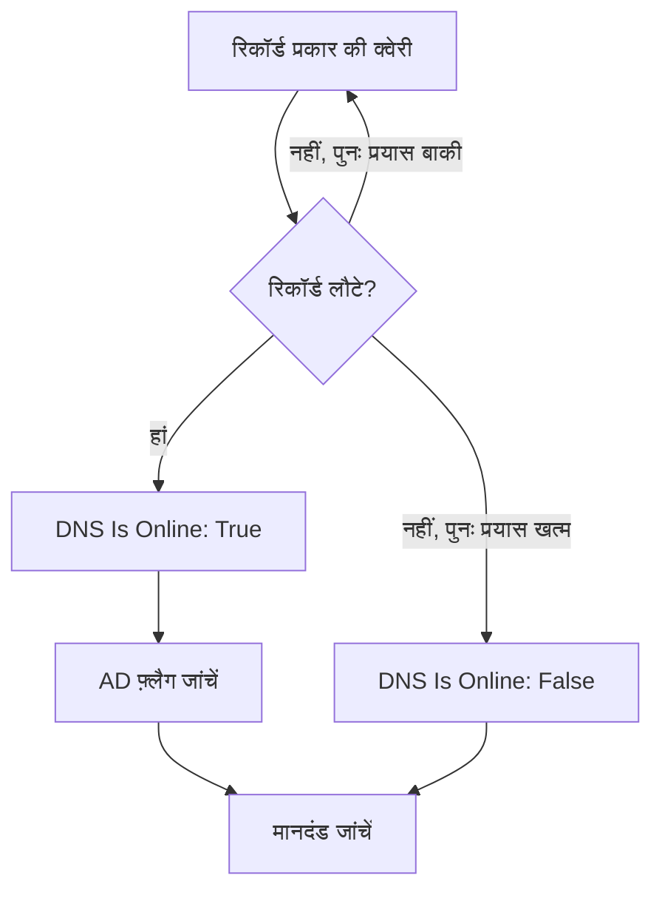

# DNS मॉनिटर

DNS मॉनिटर तय समय पर एक DNS रिकॉर्ड की क्वेरी करता है और जवाब जांचता है: नाम रिज़ॉल्व होता है या नहीं, कितनी तेज़ी से, और रिकॉर्ड में क्या लिखा है। इसका उपयोग DNS आउटेज, बदले या गायब हुए रिकॉर्ड, या धीमे रिज़ॉल्वर को उपयोगकर्ताओं के ध्यान में आने से पहले पकड़ने के लिए करें।

:::cards
- [मॉनिटर बनाएं](#dns-मॉनिटर-बनाएं): डैशबोर्ड में छह चरण।
- [कॉन्फ़िगरेशन विकल्प](#कॉन्फ़िगरेशन-विकल्प): नाम, रिकॉर्ड प्रकार और DNS सर्वर।
- [निगरानी मानदंड](#निगरानी-मानदंड): रिज़ॉल्यूशन, रिकॉर्ड, प्रतिक्रिया समय और DNSSEC।
- [समस्या निवारण](#समस्या-निवारण): जब मॉनिटर और `dig` अलग-अलग बात कहें।
:::

## यह कैसे काम करता है

हर जांच में प्रोब किसी DNS सर्वर से एक नाम का एक रिकॉर्ड प्रकार मांगता है, जैसे `example.com` के `A` रिकॉर्ड। जब सर्वर उस प्रकार के कम से कम एक रिकॉर्ड के साथ जवाब देता है, तो नाम ऑनलाइन होता है। जो क्वेरी विफल होती है, टाइम आउट होती है या कोई रिकॉर्ड नहीं लौटाती, उसे एक सेकंड बाद, आपकी तय की गई पुनः प्रयास संख्या तक फिर से आज़माया जाता है। फिर प्रोब एक वैलिडेटिंग रिज़ॉल्वर से पूछता है कि जवाब पर DNSSEC का authenticated data (AD) फ़्लैग है या नहीं, और OneUptime परिणाम को मॉनिटर के मानदंडों से गुज़ारता है।



जिस प्रोब का अपना नेटवर्क कनेक्शन टूट गया हो, वह कोई परिणाम नहीं भेजता, इसलिए वह आपके DNS को ऑफ़लाइन नहीं दिखा सकता।

## शुरू करने से पहले

- **ऐसी भूमिका जो मॉनिटर बना सके**: Project Owner, Project Admin, Project Member, Monitor Admin या Monitor Member, या Create Monitor अनुमति वाली कोई कस्टम भूमिका।
- **ऐसा प्रोब जो DNS सर्वर तक पहुंच सके।** हर नए मॉनिटर के लिए आपके प्रोजेक्ट के डिफ़ॉल्ट प्रोब चुने जाते हैं। निजी नेटवर्क के किसी DNS सर्वर, जैसे आंतरिक रिज़ॉल्वर, से क्वेरी करने के लिए उस नेटवर्क के अंदर [कस्टम प्रोब](/docs/probe/custom-probe) का उपयोग करें।

## DNS मॉनिटर बनाएं

:::steps
### नया मॉनिटर शुरू करें

**मॉनिटर** पर जाएं और **मॉनिटर बनाएं** पर क्लिक करें। **मॉनिटर प्रकार** में **और मॉनिटर प्रकार** पर क्लिक करें और **DNS Monitoring** के नीचे **DNS** चुनें।

### नाम दें

**नाम** डालें, जैसे `example.com A records`, फिर **अगला** पर क्लिक करें।

### क्वेरी डालें

क्वेरी करने के लिए **डोमेन नाम** डालें, जैसे `example.com`, और उसका **रिकॉर्ड प्रकार** चुनें। किसी खास सर्वर से क्वेरी करने के लिए उसे **DNS सर्वर (वैकल्पिक)** में डालें; प्रोब का अपना रिज़ॉल्वर इस्तेमाल करने के लिए इसे खाली छोड़ दें।

### जांच कर देखें

**मॉनिटर का परीक्षण करें** पर क्लिक करें, **प्रोब चुनें** में कोई प्रोब चुनें और **परीक्षण चलाएं** पर क्लिक करें। **मॉनिटर परीक्षण परिणाम** वे रिकॉर्ड दिखाता है जो प्रोब को वापस मिले।

### मानदंड देखें

**मॉनिटर मानदंड** [डिफ़ॉल्ट मानदंड](#डिफ़ॉल्ट-मानदंड) से शुरू होता है: जब नाम रिज़ॉल्व नहीं होता तो ऑफ़लाइन, जब होता है तो ऑनलाइन। रिकॉर्ड में क्या लिखा है यह जांचने के लिए **DNS Record Value** फ़िल्टर जोड़ें, फिर **अगला** पर क्लिक करें।

### प्रोब चुनें और बनाएं

**प्रोब** और **निगरानी अंतराल** (यह **हर 5 मिनट** से शुरू होता है) को वैसा ही रखें या बदलें, फिर **मॉनिटर बनाएं** पर क्लिक करें। मॉनिटर का पेज खुल जाता है।
:::

## कॉन्फ़िगरेशन विकल्प

| फ़ील्ड | डिफ़ॉल्ट | क्या डालें |
| --- | --- | --- |
| **डोमेन नाम** | कोई नहीं | क्वेरी करने के लिए नाम, जैसे `example.com` या `_sip._tcp.example.com`। `PTR` रिकॉर्ड के लिए रिवर्स नाम, जैसे `34.216.184.93.in-addr.arpa`। |
| **रिकॉर्ड प्रकार** | `A` | क्वेरी करने के लिए रिकॉर्ड प्रकार। [रिकॉर्ड प्रकार](#रिकॉर्ड-प्रकार) देखें। |
| **DNS सर्वर (वैकल्पिक)** | प्रोब का रिज़ॉल्वर | इसकी जगह क्वेरी करने के लिए DNS सर्वर, जैसे `8.8.8.8` या `ns1.example.com`। `CAA` सहित हर रिकॉर्ड प्रकार इसी से पूछा जाता है। |
| **पोर्ट** (**और फ़ील्ड** के नीचे) | `53` | **DNS सर्वर (वैकल्पिक)** वाले सर्वर का पोर्ट। DNSSEC जांच भी इसी पोर्ट से पूछती है। |
| **टाइमआउट (ms)** (**और फ़ील्ड** के नीचे) | `5000` | जवाब के लिए कितनी देर प्रतीक्षा करनी है, मिलीसेकंड में। |
| **पुनः प्रयास** (**और फ़ील्ड** के नीचे) | `3` | पहला प्रयास विफल होने के बाद के पुनः प्रयास। `0` का मतलब है केवल एक प्रयास। |

### रिकॉर्ड प्रकार

**DNS Record Value** मानदंड आपके टेक्स्ट की तुलना हर रिकॉर्ड से उसी रूप में करता है जिसमें प्रोब उसे लिखता है, इसलिए इस फ़ॉर्मैट का पालन करें:

| रिकॉर्ड प्रकार | इसमें क्या होता है | मान का फ़ॉर्मैट, मानदंडों के लिए |
| --- | --- | --- |
| `A` | IPv4 पते | `93.184.216.34` |
| `AAAA` | IPv6 पते | `2606:2800:220:1:248:1893:25c8:1946` |
| `CNAME` | वह नाम जिसका यह उपनाम है | `example.net` |
| `MX` | मेल सर्वर | `10 mail.example.com` (प्राथमिकता, फिर सर्वर) |
| `NS` | नेमसर्वर | `ns1.example.com` |
| `TXT` | टेक्स्ट, जैसे SPF और सत्यापन रिकॉर्ड | `v=spf1 include:_spf.example.com ~all` |
| `SOA` | ज़ोन का start of authority | `ns1.example.com hostmaster.example.com 2024010101 7200 3600 1209600 3600` (सर्वर, संपर्क, सीरियल, refresh, retry, expire, न्यूनतम TTL) |
| `PTR` | वह नाम जिसकी ओर कोई पता वापस इशारा करता है (रिवर्स DNS) | `server1.example.com` |
| `SRV` | सेवाएं | `10 5 5060 sip.example.com` (प्राथमिकता, भार, पोर्ट, लक्ष्य) |
| `CAA` | वे प्रमाणपत्र प्राधिकारी जिन्हें इस नाम के लिए प्रमाणपत्र जारी करने की अनुमति है | `0 letsencrypt.org` (फ़्लैग, फिर प्राधिकारी) |

कई स्ट्रिंग में बंटा `TXT` रिकॉर्ड जोड़कर एक मान बना दिया जाता है।

## निगरानी मानदंड

मानदंड तय करते हैं कि नाम कब ऑनलाइन, डिग्रेडेड या ऑफ़लाइन गिना जाए, और क्या इससे कोई घटना घोषित हो या अलर्ट बने। हर मानदंड एक या अधिक फ़िल्टर जांचता है:

| फ़िल्टर | शर्तें | क्या जांचता है |
| --- | --- | --- |
| **DNS Is Online** | **सही**, **गलत** | क्या क्वेरी ने उस प्रकार का कम से कम एक रिकॉर्ड लौटाया। |
| **DNS Response Time (in ms)** | **Greater Than**, **Less Than**, **Greater Than Or Equal To**, **Less Than Or Equal To** | क्वेरी में कितना समय लगा। |
| **DNS Record Exists** | **सही**, **गलत** | क्या उस प्रकार का कोई रिकॉर्ड वापस आया। |
| **DNS Record Value** | **शामिल है**, **Not Contains**, **Starts With**, **Ends With**, **Equal To**, **Not Equal To** | रिकॉर्ड के मान। कोई एक रिकॉर्ड मेल खाए तो फ़िल्टर मेल खाता है। |
| **DNSSEC Is Valid** | **सही**, **गलत** | क्या कोई वैलिडेटिंग रिज़ॉल्वर जवाब पर AD फ़्लैग लगाता है। |

**DNS Record Value** तब मेल खाता है जब रिकॉर्ड में से _कोई भी_ मेल खाए। कई `A` रिकॉर्ड होने पर **Equal To** `93.184.216.34` तब मेल खाता है जब उनमें से कोई एक वह पता हो, और **Not Equal To** तब मेल खाता है जब उनमें से कोई एक वह पता न हो।

**DNSSEC Is Valid** फ़िल्टर **DNS सर्वर (वैकल्पिक)** वाले सर्वर से, उसके **पोर्ट** पर, पूछता है, या उसके खाली होने पर Google Public DNS (`8.8.8.8`) से, इसलिए आप जो सर्वर सेट करें वह DNSSEC को वैलिडेट करने वाला होना चाहिए। जब प्रोब यह जांच नहीं चला पाता, तो फ़िल्टर का कोई मान नहीं होता और वह किसी भी तरह मेल नहीं खाता। किसी साइन किए गए ज़ोन की पूरी जांच के लिए [DNSSEC मॉनिटर](/docs/monitor/dnssec-monitor) का उपयोग करें।

दो या अधिक फ़िल्टर होने पर, **मिलान शर्त** तय करती है कि **सभी** का मिलना ज़रूरी है या **कोई भी** एक काफ़ी है। किसी मानदंड की **क्रियाएँ** तय करती हैं कि वह क्या करता है: मॉनिटर की स्थिति बदलना, अलर्ट बनाना, घटना घोषित करना, या इनका कोई भी मेल।

### डिफ़ॉल्ट मानदंड

नया DNS मॉनिटर दो मानदंडों से शुरू होता है:

- **ऑफ़लाइन** — हर पुनः प्रयास के बाद भी नाम रिज़ॉल्व नहीं होता, या उस प्रकार का कोई रिकॉर्ड नहीं है। मॉनिटर **ऑफ़लाइन** चिह्नित होता है और "_monitor name_ is offline" नाम की एक घटना बनती है। नाम फिर से रिज़ॉल्व होने पर घटना अपने आप हल हो जाती है।
- **ऑनलाइन** — नाम रिज़ॉल्व होता है। मॉनिटर **कार्यरत** चिह्नित होता है।

मानदंड ऊपर से नीचे जांचे जाते हैं, और जो पहला मेल खाता है वही तय करता है कि क्या होगा। जब कोई मेल नहीं खाता, तो मॉनिटर अपनी डिफ़ॉल्ट स्थिति दिखाता है: **कार्यरत**, जब तक आप मानदंडों के नीचे **और फ़ील्ड** में कुछ और न चुनें।

### एक समयावधि में मूल्यांकन

**इस मानदंड का एक समयावधि के दौरान मूल्यांकन करें** किसी फ़िल्टर के नीचे का एक चेकबॉक्स है, जो **DNS Is Online** और **DNS Response Time (in ms)** के लिए उपलब्ध है। इसे चालू करने पर केवल नवीनतम जांच की जगह पिछली जांचों की एक अवधि को परखा जाता है: **मूल्यांकन करें** में एक एग्रीगेट चुनें और **पिछले (मिनटों में) के लिए** में 2 से 60 मिनट की अवधि चुनें।

| एग्रीगेट | कब मेल खाता है |
| --- | --- |
| **औसत**, **योग**, **Maximum Value**, **Minimum Value** | पूरी अवधि का वह आंकड़ा शर्त पूरी करता है। केवल **DNS Response Time (in ms)** के लिए। |
| **All Values** | अवधि की हर जांच शर्त पूरी करती है। |
| **Any Value** | अवधि की कम से कम एक जांच शर्त पूरी करती है। |

**All Values** तभी मेल खाता है जब अवधि सचमुच डेटा से ढकी हो। अभी-अभी बना मॉनिटर, या ऐसा मॉनिटर जिसकी जांचें दर्ज होना बंद हो गई हों, उसके पास पिछले N मिनट के बारे में कुछ कहने लायक इतिहास नहीं होता, इसलिए मानदंड अपने पास मौजूद एक रीडिंग पर मेल खाने की जगह इंतज़ार करता है। **Any Value** "जैसे ही कोई एक जांच सीमा पार करे, मुझे बताओ" के लिए है और अब भी तुरंत ट्रिगर होता है।

**यदि कोई डेटा नहीं** तय करता है कि जब अवधि मानदंड का समर्थन नहीं कर सकती तब क्या होता है:

| विकल्प | क्या होता है | किसके लिए |
| --- | --- | --- |
| **Ignore** (डिफ़ॉल्ट) | मानदंड मेल नहीं खाता। | सामान्य थ्रेशोल्ड अलर्ट। |
| **ट्रिगर** | डेटा का न होना ही समस्या माना जाता है। | ऐसी जांचें जहां चुप्पी अपने आप में विफलता है। |
| **Treat As Zero** | अवधि की तुलना एक शून्य के रूप में होती है। | ऐसे काउंटर जहां कोई घटना न होने का सचमुच मतलब शून्य है। |

### मानदंड के उदाहरण

| लक्ष्य | फ़िल्टर | शर्त | मान |
| --- | --- | --- | --- |
| नाम रिज़ॉल्व होना बंद हो तो ऑफ़लाइन | **DNS Is Online** | **गलत** | — |
| नाम का इकलौता `A` रिकॉर्ड बदले तो अलर्ट | **DNS Record Value** | **Not Equal To** | `93.184.216.34` |
| कोई `MX` रिकॉर्ड आपके डोमेन से बाहर इशारा करे तो अलर्ट | **DNS Record Value** | **Not Contains** | `example.com` |
| DNS धीमा हो तो डिग्रेडेड चिह्नित करें | **DNS Response Time (in ms)** | **Greater Than** | `500` |
| DNSSEC वैलिडेशन विफल हो तो अलर्ट | **DNSSEC Is Valid** | **गलत** | — |

## समस्या निवारण

:::details मॉनिटर ऑफ़लाइन दिखाता है, पर मेरे लिए नाम रिज़ॉल्व होता है
प्रोब ने किसी दूसरे सर्वर से, या किसी दूसरे रिकॉर्ड प्रकार के लिए पूछा। **रिकॉर्ड प्रकार** जांचें: जिस नाम में केवल `CNAME` या केवल `AAAA` रिकॉर्ड हैं, उसमें कोई `A` रिकॉर्ड नहीं होता। उसी सर्वर पर `dig` से तुलना करें:

```bash
dig @8.8.8.8 example.com A
```
:::

:::details सही पता मौजूद होने पर भी Not Equal To मानदंड ट्रिगर होता है
**DNS Record Value** तब मेल खाता है जब कोई एक रिकॉर्ड मेल खाए। कई रिकॉर्ड होने पर **Not Equal To** उनमें से किसी एक के अलग होते ही ट्रिगर हो जाता है। यह जांचने के लिए कि कोई खास मान रिकॉर्ड में मौजूद है, मानदंडों के क्रम का सहारा लें, क्योंकि पहला मेल जीतता है:

1. डिफ़ॉल्ट ऑफ़लाइन मानदंड सबसे ऊपर रखें: **DNS Is Online** / **गलत**।
2. उसके नीचे **DNS Record Value** / **Equal To** / अपेक्षित मान वाला एक मानदंड जोड़ें, जो मॉनिटर को **कार्यरत** चिह्नित करे।
3. उसके भी नीचे **DNS Is Online** / **सही** वाला एक मानदंड जोड़ें, जो मॉनिटर को **ऑफ़लाइन** चिह्नित करे और घटना घोषित करे। यह केवल उन जवाबों से मेल खाता है जिनमें वह मान नहीं है।
:::

:::details DNSSEC Is Valid कभी मेल नहीं खाता
**DNS सर्वर (वैकल्पिक)** वाला सर्वर DNSSEC को वैलिडेट नहीं करता, इसलिए वह कभी AD फ़्लैग नहीं लगाता, या प्रोब जांच नहीं चला पाया। `8.8.8.8` से वैलिडेट करने के लिए फ़ील्ड खाली छोड़ दें, या [DNSSEC मॉनिटर](/docs/monitor/dnssec-monitor) का उपयोग करें।
:::

## अगले कदम

:::cards
- [DNSSEC मॉनिटर](/docs/monitor/dnssec-monitor): साइन किए गए ज़ोन की चेन ऑफ़ ट्रस्ट को वैलिडेट करें।
- [डोमेन मॉनिटर](/docs/monitor/domain-monitor): डोमेन के पंजीकरण और समाप्ति पर नज़र रखें।
- [कस्टम प्रोब](/docs/probe/custom-probe): अपने नेटवर्क से आंतरिक DNS सर्वरों की क्वेरी करें।
- [घटनाओं का अवलोकन](/docs/incidents/index): मॉनिटर के घटना घोषित करने के बाद क्या होता है।
:::
