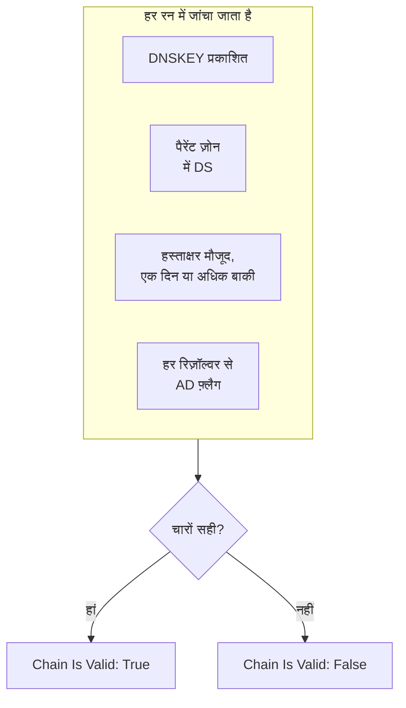

# DNSSEC मॉनिटर

DNSSEC मॉनिटर जांचता है कि साइन किया गया DNS ज़ोन अब भी वैलिडेट होता है: कि वह अपनी कुंजियां प्रकाशित करता है, कि उसका पैरेंट ज़ोन उसकी पुष्टि करता है, कि उसके हस्ताक्षर समाप्त नहीं हुए हैं, और कि वैलिडेटिंग रिज़ॉल्वर उसे स्वीकार करते हैं। इसका उपयोग टूटी हुई चेन ऑफ़ ट्रस्ट को उससे पहले पकड़ने के लिए करें, जब रिज़ॉल्वर आपके डोमेन के लिए `SERVFAIL` लौटाना शुरू कर दें।

:::cards
- [मॉनिटर बनाएं](#dnssec-मॉनिटर-बनाएं): डैशबोर्ड में छह चरण।
- [क्या जांचा जाता है](#यह-कैसे-काम-करता-है): एक वैध चेन के पीछे की जांचें।
- [निगरानी मानदंड](#निगरानी-मानदंड): चेन की वैधता, कुंजियां, DS रिकॉर्ड, हस्ताक्षर, रिज़ॉल्वर और नेमसर्वर।
- [सर्वोत्तम प्रथाएं](#सर्वोत्तम-प्रथाएं): काम करने वाली थ्रेशोल्ड और रिज़ॉल्वर।
:::

## यह कैसे काम करता है

हर जांच में प्रोब ज़ोन पर DNS क्वेरी का एक सेट चलाता है:

| क्वेरी | किससे पूछी जाती है | क्या बताती है |
| --- | --- | --- |
| `DNSKEY` | **रिज़ॉल्वर** का पहला रिज़ॉल्वर | क्या ज़ोन अपनी साइनिंग कुंजियां प्रकाशित करता है। |
| `DS` | **रिज़ॉल्वर** का पहला रिज़ॉल्वर | क्या पैरेंट ज़ोन इस ज़ोन के लिए delegation signer रिकॉर्ड प्रकाशित करता है। |
| `SOA`, DNSSEC रिकॉर्ड के साथ | **रिज़ॉल्वर** का पहला रिज़ॉल्वर | क्या ज़ोन के रिकॉर्ड साइन किए गए हैं (वह `RRSIG` जो उसके `SOA` रिकॉर्ड को साइन करता है), और सबसे पहले समाप्त होने वाला हस्ताक्षर कब समाप्त होता है। |
| `A`, DNSSEC वैलिडेशन के साथ | **रिज़ॉल्वर** का हर रिज़ॉल्वर | क्या हर वैलिडेटिंग रिज़ॉल्वर ज़ोन को स्वीकार करता है, जिसे वह authenticated data (AD) फ़्लैग से दिखाता है। |
| `NS`, फिर `SOA` | पहला रिज़ॉल्वर, फिर उसके बताए हर आधिकारिक नेमसर्वर | क्या हर नेमसर्वर एक ही SOA सीरियल देता है। केवल तब जब **नेमसर्वर संगति जांचें** चालू हो। |

वैलिडेटिंग रिज़ॉल्वर चेन ऑफ़ ट्रस्ट को रूट से नीचे की ओर जांचते हैं, इसलिए AD फ़्लैग बताता है कि पूरी चेन ठीक है। चेन तब वैध गिनी जाती है जब ये सब सही हों:

जिस हस्ताक्षर में एक दिन से कम बाकी हो, उसे पहले से ही टूटा हुआ गिना जाता है, इसलिए रिज़ॉल्वर के ज़ोन को अस्वीकार करना शुरू करने से एक दिन पहले तक आपको इसकी खबर मिल जाती है। जो जांच चेन को टूटा हुआ या नेमसर्वरों को असंगत पाती है, उसे एक सेकंड बाद, आपकी तय की गई पुनः प्रयास संख्या तक फिर से चलाया जाता है, और उसके बाद ही OneUptime परिणाम को मॉनिटर के मानदंडों से गुज़ारता है। एक प्रयास की सभी क्वेरी **टाइमआउट (ms)** के तीन गुना की एक समय-सीमा साझा करती हैं; जिस प्रयास का समय खत्म हो जाता है, वह ज़ोन के बारे में फ़ैसला नहीं, बल्कि टाइमआउट रिपोर्ट करता है।

## शुरू करने से पहले

- **ऐसी भूमिका जो मॉनिटर बना सके**: Project Owner, Project Admin, Project Member, Monitor Admin या Monitor Member, या Create Monitor अनुमति वाली कोई कस्टम भूमिका।
- **साइन किया गया ज़ोन।** ज़ोन साइन किया होना चाहिए, और उसका DS रिकॉर्ड आपके रजिस्ट्रार के ज़रिए पैरेंट ज़ोन में प्रकाशित होना चाहिए।
- **प्रोब से बाहर जाने वाला DNS** आपके बताए रिज़ॉल्वरों तक, और नेमसर्वर संगति जांच के लिए ज़ोन के आधिकारिक नेमसर्वरों तक। हर नए मॉनिटर के लिए आपके प्रोजेक्ट के डिफ़ॉल्ट प्रोब चुने जाते हैं।

## DNSSEC मॉनिटर बनाएं

:::steps
### नया मॉनिटर शुरू करें

**मॉनिटर** पर जाएं और **मॉनिटर बनाएं** पर क्लिक करें। **मॉनिटर प्रकार** में **और मॉनिटर प्रकार** पर क्लिक करें और **DNS Monitoring** के नीचे **DNSSEC** चुनें।

### नाम दें

**नाम** डालें, जैसे `example.com DNSSEC`, फिर **अगला** पर क्लिक करें।

### ज़ोन डालें

**ज़ोन (डोमेन नाम)** में वैलिडेट करने वाला ज़ोन डालें, जैसे `example.com`। डिफ़ॉल्ट **रिज़ॉल्वर** रखें, या कॉमा से अलग करके अपने रिज़ॉल्वर लिखें। जब तक आपका नेटवर्क मनचाहे सर्वरों तक DNS को ब्लॉक न करता हो, **नेमसर्वर संगति जांचें** को चालू रहने दें।

### जांच कर देखें

**मॉनिटर का परीक्षण करें** पर क्लिक करें, **प्रोब चुनें** में कोई प्रोब चुनें और **परीक्षण चलाएं** पर क्लिक करें। **मॉनिटर परीक्षण परिणाम** दिखाता है कि हर जांच में क्या मिला।

### मानदंड देखें

**मॉनिटर मानदंड** [डिफ़ॉल्ट मानदंड](#डिफ़ॉल्ट-मानदंड) से शुरू होता है: चेन टूटी हो तो ऑफ़लाइन, वैध हो तो ऑनलाइन। हस्ताक्षर समाप्त होने से पहले चेतावनी पाने के लिए एक मानदंड जोड़ें ([सर्वोत्तम प्रथाएं](#सर्वोत्तम-प्रथाएं) देखें), फिर **अगला** पर क्लिक करें।

### प्रोब चुनें और बनाएं

**प्रोब** और **निगरानी अंतराल** (यह **हर 5 मिनट** से शुरू होता है) को वैसा ही रखें या बदलें, फिर **मॉनिटर बनाएं** पर क्लिक करें। मॉनिटर का पेज खुल जाता है।
:::

## कॉन्फ़िगरेशन विकल्प

| फ़ील्ड | डिफ़ॉल्ट | क्या डालें |
| --- | --- | --- |
| **ज़ोन (डोमेन नाम)** | कोई नहीं | वैलिडेट करने वाला ज़ोन, जैसे `example.com`। |
| **रिज़ॉल्वर** | `1.1.1.1, 8.8.8.8, 9.9.9.9` | क्वेरी करने वाले वैलिडेटिंग रिज़ॉल्वर, कॉमा से अलग। चेन को वैध गिनने के लिए हर एक को AD फ़्लैग लौटाना होगा। |
| **नेमसर्वर संगति जांचें** | चालू | हर आधिकारिक नेमसर्वर से सीधे क्वेरी करें और उनके SOA सीरियल की तुलना करें। अगर आपका नेटवर्क मनचाहे सर्वरों तक बाहर जाने वाले DNS को ब्लॉक करता है, तो इसे बंद करें। |
| **हस्ताक्षर समाप्ति चेतावनी (दिन)** (**और फ़ील्ड** के नीचे) | `7` | मॉनिटर के साथ सहेजा जाता है। **DNSSEC Signature Expires In Days** फ़िल्टर मानदंड में दिए गए मान का उपयोग करता है, इसलिए अपनी थ्रेशोल्ड वहीं सेट करें। |
| **टाइमआउट (ms)** (**और फ़ील्ड** के नीचे) | `10000` | हर DNS क्वेरी के लिए कितनी देर प्रतीक्षा करनी है, मिलीसेकंड में। एक प्रयास कुल मिलाकर इसके तीन गुना तक ले सकता है। |
| **पुनः प्रयास** (**और फ़ील्ड** के नीचे) | `3` | पहला प्रयास विफल होने के बाद के पुनः प्रयास। `0` का मतलब है केवल एक प्रयास। |

## निगरानी मानदंड

मानदंड तय करते हैं कि ज़ोन कब ऑनलाइन, डिग्रेडेड या ऑफ़लाइन गिना जाए, और क्या इससे कोई घटना घोषित हो या अलर्ट बने। हर मानदंड एक या अधिक फ़िल्टर जांचता है:

| फ़िल्टर | शर्तें | क्या जांचता है |
| --- | --- | --- |
| **DNSSEC Chain Is Valid** | **सही**, **गलत** | ऊपर की चारों जांचें सही हैं: कुंजियां प्रकाशित, पैरेंट ज़ोन में DS, एक दिन या अधिक बाकी वाले हस्ताक्षर मौजूद, और हर रिज़ॉल्वर से AD फ़्लैग। |
| **DNSSEC DNSKEY Record Exists** | **सही**, **गलत** | ज़ोन कम से कम एक DNSKEY रिकॉर्ड प्रकाशित करता है। |
| **DNSSEC DS Record Exists At Parent** | **सही**, **गलत** | पैरेंट ज़ोन इस ज़ोन के लिए DS रिकॉर्ड प्रकाशित करता है। |
| **DNSSEC Signature Expires In Days** | **Greater Than**, **Less Than**, **Greater Than Or Equal To**, **Less Than Or Equal To** | सबसे पहले समाप्त होने वाले हस्ताक्षर (RRSIG) के समाप्त होने तक पूरे दिन। |
| **DNSSEC Resolver Consensus (AD Flag)** | **सही**, **गलत** | **रिज़ॉल्वर** का हर रिज़ॉल्वर AD फ़्लैग लौटाता है। |
| **DNSSEC Nameservers Are Consistent** | **सही**, **गलत** | हर आधिकारिक नेमसर्वर एक ही SOA सीरियल के साथ जवाब देता है। जब तक **नेमसर्वर संगति जांचें** बंद है, यह हमेशा **सही** रहता है। |

दो या अधिक फ़िल्टर होने पर, **मिलान शर्त** तय करती है कि **सभी** का मिलना ज़रूरी है या **कोई भी** एक काफ़ी है। किसी मानदंड की **क्रियाएँ** तय करती हैं कि वह क्या करता है: मॉनिटर की स्थिति बदलना, अलर्ट बनाना, घटना घोषित करना, या इनका कोई भी मेल।

### डिफ़ॉल्ट मानदंड

नया DNSSEC मॉनिटर दो मानदंडों से शुरू होता है:

- **चेन टूटी है** — **DNSSEC Chain Is Valid** **गलत** है। मॉनिटर **ऑफ़लाइन** चिह्नित होता है और "_monitor name_ DNSSEC chain is broken" नाम की एक घटना बनती है। चेन फिर से वैध होते ही घटना अपने आप हल हो जाती है।
- **चेन वैध है** — मॉनिटर **कार्यरत** चिह्नित होता है।

मानदंड ऊपर से नीचे जांचे जाते हैं, और जो पहला मेल खाता है वही तय करता है कि क्या होगा। जब कोई मेल नहीं खाता, तो मॉनिटर अपनी डिफ़ॉल्ट स्थिति दिखाता है: **कार्यरत**, जब तक आप मानदंडों के नीचे **और फ़ील्ड** में कुछ और न चुनें।

डिफ़ॉल्ट मानदंड अपने आप हस्ताक्षर समाप्ति या नेमसर्वर संगति पर नज़र नहीं रखते। उनके लिए नीचे की तरह मानदंड जोड़ें।

### मानदंड के उदाहरण

| लक्ष्य | फ़िल्टर | शर्त | मान |
| --- | --- | --- | --- |
| चेन टूटी हो तो ऑफ़लाइन (एक डिफ़ॉल्ट) | **DNSSEC Chain Is Valid** | **गलत** | — |
| हस्ताक्षर समाप्त होने से पहले चेतावनी | **DNSSEC Signature Expires In Days** | **Less Than** | `7` |
| ऐसा डेलिगेशन पकड़ें जिसका DS रिकॉर्ड खो गया | **DNSSEC DS Record Exists At Parent** | **गलत** | — |
| असहमत रिज़ॉल्वर पकड़ें | **DNSSEC Resolver Consensus (AD Flag)** | **गलत** | — |
| असंगत नेमसर्वर पकड़ें | **DNSSEC Nameservers Are Consistent** | **गलत** | — |

## सर्वोत्तम प्रथाएं

1. **ऐसे रिज़ॉल्वर चुनें जिन तक हमेशा पहुंचा जा सके।** चेन को वैध गिनने के लिए हर रिज़ॉल्वर को AD फ़्लैग लौटाना होता है, इसलिए जिस रिज़ॉल्वर तक प्रोब नहीं पहुंच सकता, वह पुनः प्रयास खत्म होते ही जांच को विफल कर देता है। डिफ़ॉल्ट `1.1.1.1`, `8.8.8.8` और `9.9.9.9` तीन अलग-अलग ऑपरेटर चलाते हैं, जिससे ऐसा ज़ोन भी पकड़ में आता है जो एक रिज़ॉल्वर पर वैलिडेट होता है पर दूसरे पर नहीं।
2. **हस्ताक्षर समाप्त होने से पहले चेतावनी पाएं।** साइनिंग टूल किसी ज़ोन के हस्ताक्षर खत्म होने से पहले उसे दोबारा साइन करते हैं, इसलिए समाप्ति के करीब पहुंचा हस्ताक्षर बताता है कि दोबारा साइन करना रुक गया है। **DNSSEC Signature Expires In Days** / **Less Than** / `7` वाला एक मानदंड जोड़ें जो अलर्ट बनाए, और `2` वाला दूसरा जो घटना घोषित करे। दोनों को उस मानदंड से ऊपर खींचें जो चेन को वैध चिह्नित करता है, `2` दिन वाले को पहले रखते हुए, क्योंकि जो मानदंड पहले मेल खाता है वही जीतता है। ऐसी थ्रेशोल्ड चुनें जो उस समय से कम हों जो आपका साइनिंग टूल दोबारा साइन करने से पहले आम तौर पर किसी हस्ताक्षर पर छोड़ता है, ताकि दोबारा साइन करना ठीक चलने तक वे शांत रहें।
3. **हर साइन किए गए ज़ोन की निगरानी करें।** एपेक्स डोमेन, साइन किए गए सबडोमेन, और किसी दूसरे ऑपरेटर को डेलिगेट किया गया हर ज़ोन शामिल करें।
4. **नेमसर्वर संगति जांच को चालू रखें,** और उसके लिए एक मानदंड जोड़ें। यह ऐसे सेकेंडरी को पकड़ती है जिसने प्राइमरी से ज़ोन ट्रांसफ़र लेना बंद कर दिया हो, जिसे अकेले DNSSEC वैलिडेशन चूक सकता है।

## समस्या निवारण

:::details चेन को टूटा बताया जाता है, पर `dig` से ज़ोन वैलिडेट होता है
**रिज़ॉल्वर** के किसी रिज़ॉल्वर ने AD फ़्लैग नहीं लौटाया: प्रोब उस तक नहीं पहुंच सका, या वह DNSSEC को वैलिडेट नहीं करता। **मॉनिटर परीक्षण परिणाम** और हर जांच के सारांश में मौजूद **Resolver Checks** तालिका हर रिज़ॉल्वर का जवाब और त्रुटि दिखाती है। जिन रिज़ॉल्वरों तक प्रोब नहीं पहुंच सकता उन्हें हटा दें, और केवल वैलिडेटिंग रिज़ॉल्वर रखें।
:::

:::details बदलाव के ठीक बाद नेमसर्वरों को असंगत बताया जाता है
ज़ोन बदलने के बाद कुछ समय तक सेकेंडरी, प्राइमरी से पीछे रह सकते हैं। जांच के सारांश में मौजूद **Nameserver Consistency** तालिका हर नेमसर्वर का SOA सीरियल दिखाती है। अगर कोई एक पीछे ही रह जाए, तो उस सेकेंडरी ने ज़ोन ट्रांसफ़र लेना बंद कर दिया है। अगर हर नेमसर्वर त्रुटि दिखाए, तो प्रोब को उनसे सीधे क्वेरी करने से रोका जा रहा हो सकता है: **नेमसर्वर संगति जांचें** बंद करें।
:::

:::details जांच टाइमआउट रिपोर्ट करती है
एक प्रयास की सभी क्वेरी **टाइमआउट (ms)** का तीन गुना समय साझा करती हैं। कोई धीमा या पहुंच से बाहर रिज़ॉल्वर वह समय खत्म कर देता है; उसे **रिज़ॉल्वर** से हटा दें, या टाइमआउट बढ़ाएं।
:::

## अगले कदम

:::cards
- [DNS मॉनिटर](/docs/monitor/dns-monitor): जांचें कि कोई नाम रिज़ॉल्व होता है, और उसके रिकॉर्ड क्या कहते हैं।
- [डोमेन मॉनिटर](/docs/monitor/domain-monitor): डोमेन के पंजीकरण और समाप्ति पर नज़र रखें।
- [SSL प्रमाणपत्र मॉनिटर](/docs/monitor/ssl-certificate-monitor): डोमेन पर दिए जाने वाले प्रमाणपत्रों पर नज़र रखें।
- [घटनाओं का अवलोकन](/docs/incidents/index): मॉनिटर के घटना घोषित करने के बाद क्या होता है।
:::
