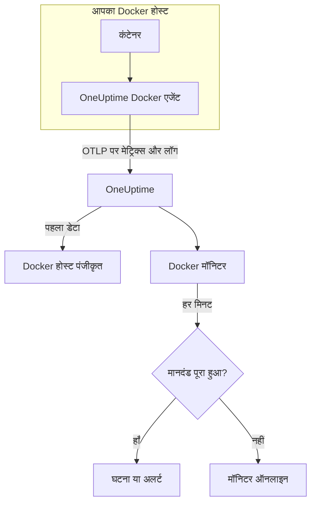

# Docker मॉनिटर

Docker मॉनिटर एक Docker होस्ट पर चल रहे कंटेनरों की निगरानी करता है और आपको बताता है जब कोई कंटेनर गर्म चलता है, मेमोरी खत्म कर देता है या क्रैश-लूप में फँस जाता है। यह उन मेट्रिक्स को पढ़ता है जो OneUptime Docker एजेंट होस्ट से भेजता है, इसलिए बाहर से कुछ भी जाँचा नहीं जाता: एजेंट इंस्टॉल करें, फिर किसी टेम्पलेट या अपनी क्वेरी से मॉनिटर बनाएं।

:::cards
- [मॉनिटर बनाएं](#docker-मॉनिटर-बनाएं): डैशबोर्ड में छह चरण।
- [टेम्पलेट](#तैयार-अलर्ट-टेम्पलेट): छह तैयार अलर्ट, हर कंटेनर के लिए एक घटना।
- [मेट्रिक्स](#इकट्ठा-किए-गए-मेट्रिक्स): एजेंट क्या इकट्ठा करता है, और हर मेट्रिक का क्या मतलब है।
- [लॉग](#इकट्ठा-किए-गए-लॉग): कंटेनर लॉग, और उनके लिए ज़रूरी लॉग ड्राइवर।
:::

## यह कैसे काम करता है

OneUptime Docker एजेंट होस्ट पर एक कंटेनर के रूप में चलता है। हर 30 सेकंड में यह Docker Engine API से कंटेनर आँकड़े पढ़ता है, कंटेनरों की लॉग फ़ाइलों को फ़ॉलो करता है, और दोनों को OTLP पर OneUptime भेजता है। किसी होस्ट से आया पहला डेटा उसे OneUptime में पंजीकृत करता है।

Docker मॉनिटर एक होस्ट से बंधा होता है। हर मिनट यह उस होस्ट के कंटेनर मेट्रिक्स पर अपनी क्वेरी चलाता है और परिणाम की तुलना अपने मानदंडों से करता है।



## शुरू करने से पहले

- **Docker एजेंट इंस्टॉल करें**, होस्ट पर। [Docker एजेंट गाइड](/docs/telemetry/docker-host) इंस्टॉल करना, अपग्रेड करना और जाँचना बताती है।
- **जाँचें कि होस्ट पंजीकृत है।** पहला डेटा आते ही यह एजेंट के `DOCKER_HOST_NAME` के नाम से **उत्पाद → बुनियादी ढांचा → Docker → सभी होस्ट** के अंतर्गत दिखता है।
- **कंटेनर लॉग के लिए** कंटेनरों को Docker के `json-file` लॉग ड्राइवर के साथ चलाएं। [लॉग ड्राइवर की आवश्यकता](#लॉग-ड्राइवर-की-आवश्यकता) देखें।

## Docker मॉनिटर बनाएं

:::steps
### नया मॉनिटर शुरू करें

**मॉनिटर** पर जाएं और **मॉनिटर बनाएं** पर क्लिक करें।

### Docker Container चुनें

**मॉनिटर प्रकार** के अंतर्गत **और मॉनिटर प्रकार** पर क्लिक करें और **बुनियादी ढांचा** के अंतर्गत **Docker Container** चुनें, या खोज बॉक्स में `docker` टाइप करें। एक **नाम** दर्ज करें – यह घटना और अलर्ट के शीर्षकों में उपयोग होता है – और **अगला** पर क्लिक करें।

### होस्ट चुनें

**Docker मॉनिटर कॉन्फ़िगरेशन** के अंतर्गत **Docker होस्ट** से होस्ट चुनें। हर वह होस्ट जिसने डेटा भेजा है, सूची में है।

### तय करें कि किस पर नज़र रखनी है

तीन टैब में से एक चुनें:

- **Quick Setup** – किसी [टेम्पलेट](#तैयार-अलर्ट-टेम्पलेट) पर क्लिक करें। यह मेट्रिक, एकत्रीकरण, समय सीमा और थ्रेशोल्ड सेट करता है, और नीचे के मानदंडों को अपने मानदंडों से बदल देता है। आप अब भी **समय सीमा** बदल सकते हैं।
- **Custom Metric** – **Docker मेट्रिक** से एक मेट्रिक चुनें, फिर **एकत्रीकरण** और **समय सीमा** सेट करें। **कंटेनर नाम** और **कंटेनर इमेज** इसे कुछ कंटेनरों तक सीमित करते हैं।
- **उन्नत** – **मेट्रिक्स चुनें** के अंतर्गत खुद क्वेरी और सूत्र बनाएं। हर कंटेनर का अलग से आकलन करने के लिए **Group by** `resource.container.name` का उपयोग करें।

### मानदंड जाँचें

**मॉनिटर मानदंड** के अंतर्गत हर मानदंड खोलें और उसका **मीट्रिक**, **एकत्रीकरण**, **शर्त** और **Threshold** जाँचें। टेम्पलेट इन्हें भर देता है। **Custom Metric** या **उन्नत** के साथ मॉनिटर [डिफ़ॉल्ट मानदंडों](#डिफ़ॉल्ट-मानदंड) से शुरू होता है, जो सिर्फ़ मेट्रिक के शून्य पर गिरने को पकड़ते हैं, इसलिए अपना थ्रेशोल्ड सेट करें।

### मॉनिटर बनाएं

**मॉनिटर बनाएं** पर क्लिक करें। OneUptime मॉनिटर का पेज खोलता है और हर मिनट उसका मूल्यांकन करता है। यह जो घटनाएं और अलर्ट खोलता है, वे होस्ट के **घटनाएं** और **अलर्ट** पेजों पर भी दिखते हैं।
:::

> [!TIP]
> एक साथ कई टेम्पलेट सेट करने के लिए **उत्पाद → बुनियादी ढांचा → Docker** से होस्ट खोलें और **Recommendations** पर जाएं। अपने चाहे टेम्पलेट और जिन्हें पेज करना है उन्हें चुनें, और OneUptime हर टेम्पलेट के लिए एक मॉनिटर बनाता है।

## मॉनिटर सेटिंग्स

| फ़ील्ड | टैब | यह क्या करता है |
| --- | --- | --- |
| **Docker होस्ट** | सभी | आवश्यक। हर क्वेरी को होस्ट के `resource.host.name` तक सीमित करता है। OneUptime हर क्वेरी में `resource.container.runtime = docker` भी जोड़ता है। |
| **Docker मेट्रिक** | Custom Metric | एजेंट के कैटलॉग से एक मेट्रिक, CPU, मेमोरी, नेटवर्क, ब्लॉक I/O और कंटेनर के रूप में समूहित। |
| **कंटेनर नाम** | Custom Metric, उन्नत | वैकल्पिक। `resource.container.name` से सटीक मिलान, उदाहरण के लिए `my-container`। |
| **कंटेनर इमेज** | Custom Metric, उन्नत | वैकल्पिक। `resource.container.image.name` से सटीक मिलान, उदाहरण के लिए `nginx:latest`। |
| **एकत्रीकरण** | Custom Metric | नमूनों को कैसे जोड़ा जाए: **औसत**, **अधिकतम**, **न्यूनतम**, **योग** या **गणना**। मेट्रिक के सामान्य एकत्रीकरण से शुरू होता है। |
| **समय सीमा** | सभी | वह चलती विंडो जिसे क्वेरी पढ़ती है, **Past 1 Minute** से **Past 365 Days** तक। नया मॉनिटर **Past 1 Minute** से शुरू होता है; टेम्पलेट अपनी विंडो सेट करते हैं। |
| **मेट्रिक्स चुनें** | उन्नत | क्वेरी बिल्डर: **मीट्रिक**, **Aggregate by**, **Filter by attributes**, **Group by**, साथ में क्वेरी जोड़ने के लिए **मीट्रिक जोड़ें** और **सूत्र जोड़ें**। |

## तैयार अलर्ट टेम्पलेट

**Quick Setup** छह टेम्पलेट देता है। हर एक पूरा मॉनिटर बनाता है: `resource.container.name` के अनुसार समूहित एक क्वेरी, एक मानदंड जो ट्रिगर होता है और एक जो ठीक होता है। हर कंटेनर का अलग से आकलन होता है, इसलिए एक व्यस्त कंटेनर दूसरे को नहीं छिपाता, और सीमा पार करने वाले हर कंटेनर को अपनी घटना और अपना अलर्ट मिलता है। थ्रेशोल्ड शुरुआती बिंदु हैं जिन्हें आप संपादित कर सकते हैं।

जब तक तालिका कुछ और न कहे, मानदंड तभी ट्रिगर होता है जब शर्त उसकी विंडो के हर मिनट में सही हो, और थ्रेशोल्ड से 10% आगे ठीक होता है ताकि सीमा पर मंडराता मान बार-बार न बदले।

| टेम्पलेट | गंभीरता | किस पर नज़र रखता है | कब ट्रिगर होता है | कब ठीक होता है |
| --- | --- | --- | --- | --- |
| High Container CPU Usage | Warning | `container.cpu.utilization`, प्रति कंटेनर Max, पिछले 5 मिनट | 80 से ऊपर (एक कोर का %) | 72 या उससे कम |
| High Container Memory Usage | Warning | `container.memory.percent`, प्रति कंटेनर Max, पिछले 5 मिनट | 85% से ऊपर | 76.5% या उससे कम |
| Container Restart Loop | गंभीर | प्रति कंटेनर `container.restarts` की वृद्धि, पिछले 15 मिनट | विंडो में 3 से अधिक रीस्टार्ट (योग) | 2.7 या उससे कम |
| Container CPU Throttling | Warning | प्रति कंटेनर ms में `container.cpu.throttling_data.throttled_time` की वृद्धि, पिछले 5 मिनट | विंडो में 1000 ms से अधिक (योग) | 900 ms या उससे कम |
| High Container Process Count | Warning | `container.pids.count`, प्रति कंटेनर Max, पिछले 5 मिनट | 2000 से ऊपर | 1800 या उससे कम |
| Container Down (Low Uptime) | गंभीर | `container.uptime`, प्रति कंटेनर Min, पिछला 1 मिनट | 0 के बराबर | 0 से ऊपर |

**गंभीरता** वह लेबल है जो चयन सूची दिखाती है। टेम्पलेट जो घटना और अलर्ट बनाता है, वे आपके प्रोजेक्ट की सबसे गंभीर घटना और अलर्ट गंभीरता से शुरू होते हैं; इन्हें मानदंडों में बदलें।

> [!NOTE]
> `container.cpu.utilization` वही संख्या है जो `docker stats` दिखाता है: 100% एक पूरा CPU कोर है, पूरा होस्ट नहीं, इसलिए दो कोर उपयोग करने वाला कंटेनर 200 दिखाता है। कई कोर वाले होस्ट पर 80 का थ्रेशोल्ड एक CPU बजट है, मशीन का हिस्सा नहीं।

> [!NOTE]
> `container.memory.percent` कंटेनर की मेमोरी सीमा सेट होने पर उससे भाग देता है, और सेट न होने पर **होस्ट** की कुल मेमोरी से। किसी सीमा-उल्लंघन को आने वाले out-of-memory किल के रूप में देखने से पहले जाँचें कि कंटेनर `--memory` के साथ शुरू हुआ था या नहीं।

> [!WARNING]
> `container.restarts` और `container.cpu.throttling_data.throttled_time` सिर्फ़ बढ़ते हैं, इसलिए ये दोनों टेम्पलेट इस पर अलर्ट देते हैं कि वे विंडो में कितना बढ़े: हर मिनट एक Maximum और एक Minimum क्वेरी, जिन्हें एक सूत्र घटाता है और जोड़ता है। एजेंट के 30-सेकंड स्क्रेप पर यह असली गतिविधि का लगभग आधा देखता है, और थ्रेशोल्ड इसे पहले से ध्यान में रखते हैं। अगर आप एजेंट का `collection_interval` 60 सेकंड या उससे अधिक कर देते हैं, तो हर मिनट में एक ही नमूना रहता है और दोनों टेम्पलेट अलर्ट देना बंद कर देते हैं।

> [!CAUTION]
> **Container Down (Low Uptime)** ऐसे कंटेनर को नहीं पकड़ सकता जो रुककर रुका ही रहता है। एजेंट सिर्फ़ चल रहे कंटेनरों की रिपोर्ट करता है, इसलिए रुका हुआ कंटेनर कोई डेटा नहीं भेजता और उसका अपटाइम कभी 0 नहीं दिखता। जिस सेवा को चलते रहना ज़रूरी है, उसके लिए वह जो सेवा देती है उसकी भी निगरानी करें – उदाहरण के लिए [API मॉनिटर](/docs/monitor/api-monitor) से।

## इकट्ठा किए गए मेट्रिक्स

एजेंट हर 30 सेकंड में Docker सॉकेट के विरुद्ध OpenTelemetry `docker_stats` रिसीवर का उपयोग करता है। हर कंटेनर के मेट्रिक्स उसकी पहचान को रिसोर्स एट्रिब्यूट के रूप में रखते हैं: `resource.container.name`, `resource.container.image.name`, `resource.container.id`, `resource.container.runtime` (`docker`) और `resource.host.name`।

### CPU

| मेट्रिक | विवरण |
| --- | --- |
| `container.cpu.utilization` | CPU उपयोग, जहाँ 100% एक पूरा CPU कोर है (`docker stats` का CPU% कॉलम)। |
| `container.cpu.usage.total` | कंटेनर शुरू होने के बाद से उपयोग किया गया CPU समय, नैनोसेकंड में। जीवनभर का काउंटर। |
| `container.cpu.throttling_data.throttled_time` | शुरू होने के बाद से कंटेनर को उसकी CPU सीमा द्वारा थ्रॉटल किए जाने के नैनोसेकंड। जीवनभर का काउंटर। |
| `container.cpu.throttling_data.throttled_periods` | कंटेनर शुरू होने के बाद से थ्रॉटलिंग अवधियाँ। जीवनभर का काउंटर। |

### मेमोरी

| मेट्रिक | विवरण |
| --- | --- |
| `container.memory.usage.total` | उपयोग में मेमोरी, बाइट में। |
| `container.memory.usage.limit` | मेमोरी सीमा, बाइट में। |
| `container.memory.percent` | कंटेनर की सीमा के प्रतिशत के रूप में मेमोरी उपयोग, या कंटेनर की कोई सीमा न होने पर होस्ट की कुल मेमोरी के प्रतिशत के रूप में। |

### नेटवर्क

| मेट्रिक | विवरण |
| --- | --- |
| `container.network.io.usage.rx_bytes` | प्राप्त बाइट। जीवनभर का काउंटर। |
| `container.network.io.usage.tx_bytes` | भेजे गए बाइट। जीवनभर का काउंटर। |

### ब्लॉक I/O

| मेट्रिक | विवरण |
| --- | --- |
| `container.blockio.io_service_bytes_recursive.read` | ब्लॉक डिवाइस से पढ़े गए बाइट। |
| `container.blockio.io_service_bytes_recursive.write` | ब्लॉक डिवाइस पर लिखे गए बाइट। |

### कंटेनर

| मेट्रिक | विवरण |
| --- | --- |
| `container.uptime` | कंटेनर शुरू होने के बाद के सेकंड। सिर्फ़ चल रहे कंटेनर इसकी रिपोर्ट करते हैं। |
| `container.restarts` | बनने के बाद से कंटेनर कितनी बार रीस्टार्ट हुआ। जीवनभर का काउंटर। |
| `container.pids.count` | कंटेनर में कार्य। cgroup का pids कंट्रोलर प्रक्रियाओं के साथ थ्रेड भी गिनता है। |

**Docker मेट्रिक** सूची `container.cpu.usage.percpu`, `container.memory.rss`, `container.memory.cache` और नेटवर्क पैकेट काउंटर भी देती है। साथ आने वाला एजेंट कॉन्फ़िगरेशन इन्हें चालू नहीं करता, इसलिए इन पर कुछ बनाने से पहले होस्ट का **मेट्रिक्स** पेज जाँचें। `container.cpu.throttling_data.throttled_periods` सूची में नहीं है; इसे **उन्नत** से क्वेरी करें।

## मॉनिटरिंग मानदंड

मानदंड मॉनिटर की किसी क्वेरी या सूत्र की तुलना एक थ्रेशोल्ड से करता है। Docker मॉनिटर के मानदंडों में **फ़िल्टर प्रकार** नहीं होता: हर नियम इन फ़ील्ड के साथ मेट्रिक मान जाँचता है।

| फ़ील्ड | यह क्या करता है |
| --- | --- |
| **मीट्रिक** | जाँचने के लिए क्वेरी या सूत्र, उसके वेरिएबल नाम से। |
| **एकत्रीकरण** | विंडो के मान एक उत्तर कैसे बनते हैं: **औसत**, **योग**, **Maximum Value**, **Minimum Value**, **All Values** (हर मान को मेल खाना चाहिए) या **Any Value** (एक काफ़ी है)। |
| **शर्त** | **Greater Than**, **Less Than**, **Greater Than Or Equal To**, **Less Than Or Equal To** या **Equal To** – या कोई विसंगति शर्त: **Anomalously High**, **Anomalously Low** या **Anomalous**। |
| **Threshold** | तुलना के लिए मान। मेट्रिक की कोई इकाई होने पर इसके बगल में इकाइयों की सूची होती है। विसंगति शर्तों के लिए नहीं दिखता। |
| **संवेदनशीलता** | सिर्फ़ विसंगति शर्तें। **निम्न** (4σ), **मध्यम** (3σ, डिफ़ॉल्ट) या **उच्च** (2σ)। |
| **बेसलाइन विंडो** | सिर्फ़ विसंगति शर्तें। 14 दिन (डिफ़ॉल्ट), 28, 60 या 90 दिन का इतिहास। |
| **यदि कोई डेटा नहीं** | **और फ़ील्ड** के अंतर्गत। जब विंडो में कोई नमूना न हो तब क्या हो: **Ignore** (डिफ़ॉल्ट), **Treat As Zero** या **ट्रिगर**। |

विसंगति शर्तें हर मान की तुलना बेसलाइन में सप्ताह के उसी घंटे से करती हैं। जब तक बेसलाइन विंडो में पर्याप्त इतिहास न हो, वे "Learning" स्थिति में रहती हैं और कुछ नहीं बनातीं।

हर मानदंड यह भी बताता है कि मेल खाने पर क्या करना है: मॉनिटर की स्थिति बदलना, अलर्ट बनाना या घटना घोषित करना। मानदंड ऊपर से नीचे जाँचे जाते हैं, और जो पहले मेल खाता है वही तय करता है।

### डिफ़ॉल्ट मानदंड

जो मॉनिटर आप टेम्पलेट से नहीं बनाते, वह दो मानदंडों से शुरू होता है:

| क्रम | मानदंड | कब मेल खाता है | फिर |
| --- | --- | --- | --- |
| 1 | Check if _monitor name_ is offline | पहली क्वेरी का कोई भी मान `0` है | मॉनिटर को **ऑफ़लाइन** चिह्नित करता है और घटना "_monitor name_ is offline" घोषित करता है, जो मॉनिटर ठीक होने पर अपने आप सुलझ जाती है। |
| 2 | Check if _monitor name_ is online | कोई भी मान `0` से ऊपर है | मॉनिटर को **कार्यरत** चिह्नित करता है। |

> [!IMPORTANT]
> चुप्पी किसी भी मानदंड से मेल नहीं खाती: डेटा भेजना बंद करने वाला होस्ट मॉनिटर को वैसा ही छोड़ देता है जैसा वह था। डेटा रुकने पर सूचना पाने के लिए किसी मानदंड पर **यदि कोई डेटा नहीं** को **ट्रिगर** पर सेट करें। जिस समय OneUptime खुद डेटा प्राप्त नहीं कर रहा था, वह कभी "कोई डेटा नहीं" नहीं माना जाता: जिस जाँच की विंडो में ऐसा समय हो, वह इसके बजाय प्रतीक्षा करती है, जैसा कि [जब OneUptime डेटा प्राप्त नहीं कर रहा हो](/docs/monitor/when-oneuptime-is-not-receiving) में बताया गया है।

## इकट्ठा किए गए लॉग

एजेंट हर कंटेनर की `*-json.log` फ़ाइल को भी फ़ॉलो करता है और हर पंक्ति को OpenTelemetry लॉग रिकॉर्ड के रूप में भेजता है, जिसमें ये होते हैं:

| फ़ील्ड | मान |
| --- | --- |
| `resource.host.name` | होस्ट, `DOCKER_HOST_NAME` से। |
| `resource.container.id` | पूरा कंटेनर ID। |
| `resource.container.runtime` | हमेशा `docker`। |
| `attributes["log.iostream"]` | `stdout` या `stderr`। |
| `severityText` / `severityNumber` | पंक्ति में जहाँ लेवल हो, वहाँ के लेवल कीवर्ड से पढ़ा जाता है (`[ERROR]`, `app.INFO:`, `{"level":"warn"}`, `level=error`)। बिना लेवल वाली पंक्ति अपनी स्ट्रीम पर निर्भर करती है: `stderr` का मतलब `ERROR`, `stdout` का मतलब `INFO`। |
| `body` | कंटेनर द्वारा लिखी गई पंक्ति। व्हाइटस्पेस या बंद ब्रैकेट से शुरू होने वाली पंक्तियाँ, जैसे स्टैक-ट्रेस फ़्रेम, पिछली पंक्ति से जोड़ दी जाती हैं। |
| `time` | पंक्ति के लिए Docker डेमन का टाइमस्टैम्प। |

लॉग होस्ट के **लॉग** पेज पर और हर कंटेनर के पेज पर दिखते हैं।

### लॉग ड्राइवर की आवश्यकता

एजेंट सिर्फ़ उन कंटेनरों के लॉग पढ़ सकता है जो Docker के `json-file` लॉग ड्राइवर का उपयोग करते हैं। यह Docker का डिफ़ॉल्ट है, लेकिन कोई कंटेनर या पूरा डेमन दूसरा ड्राइवर उपयोग कर सकता है:

| ड्राइवर | एजेंट क्या देखता है |
| --- | --- |
| `json-file` | हर पंक्ति। |
| `local` | कुछ नहीं: फ़ाइल बाइनरी है, और एजेंट उसे पार्स नहीं कर सकता। |
| `journald`, `syslog`, `fluentd`, `gelf`, `awslogs`, `splunk`, … | कुछ नहीं: लॉग कहीं और जाते हैं, इसलिए फ़ॉलो करने के लिए कोई फ़ाइल नहीं है। |
| `none` | कुछ नहीं: लॉग फेंक दिए जाते हैं। |

किसी कंटेनर का ड्राइवर और डेमन का डिफ़ॉल्ट जाँचें:

```bash
docker inspect <container> --format '{{.HostConfig.LogConfig.Type}}'
docker info --format '{{.LoggingDriver}}'
```

`json-file` पर स्विच करें। Docker कंटेनर बनाते समय उसका लॉग ड्राइवर तय करता है, इसलिए बदलाव के बाद हर कंटेनर को फिर से बनाएं – रीस्टार्ट पुराना ड्राइवर ही रखता है।

:::tabs
@tab Docker Compose
हर सेवा पर ड्राइवर सेट करें, रोटेशन के साथ:

```yaml title="docker-compose.yml"
services:
  my-app:
    image: my-app:latest
    logging:
      driver: "json-file"
      options:
        max-size: "100m"
        max-file: "5"
```

फिर सेवा को फिर से बनाएं:

```bash
docker compose up -d --force-recreate <service>
```
@tab Docker डेमन
इसके बाद बनने वाले हर कंटेनर के लिए `json-file` को डिफ़ॉल्ट बनाएं:

```json title="/etc/docker/daemon.json"
{
  "log-driver": "json-file",
  "log-opts": {
    "max-size": "100m",
    "max-file": "5"
  }
}
```

Docker डेमन को रीस्टार्ट करें, फिर हर कंटेनर को हटाकर फिर से बनाएं:

```bash
docker rm -f <container>
docker run ... <image>
```
:::

## समस्या निवारण

:::details होस्ट Docker होस्ट सूची में नहीं है
होस्ट एजेंट के डेटा से अपने आप पंजीकृत होते हैं। जाँचें कि एजेंट कंटेनर चल रहा है और होस्ट **उत्पाद → बुनियादी ढांचा → Docker → सभी होस्ट** के अंतर्गत दिख रहा है। [Docker एजेंट गाइड](/docs/telemetry/docker-host) में होस्ट पर चलाने वाली जाँचें हैं।
:::

:::details मेट्रिक्स आते हैं लेकिन लॉग पेज खाली है
कंटेनर लगभग निश्चित रूप से `json-file` लॉग ड्राइवर का उपयोग नहीं कर रहे। [लॉग ड्राइवर की आवश्यकता](#लॉग-ड्राइवर-की-आवश्यकता) में दिए कमांड से उन्हें जाँचें, जिन कंटेनरों के लॉग चाहिए उन्हें स्विच करें, और उन्हें फिर से बनाएं।
:::

:::details एजेंट "no files match the configured criteria" लॉग करता है
एजेंट `/var/lib/docker/containers/*/*-json.log` खोजता है और उसे कुछ नहीं मिला। या तो होस्ट पर कोई कंटेनर `json-file` का उपयोग नहीं करता, या एजेंट का `/var/lib/docker/containers` माउंट (`-v /var/lib/docker/containers:/var/lib/docker/containers:ro`) गायब या खाली है, या एजेंट macOS के Docker Desktop पर चलता है, जिसकी कंटेनर फ़ाइलें उसकी Linux VM के अंदर होती हैं।
:::

:::details डेटा गलत होस्ट नाम के तहत आता है
OneUptime किसी होस्ट को `resource.host.name` से पहचानता है, जिसे एजेंट `DOCKER_HOST_NAME` से लेता है। पहले डेटा के बाद `DOCKER_HOST_NAME` बदलने से पहला होस्ट नया नाम नहीं पाता, बल्कि दूसरा होस्ट बन जाता है, और मॉनिटर उसी नाम से बंधा रहता है जिससे वह बनाया गया था।
:::

:::details CPU अलर्ट कभी ट्रिगर नहीं होता
**High Container CPU Usage** टेम्पलेट की तरह क्वेरी को `resource.container.name` के अनुसार समूहित करें और **अधिकतम** से एकत्र करें। व्यस्त होस्ट पर सभी कंटेनरों का औसत निष्क्रिय कंटेनरों के कारण नीचे खिंच जाता है। याद रखें कि 100% का मतलब एक पूरा कोर है, इसलिए जिस कंटेनर को कई कोर की अनुमति है, उसे ऊँचे थ्रेशोल्ड की ज़रूरत है।
:::

:::details रीस्टार्ट-लूप या थ्रॉटलिंग टेम्पलेट ने अलर्ट देना बंद कर दिया
दोनों मापते हैं कि एक ही मिनट के दो नमूनों के बीच कोई काउंटर कितना बढ़ा। अगर एजेंट का `collection_interval` 60 सेकंड या उससे अधिक है, तो हर मिनट में एक नमूना रहता है, वृद्धि हमेशा 0 पढ़ी जाती है, और कोई भी टेम्पलेट ट्रिगर नहीं होता। एजेंट का डिफ़ॉल्ट 30 सेकंड ही रखें।
:::

## अगले चरण

:::cards
- [Docker एजेंट](/docs/telemetry/docker-host): वह एजेंट इंस्टॉल, अपग्रेड और ठीक करें जिसे यह मॉनिटर पढ़ता है।
- [Podman मॉनिटर](/docs/monitor/podman-monitor): Podman होस्ट के लिए वही मॉनिटर।
- [Docker Swarm मॉनिटर](/docs/monitor/docker-swarm-monitor): किसी Swarm क्लस्टर के कार्यों पर नज़र रखें।
- [घटनाओं का अवलोकन](/docs/incidents/index): किसी मानदंड के घटना घोषित करने के बाद क्या होता है।
:::
