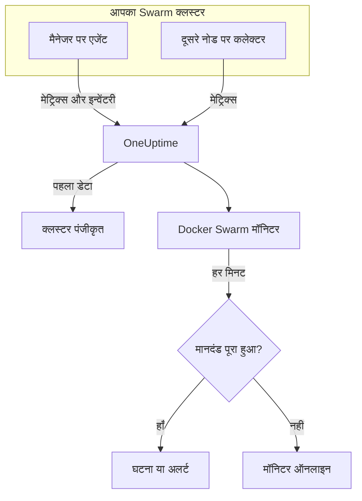

# Docker Swarm मॉनिटर

Docker Swarm मॉनिटर किसी Swarm क्लस्टर के सेवा कार्यों के पीछे चल रहे कंटेनरों की निगरानी करता है और आपको बताता है जब कोई कार्य रीस्टार्ट होता है, गर्म चलता है या मेमोरी खत्म कर देता है। यह उन कंटेनर मेट्रिक्स को पढ़ता है जो OneUptime Docker Swarm एजेंट भेजता है, इसलिए बाहर से कुछ भी जाँचा नहीं जाता: एजेंट इंस्टॉल करें, फिर किसी टेम्पलेट या अपनी क्वेरी से मॉनिटर बनाएं।

:::cards
- [मॉनिटर बनाएं](#docker-swarm-मॉनिटर-बनाएं): डैशबोर्ड में छह चरण।
- [टेम्पलेट](#तैयार-अलर्ट-टेम्पलेट): चार तैयार अलर्ट, हर कार्य के लिए एक घटना।
- [मेट्रिक्स](#इकट्ठा-किए-गए-मेट्रिक्स): वे कंटेनर मेट्रिक्स जिन पर आप अलर्ट दे सकते हैं।
- [फ़िल्टर](#मॉनिटर-सेटिंग्स): मॉनिटर को किसी सेवा, कार्य या इमेज तक सीमित करें।
:::

## यह कैसे काम करता है

OneUptime Docker Swarm एजेंट एक मैनेजर नोड पर चलता है। इसका कलेक्टर हर 30 सेकंड में उस नोड के Docker डेमन से कंटेनर आँकड़े पढ़ता है और हर बैच पर क्लस्टर का नाम `docker.swarm.cluster.name` लगाता है। इसके साथ चलने वाला एक छोटा इन्वेंटरी पोलर हर 5 मिनट में Swarm API से क्लस्टर के नोड, सेवाएं और कार्य पढ़ता है। पहला डेटा क्लस्टर को OneUptime में पंजीकृत करता है।

कलेक्टर सिर्फ़ उसी नोड के कंटेनर देखता है जिस पर वह चलता है। हर नोड से मेट्रिक्स पाने के लिए कलेक्टर को हर नोड पर एक ही `DOCKER_SWARM_CLUSTER_NAME` के साथ चलाएं।

Docker Swarm मॉनिटर एक क्लस्टर से बंधा होता है। हर मिनट यह उस क्लस्टर के कंटेनर मेट्रिक्स पर अपनी क्वेरी चलाता है और परिणाम की तुलना अपने मानदंडों से करता है।

## शुरू करने से पहले

- **Docker Swarm एजेंट इंस्टॉल करें**, किसी मैनेजर नोड पर। [Docker Swarm एजेंट गाइड](/docs/telemetry/docker-swarm) इसे इंस्टॉल और अपग्रेड करना, और दूसरे नोड पर कलेक्टर चलाना बताती है।
- **जाँचें कि क्लस्टर पंजीकृत है।** पहला डेटा आते ही यह एजेंट के `DOCKER_SWARM_CLUSTER_NAME` के नाम से **उत्पाद → बुनियादी ढांचा → Docker Swarm → सभी क्लस्टर** के अंतर्गत दिखता है।

## Docker Swarm मॉनिटर बनाएं

:::steps
### नया मॉनिटर शुरू करें

**मॉनिटर** पर जाएं और **मॉनिटर बनाएं** पर क्लिक करें।

### Docker Swarm चुनें

**मॉनिटर प्रकार** के अंतर्गत **और मॉनिटर प्रकार** पर क्लिक करें और **बुनियादी ढांचा** के अंतर्गत **Docker Swarm** चुनें, या खोज बॉक्स में `swarm` टाइप करें। एक **नाम** दर्ज करें – यह घटना और अलर्ट के शीर्षकों में उपयोग होता है – और **अगला** पर क्लिक करें।

### क्लस्टर चुनें

**Docker Swarm Monitor Configuration** के अंतर्गत **Docker Swarm Cluster** से क्लस्टर चुनें। हर वह क्लस्टर जिसने डेटा भेजा है, सूची में है।

### तय करें कि किस पर नज़र रखनी है

तीन टैब में से एक चुनें:

- **Quick Setup** – किसी [टेम्पलेट](#तैयार-अलर्ट-टेम्पलेट) पर क्लिक करें। यह मेट्रिक, एकत्रीकरण, समय सीमा और थ्रेशोल्ड सेट करता है, और नीचे के मानदंडों को अपने मानदंडों से बदल देता है। आप अब भी **समय सीमा** बदल सकते हैं।
- **Custom Metric** – **Docker Swarm Metric** से एक मेट्रिक चुनें, फिर **एकत्रीकरण** और **समय सीमा** सेट करें। [फ़िल्टर](#मॉनिटर-सेटिंग्स) इसे कुछ कार्यों तक सीमित करते हैं।
- **उन्नत** – **मेट्रिक्स चुनें** के अंतर्गत खुद क्वेरी और सूत्र बनाएं। हर कार्य का अलग से आकलन करने के लिए **Group by** `resource.container.name` का उपयोग करें।

### मानदंड जाँचें

**मॉनिटर मानदंड** के अंतर्गत हर मानदंड खोलें और उसका **मीट्रिक**, **एकत्रीकरण**, **शर्त** और **Threshold** जाँचें। टेम्पलेट इन्हें भर देता है। **Custom Metric** या **उन्नत** के साथ मॉनिटर [डिफ़ॉल्ट मानदंडों](#डिफ़ॉल्ट-मानदंड) से शुरू होता है, जो सिर्फ़ मेट्रिक के शून्य पर गिरने को पकड़ते हैं, इसलिए अपना थ्रेशोल्ड सेट करें।

### मॉनिटर बनाएं

**मॉनिटर बनाएं** पर क्लिक करें। OneUptime मॉनिटर का पेज खोलता है और हर मिनट उसका मूल्यांकन करता है। यह जो घटनाएं और अलर्ट खोलता है, वे क्लस्टर के **घटनाएं** और **अलर्ट** पेजों पर भी दिखते हैं।
:::

> [!TIP]
> एक साथ कई टेम्पलेट सेट करने के लिए **उत्पाद → बुनियादी ढांचा → Docker Swarm** से क्लस्टर खोलें और **Recommendations** पर जाएं। अपने चाहे टेम्पलेट और जिन्हें पेज करना है उन्हें चुनें, और OneUptime हर टेम्पलेट के लिए एक मॉनिटर बनाता है।

## मॉनिटर सेटिंग्स

| फ़ील्ड | टैब | यह क्या करता है |
| --- | --- | --- |
| **Docker Swarm Cluster** | सभी | आवश्यक। हर क्वेरी को `resource.docker.swarm.cluster.name` तक सीमित करता है। एजेंट सिर्फ़ यही रिसोर्स एट्रिब्यूट लगाता है, इसलिए मॉनिटर `container.runtime` या `host.name` फ़िल्टर नहीं जोड़ता। |
| **सेवा नाम** | Custom Metric, उन्नत | वैकल्पिक। `docker.swarm.service.name` से सटीक मिलान, उदाहरण के लिए `web`। |
| **नोड नाम** | Custom Metric, उन्नत | वैकल्पिक। `docker.swarm.node.name` से सटीक मिलान, उदाहरण के लिए `swarm-node-1`। |
| **कंटेनर नाम** | Custom Metric, उन्नत | वैकल्पिक। `resource.container.name` से सटीक मिलान। किसी कार्य के कंटेनर का नाम `<service>.<slot>.<taskid>` होता है, उदाहरण के लिए `web.1.abc123`। |
| **कंटेनर इमेज** | Custom Metric, उन्नत | वैकल्पिक। `resource.container.image.name` से सटीक मिलान, उदाहरण के लिए `nginx:latest`। |
| **Docker Swarm Metric** | Custom Metric | [कैटलॉग](#इकट्ठा-किए-गए-मेट्रिक्स) से एक मेट्रिक। |
| **एकत्रीकरण** | Custom Metric | नमूनों को कैसे जोड़ा जाए: **औसत**, **अधिकतम**, **न्यूनतम**, **योग** या **गणना**। मेट्रिक के सामान्य एकत्रीकरण से शुरू होता है। |
| **समय सीमा** | सभी | वह चलती विंडो जिसे क्वेरी पढ़ती है, **Past 1 Minute** से **Past 365 Days** तक। नया मॉनिटर **Past 1 Minute** से शुरू होता है; टेम्पलेट अपनी विंडो सेट करते हैं। |
| **मेट्रिक्स चुनें** | उन्नत | क्वेरी बिल्डर: **मीट्रिक**, **Aggregate by**, **Filter by attributes**, **Group by**, साथ में क्वेरी जोड़ने के लिए **मीट्रिक जोड़ें** और **सूत्र जोड़ें**। |

> [!WARNING]
> साथ आने वाला एजेंट अभी `docker.swarm.service.name` या `docker.swarm.node.name` सेट नहीं करता, इसलिए जिस मॉनिटर में **सेवा नाम** या **नोड नाम** भरा है उसे कोई डेटा नहीं मिलता। इसके बजाय **कंटेनर इमेज** से सीमित करें, या `resource.container.name` के अनुसार समूहित करें।

## तैयार अलर्ट टेम्पलेट

**Quick Setup** चार टेम्पलेट देता है। हर एक पूरा मॉनिटर बनाता है: `resource.container.name` के अनुसार समूहित एक क्वेरी, एक मानदंड जो ट्रिगर होता है और एक जो ठीक होता है। हर कार्य का अलग से आकलन होता है और उसे अपनी घटना और अपना अलर्ट मिलता है, जिसका मूल कारण प्रभावित कार्यों और उनके मानों की सूची देता है। थ्रेशोल्ड शुरुआती बिंदु हैं जिन्हें आप संपादित कर सकते हैं।

जब तक तालिका कुछ और न कहे, मानदंड तभी ट्रिगर होता है जब शर्त उसकी विंडो के हर मिनट में सही हो, और थ्रेशोल्ड से 10% आगे ठीक होता है ताकि सीमा पर मंडराता मान बार-बार न बदले।

| टेम्पलेट | गंभीरता | किस पर नज़र रखता है | कब ट्रिगर होता है | कब ठीक होता है |
| --- | --- | --- | --- | --- |
| Task Down (Low Uptime) | गंभीर | `container.uptime`, प्रति कार्य Min, पिछला 1 मिनट | कोई भी मान 60 सेकंड से कम है | हर मान 66 सेकंड या उससे अधिक है |
| High Task CPU Usage | Warning | `container.cpu.utilization`, प्रति कार्य Avg, पिछले 5 मिनट | 80 से ऊपर (एक कोर का %) | 72 या उससे कम |
| High Task Memory Usage | Warning | `container.memory.percent`, प्रति कार्य Avg, पिछले 5 मिनट | 85% से ऊपर | 76.5% या उससे कम |
| High Task Process Count | Warning | `container.pids.count`, प्रति कार्य Max, पिछले 5 मिनट | 500 से ऊपर | 450 या उससे कम |

**गंभीरता** वह लेबल है जो चयन सूची दिखाती है। टेम्पलेट जो घटना और अलर्ट बनाता है, वे आपके प्रोजेक्ट की सबसे गंभीर घटना और अलर्ट गंभीरता से शुरू होते हैं; इन्हें मानदंडों में बदलें।

> [!NOTE]
> **Task Down (Low Uptime)** एक अकेले नए नमूने पर ही ट्रिगर हो जाता है, क्योंकि रीस्टार्ट एक घटना है, कोई स्तर नहीं। Swarm किसी बदले गए कार्य को नया कंटेनर देता है, और इसलिए नई सीरीज़ भी, यही कारण है कि टेम्पलेट 0 के बजाय एक मिनट से कम के अपटाइम को खोजता है। कोई डिप्लॉय या स्केल-अप भी इसे ट्रिगर करता है, और नए कार्यों के एक मिनट का अपटाइम पार करते ही यह साफ़ हो जाता है। जो कार्य खत्म हो जाता है और बदला नहीं जाता, वह कुछ नहीं भेजता, इसलिए वह पकड़ा नहीं जाता।

## इकट्ठा किए गए मेट्रिक्स

एजेंट का कलेक्टर OpenTelemetry `docker_stats` रिसीवर का उपयोग करता है, इसलिए मेट्रिक्स मानक कंटेनर मेट्रिक्स हैं, हर कार्य कंटेनर की एक सीरीज़। कोई `docker_swarm_*` मेट्रिक्स नहीं हैं: नोड, सेवाएं और कार्य इन्वेंटरी के रूप में ट्रैक होते हैं, क्लस्टर के **सेवाएं**, **कार्य**, **नोड** और संबंधित पेजों पर।

### CPU

| मेट्रिक | इकाई | विवरण |
| --- | --- | --- |
| `container.cpu.utilization` | % | किसी कार्य के कंटेनर का CPU उपयोग, जहाँ 100% एक पूरा CPU कोर है। |

### मेमोरी

| मेट्रिक | इकाई | विवरण |
| --- | --- | --- |
| `container.memory.usage.total` | बाइट | किसी कार्य के कंटेनर द्वारा उपयोग की गई मेमोरी। |
| `container.memory.percent` | % | कंटेनर की सीमा के प्रतिशत के रूप में उपयोग की गई मेमोरी, या सेवा के कोई सीमा सेट न करने पर नोड की कुल मेमोरी के प्रतिशत के रूप में। |

### नेटवर्क

| मेट्रिक | इकाई | विवरण |
| --- | --- | --- |
| `container.network.io.usage.rx_bytes` | बाइट | किसी कार्य के कंटेनर द्वारा प्राप्त बाइट। जीवनभर का काउंटर। |
| `container.network.io.usage.tx_bytes` | बाइट | किसी कार्य के कंटेनर द्वारा भेजे गए बाइट। जीवनभर का काउंटर। |

### कंटेनर

| मेट्रिक | इकाई | विवरण |
| --- | --- | --- |
| `container.pids.count` | गणना | किसी कार्य के कंटेनर के अंदर की प्रक्रियाएँ। अचानक बढ़ोतरी का मतलब फ़ोर्क बम या लीक हो सकता है। |
| `container.uptime` | सेकंड | किसी कार्य का कंटेनर कितनी देर से चल रहा है। दोबारा शेड्यूल या रीस्टार्ट हुआ कार्य 0 पर एक नया कंटेनर शुरू करता है। |

हर सीरीज़ कंटेनर की पहचान को रिसोर्स एट्रिब्यूट के रूप में रखती है: `resource.container.name` (`<service>.<slot>.<taskid>`), `resource.container.image.name` और `resource.docker.swarm.cluster.name`।

## मॉनिटरिंग मानदंड

मानदंड मॉनिटर की किसी क्वेरी या सूत्र की तुलना एक थ्रेशोल्ड से करता है। Docker Swarm मॉनिटर के मानदंडों में **फ़िल्टर प्रकार** नहीं होता: हर नियम इन फ़ील्ड के साथ मेट्रिक मान जाँचता है।

| फ़ील्ड | यह क्या करता है |
| --- | --- |
| **मीट्रिक** | जाँचने के लिए क्वेरी या सूत्र, उसके वेरिएबल नाम से। |
| **एकत्रीकरण** | विंडो के मान एक उत्तर कैसे बनते हैं: **औसत**, **योग**, **Maximum Value**, **Minimum Value**, **All Values** (हर मान को मेल खाना चाहिए) या **Any Value** (एक काफ़ी है)। |
| **शर्त** | **Greater Than**, **Less Than**, **Greater Than Or Equal To**, **Less Than Or Equal To** या **Equal To** – या कोई विसंगति शर्त: **Anomalously High**, **Anomalously Low** या **Anomalous**। |
| **Threshold** | तुलना के लिए मान। मेट्रिक की कोई इकाई होने पर इसके बगल में इकाइयों की सूची होती है। विसंगति शर्तों के लिए नहीं दिखता। |
| **संवेदनशीलता** | सिर्फ़ विसंगति शर्तें। **निम्न** (4σ), **मध्यम** (3σ, डिफ़ॉल्ट) या **उच्च** (2σ)। |
| **बेसलाइन विंडो** | सिर्फ़ विसंगति शर्तें। 14 दिन (डिफ़ॉल्ट), 28, 60 या 90 दिन का इतिहास। |
| **यदि कोई डेटा नहीं** | **और फ़ील्ड** के अंतर्गत। जब विंडो में कोई नमूना न हो तब क्या हो: **Ignore** (डिफ़ॉल्ट), **Treat As Zero** या **ट्रिगर**। |

विसंगति शर्तें हर मान की तुलना बेसलाइन में सप्ताह के उसी घंटे से करती हैं। जब तक बेसलाइन विंडो में पर्याप्त इतिहास न हो, वे "Learning" स्थिति में रहती हैं और कुछ नहीं बनातीं।

हर मानदंड यह भी बताता है कि मेल खाने पर क्या करना है: मॉनिटर की स्थिति बदलना, अलर्ट बनाना या घटना घोषित करना। मानदंड ऊपर से नीचे जाँचे जाते हैं, और जो पहले मेल खाता है वही तय करता है।

### डिफ़ॉल्ट मानदंड

जो मॉनिटर आप टेम्पलेट से नहीं बनाते, वह दो मानदंडों से शुरू होता है:

| क्रम | मानदंड | कब मेल खाता है | फिर |
| --- | --- | --- | --- |
| 1 | Check if _monitor name_ is offline | पहली क्वेरी का कोई भी मान `0` है | मॉनिटर को **ऑफ़लाइन** चिह्नित करता है और घटना "_monitor name_ is offline" घोषित करता है, जो मॉनिटर ठीक होने पर अपने आप सुलझ जाती है। |
| 2 | Check if _monitor name_ is online | कोई भी मान `0` से ऊपर है | मॉनिटर को **कार्यरत** चिह्नित करता है। |

> [!IMPORTANT]
> चुप्पी किसी भी मानदंड से मेल नहीं खाती: डेटा भेजना बंद करने वाला क्लस्टर मॉनिटर को वैसा ही छोड़ देता है जैसा वह था। डेटा रुकने पर सूचना पाने के लिए किसी मानदंड पर **यदि कोई डेटा नहीं** को **ट्रिगर** पर सेट करें। जिस समय OneUptime खुद डेटा प्राप्त नहीं कर रहा था, वह कभी "कोई डेटा नहीं" नहीं माना जाता: जिस जाँच की विंडो में ऐसा समय हो, वह इसके बजाय प्रतीक्षा करती है, जैसा कि [जब OneUptime डेटा प्राप्त नहीं कर रहा हो](/docs/monitor/when-oneuptime-is-not-receiving) में बताया गया है।

## समस्या निवारण

:::details क्लस्टर Docker Swarm Cluster सूची में नहीं है
क्लस्टर एजेंट के डेटा से अपने आप पंजीकृत होते हैं। जाँचें कि एजेंट किसी मैनेजर नोड पर चल रहा है, `DOCKER_SWARM_CLUSTER_NAME` सेट है, और क्लस्टर **उत्पाद → बुनियादी ढांचा → Docker Swarm → सभी क्लस्टर** के अंतर्गत दिख रहा है। [Docker Swarm एजेंट गाइड](/docs/telemetry/docker-swarm) में नोड पर चलाने वाली जाँचें हैं।
:::

:::details सिर्फ़ कुछ कार्यों के मेट्रिक्स हैं
कलेक्टर उसी नोड का Docker डेमन पढ़ता है जिस पर वह चलता है, इसलिए वह सिर्फ़ उस नोड के कार्य देखता है। कलेक्टर को हर नोड पर एक ही `DOCKER_SWARM_CLUSTER_NAME` के साथ चलाएं।
:::

:::details सेवा या नोड से फ़िल्टर किए गए मॉनिटर को कोई डेटा नहीं मिलता
**सेवा नाम** और **नोड नाम** `docker.swarm.service.name` और `docker.swarm.node.name` से मिलान करते हैं, जिन्हें साथ आने वाला एजेंट सेट नहीं करता। इन्हें खाली करें और **कंटेनर इमेज** से सीमित करें, या `resource.container.name` के अनुसार समूहित करें।
:::

:::details हर कार्य एक ही सीरीज़ के रूप में दिखता है
टेम्पलेट की तरह रिसोर्स एट्रिब्यूट `resource.container.name` के अनुसार समूहित करें। अकेला `container.name` किसी से मेल नहीं खाता, इसलिए हर कार्य खाली नाम वाली एक सीरीज़ में मिल जाता है।
:::

## अगले चरण

:::cards
- [Docker Swarm एजेंट](/docs/telemetry/docker-swarm): वह एजेंट इंस्टॉल और अपग्रेड करें जिसे यह मॉनिटर पढ़ता है।
- [Docker मॉनिटर](/docs/monitor/docker-monitor): एक Docker होस्ट के कंटेनरों पर नज़र रखें।
- [घटनाओं का अवलोकन](/docs/incidents/index): किसी मानदंड के घटना घोषित करने के बाद क्या होता है।
- [ऑन-कॉल अनुसूची](/docs/on-call/schedules): तय करें कि किसी कार्य के खराब होने पर किसे पेज किया जाए।
:::
