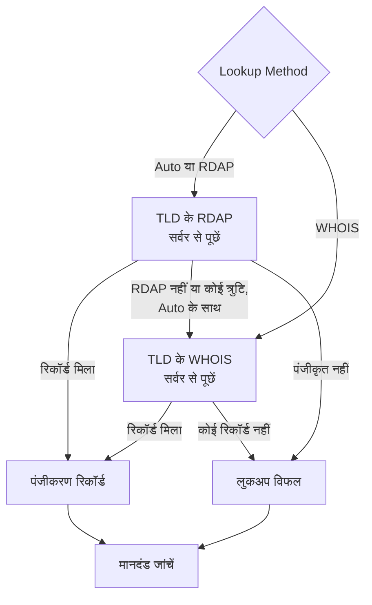

# डोमेन मॉनिटर

डोमेन मॉनिटर तय समय पर आपके डोमेन का पंजीकरण रिकॉर्ड पढ़ता है, ताकि उसकी समाप्ति तिथि, रजिस्ट्रार, नेमसर्वर और स्टेटस कोड पर नज़र रखे, और उसके समाप्त होने से पहले आपको अलर्ट करता है। इसे हर उस डोमेन के लिए इस्तेमाल करें जिस पर आपकी वेबसाइटें, API और ईमेल निर्भर हैं: पंजीकरण समाप्त होने पर ये सब एक साथ बंद हो जाते हैं।

:::cards
- [मॉनिटर बनाएं](#डोमेन-मॉनिटर-बनाएं): डैशबोर्ड में छह चरण।
- [लुकअप के तरीके](#लुकअप-के-तरीके): RDAP, WHOIS, और **Auto** डिफ़ॉल्ट क्यों है।
- [डिफ़ॉल्ट मानदंड](#डिफ़ॉल्ट-मानदंड): बिना किसी सेटअप के, 30 दिन पहले समाप्ति की चेतावनी।
- [समस्या निवारण](#समस्या-निवारण): बंद हो चुके WHOIS सर्वर, प्रॉक्सी और गायब तारीखें।
:::

## यह कैसे काम करता है

हर जांच में प्रोब **Lookup Method** के अनुसार RDAP या WHOIS से डोमेन का पंजीकरण रिकॉर्ड देखता है, और जो मिलता है उसे सामान्य रूप में लाता है: समाप्ति तिथि, रजिस्ट्रार, नेमसर्वर और स्टेटस कोड। जो लुकअप विफल होता है, उसे आपकी तय की गई पुनः प्रयास संख्या तक फिर से आज़माया जाता है। फिर OneUptime रिकॉर्ड को मॉनिटर के मानदंडों से गुज़ारता है।

अगर कोई लुकअप पंजीकरण डेटा नहीं दे पाता — क्योंकि TLD की सेवा बंद हो चुकी है, या डोमेन पंजीकृत नहीं है — तो मॉनिटर को खाली समाप्ति तिथि के साथ स्वस्थ बताने की जगह **ऑफ़लाइन** बताया जाता है, और कारण मॉनिटर के प्रोब जवाब में दिखता है। जो रजिस्ट्री "यह डोमेन उपलब्ध है" जवाब देती है (जैसे DENIC का `Status: free`), उसे स्वस्थ रिकॉर्ड नहीं, बल्कि **पंजीकृत नहीं** माना जाता है।

अंतरराष्ट्रीय डोमेन नाम दोनों रूपों में स्वीकार किए जाते हैं: `münchen.de` को लुकअप से पहले उसके A-लेबल (`xn--mnchen-3ya.de`) में बदला जाता है।

## शुरू करने से पहले

- **ऐसी भूमिका जो मॉनिटर बना सके**: Project Owner, Project Admin, Project Member, Monitor Admin या Monitor Member, या Create Monitor अनुमति वाली कोई कस्टम भूमिका।
- **प्रोब से रजिस्ट्रियों तक बाहर जाने की पहुंच।** हर नए मॉनिटर के लिए आपके प्रोजेक्ट के डिफ़ॉल्ट प्रोब चुने जाते हैं; किसी [कस्टम प्रोब](/docs/probe/custom-probe) को इन तक पहुंचना होगा:

| गंतव्य | प्रोटोकॉल | किसलिए |
| --- | --- | --- |
| `https://data.iana.org/rdap/dns.json` | HTTPS, पोर्ट 443 | IANA की RDAP बूटस्ट्रैप रजिस्ट्री, जो बताती है कि हर TLD का RDAP सर्वर कहां है। एक बार लाई जाती है और 24 घंटे कैश रहती है। |
| रजिस्ट्रियों के RDAP सर्वर | HTTPS, पोर्ट 443 | RDAP लुकअप। |
| WHOIS सर्वर | TCP पोर्ट 43 | WHOIS लुकअप। |

RDAP अनुरोध प्रोब की `HTTP_PROXY_URL` / `HTTPS_PROXY_URL` / `NO_PROXY` सेटिंग्स का पालन करते हैं। WHOIS एक रॉ सॉकेट पर चलता है और ऐसा नहीं करता। अगर कोई प्रोब `data.iana.org` तक नहीं पहुंच पाता, तो **Auto** WHOIS पर चला जाता है और पांच मिनट बाद IANA को फिर आज़माता है।

## डोमेन मॉनिटर बनाएं

:::steps
### नया मॉनिटर शुरू करें

**मॉनिटर** पर जाएं और **मॉनिटर बनाएं** पर क्लिक करें। **मॉनिटर प्रकार** में **और मॉनिटर प्रकार** पर क्लिक करें और **Basic Monitoring** के नीचे **डोमेन** चुनें।

### नाम दें

**नाम** डालें, जैसे `example.com registration`, फिर **अगला** पर क्लिक करें।

### डोमेन डालें

**डोमेन नाम** डालें, जैसे `example.com`। जब तक कोई कारण न हो, **Lookup Method** को **Auto** पर ही रहने दें ([लुकअप के तरीके](#लुकअप-के-तरीके) देखें)।

### जांच कर देखें

**मॉनिटर का परीक्षण करें** पर क्लिक करें, **प्रोब चुनें** में कोई प्रोब चुनें और **परीक्षण चलाएं** पर क्लिक करें। **मॉनिटर परीक्षण परिणाम** प्रोब का पढ़ा पंजीकरण रिकॉर्ड दिखाता है, और यह भी कि RDAP ने जवाब दिया या WHOIS ने।

### मानदंड देखें

**मॉनिटर मानदंड** [डिफ़ॉल्ट मानदंड](#डिफ़ॉल्ट-मानदंड) से शुरू होता है: पंजीकरण समाप्त हो गया हो या पढ़ा न जा सके तो ऑफ़लाइन, 30 दिन या उससे कम में समाप्त हो तो अलर्ट। ज़रूरत हो तो उन्हें बदलें, फिर **अगला** पर क्लिक करें।

### प्रोब चुनें और बनाएं

**प्रोब** और **निगरानी अंतराल** (यह **हर 5 मिनट** से शुरू होता है) को वैसा ही रखें या बदलें, फिर **मॉनिटर बनाएं** पर क्लिक करें। मॉनिटर का पेज खुल जाता है।
:::

## कॉन्फ़िगरेशन विकल्प

| फ़ील्ड | डिफ़ॉल्ट | क्या डालें |
| --- | --- | --- |
| **डोमेन नाम** | कोई नहीं | पंजीकृत डोमेन, जैसे `example.com`। चिपकाया गया पता भी चलता है: `https://example.com/pricing` को `example.com` पढ़ा जाता है। |
| **Lookup Method** | **Auto** | **Auto**, **RDAP** या **WHOIS**। [लुकअप के तरीके](#लुकअप-के-तरीके) देखें। |
| **टाइमआउट (ms)** (**और फ़ील्ड** के नीचे) | `10000` | हर पंजीकरण लुकअप के लिए कितनी देर प्रतीक्षा करनी है, मिलीसेकंड में। |
| **पुनः प्रयास** (**और फ़ील्ड** के नीचे) | `3` | पहला प्रयास विफल होने के बाद के पुनः प्रयास। `0` का मतलब है केवल एक प्रयास। |

हर विफल लुकअप दोहराया जाता है, प्रयासों के बीच एक सेकंड के ठहराव के साथ। इसमें वह स्थिति भी शामिल है जब रजिस्ट्री जवाब दे कि डोमेन पंजीकृत नहीं है, या उसके पास कोई पंजीकरण सेवा नहीं है, इस आशंका में कि वह जवाब एक अस्थायी गड़बड़ी हो। केवल गलत ढंग से लिखा डोमेन नाम बिना लुकअप के तुरंत रिपोर्ट होता है।

टाइमआउट हर अनुरोध पर लागू होता है, पूरी जांच पर नहीं: **Auto** वाली जांच जो पहले RDAP आज़माती है और फिर WHOIS पर जाती है, उसमें दोगुना या उससे ज़्यादा समय लग सकता है।

### लुकअप के तरीके

पंजीकरण डेटा दो प्रोटोकॉल से पढ़ा जा सकता है, और कौन-सा काम करेगा यह TLD पर निर्भर है।

| तरीका | व्यवहार |
| --- | --- |
| **Auto** | डिफ़ॉल्ट। जब TLD कोई RDAP सेवा प्रकाशित करता है तो RDAP का उपयोग करता है, और जब नहीं करता, या RDAP लुकअप विफल होता है, तो WHOIS पर चला जाता है। |
| **RDAP** | केवल RDAP। अगर TLD कोई RDAP सेवा प्रकाशित नहीं करता, तो साफ़ त्रुटि के साथ विफल होता है। |
| **WHOIS** | केवल WHOIS। |

**RDAP** ([RFC 9083](https://www.rfc-editor.org/rfc/rfc9083)) WHOIS का वह विकल्प है जिसे ICANN ने अनिवार्य किया है। हर TLD का आधिकारिक सर्वर [IANA की बूटस्ट्रैप रजिस्ट्री](https://www.rfc-editor.org/rfc/rfc9224) से खोजा जाता है, इसलिए रजिस्ट्रियों के जगह बदलने पर भी वह सही रहता है। हर gTLD एक प्रकाशित करता है। जब TLD का RDAP सर्वर कहता है कि डोमेन पंजीकृत नहीं है, तो **Auto** उसे ही जवाब मान लेता है और WHOIS से नहीं पूछता।

**WHOIS** में ऐसा कोई खोज तंत्र नहीं है — क्लाइंट TLD से WHOIS होस्ट की एक स्थिर तालिका के साथ आते हैं, और वे तालिकाएं पुरानी पड़ जाती हैं। Identity Digital का हर TLD (`.digital`, `.email`, `.life`, `.today`, `.zone` और लगभग 290 अन्य) अब भी एक बंद हो चुके होस्ट से जुड़ा है, जो अब हर क्वेरी का जवाब रिकॉर्ड की जगह शाब्दिक टेक्स्ट `TLD is not supported.` से देता है। उन कई ccTLD के लिए WHOIS ही एकमात्र विकल्प बना हुआ है जो कोई RDAP सेवा प्रकाशित ही नहीं करते, जैसे `.io`, `.co`, `.de`, `.ch` और `.jp`।

## निगरानी मानदंड

मानदंड तय करते हैं कि डोमेन कब ठीक या खराब गिना जाए, और क्या इससे कोई घटना घोषित हो या अलर्ट बने। हर मानदंड एक या अधिक फ़िल्टर जांचता है:

| फ़िल्टर | शर्तें | क्या जांचता है |
| --- | --- | --- |
| **Is Online** | **सही**, **गलत** | क्या पंजीकरण लुकअप खुद सफल हुआ। |
| **Is Request Timeout** | **सही**, **गलत** | क्या हर प्रयास में लुकअप टाइम आउट हुआ। |
| **Domain Expires In Days** | **Greater Than**, **Less Than**, **Greater Than Or Equal To**, **Less Than Or Equal To** | पंजीकरण समाप्त होने तक के दिन, पूरे दिन तक ऊपर की ओर पूर्णांकित। |
| **Domain Is Expired** | **सही**, **गलत** | क्या समाप्ति तिथि बीत चुकी है। |
| **Domain Registrar** | **शामिल है**, **Not Contains**, **Starts With**, **Ends With**, **Equal To**, **Not Equal To** | रजिस्ट्रार का नाम। |
| **Domain Name Server** | **शामिल है**, **Not Contains**, **Starts With**, **Ends With**, **Equal To**, **Not Equal To** | डोमेन के नेमसर्वर। उनमें से कोई एक मेल खाए तो मेल खाता है। |
| **Domain Status Code** | **शामिल है**, **Not Contains**, **Starts With**, **Ends With**, **Equal To**, **Not Equal To** | डोमेन के EPP स्टेटस कोड। उनमें से कोई एक मेल खाए तो मेल खाता है। |

स्टेटस कोड उनके EPP नामों (`clientTransferProhibited`) में बदल दिए जाते हैं, चाहे किसी भी प्रोटोकॉल ने जवाब दिया हो, इसलिए जब **Auto** RDAP और WHOIS के बीच बदलता है तब भी मानदंड मेल खाता रहता है। रजिस्ट्रार के _नाम_ वही होते हैं जो जवाब देने वाली सेवा प्रकाशित करती है और दोनों प्रोटोकॉल में थोड़े अलग हो सकते हैं, इसलिए **Domain Registrar** मानदंड के लिए **Equal To** की जगह **शामिल है** को प्राथमिकता दें।

तारीखें ISO 8601 में बदल दी जाती हैं। कोई रजिस्ट्री जो तारीख ऐसे रूप में प्रकाशित करे जिसे पार्स नहीं किया जा सकता, उसे सहेजने की जगह छोड़ दिया जाता है, ताकि समाप्ति मानदंड चुपचाप हमेशा "समाप्त नहीं" जवाब देने की जगह फ़ैसला न कर पाए और मेल न खाए।

दो या अधिक फ़िल्टर होने पर, **मिलान शर्त** तय करती है कि **सभी** का मिलना ज़रूरी है या **कोई भी** एक काफ़ी है। किसी मानदंड की **क्रियाएँ** तय करती हैं कि वह क्या करता है: मॉनिटर की स्थिति बदलना, अलर्ट बनाना, घटना घोषित करना, या इनका कोई भी मेल।

### डिफ़ॉल्ट मानदंड

नया डोमेन मॉनिटर तीन मानदंडों से शुरू होता है, ताकि वह बिना किसी सेटअप के पंजीकरण समाप्त होने से पहले आपको चेतावनी दे:

1. **डोमेन जांच विफल** — पंजीकरण समाप्त हो गया है, या उसका पंजीकरण डेटा पढ़ा नहीं जा सका। मॉनिटर **ऑफ़लाइन** चिह्नित होता है और "_monitor name_ domain check failed" नाम की एक घटना बनती है। पंजीकरण फिर से पढ़ा जा सके और चालू हो, तो घटना अपने आप हल हो जाती है।
2. **डोमेन जल्द समाप्त होगा** — पंजीकरण समाप्त नहीं हुआ है पर 30 दिन या उससे कम में समाप्त होगा। "_monitor name_ domain expires soon" नाम का एक **अलर्ट** बनता है।
3. **डोमेन समाप्त नहीं हुआ** — मॉनिटर **कार्यरत** चिह्नित होता है।

"जल्द समाप्त होगा" वाली चेतावनी एक अलर्ट है, घटना नहीं: यह आपके स्थिति पृष्ठों पर नहीं दिखती, जब तक आप इसमें कोई ऑन-कॉल नीति न जोड़ें तब तक किसी को पेज नहीं करती, और मॉनिटर की स्थिति नहीं बदलती। यह आपके प्रोजेक्ट की दूसरी अलर्ट गंभीरता का उपयोग करती है, जो नए प्रोजेक्ट में **Low** है। नवीनीकरण पंजीकरण रिकॉर्ड में दिखते ही अलर्ट अपने आप हल हो जाता है। जो रजिस्ट्री कोई समाप्ति तिथि प्रकाशित नहीं करती, वह चेतावनी को कोई आधार नहीं देती, इसलिए चेतावनी शांत रहती है।

मानदंड ऊपर से नीचे जांचे जाते हैं, और जो पहला मेल खाता है वही तय करता है कि क्या होगा। इसीलिए "जल्द समाप्त होगा" "समाप्त नहीं हुआ" के ऊपर है: समाप्त होने वाला डोमेन अभी समाप्त नहीं हुआ है, इसलिए वह दोनों से मेल खाएगा।

पहले चेतावनी पाने के लिए "जल्द समाप्त होगा" मानदंड में **Domain Expires In Days** फ़िल्टर का मान बदलें, जैसे `60`। इसकी जगह किसी को पेज करने के लिए उस मानदंड की **क्रियाएँ** खोलें: **जब फ़िल्टर मेल खाते हैं, तो एक घटना घोषित करें।** चालू करें, या अलर्ट रखें और **ऑन-कॉल नीतियां** में उसमें एक ऑन-कॉल नीति जोड़ें।

:::details चेतावनी के आने से पहले बने मॉनिटर में चेतावनी जोड़ें
OneUptime के यह चेतावनी जोड़ने से पहले बने मॉनिटरों में "जल्द समाप्त होगा" मानदंड नहीं होता। इसे जोड़ने के लिए:

1. मॉनिटर पर **कॉन्फ़िगरेशन → मानदंड** खोलें और **निगरानी मानदंड संपादित करें** पर क्लिक करें।
2. **मानदंड जोड़ें** पर क्लिक करें। उसका फ़िल्टर **Domain Is Expired** / **गलत** पर सेट करें, **फ़िल्टर जोड़ें** पर क्लिक करें, और दूसरे को **Domain Expires In Days** / **Less Than Or Equal To** / `30` पर सेट करें। **मिलान शर्त** को **सभी** पर रहने दें (दो फ़िल्टर होते ही यह फ़िल्टरों के नीचे दिखती है)।
3. **क्रियाएँ** में **जब फ़िल्टर मेल खाते हैं, तो एक अलर्ट बनाएँ।** चालू करें और **जब फ़िल्टर मेल खाते हैं, तो मॉनिटर स्थिति बदलें।** बंद रहने दें, ताकि यह अलर्ट बनाए और मॉनिटर की स्थिति न बदले।
4. नए मानदंड को उस मानदंड के ऊपर खींचें जो मॉनिटर को ऑनलाइन चिह्नित करता है, फिर सहेजें।
:::

### मानदंड के उदाहरण

| लक्ष्य | फ़िल्टर | शर्त | मान |
| --- | --- | --- | --- |
| डोमेन 30 दिन के भीतर समाप्त हो तो अलर्ट (एक डिफ़ॉल्ट) | **Domain Expires In Days** | **Less Than Or Equal To** | `30` |
| डोमेन समाप्त हो गया हो तो ऑफ़लाइन | **Domain Is Expired** | **सही** | — |
| पंजीकरण पढ़ा न जा सके तो ऑफ़लाइन | **Is Online** | **गलत** | — |
| नेमसर्वर बदलें तो अलर्ट | **Domain Name Server** | **Not Contains** | `ns1.example.com` |
| डोमेन ट्रांसफ़र के लिए अनलॉक हो तो अलर्ट | **Domain Status Code** | **Not Contains** | `clientTransferProhibited` |

**Domain Name Server** और **Domain Status Code** तब मेल खाते हैं जब _कोई भी_ एक मान मेल खाए, इसलिए **Not Contains** उसी समय मेल खा जाता है जब कोई एक नेमसर्वर, या कोई एक स्टेटस कोड, उस टेक्स्ट को शामिल न करे।

## सर्वोत्तम प्रथाएं

1. **नवीनीकरण के लिए समय रखें** — डिफ़ॉल्ट चेतावनी समाप्ति से 30 दिन पहले आती है। अगर नवीनीकरण के लिए मंज़ूरी या ज़्यादा समय लेने वाला भुगतान चाहिए, तो इसे 60 दिन कर दें।
2. **विफल लुकअप को शामिल करें** — अपने ऑफ़लाइन मानदंड में **Is Online** / **गलत** फ़िल्टर रखें, ताकि न पढ़ा जा सकने वाला पंजीकरण स्वस्थ न समझ लिया जाए। नए मॉनिटरों के डिफ़ॉल्ट मानदंडों में यह होता है; इसके जुड़ने से पहले बने मॉनिटर में इसे हाथ से जोड़ना होगा। कभी-कभार प्रोब की दर सीमित करने वाले WHOIS सर्वर को झेलने के लिए, उस फ़िल्टर के नीचे **इस मानदंड का एक समयावधि के दौरान मूल्यांकन करें** पर टिक करें और **All Values** चुनें: तब डोमेन केवल तभी ऑफ़लाइन होता है जब अवधि का हर लुकअप विफल हुआ हो।
3. **सभी ज़रूरी डोमेन की निगरानी करें** — प्राथमिक डोमेन, अलग से पंजीकृत सबडोमेन, और ईमेल या API के लिए उपयोग होने वाले सभी डोमेन शामिल करें।
4. **रजिस्ट्रार में बदलाव पर नज़र रखें** — किसी अनधिकृत ट्रांसफ़र को पकड़ने के लिए **Domain Registrar** / **Not Contains** / आपके रजिस्ट्रार का नाम वाला मानदंड जोड़ें।

## समस्या निवारण

:::details WHOIS सर्वर ने "answered without any registration data"
TLD का WHOIS होस्ट बंद हो चुका है, प्रोब की दर सीमित कर रहा है, या कुछ देर के लिए खराब है। बंद हो चुका होस्ट, जैसे वह जो अब भी Identity Digital के TLD से जुड़ा है, हर बार `TLD is not supported.` जवाब देता है। अगर **Lookup Method** के **WHOIS** पर रहते विफलता बनी रहे, तो **Auto** पर जाएं, ताकि जहां RDAP सेवा हो वहां प्रोब TLD की RDAP सेवा पढ़े।
:::

:::details जांच "No RDAP service is published" के साथ विफल होती है
मॉनिटर **RDAP** का उपयोग करता है, और TLD कोई RDAP सेवा प्रकाशित नहीं करता, जैसा कई ccTLD करते हैं। **Lookup Method** को **Auto** पर करें, जो WHOIS पर चला जाता है।
:::

:::details डोमेन को पंजीकृत नहीं बताया जाता है
रजिस्ट्री ने जवाब दिया कि डोमेन उपलब्ध है। वर्तनी जांचें, और यह भी कि आपने पंजीकृत डोमेन डाला है, जैसे `example.com`, कोई सबडोमेन नहीं।
:::

:::details प्रॉक्सी के पीछे वाले प्रोब पर लुकअप विफल होते हैं
RDAP प्रोब की प्रॉक्सी सेटिंग्स से होकर जाता है, WHOIS नहीं। WHOIS के लिए बाहर जाने वाले TCP पोर्ट 43 की अनुमति दें, या RDAP सेवा प्रकाशित करने वाले TLD के लिए **Auto** या **RDAP** का उपयोग करें।
:::

:::details समाप्ति तिथि खाली है, और समाप्ति मानदंड कभी ट्रिगर नहीं होते
रजिस्ट्री कोई समाप्ति तिथि प्रकाशित नहीं करती, या ऐसे रूप में करती है जिसे पार्स नहीं किया जा सकता। तारीख के बिना समाप्ति मानदंड फ़ैसला नहीं कर सकते, इसलिए वे शांत रहते हैं। **Is Online** अब भी बताता है कि रिकॉर्ड पढ़ा जा सकता है या नहीं।
:::

## अगले कदम

:::cards
- [SSL प्रमाणपत्र मॉनिटर](/docs/monitor/ssl-certificate-monitor): डोमेन के प्रमाणपत्र समाप्त होने से पहले चेतावनी पाएं।
- [DNS मॉनिटर](/docs/monitor/dns-monitor): जांचें कि डोमेन के रिकॉर्ड रिज़ॉल्व होते हैं, और वे क्या कहते हैं।
- [DNSSEC मॉनिटर](/docs/monitor/dnssec-monitor): साइन किए गए ज़ोन की चेन ऑफ़ ट्रस्ट को वैलिडेट करें।
- [एस्केलेशन नियम](/docs/on-call/escalation-rules): तय करें कि अलर्ट और घटनाएं किसे पेज करें।
:::
