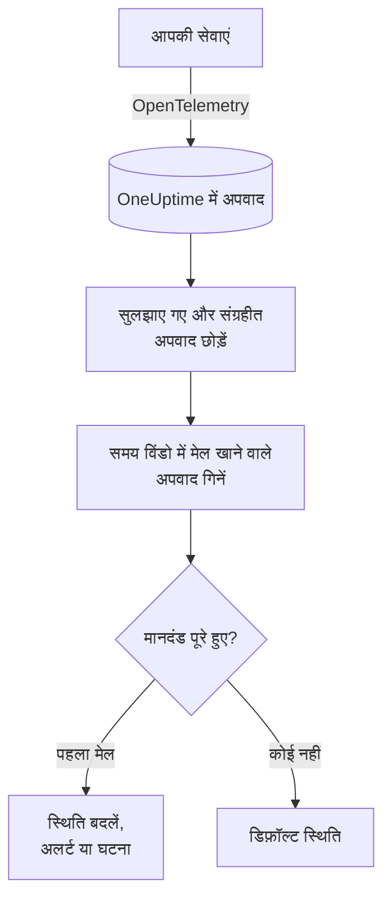

# अपवाद मॉनिटर

अपवाद मॉनिटर एक समय विंडो में उन अपवादों की गिनती करता है जिनकी रिपोर्ट आपकी सेवाएं OneUptime को करती हैं और जो आपके फ़िल्टर (संदेश, अपवाद प्रकार, एनवायरनमेंट, सेवा) से मेल खाते हैं। जब गिनती आपके मानदंड पूरे करती है, तो यह मॉनिटर की स्थिति बदलता है, अलर्ट बनाता है या घटना घोषित करता है। प्रोडक्शन में किसी भी नए क्रैश, किसी एक अपवाद प्रकार, या त्रुटियों में अचानक बढ़ोतरी पर अलर्ट के लिए इसका उपयोग करें।

:::cards
- [मॉनिटर बनाएं](#अपवाद-मॉनिटर-बनाएं): चुनें कि कौन-से अपवाद गिने जाएं और अलर्ट कब हो।
- [एनवायरनमेंट](#एनवायरनमेंट): मॉनिटर को `production` तक सीमित करें।
- [इसका मूल्यांकन कैसे होता है](#इसका-मूल्यांकन-कैसे-होता-है): क्या गिना जाता है, और अपवाद सुलझाने से क्या होता है।
- [मानदंड](#मानदंड): शर्तें और डिफ़ॉल्ट।
:::

## यह कैसे काम करता है



हर मिनट OneUptime उन अपवादों को गिनता है जो मॉनिटर के फ़िल्टर से मेल खाते हैं और उसकी समय विंडो के भीतर हुए, और उन अपवादों को छोड़ देता है जिन्हें आपने सुलझाया हुआ चिह्नित किया है या संग्रहीत किया है। वह इस गिनती की तुलना मॉनिटर के मानदंडों से ऊपर से नीचे करता है, और जो मानदंड सबसे पहले मेल खाता है वही तय करता है कि क्या होगा। जब कोई मेल नहीं खाता, तो मॉनिटर अपनी डिफ़ॉल्ट स्थिति पर लौट आता है।

## शुरू करने से पहले

- आपकी सेवाएं OpenTelemetry के ज़रिए OneUptime को अपवाद भेजती हैं। [OpenTelemetry](/docs/telemetry/open-telemetry) देखें।
- मॉनिटर को किसी एनवायरनमेंट तक सीमित करने के लिए आपकी सेवाओं को रिसोर्स विशेषता `deployment.environment` सेट करनी होगी।

## अपवाद मॉनिटर बनाएं

:::steps
### नया मॉनिटर शुरू करें

**मॉनिटर** पर जाएं और **मॉनिटर बनाएं** पर क्लिक करें।

### Exceptions चुनें

**मॉनिटर प्रकार** में **और मॉनिटर प्रकार** पर क्लिक करें और **टेलीमेट्री** के अंतर्गत **अपवाद** चुनें, या खोज बॉक्स में `exceptions` टाइप करें। **नाम** डालें, फिर **अगला** पर क्लिक करें।

### गिने जाने वाले अपवाद चुनें

**अपवाद मॉनिटर कॉन्फ़िगरेशन** में **फ़िल्टर अपवाद संदेश**, **अपवाद प्रकार**, **Environments** और **(time) के लिए मॉनिटर अपवाद** सेट करें। खाली छोड़ा गया फ़िल्टर हर अपवाद से मेल खाता है। फ़िल्टर के नीचे **अपवाद पूर्वावलोकन** दिखाता है कि वे अभी किन अपवादों से मेल खाते हैं।

### दायरा सीमित करें (वैकल्पिक)

टेलीमेट्री सेवा या इन्फ्रास्ट्रक्चर एंटिटी के आधार पर फ़िल्टर करने, या सुलझाए गए और संग्रहीत अपवाद भी गिनने के लिए **और फ़ील्ड** खोलें।

### मानदंड सेट करें

**मॉनिटर मानदंड** कार्ड दो मानदंडों से शुरू होता है: कोई अपवाद मेल खाए तो घटना के साथ ऑफ़लाइन; कोई मेल न खाए तो ऑनलाइन। इन्हें उस चीज़ के अनुसार बदलें जिस पर आप अलर्ट चाहते हैं ([मानदंड](#मानदंड) देखें)।

### मॉनिटर बनाएं

**मॉनिटर बनाएं** पर क्लिक करें। मॉनिटर अपने **अवलोकन** पृष्ठ पर खुलता है, और उसका पहला मूल्यांकन एक मिनट के भीतर चलता है।
:::

## यह क्या क्वेरी करता है

| फ़ील्ड | किससे मेल खाता है | डिफ़ॉल्ट |
| --- | --- | --- |
| **फ़िल्टर अपवाद संदेश** | वे अपवाद जिनके संदेश में यह टेक्स्ट हो, बड़े-छोटे अक्षरों का अंतर किए बिना। | खाली: हर अपवाद |
| **अपवाद प्रकार** | इनमें से किसी भी प्रकार के अपवाद, कॉमा से अलग किए गए, जैसे `TypeError, NullReferenceException`। प्रकार का नाम सटीक रूप से मेल खाना चाहिए। | खाली: हर प्रकार |
| **Environments** | इनमें से किसी भी एनवायरनमेंट के अपवाद, कॉमा से अलग किए गए ([एनवायरनमेंट](#एनवायरनमेंट) देखें)। | खाली: हर एनवायरनमेंट |
| **(time) के लिए मॉनिटर अपवाद** | पिछले 5 सेकंड से लेकर पिछले 24 घंटे तक के अपवाद। | **पिछला 1 मिनट** |
| **टेलीमेट्री सेवा द्वारा फ़िल्टर करें** (**और फ़ील्ड** में) | चुनी गई किसी भी सेवा से आए अपवाद। | खाली: हर सेवा |
| **Filter by Infrastructure Entity** (**और फ़ील्ड** में) | चुने गए किसी भी होस्ट, पॉड, कंटेनर और दूसरी एंटिटी से आए अपवाद। | खाली: हर एंटिटी |
| **सुलझाए गए अपवाद शामिल करें** (**और फ़ील्ड** में) | सुलझाए हुए चिह्नित अपवाद भी गिनें। | बंद |
| **संग्रहीत अपवाद शामिल करें** (**और फ़ील्ड** में) | संग्रहीत अपवाद भी गिनें। | बंद |

किसी अपवाद को गिने जाने के लिए आपके सेट किए सभी फ़िल्टर से मेल खाना ज़रूरी है।

### एनवायरनमेंट

एनवायरनमेंट हर अपवाद पर मौजूद OpenTelemetry रिसोर्स विशेषता `deployment.environment` से आते हैं, वही मान जिससे अपवाद एक्सप्लोरर `env:production` के साथ फ़िल्टर करता है। एक एनवायरनमेंट डालें, या कई को कॉमा से अलग करके; किसी अपवाद को तब गिना जाता है जब उसका एनवायरनमेंट इनमें से किसी से मेल खाता है।

मिलान सटीक होता है और बड़े-छोटे अक्षरों में अंतर करता है: `production` का मेल `Production` या `prod` से नहीं होता। यह फ़िल्टर सेट होने पर बिना एनवायरनमेंट वाले अपवाद नहीं गिने जाते। बिना एनवायरनमेंट वाले अपवादों सहित हर एनवायरनमेंट के अपवाद गिनने के लिए इसे खाली छोड़ें।

एनवायरनमेंट फ़िल्टर बाकी हर फ़िल्टर के साथ जुड़ता है, इसलिए एक टेलीमेट्री सेवा और `production` तक सीमित मॉनिटर सिर्फ़ उस सेवा के प्रोडक्शन अपवाद गिनता है।

API के ज़रिए मॉनिटर बनाते समय, चरण के `exceptionMonitor` पर `environments` को एनवायरनमेंट नामों की सूची पर सेट करें:

```json
{
  "exceptionMonitor": {
    "telemetryServiceIds": [],
    "environments": ["production"],
    "exceptionTypes": [],
    "message": "",
    "includeResolved": false,
    "includeArchived": false,
    "lastXSecondsOfExceptions": 300
  }
}
```

## इसका मूल्यांकन कैसे होता है

- **हर मिनट।** अपवाद मॉनिटर की जांच प्रोब नहीं करते, इसलिए इसमें सेट करने के लिए कोई अंतराल नहीं है और न ही **प्रोब और अंतराल** पृष्ठ।
- **घटनाएं गिनी जाती हैं, अपवाद प्रकार नहीं।** मॉनिटर हर उस बार को गिनता है जब कोई मेल खाने वाला अपवाद **(time) के लिए मॉनिटर अपवाद** के भीतर हुआ। 40 बार फेंका गया एक अपवाद 40 गिना जाता है।
- **सुलझाए गए और संग्रहीत अपवाद छोड़ दिए जाते हैं।** जब तक आप **सुलझाए गए अपवाद शामिल करें** या **संग्रहीत अपवाद शामिल करें** चालू नहीं करते, तब तक सुलझाए हुए चिह्नित या संग्रहीत किए गए अपवाद की घटनाएं नहीं गिनी जातीं। इसलिए किसी अपवाद को सुलझाया हुआ चिह्नित करने से उसकी खोली घटना बंद हो सकती है। जब कोई सुलझाया गया अपवाद फिर से होता है, तो वह अपने आप फिर से अनसुलझा हो जाता है और दोबारा गिना जाता है।
- **कोई अपवाद नहीं, यानी गिनती 0।**
- **OneUptime का अपना डाउनटाइम खामोशी नहीं है।** जब तक समय विंडो में वह समय शामिल है जब OneUptime खुद डेटा प्राप्त नहीं कर रहा था (वह रीस्टार्ट हो रहा था, अपग्रेड हो रहा था या बैकलॉग निपटा रहा था), जांच इंतज़ार करती है: स्थिति नहीं बदलती, और कोई घटना या अलर्ट न खुलता है न सुलझता है। [जब OneUptime डेटा प्राप्त नहीं कर रहा हो](/docs/monitor/when-oneuptime-is-not-receiving) देखें।
- **मानदंड ऊपर से नीचे।** जो मानदंड सबसे पहले मेल खाता है वही तय करता है, इसलिए सबसे गंभीर को सबसे ऊपर रखें।

हर स्थिति परिवर्तन, उसके कारण के साथ, मॉनिटर की **स्थिति टाइमलाइन** पर दर्ज होता है।

## मानदंड

अपवाद मॉनिटर के मानदंडों में एक ही **फ़िल्टर प्रकार** होता है: **Exception Count**, यानी विंडो में मेल खाने वाले अपवादों की संख्या। एक **फ़िल्टर शर्त** और एक **मान** चुनें।

| फ़िल्टर शर्त | मेल खाती है जब अपवादों की गिनती… |
| --- | --- |
| **Greater Than** | मान से ऊपर हो |
| **Greater Than Or Equal To** | मान के बराबर या उससे ऊपर हो |
| **Less Than** | मान से नीचे हो |
| **Less Than Or Equal To** | मान के बराबर या उससे नीचे हो |
| **Equal To** | ठीक मान के बराबर हो |
| **Not Equal To** | मान के अलावा कुछ भी हो |

अपवादों की गिनती में विसंगति वाली शर्तें नहीं होतीं: उनसे तुलना के लिए कोई बेसलाइन नहीं है।

नया अपवाद मॉनिटर इन मानदंडों से शुरू होता है:

| मानदंड | फ़िल्टर | प्रभाव |
| --- | --- | --- |
| Check if … has exceptions | **Exception Count** **Greater Than** `0` | मॉनिटर को ऑफ़लाइन चिह्नित करता है और घटना घोषित करता है, जो अपने आप सुलझ जाती है |
| Check if … has no exceptions | **Exception Count** **Equal To** `0` | मॉनिटर को ऑनलाइन चिह्नित करता है |

## उदाहरण: सिर्फ़ प्रोडक्शन अपवाद

आप चाहते हैं कि जब भी API प्रोडक्शन में अपवाद फेंके तो घटना बने, और staging के लिए कुछ न हो। आप **Environments** को `production` पर और **(time) के लिए मॉनिटर अपवाद** को **पिछले 5 मिनट** पर सेट करते हैं, और डिफ़ॉल्ट मानदंड रखते हैं। पिछले पांच मिनट में:

| अपवाद | एनवायरनमेंट | स्थिति | गिना गया? |
| --- | --- | --- | --- |
| `TypeError` × 3 | `production` | सक्रिय | हां: 3 |
| `TypeError` × 40 | `staging` | सक्रिय | नहीं: दूसरा एनवायरनमेंट |
| `TimeoutError` × 2 | कोई नहीं | सक्रिय | नहीं: कोई एनवायरनमेंट नहीं |
| `NullReferenceException` × 4 | `production` | होने के बाद सुलझाया गया | नहीं: सुलझाया गया |

**Exception Count** 3 है, इसलिए **Greater Than** `0` मेल खाता है: मॉनिटर ऑफ़लाइन हो जाता है और घटना घोषित होती है। जब पांच मिनट बिना किसी सक्रिय प्रोडक्शन अपवाद के बीतते हैं, तो ऑनलाइन मानदंड मेल खाता है और घटना अपने आप सुलझ जाती है।

## समस्या निवारण

:::details एक्सप्लोरर में अपवाद दिखते हैं, लेकिन मॉनिटर 0 गिनता है
**Environments** के मान की तुलना एक्सप्लोरर के `env:` फ़िल्टर से करें: मिलान सटीक होता है और बड़े-छोटे अक्षरों में अंतर करता है, और फ़िल्टर सेट होने पर बिना एनवायरनमेंट वाले अपवाद छोड़ दिए जाते हैं। फिर जांचें कि क्या वे अपवाद सुलझाए या संग्रहीत किए गए हैं। मॉनिटर का **मानदंड** पृष्ठ (**कॉन्फ़िगरेशन** के अंतर्गत) खोलें और **Edit Monitoring Criteria** पर क्लिक करें: **अपवाद पूर्वावलोकन** दिखाता है कि फ़िल्टर किससे मेल खाते हैं।
:::

:::details मैंने अपवाद सुलझाया तो घटना भी सुलझ गई
यह अपेक्षित है। सुलझाए गए अपवाद नहीं गिने जाते, इसलिए गिनती घटी और मानदंड मेल खाना बंद हो गया। अगर अपवाद फिर से होता है, तो वह अनसुलझा हो जाता है और दोबारा गिना जाता है। उन्हें फिर भी गिनने के लिए **सुलझाए गए अपवाद शामिल करें** चालू करें।
:::

:::details अपवाद प्रकार फ़िल्टर किसी से मेल नहीं खाता
**अपवाद प्रकार** का सटीक मिलान उस प्रकार के नाम से होता है जिसके साथ अपवाद की रिपोर्ट हुई, जैसे `TypeError`। प्रकार को अपवाद एक्सप्लोरर से कॉपी करें।
:::

## अगले कदम

:::cards
- [ट्रेस मॉनिटर](/docs/monitor/traces-monitor): विफल स्पैन और एंडपॉइंट पर अलर्ट करें।
- [लॉग मॉनिटर](/docs/monitor/logs-monitor): लॉग की मात्रा और सामग्री पर अलर्ट करें।
- [घटना और अलर्ट टेम्पलेट](/docs/monitor/incident-alert-templating): उपयोगी अलर्ट शीर्षक और विवरण लिखें।
- [OpenTelemetry](/docs/telemetry/open-telemetry): अपवाद OneUptime को भेजें।
:::
