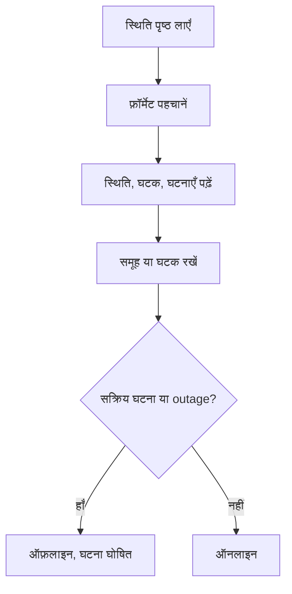

# बाहरी स्थिति पृष्ठ मॉनिटर

बाहरी स्थिति पृष्ठ मॉनिटर उस सेवा के सार्वजनिक स्थिति पृष्ठ पर नज़र रखता है जिस पर आप निर्भर हैं — AWS, GCP, Azure, GitHub, OpenAI, Anthropic और कई अन्य — और जब वह प्रदाता किसी outage या प्रदर्शन में गिरावट की रिपोर्ट करता है, तो आपको अलर्ट करता है। इसका उपयोग upstream समस्याओं के बारे में प्रदाता के रिपोर्ट करते ही जानने के लिए, और उन्हें अपनी समस्याओं से अलग पहचानने के लिए करें।

:::cards
- [मॉनिटर बनाएं](#बाहरी-स्थिति-पृष्ठ-मॉनिटर-बनाएं): स्थिति पृष्ठ का URL paste करें और चुनें कि किस पर नज़र रखनी है।
- [दायरा तय करें](#कॉन्फ़िगरेशन-विकल्प): एक घटक समूह या एक घटक पर नज़र रखें।
- [मानदंड](#निगरानी-मानदंड): शुरुआत में किसे डाउन माना जाता है।
- [लोकप्रिय स्थिति पृष्ठ](#लोकप्रिय-स्थिति-पृष्ठ-url): उन सेवाओं के URL जिन पर ज़्यादातर टीमें निर्भर हैं।
:::

## यह कैसे काम करता है

हर जाँच पर एक प्रोब स्थिति पृष्ठ लाता है, पता लगाता है कि वह किस फ़ॉर्मेट का है, और समग्र स्थिति, घटक और सक्रिय घटनाएँ पढ़ता है। अगर आपने मॉनिटर का दायरा किसी घटक समूह या घटक तक सीमित किया है, तो केवल वही गिने जाते हैं। फिर मानदंड तय करते हैं कि मॉनिटर ऑनलाइन है या ऑफ़लाइन।

आप इसका उपयोग इनके लिए कर सकते हैं:

- उन third-party सेवाओं की उपलब्धता की निगरानी जिन पर आपका ऐप्लिकेशन निर्भर है
- upstream प्रदाताओं में outage होने पर अलर्ट पाना
- अलग-अलग घटकों की स्थिति पर नज़र रखना
- निगरानी को एक घटक समूह तक सीमित करना (जैसे केवल OpenAI के "APIs"), ताकि पृष्ठ पर कहीं और की असंबंधित घटनाएँ आपका मॉनिटर trigger न करें
- उपयोगकर्ताओं पर असर पड़ने से पहले प्रदर्शन में गिरावट पकड़ना
- अपनी घटनाओं को upstream प्रदाता की समस्याओं से जोड़कर देखना

## समर्थित प्रदाता

| प्रदाता | विवरण |
| ------------------------ | ---------------------------------------------------------------------- |
| **Auto** (डिफ़ॉल्ट) | स्थिति पृष्ठ का फ़ॉर्मेट अपने आप पहचानता है |
| **Atlassian Statuspage** | Atlassian Statuspage पर चलने वाले स्थिति पृष्ठ (JSON API) |
| **incident.io** | incident.io पर चलने वाले स्थिति पृष्ठ (जैसे `https://status.openai.com`) |
| **RSS** | RSS feed देने वाले स्थिति पृष्ठ |
| **Atom** | Atom feed देने वाले स्थिति पृष्ठ |

### अपने आप पहचान

**Auto** पर सेट होने पर OneUptime स्थिति पृष्ठ का फ़ॉर्मेट इस क्रम में अपने आप पहचानता है:

1. पहले वह incident.io स्थिति पृष्ठ API (`/proxy/<host>`) आज़माता है।
2. फिर वह Atlassian Statuspage JSON API (`/api/v2/status.json`, `/api/v2/components.json` और `/api/v2/incidents/unresolved.json`) आज़माता है।
3. अगर ये विफल हों, तो वह पृष्ठ को RSS या Atom feed के रूप में parse करने की कोशिश करता है।
4. आख़िरी विकल्प के रूप में वह एक बुनियादी HTTP पहुँच-योग्यता जाँच करता है।

> [!NOTE]
> incident.io को पहले इसलिए जाँचा जाता है क्योंकि कुछ incident.io स्थिति पृष्ठ (जैसे `https://status.openai.com`) एक सीमित, Atlassian-संगत endpoint भी देते हैं जिसमें घटक समूह और सक्रिय घटनाएँ नहीं होतीं। incident.io को पहले जाँचने से समूहों वाला ज़्यादा समृद्ध डेटा इस्तेमाल होता है।

जब आपका स्पष्ट रूप से चुना गया प्रदाता विफल होता है, तब भी पहुँच-योग्यता जाँच ही विकल्प होती है। यह केवल बताती है कि पृष्ठ जवाब देता है या नहीं — `2xx` या `3xx` response पर ऑनलाइन — और कोई घटक या घटना रिपोर्ट नहीं करती।

## बाहरी स्थिति पृष्ठ मॉनिटर बनाएं

:::steps
### नया मॉनिटर शुरू करें

**मॉनिटर** पर जाएँ और **मॉनिटर बनाएं** पर क्लिक करें। **मॉनिटर प्रकार** में **और मॉनिटर प्रकार** पर क्लिक करें और **Basic Monitoring** के अंतर्गत **External Status Page** चुनें, या खोज बॉक्स में `statuspage` टाइप करें। एक **नाम** दर्ज करें, फिर **अगला** पर क्लिक करें।

### स्थिति पृष्ठ का URL दर्ज करें

**स्थिति पृष्ठ URL** दर्ज करें। जब तक आप फ़ॉर्मेट नहीं जानते, **प्रदाता** को **Auto** पर ही रहने दें।

### ज़रूरत हो तो दायरा तय करें

**और फ़ील्ड** खोलें और `APIs` जैसा एक **Component Group Filter (Optional)** दर्ज करें, और एक घटक पर नज़र रखने के लिए **घटक नाम फ़िल्टर (वैकल्पिक)** दर्ज करें (समूह सेट हो तो उसी समूह के भीतर)।

### परीक्षण करें

पृष्ठ को एक बार लाने के लिए **मॉनिटर का परीक्षण करें** पर क्लिक करें, और उसे मिले प्रदाता, घटक और घटनाएँ जाँचें।

### मानदंडों की समीक्षा करें

मानदंड चरण [डिफ़ॉल्ट मानदंडों](#डिफ़ॉल्ट-मानदंड) से शुरू होता है, जो प्रदाता के दायरे के भीतर किसी सक्रिय घटना या outage की रिपोर्ट करने पर मॉनिटर को ऑफ़लाइन चिह्नित करते हैं। ज़रूरत हो तो इन्हें बदलें, फिर **अगला** पर क्लिक करें।

### प्रोब चुनें और बनाएं

**प्रोब** और एक **निगरानी अंतराल** चुनें — यह **हर 5 मिनट** से शुरू होता है — फिर **मॉनिटर बनाएं** पर क्लिक करें।
:::

## कॉन्फ़िगरेशन विकल्प

| विकल्प | क्या दर्ज करें | डिफ़ॉल्ट |
| --- | --- | --- |
| **स्थिति पृष्ठ URL** | स्थिति पृष्ठ का URL। Atlassian Statuspage और incident.io पर चलने वाली साइटों के लिए यह आम तौर पर root URL होता है (जैसे `https://status.example.com`)। RSS/Atom feeds के लिए सीधे feed URL दर्ज करें। | — |
| **प्रदाता** | फ़ॉर्मेट पहचानने के लिए **Auto**, या पता हो तो **Atlassian Statuspage**, **incident.io**, **RSS** या **Atom**। | **Auto** |
| **Component Group Filter (Optional)** | वह समूह जिस तक मॉनिटर सीमित हो। **और फ़ील्ड** के अंतर्गत। | सभी समूह |
| **घटक नाम फ़िल्टर (वैकल्पिक)** | जिस घटक पर नज़र रखनी है। **और फ़ील्ड** के अंतर्गत। | दायरे के सभी घटक |
| **टाइमआउट (ms)** | स्थिति पृष्ठ के लिए अधिकतम प्रतीक्षा समय। **और फ़ील्ड** के अंतर्गत। | `10000` (10 सेकंड) |
| **पुनः प्रयास** | पहला प्रयास विफल होने के बाद, एक-एक सेकंड के अंतर पर, कितनी बार फिर से प्रयास करना है; `0` का मतलब एक ही प्रयास। **और फ़ील्ड** के अंतर्गत। | `3` (अधिकतम 4 प्रयास) |

### Component Group Filter

अगर स्थिति पृष्ठ अपने घटकों को समूहों में बाँटता है, तो आप मॉनिटर को एक समूह तक सीमित कर सकते हैं। उदाहरण के लिए, `https://status.openai.com` पर `APIs` दर्ज करने से मॉनिटर OpenAI की API सेवाओं तक सीमित हो जाता है।

जब कोई घटक समूह सेट हो, तो **सक्रिय घटना संख्या** और **समग्र स्थिति** केवल उस समूह के घटकों से निकाली जाती है — किसी असंबंधित समूह (जैसे ChatGPT) को प्रभावित करने वाली घटना "APIs" समूह तक सीमित मॉनिटर को trigger नहीं करेगी।

घटक समूह फ़िल्टरिंग **Atlassian Statuspage** और **incident.io** प्रदाताओं के लिए समर्थित है। RSS और Atom feeds घटक समूह नहीं देते।

### घटक नाम फ़िल्टर

अगर स्थिति पृष्ठ कई घटकों की रिपोर्ट करता है, तो आप केवल एक घटक की निगरानी के लिए उसका नाम दे सकते हैं। फ़िल्टर हर उस घटक से मेल खाता है जिसके नाम में आपका दर्ज किया टेक्स्ट हो, case को अनदेखा करते हुए — `actions` "Actions" नाम के घटक से मेल खाता है।

जब कोई घटक समूह भी सेट हो, तो घटक नाम फ़िल्टर उस समूह के **भीतर** लागू होता है, जिससे आप बड़े समूह के अंदर किसी एक घटक को चुन सकते हैं। जब कोई फ़िल्टर न दिया गया हो, तो दायरे के सभी घटकों की निगरानी होती है। RSS या Atom feed पर नाम फ़िल्टर feed के items के शीर्षकों से मिलाया जाता है।

> [!WARNING]
> जो फ़िल्टर किसी से मेल नहीं खाता, वह स्वस्थ दिखता है: दायरे में कोई घटक न हो, तो outage की रिपोर्ट करने वाला कुछ नहीं होता। स्थिति पृष्ठ से वर्तनी मिलाएँ, और फ़िल्टर क्या रखता है यह देखने के लिए **मॉनिटर का परीक्षण करें** का उपयोग करें।

## निगरानी मानदंड

आप यह तय करने के लिए मानदंड कॉन्फ़िगर कर सकते हैं कि बाहरी सेवा कब ऑनलाइन या ऑफ़लाइन मानी जाए, इनके आधार पर:

| फ़िल्टर प्रकार | यह क्या जाँचता है | फ़िल्टर शर्तें |
| --- | --- | --- |
| **External Status Page Is Online** | क्या स्थिति पृष्ठ पहुँच योग्य है और स्थिति डेटा लौटा रहा है | सही या गलत |
| **External Status Page Overall Status** | पृष्ठ द्वारा बताई गई समग्र स्थिति | Equal To, Not Equal To, शामिल है, Not Contains, Starts With, Ends With |
| **External Status Page Component Status** | दायरे के घटकों की स्थिति (घटक समूह / घटक नाम फ़िल्टर का पालन करते हुए): कार्यरत, Under Maintenance, Degraded Performance, Partial Outage, Major Outage या Full Outage | Equal To, Not Equal To, शामिल है, Not Contains, Starts With, Ends With |
| **External Status Page Active Incidents** | स्थिति पृष्ठ पर अभी सक्रिय घटनाओं की संख्या (फ़िल्टर सेट होने पर घटक समूह / घटक तक सीमित) | Equal To, Not Equal To, और संख्यात्मक तुलनाएँ |
| **External Status Page Response Time (in ms)** | स्थिति पृष्ठ का डेटा लाने में कितना समय लगता है | Greater Than, Less Than, Greater Than Or Equal To, Less Than Or Equal To |

समग्र स्थिति वही है जो पृष्ठ कहता है, इसलिए उसके मान प्रदाता के अनुसार बदलते हैं: Atlassian Statuspage अपना विवरण बताता है, जैसे `All Systems Operational`; feed `operational` या `degraded_performance` बताता है; पहुँच-योग्यता जाँच `reachable` या `unreachable` बताती है। ये तुलनाएँ case-sensitive हैं। Outages पर अलर्ट के लिए **External Status Page Active Incidents** और **External Status Page Component Status** आम तौर पर ज़्यादा भरोसेमंद होते हैं।

RSS या Atom feed पर पिछले 24 घंटों के items सक्रिय घटनाएँ गिने जाते हैं: RSS item अपनी प्रकाशन तिथि से, Atom entry अपनी अपडेट तिथि से।

### डिफ़ॉल्ट मानदंड

डिफ़ॉल्ट रूप से OneUptime ऐसे मानदंड बनाता है जो स्थिति पृष्ठ के लिए वास्तव में मायने रखने वाली चीज़ों पर आधारित हों — उसकी सक्रिय घटनाएँ और घटकों की सेहत, केवल पहुँच-योग्यता नहीं:

| मानदंड | फ़िल्टर | प्रभाव |
| --- | --- | --- |
| Offline | इनमें से **कोई भी**: पृष्ठ ऑनलाइन नहीं है; दायरे में कम से कम एक सक्रिय घटना है; दायरे का कोई घटक Degraded Performance, Partial Outage, Major Outage या Full Outage बताता है | मॉनिटर को ऑफ़लाइन चिह्नित करता है और एक घटना घोषित करता है, जो मानदंड के मेल खाना बंद करने पर अपने आप सुलझ जाती है |
| Online | इनमें से **सभी**: पृष्ठ ऑनलाइन है; दायरे में कोई सक्रिय घटना नहीं है | मॉनिटर को ऑनलाइन चिह्नित करता है |

क्योंकि सक्रिय घटना संख्या और घटक स्थितियाँ घटक समूह / घटक नाम फ़िल्टर का पालन करती हैं, ये डिफ़ॉल्ट मानदंड अपने आप केवल उन्हीं घटकों पर ध्यान देते हैं जिनकी आपको परवाह है।

## टेम्पलेट वेरिएबल

बाहरी स्थिति पृष्ठ मॉनिटर से घटनाएँ या अलर्ट बनाते समय आप शीर्षकों, विवरणों और समाधान नोट में ये वेरिएबल उपयोग कर सकते हैं (देखें [घटना और अलर्ट टेम्पलेट](/docs/monitor/incident-alert-templating)):

| वेरिएबल | विवरण |
| ------------------------- | ------------------------------------------------------------------------------- |
| `{{isOnline}}`            | क्या स्थिति पृष्ठ ऑनलाइन है (true/false) |
| `{{responseTimeInMs}}`    | मिलीसेकंड में response समय |
| `{{failureCause}}`        | विफलता का कारण, अगर कोई हो |
| `{{overallStatus}}`       | समग्र स्थिति संकेतक का मान |
| `{{activeIncidentCount}}` | सक्रिय घटनाओं की संख्या (फ़िल्टर हो तो उस तक सीमित) |
| `{{componentStatuses}}`   | घटक स्थितियों का JSON array (`name`, `status`, `description`, `groupName`) |
| `{{provider}}`            | पहचाना गया प्रदाता (Atlassian Statuspage, incident.io, RSS, Atom); पहुँच-योग्यता जाँच के बाद खाली |
| `{{componentGroup}}`      | वह घटक समूह जिस तक मॉनिटर सीमित है, अगर कोई हो |
| `{{componentName}}`       | वह घटक जिस तक मॉनिटर सीमित है, अगर कोई हो |

## लोकप्रिय स्थिति पृष्ठ URL

यहाँ लोकप्रिय सेवाओं के स्थिति पृष्ठों की सूची है। इनमें से कई Atlassian Statuspage या incident.io का उपयोग करते हैं, इसलिए **Auto** प्रदाता इन्हें अपने आप पहचान लेता है। जो पृष्ठ इनमें से किसी पर नहीं बना और feed भी नहीं है, उसे केवल पहुँच-योग्यता जाँच मिलती है — ऐसे पृष्ठों के लिए, अगर प्रदाता RSS या Atom feed प्रकाशित करता है, तो उसकी निगरानी करें।

| सेवा | स्थिति पृष्ठ URL |
| ---------------------------- | --------------------------------------------- |
| AWS                          | `https://health.aws.amazon.com/health/status` |
| Google Cloud Platform        | `https://status.cloud.google.com`             |
| Microsoft Azure              | `https://status.azure.com`                    |
| GitHub                       | `https://www.githubstatus.com`                |
| OpenAI                       | `https://status.openai.com`                   |
| Anthropic                    | `https://status.anthropic.com`                |
| Cloudflare                   | `https://www.cloudflarestatus.com`            |
| Datadog                      | `https://status.datadoghq.com`                |
| PagerDuty                    | `https://status.pagerduty.com`                |
| Twilio                       | `https://status.twilio.com`                   |
| Stripe                       | `https://status.stripe.com`                   |
| Slack                        | `https://status.slack.com`                    |
| Atlassian (Jira, Confluence) | `https://status.atlassian.com`                |
| Vercel                       | `https://www.vercel-status.com`               |
| Netlify                      | `https://www.netlifystatus.com`               |
| DigitalOcean                 | `https://status.digitalocean.com`             |
| Heroku                       | `https://status.heroku.com`                   |
| MongoDB Atlas                | `https://status.cloud.mongodb.com`            |
| Fastly                       | `https://status.fastly.com`                   |
| New Relic                    | `https://status.newrelic.com`                 |
| Sentry                       | `https://status.sentry.io`                    |
| CircleCI                     | `https://status.circleci.com`                 |

## सर्वोत्तम प्रथाएँ

- **Auto प्रदाता का उपयोग करें**, जब तक आप सटीक फ़ॉर्मेट न जानते हों — अपने आप पहचान ज़्यादातर स्थिति पृष्ठों के लिए अच्छा काम करती है।
- **किसी घटक समूह तक सीमित करें** अगर आप किसी प्रदाता के केवल एक हिस्से पर निर्भर हैं (जैसे केवल OpenAI के "APIs"), ताकि असंबंधित घटनाएँ शोर न करें।
- **खास घटकों की निगरानी करें** अगर आप केवल कुछ सेवाओं पर निर्भर हैं।
- **अपने मॉनिटरों के साथ मिलाएँ** — बाहरी स्थिति पृष्ठ मॉनिटर को अपने API और वेबसाइट मॉनिटरों के साथ जोड़ें। जब दोनों एक साथ डाउन हों, तो upstream स्थिति पृष्ठ आपको मूल कारण तक जल्दी पहुँचाता है।

## समस्या निवारण

:::details मॉनिटर ऑफ़लाइन है, लेकिन घटना सेवा के उस हिस्से की है जिसका मैं उपयोग नहीं करता
मॉनिटर का दायरा **Component Group Filter**, **घटक नाम फ़िल्टर**, या दोनों से तय करें। तब सक्रिय घटना संख्या और घटक स्थितियाँ केवल दायरे के भीतर की चीज़ें गिनती हैं।
:::

:::details Outage के दौरान भी मॉनिटर कभी ऑफ़लाइन नहीं होता
हो सकता है फ़िल्टर किसी से मेल न खाते हों, जो स्वस्थ दिखता है, या पृष्ठ को केवल पहुँच-योग्यता जाँच मिल रही हो। **मॉनिटर का परीक्षण करें** चलाएँ और उसे मिले प्रदाता और घटक जाँचें।
:::

:::details Auto गलत फ़ॉर्मेट चुनता है, या कोई घटक नहीं ढूँढ पाता
**प्रदाता** को वह सेट करें जिसका उपयोग आप जानते हैं कि पृष्ठ करता है। RSS या Atom feed के लिए स्थिति पृष्ठ का नहीं, feed का अपना URL दर्ज करें।
:::

:::details कोई आंतरिक स्थिति पृष्ठ पहुँच में नहीं है
प्रोब निजी नेटवर्क पतों को तब तक अस्वीकार करता है जब तक उसे उन तक पहुँचने की अनुमति न हो। अपने नेटवर्क के अंदर किसी प्रोब पर `PROBE_ALLOW_PRIVATE_NETWORK_MONITORS=true` सेट करें — देखें [निजी नेटवर्क पहुँच](/docs/self-hosted/private-network-access)।
:::

## अगले कदम

:::cards
- [घटना और अलर्ट टेम्पलेट](/docs/monitor/incident-alert-templating): प्रदाता की स्थिति को अपनी घटना के शीर्षकों में डालें।
- [API मॉनिटर](/docs/monitor/api-monitor): प्रदाता की स्थिति के साथ अपने endpoints भी जाँचें।
- [मॉनिटर बनाना](/docs/monitor/create-monitor): वे कदम जो हर मॉनिटर प्रकार में एक जैसे हैं।
:::
