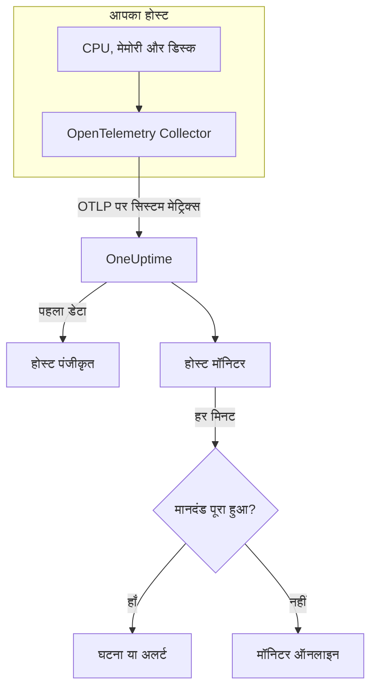

# होस्ट मॉनिटर

होस्ट मॉनिटर एक मशीन – उसके CPU, मेमोरी, डिस्क, लोड और प्रक्रियाओं – की निगरानी करता है और आपको बताता है जब वह संतृप्त हो जाती है या भरने लगती है। यह उन `system.*` OpenTelemetry मेट्रिक्स को पढ़ता है जो एक OpenTelemetry Collector होस्ट से भेजता है, वही डेटा जो **होस्ट** उत्पाद दिखाता है, इसलिए बाहर से कुछ भी जाँचा नहीं जाता।

:::cards
- [मॉनिटर बनाएं](#होस्ट-मॉनिटर-बनाएं): डैशबोर्ड में छह चरण।
- [टेम्पलेट](#तैयार-अलर्ट-टेम्पलेट): CPU, मेमोरी, डिस्क, लोड और प्रक्रियाओं के लिए पाँच तैयार अलर्ट।
- [मेट्रिक्स](#इकट्ठा-किए-गए-मेट्रिक्स): वे होस्ट मेट्रिक्स जिन पर आप अलर्ट दे सकते हैं, और उनकी इकाइयाँ।
- [होस्ट या Server / VM?](#होस्ट-मॉनिटर-या-server-vm-मॉनिटर): दोनों मशीन मॉनिटरों में से किसका उपयोग करें।
:::

## यह कैसे काम करता है

होस्ट पर `hostmetrics` रिसीवर के साथ एक OpenTelemetry Collector चलता है। हर 30 सेकंड में यह होस्ट के CPU, मेमोरी, डिस्क, नेटवर्क, लोड और प्रक्रियाओं के आँकड़े पढ़ता है और उन्हें OTLP पर OneUptime भेजता है। किसी होस्ट से आया पहला डेटा उसे **होस्ट** के अंतर्गत पंजीकृत करता है।

होस्ट मॉनिटर एक होस्ट से बंधा होता है। हर मिनट यह उस होस्ट के मेट्रिक्स पर अपनी क्वेरी चलाता है और परिणाम की तुलना अपने मानदंडों से करता है।

### होस्ट मॉनिटर या Server / VM मॉनिटर?

OneUptime में मशीनों के लिए दो मॉनिटर हैं। दोनों एक ही होस्ट पर चल सकते हैं।

| | होस्ट मॉनिटर | Server / VM मॉनिटर |
| --- | --- | --- |
| **एजेंट** | `hostmetrics` रिसीवर वाला OpenTelemetry Collector | OneUptime इन्फ्रास्ट्रक्चर एजेंट |
| **डेटा** | `system.*` और `process.*` OpenTelemetry मेट्रिक्स, वही जिनके चार्ट **होस्ट** पेज दिखाते हैं | एक स्थिति रिपोर्ट जिसे एजेंट मॉनिटर को भेजता है |
| **मानदंड** | किसी भी मेट्रिक क्वेरी या सूत्र पर थ्रेशोल्ड या विसंगति पहचान | CPU, मेमोरी और डिस्क उपयोग जैसी अंतर्निहित जाँचें |
| **सेटअप** | Collector इंस्टॉल करें; होस्ट खुद पंजीकृत हो जाता है | मॉनिटर बनाएं, फिर उसकी सीक्रेट कुंजी एजेंट को दें |

होस्ट मॉनिटर का उपयोग तब करें जब होस्ट पहले से OpenTelemetry डेटा भेज रहा हो, या जब आप उसी Collector से लॉग और अधिक समृद्ध मेट्रिक्स चाहते हों। दूसरे मॉनिटर के लिए [सर्वर / VM मॉनिटर](/docs/monitor/server-monitor) देखें।

## शुरू करने से पहले

- **होस्ट पर OpenTelemetry Collector चलाएं**, `hostmetrics` रिसीवर के साथ। [होस्ट OpenTelemetry कलेक्टर](/docs/telemetry/host-otel-collector) Linux, macOS और Windows को कवर करता है, और **उत्पाद → बुनियादी ढांचा → होस्ट्स → दस्तावेज़ीकरण** एक तैयार कॉन्फ़िगरेशन देता है।
- **उपयोग मेट्रिक्स चालू करें।** `system.cpu.utilization`, `system.memory.utilization` और `system.filesystem.utilization` रिसीवर में वैकल्पिक हैं, और CPU, मेमोरी और फ़ाइल सिस्टम टेम्पलेट को इनकी ज़रूरत है। डैशबोर्ड का कॉन्फ़िगरेशन इन्हें चालू करता है।
- **जाँचें कि होस्ट पंजीकृत है।** पहला डेटा आते ही यह अपने `host.name` के नाम से **उत्पाद → बुनियादी ढांचा → होस्ट्स → सभी होस्ट** के अंतर्गत दिखता है।

## होस्ट मॉनिटर बनाएं

:::steps
### नया मॉनिटर शुरू करें

**मॉनिटर** पर जाएं और **मॉनिटर बनाएं** पर क्लिक करें।

### होस्ट प्रकार चुनें

**मॉनिटर प्रकार** के अंतर्गत **और मॉनिटर प्रकार** पर क्लिक करें और **बुनियादी ढांचा** के अंतर्गत **होस्ट** चुनें। एक **नाम** दर्ज करें – यह घटना और अलर्ट के शीर्षकों में उपयोग होता है – और **अगला** पर क्लिक करें।

### निगरानी के लिए होस्ट चुनें

**Host Monitor Configuration** के अंतर्गत **होस्ट** से मशीन चुनें। हर वह होस्ट जिसने डेटा भेजा है, सूची में है।

### तय करें कि किस पर नज़र रखनी है

तीन टैब में से एक चुनें:

- **Quick Setup** – किसी [टेम्पलेट](#तैयार-अलर्ट-टेम्पलेट) पर क्लिक करें। यह मेट्रिक, एकत्रीकरण, समय सीमा और थ्रेशोल्ड सेट करता है, और नीचे के मानदंडों को अपने मानदंडों से बदल देता है। आप अब भी **समय सीमा** बदल सकते हैं।
- **Custom Metric** – **Host Metric** से एक मेट्रिक चुनें, फिर **एकत्रीकरण** और **समय सीमा** सेट करें।
- **उन्नत** – **मेट्रिक्स चुनें** के अंतर्गत खुद क्वेरी और सूत्र बनाएं, उदाहरण के लिए `state` पर फ़िल्टर या `mountpoint` के अनुसार समूहीकरण।

### मानदंड जाँचें

**मॉनिटर मानदंड** के अंतर्गत हर मानदंड खोलें और उसका **मीट्रिक**, **एकत्रीकरण**, **शर्त** और **Threshold** जाँचें। टेम्पलेट इन्हें भर देता है। **Custom Metric** या **उन्नत** के साथ मॉनिटर [डिफ़ॉल्ट मानदंडों](#डिफ़ॉल्ट-मानदंड) से शुरू होता है, जो सिर्फ़ मेट्रिक के शून्य पर गिरने को पकड़ते हैं, इसलिए अपना थ्रेशोल्ड सेट करें।

### मॉनिटर बनाएं

**मॉनिटर बनाएं** पर क्लिक करें। OneUptime मॉनिटर का पेज खोलता है और हर मिनट उसका मूल्यांकन करता है। यह जो घटनाएं और अलर्ट खोलता है, वे होस्ट के **घटनाएं** और **अलर्ट** पेजों पर भी दिखते हैं।
:::

> [!TIP]
> एक साथ कई टेम्पलेट सेट करने के लिए **उत्पाद → बुनियादी ढांचा → होस्ट्स** से होस्ट खोलें और **Recommendations** पर जाएं। अपने चाहे टेम्पलेट और जिन्हें पेज करना है उन्हें चुनें, और OneUptime हर टेम्पलेट के लिए एक मॉनिटर बनाता है।

## मॉनिटर सेटिंग्स

| फ़ील्ड | टैब | यह क्या करता है |
| --- | --- | --- |
| **होस्ट** | सभी | आवश्यक। हर क्वेरी को होस्ट के `resource.host.name` तक सीमित करता है। |
| **Host Metric** | Custom Metric | [कैटलॉग](#इकट्ठा-किए-गए-मेट्रिक्स) से एक मेट्रिक, CPU, मेमोरी, डिस्क, नेटवर्क, लोड और प्रक्रियाओं के रूप में समूहित। |
| **एकत्रीकरण** | Custom Metric | नमूनों को कैसे जोड़ा जाए: **औसत**, **अधिकतम**, **न्यूनतम**, **योग** या **गणना**। मेट्रिक के सामान्य एकत्रीकरण से शुरू होता है। |
| **समय सीमा** | सभी | वह चलती विंडो जिसे क्वेरी पढ़ती है, **Past 1 Minute** से **Past 365 Days** तक। नया मॉनिटर **Past 1 Minute** से शुरू होता है; टेम्पलेट अपनी विंडो सेट करते हैं। |
| **मेट्रिक्स चुनें** | उन्नत | क्वेरी बिल्डर: **मीट्रिक**, **Aggregate by**, **Filter by attributes**, **Group by**, साथ में क्वेरी जोड़ने के लिए **मीट्रिक जोड़ें** और **सूत्र जोड़ें**। |

## तैयार अलर्ट टेम्पलेट

**Quick Setup** पाँच टेम्पलेट देता है। हर एक पूरा मॉनिटर बनाता है: एक क्वेरी, एक मानदंड जो ट्रिगर होता है और एक जो ठीक होता है। थ्रेशोल्ड शुरुआती बिंदु हैं जिन्हें आप संपादित कर सकते हैं।

मानदंड तभी ट्रिगर होता है जब शर्त उसकी विंडो के हर मिनट में सही हो, और थ्रेशोल्ड से 10% आगे ठीक होता है ताकि सीमा पर मंडराता मान बार-बार न बदले।

| टेम्पलेट | गंभीरता | किस पर नज़र रखता है | कब ट्रिगर होता है | कब ठीक होता है |
| --- | --- | --- | --- | --- |
| High CPU Utilization | Warning | `user` और `system` स्थितियों के लिए `system.cpu.utilization`, जोड़कर प्रतिशत में दिखाया गया, पिछले 5 मिनट | 80% से ऊपर | 72% या उससे कम |
| High Memory Utilization | Warning | `used` स्थिति के लिए `system.memory.utilization`, प्रतिशत में, पिछले 5 मिनट | 85% से ऊपर | 76.5% या उससे कम |
| High Filesystem Usage | गंभीर | `system.filesystem.utilization`, प्रति `mountpoint` और `device` Max, प्रतिशत में, पिछले 5 मिनट | 90% से ऊपर | 81% या उससे कम |
| High Load Average (1m) | Warning | `system.cpu.load_average.1m`, Avg, पिछले 5 मिनट | 4 से ऊपर | 3.6 या उससे कम |
| High Process Count | Warning | `system.processes.count`, Max, पिछले 5 मिनट | 2000 से ऊपर | 1800 या उससे कम |

**गंभीरता** वह लेबल है जो चयन सूची दिखाती है। टेम्पलेट जो घटना और अलर्ट बनाता है, वे आपके प्रोजेक्ट की सबसे गंभीर घटना और अलर्ट गंभीरता से शुरू होते हैं; इन्हें मानदंडों में बदलें।

- **CPU** व्यस्त समय है (`user` और `system`), वही आँकड़ा जिसका चार्ट होस्ट का **अवलोकन** दिखाता है। Iowait और steal शामिल नहीं हैं।
- **मेमोरी** बफ़र और पेज कैश को शामिल नहीं करती, इसलिए जो होस्ट ज़्यादातर कैश से भरा है वह इसे ट्रिगर नहीं करता।
- **फ़ाइल सिस्टम** हर माउंट के लिए एक घटना खोलता है। केवल-पढ़ने वाले छद्म फ़ाइल सिस्टम, जैसे snap के `squashfs` माउंट या macOS का `devfs`, हमेशा 100% भरे होते हैं; इन्हें Collector के `filesystem` स्क्रेपर में बाहर रखें।
- **लोड औसत** रन कतार की कच्ची लंबाई है, कोर की संख्या से भाग नहीं दिया गया: 4 का मतलब 2-कोर होस्ट पर संतृप्ति है और 32-कोर होस्ट पर सामान्य स्थिति, इसलिए बड़े होस्ट पर इसे बढ़ाएं।
- **प्रक्रिया गणना** सबसे बड़ी एकल प्रक्रिया स्थिति (`running`, `sleeping`, …) की तुलना करती है, होस्ट के कुल योग की नहीं, इसलिए यह प्रक्रिया सूची से मेल नहीं खाएगी। प्रक्रिया स्क्रेपर सिर्फ़ Linux पर रिपोर्ट करता है।

## इकट्ठा किए गए मेट्रिक्स

**Host Metric** सूची ये मेट्रिक्स देती है। हर एक में `resource.host.name` होता है, जिससे मॉनिटर अपनी क्वेरी को एक होस्ट तक सीमित करता है।

> [!IMPORTANT]
> उपयोग मेट्रिक्स 0 से 1 तक का अनुपात हैं, प्रतिशत नहीं: कच्चे मेट्रिक पर थ्रेशोल्ड में 80% के लिए `0.8` का उपयोग करें। टेम्पलेट एक सूत्र से प्रतिशत में बदलते हैं, इसलिए उनके थ्रेशोल्ड 80, 85 और 90 हैं।

### CPU

| मेट्रिक | इकाई | विवरण |
| --- | --- | --- |
| `system.cpu.utilization` | अनुपात | हर `state` (`user`, `system`, `idle`, …) में बिताए CPU समय का हिस्सा। `state` पर फ़िल्टर करें: सभी स्थितियों का औसत कभी उपयोगी थ्रेशोल्ड तक नहीं पहुँचता। |
| `process.cpu.utilization` | अनुपात | होस्ट पर हर प्रक्रिया का CPU उपयोग। |

### मेमोरी

| मेट्रिक | इकाई | विवरण |
| --- | --- | --- |
| `system.memory.utilization` | अनुपात | हर `state` (`used`, `free`, `cached`, …) में भौतिक मेमोरी का हिस्सा। उपयोग में मेमोरी के लिए `state = used` पर फ़िल्टर करें। |
| `system.memory.usage` | बाइट | बाइट में मेमोरी उपयोग। |

### डिस्क

| मेट्रिक | इकाई | विवरण |
| --- | --- | --- |
| `system.filesystem.utilization` | अनुपात | हर फ़ाइल सिस्टम की क्षमता का उपयोग में हिस्सा, प्रति `mountpoint` और `device`। |
| `system.filesystem.usage` | बाइट | बाइट में फ़ाइल सिस्टम उपयोग। |

### नेटवर्क

| मेट्रिक | इकाई | विवरण |
| --- | --- | --- |
| `system.network.io` | बाइट | प्राप्त और भेजे गए बाइट। जीवनभर का काउंटर। |

### लोड

| मेट्रिक | इकाई | विवरण |
| --- | --- | --- |
| `system.cpu.load_average.1m` | गणना | पिछले एक मिनट का लोड औसत। |
| `system.cpu.load_average.5m` | गणना | पिछले 5 मिनट का लोड औसत। |
| `system.cpu.load_average.15m` | गणना | पिछले 15 मिनट का लोड औसत। |

### प्रक्रियाएँ

| मेट्रिक | इकाई | विवरण |
| --- | --- | --- |
| `system.processes.count` | गणना | होस्ट पर प्रक्रियाएँ, हर प्रक्रिया `status` के लिए एक सीरीज़। |

**उन्नत** में क्वेरी बिल्डर होस्ट द्वारा भेजे गए हर मेट्रिक को दिखाता है, सिर्फ़ इन्हें नहीं।

## मॉनिटरिंग मानदंड

मानदंड मॉनिटर की किसी क्वेरी या सूत्र की तुलना एक थ्रेशोल्ड से करता है। होस्ट मॉनिटर के मानदंडों में **फ़िल्टर प्रकार** नहीं होता: हर नियम इन फ़ील्ड के साथ मेट्रिक मान जाँचता है।

| फ़ील्ड | यह क्या करता है |
| --- | --- |
| **मीट्रिक** | जाँचने के लिए क्वेरी या सूत्र, उसके वेरिएबल नाम से। |
| **एकत्रीकरण** | विंडो के मान एक उत्तर कैसे बनते हैं: **औसत**, **योग**, **Maximum Value**, **Minimum Value**, **All Values** (हर मान को मेल खाना चाहिए) या **Any Value** (एक काफ़ी है)। |
| **शर्त** | **Greater Than**, **Less Than**, **Greater Than Or Equal To**, **Less Than Or Equal To** या **Equal To** – या कोई विसंगति शर्त: **Anomalously High**, **Anomalously Low** या **Anomalous**। |
| **Threshold** | तुलना के लिए मान। मेट्रिक की कोई इकाई होने पर इसके बगल में इकाइयों की सूची होती है। विसंगति शर्तों के लिए नहीं दिखता। |
| **संवेदनशीलता** | सिर्फ़ विसंगति शर्तें। **निम्न** (4σ), **मध्यम** (3σ, डिफ़ॉल्ट) या **उच्च** (2σ)। |
| **बेसलाइन विंडो** | सिर्फ़ विसंगति शर्तें। 14 दिन (डिफ़ॉल्ट), 28, 60 या 90 दिन का इतिहास। |
| **यदि कोई डेटा नहीं** | **और फ़ील्ड** के अंतर्गत। जब विंडो में कोई नमूना न हो तब क्या हो: **Ignore** (डिफ़ॉल्ट), **Treat As Zero** या **ट्रिगर**। |

विसंगति शर्तें हर मान की तुलना बेसलाइन में सप्ताह के उसी घंटे से करती हैं। जब तक बेसलाइन विंडो में पर्याप्त इतिहास न हो, वे "Learning" स्थिति में रहती हैं और कुछ नहीं बनातीं।

हर मानदंड यह भी बताता है कि मेल खाने पर क्या करना है: मॉनिटर की स्थिति बदलना, अलर्ट बनाना या घटना घोषित करना। मानदंड ऊपर से नीचे जाँचे जाते हैं, और जो पहले मेल खाता है वही तय करता है।

### डिफ़ॉल्ट मानदंड

जो मॉनिटर आप टेम्पलेट से नहीं बनाते, वह दो मानदंडों से शुरू होता है:

| क्रम | मानदंड | कब मेल खाता है | फिर |
| --- | --- | --- | --- |
| 1 | Check if _monitor name_ is offline | पहली क्वेरी का कोई भी मान `0` है | मॉनिटर को **ऑफ़लाइन** चिह्नित करता है और घटना "_monitor name_ is offline" घोषित करता है, जो मॉनिटर ठीक होने पर अपने आप सुलझ जाती है। |
| 2 | Check if _monitor name_ is online | कोई भी मान `0` से ऊपर है | मॉनिटर को **कार्यरत** चिह्नित करता है। |

> [!IMPORTANT]
> चुप्पी किसी भी मानदंड से मेल नहीं खाती: डेटा भेजना बंद करने वाला होस्ट मॉनिटर को वैसा ही छोड़ देता है जैसा वह था। होस्ट के चुप होने पर सूचना पाने के लिए किसी मानदंड पर **यदि कोई डेटा नहीं** को **ट्रिगर** पर सेट करें। जिस समय OneUptime खुद डेटा प्राप्त नहीं कर रहा था, वह कभी "कोई डेटा नहीं" नहीं माना जाता: जिस जाँच की विंडो में ऐसा समय हो, वह इसके बजाय प्रतीक्षा करती है, जैसा कि [जब OneUptime डेटा प्राप्त नहीं कर रहा हो](/docs/monitor/when-oneuptime-is-not-receiving) में बताया गया है।

## समस्या निवारण

:::details होस्ट होस्ट सूची में नहीं है
होस्ट Collector के डेटा से अपने आप पंजीकृत होते हैं, जिसके लिए `host.name` और होस्ट के OS प्रकार की ज़रूरत होती है – दोनों Collector के `resourcedetection` प्रोसेसर से आते हैं। जाँचें कि Collector चल रहा है और होस्ट **उत्पाद → बुनियादी ढांचा → होस्ट्स → सभी होस्ट** के अंतर्गत दिख रहा है। [होस्ट OpenTelemetry कलेक्टर](/docs/telemetry/host-otel-collector) कॉन्फ़िगरेशन बताता है।
:::

:::details CPU या मेमोरी थ्रेशोल्ड कभी ट्रिगर नहीं होता
उपयोग मेट्रिक्स ऐसे अनुपात हैं जो `1.0` पर रुक जाते हैं, इसलिए हाथ से लिखा `80` का थ्रेशोल्ड कभी पार नहीं होता: `0.8` का उपयोग करें, या किसी टेम्पलेट से शुरू करें, जो प्रतिशत में बदलता है। `state` पर भी फ़िल्टर करें – CPU के लिए `user` और `system`, मेमोरी के लिए `used`। सभी स्थितियों का औसत 1 को स्थितियों की संख्या से भाग देने के आसपास ही रहता है।
:::

:::details गलत होस्ट के लिए घटनाएं ट्रिगर होती हैं
मॉनिटर हर क्वेरी को आपके चुने होस्ट के बराबर `resource.host.name` से सीमित करता है। जो होस्ट एक ही `host.name` रिपोर्ट करते हैं, वे एक सीरीज़ में मिल जाते हैं, इसलिए हर होस्ट को एक अनूठा नाम दें।
:::

:::details High Filesystem Usage हमेशा भरे रहने वाले माउंट के लिए ट्रिगर होता है
केवल-पढ़ने वाले छद्म फ़ाइल सिस्टम, जैसे `/snap` के अंतर्गत snap के `squashfs` लूप माउंट या macOS का `devfs`, डिज़ाइन से ही 100% भरे होते हैं और कभी ठीक नहीं होते। इन्हें Collector के `filesystem` स्क्रेपर से बाहर रखें।
:::

## अगले चरण

:::cards
- [होस्ट OpenTelemetry कलेक्टर](/docs/telemetry/host-otel-collector): वह Collector इंस्टॉल और कॉन्फ़िगर करें जिसे यह मॉनिटर पढ़ता है।
- [सर्वर / VM मॉनिटर](/docs/monitor/server-monitor): मशीनों के लिए वह मॉनिटर जिसे एजेंट डेटा भेजता है।
- [मेट्रिक्स मॉनिटर](/docs/monitor/metrics-monitor): होस्ट और सेवाओं में किसी भी मेट्रिक पर अलर्ट दें।
- [घटनाओं का अवलोकन](/docs/incidents/index): किसी मानदंड के घटना घोषित करने के बाद क्या होता है।
:::
