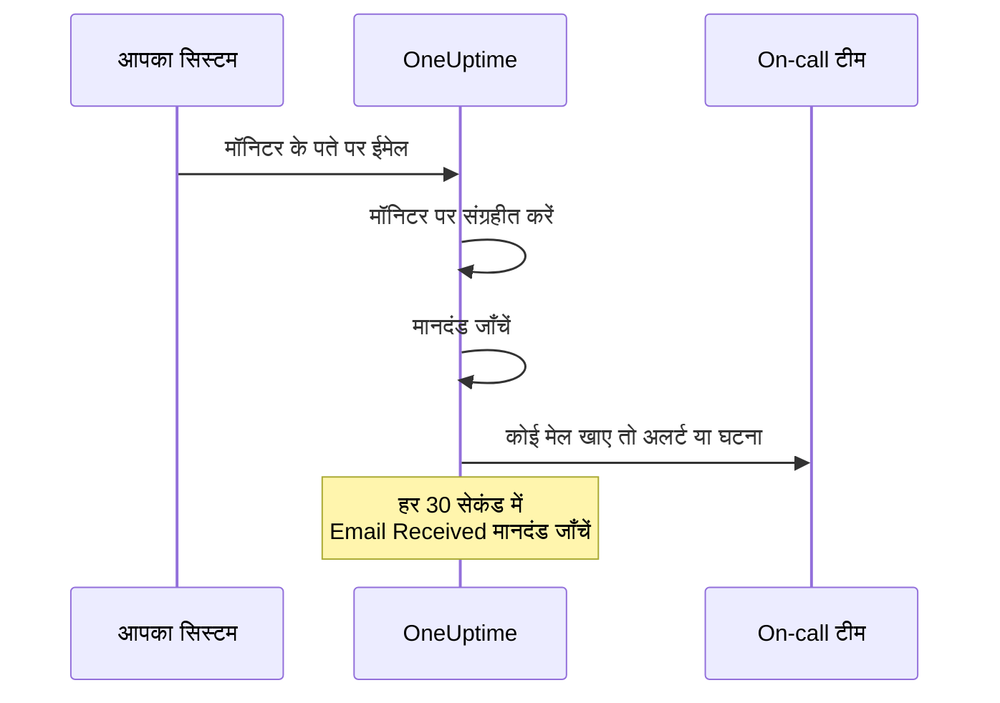

# आने वाले ईमेल मॉनिटर

आने वाले ईमेल मॉनिटर आपको एक ईमेल पता देता है जो केवल एक मॉनिटर का होता है। ईमेल भेज सकने वाली कोई भी चीज़ — कोई backup job, कोई पुराना सिस्टम, किसी क्लाउड प्रदाता के अलर्ट — अपने परिणाम वहाँ भेजती है, और OneUptime हर ईमेल को आपके मानदंडों पर परखता है, ताकि मॉनिटर को डाउन चिह्नित करे, घटना खोले या अलर्ट बनाए, और सब ठीक होने का संदेश आने पर उन्हें सुलझा दे।

:::cards
- [मॉनिटर बनाएं](#आने-वाले-ईमेल-मॉनिटर-बनाएं): एक पता पाएँ और अपने भेजने वाले को उस पर लगाएँ।
- [पते की पुष्टि करें](#भेजने-वाले-के-साथ-पते-की-पुष्टि): भेजने वाले का पुष्टि ईमेल मॉनिटर पर पढ़ें।
- [मानदंड लिखें](#उपलब्ध-फ़िल्टर-प्रकार): विषय, भेजने वाले या body से मिलान करें, या ईमेल रुकने पर अलर्ट करें।
- [अलर्ट में ईमेल का उपयोग करें](#टेम्पलेट-वेरिएबल): विषय और body को शीर्षकों और विवरणों में डालें।
:::

## यह कैसे काम करता है

ईमेल एक push मॉडल है: आपका सिस्टम भेजता है, और OneUptime सुनता है। हर ईमेल आते ही मॉनिटर के मानदंडों पर जाँचा जाता है। जो मानदंड ऐसे ईमेल देखते हैं जो *आने चाहिए थे*, उनकी जाँच एक शेड्यूल पर, हर 30 सेकंड में, भी होती है।



1. जब आप आने वाले ईमेल मॉनिटर बनाते हैं, तो OneUptime उसे एक अनोखा ईमेल पता देता है।
2. उस पते पर भेजा गया हर ईमेल मॉनिटर पर संग्रहीत होता है और ऊपर से शुरू करके उसके मानदंडों पर परखा जाता है; जो मानदंड पहले मेल खाए, वही तय करता है।
3. मेल खाने वाला मानदंड मॉनिटर की स्थिति बदल सकता है, अलर्ट बना सकता है और घटना घोषित कर सकता है। **घटना स्वतः सुलझाएं** चालू वाली घटना, या **अलर्ट स्वतः सुलझाएं** चालू वाला अलर्ट, बाद में कोई दूसरा मानदंड मेल खाने पर सुलझ जाता है — उदाहरण के लिए वह मानदंड जो मॉनिटर को ऑनलाइन चिह्नित करता है।

## आने वाले ईमेल मॉनिटर बनाएं

:::steps
### नया मॉनिटर शुरू करें

**मॉनिटर** पर जाएँ और **मॉनिटर बनाएं** पर क्लिक करें।

### Incoming Email चुनें

**मॉनिटर प्रकार** में **और मॉनिटर प्रकार** पर क्लिक करें और **Inbound Monitoring** के अंतर्गत **Incoming Email** चुनें, या खोज बॉक्स में `email` टाइप करें। एक **नाम** दर्ज करें, फिर **अगला** पर क्लिक करें।

### मानदंडों की समीक्षा करें

**मानदंड** चरण [डिफ़ॉल्ट मानदंडों](#आपको-शुरुआत-में-क्या-मिलता-है) से शुरू होता है, जो किसी ईमेल में `error` का ज़िक्र होने पर मॉनिटर को ऑफ़लाइन चिह्नित करते हैं। किसी मानदंड को बदलने के लिए उस पर क्लिक करें, या नया जोड़ने के लिए **मानदंड जोड़ें** पर क्लिक करें। आम सेटअप के लिए [उदाहरण कॉन्फ़िगरेशन](#उदाहरण-कॉन्फ़िगरेशन) देखें।

### मॉनिटर बनाएं

**मॉनिटर बनाएं** पर क्लिक करें। मॉनिटर अपने **अवलोकन** पेज पर खुलता है, जहाँ पहला ईमेल आने तक **Incoming Email Address** कार्ड copy बटन के साथ पता दिखाता है।

### पते पर ईमेल भेजें

अपने सिस्टम को उसकी सूचनाएँ इस पते पर भेजने के लिए कॉन्फ़िगर करें। अगर भेजने वाला पहले पते की पुष्टि करने को कहे, तो देखें [भेजने वाले के साथ पते की पुष्टि](#भेजने-वाले-के-साथ-पते-की-पुष्टि)।
:::

> [!NOTE]
> पते में मॉनिटर की सीक्रेट कुंजी होती है, इसलिए केवल वे लोग इसे देख सकते हैं जो मॉनिटर संपादित कर सकते हैं। बाकी सबको दिखता है कि सेटअप विवरण छिपे हुए हैं।

## ईमेल पते का फ़ॉर्मेट

हर आने वाले ईमेल मॉनिटर को इस फ़ॉर्मेट में एक अनोखा पता मिलता है:

```text
monitor-{secret-key}@{inbound-domain}
```

सीक्रेट कुंजी एक UUID है, उदाहरण के लिए `monitor-3f2b8c1e-5d4a-4f6b-9a7c-2e1d0b9f8a6c@inbound.yourdomain.com`। पहला ईमेल आने के बाद पता मॉनिटर के **अवलोकन** पेज पर **Inbound email address** कार्ड में बना रहता है, पिछला ईमेल कब आया इसके साथ। मॉनिटर का **दस्तावेज़ीकरण** पेज भी इसे दिखाता है।

## ईमेल पता रीसेट या अनुकूलित करना

मॉनिटर के **सेटिंग्स** टैब पर जाएँ। **Incoming Email Address** कार्ड मौजूदा पता दिखाता है और उसे बदलने के दो तरीके देता है:

| कार्रवाई | यह क्या करती है | कब उपयोग करें |
| --- | --- | --- |
| **Reset Address** | मॉनिटर को एक नया, बेतरतीब ढंग से बना `monitor-{secret-key}@{inbound-domain}` पता देती है। अगर मॉनिटर का कोई कस्टम पता है, तो रीसेट उसे हटा देता है। यह पहले पुष्टि माँगती है। | पता लीक हो गया है, या आप उस पर भेजने वाली हर चीज़ को काटना चाहते हैं। |
| **Customize Address** | आपको @ से पहले का हिस्सा चुनने देती है, उदाहरण के लिए `nightly-backups@{inbound-domain}`। इसे **Address name** में दर्ज करें — आप नाम टाइप कर सकते हैं या पूरा पता paste कर सकते हैं — और **Save Address** पर क्लिक करें। | आपको ऐसा पता चाहिए जिसे लोग पहचान सकें। |

दोनों कार्रवाइयाँ अंत में copy बटन के साथ नया पता दिखाती हैं।

> [!WARNING]
> **पुराना पता तुरंत काम करना बंद कर देता है**: उस पर भेजे गए ईमेल अनदेखे किए जाते हैं, इसलिए इस मॉनिटर को ईमेल भेजने वाले हर सिस्टम को अपडेट करें।

कस्टम पते के नियम:

- 3 से 64 वर्ण: छोटे अक्षर, अंक, बिंदु (`.`), hyphens (`-`) और underscores (`_`), लगातार दो बिंदुओं के बिना। इसे किसी अक्षर या अंक से शुरू और खत्म होना चाहिए। बड़े अक्षरों को आपके लिए छोटा कर दिया जाता है।
- Domain हमेशा सर्वर का inbound email domain होता है।
- नाम पहले से किसी दूसरे मॉनिटर द्वारा उपयोग में नहीं होना चाहिए। सर्वर के सभी projects inbound domain साझा करते हैं, इसलिए नाम उन सब में अनोखा होना चाहिए।
- `monitor-{id}` और `workflow-{id}` रूप वाले नाम बनाए गए पतों के लिए आरक्षित हैं। Domain के अपने mailbox नाम भी आरक्षित हैं: `abuse`, `admin`, `administrator`, `hostmaster`, `mailer-daemon`, `noc`, `postmaster`, `root`, `security` और `webmaster`।

कस्टम पता भी बनाए गए पते जितना ही एक क्रेडेंशियल है: जो भी इसे जानता है, वह ऐसा ईमेल भेज सकता है जिसे यह मॉनिटर परखेगा। बनाए गए पते का अनुमान लगाना लगभग असंभव है, लेकिन छोटे, स्पष्ट नाम का नहीं। अगर यह आपके लिए मायने रखता है, तो कोई कठिन अनुमान वाला नाम चुनें।

API उपयोगकर्ता किसी मौजूदा मॉनिटर पर Monitor API से यही कर सकते हैं: कस्टम पता उपयोग करने के लिए `incomingEmailCustomLocalPart` को नाम पर सेट करें, या बनाए गए पते पर लौटने के लिए उसे `null` पर सेट करें। रीसेट का मतलब है एक ही अपडेट में नया `incomingEmailSecretKey` लिखना और `incomingEmailCustomLocalPart` को `null` पर सेट करना।

## भेजने वाले के साथ पते की पुष्टि

कुछ सेवाएँ किसी नए पते पर तब तक अलर्ट नहीं भेजतीं जब तक कोई यह साबित न करे कि वह वहाँ मेल पढ़ सकता है। वे पहले एक पुष्टि ईमेल भेजती हैं, और यह किसी भी दूसरे ईमेल की तरह मॉनिटर पर आता है। इसे पढ़ने के लिए:

:::steps
### सेवा में पता जोड़ें

सेवा में मॉनिटर का पता जोड़ें और सहेजें। सेवा अपना पुष्टि ईमेल भेजती है।

### सबसे नया ईमेल खोलें

OneUptime में मॉनिटर खोलें। उसके **अवलोकन** पेज पर **मॉनिटर सारांश** कार्ड सबसे नया ईमेल दिखाता है। जाँचें कि **से** (भेजने वाला) और **विषय** पुष्टि ईमेल के हैं, फिर **अधिक विवरण दिखाएं** पर क्लिक करें।

### कोड या लिंक कॉपी करें

कोड या लिंक **ईमेल बॉडी (Text)** में है। **ईमेल बॉडी (HTML)** HTML source दिखाता है, इसलिए अगर आप वहाँ से लिंक कॉपी करते हैं, तो उसमें हर `&amp;` को `&` में बदलें।

### पुष्टि पूरी करें

ईमेल जैसा बताए, उस तरह पुष्टि पूरी करें।
:::

अगर तब से कोई दूसरा ईमेल आ गया है, तो कार्ड अब पुष्टि ईमेल नहीं दिखाता। **निगरानी लॉग** खोलें, **ईमेल** कॉलम में विषय से पुष्टि ईमेल ढूँढें, और उस पंक्ति पर **सारांश देखें** पर क्लिक करें।

> [!IMPORTANT]
> **आपके मानदंड भी इसे देखते हैं।** पुष्टि ईमेल को किसी भी दूसरे ईमेल की तरह परखा जाता है। "if you received this in error" जैसे शब्द डिफ़ॉल्ट `error` मानदंड से मेल खाते हैं और मॉनिटर को ऑफ़लाइन चिह्नित कर देते हैं। इससे बचने के लिए, पुष्टि करते समय मॉनिटर के **सेटिंग्स** पेज पर **निगरानी** कार्ड में **इस मॉनिटर की जाँच करें** बंद करें (यह पुष्टि माँगता है)। निगरानी बंद वाला मॉनिटर फिर भी ईमेल दर्ज करता है, और **मॉनिटर सारांश** कार्ड उसे अब भी दिखाता है। लेकिन यह कुछ नहीं परखता, इसलिए उस ईमेल की **निगरानी लॉग** में कोई पंक्ति नहीं बनती: कोई दूसरा ईमेल आने से पहले इसे पढ़ लें। काम पूरा होने पर मॉनिटर के पेजों के ऊपर बैनर में **निगरानी चालू करें** दबाएँ, या स्विच फिर से चालू करें।

**पुष्टि पते से जुड़ी है।** अगर आप [पता रीसेट या अनुकूलित करते हैं](#ईमेल-पता-रीसेट-या-अनुकूलित-करना), तो सेवा को एक नया प्राप्तकर्ता दिखता है, और आपको फिर से पुष्टि करनी होगी।

### Azure Monitor action groups

जुलाई 2026 से Azure यह आवश्यकता लागू कर रहा है कि किसी action group में हर नए **Email** प्राप्तकर्ता की पुष्टि one-time passcode से हो। जब तक ऐसा न हो, action group उस पते पर न कोई अलर्ट भेजता है, न कोई test notification।

:::steps
1. Action group में मॉनिटर के पते के साथ एक **Email** notification जोड़ें, और action group सहेजें। Azure `azure-noreply@microsoft.com` जैसे किसी Microsoft पते से पुष्टि ईमेल भेजता है।
2. ऊपर बताए अनुसार इसे मॉनिटर पर पढ़ें, और action group सहेजने के 30 मिनट के भीतर उसके निर्देशों का पालन करें। अगर passcode की अवधि खत्म हो जाए, तो action group खोलें और **Resend** चुनें।
3. Action group खोलें और test notification भेजने के लिए **Test** चुनें। यह असली अलर्ट की तरह मॉनिटर पर आता है, इसलिए यह भी दिखाता है कि आपके मानदंड Azure के ईमेल से मेल खाते हैं या नहीं।
:::

पुष्टि उसी Azure tenant के हर action group पर लागू होती है, इसलिए हर पते की पुष्टि केवल एक बार करनी होती है।

### Amazon SNS

किसी SNS topic की ईमेल subscription को पुष्टि होने तक कुछ नहीं मिलता। Subscription बनाने पर Amazon SNS पते पर एक पुष्टि ईमेल भेजता है। ऊपर बताए अनुसार इसे मॉनिटर पर पढ़ें, और उसका **Confirm subscription** लिंक अपने ब्राउज़र में खोलें। SNS उस subscription को हटा देता है जिसकी 48 घंटे के भीतर पुष्टि न हो; ऐसा हो जाए तो subscription फिर से बनाएँ।

## आपको शुरुआत में क्या मिलता है

नया आने वाले ईमेल मॉनिटर दो मानदंडों के साथ बनता है जो ईमेल body पढ़ते हैं:

| मानदंड | फ़िल्टर प्रकार | फ़िल्टर शर्त | मान | प्रभाव |
| -------- | ----------- | ---------------- | ------- | -------------------------------------------- |
| Offline  | Email Body  | शामिल है | `error` | मॉनिटर को ऑफ़लाइन चिह्नित करता है, एक घटना खोलता है |
| Online   | Email Body  | Not Contains | `error` | मॉनिटर को ऑनलाइन चिह्नित करता है |

यह उस आम स्थिति के लिए ठीक है जहाँ कोई job या third-party टूल अपना परिणाम ईमेल करता है: जिस संदेश की body में `error` का ज़िक्र हो, वह मॉनिटर को डाउन कर देता है, और उसके बिना अगला संदेश मॉनिटर को फिर ऊपर लाता है और घटना सुलझा देता है। Body मिलान case-insensitive है, इसलिए `Error` और `ERROR` भी मेल खाते हैं।

मान को वह बना दें जो आपका भेजने वाला वास्तव में लिखता है (`FAILED`, `exit code 1` वगैरह)।

> [!NOTE]
> ये डिफ़ॉल्ट dead-man's switch **नहीं** हैं: ईमेल आना बंद होने पर यहाँ कुछ भी trigger नहीं होता। जो मानदंड केवल विषय, भेजने वाला, body या प्राप्तकर्ता पढ़ते हैं, उनका मूल्यांकन तभी होता है जब कोई ईमेल आता है, किसी और समय नहीं। खामोशी पर अलर्ट पाने के लिए एक **Email Received** / **Not Recieved In Minutes** मानदंड जोड़ें — देखें [उदाहरण 3](#उदाहरण-3-heartbeat-मॉनिटर-ईमेल-नहीं-अलर्ट)।

## उपलब्ध फ़िल्टर प्रकार

आप इन ईमेल fields के आधार पर मानदंड बना सकते हैं:

| फ़िल्टर प्रकार | विवरण |
| ------------------------- | ----------------------------------------------------------------------------------- |
| **ईमेल विषय** | आने वाले ईमेल की विषय पंक्ति |
| **Email From Address** | भेजने वाले का ईमेल पता: केवल पता, छोटे अक्षरों में, display name के बिना |
| **Email Body** | ईमेल body का सादा टेक्स्ट भाग |
| **Email To Address** | प्राप्तकर्ता का ईमेल पता |
| **Email Received** | ईमेल कब प्राप्त होते हैं, इस पर आधारित मानदंड |
| **JavaScript Expression** | एक कस्टम JavaScript expression जिसे true निकलना चाहिए |

किसी भी मानदंड के ईमेल पढ़ने से पहले मॉनिटर का अपना पता छिपा दिया जाता है, इसलिए **Email To Address**, **ईमेल विषय** और **Email Body** में यह `[REDACTED]` पढ़ा जाता है।

## फ़िल्टर शर्तें

### String फ़िल्टर (विषय, भेजने वाला, body, प्राप्तकर्ता)

| फ़िल्टर शर्त | विवरण | उदाहरण |
| ---------------- | ----------------------------------------- | ---------------------------------- |
| **शामिल है** | Field में दिया गया टेक्स्ट है | विषय में "CRITICAL" है |
| **Not Contains** | Field में दिया गया टेक्स्ट नहीं है | विषय में "TEST" नहीं है |
| **Equal To** | Field दिए गए टेक्स्ट से पूरी तरह मेल खाता है | भेजने वाला "alerts@service.com" के बराबर है |
| **Not Equal To** | Field दिए गए टेक्स्ट से मेल नहीं खाता | विषय "OK" के बराबर नहीं है |
| **Starts With** | Field दिए गए टेक्स्ट से शुरू होता है | विषय "[ALERT]" से शुरू होता है |
| **Ends With** | Field दिए गए टेक्स्ट पर खत्म होता है | विषय "- Production" पर खत्म होता है |
| **Is Empty** | Field खाली है | Body खाली है |
| **Is Not Empty** | Field में सामग्री है | विषय खाली नहीं है |

ये सभी तुलनाएँ case-insensitive हैं। खाली मान वाला फ़िल्टर कभी मेल नहीं खाता।

### समय आधारित फ़िल्टर (Email Received)

Dashboard इन शर्तों को "Recieved" लिखता है।

| फ़िल्टर शर्त | विवरण | उदाहरण |
| --------------------------- | ----------------------------------- | -------------------------------- |
| **Recieved In Minutes** | X मिनट के भीतर ईमेल मिला | 30 मिनट में ईमेल मिला |
| **Not Recieved In Minutes** | X मिनट में कोई ईमेल नहीं मिला | 60 मिनट में ईमेल नहीं मिला |

जिस मॉनिटर को कभी कोई ईमेल नहीं मिला, वह अपने बनने के समय को पिछला ईमेल मानता है।

### JavaScript Expression

| फ़िल्टर शर्त | विवरण |
| --------------------- | ------------------------------------- |
| **Evaluates To True** | Expression एक truthy मान लौटाता है |

Expression एक ऐसे sandbox में चलता है जिसमें कोई ईमेल field बंधा नहीं होता, इसलिए वह उस संदेश का विषय, भेजने वाला, body या प्राप्तकर्ता नहीं पढ़ सकता जिसने जाँच शुरू की। ईमेल सामग्री पर मिलान के लिए **ईमेल विषय**, **Email From Address**, **Email Body** और **Email To Address** फ़िल्टर प्रकारों का उपयोग करें।

## उदाहरण कॉन्फ़िगरेशन

हर उदाहरण मानदंडों की एक जोड़ी है। एक मानदंड में फ़िल्टर, एक **मिलान शर्त** (उसके फ़िल्टरों में से **सभी** या **कोई भी**), और कार्रवाइयाँ होती हैं: मॉनिटर की स्थिति बदलना, अलर्ट बनाना, घटना घोषित करना। अलर्ट या घटना में **और फ़ील्ड** के अंतर्गत **अलर्ट स्वतः सुलझाएं** (या **घटना स्वतः सुलझाएं**) चालू करें, ताकि दूसरा मानदंड वह सुलझा दे जो पहले ने खोला।

### उदाहरण 1: गंभीर ईमेल पर अलर्ट बनाएं

| मानदंड | फ़िल्टर | मिलान शर्त | कार्रवाइयाँ |
| --- | --- | --- | --- |
| गंभीर ईमेल | **ईमेल विषय** शामिल है `CRITICAL`; **ईमेल विषय** शामिल है `ALERT`; **ईमेल विषय** शामिल है `ERROR` | **कोई भी** | स्थिति को ऑफ़लाइन में बदलें; अलर्ट बनाएं |
| सुधार ईमेल | **ईमेल विषय** शामिल है `RESOLVED`; **ईमेल विषय** शामिल है `RECOVERED` | **कोई भी** | स्थिति को ऑनलाइन में बदलें |

गंभीर मानदंड को सबसे पहले रखें: मानदंड ऊपर से जाँचे जाते हैं, और जो पहले मेल खाए वही तय करता है।

### उदाहरण 2: किसी खास भेजने वाले की निगरानी

| मानदंड | फ़िल्टर | मिलान शर्त | कार्रवाइयाँ |
| --- | --- | --- | --- |
| विफल job | **Email From Address** Equal To `monitoring@legacy-system.com`; **ईमेल विषय** शामिल है `Failed` | **सभी** | स्थिति को ऑफ़लाइन में बदलें; घटना घोषित करें |
| सफल job | **Email From Address** Equal To `monitoring@legacy-system.com`; **ईमेल विषय** शामिल है `Success` | **सभी** | स्थिति को ऑनलाइन में बदलें |

### उदाहरण 3: Heartbeat मॉनिटर (ईमेल नहीं = अलर्ट)

| मानदंड | फ़िल्टर | कार्रवाइयाँ |
| --- | --- | --- |
| ईमेल देर से है | **Email Received** Not Recieved In Minutes `60` | स्थिति को ऑफ़लाइन में बदलें; अलर्ट बनाएं |
| ईमेल आ गया | **Email Received** Recieved In Minutes `60` | स्थिति को ऑनलाइन में बदलें |

पहला मानदंड तब trigger होता है जब 60 मिनट तक कोई ईमेल नहीं आया — यह उन scheduled jobs या batch processes के लिए उपयोगी है जो पूरा होने का ईमेल भेजते हैं। दूसरा, ईमेल आते ही अलर्ट सुलझा देता है। जिन मिनटों में OneUptime खुद ईमेल नहीं ले रहा था, वे इन 60 में नहीं गिने जाते, जैसा [जब OneUptime डेटा प्राप्त नहीं कर रहा हो](/docs/monitor/when-oneuptime-is-not-receiving) बताता है।

## उपयोग के मामले

| उपयोग का मामला | मॉनिटर क्या करता है |
| --- | --- |
| पुराने सिस्टम का एकीकरण | पुराने सिस्टम के केवल-ईमेल अलर्ट को OneUptime घटनाओं में बदलता है, और सुधार ईमेल आने पर उन्हें सुलझाता है। |
| Third-party सेवाएँ | क्लाउड प्रदाताओं (AWS, GCP, Azure), security scanners, backup टूल से सूचनाएँ और प्रमाणपत्र समाप्ति चेतावनियाँ प्राप्त करता है। |
| Scheduled jobs | पूरा होने का ईमेल देर से आने पर, या job के विफलता का ईमेल भेजने पर अलर्ट करता है। |
| अलर्ट एकत्रीकरण | Nagios, Zabbix या दूसरे टूल से ईमेल अलर्ट इकट्ठा करता है, ताकि OneUptime वह एक जगह हो जहाँ आप उन्हें संभालें। |

## टेम्पलेट वेरिएबल

यह मॉनिटर जो अलर्ट और घटनाएँ बनाता है, उनके शीर्षक, विवरण और समाधान नोट इन वेरिएबल का उपयोग कर सकते हैं। मानदंड के अलर्ट और घटना फ़ॉर्म इन्हें **टेम्पलेट वेरिएबल** के अंतर्गत सूचीबद्ध करते हैं, और [घटना और अलर्ट टेम्पलेट](/docs/monitor/incident-alert-templating) syntax समझाता है।

| वेरिएबल | विवरण |
| --------------------- | ----------------------------------------------------------------- |
| `{{emailSubject}}`    | मिले हुए ईमेल का विषय |
| `{{emailFrom}}`       | भेजने वाले का ईमेल पता |
| `{{emailTo}}`         | ईमेल किसे भेजा गया, इस मॉनिटर के अपने पते को छिपाकर |
| `{{emailBody}}`       | ईमेल की सादी टेक्स्ट body |
| `{{emailReceivedAt}}` | ईमेल कब मिला, UTC में ISO 8601 timestamp के रूप में |

- **शीर्षक को हर एक की एक पंक्ति मिलती है।** शीर्षक में हर वेरिएबल अधिकतम 150 वर्णों की एक पंक्ति तक काटा जाता है, और लंबा होने पर `...` पर खत्म होता है। शीर्षक 500 वर्णों से लंबा नहीं हो सकता, और बहुत लंबे शीर्षक वाला अलर्ट या घटना बनती ही नहीं, इसलिए पूरा ईमेल उद्धृत करने से मॉनिटर लंबे ईमेल पर अलर्ट नहीं कर पाएगा। विवरण और समाधान नोट को पूरा मान मिलता है।
- **इस मॉनिटर का पता छिपाया जाता है।** पता पासवर्ड की तरह काम करता है, इसलिए ईमेल संग्रहीत होने से पहले उसे छिपा दिया जाता है, और `{{emailTo}}` `monitor-[REDACTED]@{inbound-domain}` पढ़ा जाता है (कस्टम पते के लिए `[REDACTED]@{inbound-domain}`)।
- **गायब ईमेल की जाँच पिछले ईमेल का उपयोग करती है।** जब कोई **Email Received** मानदंड समय पर ईमेल न आने के कारण अलर्ट खोलता है, तो वेरिएबल मॉनिटर को मिले पिछले ईमेल का वर्णन करते हैं। अगर अब तक कोई नहीं आया, तो वे खाली होते हैं।

## मॉनिटर सारांश दृश्य

मॉनिटर को ईमेल मिलने के बाद, उसके **अवलोकन** पेज पर **मॉनिटर सारांश** कार्ड सबसे नया ईमेल दिखाता है:

- **अंतिम ईमेल प्राप्त हुआ**: सबसे हाल का ईमेल कब मिला
- **से**: पिछले ईमेल का भेजने वाला
- **विषय**: पिछले ईमेल की विषय पंक्ति

बाकी देखने के लिए **अधिक विवरण दिखाएं** पर क्लिक करें:

- **ईमेल हेडर**: पिछले ईमेल के पूरे headers
- **ईमेल बॉडी (Text)**: सादी टेक्स्ट body
- **ईमेल बॉडी (HTML)**: HTML body, render करने के बजाय HTML source के रूप में दिखाई गई

### पिछले ईमेल

कार्ड केवल सबसे नया ईमेल दिखाता है। मॉनिटर जिस भी ईमेल को परखता है, वह **निगरानी लॉग** में भी लिखा जाता है: **ईमेल** कॉलम उसका विषय और भेजने वाला दिखाता है, और उसकी पंक्ति पर **सारांश देखें** पूरा ईमेल उसी तरह दिखाता है जैसे कार्ड। निगरानी बंद वाला मॉनिटर कुछ नहीं परखता, इसलिए उसे मिलने वाले ईमेल की कोई पंक्ति नहीं बनती। अगर आपका कोई मानदंड **Email Received** जाँचता है, तो मॉनिटर हर बार गायब ईमेल की जाँच करते समय भी एक पंक्ति लिखता है। उन पंक्तियों पर **ईमेल** कॉलम "Scheduled check" कहता है, और उनका **सारांश देखें** जाँच के समय का सबसे नया ईमेल दिखाता है, या कोई न आया हो तो "No email yet"। निगरानी लॉग डिफ़ॉल्ट रूप से एक दिन रखे जाते हैं। Self-hosted सर्वर पर कोई administrator इसे Admin Dashboard की सेटिंग्स में **मॉनिटर लॉग प्रतिधारण (दिन)** से बदल सकता है।

## Self-hosted सेटअप

अगर आप OneUptime self-host कर रहे हैं, तो आपको एक inbound email प्रदाता कॉन्फ़िगर करना होगा। अभी समर्थित:

- **SendGrid Inbound Parse** - सेटअप निर्देशों के लिए देखें [SendGrid आने वाला ईमेल](/docs/self-hosted/sendgrid-inbound-email)

जब तक यह सेट न हो, मॉनिटर का पता कार्ड कहता है कि inbound email कॉन्फ़िगर नहीं है।

## ध्यान देने योग्य बातें

- **ईमेल पते की सुरक्षा**: मॉनिटर का ईमेल पता पासवर्ड की तरह काम करता है: जो भी इसे जानता है, वह मॉनिटर को ईमेल भेज सकता है। इसे सार्वजनिक रूप से साझा न करें, और लीक होने पर मॉनिटर के **सेटिंग्स** टैब से इसे रीसेट करें।
- **ईमेल का आकार**: OneUptime attachments सहित 50 MB तक का आने वाला ईमेल स्वीकार करता है। Attachments संग्रहीत नहीं होते — केवल उनके नाम, प्रकार और आकार।
- **संसाधन समय**: ईमेल asynchronously संसाधित होते हैं। ईमेल भेजने और अलर्ट बनने के बीच कुछ सेकंड की देरी हो सकती है।
- **Case से स्वतंत्र**: सभी string तुलनाएँ (शामिल है, Equal To आदि) case-insensitive हैं।
- **सादा टेक्स्ट**: ईमेल body मानदंड ईमेल का सादा टेक्स्ट भाग पढ़ते हैं। केवल HTML के रूप में भेजे गए ईमेल की body मानदंडों के लिए खाली होती है — इसलिए उसमें `error` नहीं होता, और डिफ़ॉल्ट मानदंड मॉनिटर को ऑनलाइन चिह्नित करते हैं।

## समस्या निवारण

### ईमेल नहीं मिल रहे

1. पुष्टि करें कि ईमेल पता सही है (टाइपिंग की गलतियाँ जाँचें)।
2. जाँचें कि कहीं भेजने वाला पते की पुष्टि का इंतज़ार तो नहीं कर रहा। Azure Monitor action groups और Amazon SNS किसी नए पते पर पुष्टि होने तक कुछ नहीं भेजते। देखें [भेजने वाले के साथ पते की पुष्टि](#भेजने-वाले-के-साथ-पते-की-पुष्टि)।
3. जाँचें कि ईमेल spam फ़िल्टर से रुक तो नहीं रहा।
4. पुष्टि करें कि आपका inbound email प्रदाता सही ढंग से कॉन्फ़िगर है।
5. किसी त्रुटि संदेश के लिए OneUptime लॉग जाँचें।

### अलर्ट नहीं बन रहे

1. पुष्टि करें कि आपके मानदंड ईमेल सामग्री से मेल खाते हैं। याद रखें कि मॉनिटर का अपना पता `[REDACTED]` पढ़ा जाता है, और केवल-HTML ईमेल की body खाली होती है।
2. जाँचें कि निगरानी चालू है: मॉनिटर का **सेटिंग्स** पेज, **निगरानी** कार्ड।
3. **निगरानी लॉग** खोलें और ईमेल की पंक्ति पर **सारांश देखें** पर क्लिक करें, ताकि दिखे कि मानदंडों ने क्या पढ़ा।
4. अपने मानदंडों का क्रम जाँचें: जो पहले मेल खाए, वही तय करता है।

### अलर्ट नहीं सुलझ रहे

1. पुष्टि करें कि आपके सुलझाने वाले मानदंड सुधार ईमेल से मेल खाते हैं।
2. जाँचें कि जिस मानदंड ने अलर्ट खोला, उसमें **अलर्ट स्वतः सुलझाएं** (या **घटना स्वतः सुलझाएं**) चालू है।
3. जाँचें कि सुधार ईमेल उसी मॉनिटर पते पर भेजा जा रहा है।

## अगले कदम

:::cards
- [घटना और अलर्ट टेम्पलेट](/docs/monitor/incident-alert-templating): ईमेल का विषय और body अलर्ट में डालें।
- [आने वाले अनुरोध मॉनिटर](/docs/monitor/incoming-request-monitor): इसके बजाय HTTP पर heartbeats और webhooks प्राप्त करें।
- [SendGrid आने वाला ईमेल](/docs/self-hosted/sendgrid-inbound-email): Self-hosted सर्वर पर inbound email सेट करें।
:::
