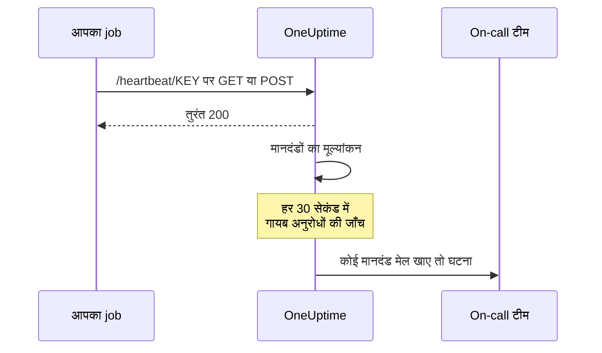
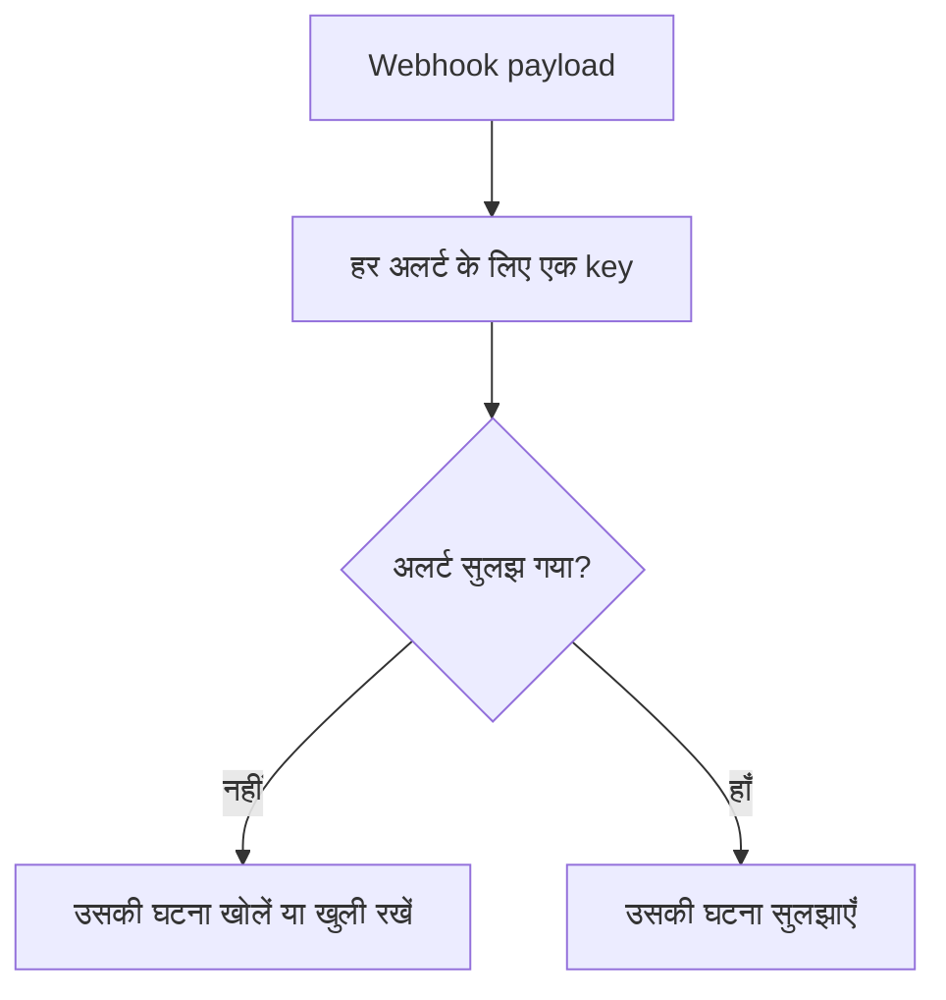

# आने वाले अनुरोध मॉनिटर

आने वाले अनुरोध मॉनिटर आपको एक URL देता है जिस पर दूसरे सिस्टम HTTP अनुरोध भेजते हैं। OneUptime हर अनुरोध को आपके मानदंडों पर परखता है, और मॉनिटर की स्थिति बदल सकता है, घटनाएँ घोषित कर सकता है, और आपकी on-call टीम को पेज कर सकता है।

यह दो अलग-अलग काम संभालता है:

- **Heartbeat निगरानी** — कोई cron job, worker या device तय शेड्यूल पर URL को ping करता है, और ping आना बंद होने पर OneUptime एक घटना खोलता है।
- **किसी दूसरे सिस्टम से अलर्ट प्राप्त करना** — Prometheus Alertmanager, Grafana, या कोई भी चीज़ जो JSON POST कर सके, अलर्ट भेजती है, और OneUptime हर एक को on-call escalation और ठीक होने पर अपने आप सुलझने वाली घटना में बदल देता है।

दोनों एक ही मॉनिटर प्रकार का उपयोग करते हैं। उन्हें अलग करते हैं वे मानदंड जो आप कॉन्फ़िगर करते हैं।

:::cards
- [मॉनिटर बनाएं](#आने-वाले-अनुरोध-मॉनिटर-बनाएं): कुछ ही कदमों में एक heartbeat URL पाएँ।
- [Heartbeat भेजें](#heartbeat-भेजें): curl, cron, Node.js, Python या Go से।
- [Ping रुकने पर अलर्ट](#10-मिनट-में-कोई-heartbeat-न-आने-पर-ऑफ़लाइन-चिह्नित-करें-एक-dead-mans-switch): मॉनिटर को dead-man's switch बनाएं।
- [अलर्ट प्राप्त करें](#किसी-दूसरे-सिस्टम-से-अलर्ट-प्राप्त-करना): हर Alertmanager या Grafana अलर्ट के लिए एक घटना।
:::

## यह कैसे काम करता है

बाहर से कुछ भी आपके सिस्टम की जाँच नहीं करता: आपका सिस्टम मॉनिटर के URL को कॉल करता है, OneUptime तुरंत जवाब देता है, और फिर मॉनिटर के मानदंडों पर अनुरोध को परखता है। जो मानदंड ऐसे अनुरोधों को देखता है जो आना *बंद* हो गए, उसकी हर 30 सेकंड में पृष्ठभूमि में फिर से जाँच होती है, ताकि खामोशी भी एक घटना खोल सके।



इसका उपयोग इनके लिए करें:

- cron jobs और scheduled tasks की निगरानी
- यह पुष्टि करना कि background workers चल रहे हैं
- firewalls के पीछे की उन सेवाओं की निगरानी जिन तक बाहर से नहीं पहुँचा जा सकता
- Prometheus Alertmanager, Grafana और दूसरे alerting सिस्टम से अलर्ट प्राप्त करना
- HTTP बोल सकने वाले किसी भी सिस्टम से heartbeat signals ट्रैक करना

## आने वाले अनुरोध मॉनिटर बनाएं

:::steps
### नया मॉनिटर शुरू करें

**मॉनिटर** पर जाएँ और **मॉनिटर बनाएं** पर क्लिक करें।

### Incoming Request चुनें

**मॉनिटर प्रकार** में **Incoming Request** चुनें — यह ऊपर दिए आम प्रकारों में से एक है। एक **नाम** दर्ज करें, फिर **अगला** पर क्लिक करें।

### मानदंडों की समीक्षा करें

**मानदंड** चरण [डिफ़ॉल्ट मानदंडों](#आपको-शुरुआत-में-क्या-मिलता-है) से शुरू होता है। Heartbeat के लिए **मानदंड जोड़ें** पर क्लिक करें और नए मानदंड को एक **Incoming Request** / **Not Recieved In Minutes** फ़िल्टर दें जो स्थिति को ऑफ़लाइन करे और एक घटना घोषित करे, और **घटना स्वतः सुलझाएं** चालू रखें। फिर उसे सूची में सबसे ऊपर खींचें — क्यों, यह [उदाहरण मानदंड](#उदाहरण-मानदंड) में देखें।

### मॉनिटर बनाएं

**मॉनिटर बनाएं** पर क्लिक करें। मॉनिटर अपने **अवलोकन** पेज पर खुलता है, जहाँ **Send the first heartbeat** कार्ड copy बटन के साथ **Heartbeat URL** और एक उदाहरण `curl` command दिखाता है।

### पहला अनुरोध भेजें

अपनी सेवा को उस URL पर अनुरोध भेजने के लिए कॉन्फ़िगर करें (देखें [Heartbeat भेजें](#heartbeat-भेजें))। पहला अनुरोध आने पर कार्ड मॉनिटर के इतिहास के लिए जगह छोड़ देता है, और एक **Heartbeat URL** कार्ड URL और पिछला अनुरोध कब आया, यह दिखाता है।
:::

> [!NOTE]
> URL में मॉनिटर की सीक्रेट कुंजी होती है, इसलिए केवल वे लोग इसे देख सकते हैं जो मॉनिटर संपादित कर सकते हैं। आप इसे कभी भी मॉनिटर के **दस्तावेज़ीकरण** पेज पर, उसके साइड मेन्यू के **कॉन्फ़िगरेशन** खंड में, फिर से पा सकते हैं।

## अनुरोध URL

आपके मॉनिटर का इस फ़ॉर्मेट में एक अनोखा URL है:

```text
https://oneuptime.com/heartbeat/YOUR_SECRET_KEY
```

Self-hosted होने पर `https://oneuptime.com` को अपने OneUptime instance के URL से बदलें।

इस URL पर **GET** या **POST** अनुरोध भेजें। HEAD स्वीकार किया जाता है और GET की तरह माना जाता है; PUT, PATCH और DELETE 404 लौटाते हैं। पथ में मौजूद सीक्रेट कुंजी ही एकमात्र क्रेडेंशियल है — कोई header या token ज़रूरी नहीं। Query strings अनदेखी की जाती हैं: मानदंडों को जो पढ़ना है, वह body या headers में भेजें।

> [!WARNING]
> जो भी यह URL जानता है, वह मॉनिटर को स्वस्थ चिह्नित कर सकता है, इसलिए इसे एक रहस्य की तरह रखें। अगर यह लीक हो जाए, तो मॉनिटर का **सेटिंग्स** पेज खोलें और **इनकमिंग अनुरोध सीक्रेट कुंजी रीसेट करें** पर क्लिक करें, फिर हर भेजने वाले को अपडेट करें। आपका भेजा हर header मॉनिटर पर संग्रहीत होता है और उसे पढ़ सकने वाले हर व्यक्ति को दिखता है — इस endpoint पर headers में API keys या tokens न भेजें।

> [!IMPORTANT]
> OneUptime तुरंत एक खाली JSON object (`{}`) के साथ `200` का जवाब देता है और अनुरोध को एक queue पर संसाधित करता है। यह जवाब किसी भी सत्यापन से पहले लिखा जाता है, इसलिए `200` इस बात की पुष्टि **नहीं** है कि अनुरोध स्वीकार हुआ — गलत सीक्रेट कुंजी, हटाया गया मॉनिटर और अक्षम मॉनिटर भी `200` लौटाते हैं। यह पुष्टि करने के लिए कि अनुरोध पहुँच रहे हैं, मॉनिटर की अपनी timeline देखें।

### अनुरोध body भेजना

अगर आप body के अंदर के fields को संबोधित करना चाहते हैं — घटना शीर्षक में `{{requestBody.status}}`, घटना समूहन में JSON पथ, या JavaScript expression वाला मानदंड — तो `Content-Type: application/json` भेजें। ये दस्तावेज़ हर जगह यही फ़ॉर्मेट मानकर चलते हैं। Body एक JSON object या array होनी चाहिए: गलत JSON, या `"error"` जैसा अकेला मान, `500` के साथ अस्वीकार होता है।

| Content type | मानदंड और टेम्पलेट क्या देखते हैं |
| --- | --- |
| `application/json` | Parse किया गया JSON। |
| `application/x-www-form-urlencoded` | Parse किया गया फ़ॉर्म। कोष्ठक वाली keys nest होती हैं (`alerts[0][status]=firing`), और हर मान एक string होता है। |
| कुछ और, या कुछ नहीं | खाली body (`{}`), इसलिए `requestBody` का हर संदर्भ कुछ नहीं देता। |

50 MB तक की bodies स्वीकार की जाती हैं; इससे बड़ी `413` के साथ अस्वीकार होती है। Body को `Content-Encoding: gzip` से compress न करें: तब वह JSON के रूप में संग्रहीत नहीं होती, और उसके अंदर के पथ हल नहीं होंगे।

### Heartbeat भेजें

हर उदाहरण एक अनुरोध भेजता है। `YOUR_SECRET_KEY` को अपने मॉनिटर के URL की कुंजी से बदलें।

:::tabs
@tab curl
```bash
# Simple GET request
curl https://oneuptime.com/heartbeat/YOUR_SECRET_KEY

# POST request with a JSON body
curl -X POST https://oneuptime.com/heartbeat/YOUR_SECRET_KEY \
  -H "Content-Type: application/json" \
  -d '{"status": "healthy", "version": "1.2.3"}'
```
@tab Cron
```bash
# Send a heartbeat every 5 minutes
*/5 * * * * curl -fsS https://oneuptime.com/heartbeat/YOUR_SECRET_KEY > /dev/null

# Or ping only when the job succeeds, so a failed run counts as a missed heartbeat
0 2 * * * /usr/local/bin/backup.sh && curl -fsS https://oneuptime.com/heartbeat/YOUR_SECRET_KEY > /dev/null
```
@tab Node.js
```javascript title="heartbeat.mjs"
// Node.js 18 or later: fetch is built in. Run with `node heartbeat.mjs`.
const response = await fetch(
  "https://oneuptime.com/heartbeat/YOUR_SECRET_KEY",
  {
    method: "POST",
    headers: { "Content-Type": "application/json" },
    body: JSON.stringify({ status: "healthy", version: "1.2.3" }),
  },
);

console.log(response.status); // 200
```
@tab Python
```python title="heartbeat.py"
# Python 3, standard library only. Run with `python3 heartbeat.py`.
import json
import urllib.request

request = urllib.request.Request(
    "https://oneuptime.com/heartbeat/YOUR_SECRET_KEY",
    data=json.dumps({"status": "healthy", "version": "1.2.3"}).encode(),
    headers={"Content-Type": "application/json"},
    method="POST",
)

with urllib.request.urlopen(request, timeout=10) as response:
    print(response.status)  # 200
```
@tab Go
```go title="heartbeat.go"
// Run with `go run heartbeat.go`.
package main

import (
	"bytes"
	"fmt"
	"net/http"
)

func main() {
	body := []byte(`{"status": "healthy", "version": "1.2.3"}`)

	resp, err := http.Post(
		"https://oneuptime.com/heartbeat/YOUR_SECRET_KEY",
		"application/json",
		bytes.NewReader(body),
	)
	if err != nil {
		panic(err)
	}
	defer resp.Body.Close()

	fmt.Println(resp.StatusCode) // 200
}
```
@tab PowerShell
```powershell
# Windows PowerShell 5.1 or PowerShell 7
Invoke-RestMethod -Method Post `
  -Uri "https://oneuptime.com/heartbeat/YOUR_SECRET_KEY" `
  -ContentType "application/json" `
  -Body '{"status": "healthy", "version": "1.2.3"}'
```
:::

## निगरानी मानदंड

आप यह तय करने के लिए मानदंड कॉन्फ़िगर कर सकते हैं कि आपकी सेवा कब ऑनलाइन, प्रदर्शन में गिरावट वाली या ऑफ़लाइन मानी जाए। हर मानदंड फ़िल्टर में एक **फ़िल्टर प्रकार** (क्या देखना है), एक **फ़िल्टर शर्त** (तुलना कैसे करनी है) और एक **मान** होता है।

### आपको शुरुआत में क्या मिलता है

नया आने वाले अनुरोध मॉनिटर दो मानदंडों के साथ बनता है जो अनुरोध body पढ़ते हैं:

| मानदंड | फ़िल्टर प्रकार | फ़िल्टर शर्त | मान | प्रभाव |
| -------- | ------------ | ---------------- | ------- | -------------------------------------------- |
| Offline  | अनुरोध बॉडी | शामिल है | `error` | मॉनिटर को ऑफ़लाइन चिह्नित करता है, एक घटना खोलता है |
| Online   | अनुरोध बॉडी | Not Contains | `error` | मॉनिटर को ऑनलाइन चिह्नित करता है |

यह उस आम स्थिति के लिए ठीक है जहाँ भेजने वाला payload में अपनी सेहत खुद बताता है: जिस अनुरोध की body में `error` का ज़िक्र हो, वह मॉनिटर को डाउन कर देता है, और उसके बिना अगला अनुरोध मॉनिटर को फिर ऊपर लाता है और घटना सुलझा देता है। बिना body वाला अनुरोध "`error` शामिल नहीं" माना जाता है, इसलिए एक सादा heartbeat ping मॉनिटर को ऑनलाइन रखता है।

मान को वह बना दें जो आपका भेजने वाला वास्तव में भेजता है (`"status":"firing"`, `FAILED` वगैरह) — मिलान पूरी body पर, keys सहित, case-sensitive substring खोज है, इसलिए `{"error":null}` भी `error` से मेल खाता है।

> [!NOTE]
> ये डिफ़ॉल्ट dead-man's switch **नहीं** हैं: अनुरोध आना बंद होने पर यहाँ कुछ भी trigger नहीं होता। अगर आप खामोशी पर अलर्ट चाहते हैं, तो नीचे बताए अनुसार एक **Incoming Request** / **Not Recieved In Minutes** मानदंड जोड़ें।

### उपलब्ध फ़िल्टर प्रकार

| फ़िल्टर प्रकार | जाँचता है | टिप्पणियाँ |
| --------------------- | ------------------------------------------------------ | -------------------------------------------------------------------------------------------- |
| Incoming Request | क्या किसी समय सीमा के भीतर कोई अनुरोध मिला | एकमात्र जाँच जो कुछ न आने पर trigger हो सकती है |
| अनुरोध बॉडी | अनुरोध की body | Substring मिलान। Object bodies की तुलना compact JSON के रूप में होती है |
| Request Header | अनुरोध headers के नाम | पूरे header नाम से सटीक मिलान, case को अनदेखा करते हुए |
| Request Header Value | अनुरोध headers के मान | पूरे header मान से सटीक मिलान, case को अनदेखा करते हुए |
| JavaScript Expression | `requestBody` और `requestHeaders` पर कोई भी expression | सबसे लचीला विकल्प — देखें [JavaScript अभिव्यक्तियाँ](/docs/monitor/javascript-expression) |

### फ़िल्टर शर्तें

हर फ़िल्टर प्रकार की अपनी शर्तें होती हैं:

| फ़िल्टर प्रकार | शर्तें |
| --- | --- |
| **Incoming Request** | **Recieved In Minutes** — तय मिनटों के भीतर एक अनुरोध मिला। **Not Recieved In Minutes** — तय मिनटों के भीतर कोई अनुरोध नहीं मिला। (Dashboard इन्हें ऐसे ही लिखता है।) |
| **अनुरोध बॉडी**, **Request Header**, **Request Header Value** | **शामिल है** और **Not Contains** |
| **JavaScript Expression** | **Evaluates To True** |

> [!NOTE]
> Header नाम और मान lower case में, पूरे नाम या मान से, तुलना किए जाते हैं, substring के रूप में नहीं: `application/json` `application/json; charset=utf-8` से मेल नहीं खाता। केवल **अनुरोध बॉडी** substring मिलान करता है। आपके proxy या OneUptime के अपने load balancer द्वारा जोड़े गए headers (`x-forwarded-for`, `x-real-ip`) भी संग्रहीत होते हैं।

Object bodies की तुलना बिना spaces वाले compact JSON के रूप में होती है, इसलिए **अनुरोध बॉडी** / **शामिल है** फ़िल्टर को `"status":"firing"` लिखा जाना चाहिए — pretty-printed payload से `"status": "firing"` कॉपी करने पर कभी मेल नहीं होगा।

### उदाहरण मानदंड

#### 10 मिनट में कोई heartbeat न आने पर ऑफ़लाइन चिह्नित करें (एक dead-man's switch)

| Field | मान |
| --- | --- |
| **फ़िल्टर प्रकार** | Incoming Request |
| **फ़िल्टर शर्त** | Not Recieved In Minutes |
| **मान** | `10` |

#### अनुरोध body की सामग्री के आधार पर प्रदर्शन में गिरावट चिह्नित करें

| Field | मान |
| --- | --- |
| **फ़िल्टर प्रकार** | अनुरोध बॉडी |
| **फ़िल्टर शर्त** | शामिल है |
| **मान** | `"status":"degraded"` |

> [!IMPORTANT]
> Dead-man's switch को डिफ़ॉल्ट मानदंडों के **ऊपर** रखें। मानदंड ऊपर से जाँचे जाते हैं, और जो पहले मेल खाए वही तय करता है। पृष्ठभूमि जाँच पिछला अनुरोध फिर से पढ़ती है, इसलिए डिफ़ॉल्ट ऑनलाइन मानदंड — "Request Body Not Contains `error`" — उससे मेल खाता रहता है, और उसके नीचे वाले मानदंड की बारी कभी नहीं आती। **मानदंड जोड़ें** सबसे नीचे एक मानदंड जोड़ता है: उसे ऊपर खींचें।

> [!WARNING]
> किसी मॉनिटर का पृष्ठभूमि में फिर से मूल्यांकन तभी होता है जब उसका कम से कम एक मानदंड **Incoming Request** जाँचता हो। जिस मॉनिटर के मानदंड केवल अनुरोध बॉडी, Request Header या JavaScript expression जाँचते हैं, उसका मूल्यांकन तभी होता है जब कोई अनुरोध आता है, और किसी और समय नहीं — इसलिए वह कभी अपने आप ऑफ़लाइन नहीं हो सकता। अगर आपको गायब heartbeat का alarm चाहिए, तो आपको एक **Incoming Request** मानदंड चाहिए।

पृष्ठभूमि जाँच पूरे मिनट गिनती है और मान से *ज़्यादा* समय बीतते ही trigger होती है: "Not Recieved In Minutes: 10" पिछले अनुरोध के लगभग 11 मिनट बाद trigger होता है (जाँच हर 30 सेकंड चलती है)। जिस मॉनिटर को कभी कोई अनुरोध नहीं मिला, उसके बनने के समय को ही पिछला अनुरोध माना जाता है, इसलिए बिल्कुल नए मॉनिटर पर वही मानदंड उसे बनाने के लगभग 11 मिनट बाद trigger होता है, भले भेजने वाला कभी जोड़ा ही न गया हो। मान में केवल वे मिनट गिने जाते हैं जब OneUptime डेटा ले रहा था: जिन मिनटों में OneUptime खुद restart, upgrade या बकाया काम पूरा कर रहा होता है, वे नहीं गिने जाते, जैसा [जब OneUptime डेटा प्राप्त नहीं कर रहा हो](/docs/monitor/when-oneuptime-is-not-receiving) बताता है।

## किसी दूसरे सिस्टम से अलर्ट प्राप्त करना

Alertmanager, Grafana और ऐसे ही टूल एक या अधिक अलर्ट का वर्णन करने वाला JSON दस्तावेज़ POST करते हैं। डिफ़ॉल्ट रूप से एक मानदंड **एक** घटना खोलता है, इसलिए पाँच अलर्ट वाला payload एक ही घटना बनाएगा। घटना समूहन इसे बदल देता है: यह payload से एक मान निकालता है और **हर अलग मान के लिए एक अलग घटना** खोलता है, जो सब एक साथ खुली रह सकती हैं।



### घटना समूहन चालू करना

:::steps
1. मानदंड खोलें और **सेटिंग्स** को फैलाएँ।
2. **Group incidents and alerts by a payload field** चालू करें।
3. **Open a separate incident for each…** भरें। हर घटना अपने आप सुलझे, इसके लिए **Auto-resolve each incident when…** के नीचे field और मान भी भरें (नीचे देखें)। फिर मॉनिटर सहेजें।
:::

| Field | उदाहरण | यह क्या करता है |
| ---------------------------------- | ---------------------------------------- | ---------------------------------------------------------------------- |
| Open a separate incident for each… | `requestBody.alerts[*].labels.alertname` | वह पथ जिसके अलग-अलग मान घटनाओं को अलग करते हैं |
| Field that signals recovery | `requestBody.alerts[*].status` | वह पथ जिसकी जाँच यह तय करने के लिए होती है कि अलर्ट ठीक हो गया |
| Value that means recovered | `resolved` | वह सटीक मान जो ठीक होने का संकेत है |
| Max incidents per request | `100` (डिफ़ॉल्ट) | सुरक्षा सीमा, ताकि बहुत सारे मानों वाला field अनगिनत घटनाएँ न खोल सके |

### पथ का syntax

पथ शाब्दिक उपसर्ग `requestBody.` से शुरू होने चाहिए। इसके बिना वाला पथ — `alerts[*].labels.alertname` — चुपचाप किसी से मेल नहीं खाता। `{{ }}` wrapper वैकल्पिक है: `requestBody.status` और `{{requestBody.status}}` एक जैसे व्यवहार करते हैं।

- `[*]` एक array पर फैलता है — हर **अलग** मान के लिए एक घटना। एक जैसा मान देने वाले दो elements एक घटना में मिल जाते हैं, और उस घटना की स्थिति (सक्रिय/सुलझी) **पहले** मेल खाने वाले element से ली जाती है। **किसी पथ में केवल पहला `[*]` wildcard है**; `requestBody.groups[*].alerts[*].name` किसी से मेल नहीं खाता।
- `[0]` और `[last]` एक element चुनते हैं, और `[*]` के बाद आ सकते हैं।
- Object और array मान, खाली strings और nulls छोड़ दिए जाते हैं। `0` और `false` मान्य keys हैं।
- Body एक JSON object होनी चाहिए; जिस payload का सबसे ऊपरी स्तर array हो, उसका समूहन नहीं होता।

### सुलझाना events पर आधारित है

एक webhook केवल वही बताता है जो उस payload में है, इसलिए OneUptime किसी घटना को इस वजह से कभी नहीं सुलझाता कि उसकी key दिखना बंद हो गई। कोई घटना तभी सुलझती है जब कोई payload स्पष्ट रूप से कहे कि वह key ठीक हो गई। दोनों बातें सच होनी चाहिए:

1. **Field that signals recovery** और **Value that means recovered** भरे हों, और payload से मेल खाएँ। तुलना सटीक और case-sensitive है — `Resolved` `resolved` से मेल नहीं खाता।
2. मानदंड की घटना पर, घटना फ़ॉर्म में **और फ़ील्ड** के अंतर्गत, **घटना स्वतः सुलझाएं** चालू हो। इसके बिना मेल खाने वाले recovery events अनदेखे किए जाते हैं और घटनाएँ खुली रहती हैं। (अलर्ट और **अलर्ट स्वतः सुलझाएं** पर भी यही लागू होता है।) डिफ़ॉल्ट ऑफ़लाइन मानदंड में यह शुरू से चालू रहता है; किसी मानदंड में खुद जोड़ी गई घटना में यह शुरू में बंद रहता है।

**Max incidents per request** केवल बनाने को नहीं, निकालने को भी सीमित करता है। सीमा से आगे की keys recovery को भी नहीं दिखतीं, इसलिए सीमा से ज़्यादा अलग keys वाले payload में, सीमा से आगे `resolved` बताने वाला अलर्ट अपनी घटना बंद नहीं करेगा।

> [!NOTE]
> जब किसी मॉनिटर को अनुरोध OneUptime के उनका मूल्यांकन करने से तेज़ी से मिलते हैं, तो वह सबसे नए का मूल्यांकन करता है और बीच वालों को छोड़ देता है, इसलिए webhooks की बौछार किसी सक्रिय या सुलझे अलर्ट को बिना मूल्यांकन के छोड़ सकती है। Self-hosted सर्वर पर OneUptime ऐप के environment में `INCOMING_REQUEST_INGEST_COALESCE_ENABLED=false` सेट करने से हर अनुरोध का अलग से मूल्यांकन होता है।

> [!WARNING]
> अगर **Field that signals recovery** में `[*]` है लेकिन **Open a separate incident for each…** में नहीं, तो कभी कुछ नहीं सुलझेगा। या तो दोनों में `[*]` का उपयोग करें, या किसी में नहीं। बिना `[*]` वाला recovery पथ पूरे payload पर मूल्यांकित होता है, इसलिए payload-स्तर का `status: resolved` उस payload की हर key को सुलझा देता है — उन अलर्ट को भी जिनकी अपनी स्थिति अभी सक्रिय है।

### घटनाओं के नाम

समूहन key घटना और अलर्ट टेम्पलेट को **पथ के अंतिम खंड** के नाम वाले वेरिएबल के रूप में मिलती है:

| पथ | वेरिएबल |
| ---------------------------------------- | ----------------- |
| `requestBody.alerts[*].labels.alertname` | `{{alertname}}`   |
| `requestBody.alerts[*].fingerprint`      | `{{fingerprint}}` |
| `requestBody.commonLabels.severity`      | `{{severity}}`    |

पूरा payload भी साथ में उपलब्ध है, इसलिए `{{alertname}}` वाला घटना शीर्षक और `{{requestBody.commonAnnotations.summary}}` का संदर्भ देने वाला विवरण, दोनों काम करते हैं। देखें [घटना और अलर्ट टेम्पलेट](/docs/monitor/incident-alert-templating)।

> [!WARNING]
> वेरिएबल का नाम उस पहचान का हिस्सा है जिससे OneUptime किसी recovery event को खुली घटना से मिलाता है। समूहन पथ को किसी अलग अंतिम खंड वाले पथ में बदलने से पुराने पथ के तहत खुली हर घटना अनाथ हो जाती है — उन्हें अब अपने आप नहीं सुलझाया जा सकता और हाथ से बंद करना होगा।

`[*]` **केवल** दो समूहन पथ fields में काम करता है। दूसरी जगहों पर यह हल नहीं होता, और हल न हुआ placeholder खाली किए जाने के बजाय **जैसा का तैसा** छपता है — `{{requestBody.alerts[*].labels.alertname}}` वाला शीर्षक braces के साथ ही दिखता है। `{{requestBody.alerts[0].annotations.summary}}` वाला शीर्षक हल होता है, लेकिन हमेशा payload का पहला अलर्ट पढ़ता है, वह नहीं जिसके लिए यह घटना खुली। समूहन वेरिएबल और payload के साझा `commonAnnotations` fields को प्राथमिकता दें।

### पूरा उदाहरण

पूरे Alertmanager कॉन्फ़िगरेशन के लिए देखें [Prometheus Alertmanager](/docs/integrations/prometheus-alertmanager)। Grafana के लिए देखें [Grafana](/docs/integrations/grafana)।

## सर्वोत्तम प्रथाएँ

1. **समय सीमा उचित रखें** — अगर आपका cron job हर 5 मिनट चलता है, तो कभी-कभार की देरी के लिए "Not Recieved In Minutes" सीमा 10–15 मिनट रखें, और उस मानदंड को सबसे पहले रखें।
2. **सार्थक डेटा शामिल करें** — अनुरोध body में स्थिति की जानकारी भेजें ताकि आप बारीक मानदंड सेट कर सकें।
3. **`Content-Type: application/json` के साथ POST का उपयोग करें** — body के अंदर पढ़ने वाली हर चीज़ इसी पर निर्भर है।
4. **दोनों कामों को एक मॉनिटर पर न मिलाएँ** — event-driven अलर्ट पाने वाले मॉनिटर की कोई नियमित लय नहीं होती, इसलिए उस पर "Not Recieved In Minutes" मानदंड बार-बार बदलता रहेगा। Dead-man's switch के लिए अलग मॉनिटर का उपयोग करें।
5. **मॉनिटर की भी निगरानी करें** — सुनिश्चित करें कि अनुरोध भेजने वाली सेवा त्रुटियों को ठीक से संभाले, ताकि विफल अनुरोध नज़रअंदाज़ न हों।

## समस्या निवारण

:::details मेरे भेजने वाले को 200 मिलता है, लेकिन मॉनिटर पर कुछ नहीं दिखता
`200` अनुरोध के सत्यापन से पहले भेजा जाता है, इसलिए यह साबित नहीं करता कि अनुरोध स्वीकार हुआ। जाँचें कि URL की सीक्रेट कुंजी मॉनिटर के **Heartbeat URL** से मेल खाती है, और मॉनिटर अक्षम नहीं है। फिर मॉनिटर की timeline में देखें कि अनुरोध पहुँच रहे हैं या नहीं।
:::

:::details Heartbeats रुकने पर भी मॉनिटर कभी ऑफ़लाइन नहीं होता
केवल **Incoming Request** मानदंड (**Not Recieved In Minutes**) खामोशी पकड़ सकता है। अगर नहीं है तो एक जोड़ें, और उसे डिफ़ॉल्ट मानदंडों के ऊपर खींचें: डिफ़ॉल्ट ऑनलाइन मानदंड हर पृष्ठभूमि जाँच पर पिछले अनुरोध से मेल खाता है, और जो मानदंड पहले मेल खाए वही तय करता है।
:::

:::details अनुरोध बॉडी फ़िल्टर कभी मेल नहीं खाता
`Content-Type: application/json` भेजें, और मान को compact JSON के रूप में लिखें — `"status":"firing"`, colon के बाद कोई space नहीं। JSON या form content type के बिना body parse नहीं होती।
:::

:::details Request Header फ़िल्टर कभी मेल नहीं खाता
Header नाम और मान पूरे-पूरे तुलना किए जाते हैं। उसका कोई हिस्सा नहीं, पूरा मान दें, जैसे `application/json; charset=utf-8`।
:::

:::details भेजने वाले को 500 मिलता है
अनुरोध `Content-Type: application/json` कहता है, लेकिन उसकी body JSON object या array नहीं है। मान्य JSON भेजें, या कोई दूसरा content type।
:::

## अगले कदम

:::cards
- [Prometheus Alertmanager](/docs/integrations/prometheus-alertmanager): आने वाले अलर्ट का पूरा सेटअप।
- [Grafana](/docs/integrations/grafana): यही, Grafana अलर्ट के लिए।
- [घटना और अलर्ट टेम्पलेट](/docs/monitor/incident-alert-templating): शीर्षकों और विवरणों में उपलब्ध हर वेरिएबल।
- [JavaScript अभिव्यक्तियाँ](/docs/monitor/javascript-expression): Expression syntax और उद्धरण के नियम।
:::
