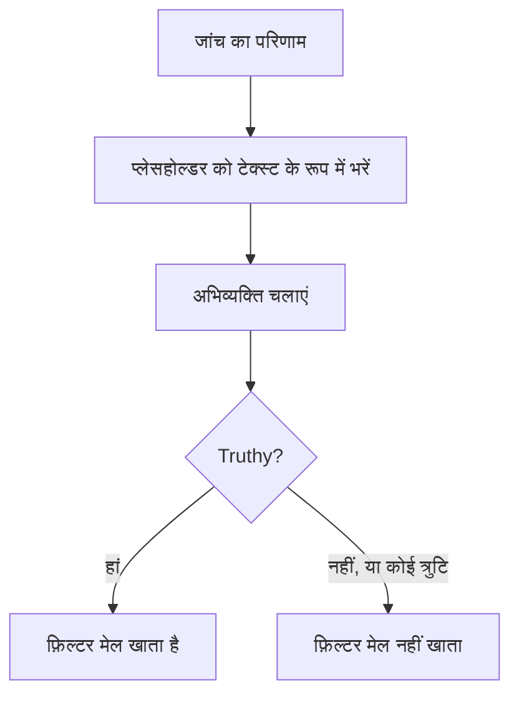

# JavaScript अभिव्यक्तियाँ

**JavaScript Expression** मानदंड फ़िल्टर किसी तय तुलना की जगह JavaScript की एक पंक्ति से तय करता है कि मॉनिटर का मानदंड पूरा हुआ या नहीं। इसका उपयोग तब करें जब बिल्ट-इन फ़िल्टर शर्त को व्यक्त न कर सकें — JSON जवाब के भीतर गहराई में कोई फ़ील्ड, आपस में तुलना किए जाने वाले दो मान, या `&&` और `||` से जोड़ी गई कई जांचें।

:::cards
- [यह कैसे काम करता है](#यह-कैसे-काम-करता-है): प्लेसहोल्डर भरे जाते हैं, फिर अभिव्यक्ति चलती है।
- [वेरिएबल](#मॉनिटर-प्रकार-के-अनुसार-वेरिएबल): हर मॉनिटर प्रकार आपको क्या देता है।
- [उदाहरण](#उदाहरण): API, आने वाले अनुरोधों और डेटाबेस के लिए अभिव्यक्तियाँ।
- [उद्धरण चिह्नों के नियम](#उद्धरण-चिह्नों-के-नियम): वह गलती जो लगभग हर कोई करता है।
:::

## यह कैसे काम करता है

अभिव्यक्ति चलने से पहले उसमें मौजूद हर `{{variable}}` प्लेसहोल्डर को मॉनिटर की सबसे नई जांच के मान से बदल दिया जाता है — सादे टेक्स्ट के रूप में। फिर नतीजे को JavaScript के रूप में चलाया जाता है। अगर उसका मान truthy निकलता है, तो फ़िल्टर मेल खाता है; बाकी कुछ भी, किसी त्रुटि समेत, यानी मेल नहीं खाता।



क्योंकि प्लेसहोल्डर टेक्स्ट के रूप में बदले जाते हैं, `{{responseBody.item}}` कच्चा मान बन जाता है। किसी स्ट्रिंग को JavaScript स्ट्रिंग बनने के लिए उद्धरण चिह्नों में होना चाहिए; किसी संख्या या boolean को नहीं — [उद्धरण चिह्नों के नियम](#उद्धरण-चिह्नों-के-नियम) देखें। अभिव्यक्तियाँ OneUptime सर्वर पर एक अलग-थलग सैंडबॉक्स में चलती हैं।

## JavaScript Expression फ़िल्टर जोड़ें

:::steps
### मानदंड खोलें

मॉनिटर पर **कॉन्फ़िगरेशन → मानदंड** खोलें और **निगरानी मानदंड संपादित करें** पर क्लिक करें, या **मॉनिटर बनाएं** के **मानदंड** चरण का उपयोग करें। जिस मानदंड को बदलना है उसमें काम करें, या नए के लिए **मानदंड जोड़ें** पर क्लिक करें।

### फ़िल्टर जोड़ें

**फ़िल्टर** के नीचे **फ़िल्टर जोड़ें** पर क्लिक करें, और उसका **फ़िल्टर प्रकार** **JavaScript Expression** पर सेट करें। **फ़िल्टर शर्त** **Evaluates To True** होती है।

### अभिव्यक्ति लिखें

[मॉनिटर के प्रकार के वेरिएबल](#मॉनिटर-प्रकार-के-अनुसार-वेरिएबल) का उपयोग करते हुए **मान** में अभिव्यक्ति डालें। फ़िल्टर के नीचे का लिंक, **Read documentation for using JavaScript expressions here.**, यही पेज खोलता है।

### सहेजें

मॉनिटर सहेजें। फ़िल्टर का मूल्यांकन मॉनिटर की अगली जांच में होता है।
:::

## मॉनिटर प्रकार के अनुसार वेरिएबल

JavaScript अभिव्यक्तियाँ Website, API, Incoming Request, Incoming Email, SQL Query और Database Health मॉनिटर के लिए उपलब्ध हैं।

### वेबसाइट और API मॉनिटर

| वेरिएबल | विवरण | प्रकार |
| --- | --- | --- |
| `responseBody` | जवाब की बॉडी। अगर बॉडी JSON है, तो उसे पार्स किया जाता है; नहीं तो, जैसे HTML या XML के लिए, यह एक स्ट्रिंग है। | `string` या `JSON` |
| `responseHeaders` | जवाब के हेडर, छोटे अक्षरों वाले नामों के साथ। | `Dictionary<string>` |
| `responseStatusCode` | जवाब का स्टेटस कोड। | `number` |
| `responseTimeInMs` | मिलीसेकंड में प्रतिक्रिया समय। | `number` |
| `isOnline` | क्या मॉनिटर जवाब को ऑनलाइन गिनता है। | `boolean` |

### आने वाले अनुरोध मॉनिटर

| वेरिएबल | विवरण | प्रकार |
| --- | --- | --- |
| `requestBody` | अनुरोध की बॉडी। | `string` या `JSON` |
| `requestHeaders` | अनुरोध के हेडर, छोटे अक्षरों वाले नामों के साथ। | `Dictionary<string>` |

### SQL क्वेरी मॉनिटर

| वेरिएबल | विवरण | प्रकार |
| --- | --- | --- |
| `rowCount` | क्वेरी से लौटी पंक्तियों की संख्या। | `number` |
| `scalarValue` | पहली पंक्ति का पहला कॉलम। | कोई भी |
| `firstRow` | पहली पंक्ति, कॉलम/मान जोड़ों के रूप में। | `JSON` |
| `executionTimeInMs` | क्वेरी में कितना समय लगा, मिलीसेकंड में। | `number` |
| `queryError` | क्वेरी की त्रुटि, अगर कोई थी। | `string` |
| `isOnline` | क्या डेटाबेस तक पहुंचा जा सका और क्वेरी सफल हुई। | `boolean` |

### डेटाबेस हेल्थ मॉनिटर

`isOnline`, `engineVersion`, `connectionError`, `collectedGroups`, `unavailableGroups` और `metrics`। डेटाबेस हेल्थ मॉनिटर पेज पर [JavaScript अभिव्यक्ति के वेरिएबल](/docs/monitor/database-health-monitor#javascript-एक्सप्रेशन-वेरिएबल) देखें।

### आने वाले ईमेल मॉनिटर

फ़िल्टर उपलब्ध है, पर इससे कोई ईमेल फ़ील्ड नहीं जुड़ा है: कोई अभिव्यक्ति विषय, भेजने वाला, बॉडी या पाने वाला नहीं पढ़ सकती। इसकी जगह ईमेल फ़िल्टर प्रकारों का उपयोग करें — [आने वाले ईमेल मॉनिटर](/docs/monitor/incoming-email-monitor#उपलब्ध-criteria-fields) देखें।

## उदाहरण

नीचे की हर पंक्ति एक पूरी अभिव्यक्ति है। इस तरह की JSON जवाब बॉडी के लिए:

```json
{
  "item": "hello",
  "count": 3,
  "items": [{ "name": "hello" }]
}
```

| अभिव्यक्ति | कब मेल खाती है |
| --- | --- |
| `"{{responseBody.item}}" === "hello"` | `item` फ़ील्ड `hello` है। |
| `{{responseBody.count}} > 2` | `count` फ़ील्ड 2 से ज़्यादा है। |
| `"{{responseBody.items[0].name}}" === "hello"` | `items` के पहले तत्व का नाम `hello` है। |
| `{{responseStatusCode}} === 200 && {{responseTimeInMs}} < 500` | स्टेटस 200 है और जवाब में आधे सेकंड से कम लगा। |
| `/hel+o/.test("{{responseBody.item}}")` | `item` फ़ील्ड किसी रेगुलर एक्सप्रेशन से मेल खाता है। |
| `"{{responseHeaders.content-type}}".startsWith("application/json")` | जवाब JSON है। हेडर के नाम छोटे अक्षरों में होते हैं। |

शर्तों को `&&` और `||` से जोड़ें, और कोष्ठकों से समूह बनाएं:

```javascript
({{responseStatusCode}} === 200 || {{responseStatusCode}} === 204) && {{responseTimeInMs}} < 1000
```

ऐसे आने वाले अनुरोध मॉनिटर के लिए जिसे `Content-Type: application/json` के रूप में `{"status": "degraded", "region": "eu"}` मिलता है:

```javascript
"{{requestBody.status}}" === "degraded" && "{{requestBody.region}}" === "eu"
```

ऐसे SQL क्वेरी मॉनिटर के लिए जिसकी क्वेरी एक गिनती लौटाती है, ज़्यादा गिनती या धीमी क्वेरी पर अलर्ट करें:

```javascript
{{scalarValue}} > 50 || {{executionTimeInMs}} > 2000
```

डेटाबेस हेल्थ मॉनिटर के लिए, पूरे `metrics` ऑब्जेक्ट में इंडेक्स करके एक मेट्रिक पढ़ें — सीरीज़ के नामों में बिंदु होते हैं, इसलिए वे ब्रेसेस के अंदर नहीं जा सकते:

```javascript
{{metrics}}['oneuptime.monitor.database.connections.used.percent'] > 90
```

## उद्धरण चिह्नों के नियम

`{{var}}` को मान से, टेक्स्ट के रूप में, बदला जाता है। किसी स्ट्रिंग की तुलना करने के लिए उसे उद्धरण चिह्नों में रखें, जैसे `"{{responseBody.item}}" === "hello"` में; किसी संख्या की तुलना करने के लिए उसे बिना उद्धरण चिह्नों के छोड़ें, जैसे `{{responseStatusCode}} === 200` में।

| मान का प्रकार | कैसे लिखें | उदाहरण |
| --- | --- | --- |
| स्ट्रिंग | उद्धरण चिह्नों में | `"{{responseBody.status}}" === "ok"` |
| संख्या | बिना उद्धरण चिह्नों के | `{{responseTimeInMs}} < 500` |
| Boolean | बिना उद्धरण चिह्नों के | `{{isOnline}} === true` |
| ऑब्जेक्ट या ऐरे | बिना उद्धरण चिह्नों के, फिर उसमें इंडेक्स करें | `{{responseHeaders}}['content-type']` |

तीन बातों का ध्यान रखें:

- **उद्धरण चिह्नों में अकेला प्लेसहोल्डर हमेशा सही होता है।** जब फ़ील्ड `false` हो, तब `"{{responseBody.healthy}}"` गैर-खाली स्ट्रिंग `"false"` होता है। इसकी तुलना करें: `"{{responseBody.healthy}}" === "true"`, या इसे बिना उद्धरण चिह्नों के छोड़ें: `{{responseBody.healthy}} === true`।
- **मान एस्केप नहीं किए जाते।** जिस मान में डबल कोट या लाइन ब्रेक हो, वह स्ट्रिंग को जल्दी खत्म कर देता है, और अभिव्यक्ति विफल हो जाती है। किसी HTML पेज में टेक्स्ट खोजने के लिए इसकी जगह **प्रतिक्रिया बॉडी** फ़िल्टर का उपयोग करें।
- **मौजूद न होने वाला पाथ वैसा ही रहता है जैसा लिखा गया।** अगर जांच में ऐसा कोई फ़ील्ड नहीं है, तो `{{responseBody.item}}` अभिव्यक्ति में जस का तस रह जाता है, जो आम तौर पर सिंटैक्स त्रुटि होती है — इसलिए फ़िल्टर मेल नहीं खाता।

## सीमाएं

किसी अभिव्यक्ति के पास चलने के लिए 5 सेकंड होते हैं। जो इससे ज़्यादा समय ले, या कोई त्रुटि फेंके, वह मेल नहीं खाती, और त्रुटि OneUptime सर्वर लॉग में लिखी जाती है।

## समस्या निवारण

:::details अभिव्यक्ति कभी मेल नहीं खाती
पहले उद्धरण चिह्न जांचें: बिना उद्धरण चिह्नों वाला स्ट्रिंग प्लेसहोल्डर एक अकेला शब्द बन जाता है, जो सिंटैक्स त्रुटि है, और त्रुटि कभी मेल नहीं खाती। फिर जांचें कि पाथ जांच के परिणाम में मौजूद है — जो पाथ मौजूद नहीं, उसका प्लेसहोल्डर भरा नहीं जाता।
:::

:::details अभिव्यक्ति हमेशा मेल खाती है
उद्धरण चिह्नों में अकेला प्लेसहोल्डर एक गैर-खाली स्ट्रिंग होता है, जो हमेशा truthy होती है। इसकी तुलना किसी मान से करें।
:::

## अगले कदम

:::cards
- [घटना और अलर्ट टेम्पलेट](/docs/monitor/incident-alert-templating): घटना के शीर्षकों और विवरणों में यही प्लेसहोल्डर इस्तेमाल करें।
- [API मॉनिटर](/docs/monitor/api-monitor): किसी HTTP एंडपॉइंट और उसके जवाब की जांच करें।
- [आने वाले अनुरोध मॉनिटर](/docs/monitor/incoming-request-monitor): दूसरे सिस्टम से आपको भेजे गए अनुरोधों का मूल्यांकन करें।
:::
