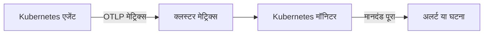

# Kubernetes मॉनिटर

Kubernetes मॉनिटर उन मेट्रिक्स पर अलर्ट देता है जिन्हें OneUptime Kubernetes एजेंट किसी क्लस्टर से भेजता है: नोड, पॉड, कंटेनर, वर्कलोड, ऑटोस्केलर और कंट्रोल प्लेन। किसी तैयार अलर्ट टेम्पलेट से शुरू करें, एक मेट्रिक चुनें या अपनी क्वेरी लिखें, फिर वह थ्रेशोल्ड सेट करें जो अलर्ट या घटना खोलता है।

:::cards
- [एजेंट इंस्टॉल करें](/docs/monitor/kubernetes-agent): एक Helm कमांड क्लस्टर को OneUptime में ले आता है।
- [मॉनिटर बनाएं](#kubernetes-मॉनिटर-बनाएं): क्लस्टर चुनें, फिर कोई टेम्पलेट, मेट्रिक या क्वेरी।
- [अलर्ट टेम्पलेट](#तैयार-अलर्ट-टेम्पलेट): सत्रह तैयार अलर्ट, CrashLoopBackOff से लेकर etcd तक।
- [मानदंड](#मॉनिटरिंग-मानदंड): स्थिर थ्रेशोल्ड और विसंगति पहचान।
:::

## यह कैसे काम करता है

एजेंट क्लस्टर के मेट्रिक्स को OTLP पर OneUptime भेजता है, हर एक पर क्लस्टर का नाम (`k8s.cluster.name`, चार्ट का `clusterName`) लगा होता है। किसी नए नाम से आया पहला डेटा क्लस्टर को **Kubernetes** के अंतर्गत पंजीकृत करता है, और उसके बाद क्लस्टर को Kubernetes मॉनिटर में चुना जा सकता है। हर मिनट मॉनिटर अपनी **समय सीमा** में उन मेट्रिक्स की क्वेरी करता है, उन्हें एकत्र करता है और परिणाम की तुलना अपने मानदंडों से करता है।

## शुरू करने से पहले

- क्लस्टर में OneUptime Kubernetes एजेंट चल रहा हो। [Kubernetes एजेंट (Helm स्थापना)](/docs/monitor/kubernetes-agent) देखें; इंस्टॉल के कुछ मिनट बाद क्लस्टर **Kubernetes** के अंतर्गत दिखने लगता है।
- कंट्रोल प्लेन टेम्पलेट (**etcd No Leader**, **API Server Request Saturation**, **Scheduler Backlog**) के लिए: एजेंट का कंट्रोल प्लेन स्क्रेप, `controlPlane.enabled`। प्रबंधित क्लस्टर (EKS, GKE, AKS) ये एंडपॉइंट उपलब्ध नहीं कराते, इसलिए वहाँ इन मॉनिटरों को कभी डेटा नहीं मिलता।

## Kubernetes मॉनिटर बनाएं

:::steps
### नया मॉनिटर शुरू करें

**मॉनिटर** पर जाएं और **मॉनिटर बनाएं** पर क्लिक करें। **और मॉनिटर प्रकार** के अंतर्गत **Kubernetes** चुनें – या खोज बॉक्स में `k8s` टाइप करें।

### क्लस्टर चुनें

इसे **Kubernetes क्लस्टर** में चुनें। सूची में हर वह क्लस्टर है जिससे एजेंट ने रिपोर्ट किया है।

### तय करें कि किस पर नज़र रखनी है

तीन टैब में से एक का उपयोग करें:

| टैब | आप क्या चुनते हैं |
| --- | --- |
| **Quick Setup** | एक [तैयार अलर्ट टेम्पलेट](#तैयार-अलर्ट-टेम्पलेट)। यह मेट्रिक, क्षेत्र, समय सीमा और मानदंड भर देता है; आप अब भी **समय सीमा** बदल सकते हैं। |
| **Custom Metric** | [मेट्रिक कैटलॉग](#मेट्रिक-कैटलॉग) से एक मेट्रिक, फिर उसका **संसाधन क्षेत्र**, फ़िल्टर, **एकत्रीकरण** (औसत, अधिकतम, न्यूनतम, योग या गणना) और **समय सीमा**। |
| **उन्नत** | **संसाधन क्षेत्र**, फ़िल्टर और **समय सीमा**, साथ में **मेट्रिक्स चुनें** के अंतर्गत आपकी अपनी मेट्रिक क्वेरी और सूत्र, परिणाम के लाइव चार्ट के साथ। |

### मानदंड सेट करें

तय करें कि मॉनिटर कब स्थिति बदलता है और कब अलर्ट या घटना खोलता है – [मॉनिटरिंग मानदंड](#मॉनिटरिंग-मानदंड) देखें। टेम्पलेट इन्हें पहले ही भर चुका है: थ्रेशोल्ड, गंभीरता और ऑन-कॉल नीतियों की समीक्षा करें।

### मॉनिटर सहेजें

फ़ॉर्म पूरा करें और सहेजें। मॉनिटर **मॉनिटर** के अंतर्गत दिखता है, और पहले मूल्यांकन से उसकी स्थिति आपके मानदंडों का पालन करती है।
:::

## कॉन्फ़िगरेशन विकल्प

### संसाधन क्षेत्र और फ़िल्टर

**संसाधन क्षेत्र** वह स्तर तय करता है जिस पर मेट्रिक का मूल्यांकन होता है, और यह भी कि फ़ॉर्म कौन से फ़िल्टर दिखाए। हर फ़िल्टर वैकल्पिक है।

| क्षेत्र | किस पर नज़र रखता है | फ़िल्टर |
| --- | --- | --- |
| क्लस्टर | पूरा क्लस्टर | — |
| नेमस्पेस | किसी नेमस्पेस के संसाधन | **नेमस्पेस** |
| वर्कलोड | कोई deployment, statefulset, daemonset, job या cronjob | **नेमस्पेस**, **वर्कलोड नाम** |
| नोड | क्लस्टर का एक नोड | **नोड नाम** |
| Pod | एक पॉड | **नेमस्पेस**, **पॉड नाम** |

### समय सीमा

**समय सीमा** वह विंडो है जिसे मॉनिटर के हर मूल्यांकन पर मेट्रिक क्वेरी कवर करती है, **Past 1 Minute** से लेकर **Past 365 Days** तक। छोटी विंडो (1 से 15 मिनट) अलर्ट के लिए उपयुक्त हैं; लंबी विंडो शोर वाले मेट्रिक्स को सहज बनाती हैं।

### मेट्रिक क्वेरी और सूत्र

**उन्नत** टैब पर हर क्वेरी एक मेट्रिक, उसके मानों को एकत्र करने का तरीका और वैकल्पिक एट्रिब्यूट फ़िल्टर बताती है। एक **सूत्र** क्वेरी को अंकगणित से जोड़ता है – उदाहरण के लिए, नोड उपयोग टेम्पलेट उपयोग को आवंटन-योग्य क्षमता से भाग देते हैं।

## मेट्रिक कैटलॉग

**Custom Metric** टैब संसाधन प्रकार के अनुसार समूहित ये मेट्रिक्स देता है:

| श्रेणी | मेट्रिक्स |
| --- | --- |
| Pod | Pod CPU Usage, Pod Memory Usage, Pod Phase (Code), Pod Filesystem Usage, Pod Memory Limit Utilization, Pod CPU Limit Utilization, Pod Network I/O (Cumulative, Both Directions) |
| नोड | Node CPU Usage, Node Allocatable CPU, Node Memory Usage, Node Filesystem Usage, Node Allocatable Memory, Node Ready Condition, Node Filesystem Available |
| कंटेनर | Container Restarts, Container CPU Limit, Container CPU Request, Container Memory Limit, Container Memory Request, Container Ready |
| वर्कलोड | Deployment Available Replicas, Deployment Desired Replicas, DaemonSet Misscheduled Nodes, DaemonSet Ready Nodes, StatefulSet Ready Replicas, Job Failed Pods, Job Successful Pods |
| HPA | HPA Current Replicas, HPA Desired Replicas, HPA Max Replicas, HPA Min Replicas |
| कंट्रोल प्लेन | etcd Has Leader, API Server In-Flight Requests, Scheduler Pending Pods |

> [!NOTE]
> **Pod CPU Usage** और **Node CPU Usage** कोर में हैं, प्रतिशत में नहीं: `0.18` का मतलब एक कोर का 0.18 है। **Pod Phase (Code)** एक कोड है (1 Pending, 2 Running, 3 Succeeded, 4 Failed, 5 Unknown) – इसे अधिकतम या न्यूनतम से एकत्र करें, योग से कभी नहीं। कंट्रोल प्लेन मेट्रिक्स तभी आते हैं जब एजेंट का कंट्रोल प्लेन स्क्रेप चालू हो।

## मॉनिटरिंग मानदंड

### किसका मूल्यांकन होता है

ये मॉनिटर हमेशा **Metric Value** का मूल्यांकन करते हैं – कॉन्फ़िगर की गई मेट्रिक क्वेरी या सूत्र का मान। मानदंड फ़ॉर्म में फ़िल्टर प्रकार चुनने का विकल्प नहीं है; यह **मीट्रिक**, **एकत्रीकरण**, **शर्त** और **Threshold** दिखाता है।

### एकत्रीकरण के प्रकार

| एकत्रीकरण | विवरण |
| --- | --- |
| औसत | समय विंडो में औसत मान |
| योग | सभी मानों का योग |
| Maximum Value | समय विंडो में सबसे ऊँचा मान |
| Minimum Value | समय विंडो में सबसे निचला मान |
| All Values | सभी मानों को मानदंड से मेल खाना चाहिए |
| Any Value | कम से कम एक मान को मेल खाना चाहिए |

### शर्तें

स्थिर थ्रेशोल्ड की तुलना आपके दर्ज किए **Threshold** से होती है: **Greater Than**, **Less Than**, **Greater Than Or Equal To**, **Less Than Or Equal To** और **Equal To**।

बेसलाइन पर आधारित विसंगति पहचान को थ्रेशोल्ड की ज़रूरत नहीं होती। इनमें से कोई शर्त चुनें, और फ़ॉर्म इसके बजाय **संवेदनशीलता** और **बेसलाइन विंडो** दिखाता है:

| शर्त | तब मेल खाती है जब मान |
| --- | --- |
| **Anomalously High** | अपेक्षित सीमा से ऊपर चला जाए |
| **Anomalously Low** | अपेक्षित सीमा से नीचे गिर जाए |
| **Anomalous** | किसी भी दिशा में अपेक्षित सीमा से बाहर निकल जाए |

हर नमूने की तुलना सप्ताह के उसी घंटे की बेसलाइन से होती है, जो **बेसलाइन विंडो** (डिफ़ॉल्ट 14 दिन; 28, 60 या 90 दिन) से बनती है। **संवेदनशीलता** तय करती है कि अपेक्षित सीमा कितनी चौड़ी है: **निम्न (4σ — केवल अत्यधिक विचलन)**, डिफ़ॉल्ट **मध्यम (3σ — अनुशंसित)**, या **उच्च (2σ — अधिक शोर वाली, बहुत स्थिर सेवाएँ)**। विसंगति शर्तें "Learning" स्थिति में रहती हैं और तब तक कोई अलर्ट नहीं देतीं जब तक कम से कम चुनी गई बेसलाइन विंडो जितना मेट्रिक इतिहास न हो जाए।

**और फ़ील्ड** के अंतर्गत **यदि कोई डेटा नहीं** तय करता है कि जब क्वेरी विंडो में कुछ नहीं लौटाती तब क्या हो: **Ignore** (डिफ़ॉल्ट) मेल नहीं खाता, **ट्रिगर** चुप्पी को ही समस्या मानता है, और **Treat As Zero** शून्य से तुलना करता है। जिस समय OneUptime खुद डेटा प्राप्त नहीं कर रहा था, वह कभी "कोई डेटा नहीं" नहीं माना जाता: जिस जाँच की विंडो में ऐसा समय हो, वह इसके बजाय प्रतीक्षा करती है, जैसा कि [जब OneUptime डेटा प्राप्त नहीं कर रहा हो](/docs/monitor/when-oneuptime-is-not-receiving) में बताया गया है।

## तैयार अलर्ट टेम्पलेट

**Quick Setup** टैब ये टेम्पलेट श्रेणी के अनुसार दिखाता है। हर टेम्पलेट दो मानदंड भरता है: एक जो शर्त बने रहने तक मॉनिटर को ऑफ़लाइन चिह्नित करता है और घटना व अलर्ट खोलता है, और दूसरा जो शर्त हटने पर उसे फिर से ऑनलाइन लाता है।

| टेम्पलेट | श्रेणी | कब ट्रिगर होता है | गंभीरता |
| --- | --- | --- | --- |
| CrashLoopBackOff Detection | वर्कलोड | किसी कंटेनर के पॉड बनने के बाद से वह 5 से अधिक बार रीस्टार्ट हुआ है | गंभीर |
| Pod Stuck in Pending | अनुसूचन | 15 मिनट की विंडो के हर नमूने में कोई पॉड Pending चरण में है | Warning |
| Node Not Ready | नोड | कोई नोड NotReady रिपोर्ट करता है | गंभीर |
| High Node CPU Utilization | नोड | किसी नोड का औसत CPU उपयोग उसके आवंटन-योग्य CPU के 90% से ऊपर है | Warning |
| High Node Memory Utilization | नोड | किसी नोड का औसत मेमोरी उपयोग उसकी आवंटन-योग्य मेमोरी के 85% से ऊपर है | Warning |
| Deployment Replica Mismatch | वर्कलोड | किसी deployment में 15 मिनट तक वांछित से कम उपलब्ध रेप्लिका हैं | Warning |
| Job Failures | वर्कलोड | किसी job में विफल पॉड हैं | Warning |
| etcd No Leader | कंट्रोल प्लेन | etcd का कोई चुना हुआ लीडर नहीं है | गंभीर |
| API Server Request Saturation | कंट्रोल प्लेन | API सर्वर पूरी विंडो के दौरान 200 या अधिक चल रहे अनुरोध रखता है | गंभीर |
| Scheduler Backlog | अनुसूचन | शेड्यूलर की लंबित पॉड कतार 5 मिनट तक खाली नहीं होती | Warning |
| High Node Disk Usage | स्टोरेज | किसी नोड का फ़ाइल सिस्टम 90% से अधिक भरा है | Warning |
| DaemonSet Misscheduled Nodes | वर्कलोड | कोई DaemonSet ऐसे नोड पर पॉड चलाता है जो अब उसके नोड सेलेक्टर, एफ़िनिटी या टॉलरेशन से मेल नहीं खाते | Warning |
| High Node CPU Request Commitment | नोड | किसी नोड के कंटेनरों के CPU अनुरोधों का योग उसके आवंटन-योग्य CPU के 90% से अधिक है | Warning |
| High Node Memory Request Commitment | नोड | किसी नोड के कंटेनरों के मेमोरी अनुरोधों का योग उसकी आवंटन-योग्य मेमोरी के 90% से अधिक है | Warning |
| HPA Saturated at Max Replicas | वर्कलोड | कोई HPA अपने `maxReplicas` के 90% या उससे अधिक पर चल रहा है | गंभीर |
| Pod Memory Saturating Container Limit | वर्कलोड | कोई पॉड अपनी कंटेनर मेमोरी सीमा का 90% से अधिक उपयोग करता है | गंभीर |
| Pod CPU Saturating Container Limit | वर्कलोड | कोई पॉड अपनी कंटेनर CPU सीमा का 90% से अधिक उपयोग करता है | Warning |

प्रति-ऑब्जेक्ट मेट्रिक्स पर बने टेम्पलेट हर नोड, पॉड, deployment, job, DaemonSet या HPA का अलग-अलग मूल्यांकन करते हैं, इसलिए कई अस्वस्थ पॉड वाले क्लस्टर को पूरे क्लस्टर के लिए एक के बजाय हर पॉड के लिए एक घटना मिलती है।

> [!NOTE]
> **CrashLoopBackOff Detection** कंटेनर के मौजूदा पॉड के लिए उसकी कुल रीस्टार्ट संख्या पढ़ता है, कोई दर नहीं। जो कंटेनर क्रैश-लूप में फँसकर फिर ठीक हो गया, वह अपने पॉड के बदले जाने तक अलर्ट को खुला रखता है।

### सिर्फ़ लक्षण नहीं, कारण पकड़ें

नोड-स्तर के टेम्पलेट (High Node CPU Utilization, High Node Memory Utilization, Node Not Ready, Pod Stuck in Pending) संसाधन समाप्ति की श्रृंखला के *अंत* में ट्रिगर होते हैं, जब क्लस्टर पहले से ही धीमा हो चुका होता है। तीन टेम्पलेट इसकी *शुरुआत* में ट्रिगर होते हैं, जहाँ आमतौर पर समाधान होता है:

- **Pod Memory Saturating Container Limit** और **Pod CPU Saturating Container Limit** ऐसे वर्कलोड को पकड़ते हैं जो अपनी ही सीमाओं से सटा हुआ है। मेमोरी सीमा पार करना तुरंत OOMKill है; CPU सीमा पार करने पर कर्नेल पॉड को थ्रॉटल करता है, जिससे वह बिना कोई त्रुटि दिए धीमा हो जाता है। दोनों CrashLoopBackOff और बिना कारण की लेटेंसी के आम कारण हैं।
- **HPA Saturated at Max Replicas** ऐसे ऑटोस्केलर को पकड़ता है जिसके पास कोई गुंजाइश नहीं बची। जिस वर्कलोड की प्रति-पॉड सीमाएँ बहुत कम हैं, वह थ्रॉटल होता है या मारा जाता है, जिससे वही मेट्रिक बढ़ता है जिस पर HPA स्केल करता है – इसलिए ऑटोस्केलर ऐसे रेप्लिका जोड़ता रहता है जो सभी उतने ही भूखे हैं, जब तक वह अपनी ऊपरी सीमा तक नहीं पहुँच जाता। सीमाएँ बढ़ाना समाधान है; `maxReplicas` बढ़ाना इसे और बिगाड़ता है।

किसी भी ऐसे नेमस्पेस में जहाँ ऑटोस्केल होने वाला वर्कलोड चलता है, इन्हें एक साथ चालू करें: यह संयोजन "सचमुच अधिक क्षमता चाहिए" को "प्रति पॉड कम संसाधन" से अलग पहचानता है।

> [!NOTE]
> दोनों पॉड-सीमा टेम्पलेट पॉड के उपयोग को उसके कंटेनरों की सीमाओं के **योग** से भाग देते हैं, इसलिए साइडकार वाले पॉड भी सही मापे जाते हैं। kubelet के पॉड मेमोरी आँकड़े में वापस पाया जा सकने वाला पेज कैश शामिल होता है, इसलिए फ़ाइलों का भारी उपयोग करने वाला वर्कलोड कभी OOMKill हुए बिना मेमोरी टेम्पलेट पर ऊँचा दिख सकता है: इसे "सीमा के करीब पहुँच रहा है" पढ़ें, "मारा जाने वाला है" नहीं।

## समस्या निवारण

:::details क्लस्टर Kubernetes क्लस्टर सूची में नहीं है
क्लस्टर एजेंट के डेटा से अपने आप पंजीकृत होते हैं, उसी `clusterName` के तहत जिससे एजेंट इंस्टॉल किया गया था। जाँचें कि एजेंट के पॉड चल रहे हैं और क्लस्टर **उत्पाद → बुनियादी ढांचा → Kubernetes → सभी क्लस्टर** के अंतर्गत दिख रहा है। [Kubernetes एजेंट (Helm स्थापना)](/docs/monitor/kubernetes-agent) इंस्टॉल और डेटा न आने पर क्या जाँचें, यह बताता है।
:::

:::details कंट्रोल प्लेन टेम्पलेट कभी ट्रिगर नहीं होता
**etcd No Leader**, **API Server Request Saturation** और **Scheduler Backlog** ऐसे मेट्रिक्स पढ़ते हैं जिन्हें सिर्फ़ एजेंट का कंट्रोल प्लेन स्क्रेप इकट्ठा करता है। एजेंट के Helm मानों में `controlPlane.enabled` चालू करें; यह डिफ़ॉल्ट रूप से बंद है। प्रबंधित क्लस्टर (EKS, GKE, AKS) ये एंडपॉइंट उपलब्ध नहीं कराते, इसलिए उन पर इन मॉनिटरों को कभी डेटा नहीं मिलता।
:::

:::details CPU थ्रेशोल्ड कभी ट्रिगर नहीं होता
**Pod CPU Usage** और **Node CPU Usage** कोर में हैं, प्रतिशत में नहीं, इसलिए `80` के थ्रेशोल्ड का मतलब 80 कोर है। थ्रेशोल्ड कोर में सेट करें, या **High Node CPU Utilization** या **Pod CPU Saturating Container Limit** से शुरू करें, जो प्रतिशत की तुलना करते हैं।
:::

:::details पॉड ठीक होने के बाद भी CrashLoopBackOff Detection खुला रहता है
टेम्पलेट कंटेनर के मौजूदा पॉड के लिए उसकी कुल रीस्टार्ट संख्या पढ़ता है, इसलिए 5 पार करने के बाद यह संख्या वापस नहीं घटती। अलर्ट तब सुलझता है जब पॉड बदला जाता है, उदाहरण के लिए नए डिप्लॉय, निष्कासन या नोड ड्रेन से।
:::

## अगले चरण

:::cards
- [Kubernetes एजेंट (Helm स्थापना)](/docs/monitor/kubernetes-agent): Helm से एजेंट को इंस्टॉल, अपग्रेड और ट्यून करें।
- [Kubernetes एजेंट](/docs/telemetry/kubernetes-agent): नेमस्पेस फ़िल्टर, कंट्रोल प्लेन मेट्रिक्स, लॉग गंभीरता फ़िल्टर और AI एजेंट।
- [मेट्रिक्स मॉनिटर](/docs/monitor/metrics-monitor): किसी भी मेट्रिक पर अलर्ट दें, जिसमें एजेंट के कस्टम और eBPF मेट्रिक्स भी शामिल हैं।
- [घटना और अलर्ट टेम्पलेट](/docs/monitor/incident-alert-templating): सीमा पार करने वाले पॉड या नोड को घटना के शीर्षक में डालें।
:::
