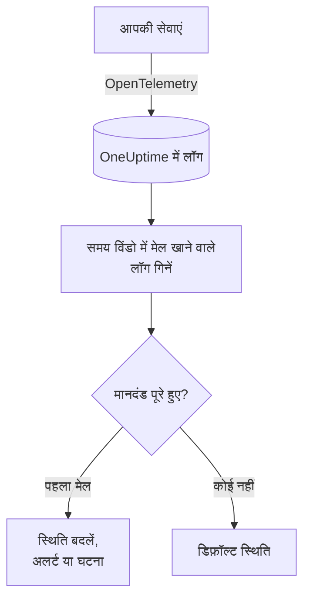
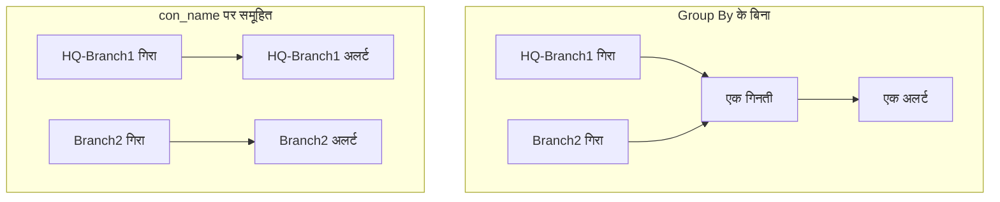

# लॉग मॉनिटर

लॉग मॉनिटर एक समय विंडो में उन लॉग की गिनती करता है जो आपकी सेवाएं OneUptime को भेजती हैं और जो आपके फ़िल्टर (टेक्स्ट, गंभीरता, सेवा, विशेषताएं) से मेल खाते हैं। जब गिनती आपके मानदंड पूरे करती है, तो यह मॉनिटर की स्थिति बदलता है, अलर्ट बनाता है या घटना घोषित करता है। त्रुटियों में अचानक उछाल, किसी खास त्रुटि संदेश, या लॉग लिखना बंद कर चुकी सेवा को पकड़ने के लिए इसका उपयोग करें।

:::cards
- [मॉनिटर बनाएं](#लॉग-मॉनिटर-बनाएं): चुनें कि कौन-से लॉग गिने जाएं और अलर्ट कब हो।
- [इसका मूल्यांकन कैसे होता है](#इसका-मूल्यांकन-कैसे-होता-है): समय विंडो, गिनती और एक मिनट का चक्र।
- [मानदंड](#मानदंड): थ्रेशोल्ड, विसंगति पहचान और डिफ़ॉल्ट।
- [समूह के अनुसार अलर्ट](#समूह-के-अनुसार-अलर्ट-group-by): हर टनल, उपयोगकर्ता या इंटरफ़ेस के लिए एक अलर्ट।
:::

## यह कैसे काम करता है



हर मिनट OneUptime उन लॉग को गिनता है जो मॉनिटर के फ़िल्टर से मेल खाते हैं और उसकी समय विंडो के भीतर आए। वह इस गिनती की तुलना मॉनिटर के मानदंडों से ऊपर से नीचे करता है, और जो मानदंड सबसे पहले मेल खाता है वही तय करता है कि क्या होगा। जब कोई मेल नहीं खाता, तो मॉनिटर अपनी डिफ़ॉल्ट स्थिति पर लौट आता है।

## शुरू करने से पहले

- आपकी सेवाएं OpenTelemetry (या OneUptime द्वारा लिए जाने वाले किसी दूसरे लॉग स्रोत) के ज़रिए OneUptime को लॉग भेजती हैं। [OpenTelemetry](/docs/telemetry/open-telemetry) देखें।
- लॉग लाइन के अंदर के किसी मान, जैसे टनल या उपयोगकर्ता के नाम, से फ़िल्टर या समूह बनाने के लिए, पहले [लॉग पाइपलाइन](/docs/telemetry/log-pipelines) से उसे एक विशेषता में बदलें।

## लॉग मॉनिटर बनाएं

:::steps
### नया मॉनिटर शुरू करें

**मॉनिटर** पर जाएं और **मॉनिटर बनाएं** पर क्लिक करें।

### Logs चुनें

**मॉनिटर प्रकार** में **और मॉनिटर प्रकार** पर क्लिक करें और **टेलीमेट्री** के अंतर्गत **लॉग** चुनें, या खोज बॉक्स में `logs` टाइप करें। **नाम** डालें, फिर **अगला** पर क्लिक करें।

### गिने जाने वाले लॉग चुनें

**लॉग मॉनिटर कॉन्फ़िगरेशन** में **इस टेक्स्ट को शामिल करने वाले मॉनिटर लॉग्स**, **(time) के लिए मॉनिटर लॉग्स** और **लॉग गंभीरता** सेट करें। खाली छोड़ा गया फ़िल्टर हर लॉग से मेल खाता है। फ़िल्टर के नीचे **लॉग्स पूर्वावलोकन** दिखाता है कि वे अभी किन लॉग से मेल खाते हैं।

### दायरा सीमित करें (वैकल्पिक)

टेलीमेट्री सेवा, इन्फ्रास्ट्रक्चर एंटिटी या विशेषता के आधार पर फ़िल्टर करने के लिए **और फ़ील्ड** खोलें। पूरे मॉनिटर के लिए एक की जगह हर टनल, उपयोगकर्ता या इंटरफ़ेस के लिए एक अलर्ट पाने के लिए, विशेषता को **Group by Attributes** में जोड़ें ([समूह के अनुसार अलर्ट](#समूह-के-अनुसार-अलर्ट-group-by) देखें)।

### मानदंड सेट करें

**मॉनिटर मानदंड** कार्ड दो मानदंडों से शुरू होता है: कोई लॉग मेल न खाए तो घटना के साथ ऑफ़लाइन; कम से कम एक मेल खाए तो ऑनलाइन। इन्हें उस चीज़ के अनुसार बदलें जिस पर आप अलर्ट चाहते हैं ([मानदंड](#मानदंड) देखें)।

### मॉनिटर बनाएं

**मॉनिटर बनाएं** पर क्लिक करें। मॉनिटर अपने **अवलोकन** पृष्ठ पर खुलता है, और उसका पहला मूल्यांकन एक मिनट के भीतर चलता है।
:::

## यह क्या क्वेरी करता है

| फ़ील्ड | किससे मेल खाता है | डिफ़ॉल्ट |
| --- | --- | --- |
| **इस टेक्स्ट को शामिल करने वाले मॉनिटर लॉग्स** | वे लॉग जिनके मुख्य भाग में यह टेक्स्ट हो, बड़े-छोटे अक्षरों का अंतर किए बिना। | खाली: हर लॉग |
| **(time) के लिए मॉनिटर लॉग्स** | पिछले 5 सेकंड से लेकर पिछले 24 घंटे तक के लॉग। | **पिछला 1 मिनट** |
| **लॉग गंभीरता** | चुनी गई किसी भी गंभीरता वाले लॉग। | खाली: हर गंभीरता |
| **Group by Attributes** | फ़िल्टर नहीं: इन विशेषताओं के मानों के हर संयोजन को अलग से गिनता है। | खाली: एक गिनती |
| **टेलीमेट्री सेवा द्वारा फ़िल्टर करें** (**और फ़ील्ड** में) | चुनी गई किसी भी सेवा से आए लॉग। | खाली: हर सेवा |
| **Filter by Infrastructure Entity** (**और फ़ील्ड** में) | चुने गए किसी भी होस्ट, पॉड, कंटेनर और दूसरी एंटिटी से आए लॉग। | खाली: हर एंटिटी |
| **विशेषताओं द्वारा फ़िल्टर करें** (**और फ़ील्ड** में) | वे लॉग जिनकी विशेषताएं हर शर्त पूरी करती हैं। हर शर्त का अपना ऑपरेटर होता है, जैसे "बराबर है" या "शामिल है"। | खाली: कोई शर्त नहीं |

किसी लॉग को गिने जाने के लिए आपके सेट किए सभी फ़िल्टर से मेल खाना ज़रूरी है।

### लॉग गंभीरता

हर लॉग सात गंभीरताओं में से एक के साथ संग्रहीत होता है। OpenTelemetry लॉग के लिए यह लॉग की गंभीरता संख्या से आती है, इसलिए गंभीरता के आधार पर चुनें, न कि उस टेक्स्ट के आधार पर जो आपके लॉगर ने छापा:

| गंभीरता | OpenTelemetry गंभीरता संख्याएं |
| --- | --- |
| **ट्रेस** | 1–4 |
| **Debug** | 5–8 |
| **Information** | 9–12 |
| **Warning** | 13–16 |
| **त्रुटि** | 17–20 |
| **Fatal** | 21–24 |
| **अनिर्दिष्ट** | बाकी सब |

## इसका मूल्यांकन कैसे होता है

- **हर मिनट।** लॉग मॉनिटर की जांच प्रोब नहीं करते, इसलिए इसमें सेट करने के लिए कोई अंतराल नहीं है और न ही **प्रोब और अंतराल** पृष्ठ।
- **हर मूल्यांकन में एक संख्या।** मॉनिटर उन लॉग को गिनता है जो हर फ़िल्टर से मेल खाते हैं और मूल्यांकन से पहले **(time) के लिए मॉनिटर लॉग्स** के भीतर आए। **पिछले 5 मिनट** के साथ हर मूल्यांकन पांच मिनट पीछे देखता है, इसलिए लगातार मूल्यांकनों की विंडो एक-दूसरे पर चढ़ी होती हैं।
- **कोई लॉग नहीं, यानी गिनती 0।** लॉग लिखना बंद कर चुकी सेवा 0 देती है, और डिफ़ॉल्ट ऑफ़लाइन मानदंड ठीक इसी को खोजता है।
- **OneUptime का अपना डाउनटाइम खामोशी नहीं है।** जब तक समय विंडो में वह समय शामिल है जब OneUptime खुद डेटा प्राप्त नहीं कर रहा था (वह रीस्टार्ट हो रहा था, अपग्रेड हो रहा था या बैकलॉग निपटा रहा था), जांच इंतज़ार करती है: स्थिति नहीं बदलती, और कोई घटना या अलर्ट न खुलता है न सुलझता है। [जब OneUptime डेटा प्राप्त नहीं कर रहा हो](/docs/monitor/when-oneuptime-is-not-receiving) देखें।
- **मानदंड ऊपर से नीचे।** जो मानदंड सबसे पहले मेल खाता है वही तय करता है, इसलिए सबसे गंभीर को सबसे ऊपर रखें। समूहित मॉनिटर अलग तरह से काम करता है: वह हर समूह के लिए हर मानदंड जांचता है ([मानदंडों का मूल्यांकन अलग है](#मानदंडों-का-मूल्यांकन-अलग-है) देखें)।

हर स्थिति परिवर्तन, उसके कारण के साथ, मॉनिटर की **स्थिति टाइमलाइन** पर दर्ज होता है।

## मानदंड

लॉग मॉनिटर के मानदंडों में एक ही **फ़िल्टर प्रकार** होता है: **Log Count**, यानी विंडो में मेल खाने वाले लॉग की संख्या। एक **फ़िल्टर शर्त** चुनें और, थ्रेशोल्ड शर्त के लिए, एक **मान**।

| फ़िल्टर शर्त | मेल खाती है जब लॉग की गिनती… |
| --- | --- |
| **Greater Than** | मान से ऊपर हो |
| **Greater Than Or Equal To** | मान के बराबर या उससे ऊपर हो |
| **Less Than** | मान से नीचे हो |
| **Less Than Or Equal To** | मान के बराबर या उससे नीचे हो |
| **Equal To** | ठीक मान के बराबर हो |
| **Anomalously High** | सप्ताह के इस घंटे के अपेक्षित दायरे से ऊपर हो |
| **Anomalously Low** | उस दायरे से नीचे हो |
| **Anomalous** | किसी भी दिशा में उस दायरे से बाहर हो |

विसंगति वाली शर्तों में कोई **मान** नहीं होता। एक **संवेदनशीलता** (Low, Medium जो डिफ़ॉल्ट है, या High) और 14 (डिफ़ॉल्ट), 28, 60 या 90 दिनों की **बेसलाइन विंडो** चुनें। OneUptime गिनती को प्रति मिनट की दर में बदलता है और उसकी तुलना उस विंडो में सप्ताह के उसी घंटे से करता है। बेसलाइन में सिर्फ़ मॉनिटर की सेवाएं और गंभीरताएं शामिल होती हैं: उसके टेक्स्ट और विशेषता फ़िल्टर इसका हिस्सा नहीं हैं। जब तक सप्ताह के उस घंटे का पर्याप्त इतिहास नहीं बन जाता, मानदंड सीख रहा होता है और ट्रिगर नहीं होता।

नया लॉग मॉनिटर इन मानदंडों से शुरू होता है:

| मानदंड | फ़िल्टर | प्रभाव |
| --- | --- | --- |
| Check if … is offline | **Log Count** **Equal To** `0` | मॉनिटर को ऑफ़लाइन चिह्नित करता है और घटना घोषित करता है, जो अपने आप सुलझ जाती है |
| Check if … is online | **Log Count** **Greater Than** `0` | मॉनिटर को ऑनलाइन चिह्नित करता है |

> [!TIP]
> खामोशी की जगह त्रुटियों पर अलर्ट के लिए, **लॉग गंभीरता** को **त्रुटि** पर सेट करें और ऑफ़लाइन मानदंड को **Log Count** **Greater Than** उतनी त्रुटियों पर बदलें जितनी आप विंडो में सह सकते हैं।

## उदाहरण: त्रुटियों में उछाल

आप चाहते हैं कि जब checkout सेवा पांच मिनट में 50 से ज़्यादा त्रुटियां लॉग करे तो घटना बने:

- **लॉग गंभीरता**: **त्रुटि**
- **(time) के लिए मॉनिटर लॉग्स**: **पिछले 5 मिनट**
- **टेलीमेट्री सेवा द्वारा फ़िल्टर करें**: `checkout`
- मानदंड 1: **Log Count** **Greater Than** `50`: मॉनिटर को ऑफ़लाइन चिह्नित करें और घटना घोषित करें
- मानदंड 2: **Log Count** **Less Than Or Equal To** `50`: मॉनिटर को ऑनलाइन चिह्नित करें

लगातार चार मूल्यांकन:

| समय | पिछले 5 मिनट के त्रुटि लॉग | मेल खाने वाला मानदंड | क्या होता है |
| --- | --- | --- | --- |
| 10:00 | 12 | 2 | मॉनिटर ऑनलाइन है। |
| 10:01 | 64 | 1 | मॉनिटर ऑफ़लाइन हो जाता है और घटना घोषित होती है। |
| 10:02 | 81 | 1 | ऑफ़लाइन रहता है। घटना पहले से खुली है, इसलिए दूसरी घोषित नहीं होती। |
| 10:06 | 9 | 2 | मॉनिटर फिर ऑनलाइन हो जाता है, और घटना अपने आप सुलझ जाती है क्योंकि **घटना स्वतः सुलझाएं** चालू है। |

क्योंकि विंडो एक-दूसरे पर चढ़ी होती हैं, त्रुटियों का एक झोंका खत्म होने के बाद भी पांच मिनट तक गिनती ऊंची रहती है। जिस मॉनिटर को जल्दी उबरना हो, उसके लिए छोटी विंडो का उपयोग करें।

## समूह के अनुसार अलर्ट (Group By)

**Group by Attributes** लॉग मॉनिटर की गिनती को विशेषता मानों के हर अलग संयोजन के लिए एक गिनती में बांट देता है (हर IPsec टनल, हर VPN उपयोगकर्ता, हर फ़ायरवॉल इंटरफ़ेस के लिए एक) और हर समूह के लिए मानदंडों का अलग से मूल्यांकन करता है। यह मेट्रिक्स मॉनिटर के [Group By](/docs/monitor/metrics-monitor#सीरीज़-के-अनुसार-अलर्ट-group-by) का लॉग वाला रूप है।

### हर समूह के लिए एक अलर्ट

Group By के बिना, समाप्त हुई IPsec टनल पर नज़र रखने वाला मॉनिटर पूरे मॉनिटर के लिए एक ही गिनती है और **पूरे मॉनिटर के लिए एक अलर्ट** देता है। जब तक वह अलर्ट खुला है, दूसरी टनल के गिरने से कुछ नया नहीं होता: मॉनिटर पहले से अलर्ट कर रहा है।

टनल के नाम पर Group By के साथ, टनल `HQ-Branch1` की समाप्ति अपना अलर्ट खोलती है, और दस मिनट बाद टनल `Branch2` की समाप्ति उसके बगल में **दूसरा, अलग अलर्ट** खोलती है।



### स्वतंत्र समाधान

हर समूह का अलर्ट या घटना अपने आप में अलग से सुलझती है। जैसे ही कोई समूह मानदंड पूरे करना बंद करता है (`HQ-Branch1` समय विंडो में और समाप्तियां लॉग नहीं करता), उसका अलर्ट सुलझ जाता है, जबकि `Branch2` का अलर्ट तब तक खुला रहता है जब तक `Branch2` भी रुक न जाए। एक समूह के ठीक होने से कभी दूसरे समूह का अलर्ट बंद नहीं होता।

लॉग मॉनिटर घटनाएं देखता है, स्थितियां नहीं: किसी समूह का अलर्ट तभी सुलझ जाता है जब उस समूह ने पूरी समय विंडो में मानदंड पूरा करने वाला कुछ भी लॉग नहीं किया, टनल वापस आई हो या नहीं।

### उदाहरण: हर Sophos IPsec टनल के लिए एक अलर्ट

यहां माना गया है कि फ़ायरवॉल की syslog लाइनों को बिना लक्ष्य प्रीफ़िक्स वाले [Key=Value पार्सर](/docs/telemetry/log-pipelines#keyvalue-parser) से विशेषताओं में बांटा गया है, ताकि टनल का नाम विशेषता `con_name` हो:

```text
log_component="IPSec" con_name="HQ-Branch1" status="Terminated" message="IPSec Connection HQ-Branch1 between 10.171.4.117 and 10.171.4.118 for Child HQ-Branch1 terminated."
```

:::steps
1. एक **लॉग** मॉनिटर बनाएं।
2. **इस टेक्स्ट को शामिल करने वाले मॉनिटर लॉग्स** को `terminated` पर और **(time) के लिए मॉनिटर लॉग्स** को **पिछले 5 मिनट** पर सेट करें।
3. **और फ़ील्ड** में विशेषता फ़िल्टर `log_component` = `IPSec` जोड़ें।
4. **Group by Attributes** में `con_name` जोड़ें।
5. फ़िल्टर **Log Count** **Greater Than** `0` वाला एक मानदंड जोड़ें, जो `IPsec tunnel {{con_name}} terminated` शीर्षक वाला अलर्ट या घटना बनाए।
:::

अब समाप्ति लॉग करने वाली हर टनल को अपना अलर्ट मिलता है (`IPsec tunnel HQ-Branch1 terminated`, `IPsec tunnel Branch2 terminated`), और हर अलर्ट अपने आप में अलग से सुलझता है।

### शीर्षकों और विवरणों में समूह के मान

हर Group By विशेषता का मान अलर्ट या घटना के शीर्षक, विवरण और समाधान नोट्स में एक [टेम्पलेट वेरिएबल](/docs/monitor/incident-alert-templating) होता है, ठीक मेट्रिक सीरीज़ के लेबल की तरह: `con_name` पर समूह बनाने से आपको `{{con_name}}` मिलता है। बिंदुओं वाली कुंजी को पथ की तरह पढ़ा जाता है, इसलिए `sophos.con_name` का मतलब `{{sophos.con_name}}` है। जब शीर्षक में समूह का नाम पहले से न हो, तो समूह उसमें जोड़ दिया जाता है (`IPsec tunnel terminated - Con Name: HQ-Branch1`), और `{{seriesResourceSuffix}}` और `{{seriesResourceSummary}}` मेट्रिक्स मॉनिटर की तरह ही काम करते हैं।

### समूह कैसे गिने जाते हैं

- अधिकतम 10 विशेषताएं। उनके मानों का हर अलग संयोजन एक समूह है।
- जिस लॉग में कोई Group By विशेषता नहीं है, उसे उस विशेषता के लिए **खाली मान** के साथ गिना जाता है, इसलिए बिना विशेषता वाले लॉग अपना अलग समूह बनाते हैं, जिसका अलर्ट उस विशेषता का कोई मान नहीं बताता। अगर सारे अलर्ट बिना समूह मान के आएं, तो विशेषता की कुंजी जांचें: लक्ष्य प्रीफ़िक्स वाली लॉग पाइपलाइन `con_name` को `sophos.con_name` के रूप में संग्रहीत करती है।
- 256 अक्षरों से लंबे समूह मान 256 पर काट दिए जाते हैं।
- हर जांच में अधिकतम **100 समूहों** का मूल्यांकन होता है: सबसे ज़्यादा लॉग वाले 100। जब ज़्यादा समूह मेल खाते हैं, तो बाकी उस जांच में छोड़ दिए जाते हैं और एक चेतावनी लॉग की जाती है; उन्हें शामिल करने के लिए मॉनिटर के फ़िल्टर संकरे करें।

### मानदंडों का मूल्यांकन अलग है

- **हर मानदंड का मूल्यांकन होता है**, समूहित मेट्रिक्स मॉनिटर की तरह, इसलिए अलग-अलग समूह एक ही समय पर अलग-अलग मानदंड पूरे कर सकते हैं। दो मानदंड पूरे करने वाले समूह को फिर भी एक ही अलर्ट मिलता है, पहले वाले से; इसलिए मानदंडों को सबसे गंभीर से कम गंभीर के क्रम में रखें।
- **समूह तभी मौजूद होता है जब उसने समय विंडो में कुछ लॉग किया हो।** इसलिए **Equal To 0** और **Less Than** मानदंड सिर्फ़ उन समूहों के लिए ट्रिगर होते हैं जिन्होंने कम से कम एक बार लॉग किया; जब लॉग आना पूरी तरह बंद हो जाए तब अलर्ट के लिए, बिना Group By वाले मॉनिटर का उपयोग करें।
- **विसंगति पहचान** (**Anomalously High**, **Anomalously Low**, **Anomalous**) का मूल्यांकन समूह के अनुसार नहीं होता (उसकी बेसलाइन पूरे मॉनिटर को कवर करती है), इसलिए समूहित मॉनिटर पर ये फ़िल्टर कभी मेल नहीं खाते।
- मॉनिटर की स्थिति उस पहले मानदंड का पालन करती है जिसे कोई भी समूह पूरा करता है। जब कोई समूह कोई मानदंड पूरा नहीं करता, तो मॉनिटर अपनी डिफ़ॉल्ट स्थिति पर लौट आता है।

## समस्या निवारण

:::details मॉनिटर ऑफ़लाइन है, लेकिन मेरी सेवा लॉग लिख रही है
गिनती 0 थी, यानी फ़िल्टर सेवा के भेजे किसी भी लॉग से मेल नहीं खाते। मॉनिटर का **मानदंड** पृष्ठ (**कॉन्फ़िगरेशन** के अंतर्गत) खोलें और **Edit Monitoring Criteria** पर क्लिक करें: **लॉग्स पूर्वावलोकन** दिखाता है कि फ़िल्टर अभी क्या चुनते हैं। सबसे आम कारण हैं: गंभीरता संख्या की जगह लॉगर के छापे टेक्स्ट से चुनी गई गंभीरता ([लॉग गंभीरता](#लॉग-गंभीरता) देखें), मेल न खाने वाला सेवा या विशेषता फ़िल्टर, और सेवा के लॉग के बीच के अंतर से छोटी समय विंडो।
:::

:::details उछाल आया, लेकिन कोई अलर्ट नहीं हुआ
मानदंड ऊपर से नीचे जांचे जाते हैं और पहला मेल तय करता है। आपके अपेक्षित मानदंड के ऊपर कोई व्यापक मानदंड, जैसे **Log Count** **Greater Than** `0`, पहले मेल खाकर बाकी को रोक देता है। सबसे गंभीर मानदंड को सबसे ऊपर रखें।
:::

:::details विसंगति वाला मानदंड कभी ट्रिगर नहीं होता
वह अभी सीख रहा है: सप्ताह के जिस घंटे से वह तुलना करता है, उसका अभी पर्याप्त इतिहास नहीं है। **Group by Attributes** वाले मॉनिटर पर विसंगति वाली शर्तें कभी मेल नहीं खातीं; वहां थ्रेशोल्ड का उपयोग करें।
:::

:::details समूह अलर्ट बिना समूह मान के आते हैं
जिन लॉग में Group By विशेषता नहीं होती, उन्हें खाली मान के साथ गिना जाता है। लॉग एक्सप्लोरर में कुंजी का सटीक नाम जांचें: लक्ष्य प्रीफ़िक्स वाली लॉग पाइपलाइन `con_name` को `sophos.con_name` के रूप में संग्रहीत करती है।
:::

## अगले कदम

:::cards
- [लॉग पाइपलाइन](/docs/telemetry/log-pipelines): लॉग लाइनों को फ़िल्टर और समूह बनाने लायक विशेषताओं में बांटें।
- [घटना और अलर्ट टेम्पलेट](/docs/monitor/incident-alert-templating): समूह मान और गिनतियां शीर्षकों और विवरणों में डालें।
- [मेट्रिक्स मॉनिटर](/docs/monitor/metrics-monitor): किसी मेट्रिक पर हर होस्ट या हर कंटेनर के अनुसार अलर्ट करें।
- [ट्रेस मॉनिटर](/docs/monitor/traces-monitor): विफल स्पैन पर इसी तरह अलर्ट करें।
:::
