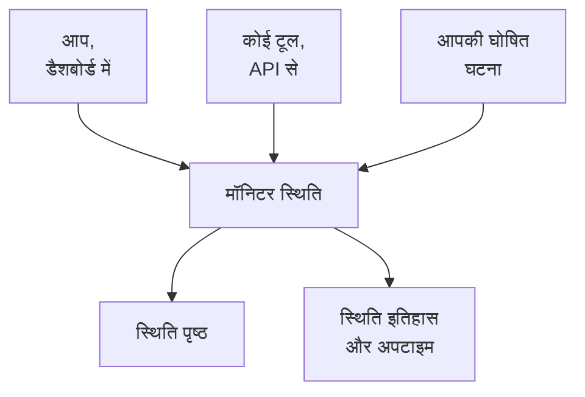

# मैन्युअल मॉनिटर

मैन्युअल मॉनिटर में कोई अपने आप होने वाली जांच नहीं होती: उसकी स्थिति वही होती है जो आप डैशबोर्ड में या API से सेट करते हैं। इसका उपयोग ऐसी चीज़ को अपने स्थिति पृष्ठों और घटनाओं में दिखाने के लिए करें जिसे OneUptime खुद नहीं जांच सकता — कोई तृतीय-पक्ष निर्भरता, कोई भौतिक सिस्टम, कोई व्यावसायिक प्रक्रिया।

:::cards
- [एक बनाएं](#मैन्युअल-मॉनिटर-बनाएं): डैशबोर्ड में एक चरण।
- [इसकी स्थिति बदलें](#स्थिति-अपडेट-करना): डैशबोर्ड में, या API के ज़रिए अपने टूल से।
- [घटनाएं और अलर्ट](#घटनाएं-और-अलर्ट): एक ही चरण में घटना घोषित करें और स्थिति सेट करें।
:::

## मैन्युअल मॉनिटर कब इस्तेमाल करें

| उपयोग का मामला | विवरण |
| --- | --- |
| तृतीय-पक्ष सेवाएं | उन बाहरी सेवाओं की स्थिति पर नज़र रखें जिन पर आप निर्भर हैं पर जिनकी सीधी निगरानी नहीं कर सकते। |
| भौतिक इंफ्रास्ट्रक्चर | बिना नेटवर्क निगरानी वाले हार्डवेयर या भौतिक सिस्टम को दिखाएं। |
| व्यावसायिक प्रक्रियाएं | ऐसी गैर-तकनीकी प्रक्रियाओं पर नज़र रखें जो सेवा की स्थिति को प्रभावित करती हैं। |
| API से चलने वाली स्थिति | अपने टूल को OneUptime API से स्थिति सेट करने दें। |
| स्थिति पृष्ठ प्लेसहोल्डर | अपने स्थिति पृष्ठ पर ऐसे घटक दिखाएं जिनका प्रबंधन OneUptime के बाहर होता है। |

जो प्रदाता स्थिति पृष्ठ प्रकाशित करता है, उसके लिए इसकी ज़रूरत नहीं: [बाहरी स्थिति पृष्ठ मॉनिटर](/docs/monitor/external-status-page-monitor) आपके लिए उस पृष्ठ को फ़ॉलो करता है।

## यह कैसे काम करता है

मैन्युअल मॉनिटर में न निगरानी अंतराल होता है, न प्रोब, न मानदंड। उसकी स्थिति वैसी ही रहती है जैसी आप सेट करते हैं, जब तक आप, API का उपयोग करने वाला कोई टूल, या आपकी घोषित कोई घटना उसे न बदले — और नई स्थिति हर उस जगह दिखती है जहां मॉनिटर दिखता है।



हर बदलाव मॉनिटर की **स्थिति टाइमलाइन** पर एक प्रविष्टि होता है, इसलिए उसका अपटाइम और स्थिति इतिहास किसी भी दूसरे मॉनिटर की तरह रखा जाता है। मैन्युअल मॉनिटर सक्रिय मॉनिटर नहीं है, इसलिए OneUptime Cloud पर यह आपके बिल में कुछ नहीं जोड़ता।

## मैन्युअल मॉनिटर बनाएं

:::steps
### नया मॉनिटर शुरू करें

**मॉनिटर** पर जाएं और **मॉनिटर बनाएं** पर क्लिक करें।

### Manual चुनें

**मॉनिटर प्रकार** में **और मॉनिटर प्रकार** पर क्लिक करें और **अन्य** के नीचे **Manual** चुनें।

### नाम दें और बनाएं

**नाम** डालें — और चाहें तो **और फ़ील्ड** के नीचे **विवरण** भी — फिर **मॉनिटर बनाएं** पर क्लिक करें। मैन्युअल मॉनिटर को और कुछ नहीं चाहिए, इसलिए यह इसी पहले चरण से बन जाता है।
:::

## स्थिति अपडेट करना

### डैशबोर्ड में

:::steps
1. मॉनिटर खोलें और उसके साइड मेनू में **स्थिति टाइमलाइन** पर क्लिक करें।
2. **मॉनिटर स्थिति इवेंट बनाएँ** पर क्लिक करें।
3. **मॉनिटर स्थिति** चुनें। **शुरू होता है** अभी का समय है; अगर बदलाव पहले हुआ था तो पहले का समय सेट करें।
4. **मॉनिटर स्थिति इवेंट बनाएँ** पर क्लिक करें। नई स्थिति तुरंत मॉनिटर पर, और उसे दिखाने वाले हर स्थिति पृष्ठ पर दिखती है।
:::

### API से

नई स्थिति को मॉनिटर स्थिति इवेंट के रूप में भेजें, `ApiKey` हेडर में अपने प्रोजेक्ट की [API कुंजी](/docs/api-reference/api-reference) के साथ:

```bash
curl -X POST https://oneuptime.com/api/monitor-status-timeline \
  -H "ApiKey: $ONEUPTIME_API_KEY" \
  -H "Content-Type: application/json" \
  -d '{"data": {"monitorId": "<monitor id>", "monitorStatusId": "<monitor status id>"}}'
```

- `monitorId` मॉनिटर की ID है: उसे कॉपी करने के लिए उसके पेज पर **ID** लाइन पर क्लिक करें।
- `monitorStatusId` सेट करने वाली स्थिति है: **मॉनिटर → सेटिंग्स → मॉनिटर स्थिति** पर उस स्थिति की पंक्ति में **ID दिखाएँ** चुनें।
- `startsAt` वैकल्पिक है। इसे छोड़ने पर बदलाव अभी से शुरू होता है।
- सेल्फ़-होस्टेड इंस्टॉल पर अनुरोध `oneuptime.com` की जगह अपने होस्ट को भेजें।

मॉनिटर की पहले से मौजूद स्थिति भेजने पर `Monitor Status cannot be same as previous status.` के साथ मना कर दिया जाता है और कुछ भी दर्ज नहीं होता, इसलिए हर रन पर रिपोर्ट करने वाला टूल उस जवाब को अनदेखा कर सकता है।

## घटनाएं और अलर्ट

जहां भी मॉनिटर चुने जाते हैं, वहां मैन्युअल मॉनिटर किसी भी दूसरे मॉनिटर की तरह चुना जाता है:

- कोई घटना घोषित करें और **मॉनिटर** के नीचे मॉनिटर चुनें। **मॉनिटर स्थिति बदलकर करें** के साथ, घटना घोषित करने पर मॉनिटर की स्थिति भी सेट होती है, और उसे हल करने पर मॉनिटर फिर से कार्यरत हो जाता है, जब तक उस पर कोई दूसरी घटना अब भी खुली न हो। [घटना घोषित करना](/docs/incidents/declaring-incidents#चरण-2-प्रभावित-संसाधन) देखें।
- उसके बारे में अलर्ट बनाएं, ऐसी समस्या के लिए जिस पर आपकी टीम को ग्राहकों को बताए बिना काम करना हो।
- उसे किसी स्थिति पृष्ठ में जोड़ें, ताकि ग्राहकों को ऐसी निर्भरता दिखे जिस पर आप हाथ से नज़र रखते हैं।

## अगले कदम

:::cards
- [मॉनिटर बनाना](/docs/monitor/create-monitor): वे मॉनिटर प्रकार जो आपके लिए चीज़ें जांचते हैं।
- [बाहरी स्थिति पृष्ठ मॉनिटर](/docs/monitor/external-status-page-monitor): इसकी जगह किसी प्रदाता के स्थिति पृष्ठ को अपने आप फ़ॉलो करें।
- [स्थिति पृष्ठ अवलोकन](/docs/status-pages/index): अपने ग्राहकों को मॉनिटर की स्थिति दिखाएं।
:::
