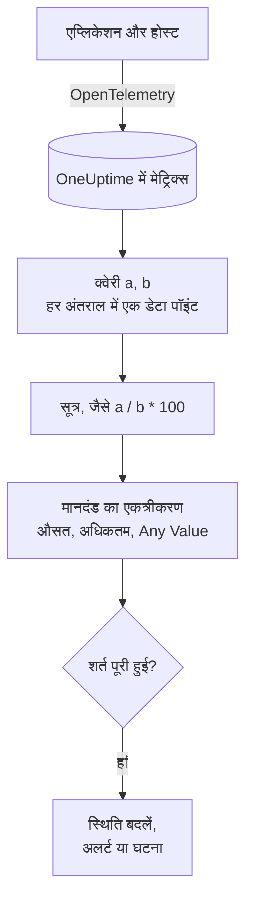

# मेट्रिक्स मॉनिटर

मेट्रिक्स मॉनिटर उन मेट्रिक्स को क्वेरी करता है जो आपके एप्लिकेशन और इन्फ्रास्ट्रक्चर OneUptime को भेजते हैं, जब आपको अनुपात या कुल चाहिए तो उन्हें सूत्रों से जोड़ता है, और परिणाम को एक खिसकती समय सीमा में आपके मानदंडों से मिलाता है। अनुरोध दर, त्रुटि अनुपात, कतार की गहराई, CPU, मेमोरी और डिस्क (कोई भी संख्यात्मक सीरीज़) के लिए इसका उपयोग करें; समूह बनाने पर हर होस्ट या कंटेनर के लिए एक अलर्ट मिलता है।

:::cards
- [मॉनिटर बनाएं](#मेट्रिक्स-मॉनिटर-बनाएं): क्वेरी, सूत्र, समय सीमा और मानदंड।
- [इसका मूल्यांकन कैसे होता है](#इसका-मूल्यांकन-कैसे-होता-है): डेटा पॉइंट, सूत्र और मानदंडों का एकत्रीकरण।
- [उदाहरण](#उदाहरण-बढ़ती-कतार): हर एकत्रीकरण में वही डेटा।
- [सीरीज़ के अनुसार अलर्ट](#सीरीज़-के-अनुसार-अलर्ट-group-by): हर होस्ट, कंटेनर या माउंट पॉइंट के लिए एक अलर्ट।
:::

## यह कैसे काम करता है

हर मिनट OneUptime मॉनिटर की हर मेट्रिक क्वेरी को उसकी समय सीमा पर चलाता है। क्वेरी हर समय अंतराल के लिए एक डेटा पॉइंट लौटाती है, और सूत्र क्वेरी को अंतराल-दर-अंतराल जोड़ते हैं। फिर हर मानदंड जिस क्वेरी या सूत्र की जांच करता है, उसके डेटा पॉइंट को एक नतीजे में समेटता है (उनका औसत, उनका अधिकतम, या हर पॉइंट की जांच) और उसे अपने थ्रेशोल्ड से मिलाता है।

## शुरू करने से पहले

- आपके एप्लिकेशन या इन्फ्रास्ट्रक्चर OpenTelemetry के ज़रिए OneUptime को मेट्रिक्स भेजते हैं। [OpenTelemetry](/docs/telemetry/open-telemetry) देखें।
- मेट्रिक का नाम और वे विशेषताएं जानें जिन पर आप फ़िल्टर या समूह बनाना चाहते हैं। **मीट्रिक** और **Group by** सूचियां सिर्फ़ वे नाम और विशेषताएं दिखाती हैं जो OneUptime को मिल चुकी हैं।

## मेट्रिक्स मॉनिटर बनाएं

:::steps
### नया मॉनिटर शुरू करें

**मॉनिटर** पर जाएं और **मॉनिटर बनाएं** पर क्लिक करें।

### Metrics चुनें

**मॉनिटर प्रकार** में **और मॉनिटर प्रकार** पर क्लिक करें और **टेलीमेट्री** के अंतर्गत **मेट्रिक्स** चुनें, या खोज बॉक्स में `metrics` टाइप करें। **नाम** डालें, फिर **अगला** पर क्लिक करें।

### समय सीमा चुनें

**मीट्रिक मॉनिटर कॉन्फ़िगरेशन** में एक **समय सीमा** चुनें: हर मूल्यांकन कितना पीछे देखता है। यह **Past 1 Minute** से शुरू होती है।

### मेट्रिक क्वेरी जोड़ें

**मेट्रिक्स चुनें** में एक **मीट्रिक** चुनें और **Aggregate by** से उसे एकत्र करने का तरीका चुनें। विशेषताओं पर फ़िल्टर करने या **Group by** से समूह बनाने के लिए **Filters & grouping** खोलें। एक और क्वेरी के लिए **मीट्रिक जोड़ें** पर, या उन्हें जोड़ने के लिए **सूत्र जोड़ें** पर क्लिक करें। क्वेरी के नीचे का चार्ट समय सीमा का पूर्वावलोकन दिखाता है, ताकि आप वे मान देख सकें जिनकी जांच मानदंड करेंगे।

### मानदंड सेट करें

**मॉनिटर मानदंड** में हर मानदंड जांचने के लिए **मीट्रिक** (क्वेरी या सूत्र), उसका **एकत्रीकरण**, एक **शर्त** और एक **Threshold** चुनता है। नया मॉनिटर किन मानदंडों से शुरू होता है, इसके लिए [मानदंड](#मानदंड) देखें।

### मॉनिटर बनाएं

**मॉनिटर बनाएं** पर क्लिक करें। मॉनिटर अपने **अवलोकन** पृष्ठ पर खुलता है, और उसका पहला मूल्यांकन एक मिनट के भीतर चलता है।
:::

## यह क्या क्वेरी करता है

### मेट्रिक क्वेरी

| फ़ील्ड | यह क्या करता है | डिफ़ॉल्ट |
| --- | --- | --- |
| **मीट्रिक** | क्वेरी की जाने वाली मेट्रिक। | आवश्यक |
| **Aggregate by** | हर समय अंतराल के मान एक डेटा पॉइंट में कैसे जुड़ते हैं: औसत, योग, Min, Max, गणना, या कोई पर्सेंटाइल (P50, P75, P90, P95 या P99)। | औसत |
| **Filter by attributes** (**Filters & grouping** में) | सिर्फ़ वे सीरीज़ जिनकी विशेषताएं इन शर्तों को पूरा करती हैं। | कोई फ़िल्टर नहीं |
| **Group by** (**Filters & grouping** में) | इन विशेषताओं के हर अनोखे मान के लिए एक सीरीज़ ([सीरीज़ के अनुसार अलर्ट](#सीरीज़-के-अनुसार-अलर्ट-group-by) देखें)। | एक सीरीज़ |

हर क्वेरी और सूत्र को जोड़े जाने के क्रम में एक वेरिएबल (`a`, `b`, `c` आदि) मिलता है।

### सूत्र

सूत्र क्वेरी वेरिएबल को `+`, `-`, `*`, `/`, `%`, `^` और कोष्ठकों से अंतराल-दर-अंतराल जोड़ता है। आप वेरिएबल आगे `$` लगाकर या बिना लगाए लिख सकते हैं:

- `a / b * 100`: `b` में `a` का हिस्सा, प्रतिशत में
- `a + b`: दो मेट्रिक्स का जोड़
- `a - b`: दोनों का अंतर

### खिसकती समय विंडो

**समय सीमा** तय करती है कि हर मूल्यांकन कितना पीछे देखता है: **Past 1 Minute**, **Past 5 Minutes**, **Past 10 Minutes**, **Past 15 Minutes**, **Past 30 Minutes**, **Past 1 Hour**, **Past 2 Hours**, **Past 3 Hours**, **Past 6 Hours**, **Past 12 Hours**, **Past 1 Day**, **Past 2 Days**, **Past 3 Days**, **Past 7 Days**, **Past 14 Days**, **Past 30 Days**, **Past 60 Days**, **Past 90 Days**, **Past 180 Days** या **Past 365 Days**।

सीमा जितनी लंबी, हर समय अंतराल उतना चौड़ा, इसलिए एक डेटा पॉइंट ज़्यादा समय दर्शाता है:

| समय सीमा | हर डेटा पॉइंट |
| --- | --- |
| Past 1 Minute से Past 3 Hours तक | 1 मिनट |
| Past 6 Hours, Past 12 Hours | 5 मिनट |
| Past 1 Day | 15 मिनट |
| Past 2 Days, Past 3 Days | 30 मिनट |
| Past 7 Days | 1 घंटा |
| Past 14 Days, Past 30 Days | 1 दिन |
| Past 60 Days से Past 180 Days तक | 1 सप्ताह |
| Past 365 Days | 1 महीना |

## इसका मूल्यांकन कैसे होता है

- **हर मिनट।** मेट्रिक्स मॉनिटर की जांच प्रोब नहीं करते, इसलिए इसमें सेट करने के लिए कोई अंतराल नहीं है और न ही **प्रोब और अंतराल** पृष्ठ।
- **पहले क्वेरी, फिर सूत्र।** हर क्वेरी अपने **Aggregate by** के अनुसार समय सीमा के हर समय अंतराल के लिए एक डेटा पॉइंट लौटाती है। सूत्र क्वेरी के डेटा पॉइंट से हर अंतराल के लिए निकाले जाते हैं।
- **फिर मानदंड का एकत्रीकरण।** हर मानदंड अपनी **मीट्रिक** के डेटा पॉइंट को उस मान में समेटता है जिसे वह थ्रेशोल्ड से मिलाता है:

| एकत्रीकरण | शर्त की जांच किससे होती है… |
| --- | --- |
| औसत | डेटा पॉइंट का औसत |
| योग | डेटा पॉइंट का योग |
| Maximum Value | सबसे ऊंचा डेटा पॉइंट |
| Minimum Value | सबसे नीचा डेटा पॉइंट |
| All Values | हर डेटा पॉइंट: सभी को शर्त पूरी करनी होगी |
| Any Value | हर डेटा पॉइंट: किसी एक का शर्त पूरा करना काफ़ी है |

- **मानदंड ऊपर से नीचे।** Group By के बिना वाले मॉनिटर पर जो मानदंड सबसे पहले मेल खाता है वही तय करता है, इसलिए सबसे गंभीर को सबसे ऊपर रखें। समूहित मॉनिटर हर सीरीज़ के लिए हर मानदंड जांचता है ([मानदंडों का मूल्यांकन अलग है](#मानदंडों-का-मूल्यांकन-अलग-है) देखें)।
- **कोई डेटा नहीं, शून्य नहीं है।** जब क्वेरी समय सीमा में कोई डेटा पॉइंट नहीं लौटाती, तो मानदंड वही करता है जो **और फ़ील्ड** में उसकी **यदि कोई डेटा नहीं** सेटिंग कहती है: **Ignore** (डिफ़ॉल्ट: मानदंड मेल नहीं खाता), **Treat As Zero** या **ट्रिगर**।
- **OneUptime का अपना डाउनटाइम खामोशी नहीं है।** जब तक समय सीमा में वह समय शामिल है जब OneUptime खुद डेटा प्राप्त नहीं कर रहा था (वह रीस्टार्ट हो रहा था, अपग्रेड हो रहा था या बैकलॉग निपटा रहा था), जांच इंतज़ार करती है: **यदि कोई डेटा नहीं** चाहे जो कहे, स्थिति नहीं बदलती, और कोई घटना या अलर्ट न खुलता है न सुलझता है। [जब OneUptime डेटा प्राप्त नहीं कर रहा हो](/docs/monitor/when-oneuptime-is-not-receiving) देखें।

## मानदंड

ये मॉनिटर हमेशा **Metric Value** का मूल्यांकन करते हैं: कॉन्फ़िगर की गई मेट्रिक क्वेरी या सूत्र का एकत्रित मान। मानदंड फ़ॉर्म में फ़िल्टर प्रकार चुनने का विकल्प नहीं है; यह **मीट्रिक**, **एकत्रीकरण**, **शर्त** और **Threshold** दिखाता है। जब मेट्रिक की कोई इकाई हो, तो थ्रेशोल्ड की इकाई उसके बगल में चुनें।

| शर्त | मेल खाती है जब मान… |
| --- | --- |
| **Greater Than** | थ्रेशोल्ड से ऊपर हो |
| **Greater Than Or Equal To** | थ्रेशोल्ड के बराबर या उससे ऊपर हो |
| **Less Than** | थ्रेशोल्ड से नीचे हो |
| **Less Than Or Equal To** | थ्रेशोल्ड के बराबर या उससे नीचे हो |
| **Equal To** | ठीक थ्रेशोल्ड के बराबर हो |
| **Anomalously High** | सप्ताह के इस घंटे के अपेक्षित दायरे से ऊपर हो |
| **Anomalously Low** | उस दायरे से नीचे हो |
| **Anomalous** | किसी भी दिशा में उस दायरे से बाहर हो |

विसंगति वाली शर्तों में कोई थ्रेशोल्ड नहीं होता। इसकी जगह फ़ॉर्म **संवेदनशीलता** (Low, Medium जो डिफ़ॉल्ट है, या High) और **बेसलाइन विंडो** (14 दिन जो डिफ़ॉल्ट है, 28, 60 या 90) दिखाता है, और हर डेटा पॉइंट की तुलना उस विंडो से बनी सप्ताह के उसी घंटे की बेसलाइन से करता है। जब तक सप्ताह के उस घंटे का पर्याप्त इतिहास नहीं बन जाता, मानदंड सीख रहा होता है और कोई अलर्ट नहीं देता।

नया मेट्रिक्स मॉनिटर अपनी पहली क्वेरी पर दो मानदंडों से शुरू होता है, दोनों **Any Value** एकत्रीकरण के साथ:

| मानदंड | शर्त | प्रभाव |
| --- | --- | --- |
| Check if … is offline | **Equal To** `0` | मॉनिटर को ऑफ़लाइन चिह्नित करता है और घटना घोषित करता है, जो अपने आप सुलझ जाती है |
| Check if … is online | **Greater Than** `0` | मॉनिटर को ऑनलाइन चिह्नित करता है |

> [!NOTE]
> ऑफ़लाइन मानदंड रिपोर्ट किए गए 0 मान पर ट्रिगर होता है, खामोशी पर नहीं। जब कोई मेट्रिक आना बंद हो जाए तब अलर्ट के लिए, उसकी **यदि कोई डेटा नहीं** को **ट्रिगर** पर सेट करें।

## उदाहरण: बढ़ती कतार

आप चाहते हैं कि जब checkout कतार गहरी बनी रहे तो घटना बने। क्वेरी `a` गेज `checkout.queue.depth` है, **Aggregate by** Max के साथ, और **समय सीमा** **Past 5 Minutes** है। एक मूल्यांकन ये पांच एक-मिनट के डेटा पॉइंट देखता है:

| मिनट | 10:01 | 10:02 | 10:03 | 10:04 | 10:05 |
| --- | --- | --- | --- | --- | --- |
| `a` | 640 | 980 | 1,500 | 1,620 | 1,100 |

**मीट्रिक** `a`, **शर्त** **Greater Than** और **Threshold** `1000` वाला मानदंड हर **एकत्रीकरण** के लिए अलग जवाब देता है:

| एकत्रीकरण | 1,000 से तुलना | मेल खाता है? |
| --- | --- | --- |
| औसत | 1,168 | हां |
| योग | 5,840 | हां |
| Maximum Value | 1,620 | हां |
| Minimum Value | 640 | नहीं |
| All Values | 640, 980, 1,500, 1,620, 1,100 | नहीं: दो पॉइंट 1,000 से ऊपर नहीं हैं |
| Any Value | 640, 980, 1,500, 1,620, 1,100 | हां: 1,500 है |

**औसत** लगातार बने बैकलॉग पर अलर्ट करता है और किसी अकेले गहरे मिनट को अनदेखा करता है; **All Values** तब तक इंतज़ार करता है जब तक सीमा का हर मिनट गहरा न हो; **Any Value** पहले गहरे मिनट पर अलर्ट करता है।

## सीरीज़ के अनुसार अलर्ट (Group By)

मेट्रिक क्वेरी पर **Group by** उस क्वेरी को हर अनोखे विशेषता मान के लिए एक सीरीज़ में बांट देता है (हर होस्ट, हर कंटेनर, हर माउंट पॉइंट के लिए एक), और Group By वाला मॉनिटर हर सीरीज़ का स्वतंत्र रूप से मूल्यांकन करता है। यही एक सेटिंग "पूरा फ़्लीट ठीक नहीं है" और "`prod-db-01` ठीक नहीं है" के बीच का अंतर है।

### हर समूह के लिए एक अलर्ट

`host.name` पर Group By सेट करने पर, पचास होस्ट पर नज़र रखने वाला डिस्क-उपयोग मॉनिटर **थ्रेशोल्ड पार करने वाले हर होस्ट के लिए एक अलर्ट (या घटना)** देता है। होस्ट A के भरने पर उसका अपना अलर्ट खुलता है; दस मिनट बाद होस्ट B के भरने पर उसके बगल में दूसरा, अलग अलर्ट खुलता है।

Group By के बिना वही मॉनिटर एक अकेला स्केलर है: क्वेरी हर होस्ट को एक संख्या में समेट देती है और मॉनिटर **पूरे मॉनिटर के लिए एक अलर्ट** देता है। जब तक वह अलर्ट खुला है, दूसरे होस्ट के थ्रेशोल्ड पार करने से कुछ नहीं होता (मॉनिटर पहले से अलर्ट कर रहा है, इसलिए नया देने को कुछ नहीं), और ऑन-कॉल इंजीनियर को होस्ट B के बारे में कभी पता नहीं चलता। **Group By सेट करना ही हर होस्ट के अलर्ट पाने का तरीका है।** अगर आप हर होस्ट, हर कंटेनर या हर माउंट पॉइंट के लिए पेज होना चाहते हैं, तो इसे सेट करें।

### स्वतंत्र समाधान

हर समूह का अलर्ट अपने समूह पर नज़र रखता है। जब होस्ट A फिर से थ्रेशोल्ड से नीचे आता है तो उसका अलर्ट अपने आप सुलझ जाता है, और होस्ट B का अलर्ट तब तक खुला रहता है जब तक होस्ट B ठीक न हो जाए। एक समूह के ठीक होने से कभी दूसरे समूह का अलर्ट बंद नहीं होता।

### मानदंडों का मूल्यांकन अलग है

- **समूहित मॉनिटर हर मानदंड का मूल्यांकन करते हैं।** इसलिए गंभीरता के स्तर अलग-अलग समूहों पर एक साथ ट्रिगर हो सकते हैं: "Critical: 95 से अधिक" को "Warning: 80 से अधिक" के ऊपर रखने पर, एक ही जांच में 96% वाला होस्ट गंभीर अलर्ट खोलता है जबकि 85% वाला होस्ट चेतावनी अलर्ट खोलता है। दोनों स्तर पार करने वाले होस्ट को फिर भी ठीक एक अलर्ट मिलता है, पहले मेल खाने वाले मानदंड से, इसलिए **मानदंडों को सबसे गंभीर से शुरू करके क्रम में रखें**।
- **बिना समूह वाले मॉनिटर पहले मेल खाने वाले मानदंड पर रुक जाते हैं।** सिर्फ़ वही एक मानदंड ट्रिगर होता है, यह अलर्ट वाले मानदंड को स्वस्थ वाले के ऊपर रखने की एक और वजह है: सबसे ऊपर रखा गया व्यापक स्वस्थ मानदंड लगभग हर जांच पर मेल खाता है और उसके नीचे के अलर्ट मानदंड का मूल्यांकन कभी होने नहीं देता।

| होस्ट | उपयोग की गई डिस्क | Critical (> 95) | Warning (> 80) | दिया गया अलर्ट |
| --- | --- | --- | --- | --- |
| `prod-db-01` | 96% | हां | हां | Critical |
| `prod-db-02` | 85% | नहीं | हां | Warning |
| `prod-db-03` | 40% | नहीं | नहीं | कोई नहीं |

### समूह बनाने के लिए विशेषता चुनना

ऐसी विशेषता पर समूह बनाएं जो सच में किसी अलग चीज़ की पहचान करती हो जिसके लिए आप किसी को पेज करेंगे: पूरे फ़्लीट की होस्ट मेट्रिक के लिए होस्ट विशेषता, कंटेनर मेट्रिक के लिए कंटेनर या पॉड विशेषता, फ़ाइल सिस्टम या डिस्क I/O मेट्रिक के लिए माउंट पॉइंट या डिवाइस विशेषता, नेटवर्क मेट्रिक के लिए इंटरफ़ेस विशेषता। **Group by** ड्रॉपडाउन उन विशेषताओं से भरा जाता है जो आपका कलेक्टर सच में भेजता है, इसलिए हाथ से कुंजी टाइप करने की जगह सूची से चुनें।

ऐसी मेट्रिक पर समूह न बनाएं जो पहले से पूरे सिस्टम के लिए एक अकेला स्केलर है (पूरे क्लस्टर का लीडर फ़्लैग, शेड्यूलर का बैकलॉग, या एक होस्ट वाले मॉनिटर पर उस होस्ट का CPU)। ऐसी मेट्रिक्स पर समूह बनाने से ठीक एक सीरीज़ बनती है और अलर्ट के शीर्षकों के अलावा कुछ नहीं बदलता।

समूह बनाने वाली विशेषता के मान अलर्ट या घटना के शीर्षक, विवरण और समाधान नोट्स में [टेम्पलेट वेरिएबल](/docs/monitor/incident-alert-templating) के रूप में भी उपलब्ध हैं: `host.name` पर समूह बनाने से शीर्षक `Disk almost full on {{host.name}}` हो सकता है।

## समस्या निवारण

:::details चार्ट में थ्रेशोल्ड पार होता दिखता है, लेकिन मॉनिटर ने अलर्ट नहीं किया
पहले मानदंड का **एकत्रीकरण** जांचें: **All Values** तभी मेल खाता है जब समय सीमा का हर डेटा पॉइंट थ्रेशोल्ड पार करे, और **औसत** छोटे उछाल को समतल कर देता है। फिर जांचें कि मानदंड की **मीट्रिक** वही क्वेरी या सूत्र है जो आप चाहते हैं (`a` सूत्र `c` नहीं है), और थ्रेशोल्ड उसी इकाई में है जो आप सोचते हैं।
:::

:::details मेट्रिक आना बंद हो गई और कुछ नहीं हुआ
बिना डेटा पॉइंट वाली समय सीमा 0 मान नहीं है। **यदि कोई डेटा नहीं** अपने डिफ़ॉल्ट **Ignore** पर हो तो मानदंड मेल नहीं खाता। खामोशी पर अलर्ट के लिए मानदंड की **और फ़ील्ड** में इसे **ट्रिगर** पर सेट करें।
:::

:::details मुझे पूरे फ़्लीट के लिए एक ही अलर्ट मिलता है
क्वेरी में **Group by** नहीं है, इसलिए हर होस्ट एक संख्या में समेट दिया जाता है। क्वेरी को होस्ट, कंटेनर या माउंट पॉइंट विशेषता पर समूहित करें ([सीरीज़ के अनुसार अलर्ट](#सीरीज़-के-अनुसार-अलर्ट-group-by) देखें)।
:::

:::details विसंगति वाला मानदंड कभी ट्रिगर नहीं होता
वह अभी सीख रहा है: सप्ताह के जिस घंटे से वह तुलना करता है, उसका **बेसलाइन विंडो** के भीतर अभी पर्याप्त इतिहास नहीं है।
:::

## अगले कदम

:::cards
- [घटना और अलर्ट टेम्पलेट](/docs/monitor/incident-alert-templating): होस्ट और मान को अलर्ट शीर्षकों में डालें।
- [लॉग मॉनिटर](/docs/monitor/logs-monitor): लॉग की मात्रा और सामग्री पर, हर समूह के लिए अलर्ट करें।
- [होस्ट मॉनिटर](/docs/monitor/host-monitor): आपके होस्ट के लिए तैयार CPU, मेमोरी और डिस्क जांच।
- [OpenTelemetry](/docs/telemetry/open-telemetry): मेट्रिक्स OneUptime को भेजें।
:::
