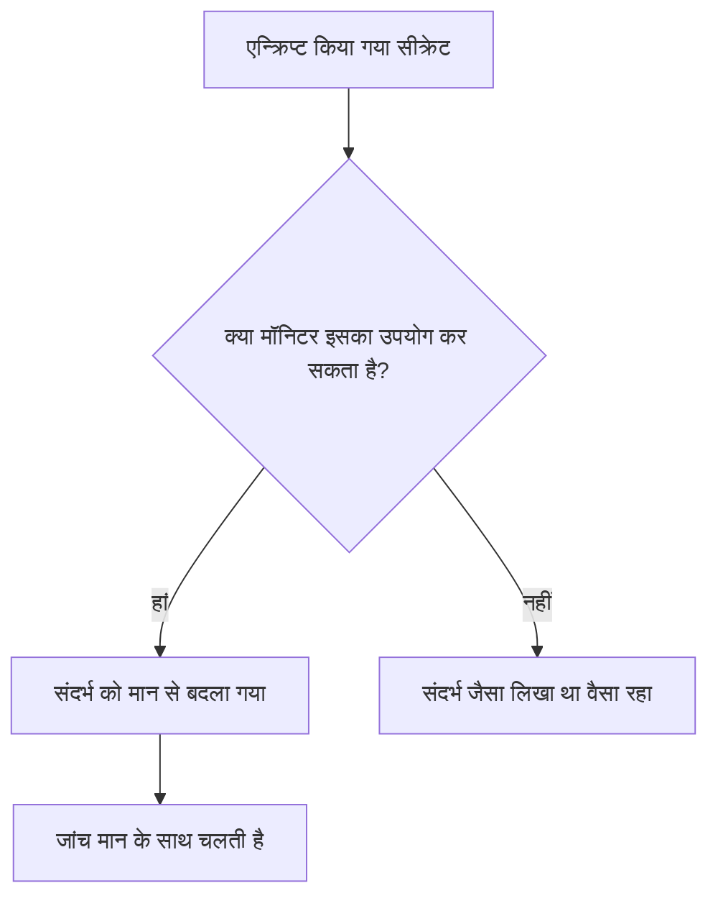

# मॉनिटर रहस्य

मॉनिटर सीक्रेट आपके मॉनिटरों को चाहिए पासवर्ड, API कुंजियों और टोकनों को खुद मॉनिटर से बाहर रखते हैं। आप कोई मान एक बार, एन्क्रिप्ट करके, सहेजते हैं, चुनते हैं कि कौन-से मॉनिटर उसका उपयोग कर सकते हैं, और जहां भी मॉनिटर को उसकी ज़रूरत हो, उसे `{{monitorSecrets.NAME}}` के रूप में संदर्भित करते हैं।

:::cards
- [सीक्रेट जोड़ें](#सीक्रेट-जोड़ना): कोई मान सहेजें और चुनें कि उसका उपयोग कौन कर सकता है।
- [एक्सेस चुनें](#चुनना-कि-कौन-से-मॉनिटर-किसी-सीक्रेट-का-उपयोग-कर-सकते-हैं): सभी मॉनिटर, विशिष्ट मॉनिटर, या लेबल वाले मॉनिटर।
- [सीक्रेट का उपयोग करें](#सीक्रेट-का-उपयोग-करना): `{{monitorSecrets.NAME}}` कहां काम करता है।
:::

## सीक्रेट मॉनिटर तक कैसे पहुंचते हैं

सीक्रेट एन्क्रिप्ट करके संग्रहीत किया जाता है और सहेजने के बाद फिर कभी नहीं दिखाया जाता। किसी मॉनिटर को प्रोब को सौंपने से पहले, OneUptime हर उस संदर्भ को डिक्रिप्ट किए गए मान से बदल देता है जिसका मॉनिटर उपयोग कर सकता है; जिस संदर्भ का मॉनिटर उपयोग नहीं कर सकता, वह वैसा ही रहता है जैसा लिखा गया।

जांच चलाने वाले प्रोब को मान मिलता है, इसलिए सीक्रेट का उपयोग करने वाले मॉनिटर को उन प्रोब पर चलना चाहिए जिन पर आप भरोसा करते हैं: OneUptime के अपने प्रोब, या कोई [कस्टम प्रोब](/docs/probe/custom-probe) जिसे आप खुद चलाते हैं।

## शुरू करने से पहले

- **Growth प्लान या उससे ऊपर**, OneUptime Cloud पर। सेल्फ़-होस्टेड इंस्टॉल में कोई प्लान नहीं होते।
- **ऐसी भूमिका जो सीक्रेट प्रबंधित कर सके**: Project Owner, Project Admin, या Create Monitor Secret अनुमति वाली कोई कस्टम भूमिका।

## सीक्रेट के साथ काम करें

### सीक्रेट जोड़ना

:::steps
1. **मॉनिटर → सेटिंग्स → सीक्रेट** पर जाएं और **मॉनिटर गुप्त बनाएँ** पर क्लिक करें।
2. **नाम** और **सीक्रेट मान** डालें। नाम वह है जिसे आप संदर्भित करते हैं, जैसे `ApiKey`। इसमें केवल अक्षर, अंक, हाइफ़न (`-`) और अंडरस्कोर (`_`) हो सकते हैं, और किसी प्रोजेक्ट में दो सीक्रेट का नाम एक नहीं हो सकता।
3. **एक्सेस** चरण में चुनें कि कौन-से मॉनिटर इसका उपयोग कर सकते हैं (अगला खंड देखें), फिर **मॉनिटर गुप्त बनाएँ** पर क्लिक करें।
:::

> [!IMPORTANT]
> सीक्रेट एन्क्रिप्ट किए जाते हैं और सुरक्षित रूप से संग्रहीत होते हैं। सीक्रेट मान सहेजे जाने के बाद फिर कभी नहीं दिखाया जाता — न तालिका में, न संपादन फ़ॉर्म में, और न API से। अगर मान खो जाए, तो आपको उसे वहीं से दोबारा लेना होगा जहां से वह आया था और फिर से सेट करना होगा। किसी सीक्रेट को रोटेट करने के लिए उसकी पंक्ति पर **सीक्रेट मान अपडेट करें** बटन का उपयोग करें; उसे हटाकर फिर से बनाने की ज़रूरत नहीं है।

### चुनना कि कौन-से मॉनिटर किसी सीक्रेट का उपयोग कर सकते हैं

हर सीक्रेट के पास तीन एक्सेस विकल्पों में से एक होता है:

| विकल्प | कौन-से मॉनिटर सीक्रेट का उपयोग कर सकते हैं | किसके लिए |
| --- | --- | --- |
| **सभी मॉनिटर** | प्रोजेक्ट का हर मॉनिटर, बाद में बनाए जाने वाले मॉनिटर भी। | ऐसा क्रेडेंशियल जिसे कई मॉनिटर साझा करते हैं। |
| **विशिष्ट मॉनिटर** | केवल वे मॉनिटर जिन्हें आप चुनते हैं। यह डिफ़ॉल्ट है, और इन विकल्पों के आने से पहले बने सीक्रेट इसी तरह काम करते हैं। | एक या कुछ मॉनिटरों के लिए क्रेडेंशियल। |
| **लेबल वाले मॉनिटर** | ऐसे मॉनिटर जिनमें आपके चुने लेबल में से कम से कम एक हो। किसी मॉनिटर में उनमें से कोई लेबल जोड़ने पर उसे एक्सेस मिल जाता है, और लेबल हटाने पर मॉनिटर के अगले रन से एक्सेस हट जाता है। | समय के साथ बदलने वाले मॉनिटरों के समूह के लिए क्रेडेंशियल। |

आप सीक्रेट की पंक्ति पर **संपादित करें** से कभी भी विकल्प बदल सकते हैं। केवल चुने गए विकल्प की सूची रखी जाती है: **सभी मॉनिटर** पर जाने से सीक्रेट की मॉनिटर और लेबल सूचियां खाली हो जाती हैं, और **विशिष्ट मॉनिटर** व **लेबल वाले मॉनिटर** के बीच बदलने पर वह सूची खाली हो जाती है जिससे आप हटे।

कोई सीक्रेट किसी दूसरे प्रोजेक्ट के मॉनिटरों को कभी उपलब्ध नहीं होता।

> [!WARNING]
> जो कोई भी ऐसे मॉनिटर को संपादित कर सकता है जो किसी सीक्रेट का उपयोग कर सकता है, वह उस सीक्रेट को कहीं भी भेज सकता है जहां मॉनिटर कनेक्ट होता है। **सभी मॉनिटर** के साथ, इसमें वे सभी शामिल हैं जो प्रोजेक्ट में मॉनिटर बना या संपादित कर सकते हैं। **लेबल वाले मॉनिटर** के साथ, इसमें वे सभी भी शामिल हैं जो किसी मॉनिटर में उनमें से कोई लेबल जोड़ सकते हैं।

API में एक्सेस विकल्प `monitorAccess` फ़ील्ड है: `All Monitors`, `Specific Monitors` या `Monitors With Labels`। `monitors` और `labels` फ़ील्ड में सूचियां होती हैं। `monitorAccess` के बिना बनाए गए सीक्रेट को `Specific Monitors` मिलता है।

### सीक्रेट का उपयोग करना

सीक्रेट का उपयोग करने के लिए, सीक्रेट स्वीकार करने वाले फ़ील्ड में `{{monitorSecrets.SECRET_NAME}}` लिखें। उदाहरण के लिए, `Authorization: Bearer {{monitorSecrets.ApiKey}}` वाला अनुरोध हेडर `ApiKey` सीक्रेट का मान भेजता है।

ये मॉनिटर प्रकार और फ़ील्ड सीक्रेट स्वीकार करते हैं:

| मॉनिटर प्रकार | फ़ील्ड |
| --- | --- |
| API | URL, अनुरोध के हेडर और बॉडी, और क्लाइंट प्रमाणपत्र, निजी कुंजी और पासफ़्रेज़ (mTLS) |
| वेबसाइट | URL, और क्लाइंट प्रमाणपत्र, निजी कुंजी और पासफ़्रेज़ (mTLS) |
| Ping, IP, पोर्ट, NTP, SSL Certificate | जांचा जाने वाला होस्ट या URL |
| DNS | डोमेन नाम और DNS सर्वर |
| DNSSEC, डोमेन | डोमेन नाम |
| SQL Query | होस्ट, डेटाबेस नाम, उपयोगकर्ता नाम, पासवर्ड और क्वेरी |
| Database Health | होस्ट, डेटाबेस नाम, उपयोगकर्ता नाम और पासवर्ड |
| External Status Page | स्थिति पृष्ठ का URL |
| Synthetic Monitor, Custom JavaScript Code | स्क्रिप्ट |
| Network Device | SNMP कम्युनिटी स्ट्रिंग, और SNMPv3 की प्रमाणीकरण व गोपनीयता कुंजियां |

Synthetic Monitor या Custom JavaScript Code मॉनिटर की स्क्रिप्ट चलने से पहले सीक्रेट भर दिए जाते हैं, इसलिए स्क्रिप्ट के अंदर `{{monitorSecrets.ApiKey}}` जैसा संदर्भ चलते समय डिक्रिप्ट किया गया मान होता है।

अगर कोई मॉनिटर ऐसे सीक्रेट को संदर्भित करता है जिसका वह उपयोग नहीं कर सकता, तो संदर्भ जैसा है वैसा ही रहता है और मान से नहीं बदला जाता।

जब आप किसी मॉनिटर को सहेजने से पहले उसका परीक्षण करते हैं, तो केवल **सभी मॉनिटर** के लिए उपलब्ध सीक्रेट भरे जाते हैं, क्योंकि नया मॉनिटर अभी किसी सूची में नहीं है और उसके कोई लेबल नहीं हैं। मॉनिटर सहेजने के बाद, परीक्षण हर उस सीक्रेट का उपयोग करते हैं जिसका मॉनिटर उपयोग कर सकता है।

## समस्या निवारण

:::details मॉनिटर `{{monitorSecrets.NAME}}` को ज्यों का त्यों भेजता है
मॉनिटर सीक्रेट का उपयोग नहीं कर सकता, या नाम मेल नहीं खाता। सीक्रेट की पंक्ति पर **संपादित करें** से उसका एक्सेस विकल्प जांचें, और यह भी कि संदर्भ में नाम ठीक वही है जो सीक्रेट का नाम है।
:::

:::details नए मॉनिटर का परीक्षण करते समय सीक्रेट नहीं भरा जाता
मॉनिटर सहेजे जाने से पहले केवल **सभी मॉनिटर** के लिए उपलब्ध सीक्रेट भरे जाते हैं। मॉनिटर सहेजें, फिर दोबारा परीक्षण करें।
:::

:::details कोई फ़ील्ड सीक्रेट को अनदेखा करता है
केवल ऊपर की तालिका के फ़ील्ड सीक्रेट स्वीकार करते हैं। किसी भी दूसरे फ़ील्ड में `{{monitorSecrets.NAME}}` वैसा ही भेजा जाता है जैसा लिखा गया।
:::

## अगले कदम

:::cards
- [API मॉनिटर](/docs/monitor/api-monitor): अनुरोध हेडर में सीक्रेट भेजें।
- [सिंथेटिक मॉनिटर](/docs/monitor/synthetic-monitor): ब्राउज़र स्क्रिप्ट के अंदर सीक्रेट का उपयोग करें।
- [SQL क्वेरी मॉनिटर](/docs/monitor/sql-monitor): डेटाबेस पासवर्ड को एन्क्रिप्टेड रखें।
:::
