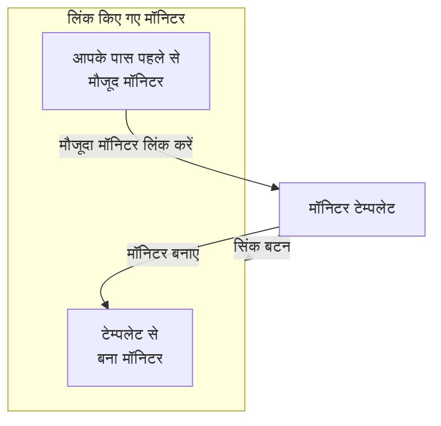

# मॉनिटर टेम्पलेट

मॉनिटर टेम्पलेट एक सहेजा हुआ मॉनिटर कॉन्फ़िगरेशन है (प्रकार, मानदंड, अंतराल, लेबल और कस्टम फ़ील्ड के डिफ़ॉल्ट), जिससे आप एक क्लिक में मॉनिटर बनाते हैं। उससे बनाए गए या उससे लिंक किए गए मॉनिटर जुड़े रहते हैं: टेम्पलेट बदलें, फिर उस बदलाव को उन सभी में सिंक करें। टेम्पलेट का उपयोग तब करें जब कई मॉनिटरों को एक जैसा व्यवहार करना हो, जैसे हर सेवा पर एक ही हेल्थ चेक, या प्रोडक्शन और स्टेजिंग में एक जैसी API जांचें।

:::cards
- [टेम्पलेट बनाएं](#टेम्पलेट-बनाएं): मॉनिटर बनाने की तरह चार चरण।
- [उससे मॉनिटर बनाएं](#टेम्पलेट-से-मॉनिटर-बनाएं): एक क्लिक में, या पहले से मौजूद मॉनिटर लिंक करें।
- [बदलाव सिंक करें](#लिंक-किए-गए-मॉनिटरों-में-बदलाव-सिंक-करें): हर सिंक बटन क्या कॉपी करता है।
- [हर मॉनिटर के अपने मान रखें](#हर-मॉनिटर-के-अपने-मान-रखें): किसी डेस्टिनेशन या हेडर को सिंक से बचाएं।
:::

## टेम्पलेट कैसे काम करते हैं

टेम्पलेट खुद किसी चीज़ पर नज़र नहीं रखता। मॉनिटर उससे बनाए जाते हैं या उससे लिंक किए जाते हैं, और टेम्पलेट का पेज उन्हें **लिंक किए गए मॉनिटर** के रूप में दिखाता है। टेम्पलेट बदलने पर, जब तक आप सिंक नहीं करते, उन मॉनिटरों में कुछ नहीं बदलता: हर सिंक बटन टेम्पलेट का एक हिस्सा हर लिंक किए गए मॉनिटर पर कॉपी करता है, और जिन फ़ील्ड को आप सुरक्षित करते हैं वे हर मॉनिटर का अपना मान रखती हैं।



## शुरू करने से पहले

- **ऐसी भूमिका जो टेम्पलेट बना सके**: Project Owner, Project Admin, Project Member, Monitor Admin या Monitor Member, या Create Monitor Template अनुमति वाली कोई कस्टम भूमिका। टेम्पलेट बदलने के लिए यही भूमिकाएं, या Edit Monitor Template अनुमति चाहिए।
- **लिंक किए गए मॉनिटर अपडेट करने की अनुमति।** सिंक हर लिंक किए गए मॉनिटर में आपके नाम से लिखता है, और उन मॉनिटरों को छोड़ देता है जिन तक आपकी अनुमतियां नहीं पहुंचतीं।

## टेम्पलेट बनाएं

:::steps
### टेम्पलेट की सूची खोलें

**मॉनिटर → सेटिंग्स → टेम्पलेट** पर जाएं और **मॉनिटर टेम्पलेट बनाएँ** पर क्लिक करें।

### टेम्पलेट का नाम रखें

**टेम्पलेट जानकारी** पर, **टेम्पलेट नाम** डालें, जैसे `Production API Health`, और **टेम्पलेट विवरण** डालें, फिर **अगला** पर क्लिक करें।

### मॉनिटर डिफ़ॉल्ट सेट करें

**मॉनिटर डिफ़ॉल्ट** पर, मॉनिटर बनाने वाले फ़ॉर्म जैसे ही चुनने वाले से **मॉनिटर प्रकार** चुनें। चाहें तो **डिफ़ॉल्ट मॉनिटर नाम** डालें; खाली छोड़ने पर हर मॉनिटर का नाम उस संसाधन पर रखा जाता है जिस पर वह नज़र रखता है। **डिफ़ॉल्ट मॉनिटर विवरण** और **लेबल** **और फ़ील्ड** में मिलते हैं। **अगला** पर क्लिक करें।

### मानदंड और अंतराल सेट करें

**मानदंड** पर, क्या जांचना है और मानदंड भरें, जैसे [मॉनिटर बनाना](/docs/monitor/create-monitor#मानदंड) में। सबसे ऊपर का **Template sync settings** कार्ड आपको फ़ील्ड को सिंक से बचाने देता है ([हर मॉनिटर के अपने मान रखें](#हर-मॉनिटर-के-अपने-मान-रखें) देखें)। जिन मॉनिटर प्रकारों की जांच प्रोब करते हैं, उनके लिए आखिरी चरण, **अंतराल**, **निगरानी अंतराल** पूछता है। आखिरी चरण पर **मॉनिटर टेम्पलेट बनाएँ** पर क्लिक करें।
:::

टेम्पलेट सूची में जुड़ जाता है। उसका पेज देखने के लिए उसे खोलें, जिसमें हर हिस्से के लिए एक कार्ड है: **टेम्पलेट जानकारी**, **मॉनिटर डिफ़ॉल्ट**, **निगरानी मानदंड**, **निगरानी अंतराल** (**न्यूनतम प्रोब सहमति** के साथ), **लेबल**, **Custom Field Defaults** (जब प्रोजेक्ट में मॉनिटर कस्टम फ़ील्ड हों) और **लिंक किए गए मॉनिटर**। हर हिस्सा उसके अपने कार्ड पर बदला जाता है, जैसे **मानदंड संपादित करें** या **अंतराल संपादित करें** से।

## टेम्पलेट से मॉनिटर बनाएं

- **नया मॉनिटर।** सूची में टेम्पलेट की पंक्ति पर **मॉनिटर बनाएं** पर क्लिक करें, या उसके पेज पर **टेम्पलेट से मॉनिटर बनाएँ** पर। **मॉनिटर बनाएं** टेम्पलेट के प्रकार और सेटिंग्स भरकर खुलता है; जो चाहिए वह बदलें, फिर उसे बनाएं। नया मॉनिटर टेम्पलेट से लिंक हो जाता है।
- **पहले से मौजूद मॉनिटर।** **लिंक किए गए मॉनिटर** में, **मौजूदा मॉनिटर लिंक करें** पर क्लिक करें और उन्हें चुनें। सिंक करने तक वे अपनी सेटिंग्स रखते हैं।

**Custom Field Defaults** में सेट किए गए कस्टम फ़ील्ड मान टेम्पलेट से बने हर मॉनिटर पर लिखे जाते हैं, उन मॉनिटरों पर भी जिन्हें ऑटो-इम्पोर्ट नियम और अलर्ट नीतियां उससे बनाती हैं।

## लिंक किए गए मॉनिटरों में बदलाव सिंक करें

टेम्पलेट संपादित करने से केवल टेम्पलेट बदलता है। किसी बदलाव को लिंक किए गए मॉनिटरों पर कॉपी करने के लिए, जिस कार्ड को आपने बदला है उस पर का सिंक बटन इस्तेमाल करें। हर बटन बताता है कि वह कितने मॉनिटरों तक पहुंचता है, जैसे **Sync Criteria to 3 Linked Monitors**, और जब तक कुछ लिंक न हो, वह धूसर रहता है। सिंक को पूर्ववत नहीं किया जा सकता।

| बटन | हर लिंक किए गए मॉनिटर पर क्या कॉपी करता है | क्या नहीं छूता |
| --- | --- | --- |
| **लिंक किए गए मॉनिटर के साथ मानदंड सिंक करें** | मानदंड और चरण सेटिंग्स, जैसे डेस्टिनेशन और अनुरोध विकल्प, सुरक्षित फ़ील्ड को छोड़कर | निगरानी अंतराल, न्यूनतम प्रोब सहमति, नाम, विवरण, लेबल और कस्टम फ़ील्ड मान |
| **लिंक किए गए मॉनिटर के साथ सिंक अंतराल** | निगरानी अंतराल और न्यूनतम प्रोब सहमति | मानदंड, नाम, विवरण, लेबल और कस्टम फ़ील्ड मान |
| **लिंक किए गए मॉनिटर के साथ लेबल सिंक करें** | केवल लेबल | बाकी सब |
| **Sync Custom Fields to Linked Monitors** | वे कस्टम फ़ील्ड जिनका टेम्पलेट में डिफ़ॉल्ट है, हर मॉनिटर का पहले वाला मान बदलकर | वे कस्टम फ़ील्ड जिन्हें टेम्पलेट खाली छोड़ता है, और बाकी सब |

एक मॉनिटर सिंक करने के लिए, **लिंक किए गए मॉनिटर** में उसकी पंक्ति पर **टेम्पलेट से सिंक करें** पर क्लिक करें। यह मानदंड और चरण सेटिंग्स (सुरक्षित फ़ील्ड को छोड़कर), निगरानी अंतराल, न्यूनतम प्रोब सहमति और लेबल कॉपी करता है, और मॉनिटर का नाम, विवरण और कस्टम फ़ील्ड मान जस के तस छोड़ देता है। **टेम्पलेट से अनलिंक करें** मॉनिटर को टेम्पलेट से अलग कर देता है; मॉनिटर अपनी सेटिंग्स रखता है।

सिंक के बाद एक सारांश बताता है कि कितने मॉनिटर अपडेट हुए। **आंशिक रूप से सिंक किया गया** का मतलब है कि कुछ लिंक किए गए मॉनिटरों में अब भी पिछला कॉन्फ़िगरेशन है, आमतौर पर इसलिए कि आपकी अनुमतियां उन तक नहीं पहुंचतीं।

## हर मॉनिटर के अपने मान रखें

मानदंड सिंक, जब तक आप उन फ़ील्ड को सुरक्षित न करें, डेस्टिनेशन, अनुरोध हेडर और टाइमआउट जैसी चरण सेटिंग्स भी कॉपी करता है। किसी फ़ील्ड को सुरक्षित करें ताकि हर लिंक किया गया मॉनिटर उसके लिए अपना मान रखे।

:::steps
### टेम्पलेट खोलें

**मॉनिटर → सेटिंग्स → टेम्पलेट** पर जाएं और टेम्पलेट खोलें।

### उसके मानदंड संपादित करें

**निगरानी मानदंड** कार्ड पर, **मानदंड संपादित करें** पर क्लिक करें।

### फ़ील्ड सुरक्षित करें

**Template sync settings** में, हर उस फ़ील्ड के पास **Do not sync this field** चुनें जिसे आप लिंक किए गए मॉनिटरों पर रखना चाहते हैं।

### सहेजें

अपने बदलाव सहेजें। **निगरानी मानदंड** कार्ड, और नीचे के दोनों सिंक की पुष्टि, सुरक्षित फ़ील्ड की सूची दिखाते हैं।

### सिंक करें

**लिंक किए गए मॉनिटर के साथ मानदंड सिंक करें** का उपयोग करें, या किसी एक लिंक किए गए मॉनिटर पर **टेम्पलेट से सिंक करें** का।
:::

उदाहरण के लिए, किसी API टेम्पलेट पर **Monitor destination** और **Request headers** सुरक्षित करें। प्रोडक्शन और स्टेजिंग मॉनिटर अपने-अपने URL और हेडर रखते हैं, जबकि दोनों को टेम्पलेट के अपडेट किए गए मानदंड और दूसरी असुरक्षित सेटिंग्स मिलती हैं।

उपलब्ध विकल्प मॉनिटर प्रकार पर निर्भर करते हैं। इनमें डेस्टिनेशन और पोर्ट, HTTP अनुरोध विकल्प, डेटाबेस कनेक्शन, DNS सेटिंग्स, इन्फ्रास्ट्रक्चर सेलेक्टर और टेलीमेट्री क्वेरी शामिल हैं। आपस में जुड़े क्रेडेंशियल, जैसे क्लाइंट प्रमाणपत्र और उसकी निजी कुंजी, साथ में रखे जाते हैं।

### बहिष्करण कैसे व्यवहार करते हैं

- चुनी गई फ़ील्ड हर मौजूदा मॉनिटर का मौजूदा मान रखती हैं, खाली या सेट न किए गए मान सहित। अनुरोध हेडर और दूसरे संग्रह पूरे के पूरे रखे जाते हैं।
- बिना चुनी फ़ील्ड टेम्पलेट से सिंक होती रहती हैं। किसी सुरक्षित फ़ील्ड को अनचेक करके सहेजें, ताकि अगले सिंक पर उसका टेम्पलेट वाला मान कॉपी हो।
- बहिष्करण बल्क और एक-एक मॉनिटर वाले, दोनों सिंक पर लागू होते हैं। वे टेम्पलेट पर सहेजे जाते हैं, हर सिंक के लिए अलग से नहीं चुने जाते।
- नए मॉनिटर अब भी टेम्पलेट के फ़ील्ड मानों से शुरू होते हैं। बहिष्करण केवल मौजूदा मॉनिटरों में सिंक को प्रभावित करते हैं।
- मानदंड हमेशा सिंक होते हैं। केवल मानदंड का सिंक निगरानी अंतराल, लेबल और मॉनिटर स्तर की दूसरी सेटिंग्स को नहीं छूता।
- मौजूदा टेम्पलेट में तब तक कोई फ़ील्ड बहिष्करण नहीं होता जब तक आप उसे कॉन्फ़िगर न करें। Network Device मॉनिटर अपने डिवाइस बाइंडिंग को अपने आप रखते रहते हैं।

कई चरणों वाले टेम्पलेट में, सुरक्षित मान चरण ID से मिलाए जाते हैं। अलग से बनाए गए एक-चरण वाले मॉनिटर भी एक-चरण वाला टेम्पलेट ले सकते हैं। अगर किसी सुरक्षित चरण का मिलान नहीं हो पाता, तो किसी भी मॉनिटर के अपडेट होने से पहले सिंक अस्वीकार हो जाता है, ताकि कोई नया या क्रम बदला हुआ चरण गलती से किसी दूसरे चरण का डेस्टिनेशन या क्रेडेंशियल कॉपी न कर दे।

> [!IMPORTANT]
> सहेजे गए टेम्पलेट का मॉनिटर प्रकार (**मॉनिटर डिफ़ॉल्ट संपादित करें** से) बदलने से पहले, **मानदंड संपादित करें** में वे बहिष्करण हटा दें जो नए प्रकार पर लागू नहीं होते। टेम्पलेट के सभी बहिष्करण उसके मॉनिटर प्रकार में मौजूद होने चाहिए।

## API से कॉन्फ़िगरेशन

हर टेम्पलेट चरण अपने `MonitorStep.value` ऑब्जेक्ट में एक `doNotSyncFields` ऐरे लेता है। किसी API मॉनिटर का डेस्टिनेशन और पूरा हेडर संग्रह इस तरह सुरक्षित करें:

```json title="monitorSteps (excerpt)"
{
  "_type": "MonitorSteps",
  "value": {
    "monitorStepsInstanceArray": [
      {
        "_type": "MonitorStep",
        "value": {
          "id": "<step id>",
          "doNotSyncFields": ["monitorDestination", "requestHeaders"]
        }
      }
    ]
  }
}
```

हर समर्थित चरण सेटिंग सिंक करने के लिए ऐरे को छोड़ दें या उसे `[]` पर सेट करें। असमर्थित फ़ील्ड नाम और वे फ़ील्ड जो टेम्पलेट के मॉनिटर प्रकार पर लागू नहीं होतीं, अस्वीकार कर दी जाती हैं। सिंक को टेम्पलेट का ऐरे नियंत्रित करता है; लिंक किए गए मॉनिटर पर ऐसा कोई भी मेटाडेटा उसे नहीं बदलता।

:::details मॉनिटर प्रकार के अनुसार doNotSyncFields के फ़ील्ड नाम
| मॉनिटर प्रकार | फ़ील्ड नाम |
| --- | --- |
| वेबसाइट, API, Ping, IP, पोर्ट, SSL Certificate, NTP | `monitorDestination`, `requestTimeoutInMs`, `retryCount` |
| केवल API | `requestHeaders`, `requestType`, `requestBody` |
| वेबसाइट और API | `doNotFollowRedirects`, `allowSelfSignedCertificates`, `tlsClientAuthentication` (क्लाइंट प्रमाणपत्र, कुंजी और पासफ़्रेज़ एक साथ) |
| पोर्ट, NTP | `monitorDestinationPort` |
| Synthetic Monitor, Custom JavaScript Code | `customCode` |
| Synthetic Monitor | `browserTypes`, `screenSizeTypes`, `retryCountOnError` |
| DNS | `dnsMonitor.queryName`, `dnsMonitor.recordType`, `dnsMonitor.resolver` (DNS सर्वर और पोर्ट एक साथ), `dnsMonitor.timeout`, `dnsMonitor.retries` |
| डोमेन | `domainMonitor.domainName`, `domainMonitor.lookupMethod`, `domainMonitor.timeout`, `domainMonitor.retries` |
| DNSSEC | `dnssecMonitor.domainName`, `dnssecMonitor.resolvers`, `dnssecMonitor.checkNameserverConsistency`, `dnssecMonitor.signatureExpiryWarningDays`, `dnssecMonitor.timeout`, `dnssecMonitor.retries` |
| SQL Query | `sqlMonitor.connection`, `sqlMonitor.connectionTimeoutInMs`, `sqlMonitor.statementTimeoutInMs`, `sqlMonitor.query`, `sqlMonitor.maxRows` |
| Database Health | `databaseMonitor.connection`, `databaseMonitor.connectionTimeoutInMs`, `databaseMonitor.statementTimeoutInMs`, `databaseMonitor.enabledMetricGroups` |
| External Status Page | `externalStatusPageMonitor.statusPageUrl`, `externalStatusPageMonitor.provider`, `externalStatusPageMonitor.components`, `externalStatusPageMonitor.timeout`, `externalStatusPageMonitor.retries` |
| लॉग, Security Events, ट्रेस, AI / LLM, मेट्रिक्स, अपवाद | `logMonitor`, `securityEventsMonitor`, `traceMonitor`, `llmMonitor`, `metricMonitor`, `exceptionMonitor` (मॉनिटर का पूरा कॉन्फ़िगरेशन) |

इन्फ्रास्ट्रक्चर मॉनिटर (Kubernetes, Docker Container, होस्ट, Podman Container, Proxmox, Docker Swarm, Ceph, स्टोरेज ऐरे, IoT Device) अपना संसाधन सेलेक्टर, फ़िल्टर (होस्ट को छोड़कर), मेट्रिक क्वेरी और क्वेरी टाइम विंडो सुरक्षित करने देते हैं। उनके नाम उस प्रकार के टेम्पलेट पर **Template sync settings** में दिखते हैं।
:::

## समस्या निवारण

:::details सिंक "आंशिक रूप से सिंक किया गया" दिखाता है
कुछ लिंक किए गए मॉनिटर अपडेट नहीं हुए, आमतौर पर इसलिए कि आपकी अनुमतियां उन तक नहीं पहुंचतीं। किसी ऐसे व्यक्ति से सिंक दोबारा चलाने को कहें जो हर लिंक किए गए मॉनिटर को अपडेट कर सकता हो।
:::

:::details सिंक "a template step cannot be matched to an existing monitor step" के साथ विफल होता है
किसी सुरक्षित फ़ील्ड का मिलान किसी एक मॉनिटर के चरण से नहीं हो सका, इसलिए सिंक किसी भी मॉनिटर को बदलने से पहले रुक गया। टेम्पलेट के चरणों को मॉनिटरों के चरणों जैसी ही ID दें, या एक-चरण वाले मॉनिटरों के साथ एक-चरण वाला टेम्पलेट इस्तेमाल करें।
:::

:::details सिंक बटन धूसर हैं
अभी तक कोई मॉनिटर टेम्पलेट से लिंक नहीं है। उससे एक मॉनिटर बनाएं, या **लिंक किए गए मॉनिटर** में **मौजूदा मॉनिटर लिंक करें** पर क्लिक करें।
:::

:::details सहेजना "Unsupported do not sync field" के साथ विफल होता है
`doNotSyncFields` में कोई नाम टेम्पलेट के मॉनिटर प्रकार की फ़ील्ड नहीं है। उसे ऊपर दिए फ़ील्ड नामों से मिलाकर देखें।
:::

## अगले कदम

:::cards
- [मॉनिटर बनाना](/docs/monitor/create-monitor): वह फ़ॉर्म जिसे टेम्पलेट भरता है।
- [API मॉनिटर](/docs/monitor/api-monitor): वे सेटिंग्स जो API टेम्पलेट में होती हैं।
- [मॉनिटर रहस्य](/docs/monitor/monitor-secrets): क्रेडेंशियल कॉपी किए बिना उन्हें कई मॉनिटरों में साझा करें।
- [Terraform मॉनिटर चरण](/docs/terraform/monitor-steps): मॉनिटर और उनके चरणों को कोड के रूप में प्रबंधित करें।
:::
