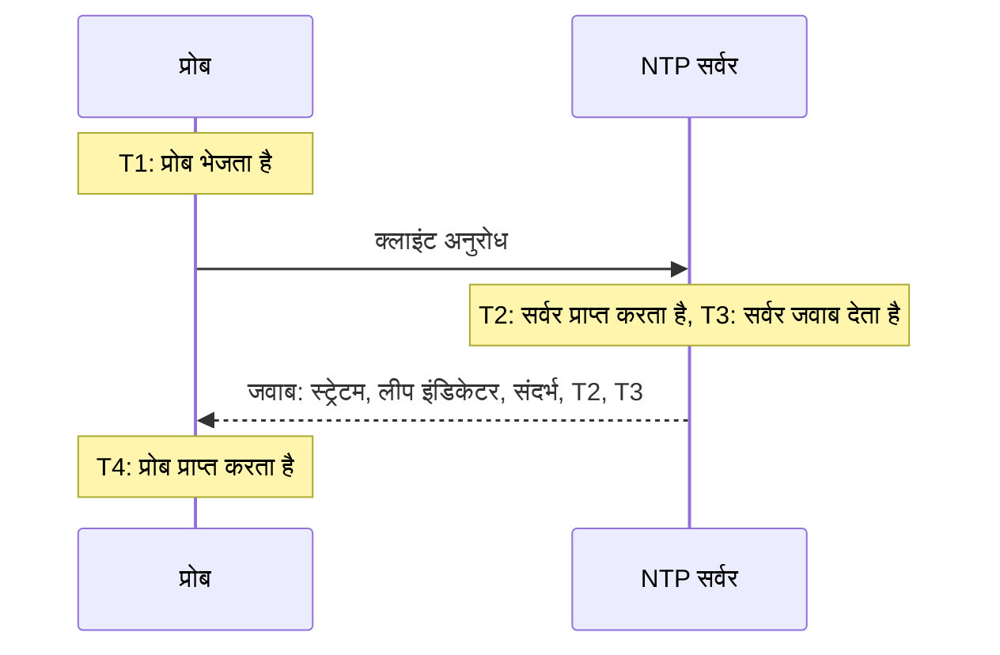

# NTP मॉनिटर

NTP मॉनिटर जांचता है कि कोई टाइम सर्वर UDP पोर्ट 123 पर जवाब देता है और सही समय देता है: कि वह सिंक्रनाइज़ है, एक उचित स्ट्रेटम पर है, और उसकी घड़ी प्रोब की घड़ी से मेल खाती है। इसका उपयोग उन टाइम सर्वरों के लिए करें जिन्हें आप खुद चलाते हैं, जैसे डेटा सेंटर में GPS घड़ी या वे आंतरिक सर्वर जिनसे आपकी मशीनें सिंक होती हैं, और उन सार्वजनिक सर्वरों के लिए भी जिन पर आप निर्भर हैं।

:::cards
- [मॉनिटर बनाएं](#ntp-मॉनिटर-बनाएं): डैशबोर्ड में छह चरण।
- [जांच क्या पढ़ती है](#जांच-क्या-पढ़ती-है): स्ट्रेटम, घड़ी का अंतर, लीप इंडिकेटर और जवाब का बाकी हिस्सा।
- [निगरानी मानदंड](#निगरानी-मानदंड): पहुंच, सिंक्रनाइज़ेशन, स्ट्रेटम और अंतर।
- [समस्या निवारण](#समस्या-निवारण): जब सर्वर चल रहा हो, लेकिन मॉनिटर कुछ और कहे।
:::

## यह कैसे काम करता है

हर जांच में, एक प्रोब किसी रैंडम लोकल पोर्ट से सर्वर के UDP पोर्ट पर एक SNTP क्लाइंट अनुरोध (NTP संस्करण 4, क्लाइंट मोड) भेजता है और जवाब का इंतज़ार करता है। केवल उसी अनुरोध का असली जवाब गिना जाता है: प्रोब अनुरोध के ट्रांसमिट टाइमस्टैम्प में 64 रैंडम बिट रखता है, और ऐसे किसी भी पैकेट को अनदेखा करता है जो उन्हें वापस नहीं लौटाता, NTP पैकेट से छोटा है, या सर्वर मोड में नहीं है। किसी पिछली जांच का पुराना जवाब, या कोई नकली जवाब, किसी बंद सर्वर को कभी चालू नहीं दिखा सकता।

चारों टाइमस्टैम्प से प्रोब **घड़ी का अंतर** निकालता है, ((T2 − T1) + (T3 − T4)) / 2: सर्वर की घड़ी प्रोब की घड़ी से कितनी दूर है। धनात्मक अंतर का मतलब है कि सर्वर आगे चल रहा है। यह सूत्र मानता है कि अनुरोध और जवाब में बराबर समय लगता है, इसलिए जो रास्ता एक दिशा में बहुत धीमा है, वह अंतर को राउंड ट्रिप के आधे तक बिगाड़ सकता है।

> [!NOTE]
> अंतर प्रोब की अपनी घड़ी के सापेक्ष मापा जाता है। OneUptime Cloud के प्रोब अपनी घड़ियों को सिंक्रनाइज़ रखते हैं। [कस्टम प्रोब](/docs/probe/custom-probe) पर, chrony या systemd-timesyncd से होस्ट की घड़ी को भी सिंक्रनाइज़ रखें, नहीं तो अंतर का अलर्ट सर्वर के बजाय प्रोब के बारे में हो सकता है।

जो सर्वर जवाब देता है उससे दोबारा नहीं पूछा जाता, भले ही वह सही समय के बिना जवाब दे। चुप्पी, अस्वीकृत पोर्ट और विफल DNS लुकअप को नए अनुरोध के साथ फिर से आज़माया जाता है। जब सर्वर बिल्कुल जवाब नहीं देता, तो प्रोब उस तक का रूट भी ट्रेस करता है और जो मिला उसे **Network Path at Time of Failure** के रूप में जोड़ता है। जिस प्रोब का अपना नेटवर्क कनेक्शन टूट गया हो, वह कोई परिणाम नहीं भेजता, इसलिए वह आपके सर्वर को ऑफ़लाइन नहीं दिखा सकता।

## शुरू करने से पहले

- **ऐसी भूमिका जो मॉनिटर बना सके**: Project Owner, Project Admin, Project Member, Monitor Admin या Monitor Member, या Create Monitor अनुमति वाली कोई कस्टम भूमिका।
- **ऐसा प्रोब जो सर्वर के UDP पोर्ट 123 तक पहुंच सके।** कोई भी प्रोब किसी सार्वजनिक टाइम सर्वर की जांच कर सकता है। निजी नेटवर्क के सर्वर के लिए, उसी नेटवर्क के अंदर [कस्टम प्रोब](/docs/probe/custom-probe) का उपयोग करें। सर्वर के सामने के फ़ायरवॉल को [OneUptime Cloud के प्रोब IP पतों](/docs/configuration/ip-addresses) से या आपके कस्टम प्रोब से केवल TCP नहीं, बल्कि UDP भी आने देना होगा।

## NTP मॉनिटर बनाएं

:::steps
### नया मॉनिटर शुरू करें

**मॉनिटर** पर जाएं और **मॉनिटर बनाएं** पर क्लिक करें। **मॉनिटर प्रकार** में, खोज बॉक्स में `ntp` लिखें और **NTP** चुनें। यह **और मॉनिटर प्रकार** में नेटवर्क समूह में भी दिखता है।

### नाम दें

**नाम** डालें, जैसे `GPS टाइम सर्वर`, फिर **अगला** पर क्लिक करें।

### सर्वर डालें

**NTP सर्वर** में सर्वर का होस्ट नाम या IP पता डालें, जैसे `time.example.com` या `192.168.1.10`। अनुरोध पोर्ट 123 पर जाता है। दूसरा पोर्ट इस्तेमाल करने के लिए **और फ़ील्ड** खोलें और **पोर्ट** सेट करें।

### जांच कर देखें

**मॉनिटर का परीक्षण करें** पर क्लिक करें, **प्रोब चुनें** में कोई प्रोब चुनें और **परीक्षण चलाएं** पर क्लिक करें। **मॉनिटर परीक्षण परिणाम** दिखाता है कि सर्वर ने जवाब दिया या नहीं, वह सिंक्रनाइज़ है या नहीं, उसका स्ट्रेटम क्या है और उसकी घड़ी कितनी हटी हुई है।

### मानदंड देखें

**मॉनिटर मानदंड** [डिफ़ॉल्ट मानदंड](#डिफ़ॉल्ट-मानदंड) से शुरू होता है: जब सर्वर सही समय नहीं देता तो ऑफ़लाइन, जब देता है तो ऑनलाइन। ज़रूरत हो तो उन्हें बदलें, फिर **अगला** पर क्लिक करें।

### प्रोब चुनें और बनाएं

**प्रोब** और **निगरानी अंतराल** (यह **हर 5 मिनट** से शुरू होता है) रखें या बदलें, फिर **मॉनिटर बनाएं** पर क्लिक करें। मॉनिटर का पेज खुल जाता है।
:::

## कॉन्फ़िगरेशन विकल्प

| फ़ील्ड | डिफ़ॉल्ट | क्या डालें |
| --- | --- | --- |
| **NTP सर्वर** | कोई नहीं | सर्वर, जैसे `time.example.com`, `192.168.1.10` या `2001:db8::123`। केवल होस्ट डालें, `udp://` के बिना। होस्ट के बाद लिखा पोर्ट, जैसे `time.example.com:1123`, **पोर्ट** की जगह इस्तेमाल होता है। |
| **पोर्ट** (**और फ़ील्ड** में) | `123` | वह UDP पोर्ट जिस पर सर्वर NTP का जवाब देता है, `1` से `65535` तक। `123` के लिए इसे खाली छोड़ दें। |
| **अनुरोध टाइमआउट (सेकंड)** (**और फ़ील्ड** में) | `5` | एक प्रयास DNS लुकअप सहित जवाब का कितनी देर इंतज़ार करता है। अधिकतम 60 सेकंड है। |
| **विफलता पर पुनः प्रयास** (**और फ़ील्ड** में) | प्रोब का डिफ़ॉल्ट, आमतौर पर `3` | जिस प्रयास का जवाब नहीं मिला उसे कितनी बार दोहराना है। अधिकतम 3 है। |

**विफलता पर पुनः प्रयास** पहले प्रयास के _बाद_ के पुनः प्रयास गिनता है, इसलिए `0` जांच को एक बार चलाता है और `2` अधिकतम तीन बार, हर प्रयास के बीच एक सेकंड के विराम के साथ। खाली छोड़ने पर प्रोब का डिफ़ॉल्ट इस्तेमाल होता है: 3, जब तक प्रोब का `PROBE_MONITOR_RETRY_LIMIT` कुछ और न कहे।

## जांच क्या पढ़ती है

मॉनिटर का पेज हर प्रोब की सबसे हाल की जांच दिखाता है:

| फ़ील्ड | इसका मतलब |
| --- | --- |
| **सिंक्रनाइज़** | क्या सर्वर ने स्ट्रेटम 1 से 15 पर, अपने लीप इंडिकेटर में अलार्म के बिना, और जवाब में असली टाइमस्टैम्प के साथ जवाब दिया। |
| **घड़ी का अंतर** | सर्वर की घड़ी प्रोब की घड़ी से कितनी दूर है, और किस दिशा में। एक स्वस्थ सर्वर कुछ ही मिलीसेकंड के भीतर रहता है। |
| **स्ट्रेटम** | सर्वर किसी रेफ़रेंस घड़ी से कितने हॉप दूर है: अपने खुद के GPS या परमाणु स्रोत वाले सर्वर के लिए 1, स्ट्रेटम 1 सर्वर से सिंक होने वाले सर्वर के लिए 2, और इसी तरह आगे। 16 का मतलब है सिंक्रनाइज़ नहीं। |
| **संदर्भ** | सर्वर किससे सिंक होता है: स्ट्रेटम 1 पर `GPS`, `PPS` या `NIST` जैसा स्रोत नाम, स्ट्रेटम 2 से आगे ऊपर वाले सर्वर का पता। |
| **लीप इंडिकेटर** | जब कोई लीप सेकंड बाकी न हो तो 0, जब दिन के अंत में एक जोड़ा या हटाया जाएगा तो 1 या 2, जब सर्वर कहे कि उसकी घड़ी सिंक्रनाइज़ नहीं है तो 3। |
| **रूट डिस्पर्शन** | सर्वर का अपना अनुमान कि उसका समय असली समय से कितना दूर हो सकता है। जब तक सर्वर अपने स्रोत तक नहीं पहुंच पाता, यह बढ़ता रहता है। ntpd किसी सर्वर पर भरोसा करना तब छोड़ देता है जब उसके रूट विलंब का आधा और यह मान मिलकर 1.5 सेकंड से ज़्यादा हो जाए। |
| **रूट विलंब** | सर्वर से उसकी रेफ़रेंस घड़ी तक का राउंड ट्रिप। |
| **प्रतिक्रिया समय** | प्रोब के अनुरोध भेजने से जवाब मिलने तक, DNS लुकअप के बिना। |
| **सर्वर समय** | जवाब भेजते समय सर्वर की घड़ी। |

जो सर्वर समय देने से इनकार करता है, वह इसकी जगह एक **kiss-o'-death** भेजता है: स्ट्रेटम 0 पर चार अक्षरों के कोड वाला जवाब। सबसे आम कोड हैं `RATE` (सर्वर प्रोब की दर सीमित करता है), `DENY` और `RSTR` (उसके एक्सेस नियम प्रोब को अस्वीकार करते हैं) और `INIT` (वह अभी सिंक्रनाइज़ नहीं हुआ है)। जांच कोड दिखाती है और सर्वर को जवाब देने वाला लेकिन सिंक्रनाइज़ नहीं मानती है।

## निगरानी मानदंड

मानदंड तय करते हैं कि सर्वर कब ऑनलाइन, डिग्रेडेड या ऑफ़लाइन गिना जाए, और क्या इससे कोई घटना घोषित हो या अलर्ट बने। हर मानदंड एक या अधिक फ़िल्टर जांचता है:

| फ़िल्टर | शर्तें | क्या जांचता है |
| --- | --- | --- |
| **NTP Is Online** | **सही**, **गलत** | क्या सर्वर ने प्रोब के अनुरोध का NTP जवाब दिया। kiss-o'-death भी एक जवाब है। |
| **NTP Is Synchronized** | **सही**, **गलत** | क्या जवाब देने वाला सर्वर सिंक्रनाइज़ समय देता है। जब सर्वर जवाब नहीं देता, तो यह फ़िल्टर नहीं जांचा जाता; उसके लिए **NTP Is Online** का उपयोग करें। |
| **NTP Stratum** | **Greater Than**, **Greater Than Or Equal To**, **Less Than**, **Less Than Or Equal To**, **Equal To**, **Not Equal To** | सर्वर का स्ट्रेटम। kiss-o'-death का 0, 16 यानी सिंक्रनाइज़ नहीं गिना जाता है। |
| **NTP Clock Offset (in ms)** | **Greater Than**, **Less Than**, **Greater Than Or Equal To**, **Less Than Or Equal To** | सर्वर की घड़ी प्रोब की घड़ी से कितनी दूर है, किसी भी दिशा में। |
| **NTP Response Time (in ms)** | **Greater Than**, **Less Than**, **Greater Than Or Equal To**, **Less Than Or Equal To** | अनुरोध से जवाब तक का समय। |
| **NTP Root Dispersion (in ms)** | **Greater Than**, **Less Than**, **Greater Than Or Equal To**, **Less Than Or Equal To** | सर्वर का अपनी अधिकतम त्रुटि का अपना अनुमान। |

दो या अधिक फ़िल्टर होने पर, **मिलान शर्त** तय करती है कि **सभी** का मिलना ज़रूरी है या **कोई भी** एक काफ़ी है। किसी मानदंड की **क्रियाएँ** तय करती हैं कि वह क्या करता है: मॉनिटर की स्थिति बदलना, अलर्ट बनाना, घटना घोषित करना, या इनका कोई भी मेल।

### डिफ़ॉल्ट मानदंड

नया NTP मॉनिटर दो मानदंडों से शुरू होता है:

- **ऑफ़लाइन** — सर्वर जवाब नहीं देता, सिंक्रनाइज़ नहीं है, या उसकी घड़ी प्रोब की घड़ी से `1000` ms या उससे ज़्यादा दूर है। मॉनिटर **ऑफ़लाइन** चिह्नित होता है और "_मॉनिटर का नाम_ is not serving good time" नाम की घटना बनती है। जब सर्वर फिर से सही समय देने लगता है, तो यह अपने आप हल हो जाती है।
- **ऑनलाइन** — सर्वर जवाब देता है, सिंक्रनाइज़ है, और उसकी घड़ी प्रोब की घड़ी से `1000` ms के भीतर है। मॉनिटर **कार्यरत** चिह्नित होता है।

मानदंड ऊपर से नीचे जांचे जाते हैं, और जो पहला मेल खाता है वही तय करता है कि क्या होगा। गलत समय के साथ जवाब देने वाले सर्वर को जानबूझकर बंद माना जाता है: उसका अनुसरण करने वाला हर क्लाइंट भी वही समय ले लेगा।

### एक समयावधि में मूल्यांकन

**इस मानदंड का एक समयावधि के दौरान मूल्यांकन करें** हर NTP फ़िल्टर के नीचे एक चेकबॉक्स है। सबसे हाल की जांच के बजाय पिछली जांचों की एक विंडो के आधार पर फ़ैसला करने के लिए इसे चालू करें: **मूल्यांकन करें** में एक एग्रीगेट चुनें और **पिछले (मिनटों में) के लिए** में 2 से 60 मिनट की विंडो चुनें। केवल उन्हीं जांचों में स्ट्रेटम, अंतर और रूट डिस्पर्शन होता है जिनका सर्वर ने जवाब दिया, इसलिए चुप्पी वाली विंडो में इन फ़िल्टरों के लिए कोई डेटा नहीं होता, और तब **यदि कोई डेटा नहीं** तय करता है कि क्या होगा।

### मानदंड के उदाहरण

| लक्ष्य | फ़िल्टर | शर्त | मान |
| --- | --- | --- | --- |
| जब कोई GPS सर्वर नेटवर्क स्रोत पर लौट आए तो अलर्ट करें | **NTP Stratum** | **Greater Than** | `1` |
| जब घड़ी खिसकने लगे तो अलर्ट करें | **NTP Clock Offset (in ms)** | **Greater Than** | `100` |
| जब सर्वर की त्रुटि सीमा बढ़े तो अलर्ट करें | **NTP Root Dispersion (in ms)** | **Greater Than** | `500` |
| जब जवाब धीमे हो जाएं तो अलर्ट करें | **NTP Response Time (in ms)** | **Greater Than** | `1000` |

## समस्या निवारण

:::details सर्वर चल रहा है, लेकिन मॉनिटर कहता है कि उसने जवाब नहीं दिया
अनुरोध या जवाब रास्ते में गिर गया। ऐसा फ़ायरवॉल जो TCP की अनुमति देता है लेकिन UDP की नहीं, ntpd का `restrict` या chrony का `allow` नियम जिसमें प्रोब का पता शामिल नहीं है, या ऐसा सर्वर जो केवल किसी आंतरिक इंटरफ़ेस पर सुनता है, ये सभी ऐसे ही दिखते हैं। **Network Path at Time of Failure** दिखाता है कि रूट कहां तक पहुंचा। प्रोब को आने दें, या नेटवर्क के अंदर किसी [कस्टम प्रोब](/docs/probe/custom-probe) से सर्वर की जांच करें।
:::

:::details मॉनिटर कहता है कि सर्वर ने अनुरोध अस्वीकार कर दिया
होस्ट ने जवाब दिया कि उस UDP पोर्ट पर कुछ भी नहीं सुन रहा है (ICMP port unreachable): NTP सेवा बंद है, या वह किसी दूसरे पोर्ट पर सुनती है। सेवा शुरू करें, या **पोर्ट** को उस पोर्ट पर सेट करें जिसे वह इस्तेमाल करती है।
:::

:::details सर्वर kiss-o'-death के साथ जवाब देता है
`RATE` का मतलब है कि सर्वर प्रोब की दर सीमित कर रहा है। प्रोब हर जांच में एक बार पूछता है, इसलिए लंबा **निगरानी अंतराल**, या सर्वर की दर सीमा से प्रोब के पतों को छूट देना, इसे रोक देता है। `DENY` और `RSTR` का मतलब है कि सर्वर के एक्सेस नियम प्रोब को अस्वीकार करते हैं। `INIT` और `STEP` का मतलब है कि सर्वर अभी सिंक्रनाइज़ नहीं हुआ है, जो शुरू होने के बाद कुछ मिनटों तक सामान्य है।
:::

:::details एक प्रोब के सभी NTP मॉनिटर मिलता-जुलता अंतर दिखाते हैं
घड़ी प्रोब की हटी हुई है, सर्वरों की नहीं। जांचें कि प्रोब का होस्ट अपनी घड़ी सिंक्रनाइज़ रखता है, या मॉनिटरों को किसी दूसरे प्रोब पर चलाएं।
:::

:::details अंतर हर जांच में उछलता है
प्रोब सर्वर से दूर है, या रास्ता एक दिशा में दूसरी की तुलना में धीमा है। सर्वर के पास वाला प्रोब इस्तेमाल करें, या **इस मानदंड का एक समयावधि के दौरान मूल्यांकन करें** और **औसत** के साथ कुछ मिनटों के अंतर के आधार पर फ़ैसला करें।
:::

## अगले कदम

:::cards
- [Ping मॉनिटर](/docs/monitor/ping-monitor): जांचें कि होस्ट खुद पहुंच में है।
- [पोर्ट मॉनिटर](/docs/monitor/port-monitor): उसी होस्ट की TCP सेवाओं की जांच करें।
- [कस्टम प्रोब](/docs/probe/custom-probe): अपने नेटवर्क के टाइम सर्वरों की जांच करें।
- [घटना और अलर्ट टेम्पलेट](/docs/monitor/incident-alert-templating): घटना के शीर्षक में स्ट्रेटम और अंतर डालें।
:::
