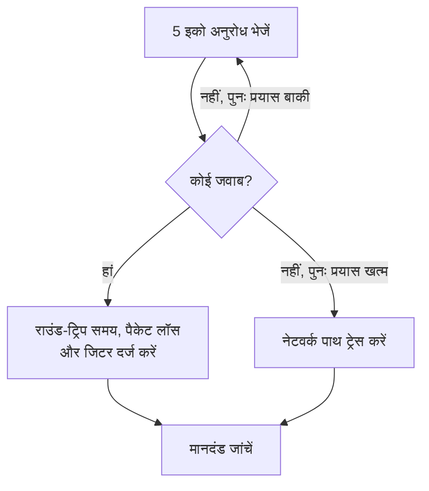

# Ping मॉनिटर

Ping मॉनिटर जांचता है कि कोई होस्ट ping (ICMP इको अनुरोध) का जवाब देता है, और राउंड-ट्रिप समय, पैकेट लॉस और जिटर मापता है। इसका उपयोग सर्वर, राउटर, फ़ायरवॉल और ऐसे दूसरे डिवाइस के लिए करें जिन तक आप होस्ट नाम या IP पते से पहुंच सकते हैं।

:::cards
- [मॉनिटर बनाएं](#ping-मॉनिटर-बनाएं): डैशबोर्ड में छह चरण।
- [कॉन्फ़िगरेशन विकल्प](#कॉन्फ़िगरेशन-विकल्प): होस्ट, टाइमआउट और पुनः प्रयास।
- [निगरानी मानदंड](#निगरानी-मानदंड): पहुंच, लेटेंसी, पैकेट लॉस और जिटर।
- [समस्या निवारण](#समस्या-निवारण): जब होस्ट चालू हो, लेकिन मॉनिटर ऑफ़लाइन कहे।
:::

## यह कैसे काम करता है

हर जांच में, प्रोब होस्ट को पांच इको अनुरोध भेजता है। अगर कम से कम एक जवाब वापस आता है, तो होस्ट ऑनलाइन है, और प्रोब औसत राउंड-ट्रिप समय को प्रतिक्रिया समय के रूप में दर्ज करता है, साथ में पैकेट लॉस, जिटर और सबसे तेज़ व सबसे धीमे जवाब भी। अगर कोई जवाब वापस नहीं आता, तो प्रोब आपकी अनुमति वाली पुनः प्रयास संख्या तक फिर से कोशिश करता है। फिर OneUptime परिणाम को मॉनिटर के मानदंडों से गुज़ारता है।

जब कोई जांच विफल होती है, तो प्रोब होस्ट तक का रूट भी ट्रेस करता है और उसका नाम खोजता है, और जो मिला उसे परिणाम में **Network Path at Time of Failure** के रूप में जोड़ता है, ताकि आप देख सकें कि रूट कहां टूटा।

> [!NOTE]
> कुछ होस्टिंग प्रदाता उन मशीनों पर ICMP ब्लॉक करते हैं जिन पर प्रोब चलता है। जो प्रोब बिल्कुल भी ping नहीं भेज सकता, वह इसकी जगह होस्ट का TCP पोर्ट `80` जांचता है, ताकि मॉनिटर फिर भी बता सके कि होस्ट तक पहुंचा जा सकता है या नहीं। तब पैकेट लॉस और जिटर नहीं मापे जाते।

जिस प्रोब का अपना नेटवर्क कनेक्शन टूट गया हो, वह कोई परिणाम नहीं भेजता, इसलिए वह आपके होस्ट को ऑफ़लाइन नहीं दिखा सकता।

## शुरू करने से पहले

- **ऐसी भूमिका जो मॉनिटर बना सके**: Project Owner, Project Admin, Project Member, Monitor Admin या Monitor Member, या Create Monitor अनुमति वाली कोई कस्टम भूमिका।
- **ऐसा प्रोब जो होस्ट तक पहुंच सके**, और रास्ते में ICMP की अनुमति हो। हर नए मॉनिटर के लिए आपके प्रोजेक्ट के डिफ़ॉल्ट प्रोब चुने जाते हैं। अगर होस्ट के सामने फ़ायरवॉल है, तो [OneUptime Cloud के प्रोब IP पतों](/docs/configuration/ip-addresses) से आने वाले ICMP इको अनुरोधों को अनुमति दें। निजी नेटवर्क के होस्ट के लिए उस नेटवर्क के अंदर [कस्टम प्रोब](/docs/probe/custom-probe) चाहिए।

## Ping मॉनिटर बनाएं

:::steps
### नया मॉनिटर शुरू करें

**मॉनिटर** पर जाएं और **मॉनिटर बनाएं** पर क्लिक करें। **मॉनिटर प्रकार** में **Ping** चुनें।

### नाम दें

**नाम** डालें, जैसे `Core router`, फिर **अगला** पर क्लिक करें।

### होस्ट डालें

**होस्टनाम या IP पता** में ping करने वाला होस्ट नाम या IPv4 या IPv6 पता डालें, जैसे `example.com` या `192.168.1.1`। केवल होस्ट डालें, `http://` या पोर्ट के बिना।

### जांच कर देखें

**मॉनिटर का परीक्षण करें** पर क्लिक करें, **प्रोब चुनें** में कोई प्रोब चुनें और **परीक्षण चलाएं** पर क्लिक करें। **मॉनिटर परीक्षण परिणाम** वे राउंड-ट्रिप समय और पैकेट लॉस दिखाता है जो प्रोब ने देखे।

### मानदंड देखें

**मॉनिटर मानदंड** [डिफ़ॉल्ट मानदंड](#डिफ़ॉल्ट-मानदंड) से शुरू होता है: जब होस्ट जवाब नहीं देता तो ऑफ़लाइन, जब देता है तो ऑनलाइन। ज़रूरत हो तो उन्हें बदलें, फिर **अगला** पर क्लिक करें।

### प्रोब चुनें और बनाएं

**प्रोब** और **निगरानी अंतराल** (यह **हर 5 मिनट** से शुरू होता है) रखें या बदलें, फिर **मॉनिटर बनाएं** पर क्लिक करें। मॉनिटर का पेज खुल जाता है।
:::

## कॉन्फ़िगरेशन विकल्प

| फ़ील्ड | डिफ़ॉल्ट | क्या डालें |
| --- | --- | --- |
| **होस्टनाम या IP पता** | कोई नहीं | ping करने वाला होस्ट, जैसे `example.com`, `192.168.1.1` या `2001:db8::1`। होस्ट नाम हर जांच पर रिज़ॉल्व होता है, इसलिए मॉनिटर DNS बदलावों के साथ चलता है। |
| **अनुरोध टाइमआउट (सेकंड)** (**और फ़ील्ड** में) | `60` | हर प्रयास में जवाब का कितनी देर इंतज़ार करना है। अधिकतम 60 सेकंड है। |
| **विफलता पर पुनः प्रयास** (**और फ़ील्ड** में) | प्रोब का डिफ़ॉल्ट, आमतौर पर `3` | विफल प्रयास को कितनी बार दोहराना है। अधिकतम 3 है। |

**विफलता पर पुनः प्रयास** पहले प्रयास के _बाद_ के पुनः प्रयास गिनता है, इसलिए `0` जांच को एक बार चलाता है और `2` अधिकतम तीन बार। खाली छोड़ने पर प्रोब का डिफ़ॉल्ट इस्तेमाल होता है: 3, जब तक प्रोब का `PROBE_MONITOR_RETRY_LIMIT` कुछ और न कहे। टाइमआउट सहित हर विफलता को दोबारा आज़माया जाता है, प्रयासों के बीच एक सेकंड के विराम के साथ। जिस सफल जांच के जवाबों में 10 सेकंड से ज़्यादा लगे, उसकी भी दोबारा जांच होती है।

किसी होस्ट नाम के बजाय किसी तय IP पते पर नज़र रखने के लिए, आप इसकी जगह [IP मॉनिटर](/docs/monitor/ip-monitor) का उपयोग कर सकते हैं। यह वही जांच चलाता है।

## निगरानी मानदंड

मानदंड तय करते हैं कि होस्ट कब ऑनलाइन, डिग्रेडेड या ऑफ़लाइन गिना जाए, और क्या इससे कोई घटना घोषित हो या अलर्ट बने। हर मानदंड एक या अधिक फ़िल्टर जांचता है:

| फ़िल्टर | शर्तें | क्या जांचता है |
| --- | --- | --- |
| **Is Online** | **सही**, **गलत** | क्या कम से कम एक इको अनुरोध का जवाब मिला। |
| **प्रतिक्रिया समय (ms में)** | **Greater Than**, **Less Than**, **Greater Than Or Equal To**, **Less Than Or Equal To** | जवाबों का औसत राउंड-ट्रिप समय। |
| **Packet Loss (in %)** | **Greater Than**, **Less Than**, **Greater Than Or Equal To**, **Less Than Or Equal To** | पांच इको अनुरोधों में से जिनका जवाब नहीं मिला, उनका हिस्सा। |
| **Jitter (in ms)** | **Greater Than**, **Less Than**, **Greater Than Or Equal To**, **Less Than Or Equal To** | एक जांच में भेजे गए पैकेटों के राउंड-ट्रिप समय का मानक विचलन। |
| **Is Request Timeout** | **सही**, **गलत** | क्या हर प्रयास में ping टाइम आउट हुआ। |

दो या अधिक फ़िल्टर होने पर, **मिलान शर्त** तय करती है कि **सभी** का मिलना ज़रूरी है या **कोई भी** एक काफ़ी है। किसी मानदंड की **क्रियाएँ** तय करती हैं कि वह क्या करता है: मॉनिटर की स्थिति बदलना, अलर्ट बनाना, घटना घोषित करना, या इनका कोई भी मेल।

### डिफ़ॉल्ट मानदंड

नया Ping मॉनिटर दो मानदंडों से शुरू होता है:

- **ऑफ़लाइन** — हर पुनः प्रयास के बाद भी होस्ट किसी इको अनुरोध का जवाब नहीं देता, या उस तक बिल्कुल नहीं पहुंचा जा सकता। मॉनिटर **ऑफ़लाइन** चिह्नित होता है और "_monitor name_ is offline" नाम की घटना बनती है। होस्ट के फिर से जवाब देने पर घटना अपने आप हल हो जाती है।
- **ऑनलाइन** — होस्ट जवाब देता है। मॉनिटर **कार्यरत** चिह्नित होता है।

मानदंड ऊपर से नीचे जांचे जाते हैं, और जो पहला मेल खाता है वही तय करता है कि क्या होगा। जब कोई मेल नहीं खाता, तो मॉनिटर अपनी डिफ़ॉल्ट स्थिति दिखाता है: **कार्यरत**, जब तक आप मानदंडों के नीचे **और फ़ील्ड** में कुछ और न चुनें।

### एक समयावधि में मूल्यांकन

**इस मानदंड का एक समयावधि के दौरान मूल्यांकन करें** किसी फ़िल्टर के नीचे एक चेकबॉक्स है, जो **Is Online**, **प्रतिक्रिया समय (ms में)**, **Packet Loss (in %)** और **Jitter (in ms)** के लिए उपलब्ध है। सबसे हाल की जांच के बजाय पिछली जांचों की एक विंडो के आधार पर फ़ैसला करने के लिए इसे चालू करें: **मूल्यांकन करें** में एक एग्रीगेट चुनें और **पिछले (मिनटों में) के लिए** में 2 से 60 मिनट की विंडो चुनें।

| एग्रीगेट | कब मेल खाता है |
| --- | --- |
| **औसत**, **योग**, **Maximum Value**, **Minimum Value** | विंडो पर वह आंकड़ा शर्त पूरी करता है। केवल संख्यात्मक फ़िल्टर। |
| **All Values** | विंडो की हर जांच शर्त पूरी करती है। |
| **Any Value** | विंडो की कम से कम एक जांच शर्त पूरी करती है। |

**All Values** तभी मेल खाता है जब विंडो वाकई डेटा से भरी हो। जो मॉनिटर अभी-अभी बना है, या जिसकी जांचें दर्ज होना बंद हो गई हैं, उसके पास पिछले N मिनट के बारे में कुछ कहने लायक इतिहास नहीं होता, इसलिए मानदंड अपने पास के एकमात्र रीडिंग पर मेल खाने के बजाय इंतज़ार करता है। **Any Value** "जैसे ही कोई एक जांच सीमा पार करे, मुझे बताओ" वाली सेटिंग है और अब भी तुरंत ट्रिगर होती है।

**यदि कोई डेटा नहीं** तय करता है कि जब विंडो मानदंड का समर्थन नहीं कर सकती तब क्या होता है:

| विकल्प | क्या होता है | किसके लिए |
| --- | --- | --- |
| **Ignore** (डिफ़ॉल्ट) | मानदंड मेल नहीं खाता। | सामान्य सीमा वाले अलर्ट। |
| **ट्रिगर** | गायब डेटा को ही समस्या माना जाता है। | ऐसी जांचें जिनमें चुप्पी खुद एक विफलता है। |
| **Treat As Zero** | विंडो की तुलना एक अकेले शून्य के रूप में होती है। | ऐसे काउंटर जिनमें कोई इवेंट न होने का सच में मतलब शून्य है। |

### मानदंड के उदाहरण

| लक्ष्य | फ़िल्टर | शर्त | मान |
| --- | --- | --- | --- |
| होस्ट तक न पहुंच पाने पर ऑफ़लाइन | **Is Online** | **गलत** | — |
| लेटेंसी ज़्यादा होने पर अलर्ट करें | **प्रतिक्रिया समय (ms में)** | **Greater Than** | `200` |
| पैकेट गिराने वाले लिंक पर होस्ट को डिग्रेडेड चिह्नित करें | **Packet Loss (in %)** | **Greater Than** | `20` |
| अस्थिर कनेक्शन पर अलर्ट करें | **Jitter (in ms)** | **Greater Than** | `30` |

केवल तब अलर्ट करने के लिए जब लेटेंसी लगातार ज़्यादा रहे, प्रतिक्रिया समय फ़िल्टर के लिए **इस मानदंड का एक समयावधि के दौरान मूल्यांकन करें** चालू करें और **5** मिनट पर **All Values** चुनें।

## समस्या निवारण

:::details होस्ट चालू है, लेकिन मॉनिटर ऑफ़लाइन कहता है
होस्ट, या उसके सामने का फ़ायरवॉल, प्रोब के ICMP इको अनुरोधों का जवाब नहीं देता। कई सर्वर और क्लाउड नेटवर्क डिफ़ॉल्ट रूप से ping गिरा देते हैं। प्रोब से आने वाले ICMP इको अनुरोधों को अनुमति दें, या इसकी जगह [पोर्ट मॉनिटर](/docs/monitor/port-monitor) से होस्ट पर किसी सेवा की निगरानी करें। विफल जांच पर **Network Path at Time of Failure** दिखाता है कि रूट कहां तक पहुंचा।
:::

:::details जांच होस्ट के लिए "This probe could not resolve" के साथ विफल होती है
प्रोब का DNS सर्वर होस्ट नाम नहीं जानता। नाम जांचें, या इसकी जगह IP पता डालें। जो नाम केवल आपके नेटवर्क के अंदर रिज़ॉल्व होता है, उसके लिए वहां [कस्टम प्रोब](/docs/probe/custom-probe) चाहिए।
:::

:::details पैकेट लॉस और जिटर खाली हैं
जांच चलाने वाला प्रोब ping नहीं भेज सकता, इसलिए उसने इसकी जगह TCP पोर्ट `80` जांचा, जो इनमें से कुछ भी नहीं मापता। मॉनिटर को ऐसे प्रोब पर चलाएं जिसे ICMP भेजने की अनुमति हो।
:::

## अगले कदम

:::cards
- [IP मॉनिटर](/docs/monitor/ip-monitor): किसी तय IPv4 या IPv6 पते पर नज़र रखें।
- [पोर्ट मॉनिटर](/docs/monitor/port-monitor): केवल होस्ट नहीं, होस्ट पर किसी सेवा की जांच करें।
- [कस्टम प्रोब](/docs/probe/custom-probe): अपने नेटवर्क के होस्ट को ping करें।
- [घटनाएं](/docs/incidents/index): मॉनिटर के घटना घोषित करने के बाद क्या होता है।
:::
