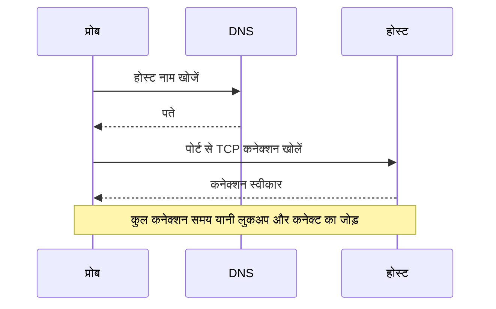

# पोर्ट मॉनिटर

पोर्ट मॉनिटर जांचता है कि कोई होस्ट किसी पोर्ट पर TCP कनेक्शन स्वीकार करता है, और मापता है कि कनेक्शन में कितना समय लगता है। इसका उपयोग उन सेवाओं के लिए करें जो HTTP नहीं बोलतीं, या जिनके HTTP की जांच आप नहीं करना चाहते: डेटाबेस, मेल सर्वर, SSH, मैसेज ब्रोकर और ऐसी ही दूसरी सेवाएं।

:::cards
- [मॉनिटर बनाएं](#पोर्ट-मॉनिटर-बनाएं): डैशबोर्ड में छह चरण।
- [कनेक्शन टाइमिंग](#कनेक्शन-टाइमिंग): DNS, TCP और कुल समय क्या मापते हैं।
- [निगरानी मानदंड](#निगरानी-मानदंड): पहुंच और कनेक्शन समय।
- [समस्या निवारण](#समस्या-निवारण): जब सेवा चालू हो, लेकिन मॉनिटर ऑफ़लाइन कहे।
:::

## यह कैसे काम करता है

हर जांच में, अगर आपने होस्ट नाम दिया है तो प्रोब उसे खोजता है, और पोर्ट से एक TCP कनेक्शन खोलता है। कनेक्शन स्वीकार होते ही पोर्ट ऑनलाइन है; फिर प्रोब कुछ भी भेजे बिना उसे बंद कर देता है। जो कनेक्शन अस्वीकार होता है या टाइम आउट होता है, उसे आपकी अनुमति वाली पुनः प्रयास संख्या तक फिर से आज़माया जाता है। फिर OneUptime परिणाम को मॉनिटर के मानदंडों से गुज़ारता है।

प्रोब केवल TCP कनेक्शन खोलता है: जो सेवा केवल UDP पर सुनती है, जैसे SNMP एजेंट, उसकी जांच पोर्ट मॉनिटर से नहीं हो सकती।

जब कोई जांच विफल होती है, तो प्रोब होस्ट तक का रूट भी ट्रेस करता है और उसका नाम खोजता है, और जो मिला उसे परिणाम में **Network Path at Time of Failure** के रूप में जोड़ता है, ताकि आप देख सकें कि रूट कहां टूटा। जिस प्रोब का अपना नेटवर्क कनेक्शन टूट गया हो, वह कोई परिणाम नहीं भेजता, इसलिए वह आपकी सेवा को ऑफ़लाइन नहीं दिखा सकता।

## शुरू करने से पहले

- **ऐसी भूमिका जो मॉनिटर बना सके**: Project Owner, Project Admin, Project Member, Monitor Admin या Monitor Member, या Create Monitor अनुमति वाली कोई कस्टम भूमिका।
- **ऐसा प्रोब जो पोर्ट तक पहुंच सके।** हर नए मॉनिटर के लिए आपके प्रोजेक्ट के डिफ़ॉल्ट प्रोब चुने जाते हैं। अगर सेवा के सामने फ़ायरवॉल है, तो [OneUptime Cloud के प्रोब IP पतों](/docs/configuration/ip-addresses) को पोर्ट से कनेक्ट करने की अनुमति दें। निजी नेटवर्क की सेवा, जैसे डेटाबेस, के लिए उस नेटवर्क के अंदर [कस्टम प्रोब](/docs/probe/custom-probe) चाहिए।

## पोर्ट मॉनिटर बनाएं

:::steps
### नया मॉनिटर शुरू करें

**मॉनिटर** पर जाएं और **मॉनिटर बनाएं** पर क्लिक करें। **मॉनिटर प्रकार** में **पोर्ट** चुनें।

### नाम दें

**नाम** डालें, जैसे `Orders database`, फिर **अगला** पर क्लिक करें।

### होस्ट और पोर्ट डालें

**होस्टनाम या IP पता** में वह होस्ट डालें जिस पर पोर्ट है, जैसे `db.example.com` या `10.0.0.12`। **पोर्ट** में पोर्ट नंबर डालें, जैसे `5432`।

### जांच कर देखें

**मॉनिटर का परीक्षण करें** पर क्लिक करें, **प्रोब चुनें** में कोई प्रोब चुनें और **परीक्षण चलाएं** पर क्लिक करें। **मॉनिटर परीक्षण परिणाम** दिखाता है कि कनेक्शन खुला या नहीं, और हर हिस्से में कितना समय लगा।

### मानदंड देखें

**मॉनिटर मानदंड** [डिफ़ॉल्ट मानदंड](#डिफ़ॉल्ट-मानदंड) से शुरू होता है: जब पोर्ट कनेक्शन स्वीकार नहीं करता तो ऑफ़लाइन, जब करता है तो ऑनलाइन। ज़रूरत हो तो उन्हें बदलें, फिर **अगला** पर क्लिक करें।

### प्रोब चुनें और बनाएं

**प्रोब** और **निगरानी अंतराल** (यह **हर 5 मिनट** से शुरू होता है) रखें या बदलें, फिर **मॉनिटर बनाएं** पर क्लिक करें। मॉनिटर का पेज खुल जाता है।
:::

## कॉन्फ़िगरेशन विकल्प

| फ़ील्ड | डिफ़ॉल्ट | क्या डालें |
| --- | --- | --- |
| **होस्टनाम या IP पता** | कोई नहीं | होस्ट, जैसे `example.com`, `192.168.1.1` या `2001:db8::1`। केवल होस्ट डालें, `http://` के बिना। |
| **पोर्ट** | कोई नहीं | कनेक्ट करने वाला TCP पोर्ट, `1` से `65535` तक। |
| **अनुरोध टाइमआउट (सेकंड)** (**और फ़ील्ड** में) | `60` | एक प्रयास कितना समय ले सकता है, DNS लुकअप और TCP कनेक्शन मिलाकर। अधिकतम 60 सेकंड है। |
| **विफलता पर पुनः प्रयास** (**और फ़ील्ड** में) | प्रोब का डिफ़ॉल्ट, आमतौर पर `3` | विफल प्रयास को कितनी बार दोहराना है। अधिकतम 3 है। |

**विफलता पर पुनः प्रयास** पहले प्रयास के _बाद_ के पुनः प्रयास गिनता है, इसलिए `0` जांच को एक बार चलाता है और `2` अधिकतम तीन बार। खाली छोड़ने पर प्रोब का डिफ़ॉल्ट इस्तेमाल होता है: 3, जब तक प्रोब का `PROBE_MONITOR_RETRY_LIMIT` कुछ और न कहे। टाइमआउट सहित हर विफलता को दोबारा आज़माया जाता है, प्रयासों के बीच एक सेकंड के विराम के साथ। जिस सफल कनेक्शन में 10 सेकंड से ज़्यादा लगे, उसकी भी दोबारा जांच होती है।

आम पोर्ट:

| पोर्ट | सेवा |
| --- | --- |
| `22` | SSH |
| `25` | SMTP |
| `80` | HTTP |
| `443` | HTTPS |
| `3306` | MySQL |
| `5432` | PostgreSQL |
| `6379` | Redis |
| `27017` | MongoDB |

> [!NOTE]
> कई होस्टिंग प्रदाता आउटबाउंड SMTP ब्लॉक करते हैं। जो प्रोब ping नहीं भेज सकता, जिससे प्रोब को पता चलता है कि वह ऐसे प्रदाता पर चल रहा है, उस पर पोर्ट `25` की टाइम आउट हुई जांच ऑनलाइन गिनी जाती है। किसी मेल सर्वर के पोर्ट `25` की भरोसेमंद जांच के लिए, मॉनिटर को ऐसे [कस्टम प्रोब](/docs/probe/custom-probe) पर चलाएं जिसे उससे कनेक्ट करने की अनुमति हो।

## कनेक्शन टाइमिंग

होस्ट नाम के लिए, प्रोब जांच को दो चरणों में मापता है:

| चरण | कब से | कब तक |
| --- | --- | --- |
| **DNS लुकअप** | जांच की शुरुआत | पहला TCP कनेक्शन प्रयास |
| **TCP कनेक्ट** | पहला TCP कनेक्शन प्रयास | कनेक्शन स्वीकार होने तक, IPv6 और IPv4 पतों के बीच फ़ॉलबैक में लगा समय मिलाकर |

**Total Connection Time (DNS + TCP)** जांच की शुरुआत से कनेक्शन स्वीकार होने तक चलता है। यह पोर्ट मॉनिटर का प्रतिक्रिया समय भी है, इसलिए प्रतिक्रिया समय का उपयोग करने वाले मौजूदा मानदंड, अलर्ट और चार्ट काम करते रहते हैं।

जब लक्ष्य कोई IP पता हो, तो DNS लुकअप नहीं होता, इसलिए वह चरण छोड़ दिया जाता है। चरण-वार टाइमिंग आने से पहले के जांच परिणाम केवल कुल कनेक्शन समय दिखाते हैं।

## निगरानी मानदंड

मानदंड तय करते हैं कि पोर्ट कब ऑनलाइन, डिग्रेडेड या ऑफ़लाइन गिना जाए, और क्या इससे कोई घटना घोषित हो या अलर्ट बने। हर मानदंड एक या अधिक फ़िल्टर जांचता है:

| फ़िल्टर | शर्तें | क्या जांचता है |
| --- | --- | --- |
| **Is Online** | **सही**, **गलत** | क्या पोर्ट ने कनेक्शन स्वीकार किया। |
| **Total Connection Time (DNS + TCP) (in ms)** | **Greater Than**, **Less Than**, **Greater Than Or Equal To**, **Less Than Or Equal To** | पूरा कनेक्शन समय, होस्ट नाम के लिए DNS लुकअप सहित। |
| **Port DNS Lookup Time (in ms)** | **Greater Than**, **Less Than**, **Greater Than Or Equal To**, **Less Than Or Equal To** | पहले TCP प्रयास से पहले का DNS लुकअप। लक्ष्य IP पता हो तो इसका कोई मान नहीं होता। |
| **Port TCP Connect Time (in ms)** | **Greater Than**, **Less Than**, **Greater Than Or Equal To**, **Less Than Or Equal To** | पहले TCP प्रयास से कनेक्शन स्वीकार होने तक, IPv6 और IPv4 फ़ॉलबैक सहित। |
| **Is Request Timeout** | **सही**, **गलत** | क्या हर प्रयास में DNS लुकअप या TCP कनेक्शन टाइमआउट से आगे चला गया। |

जब लक्ष्य कोई IP पता हो, तो DNS लुकअप वाले मानदंड के पास मूल्यांकन के लिए कुछ नहीं होता। जिन मानदंडों को होस्ट नाम और IP पते, दोनों के साथ काम करना है, उनके लिए कुल या TCP कनेक्ट समय का उपयोग करें।

दो या अधिक फ़िल्टर होने पर, **मिलान शर्त** तय करती है कि **सभी** का मिलना ज़रूरी है या **कोई भी** एक काफ़ी है। किसी मानदंड की **क्रियाएँ** तय करती हैं कि वह क्या करता है: मॉनिटर की स्थिति बदलना, अलर्ट बनाना, घटना घोषित करना, या इनका कोई भी मेल।

### डिफ़ॉल्ट मानदंड

नया पोर्ट मॉनिटर दो मानदंडों से शुरू होता है:

- **ऑफ़लाइन** — हर पुनः प्रयास के बाद भी पोर्ट कनेक्शन स्वीकार नहीं करता। मॉनिटर **ऑफ़लाइन** चिह्नित होता है और "_monitor name_ is offline" नाम की घटना बनती है। पोर्ट के फिर से कनेक्शन स्वीकार करने पर घटना अपने आप हल हो जाती है।
- **ऑनलाइन** — पोर्ट कनेक्शन स्वीकार करता है। मॉनिटर **कार्यरत** चिह्नित होता है।

मानदंड ऊपर से नीचे जांचे जाते हैं, और जो पहला मेल खाता है वही तय करता है कि क्या होगा। जब कोई मेल नहीं खाता, तो मॉनिटर अपनी डिफ़ॉल्ट स्थिति दिखाता है: **कार्यरत**, जब तक आप मानदंडों के नीचे **और फ़ील्ड** में कुछ और न चुनें।

### एक समयावधि में मूल्यांकन

**इस मानदंड का एक समयावधि के दौरान मूल्यांकन करें** किसी फ़िल्टर के नीचे एक चेकबॉक्स है, जो **Is Online**, **Total Connection Time (DNS + TCP) (in ms)**, **Port DNS Lookup Time (in ms)** और **Port TCP Connect Time (in ms)** के लिए उपलब्ध है। सबसे हाल की जांच के बजाय पिछली जांचों की एक विंडो के आधार पर फ़ैसला करने के लिए इसे चालू करें: **मूल्यांकन करें** में एक एग्रीगेट चुनें और **पिछले (मिनटों में) के लिए** में 2 से 60 मिनट की विंडो चुनें।

| एग्रीगेट | कब मेल खाता है |
| --- | --- |
| **औसत**, **योग**, **Maximum Value**, **Minimum Value** | विंडो पर वह आंकड़ा शर्त पूरी करता है। केवल संख्यात्मक फ़िल्टर। |
| **All Values** | विंडो की हर जांच शर्त पूरी करती है। |
| **Any Value** | विंडो की कम से कम एक जांच शर्त पूरी करती है। |

**All Values** तभी मेल खाता है जब विंडो वाकई डेटा से भरी हो। जो मॉनिटर अभी-अभी बना है, या जिसकी जांचें दर्ज होना बंद हो गई हैं, उसके पास पिछले N मिनट के बारे में कुछ कहने लायक इतिहास नहीं होता, इसलिए मानदंड अपने पास के एकमात्र रीडिंग पर मेल खाने के बजाय इंतज़ार करता है। **Any Value** "जैसे ही कोई एक जांच सीमा पार करे, मुझे बताओ" वाली सेटिंग है और अब भी तुरंत ट्रिगर होती है।

**यदि कोई डेटा नहीं** तय करता है कि जब विंडो मानदंड का समर्थन नहीं कर सकती तब क्या होता है:

| विकल्प | क्या होता है | किसके लिए |
| --- | --- | --- |
| **Ignore** (डिफ़ॉल्ट) | मानदंड मेल नहीं खाता। | सामान्य सीमा वाले अलर्ट। |
| **ट्रिगर** | गायब डेटा को ही समस्या माना जाता है। | ऐसी जांचें जिनमें चुप्पी खुद एक विफलता है। |
| **Treat As Zero** | विंडो की तुलना एक अकेले शून्य के रूप में होती है। | ऐसे काउंटर जिनमें कोई इवेंट न होने का सच में मतलब शून्य है। |

### मानदंड के उदाहरण

| लक्ष्य | फ़िल्टर | शर्त | मान |
| --- | --- | --- | --- |
| पोर्ट बंद होने पर ऑफ़लाइन | **Is Online** | **गलत** | — |
| कनेक्ट होना धीमा हो तो अलर्ट करें | **Total Connection Time (DNS + TCP) (in ms)** | **Greater Than** | `500` |
| कनेक्ट होने में धीमी सेवा को डिग्रेडेड चिह्नित करें | **Total Connection Time (DNS + TCP) (in ms)** | **Greater Than** | `200` |
| DNS धीमा हो तो अलर्ट करें | **Port DNS Lookup Time (in ms)** | **Greater Than** | `100` |
| TCP हैंडशेक धीमा हो तो अलर्ट करें | **Port TCP Connect Time (in ms)** | **Greater Than** | `250` |

## समस्या निवारण

:::details सेवा चालू है, लेकिन मॉनिटर ऑफ़लाइन कहता है
प्रोब कनेक्शन नहीं खोल सका: कोई फ़ायरवॉल उसे गिरा देता है, सेवा केवल किसी निजी इंटरफ़ेस पर सुनती है, या पोर्ट गलत है। घटना का मूल कारण, और मॉनिटर पर **निगरानी लॉग**, त्रुटि दिखाते हैं, और **Network Path at Time of Failure** दिखाता है कि रूट कहां तक पहुंचा। फ़ायरवॉल से प्रोब को आने दें, या नेटवर्क के अंदर [कस्टम प्रोब](/docs/probe/custom-probe) का उपयोग करें।
:::

:::details DNS लुकअप समय हमेशा खाली रहता है
लक्ष्य एक IP पता है, इसलिए खोजने के लिए कुछ नहीं है। इसकी जगह **Total Connection Time (DNS + TCP) (in ms)** या **Port TCP Connect Time (in ms)** का उपयोग करें।
:::

:::details मुझे कोई UDP सेवा जांचनी है
पोर्ट मॉनिटर केवल TCP कनेक्शन खोलते हैं। DNS सर्वर के लिए [DNS मॉनिटर](/docs/monitor/dns-monitor) का उपयोग करें, और UDP पोर्ट 123 पर टाइम सर्वर के लिए [NTP मॉनिटर](/docs/monitor/ntp-monitor) का। दोनों असली क्वेरी भेजते हैं।
:::

## अगले कदम

:::cards
- [Ping मॉनिटर](/docs/monitor/ping-monitor): जांचें कि होस्ट तक खुद पहुंचा जा सकता है।
- [SSL प्रमाणपत्र मॉनिटर](/docs/monitor/ssl-certificate-monitor): किसी TLS पोर्ट पर प्रमाणपत्र की जांच करें।
- [डेटाबेस हेल्थ मॉनिटर](/docs/monitor/database-health-monitor): खुले पोर्ट से आगे जाकर डेटाबेस की सेहत पर नज़र रखें।
- [कस्टम प्रोब](/docs/probe/custom-probe): अपने नेटवर्क के पोर्ट जांचें।
:::
