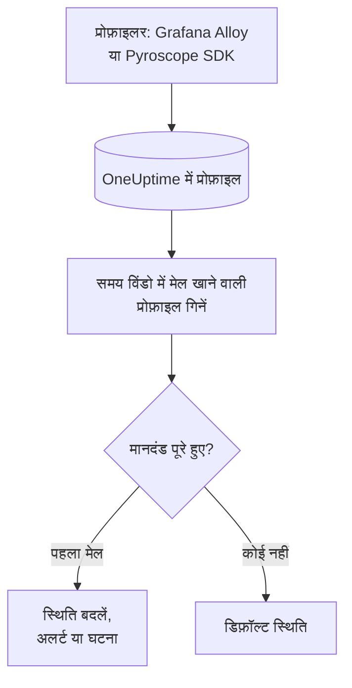

# प्रोफ़ाइल मॉनिटर

प्रोफ़ाइल मॉनिटर एक समय विंडो में उन निरंतर प्रोफ़ाइल की गिनती करता है जो आपकी सेवाएं OneUptime को भेजती हैं और जो आपके फ़िल्टर (प्रोफ़ाइल प्रकार, सेवा, विशेषताएं) से मेल खाती हैं। जब गिनती आपके मानदंड पूरे करती है, तो यह मॉनिटर की स्थिति बदलता है, अलर्ट बनाता है या घटना घोषित करता है। इसका मुख्य उपयोग यह पकड़ना है कि किसी सेवा से प्रोफ़ाइलिंग डेटा आना बंद हो गया है।

> [!IMPORTANT]
> डैशबोर्ड में **मॉनिटर बनाएं** में Profiles नहीं मिलता: इसके फ़िल्टर के लिए अभी कोई फ़ॉर्म नहीं है। नीचे बताए अनुसार [API](/docs/api-reference/api-reference) या [Terraform](/docs/terraform/monitor-steps) के ज़रिए प्रोफ़ाइल मॉनिटर बनाएं। बन जाने के बाद आप डैशबोर्ड में मॉनिटर के **मानदंड** पृष्ठ पर उसके मानदंड देख और संपादित कर सकते हैं; उसके फ़िल्टर सिर्फ़ API या Terraform से बदले जा सकते हैं।

:::cards
- [मॉनिटर बनाएं](#प्रोफ़ाइल-मॉनिटर-बनाएं): API या Terraform से भेजा जाने वाला कॉन्फ़िगरेशन।
- [यह क्या क्वेरी करता है](#यह-क्या-क्वेरी-करता-है): प्रोफ़ाइल प्रकार, सेवाएं, विशेषताएं और विंडो।
- [मानदंड](#मानदंड): वे शर्तें जिनका आप उपयोग कर सकते हैं।
- [उदाहरण](#उदाहरण-प्रोफ़ाइल-आना-बंद-हो-जाती-हैं): जानें कि कोई सेवा प्रोफ़ाइल भेजना कब बंद करती है।
:::

## यह कैसे काम करता है



हर मिनट OneUptime उन प्रोफ़ाइल को गिनता है जो मॉनिटर के फ़िल्टर से मेल खाती हैं और उसकी समय विंडो के भीतर शुरू हुईं। वह इस गिनती की तुलना मॉनिटर के मानदंडों से ऊपर से नीचे करता है, और जो मानदंड सबसे पहले मेल खाता है वही तय करता है कि क्या होगा। जब कोई मेल नहीं खाता, तो मॉनिटर अपनी डिफ़ॉल्ट स्थिति पर लौट आता है।

## शुरू करने से पहले

- आपकी सेवाएं Grafana Alloy (eBPF) या Pyroscope SDK के ज़रिए OneUptime को निरंतर प्रोफ़ाइलिंग डेटा भेजती हैं। [निरंतर प्रोफ़ाइलिंग](/docs/telemetry/profiles) देखें।
- आपके पास या तो मॉनिटर बना सकने वाली API कुंजी है, या OneUptime Terraform प्रोवाइडर सेट है।
- आप नज़र रखी जाने वाली हर टेलीमेट्री सेवा की ID जानते हैं, और वे प्रोफ़ाइल प्रकार जो वह भेजती है, जैसे `cpu`, `wall`, `alloc_objects`, `alloc_space` या `goroutine`।

## प्रोफ़ाइल मॉनिटर बनाएं

:::steps
### चुनें कि क्या गिना जाए

चरण का `profileMonitor` कॉन्फ़िगरेशन लिखें। यह कॉन्फ़िगरेशन एक सेवा की पिछले पांच मिनट की CPU प्रोफ़ाइल गिनता है:

```json
{
  "profileMonitor": {
    "telemetryServiceIds": [],
    "profileTypes": ["cpu"],
    "profileType": "",
    "attributes": {},
    "lastXSecondsOfProfiles": 300
  }
}
```

सेवा की ID `telemetryServiceIds` में डालें, या हर सेवा की प्रोफ़ाइल गिनने के लिए सूची खाली छोड़ें। [यह क्या क्वेरी करता है](#यह-क्या-क्वेरी-करता-है) में हर फ़ील्ड का विवरण है।

### मॉनिटर बनाएं

[API](/docs/api-reference/api-reference) या [Terraform](/docs/terraform/monitor-steps) के ज़रिए मॉनिटर प्रकार `Profiles` वाला एक मॉनिटर बनाएं, जिसके चरण में यह कॉन्फ़िगरेशन और कम से कम एक मानदंड हो। Terraform में कॉन्फ़िगरेशन को चरण की `profile_monitor` विशेषता के रूप में, `jsonencode()` से लिखकर पास करें।

### डैशबोर्ड में जांचें

**मॉनिटर** से मॉनिटर खोलें। उसका पहला मूल्यांकन एक मिनट के भीतर चलता है, और कोई मानदंड मेल खाते ही उसकी स्थिति बदल जाती है।
:::

## यह क्या क्वेरी करता है

| फ़ील्ड | किससे मेल खाता है | डिफ़ॉल्ट |
| --- | --- | --- |
| `profileTypes` | इनमें से किसी भी प्रकार की प्रोफ़ाइल, सटीक मिलान के साथ, जैसे `cpu`। | खाली: हर प्रकार |
| `profileType` | वे प्रोफ़ाइल जिनके प्रकार में यह टेक्स्ट हो, बड़े-छोटे अक्षरों का अंतर किए बिना। जब यह सेट होता है, तो `profileTypes` को अनदेखा किया जाता है। | खाली |
| `telemetryServiceIds` | इनमें से किसी भी टेलीमेट्री सेवा की प्रोफ़ाइल। | खाली: हर सेवा |
| `entityKeys` | इनमें से किसी भी होस्ट, पॉड, कंटेनर और दूसरी इन्फ्रास्ट्रक्चर एंटिटी की प्रोफ़ाइल। | खाली: हर एंटिटी |
| `attributes` | वे प्रोफ़ाइल जिनकी विशेषताओं के ये मान हों। | खाली: कोई शर्त नहीं |
| `lastXSecondsOfProfiles` | वे प्रोफ़ाइल जो मूल्यांकन से इतने सेकंड पहले के भीतर शुरू हुईं। | कोई नहीं: इसे हमेशा सेट करें, वरना हर संग्रहीत प्रोफ़ाइल गिनी जाती है और गिनती कभी 0 तक नहीं गिरती |

किसी प्रोफ़ाइल को गिने जाने के लिए आपके सेट किए सभी फ़िल्टर से मेल खाना ज़रूरी है।

## इसका मूल्यांकन कैसे होता है

- **हर मिनट।** प्रोफ़ाइल मॉनिटर की जांच प्रोब नहीं करते, इसलिए इसमें सेट करने के लिए कोई अंतराल नहीं है और न ही **प्रोब और अंतराल** पृष्ठ।
- **हर मूल्यांकन में एक संख्या।** मॉनिटर उन प्रोफ़ाइल को गिनता है जो हर फ़िल्टर से मेल खाती हैं और `lastXSecondsOfProfiles` के भीतर शुरू हुईं। प्रोफ़ाइलर नियमित अंतराल पर अपलोड करता है, इसलिए विंडो में कई अपलोड की जगह रखें।
- **कोई प्रोफ़ाइल नहीं, यानी गिनती 0।** जिस सेवा का प्रोफ़ाइलर अपलोड करना बंद कर देता है, वह 0 देती है।
- **OneUptime का अपना डाउनटाइम खामोशी नहीं है।** जब तक समय विंडो में वह समय शामिल है जब OneUptime खुद डेटा प्राप्त नहीं कर रहा था (वह रीस्टार्ट हो रहा था, अपग्रेड हो रहा था या बैकलॉग निपटा रहा था), जांच इंतज़ार करती है: स्थिति नहीं बदलती, और कोई घटना या अलर्ट न खुलता है न सुलझता है। [जब OneUptime डेटा प्राप्त नहीं कर रहा हो](/docs/monitor/when-oneuptime-is-not-receiving) देखें।
- **मानदंड ऊपर से नीचे।** जो मानदंड सबसे पहले मेल खाता है वही तय करता है, इसलिए सबसे गंभीर को सबसे ऊपर रखें।

हर स्थिति परिवर्तन, उसके कारण के साथ, मॉनिटर की **स्थिति टाइमलाइन** पर दर्ज होता है।

## मानदंड

प्रोफ़ाइल मॉनिटर के मानदंडों में एक ही फ़िल्टर होता है, **Profile Count**: विंडो में मेल खाने वाली प्रोफ़ाइल की संख्या। इसकी तुलना किसी मान से करें:

| फ़िल्टर शर्त | मेल खाती है जब प्रोफ़ाइल की गिनती… |
| --- | --- |
| **Greater Than** | मान से ऊपर हो |
| **Greater Than Or Equal To** | मान के बराबर या उससे ऊपर हो |
| **Less Than** | मान से नीचे हो |
| **Less Than Or Equal To** | मान के बराबर या उससे नीचे हो |
| **Equal To** | ठीक मान के बराबर हो |
| **Not Equal To** | मान के अलावा कुछ भी हो |

प्रोफ़ाइल की गिनती में विसंगति वाली शर्तें नहीं होतीं: उनसे तुलना के लिए कोई बेसलाइन नहीं है।

## उदाहरण: प्रोफ़ाइल आना बंद हो जाती हैं

checkout सेवा एक Pyroscope SDK चलाती है जो CPU प्रोफ़ाइल अपलोड करता है। आप चाहते हैं कि जब वे पांच मिनट तक न आएं तो घटना बने:

- `profileTypes`: `["cpu"]`, `telemetryServiceIds`: checkout सेवा, `lastXSecondsOfProfiles`: `300`
- मानदंड 1: **Profile Count** **Equal To** `0`: मॉनिटर को ऑफ़लाइन चिह्नित करें और घटना घोषित करें
- मानदंड 2: **Profile Count** **Greater Than** `0`: मॉनिटर को ऑनलाइन चिह्नित करें

जब तक SDK अपलोड करता है, हर मूल्यांकन कुछ प्रोफ़ाइल गिनता है और मानदंड 2 मॉनिटर को ऑनलाइन रखता है। जब सेवा बिना SDK के डिप्लॉय होती है, तो आखिरी अपलोड के पांच मिनट बाद गिनती 0 पर गिर जाती है, मानदंड 1 मेल खाता है और घटना घोषित होती है। सुधार के बाद का पहला अपलोड गिनती को फिर 0 से ऊपर ले आता है, और अगर उस घटना के लिए **घटना स्वतः सुलझाएं** चालू है, तो घटना अपने आप सुलझ जाती है।

## समस्या निवारण

:::details मॉनिटर 0 गिनता है, लेकिन OneUptime में प्रोफ़ाइल दिखती हैं
फ़िल्टर की तुलना उन प्रोफ़ाइल से करें जो आप देख रहे हैं: `profileTypes` का प्रकार से सटीक मेल होना चाहिए, और `telemetryServiceIds` में सही सेवा ID होनी चाहिए। छोटा `lastXSecondsOfProfiles` दो अपलोड के बीच भी पड़ सकता है।
:::

:::details मॉनिटर बनाएं में Profiles नहीं है
यह अपेक्षित है: डैशबोर्ड में प्रोफ़ाइल मॉनिटर के फ़िल्टर के लिए अभी कोई फ़ॉर्म नहीं है। इसे [प्रोफ़ाइल मॉनिटर बनाएं](#प्रोफ़ाइल-मॉनिटर-बनाएं) में बताए अनुसार API या Terraform से बनाएं।
:::

## अगले कदम

:::cards
- [निरंतर प्रोफ़ाइलिंग](/docs/telemetry/profiles): Grafana Alloy या Pyroscope SDK से प्रोफ़ाइल भेजें।
- [मॉनिटर चरण](/docs/terraform/monitor-steps): Terraform से चरण का कॉन्फ़िगरेशन पास करें।
- [ट्रेस मॉनिटर](/docs/monitor/traces-monitor): विफल स्पैन पर अलर्ट करें।
- [मेट्रिक्स मॉनिटर](/docs/monitor/metrics-monitor): CPU, मेमोरी और दूसरी मेट्रिक्स पर अलर्ट करें।
:::
