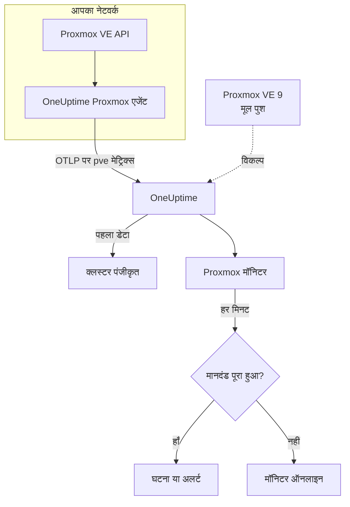

# Proxmox मॉनिटर

Proxmox मॉनिटर एक Proxmox VE क्लस्टर – उसके नोड, VM और LXC कंटेनर, स्टोरेज, HA स्थिति, बैकअप-जॉब कवरेज और स्टोरेज रेप्लिकेशन – की निगरानी करता है और आपको बताता है जब कोई नोड ऑफ़लाइन हो जाता है, कोई गेस्ट रुक जाता है या स्टोरेज भरने लगता है। यह उन `pve_*` मेट्रिक्स को पढ़ता है जिन्हें OneUptime Proxmox एजेंट इकट्ठा करता है, इसलिए बाहर से कुछ भी जाँचा नहीं जाता।

:::cards
- [मॉनिटर बनाएं](#proxmox-मॉनिटर-बनाएं): डैशबोर्ड में छह चरण।
- [टेम्पलेट](#तैयार-अलर्ट-टेम्पलेट): ग्यारह तैयार अलर्ट, हर नोड, गेस्ट या वॉल्यूम के लिए एक घटना।
- [संसाधन पहचान](#संसाधन-पहचान): किसी एक नोड, गेस्ट या स्टोरेज वॉल्यूम को कैसे लक्षित करें।
- [मेट्रिक्स](#इकट्ठा-किए-गए-मेट्रिक्स): हर `pve_*` सीरीज़ जिस पर मॉनिटर अलर्ट दे सकता है।
:::

## यह कैसे काम करता है

OneUptime Proxmox एजेंट ऐसी मशीन पर चलता है जो Proxmox VE API तक पहुँच सकती है। हर 30 सेकंड में यह क्लस्टर और नोड कलेक्टरों के साथ prometheus-pve-exporter को स्क्रेप करता है, हर सीरीज़ पर उस संसाधन का लेबल लगाता है जिसका वह वर्णन करती है, और मेट्रिक्स को क्लस्टर के नाम `proxmox.cluster.name` के साथ OTLP पर OneUptime भेजता है। पहला डेटा क्लस्टर को पंजीकृत करता है। Proxmox VE 9 और बाद के संस्करण इसके बजाय कुछ भी इंस्टॉल किए बिना मेट्रिक्स को मूल रूप से पुश कर सकते हैं; [मूल पुश](#proxmox-ve-मूल-पुश) देखें।

Proxmox मॉनिटर एक क्लस्टर से बंधा होता है। हर मिनट यह उस क्लस्टर के मेट्रिक्स पर अपनी क्वेरी चलाता है और परिणाम की तुलना अपने मानदंडों से करता है।

## शुरू करने से पहले

- **Proxmox एजेंट इंस्टॉल करें**, ऐसी जगह जहाँ से यह Proxmox VE API तक पहुँच सके, केवल-पढ़ने वाले API टोकन के साथ। [Proxmox एजेंट गाइड](/docs/telemetry/proxmox) टोकन, इंस्टॉल और मूल पुश बताती है।
- **जाँचें कि क्लस्टर पंजीकृत है।** पहले स्क्रेप के लगभग एक मिनट बाद यह एजेंट के `PROXMOX_CLUSTER_NAME` के नाम से **उत्पाद → बुनियादी ढांचा → Proxmox → सभी क्लस्टर** के अंतर्गत दिखता है।

## Proxmox मॉनिटर बनाएं

:::steps
### नया मॉनिटर शुरू करें

**मॉनिटर** पर जाएं और **मॉनिटर बनाएं** पर क्लिक करें।

### Proxmox चुनें

**मॉनिटर प्रकार** के अंतर्गत **और मॉनिटर प्रकार** पर क्लिक करें और **बुनियादी ढांचा** के अंतर्गत **Proxmox** चुनें, या खोज बॉक्स में `proxmox` टाइप करें। एक **नाम** दर्ज करें – यह घटना और अलर्ट के शीर्षकों में उपयोग होता है – और **अगला** पर क्लिक करें।

### क्लस्टर चुनें

**Proxmox Monitor Configuration** के अंतर्गत **Proxmox Cluster** से क्लस्टर चुनें। हर वह क्लस्टर जिसने डेटा भेजा है, सूची में है।

### तय करें कि किस पर नज़र रखनी है

तीन टैब में से एक चुनें:

- **Quick Setup** – किसी [टेम्पलेट](#तैयार-अलर्ट-टेम्पलेट) पर क्लिक करें। यह मेट्रिक्स, फ़िल्टर, एकत्रीकरण, समय सीमा और थ्रेशोल्ड सेट करता है, और नीचे के मानदंडों को अपने मानदंडों से बदल देता है। आप अब भी **समय सीमा** बदल सकते हैं।
- **Custom Metric** – **Proxmox Metric** से एक मेट्रिक चुनें, फिर **एकत्रीकरण** और **समय सीमा** सेट करें। [फ़िल्टर](#मॉनिटर-सेटिंग्स) इसे किसी तरह के संसाधन या एक संसाधन तक सीमित करते हैं।
- **उन्नत** – **मेट्रिक्स चुनें** के अंतर्गत खुद क्वेरी और सूत्र बनाएं, उदाहरण के लिए `pve_memory_usage_bytes / pve_memory_size_bytes` से मेमोरी प्रतिशत। हर संसाधन का अलग से आकलन करने के लिए **Group by** `id` का उपयोग करें।

### मानदंड जाँचें

**मॉनिटर मानदंड** के अंतर्गत हर मानदंड खोलें और उसका **मीट्रिक**, **एकत्रीकरण**, **शर्त** और **Threshold** जाँचें। टेम्पलेट इन्हें भर देता है। **Custom Metric** या **उन्नत** के साथ मॉनिटर [डिफ़ॉल्ट मानदंडों](#डिफ़ॉल्ट-मानदंड) से शुरू होता है, जो सिर्फ़ मेट्रिक के शून्य पर गिरने को पकड़ते हैं, इसलिए अपना थ्रेशोल्ड सेट करें।

### मॉनिटर बनाएं

**मॉनिटर बनाएं** पर क्लिक करें। OneUptime मॉनिटर का पेज खोलता है और हर मिनट उसका मूल्यांकन करता है। यह जो घटनाएं और अलर्ट खोलता है, वे क्लस्टर के **घटनाएं** और **अलर्ट** पेजों पर भी दिखते हैं।
:::

> [!TIP]
> एक साथ कई टेम्पलेट सेट करने के लिए **उत्पाद → बुनियादी ढांचा → Proxmox** से क्लस्टर खोलें और **Recommendations** पर जाएं। अपने चाहे टेम्पलेट और जिन्हें पेज करना है उन्हें चुनें, और OneUptime हर टेम्पलेट के लिए एक मॉनिटर बनाता है।

## मॉनिटर सेटिंग्स

| फ़ील्ड | टैब | यह क्या करता है |
| --- | --- | --- |
| **Proxmox Cluster** | सभी | आवश्यक। हर क्वेरी को `resource.proxmox.cluster.name` तक सीमित करता है। |
| **संसाधन क्षेत्र** | Custom Metric, उन्नत | वैकल्पिक। **नोड**, **Guest (VM / container)**, **स्टोरेज** या **क्लस्टर** – `pve.scope` से सटीक मिलान। |
| **PVE ID** | Custom Metric, उन्नत | वैकल्पिक। `pve.id` से सटीक मिलान: नोड का नाम (`pve1`), VMID (`100`) या `<node>/<storage>` (`pve1/local`)। एक संसाधन को लक्षित करने के लिए इसे किसी क्षेत्र के साथ जोड़ें। |
| **नोड नाम** | Custom Metric, उन्नत | वैकल्पिक। सिर्फ़ नोड की अपनी सीरीज़ (`pve.scope = node` और `pve.id`)। यह उस नोड पर गेस्ट या स्टोरेज नहीं चुन सकता। |
| **Guest ID** | Custom Metric, उन्नत | वैकल्पिक। कच्चे `id` लेबल से सटीक मिलान, जैसे `qemu/100` या `lxc/101`। सेट होने पर बाकी फ़िल्टर अनदेखे किए जाते हैं। |
| **Proxmox Metric** | Custom Metric | [कैटलॉग](#इकट्ठा-किए-गए-मेट्रिक्स) से एक मेट्रिक। |
| **एकत्रीकरण** | Custom Metric | नमूनों को कैसे जोड़ा जाए: **औसत**, **अधिकतम**, **न्यूनतम**, **योग** या **गणना**। मेट्रिक के सामान्य एकत्रीकरण से शुरू होता है। |
| **समय सीमा** | सभी | वह चलती विंडो जिसे क्वेरी पढ़ती है, **Past 1 Minute** से **Past 365 Days** तक। नया मॉनिटर **Past 1 Minute** से शुरू होता है; टेम्पलेट अपनी विंडो सेट करते हैं। |
| **मेट्रिक्स चुनें** | उन्नत | क्वेरी बिल्डर: **मीट्रिक**, **Aggregate by**, **Filter by attributes**, **Group by**, साथ में क्वेरी जोड़ने के लिए **मीट्रिक जोड़ें** और **सूत्र जोड़ें**। |

## संसाधन पहचान

हर सीरीज़ में एक `id` डेटापॉइंट लेबल होता है जो बताता है कि वह किस Proxmox संसाधन की है:

| `id` मान | संसाधन |
| --- | --- |
| `node/<name>` | क्लस्टर का एक नोड, उदाहरण के लिए `node/pve1`। |
| `qemu/<vmid>` | एक QEMU वर्चुअल मशीन, उदाहरण के लिए `qemu/100`। |
| `lxc/<vmid>` | एक LXC कंटेनर, उदाहरण के लिए `lxc/101`। |
| `storage/<node>/<storage>` | किसी नोड पर एक स्टोरेज वॉल्यूम, उदाहरण के लिए `storage/pve1/local`। |

दो अपवाद: रेप्लिकेशन सीरीज़ (`pve_replication_*`) `id` में रेप्लिकेशन **जॉब** की id रखती हैं (उदाहरण के लिए `100-0`), और पूरे क्लस्टर की `pve_not_backed_up_total` में कोई `id` नहीं होता।

फ़िल्टर समानता पर मिलान करते हैं, उपसर्ग पर नहीं, इसलिए एजेंट `id` को तीन एट्रिब्यूट में भी बाँटता है जिन पर आप फ़िल्टर कर सकते हैं। टेम्पलेट इन्हीं पर निर्भर हैं:

| एट्रिब्यूट | मान | `qemu/100` के लिए |
| --- | --- | --- |
| `pve.scope` | `node`, `guest`, `storage`, `cluster` (`qemu` और `lxc` दोनों `guest` हैं) | `guest` |
| `pve.type` | `node`, `qemu`, `lxc`, `storage` | `qemu` |
| `pve.id` | `id` के पहले `/` के बाद का सब कुछ (`pve1`, `100`, `pve1/local`) | `100` |

एक तरह के संसाधन के लिए `pve.scope` या `pve.type` पर फ़िल्टर करें, एक संसाधन के लिए `pve.id` या `id` पर, और हर संसाधन का अलग से आकलन करने के लिए `id` के अनुसार समूहित करें।

## तैयार अलर्ट टेम्पलेट

**Quick Setup** 11 टेम्पलेट देता है। हर एक पूरा मॉनिटर बनाता है – क्वेरी, एट्रिब्यूट फ़िल्टर, एक समूहीकरण, एक मानदंड जो ट्रिगर होता है और एक जो ठीक होता है। ज़्यादातर `id` के अनुसार समूहित करते हैं, इसलिए हर नोड, गेस्ट, वॉल्यूम या जॉब को अपनी घटना और अपना अलर्ट मिलता है। थ्रेशोल्ड शुरुआती बिंदु हैं जिन्हें आप संपादित कर सकते हैं।

जब तक तालिका कुछ और न कहे, टेम्पलेट पिछले 5 मिनट पढ़ते हैं। मानदंड तभी ट्रिगर होता है जब शर्त उसकी विंडो के हर मिनट में सही हो, और थ्रेशोल्ड मानदंड अपने थ्रेशोल्ड से 10% आगे ठीक होता है ताकि सीमा पर मंडराता मान बार-बार न बदले।

| टेम्पलेट | गंभीरता | किस पर नज़र रखता है | कब ट्रिगर होता है | कब ठीक होता है |
| --- | --- | --- | --- | --- |
| Node Offline | गंभीर | `pve.scope = node` के लिए `pve_up`, प्रति `id` Min | 1 से कम | 1 पर |
| Guest Down | Warning | `pve.scope = guest` के लिए `pve_up` और `pve_onboot_status`, प्रति `id` Min | `pve_onboot_status` के 1 रहते `pve_up` 1 से कम है | `pve_up` फिर से 1 है, या बूट पर शुरू होना बंद कर दिया गया है |
| Cluster Quorum at Risk | गंभीर | `pve.scope = node` के लिए `pve_up` ÷ `pve_node_info` × 100 (दोनों योग): ऑनलाइन नोड का हिस्सा | 50% या उससे कम | 55% से ऊपर |
| High Node CPU Usage | Warning | `pve.scope = node` के लिए `pve_cpu_usage_ratio`, प्रति `id` Avg | 0.9 से ऊपर (नोड के कोर का 90%) | 0.81 या उससे कम |
| High Node Memory Usage | Warning | `pve.scope = node` के लिए `pve_memory_usage_bytes` ÷ `pve_memory_size_bytes` × 100, प्रति `id` | 85% से ऊपर | 76.5% या उससे कम |
| High Guest CPU Usage | Warning | `pve.scope = guest` के लिए `pve_cpu_usage_ratio`, प्रति `id` Avg, पिछले 15 मिनट | पूरे 15 मिनट 0.95 से ऊपर (इसके vCPU का 95%) | 0.855 या उससे कम |
| Storage Near Full | Warning | `pve.scope = storage` के लिए `pve_disk_usage_bytes` ÷ `pve_disk_size_bytes` × 100, प्रति `id` | 85% से ऊपर | 76.5% या उससे कम |
| Container Root Disk Near Full | Warning | `pve.type = lxc` के लिए वही डिस्क अनुपात, प्रति `id` | 90% से ऊपर | 81% या उससे कम |
| HA Resource in Error State | गंभीर | `state = error` के लिए `pve_ha_state`, प्रति `id` Max | 0 से ऊपर | 0 पर |
| Guest Not Backed Up | Warning | `pve_not_backed_up_total`, Max (पूरे क्लस्टर की एक सीरीज़) | 0 से ऊपर | 0 पर |
| Replication Failing | गंभीर | `pve_replication_failed_syncs`, प्रति `id` (जॉब id) Max | 0 से ऊपर | 0 पर |

**गंभीरता** वह लेबल है जो चयन सूची दिखाती है। टेम्पलेट जो घटना और अलर्ट बनाता है, वे आपके प्रोजेक्ट की सबसे गंभीर घटना और अलर्ट गंभीरता से शुरू होते हैं; इन्हें मानदंडों में बदलें।

- **डाउन टेम्पलेट न्यूनतम का उपयोग करते हैं**, इसलिए एक भी ऐसा स्क्रेप जिसमें संसाधन डाउन था, इन्हें ट्रिगर कर देता है, बजाय उन स्क्रेप के पीछे छिपने के जिनमें वह चालू था।
- **Guest Down** सिर्फ़ उन गेस्ट को देखता है जो बूट पर शुरू होने के लिए सेट हैं, इसलिए जिस गेस्ट को आपने जानबूझकर रोका है वह कभी किसी को पेज नहीं करता।
- **Cluster Quorum at Risk** एक अनुमान है: pve-exporter में कोई corosync मेट्रिक नहीं है, इसलिए यह ऑनलाइन नोड गिनता है।
- **High Guest CPU Usage** नोड टेम्पलेट से ऊँचा और धीमा है: गेस्ट से अपेक्षा है कि वह अपने vCPU का उपयोग करे, इसलिए सिर्फ़ वही पेज करता है जो कभी नीचे नहीं आता।
- **अनुपात सूत्र** दोनों तरफ़ का **योग** लेते हैं। दोनों एक ही स्क्रेप से आते हैं, इसलिए परिणाम असली प्रतिशत होता है।
- **Container Root Disk Near Full** QEMU VM को छोड़ देता है: QEMU गेस्ट एजेंट के बिना उनका डिस्क उपयोग 0 पढ़ा जाता है।
- **Guest Not Backed Up** सिर्फ़ बैकअप-जॉब की सदस्यता कवर करता है। pve-exporter यह नहीं बताता कि बैकअप चले या सफल हुए; गेस्ट की सूची के लिए `pve_not_backed_up_info` को `id` के अनुसार समूहित करें।
- **रेप्लिकेशन का पुरानापन** (अभी का समय घटा आख़िरी सिंक) पर अलर्ट नहीं दिया जा सकता, क्योंकि मानदंडों में समय का अंकगणित नहीं होता। क्लस्टर का **अवलोकन** पेज इसे दिखाता है; इसके बजाय **Replication Failing** पर अलर्ट दें।

### Proxmox VE मूल पुश

Proxmox VE 9 और बाद के संस्करण अपने अंतर्निहित OpenTelemetry मेट्रिक सर्वर से कुछ भी इंस्टॉल किए बिना मेट्रिक्स पुश कर सकते हैं – [Proxmox एजेंट गाइड](/docs/telemetry/proxmox) देखें। OneUptime पुश को उन्हीं `pve_*` सीरीज़ में बदलता है, इसलिए कैटलॉग और CPU, मेमोरी और स्टोरेज टेम्पलेट इसके साथ काम करते हैं।

**Node Offline** और **Cluster Quorum at Risk** भी काम करते हैं: हर नोड सिर्फ़ अपनी स्थिति पुश करता है, इसलिए जो नोड रिपोर्ट करना बंद कर देता है उसे अब भी चालू नोड डाउन (`pve_up` = 0) रिपोर्ट करते हैं – [जब कोई नोड रिपोर्ट करना बंद कर दे](/docs/telemetry/proxmox#when-a-node-stops-reporting) देखें। **Guest Down**, **HA Resource in Error State**, **Guest Not Backed Up** और **Replication Failing** को ऐसे डेटा की ज़रूरत है जिसे सिर्फ़ एजेंट इकट्ठा करता है।

## इकट्ठा किए गए मेट्रिक्स

एजेंट हर 30 सेकंड में क्लस्टर और नोड, दोनों कलेक्टरों के साथ prometheus-pve-exporter को स्क्रेप करता है, जिसमें एक्सपोर्टर के `backup-info` और `replication` कलेक्टर भी आते हैं (दोनों डिफ़ॉल्ट रूप से चालू)।

### उपलब्धता

| मेट्रिक | इकाई | विवरण |
| --- | --- | --- |
| `pve_up` | — | नोड या गेस्ट के चालू या चलते होने पर 1, अन्यथा 0। |
| `pve_uptime_seconds` | सेकंड | नोड या गेस्ट का अपटाइम। |
| `pve_version_info` | गणना | Proxmox VE रिलीज़, उसके लेबल में। हमेशा 1। |

### नोड

| मेट्रिक | इकाई | विवरण |
| --- | --- | --- |
| `pve_node_info` | गणना | नोड मेटाडेटा, हमेशा 1। रिपोर्ट करने वाले नोड गिनने के लिए इसका योग लें। |
| `pve_cpu_usage_ratio` | अनुपात | उपलब्ध CPU के 0–1 अनुपात के रूप में उपयोग में CPU। |
| `pve_cpu_usage_limit` | कोर | उपलब्ध CPU, कोर में। गेस्ट के लिए, उसके vCPU। |
| `pve_memory_usage_bytes` | बाइट | उपयोग में मेमोरी। |
| `pve_memory_size_bytes` | बाइट | कुल मेमोरी। |

CPU और मेमोरी सीरीज़ हर गेस्ट के लिए भी `qemu/*` और `lxc/*` id पर रिपोर्ट होती हैं।

### गेस्ट

| मेट्रिक | इकाई | विवरण |
| --- | --- | --- |
| `pve_guest_info` | गणना | लेबल में गेस्ट मेटाडेटा (नाम, नोड, प्रकार `qemu` या `lxc`)। हमेशा 1। |
| `pve_network_receive_bytes` | बाइट | गेस्ट द्वारा प्राप्त बाइट। जीवनभर का काउंटर। |
| `pve_network_transmit_bytes` | बाइट | गेस्ट द्वारा भेजे गए बाइट। जीवनभर का काउंटर। |
| `pve_disk_read_bytes` | बाइट | गेस्ट द्वारा डिस्क से पढ़े गए बाइट। जीवनभर का काउंटर। |
| `pve_disk_write_bytes` | बाइट | गेस्ट द्वारा डिस्क पर लिखे गए बाइट। जीवनभर का काउंटर। |
| `pve_onboot_status` | गणना | नोड के बूट होने पर गेस्ट शुरू होता है तो 1। इस सेटिंग वाला रुका हुआ गेस्ट आमतौर पर अनियोजित डाउनटाइम होता है। |

### स्टोरेज

| मेट्रिक | इकाई | विवरण |
| --- | --- | --- |
| `pve_disk_usage_bytes` | बाइट | डिस्क या स्टोरेज पर उपयोग किए गए बाइट। QEMU गेस्ट के लिए यह 0 पढ़ा जाता है, जब तक QEMU गेस्ट एजेंट इंस्टॉल न हो। |
| `pve_disk_size_bytes` | बाइट | डिस्क या स्टोरेज का कुल आकार। |
| `pve_storage_info` | गणना | स्टोरेज मेटाडेटा, हमेशा 1। स्टोरेज वॉल्यूम गिनने के लिए इसका योग लें। |

### HA

| मेट्रिक | इकाई | विवरण |
| --- | --- | --- |
| `pve_ha_state` | — | हर HA संसाधन के लिए हर HA स्थिति (`started`, `stopped`, `error`, …) की एक सीरीज़, उसकी मौजूदा स्थिति पर 1। किसी स्थिति पर अलर्ट देने के लिए `state` लेबल पर फ़िल्टर करें। |

### बैकअप

एक्सपोर्टर के क्लस्टर-स्तर के `backup-info` कलेक्टर से। ये सिर्फ़ बैकअप-**जॉब** कवरेज रिपोर्ट करते हैं:

| मेट्रिक | इकाई | विवरण |
| --- | --- | --- |
| `pve_not_backed_up_total` | गणना | ऐसे गेस्ट जो किसी बैकअप जॉब में नहीं हैं। पूरे क्लस्टर की एक सीरीज़, बिना `id` के। |
| `pve_not_backed_up_info` | गणना | हर बिना कवरेज वाले गेस्ट की एक सीरीज़, हमेशा 1, गेस्ट के `id` से लेबल की हुई। गेस्ट के किसी बैकअप जॉब में जुड़ते ही यह गायब हो जाती है। |

### रेप्लिकेशन

एक्सपोर्टर के नोड-स्तर के `replication` कलेक्टर से। ये सीरीज़ तभी मौजूद होती हैं जब क्लस्टर में रेप्लिकेशन जॉब हों, और `id` में जॉब id रखती हैं:

| मेट्रिक | इकाई | विवरण |
| --- | --- | --- |
| `pve_replication_failed_syncs` | गणना | लगातार विफल सिंक प्रयास। 0 से ऊपर का मतलब है कि रेप्लिका पुरानी होती जा रही है। |
| `pve_replication_duration_seconds` | सेकंड | आख़िरी सिंक में कितना समय लगा। |
| `pve_replication_last_sync_timestamp_seconds` | सेकंड | आख़िरी **सफल** सिंक का Unix समय। |
| `pve_replication_last_try_timestamp_seconds` | सेकंड | आख़िरी **प्रयास** का Unix समय। आख़िरी सिंक से नया होने का मतलब है कि नवीनतम प्रयास विफल हुआ। |
| `pve_replication_next_sync_timestamp_seconds` | सेकंड | अगले निर्धारित सिंक का Unix समय। |
| `pve_replication_info` | गणना | लेबल में जॉब मेटाडेटा – प्रकार, स्रोत, लक्ष्य, गेस्ट। हमेशा 1। |

## मॉनिटरिंग मानदंड

मानदंड मॉनिटर की किसी क्वेरी या सूत्र की तुलना एक थ्रेशोल्ड से करता है। Proxmox मॉनिटर के मानदंडों में **फ़िल्टर प्रकार** नहीं होता: हर नियम इन फ़ील्ड के साथ मेट्रिक मान जाँचता है।

| फ़ील्ड | यह क्या करता है |
| --- | --- |
| **मीट्रिक** | जाँचने के लिए क्वेरी या सूत्र, उसके वेरिएबल नाम से। |
| **एकत्रीकरण** | विंडो के मान एक उत्तर कैसे बनते हैं: **औसत**, **योग**, **Maximum Value**, **Minimum Value**, **All Values** (हर मान को मेल खाना चाहिए) या **Any Value** (एक काफ़ी है)। |
| **शर्त** | **Greater Than**, **Less Than**, **Greater Than Or Equal To**, **Less Than Or Equal To** या **Equal To** – या कोई विसंगति शर्त: **Anomalously High**, **Anomalously Low** या **Anomalous**। |
| **Threshold** | तुलना के लिए मान। मेट्रिक की कोई इकाई होने पर इसके बगल में इकाइयों की सूची होती है। विसंगति शर्तों के लिए नहीं दिखता। |
| **संवेदनशीलता** | सिर्फ़ विसंगति शर्तें। **निम्न** (4σ), **मध्यम** (3σ, डिफ़ॉल्ट) या **उच्च** (2σ)। |
| **बेसलाइन विंडो** | सिर्फ़ विसंगति शर्तें। 14 दिन (डिफ़ॉल्ट), 28, 60 या 90 दिन का इतिहास। |
| **यदि कोई डेटा नहीं** | **और फ़ील्ड** के अंतर्गत। जब विंडो में कोई नमूना न हो तब क्या हो: **Ignore** (डिफ़ॉल्ट), **Treat As Zero** या **ट्रिगर**। |

विसंगति शर्तें हर मान की तुलना बेसलाइन में सप्ताह के उसी घंटे से करती हैं। जब तक बेसलाइन विंडो में पर्याप्त इतिहास न हो, वे "Learning" स्थिति में रहती हैं और कुछ नहीं बनातीं।

हर मानदंड यह भी बताता है कि मेल खाने पर क्या करना है: मॉनिटर की स्थिति बदलना, अलर्ट बनाना या घटना घोषित करना। मानदंड ऊपर से नीचे जाँचे जाते हैं, और जो पहले मेल खाता है वही तय करता है।

### डिफ़ॉल्ट मानदंड

जो मॉनिटर आप टेम्पलेट से नहीं बनाते, वह दो मानदंडों से शुरू होता है:

| क्रम | मानदंड | कब मेल खाता है | फिर |
| --- | --- | --- | --- |
| 1 | Check if _monitor name_ is offline | पहली क्वेरी का कोई भी मान `0` है | मॉनिटर को **ऑफ़लाइन** चिह्नित करता है और घटना "_monitor name_ is offline" घोषित करता है, जो मॉनिटर ठीक होने पर अपने आप सुलझ जाती है। |
| 2 | Check if _monitor name_ is online | कोई भी मान `0` से ऊपर है | मॉनिटर को **कार्यरत** चिह्नित करता है। |

> [!IMPORTANT]
> चुप्पी किसी भी मानदंड से मेल नहीं खाती: डेटा भेजना बंद करने वाला क्लस्टर मॉनिटर को वैसा ही छोड़ देता है जैसा वह था। डेटा रुकने पर सूचना पाने के लिए किसी मानदंड पर **यदि कोई डेटा नहीं** को **ट्रिगर** पर सेट करें। जिस समय OneUptime खुद डेटा प्राप्त नहीं कर रहा था, वह कभी "कोई डेटा नहीं" नहीं माना जाता: जिस जाँच की विंडो में ऐसा समय हो, वह इसके बजाय प्रतीक्षा करती है, जैसा कि [जब OneUptime डेटा प्राप्त नहीं कर रहा हो](/docs/monitor/when-oneuptime-is-not-receiving) में बताया गया है।

## समस्या निवारण

:::details क्लस्टर Proxmox Cluster सूची में नहीं है
क्लस्टर एजेंट के डेटा से अपने आप पंजीकृत होते हैं। जाँचें कि एजेंट चल रहा है और डेटा भेज रहा है ([Proxmox एजेंट गाइड](/docs/telemetry/proxmox) देखें), और `PROXMOX_CLUSTER_NAME` सेट है।
:::

:::details गेस्ट मेट्रिक्स गायब हैं
गेस्ट सीरीज़ एक्सपोर्टर के क्लस्टर कलेक्टर से आती हैं, जिसे साथ आने वाला कॉन्फ़िगरेशन `cluster=1` स्क्रेप पैरामीटर से चालू करता है। अगर आपने कलेक्टर कॉन्फ़िगरेशन बदला है, तो उसे वापस करें।
:::

:::details High Node CPU Usage कभी ट्रिगर नहीं होता
टेम्पलेट प्रति `id` `pve_cpu_usage_ratio` का औसत लेता है, इसलिए हर नोड की अलग से जाँच होती है। अगर आपने अपनी क्वेरी बनाई है, तो उसे `id` के अनुसार समूहित करें: सभी नोड का औसत निष्क्रिय नोड के कारण नीचे खिंच जाता है।
:::

:::details क्लस्टर से हटाए गए नोड के लिए Node Offline बार-बार ट्रिगर होता है
Proxmox VE मूल पुश पर, क्लस्टर से हटाया गया नोड ठीक उसी तरह दिखता है जैसे डाउन हुआ नोड: उसने रिपोर्ट करना बंद कर दिया, इसलिए अब भी चालू नोड उसे डाउन रिपोर्ट करते रहते हैं। नोड का पेज खोलें और **Remove Node** पर क्लिक करें – नोड चला जाता है और उसका अलर्ट सुलझ जाता है। ऐसा न करने पर यह 7 दिनों तक ऑफ़लाइन रहता है। एजेंट को यह समस्या नहीं है: वह क्लस्टर से पूछता है, जो अब उस नोड को सूचीबद्ध नहीं करता।
:::

:::details बैकअप या रेप्लिकेशन मेट्रिक्स गायब हैं
`pve_not_backed_up_*` एक्सपोर्टर के `backup-info` कलेक्टर से आता है और `pve_replication_*` उसके `replication` कलेक्टर से। दोनों डिफ़ॉल्ट रूप से चालू हैं और साथ आने वाले कॉन्फ़िगरेशन के `cluster=1` और `node=1` स्क्रेप पैरामीटर से कवर होते हैं। अगर आप अपना एक्सपोर्टर चलाते हैं, तो जाँचें कि आपने इन्हें बंद नहीं किया है। `pve_replication_*` तभी मौजूद होता है जब क्लस्टर में स्टोरेज रेप्लिकेशन जॉब हों।
:::

:::details pve_network_receive_bytes जैसे काउंटर सिर्फ़ बढ़ते हैं
नेटवर्क और डिस्क I/O सीरीज़ जीवनभर के काउंटर हैं, और मानदंड कच्चे मानों की तुलना करते हैं: कोई दर ऑपरेटर नहीं है, और क्वेरी बिल्डर में **Convert to per-second rate** सिर्फ़ चार्ट बदलता है। इन्हें दर के रूप में चार्ट करें, या किसी सूत्र से इनकी वृद्धि पर अलर्ट दें, जैसे उसी काउंटर की **अधिकतम** क्वेरी घटा **न्यूनतम** क्वेरी।
:::

## अगले चरण

:::cards
- [Proxmox एजेंट](/docs/telemetry/proxmox): एजेंट इंस्टॉल करें, या मूल पुश सेट करें।
- [Ceph मॉनिटर](/docs/monitor/ceph-monitor): Proxmox क्लस्टर के पीछे के Ceph स्टोरेज पर नज़र रखें।
- [VMware मॉनिटर](/docs/monitor/vmware-monitor): vSphere के लिए उसी तरह का मॉनिटर।
- [घटनाओं का अवलोकन](/docs/incidents/index): किसी मानदंड के घटना घोषित करने के बाद क्या होता है।
:::
