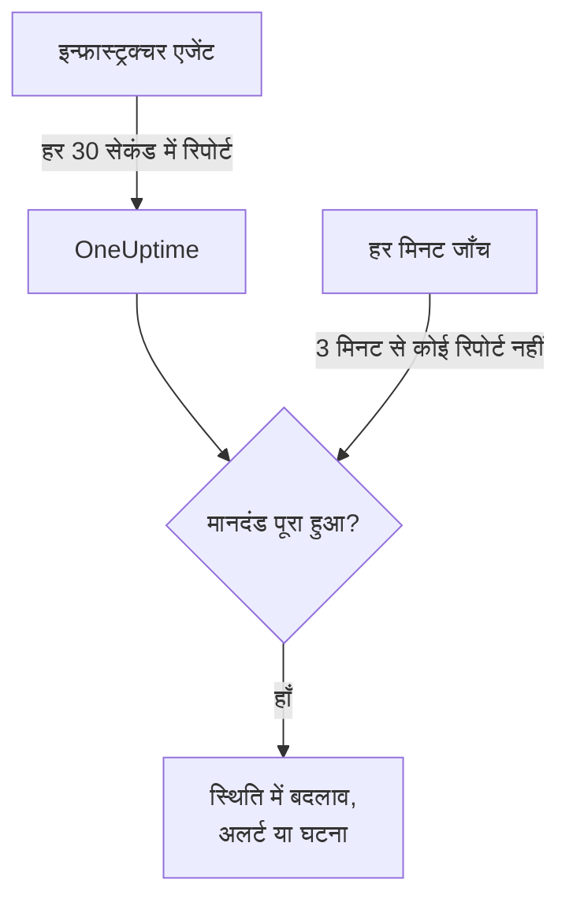

# सर्वर / VM मॉनिटर

Server / VM मॉनिटर OneUptime इन्फ्रास्ट्रक्चर एजेंट (`oneuptime-infrastructure-agent`) के ज़रिए एक मशीन की निगरानी करता है। यह एजेंट एक छोटी सेवा है जो हर 30 सेकंड में CPU, मेमोरी, डिस्क, लोड, नेटवर्क और चल रही प्रक्रियाओं की जानकारी OneUptime को भेजती है। यह पेज बताता है कि एजेंट को Server / VM मॉनिटर से कैसे जोड़ें, एजेंट क्या रिपोर्ट करता है, और वे मानदंड कैसे लिखें जो तय करते हैं कि सर्वर कब ऑनलाइन है और कब ऑफ़लाइन।

> [!IMPORTANT]
> **मॉनिटर बनाएं** अब **Server / VM** का विकल्प नहीं देता। आपके पहले से बने Server / VM मॉनिटर काम करते रहेंगे, और इस पेज की हर बात उन पर लागू होती है। किसी नए सर्वर की निगरानी के लिए इसके बजाय [होस्ट मॉनिटर](/docs/monitor/host-monitor) बनाएं: यह उन होस्ट मेट्रिक्स पर अलर्ट देता है जिन्हें [होस्ट OpenTelemetry कलेक्टर](/docs/telemetry/host-otel-collector) भेजता है।

:::cards
- [एजेंट को कनेक्ट करें](#एजेंट-को-कनेक्ट-करें): इसे इंस्टॉल करें, इसे मॉनिटर की सीक्रेट कुंजी दें और इसे शुरू करें।
- [एजेंट क्या रिपोर्ट करता है](#एजेंट-क्या-रिपोर्ट-करता-है): CPU, मेमोरी, डिस्क, लोड, नेटवर्क और प्रक्रियाएँ।
- [मॉनिटरिंग मानदंड](#मॉनिटरिंग-मानदंड): तय करें कि सर्वर कब ऑनलाइन या ऑफ़लाइन माना जाए।
- [समस्या निवारण](#समस्या-निवारण): एजेंट रिपोर्ट नहीं करता, या मॉनिटर कभी ऑफ़लाइन नहीं होता।
:::

## यह कैसे काम करता है

एजेंट एक सिस्टम सेवा के रूप में चलता है। हर 30 सेकंड में यह एक रिपोर्ट इकट्ठा करता है और उसे मॉनिटर की सीक्रेट कुंजी से हस्ताक्षरित करके आपके OneUptime URL पर भेजता है। OneUptime इन आँकड़ों को मॉनिटर के मेट्रिक्स के रूप में सहेजता है और रिपोर्ट को मॉनिटर के मानदंडों से जाँचता है।

चुप्पी की जाँच अलग से होती है। हर मिनट OneUptime उन सभी Server / VM मॉनिटरों के **Is Online** मानदंड का फिर से मूल्यांकन करता है जिन्होंने 3 मिनट या उससे अधिक समय से रिपोर्ट नहीं भेजी है, और जो सर्वर अपने मानदंड की अनुमति (डिफ़ॉल्ट रूप से 3 मिनट) से अधिक समय तक चुप रहता है, उसे ऑफ़लाइन माना जाता है। जिस मॉनिटर में **Is Online** मानदंड नहीं है, उसे सिर्फ़ इसलिए ऑफ़लाइन चिह्नित नहीं किया जाता कि एजेंट चुप हो गया। इस चुप्पी में सिर्फ़ वही समय गिना जाता है जब OneUptime डेटा प्राप्त कर रहा था: जिस समय OneUptime खुद रीस्टार्ट, अपग्रेड हो रहा था या बकाया निपटा रहा था, वह नहीं गिना जाता, जैसा कि [जब OneUptime डेटा प्राप्त नहीं कर रहा हो](/docs/monitor/when-oneuptime-is-not-receiving) में बताया गया है।



## शुरू करने से पहले

- आपके प्रोजेक्ट में एक Server / VM मॉनिटर।
- मॉनिटर संपादित करने की अनुमति। सीक्रेट कुंजी और उसे शामिल करने वाले सेटअप कमांड सिर्फ़ उन्हीं लोगों को दिखते हैं जो मॉनिटर संपादित कर सकते हैं।
- सर्वर पर root (Linux, macOS) या Administrator (Windows) अधिकार। एजेंट खुद को सिस्टम सेवा के रूप में इंस्टॉल करता है।
- सर्वर से आपके OneUptime URL तक बाहर जाने वाला HTTPS, सीधे या किसी HTTP प्रॉक्सी के ज़रिए।

## एजेंट को कनेक्ट करें

नीचे दिए कमांड `https://oneuptime.com` और `YOUR_SECRET_KEY` का उपयोग करते हैं। मॉनिटर के अपने सेटअप कमांड में आपका OneUptime URL और मॉनिटर की सीक्रेट कुंजी पहले से भरी होती है, इसलिए जहाँ तक हो सके उन्हें मॉनिटर से ही कॉपी करें।

:::steps
### मॉनिटर के सेटअप कमांड खोलें

**मॉनिटर** पर जाएं, Server / VM मॉनिटर खोलें और **दस्तावेज़ीकरण** चुनें। **Set up your Server Monitor (Linux/Mac)** और **Set up your Server Monitor (Windows)** कार्ड में इस मॉनिटर के कमांड हैं। जब तक एजेंट पहली बार रिपोर्ट नहीं करता, मॉनिटर का **अवलोकन** भी इन्हें दिखाता है।

### एजेंट इंस्टॉल करें

:::tabs
@tab Linux
```bash
curl -sSL https://oneuptime.com/docs/static/scripts/infrastructure-agent/install.sh | sudo bash
```
@tab macOS
```bash
curl -sSL https://oneuptime.com/docs/static/scripts/infrastructure-agent/install.sh | sudo bash
```
@tab Windows
1. [नवीनतम GitHub रिलीज़](https://github.com/OneUptime/oneuptime/releases/latest) से एजेंट डाउनलोड करें: x64 के लिए `oneuptime-infrastructure-agent_windows_amd64.zip`, या ARM64 के लिए `oneuptime-infrastructure-agent_windows_arm64.zip`।
2. zip को निकालें। इसमें `oneuptime-infrastructure-agent.exe` है।
3. जिस फ़ोल्डर में आपने इसे निकाला है, वहाँ Administrator के रूप में **कमांड प्रॉम्प्ट** खोलें।
:::

इंस्टॉल स्क्रिप्ट आपके ऑपरेटिंग सिस्टम और प्रोसेसर (x86-64 या ARM64) के लिए नवीनतम रिलीज़ डाउनलोड करती है और `oneuptime-infrastructure-agent` बाइनरी को `$HOME/bin` में रखती है। सेल्फ़-होस्टेड इंस्टॉल पर स्क्रिप्ट आपके अपने OneUptime URL से मिलती है।

### इसे मॉनिटर से जोड़ें

:::tabs
@tab Linux
```bash
sudo oneuptime-infrastructure-agent configure --secret-key=YOUR_SECRET_KEY --oneuptime-url=https://oneuptime.com
```
@tab macOS
```bash
sudo oneuptime-infrastructure-agent configure --secret-key=YOUR_SECRET_KEY --oneuptime-url=https://oneuptime.com
```
@tab Windows
```shell
oneuptime-infrastructure-agent configure --secret-key=YOUR_SECRET_KEY --oneuptime-url=https://oneuptime.com
```
:::

`configure` सीक्रेट कुंजी और URL को एजेंट की कॉन्फ़िगरेशन फ़ाइल में सहेजता है और एजेंट को सिस्टम सेवा के रूप में इंस्टॉल करता है। दोनों फ़्लैग आवश्यक हैं। सेल्फ़-होस्टेड इंस्टॉल पर `https://oneuptime.com` की जगह अपना URL डालें।

अगर सर्वर किसी प्रॉक्सी के ज़रिए इंटरनेट तक पहुँचता है, तो `--proxy-url` जोड़ें:

```bash
sudo oneuptime-infrastructure-agent configure --proxy-url=http://proxy.example.com:8080 --secret-key=YOUR_SECRET_KEY --oneuptime-url=https://oneuptime.com
```

### एजेंट शुरू करें

:::tabs
@tab Linux
```bash
sudo oneuptime-infrastructure-agent start
```
@tab macOS
```bash
sudo oneuptime-infrastructure-agent start
```
@tab Windows
```shell
oneuptime-infrastructure-agent start
```
:::

शुरू होने पर एजेंट OneUptime से सीक्रेट कुंजी की जाँच करता है और तुरंत अपनी पहली रिपोर्ट भेजता है।

### जाँचें कि यह रिपोर्ट कर रहा है

`sudo oneuptime-infrastructure-agent status` चलाएं (Windows पर `sudo` के बिना): यह `Service is running` दिखाता है। OneUptime में, पहली रिपोर्ट आते ही मॉनिटर का **अवलोकन** सेटअप कमांड दिखाना बंद कर देता है, और उसका **मेट्रिक्स** टैब सर्वर के चार्ट बनाने लगता है।
:::

## एजेंट संदर्भ

### कमांड

| कमांड | यह क्या करता है |
| --- | --- |
| `configure --secret-key=<key> --oneuptime-url=<url>` | सेटिंग्स सहेजता है और एजेंट को सिस्टम सेवा के रूप में इंस्टॉल करता है। रिपोर्ट को प्रॉक्सी के ज़रिए भेजने के लिए `--proxy-url=<url>` जोड़ें। |
| `start` | सेवा शुरू करता है। जब तक `configure` नहीं चलाया जाता, यह शुरू होने से मना करता है। |
| `stop` | सेवा रोकता है। |
| `restart` | सेवा फिर से शुरू करता है। |
| `status` | दिखाता है कि सेवा चल रही है या रुकी हुई है। |
| `logs` | एजेंट के लॉग की आख़िरी 100 पंक्तियाँ दिखाता है। `-n <lines>` अलग संख्या में पंक्तियाँ दिखाता है, और `-f` नई पंक्तियों का पीछा करता है। |
| `uninstall` | सेवा हटाता है और एजेंट की कॉन्फ़िगरेशन फ़ाइल मिटाता है। |
| `help` | कमांड की सूची दिखाता है। |

इन्हें Linux और macOS पर `sudo` के साथ चलाएं, और Windows पर Administrator **कमांड प्रॉम्प्ट** से चलाएं। कॉन्फ़िगर किए गए एजेंट की सीक्रेट कुंजी, URL या प्रॉक्सी बदलने के लिए `stop` और `uninstall` चलाएं, फिर दोबारा `configure` और `start` चलाएं।

### फ़ाइलें

| फ़ाइल | Linux और macOS | Windows |
| --- | --- | --- |
| कॉन्फ़िगरेशन | `/etc/oneuptime-infrastructure-agent/config.json` | `%PROGRAMDATA%\oneuptime-infrastructure-agent\config.json` |
| लॉग | `/var/log/oneuptime-infrastructure-agent/oneuptime-infrastructure-agent.log` | `%PROGRAMDATA%\oneuptime-infrastructure-agent\oneuptime-infrastructure-agent.log` |

जब एजेंट इन डायरेक्टरी में नहीं लिख पाता, तो वह इसके बजाय `~/.oneuptime-infrastructure-agent/` का उपयोग करता है। `ONEUPTIME_AGENT_CONFIG_PATH` और `ONEUPTIME_AGENT_LOG_PATH` एनवायरनमेंट वेरिएबल इनमें से किसी भी पथ को स्पष्ट रूप से सेट करते हैं।

## एजेंट क्या रिपोर्ट करता है

हर रिपोर्ट में सर्वर का होस्टनेम और ये होते हैं:

| क्षेत्र | क्या रिपोर्ट होता है |
| --- | --- |
| CPU | उपयोग %, कोर की संख्या, प्रति कोर उपयोग, और user, system, idle, I/O wait, steal, nice, IRQ और soft IRQ में बिताया गया समय |
| मेमोरी | कुल, प्रयुक्त, खाली और उपलब्ध मेमोरी, बफ़र और कैश, उपयोग %, और स्वैप का कुल, प्रयुक्त, खाली और उपयोग % |
| डिस्क | हर माउंट की गई डिस्क के लिए: माउंट पथ, डिवाइस, फ़ाइल सिस्टम, कुल, प्रयुक्त और खाली जगह, उपयोग %, पढ़े और लिखे गए बाइट और ऑपरेशन, और I/O समय |
| लोड | 1, 5 और 15 मिनट का लोड औसत |
| नेटवर्क | हर इंटरफ़ेस के लिए: भेजे और प्राप्त बाइट और पैकेट, अंदर और बाहर की त्रुटियाँ और ड्रॉप; साथ में स्थापित और सुन रहे कनेक्शन |
| होस्ट | ऑपरेटिंग सिस्टम, प्लेटफ़ॉर्म और संस्करण, कर्नेल संस्करण और आर्किटेक्चर, अपटाइम, बूट समय, वर्चुअलाइज़ेशन और प्रक्रियाओं की संख्या |
| प्रक्रियाएँ | हर चल रही प्रक्रिया: नाम, PID, कमांड, CPU %, मेमोरी, स्थिति, थ्रेड, उपयोगकर्ता और शुरू होने का समय |

जो मान ऑपरेटिंग सिस्टम नहीं देता, वे छोड़ दिए जाते हैं। मॉनिटर का **मेट्रिक्स** टैब उपलब्धता, CPU, मेमोरी, डिस्क उपयोग और I/O, लोड औसत, स्वैप, नेटवर्क ट्रैफ़िक और त्रुटियाँ, कनेक्शन, अपटाइम और प्रक्रियाओं की संख्या के चार्ट दिखाता है।

## मॉनिटरिंग मानदंड

मानदंड तय करते हैं कि मॉनिटर कब ऑनलाइन, धीमा या ऑफ़लाइन है, और कब वह अलर्ट या घटना खोलता है। मानदंड के हर फ़िल्टर में एक **फ़िल्टर प्रकार**, एक **फ़िल्टर शर्त** और ज़्यादातर प्रकारों के लिए एक मान होता है।

| फ़िल्टर प्रकार | यह क्या जाँचता है | फ़िल्टर शर्तें |
| --- | --- | --- |
| Is Online | क्या एजेंट ने हाल ही में रिपोर्ट किया है (डिफ़ॉल्ट रूप से पिछले 3 मिनट में) | सही, गलत |
| CPU Usage (in %) | कुल CPU उपयोग | Greater Than, Less Than, Greater Than Or Equal To, Less Than Or Equal To |
| Memory Usage (in %) | उपयोग में मेमोरी | CPU के समान |
| Disk Usage (in %) | **डिस्क पथ** में दी गई डिस्क का उपयोग | CPU के समान |
| Swap Usage (in %) | उपयोग में स्वैप | CPU के समान |
| CPU IO Wait (in %) | CPU समय का वह हिस्सा जो I/O की प्रतीक्षा में बीता | CPU के समान |
| Load Average (1 minute) | पिछले एक मिनट का लोड औसत | CPU के समान |
| Load Average (5 minute) | पिछले 5 मिनट का लोड औसत | CPU के समान |
| Load Average (15 minute) | पिछले 15 मिनट का लोड औसत | CPU के समान |
| Server Process Name | क्या इस नाम की प्रक्रिया चल रही है (केस-असंवेदी) | Is Executing, Is Not Executing |
| Server Process Command | क्या ठीक इसी कमांड लाइन वाली प्रक्रिया चल रही है (केस-असंवेदी) | Is Executing, Is Not Executing |
| Server Process PID | क्या इस PID वाली प्रक्रिया चल रही है | Is Executing, Is Not Executing |

**डिस्क पथ** एक माउंट पॉइंट या डिवाइस लेता है, जैसे `/`, `/mnt/data`, `C:\` या `/dev/sda1`; खाली छोड़ने पर यह `/` होता है। एजेंट द्वारा रिपोर्ट की गई हर डिस्क जाँचने के लिए `*` डालें: थ्रेशोल्ड पार करने वाली हर डिस्क को अपना अलग अलर्ट मिलता है, इसलिए भरती हुई दूसरी डिस्क पहली डिस्क के खुले अलर्ट के पीछे छिपती नहीं।

### समयावधि में मूल्यांकन

**इस मानदंड का एक समयावधि के दौरान मूल्यांकन करें** मानदंड फ़ॉर्म पर एक अलग चेकबॉक्स है, कोई फ़िल्टर शर्त नहीं। यह **Is Online** और हर संख्यात्मक फ़िल्टर प्रकार के लिए उपलब्ध है। इसे चालू करने पर नवीनतम जाँच के मान के बजाय एक समग्र मान की तुलना होती है – जिसे **मूल्यांकन करें** में चुना जाता है (औसत, योग, Maximum Value, Minimum Value, All Values, Any Value) और जो **पिछले (मिनटों में) के लिए** से तय विंडो पर लागू होता है। **Is Online** फ़िल्टर पर विंडो वह समय है जितनी देर एजेंट चुप रह सकता है, उसके बाद सर्वर ऑफ़लाइन माना जाता है।

**All Values** तभी मेल खाता है जब विंडो वास्तव में डेटा से ढकी हो। अभी-अभी बना मॉनिटर, या ऐसा मॉनिटर जिसकी जाँचें दर्ज होनी बंद हो गई हैं, पिछले N मिनटों के बारे में कुछ कहने लायक इतिहास नहीं रखता, इसलिए मानदंड अपने पास मौजूद एक रीडिंग पर मेल खाने के बजाय प्रतीक्षा करता है। **Any Value** "जैसे ही एक भी जाँच सीमा पार करे, मुझे बताओ" के लिए सेटिंग है और अब भी तुरंत ट्रिगर होती है।

**यदि कोई डेटा नहीं** यह नियंत्रित करता है कि जब विंडो मानदंड का समर्थन नहीं कर सकती तब क्या हो:

| यदि कोई डेटा नहीं | व्यवहार | इसका उपयोग कब करें |
| --- | --- | --- |
| **Ignore** (डिफ़ॉल्ट) | मानदंड मेल नहीं खाता। | सामान्य थ्रेशोल्ड अलर्ट। |
| **ट्रिगर** | डेटा का न होना ही समस्या माना जाता है। | हार्टबीट जैसी जाँचें, जहाँ चुप्पी अपने आप में विफलता है। |
| **Treat As Zero** | विंडो की तुलना एक अकेले शून्य के रूप में होती है। | काउंटर, जहाँ "कोई घटना नहीं" का मतलब सचमुच शून्य है। |

> [!TIP]
> CPU और लोड में हर समय छोटे उछाल आते रहते हैं। एक अकेली रिपोर्ट पर अलर्ट देने के बजाय उन्हें कुछ मिनटों में **औसत** या **All Values** से आँकें।

### उदाहरण मानदंड

| लक्ष्य | फ़िल्टर प्रकार | फ़िल्टर शर्त | मान |
| --- | --- | --- | --- |
| एजेंट के रिपोर्ट करना बंद करने पर सर्वर को ऑफ़लाइन चिह्नित करें | Is Online | गलत | — |
| CPU उपयोग 90% से ऊपर होने पर अलर्ट दें | CPU Usage (in %) | Greater Than | `90` |
| रूट डिस्क 85% से अधिक भरने पर अलर्ट दें | Disk Usage (in %), **डिस्क पथ** `/` | Greater Than | `85` |
| 85% से अधिक भरी किसी भी डिस्क पर अलर्ट दें, हर डिस्क के लिए एक अलर्ट | Disk Usage (in %), **डिस्क पथ** `*` | Greater Than | `85` |
| मेमोरी उपयोग 80% से ऊपर होने पर अलर्ट दें | Memory Usage (in %) | Greater Than | `80` |
| nginx के बंद होने पर अलर्ट दें | Server Process Name | Is Not Executing | `nginx` |

## समस्या निवारण

:::details एजेंट रिपोर्ट नहीं कर रहा
- जाँचें कि सेवा चल रही है: `sudo oneuptime-infrastructure-agent status`।
- इसका लॉग पढ़ें: `sudo oneuptime-infrastructure-agent logs -n 50`। `Metrics successfully pushed to OneUptime server` वाली पंक्ति का मतलब है कि रिपोर्ट पहुँच रही हैं।
- एजेंट शुरू होते समय सीक्रेट कुंजी की जाँच करता है और अगर OneUptime उसे अस्वीकार करता है तो `Secret key is invalid` लॉग करके बंद हो जाता है। कुंजी की तुलना मॉनिटर के **सेटिंग्स** पेज पर **सर्वर मॉनिटर सीक्रेट कुंजी रीसेट करें** के नीचे दी गई कुंजी से करें।
- सुनिश्चित करें कि सर्वर HTTPS पर आपके OneUptime URL तक पहुँच सकता है, और कोई फ़ायरवॉल बाहर जाने वाले कनेक्शन को रोक नहीं रहा।
:::

:::details `sudo` कहता है कि कमांड नहीं मिला
इंस्टॉल स्क्रिप्ट बाइनरी को उस उपयोगकर्ता के `$HOME/bin` में रखती है जिसके रूप में वह चली थी, और उपयोग की गई डायरेक्टरी दिखाती है। एजेंट को उसके पूरे पथ से चलाएं, उदाहरण के लिए `sudo /root/bin/oneuptime-infrastructure-agent configure ...`। इसके बजाय सिस्टम पथ की किसी डायरेक्टरी में इंस्टॉल करने के लिए स्क्रिप्ट को `-b` दें:

```bash
curl -sSL https://oneuptime.com/docs/static/scripts/infrastructure-agent/install.sh | sudo bash -s -- -b /usr/local/bin
```
:::

:::details `start` कहता है कि सेवा कॉन्फ़िगरेशन नहीं मिला
`configure` नहीं चलाया गया है, या `uninstall` ने उसका कॉन्फ़िगरेशन हटा दिया है। सीक्रेट कुंजी और URL के साथ `configure` चलाएं, फिर `start` चलाएं।
:::

:::details सर्वर बंद होने पर भी मॉनिटर कभी ऑफ़लाइन नहीं होता
सिर्फ़ **Is Online** मानदंड ही चुप सर्वर को ऑफ़लाइन चिह्नित करता है। **फ़िल्टर शर्त** को **गलत** पर सेट करके एक मानदंड जोड़ें, और वह मॉनिटर स्थिति सेट करें जिस पर वह बदलता है।
:::

:::details रिपोर्ट प्रॉक्सी से नहीं गुज़रतीं
- `--proxy-url` में दिए प्रॉक्सी URL और पोर्ट की जाँच करें।
- सुनिश्चित करें कि प्रॉक्सी आपके OneUptime URL तक कनेक्शन की अनुमति देता है।
- प्रॉक्सी बदलने के लिए `stop` और `uninstall` चलाएं, फिर नए `--proxy-url` के साथ `configure` चलाएं, और `start` चलाएं।
:::

## अगले चरण

:::cards
- [होस्ट मॉनिटर](/docs/monitor/host-monitor): नए सर्वरों के लिए मॉनिटर, OpenTelemetry होस्ट मेट्रिक्स पर बना।
- [होस्ट OpenTelemetry कलेक्टर](/docs/telemetry/host-otel-collector): Linux, macOS और Windows से होस्ट मेट्रिक्स और लॉग भेजें।
- [घटना और अलर्ट टेम्पलेट](/docs/monitor/incident-alert-templating): घटना के शीर्षकों में CPU, मेमोरी, डिस्क और प्रक्रिया का विवरण डालें।
:::
