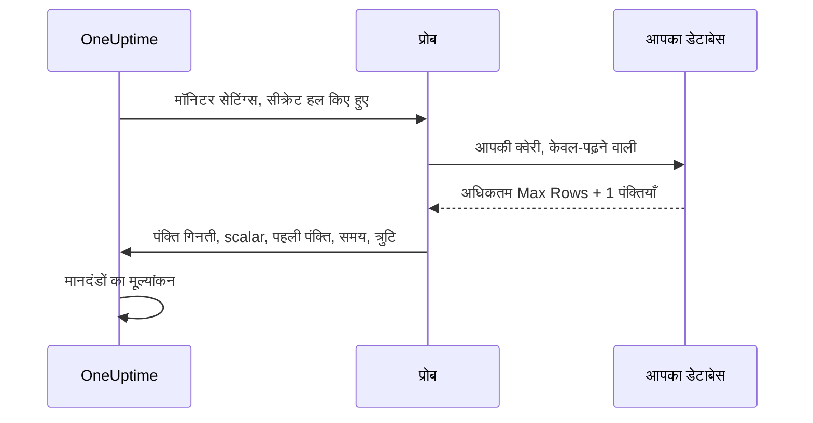

# SQL क्वेरी मॉनिटर

SQL क्वेरी मॉनिटर एक प्रोब से, तय शेड्यूल पर, केवल-पढ़ने वाली (read-only) SQL क्वेरी चलाता है और उसके परिणाम पर अलर्ट करता है — लौटाई गई पंक्तियों की संख्या, एक scalar मान, क्वेरी में लगा समय, या क्वेरी त्रुटि। यह "एक क्वेरी चलाओ और घटना खोलो" वाले उपयोग के लिए बना है, जैसे पिछले पाँच मिनट में रद्द हुए ऑर्डर की संख्या अचानक बढ़ने पर, किसी queue टेबल के बहुत बड़ी हो जाने पर, या किसी ज़रूरी पंक्ति के गायब हो जाने पर अलर्ट करना।

:::cards
- [केवल-पढ़ने वाला उपयोगकर्ता बनाएं](#केवल-पढ़ने-वाला-उपयोगकर्ता-बनाएं): वह डेटाबेस लॉगिन जिसका मॉनिटर को उपयोग करना चाहिए।
- [मॉनिटर बनाएं](#sql-क्वेरी-मॉनिटर-बनाएं): एक प्रोब जोड़ें और क्वेरी दर्ज करें।
- [क्वेरी लिखें](#क्वेरी-लिखें): जिस मान पर अलर्ट करना है, उसे पहले कॉलम में रखें।
- [मानदंड सेट करें](#मानदंड-सेट-करें): गिनती, किसी मान, धीमी क्वेरी या त्रुटि पर अलर्ट करें।
:::

## यह कैसे काम करता है

हर जाँच पर प्रोब आपके डेटाबेस से जुड़ता है, आपकी क्वेरी को केवल-पढ़ने वाले संदर्भ में चलाता है, अधिकतम एक सीमित संख्या में पंक्तियाँ वापस पढ़ता है, और OneUptime को एक छोटा सा सार रिपोर्ट करता है। फिर आपके मॉनिटर के मानदंडों का उसी सार पर मूल्यांकन होता है।

क्योंकि क्वेरी आपके नेटवर्क के अंदर के प्रोब से चलती है, OneUptime को कभी भी आपके डेटाबेस से सीधे जुड़ने की ज़रूरत नहीं पड़ती, और पूरा परिणाम सेट कभी प्रोब से बाहर नहीं जाता — केवल परिणाम का एक छोटा, सीमित सार वापस रिपोर्ट होता है।



प्रोब केवल यह रिपोर्ट करता है:

| मान | यह क्या है |
|---|---|
| **Row Count** | क्वेरी द्वारा लौटाई गई पंक्तियों की संख्या (Max Rows सीमा तक)। |
| **Scalar मान** | पहली पंक्ति का पहला कॉलम। `SELECT COUNT(*)` जैसी क्वेरी के लिए यही स्वाभाविक मान है। |
| **First Row** | कॉलम/मान जोड़ों के रूप में पहली पंक्ति, जो संदर्भ के लिए जाँच सारांश में दिखती है। |
| **Execution Time** | जाँच में लगा समय, मिलीसेकंड में — केवल क्वेरी नहीं, कनेक्ट होना भी शामिल है। |
| **क्वेरी त्रुटि** | क्वेरी विफल होने पर साफ़ किया गया त्रुटि संदेश। |

पूरा परिणाम सेट कभी OneUptime को नहीं भेजा जाता, इसलिए ग्राहक डेटा OneUptime के स्टोरेज में कॉपी नहीं होता।

## समर्थित डेटाबेस

| डेटाबेस | डिफ़ॉल्ट पोर्ट |
|---|---|
| **PostgreSQL** | `5432` |
| **MySQL** | `3306` |
| **Microsoft SQL Server** | `1433` |

MySQL-संगत और PostgreSQL-संगत engines जो वही wire protocol और SQL dialect बोलते हैं, आम तौर पर काम करते हैं, लेकिन आधिकारिक रूप से केवल ऊपर के तीन engines का परीक्षण होता है।

जब मॉनिटर जिस होस्ट और पोर्ट से जुड़ता है, वह [डेटाबेस](/docs/telemetry/databases) पेज पर किसी डेटाबेस के endpoints में से एक हो, तो उसके अलर्ट और घटनाएँ उस डेटाबेस के पेज पर भी दिखती हैं (देखें [किसी डेटाबेस पर अलर्ट](/docs/telemetry/databases#alerts-on-a-database))। मॉनिटर सीक्रेट संदर्भ के रूप में दिया गया होस्ट मिलाया नहीं जाता।

## सुरक्षा मॉडल

ग्राहक द्वारा दी गई क्वेरी को production डेटाबेस पर चलाना संवेदनशील है, इसलिए SQL क्वेरी मॉनिटर बनावट से ही केवल-पढ़ने वाला है और कई नियंत्रणों की परतें रखता है:

| नियंत्रण | यह क्या करता है |
|---|---|
| **न्यूनतम-अधिकार वाला डेटाबेस उपयोगकर्ता** (मुख्य नियंत्रण) | हमेशा एक समर्पित, केवल-पढ़ने वाले डेटाबेस उपयोगकर्ता से जुड़ें, जिसकी पहुँच केवल उन टेबलों तक हो जिनकी क्वेरी को ज़रूरत है। यह सबसे ज़रूरी नियंत्रण है — देखें [केवल-पढ़ने वाला उपयोगकर्ता बनाएं](#केवल-पढ़ने-वाला-उपयोगकर्ता-बनाएं)। |
| **केवल-पढ़ने वाला निष्पादन** | PostgreSQL और MySQL पर प्रोब एक `READ ONLY` transaction खोलता है, जो क्वेरी के टेक्स्ट से परे किसी भी लेखन (लिखने वाले CTEs सहित) को अस्वीकार करता है। Microsoft SQL Server पर, जिसमें केवल-पढ़ने वाला transaction नहीं है, प्रोब एक ऐसे transaction के अंदर चलता है जो हमेशा rollback होता है। |
| **एकल statement, अनुमत-सूची वाली क्वेरी** | क्वेरी एक ही statement होनी चाहिए जो `SELECT`, `WITH`, `VALUES` या `TABLE` से शुरू हो। एक के बाद एक जुड़े statements (`SELECT 1; DROP TABLE …`) और `INSERT`, `UPDATE`, `DELETE`, `DROP`, `EXEC` और `INTO` जैसे लेखन या DDL keywords को प्रोब कनेक्ट होने से पहले ही अस्वीकार कर देता है। यह जाँच एक सुरक्षा जाल है, सीमा नहीं: सीमा केवल-पढ़ने वाला उपयोगकर्ता है। |
| **Statement timeout** | हर क्वेरी की एक सख़्त समय सीमा होती है। बहुत देर चलने वाली क्वेरी रद्द कर दी जाती है। |
| **सीमित पंक्तियाँ** | कभी भी Max Rows से ज़्यादा पंक्तियाँ वापस नहीं पढ़ी जातीं (काट-छाँट पकड़ने के लिए एक अतिरिक्त), जिससे प्रोब की मेमोरी और डेटा का आकार सीमित रहता है। |
| **क्रेडेंशियल छिपाना** | डेटाबेस त्रुटियाँ संग्रहीत होने से पहले साफ़ की जाती हैं — पासवर्ड, होस्ट, उपयोगकर्ता नाम और डेटाबेस नाम, और कोई भी connection string छिपा दी जाती है, ताकि क्रेडेंशियल कभी त्रुटि संदेशों में न आएँ। |

## शुरू करने से पहले

- एक **प्रोब** जिसकी नेटवर्क पहुँच आपके डेटाबेस होस्ट और पोर्ट तक हो। यह OneUptime द्वारा होस्ट किया गया प्रोब हो सकता है (अगर आपका डेटाबेस इंटरनेट से पहुँच योग्य है) या आपके नेटवर्क के अंदर चलने वाला [कस्टम प्रोब](/docs/probe/custom-probe)।
- एक **केवल-पढ़ने वाला डेटाबेस उपयोगकर्ता** और कनेक्शन विवरण (होस्ट, पोर्ट, डेटाबेस नाम, उपयोगकर्ता नाम, पासवर्ड), या SQL Server Integrated Authentication का उपयोग करते समय एक केवल-पढ़ने वाली Windows/domain पहचान।

## केवल-पढ़ने वाला उपयोगकर्ता बनाएं

हमेशा एक समर्पित केवल-पढ़ने वाले उपयोगकर्ता से जुड़ें। अपने engine के statements एक administrator के रूप में चलाएँ, और `orders` को अपने डेटाबेस से बदलें:

:::tabs
@tab PostgreSQL
```sql
-- PostgreSQL
CREATE USER oneuptime_ro WITH PASSWORD 'a-strong-password';
GRANT CONNECT ON DATABASE orders TO oneuptime_ro;
GRANT USAGE ON SCHEMA public TO oneuptime_ro;
GRANT SELECT ON ALL TABLES IN SCHEMA public TO oneuptime_ro;
-- Include tables created in the future:
ALTER DEFAULT PRIVILEGES IN SCHEMA public GRANT SELECT ON TABLES TO oneuptime_ro;
```
@tab MySQL
```sql
-- MySQL
CREATE USER 'oneuptime_ro'@'%' IDENTIFIED BY 'a-strong-password';
GRANT SELECT ON orders.* TO 'oneuptime_ro'@'%';
FLUSH PRIVILEGES;
```
@tab Microsoft SQL Server
```sql
-- Microsoft SQL Server
CREATE LOGIN oneuptime_ro WITH PASSWORD = 'a-strong-password';
USE orders;
CREATE USER oneuptime_ro FOR LOGIN oneuptime_ro;
ALTER ROLE db_datareader ADD MEMBER oneuptime_ro;
```
:::

और कड़े अधिकार के लिए उपयोगकर्ता को केवल उन टेबलों पर `SELECT` दें जिन्हें आपकी क्वेरी पढ़ती है।

## SQL क्वेरी मॉनिटर बनाएं

:::steps
### नया मॉनिटर शुरू करें

**मॉनिटर** पर जाएँ और **मॉनिटर बनाएं** पर क्लिक करें। **मॉनिटर प्रकार** में **और मॉनिटर प्रकार** पर क्लिक करें और **Database Monitoring** के अंतर्गत **SQL Query** चुनें, या खोज बॉक्स में `query` टाइप करें। एक **नाम** दर्ज करें, फिर **अगला** पर क्लिक करें।

### कनेक्शन विवरण दर्ज करें

**Database Type** चुनें — पोर्ट उस engine के डिफ़ॉल्ट में बदल जाता है — फिर होस्ट, डेटाबेस नाम और केवल-पढ़ने वाले उपयोगकर्ता के क्रेडेंशियल भरें। पासवर्ड टाइप करने के बजाय उसे [मॉनिटर सीक्रेट](#पासवर्ड-के-लिए-मॉनिटर-सीक्रेट-का-उपयोग) के रूप में संदर्भित करें। हर field का वर्णन [कॉन्फ़िगरेशन](#कॉन्फ़िगरेशन) में है।

### क्वेरी दर्ज करें

**SQL Query** में एक केवल-पढ़ने वाला statement टाइप करें (देखें [क्वेरी लिखें](#क्वेरी-लिखें))।

### परीक्षण करें

सहेजने से पहले क्वेरी को एक प्रोब से एक बार चलाने के लिए **मॉनिटर का परीक्षण करें** पर क्लिक करें।

### मानदंड तय करें

मॉनिटर जिन मानदंडों के साथ शुरू होता है उनकी समीक्षा करें और अपने मानदंड जोड़ें — देखें [मानदंड सेट करें](#मानदंड-सेट-करें)। फिर **अगला** पर क्लिक करें।

### प्रोब चुनें और बनाएं

वे **प्रोब** चुनें जो डेटाबेस तक पहुँच सकते हैं, और एक **निगरानी अंतराल** चुनें, फिर **मॉनिटर बनाएं** पर क्लिक करें।
:::

## कॉन्फ़िगरेशन

| Field | क्या दर्ज करें |
|---|---|
| **Database Type** | PostgreSQL, MySQL या Microsoft SQL Server। प्रकार चुनने से डिफ़ॉल्ट पोर्ट सेट होता है। |
| **होस्ट** | डेटाबेस होस्ट जिस तक प्रोब पहुँच सके (उदाहरण के लिए `db.internal`)। |
| **पोर्ट** | डेटाबेस पोर्ट। |
| **डेटाबेस नाम** | वह डेटाबेस जिस पर क्वेरी चलानी है। |
| **Use Windows Integrated Authentication** | केवल Microsoft SQL Server। SQL उपयोगकर्ता नाम और पासवर्ड के बजाय उस account से प्रमाणित करें जिससे प्रोब चल रहा है। देखें [Windows Integrated Authentication](#windows-integrated-authentication)। |
| **उपयोगकर्ता नाम** | एक केवल-पढ़ने वाला, न्यूनतम-अधिकार वाला डेटाबेस उपयोगकर्ता। |
| **पासवर्ड** | डेटाबेस पासवर्ड। हम ज़ोरदार सलाह देते हैं कि पासवर्ड सादे टेक्स्ट में टाइप करने के बजाय `{{monitorSecrets.name}}` से किसी [मॉनिटर सीक्रेट](/docs/monitor/monitor-secrets) को संदर्भित करें (देखें [पासवर्ड के लिए मॉनिटर सीक्रेट का उपयोग](#पासवर्ड-के-लिए-मॉनिटर-सीक्रेट-का-उपयोग))। |
| **SQL Query** | चलाने के लिए केवल-पढ़ने वाली क्वेरी (देखें [क्वेरी लिखें](#क्वेरी-लिखें))। |
| **Use SSL/TLS** | TLS पर जुड़ने के लिए चालू करें। चालू होने पर, अगर डेटाबेस self-signed प्रमाणपत्र का उपयोग करता है, तो आप **Verify server certificate** बंद कर सकते हैं। |

### और फ़ील्ड

| Field | डिफ़ॉल्ट | अधिकतम | यह क्या सीमित करता है |
|---|---|---|---|
| **Connection Timeout (ms)** | `10000` | `30000` | कनेक्शन बनने की कितनी देर प्रतीक्षा करनी है। |
| **Statement Timeout (ms)** | `15000` | `60000` | क्वेरी कितनी देर चल सकती है, इसकी सख़्त सीमा। |
| **Max Rows** | `100` | `1000` | डेटाबेस से वापस पढ़ी जाने वाली पंक्तियों की ऊपरी सीमा। |

अधिकतम से ऊपर का मान घटाकर अधिकतम कर दिया जाता है।

### Windows Integrated Authentication

Microsoft SQL Server के लिए, प्रोब process की पहचान से एक भरोसेमंद कनेक्शन खोलने हेतु **Use Windows Integrated Authentication** चालू करें। इस मोड में उपयोगकर्ता नाम और पासवर्ड fields अनदेखे किए जाते हैं और driver को नहीं भेजे जाते। क्योंकि प्रोब को ऐसी पहचान चाहिए जिस पर आपका domain भरोसा करे, इस प्रमाणीकरण मोड के लिए self-hosted प्रोब का उपयोग करें।

| प्रोब कहाँ चलता है | क्या सेट करना है |
|---|---|
| **Windows** | प्रोब सेवा को ऐसे domain account से चलाएँ जिसके पास केवल-पढ़ने वाला SQL Server login हो। |
| **Linux या macOS** | SQL Server domain के लिए Kerberos कॉन्फ़िगर करें और प्रोब process को एक मान्य ticket दें (उदाहरण के लिए keytab के ज़रिए)। आधिकारिक Linux प्रोब image में Microsoft ODBC Driver 18, unixODBC और Kerberos client शामिल हैं। Kerberos कॉन्फ़िगरेशन और ticket cache को container में mount करें, उन्हें प्रोब process के लिए पढ़ने योग्य बनाएँ, और उनकी जगह डिफ़ॉल्ट न होने पर `KRB5_CONFIG` या `KRB5CCNAME` सेट करें। |

प्रोब को चलाने वाले होस्ट पर Microsoft ODBC Driver for SQL Server इंस्टॉल होना चाहिए। आधिकारिक प्रोब image में **ODBC Driver 18** शामिल है। जब आप self-hosted या कस्टम प्रोब चलाते हैं, तो प्रोब होस्ट पर रजिस्टर्ड सबसे नया `ODBC Driver N for SQL Server` अपने आप ढूँढकर उपयोग करता है (उदाहरण के लिए, अगर Driver 17 इंस्टॉल है तो वही) — ठीक Driver 18 होना ज़रूरी नहीं। किसी खास driver को तय करने के लिए प्रोब पर `SQL_SERVER_ODBC_DRIVER` environment variable को driver के सटीक नाम पर सेट करें (उदाहरण के लिए `ODBC Driver 17 for SQL Server`)।

SQL Server के पास उपयुक्त `MSSQLSvc` service principal name होना चाहिए, प्रोब और domain controller की घड़ियाँ synchronized होनी चाहिए, और प्रोब को SQL Server तक उस hostname से resolve करके पहुँचना चाहिए जिसे वह service principal कवर करता है। भरोसेमंद पहचान को केवल वही डेटाबेस अधिकार दें जिनकी निगरानी क्वेरी को ज़रूरत है।

## क्वेरी लिखें

क्वेरी **एक केवल-पढ़ने वाला statement** होनी चाहिए। उसे `SELECT`, `WITH`, `VALUES` या `TABLE` में से किसी एक से शुरू होना चाहिए। अंत में semicolon चल सकता है; कई statements नहीं। लेखन और DDL keywords क्वेरी में कहीं भी हों, अस्वीकार किए जाते हैं — `INTO` भी, इसलिए `SELECT … INTO` भी अस्वीकार होता है।

प्रोब क्वेरी की जाँच हर जाँच पर करता है, सहेजते समय नहीं। इन नियमों को तोड़ने वाली क्वेरी सहेज ली जाती है, और फिर हर जाँच "Only read-only queries are allowed (must start with SELECT, WITH, VALUES, or TABLE)." के साथ विफल होती है — डिफ़ॉल्ट मानदंड मॉनिटर को ऑफ़लाइन कर देते हैं।

क्वेरी हल्की और सीमित रखें — वे हर जाँच पर चलती हैं, इसलिए indexed कॉलम और संकरी समय सीमा को प्राथमिकता दें। यह क्वेरी पिछले पाँच मिनट में रद्द हुए ऑर्डर गिनती है:

:::tabs
@tab PostgreSQL
```sql
-- Count recent cancellations (PostgreSQL)
SELECT COUNT(*) AS cancelled
FROM orders
WHERE status = 'CANCELLED'
  AND created_at > NOW() - INTERVAL '5 minutes';
```
@tab MySQL
```sql
-- The same idea on MySQL
SELECT COUNT(*) AS cancelled
FROM orders
WHERE status = 'CANCELLED'
  AND created_at > NOW() - INTERVAL 5 MINUTE;
```
@tab Microsoft SQL Server
```sql
-- The same idea on Microsoft SQL Server
SELECT COUNT(*) AS cancelled
FROM orders
WHERE status = 'CANCELLED'
  AND created_at > DATEADD(minute, -5, GETDATE());
```
:::

> [!TIP]
> `COUNT(*)` जैसी क्वेरी के लिए गिनती **Row Count** (जो `1` है, क्योंकि एक पंक्ति लौटती है) और **Scalar मान** (पहले कॉलम से खुद गिनती) दोनों के रूप में उपलब्ध है। "कितने" पर अलर्ट करने के लिए **Scalar मान** से तुलना करें।

## पासवर्ड के लिए मॉनिटर सीक्रेट का उपयोग

ताकि डेटाबेस पासवर्ड कभी मॉनिटर पर सादे टेक्स्ट में संग्रहीत न हो, एक [मॉनिटर सीक्रेट](/docs/monitor/monitor-secrets) बनाएं और उसे पासवर्ड field से संदर्भित करें:

:::steps
1. **मॉनिटर → सेटिंग्स → सीक्रेट** पर जाएँ और एक मॉनिटर सीक्रेट बनाएं।
2. उसे एक नाम दें (उदाहरण के लिए `dbPassword`) और इस मॉनिटर को उसकी पहुँच दें।
3. मॉनिटर के **पासवर्ड** field में `{{monitorSecrets.dbPassword}}` दर्ज करें।
:::

कॉन्फ़िगरेशन प्रोब को सौंपने से पहले OneUptime सर्वर पर सीक्रेट को हल करता है। OneUptime ये सीक्रेट कभी आपके लिए नहीं बनाता — किसी को संदर्भित करना आपका चुनाव है। **उपयोगकर्ता नाम**, **होस्ट**, **डेटाबेस नाम** और **SQL Query** fields भी सीक्रेट संदर्भ स्वीकार करते हैं; **पोर्ट** नहीं।

## मानदंड सेट करें

यह तय करने के लिए मानदंड जोड़ें कि मॉनिटर कब ऑनलाइन, प्रदर्शन में गिरावट वाला या ऑफ़लाइन माना जाए। SQL क्वेरी मॉनिटर के लिए ये जाँचें उपलब्ध हैं:

| फ़िल्टर प्रकार | यह क्या जाँचता है |
|---|---|
| **SQL Is Online** | क्या डेटाबेस पहुँच योग्य था और क्वेरी सफल हुई। |
| **SQL Query Row Count** | लौटाई गई पंक्तियों की संख्या। greater than, less than या equal to जैसे operators से तुलना करें। |
| **SQL Query Scalar Value** | पहली पंक्ति का पहला कॉलम। जब आपका दर्ज किया मान संख्या हो तो संख्या के रूप में, वरना string के रूप में तुलना होती है। `COUNT(*)` जैसी क्वेरी के लिए यही जाँच इस्तेमाल करें। |
| **SQL Query Execution Time (in ms)** | क्वेरी में कितना समय लगा। धीमे डेटाबेस को पकड़ने के लिए उपयोगी। |
| **SQL Query Error** | क्वेरी का त्रुटि संदेश। जब वह खाली हो (या न हो), या किसी खास string से मेल खाए, तब अलर्ट करें। |
| **JavaScript Expression** | `rowCount`, `scalarValue`, `firstRow`, `executionTimeInMs`, `queryError` और `isOnline` पर एक कस्टम JavaScript expression का मूल्यांकन करें। देखें [JavaScript अभिव्यक्तियाँ](/docs/monitor/javascript-expression#sql-क्वेरी-मॉनिटर)। |

संख्यात्मक सीमाएँ पूर्ण संख्याएँ होती हैं: `10.5` नहीं, `10` लिखें। SQL Query फ़िल्टर किसी समय अवधि पर मूल्यांकित नहीं हो सकते; हर जाँच अपने आप में अलग होती है।

नया SQL क्वेरी मॉनिटर दो मानदंडों के साथ शुरू होता है: **SQL Is Online** false है — मॉनिटर ऑफ़लाइन होता है और एक घटना घोषित करता है जो अपने आप सुलझ जाती है — और **SQL Is Online** true है, जो उसे ऑनलाइन चिह्नित करता है। **मानदंड जोड़ें** सबसे नीचे एक मानदंड जोड़ता है; उसे ऑनलाइन मानदंड के ऊपर खींचें, क्योंकि मानदंड ऊपर से जाँचे जाते हैं और जो पहले मेल खाए वही तय करता है।

### उदाहरण: रद्दीकरण अचानक बढ़ने पर अलर्ट

ऊपर की क्वेरी के साथ:

| मानदंड | फ़िल्टर |
|---|---|
| **प्रदर्शन में गिरावट** | `SQL Query Scalar Value` `10` से अधिक है। |
| **ऑफ़लाइन** | `SQL Query Scalar Value` `50` से अधिक है, या `SQL Is Online` `false` है। |

मानदंड से एक on-call नीति जोड़ें ताकि सही लोगों को पेज किया जाए। SQL क्वेरी मॉनिटर के अपने कोई टेम्पलेट वेरिएबल नहीं हैं: घटना का शीर्षक `{{monitorName}}` से मॉनिटर का नाम ले सकता है, लेकिन क्वेरी का परिणाम उद्धृत नहीं कर सकता।

## ध्यान देने योग्य बातें

- क्वेरी हर जाँच पर चलती है, इसलिए उसे हल्का रखें। indexes और संकरी समय सीमाओं का उपयोग करें, और Statement Timeout को अंतिम सुरक्षा मानें।
- केवल पंक्ति गिनती, पहला cell (scalar) और पहली पंक्ति रिपोर्ट होती है — अपनी क्वेरी ऐसे बनाएँ कि जिस मान पर अलर्ट करना है वह पहला कॉलम हो।
- अगर परिणाम Max Rows से ज़्यादा होने के कारण काटा जाता है, तो जाँच सारांश **Rows Truncated**: "Yes (result capped)" दिखाता है। Max Rows केवल ज़रूरत होने पर बढ़ाएँ; बड़े परिणाम सेट प्रोब पर ज़्यादा मेमोरी लेते हैं।
- लेखन और DDL हमेशा अस्वीकार होते हैं। अगर आपको किसी लेखन मार्ग का परीक्षण करना है, तो यह मॉनिटर उसके लिए नहीं है।
- सादे टेक्स्ट वाले पासवर्ड के बजाय मॉनिटर सीक्रेट को प्राथमिकता दें, ताकि क्रेडेंशियल संग्रहीत रहते हुए एन्क्रिप्टेड रहें।
- जिस जाँच की क्वेरी विफल होती है, उसे त्रुटि रिपोर्ट करने से पहले एक सेकंड बाद, तीन बार तक, फिर से आज़माया जाता है, ताकि थोड़ी देर का कनेक्शन टूटना मॉनिटर को ऑफ़लाइन न करे। Self-hosted प्रोब पर `PROBE_MONITOR_RETRY_LIMIT` यह संख्या तय करता है।

## समस्या निवारण

:::details हर जाँच "Only read-only queries are allowed" के साथ विफल होती है
क्वेरी `SELECT`, `WITH`, `VALUES` या `TABLE` से शुरू नहीं होती। उससे पहले कोई comment चलता है; `SET` या `DECLARE` नहीं। उसे एक केवल-पढ़ने वाले statement के रूप में फिर से लिखें।
:::

:::details कोई जाँच "Disallowed SQL keyword" के साथ विफल होती है
क्वेरी में कहीं कोई लेखन, DDL या निष्पादन keyword है, `SELECT` के अंदर भी, जैसे `INTO` या `EXEC`। उद्धृत strings और comments के अंदर के शब्द नहीं गिने जाते। keyword हटाएँ, या logic को ऐसे view में रखें जिसे केवल-पढ़ने वाला उपयोगकर्ता पढ़ सके।
:::

:::details जाँच का समय समाप्त हो जाता है
प्रोब **Connection Timeout (ms)** के भीतर कनेक्ट नहीं हो सका, या क्वेरी **Statement Timeout (ms)** से ज़्यादा चली। जाँचें कि प्रोब होस्ट और पोर्ट तक पहुँच सकता है, फिर क्वेरी को हल्का करें: छोटी समय सीमा पर indexed कॉलम से फ़िल्टर करें।
:::

:::details कनेक्शन प्रमाणपत्र त्रुटि के साथ विफल होता है
डेटाबेस का प्रमाणपत्र self-signed है, या प्रोब उस पर भरोसा नहीं करता। **Verify server certificate** बंद करें, जो **Use SSL/TLS** चालू होने पर दिखता है, या डेटाबेस को ऐसा प्रमाणपत्र दें जिस पर प्रोब भरोसा करे।
:::

:::details Windows Integrated Authentication विफल होता है
प्रोब को Microsoft ODBC Driver for SQL Server और ऐसी पहचान चाहिए जिस पर आपका domain भरोसा करे। आधिकारिक प्रोब image चलाएँ, या driver इंस्टॉल करें, फिर [Windows Integrated Authentication](#windows-integrated-authentication) में सेटअप जाँचें।
:::

## अगले कदम

:::cards
- [डेटाबेस हेल्थ मॉनिटर](/docs/monitor/database-health-monitor): SQL लिखे बिना कनेक्शन, locks और replication पर नज़र रखें।
- [मॉनिटर रहस्य](/docs/monitor/monitor-secrets): डेटाबेस पासवर्ड को एन्क्रिप्टेड रखें।
- [JavaScript अभिव्यक्तियाँ](/docs/monitor/javascript-expression): कई मानों को जोड़ने वाले मानदंड लिखें।
- [कस्टम प्रोब](/docs/probe/custom-probe): अपने नेटवर्क के अंदर से जाँचें चलाएँ।
:::
