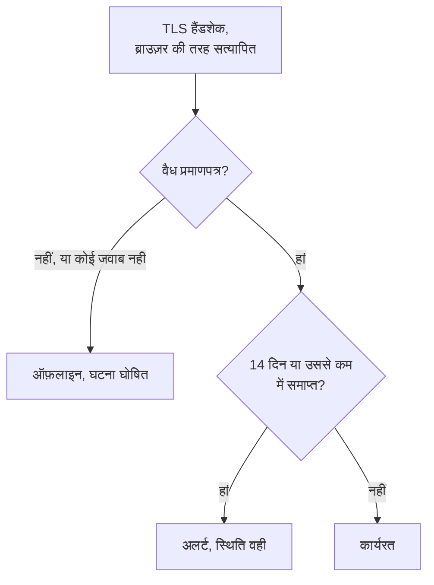

# SSL प्रमाणपत्र मॉनिटर

SSL प्रमाणपत्र मॉनिटर आपकी साइटों और सेवाओं के TLS प्रमाणपत्रों को उसी तरह जांचता है जैसे कोई ब्राउज़र करता है, और उनके समाप्त होने से पहले आपको अलर्ट करता है। जब कोई प्रमाणपत्र अब वैध नहीं रहता, यानी समाप्त हो गया हो, सेल्फ़-साइन्ड हो, किसी दूसरे होस्ट नाम के लिए जारी हुआ हो, या किसी ऐसे प्राधिकारी से हो जिस पर ब्राउज़र भरोसा नहीं करते, तो यह मॉनिटर को ऑफ़लाइन भी कर देता है।

:::cards
- [मॉनिटर बनाएं](#ssl-प्रमाणपत्र-मॉनिटर-बनाएं): डैशबोर्ड में छह चरण।
- [डिफ़ॉल्ट मानदंड](#डिफ़ॉल्ट-मानदंड): बिना किसी सेटअप के, 14 दिन पहले समाप्ति की चेतावनी।
- [निगरानी मानदंड](#निगरानी-मानदंड): वैधता, समाप्ति और सेल्फ़-साइन्ड प्रमाणपत्र।
- [समस्या निवारण](#समस्या-निवारण): सेल्फ़-साइन्ड और आंतरिक प्रमाणपत्र।
:::

## यह कैसे काम करता है

हर जांच में प्रोब URL के होस्ट और पोर्ट से TLS कनेक्शन खोलता है, पोर्ट `443` जब तक URL कोई दूसरा पोर्ट न बताए, और प्रमाणपत्र को वैसे ही सत्यापित करता है जैसे कोई ब्राउज़र करेगा: भरोसेमंद जारीकर्ता, मेल खाता होस्ट नाम, और ऐसी तारीखें जिनमें आज शामिल हो। अगर प्रमाणपत्र सत्यापन में विफल होता है, तब भी प्रोब उसे पढ़ता है, इसलिए उसकी समाप्ति तिथि, जारीकर्ता और फ़िंगरप्रिंट हर हाल में दर्ज होते हैं। जो कनेक्शन विफल होता है, टाइम आउट होता है या अवैध प्रमाणपत्र दिखाता है, उसे आपकी अनुमति वाली पुनः प्रयास संख्या तक फिर से आज़माया जाता है। फिर OneUptime परिणाम को मॉनिटर के मानदंडों से गुज़ारता है।

जिस प्रोब का अपना नेटवर्क कनेक्शन टूट गया हो, वह कोई परिणाम नहीं भेजता, इसलिए वह आपके प्रमाणपत्र को अवैध नहीं दिखा सकता।

## शुरू करने से पहले

- **ऐसी भूमिका जो मॉनिटर बना सके**: Project Owner, Project Admin, Project Member, Monitor Admin या Monitor Member, या Create Monitor अनुमति वाली कोई कस्टम भूमिका।
- **ऐसा प्रोब जो होस्ट और पोर्ट तक पहुंच सके।** हर नए मॉनिटर के लिए आपके प्रोजेक्ट के डिफ़ॉल्ट प्रोब चुने जाते हैं। निजी नेटवर्क की किसी सेवा के लिए उस नेटवर्क के अंदर [कस्टम प्रोब](/docs/probe/custom-probe) चाहिए।

## SSL प्रमाणपत्र मॉनिटर बनाएं

:::steps
### नया मॉनिटर शुरू करें

**मॉनिटर** पर जाएं और **मॉनिटर बनाएं** पर क्लिक करें। **मॉनिटर प्रकार** में **SSL Certificate** चुनें।

### नाम दें

**नाम** डालें, जैसे `example.com certificate`, फिर **अगला** पर क्लिक करें।

### URL डालें

**वेबसाइट URL** में वह साइट डालें जिसका प्रमाणपत्र जांचना है, जैसे `https://example.com`। किसी दूसरे पोर्ट की सेवा के लिए पोर्ट भी शामिल करें: `https://example.com:8443`।

### जांच कर देखें

**मॉनिटर का परीक्षण करें** पर क्लिक करें, **प्रोब चुनें** में कोई प्रोब चुनें और **परीक्षण चलाएं** पर क्लिक करें। **मॉनिटर परीक्षण परिणाम** प्रोब को मिला प्रमाणपत्र, उसके जारीकर्ता और समाप्ति तिथि के साथ दिखाता है।

### मानदंड देखें

**मॉनिटर मानदंड** [डिफ़ॉल्ट मानदंड](#डिफ़ॉल्ट-मानदंड) से शुरू होता है: प्रमाणपत्र वैध न हो तो ऑफ़लाइन, 14 दिन या उससे कम में समाप्त हो तो अलर्ट। ज़रूरत हो तो उन्हें बदलें, फिर **अगला** पर क्लिक करें।

### प्रोब चुनें और बनाएं

**प्रोब** और **निगरानी अंतराल** (यह **हर 5 मिनट** से शुरू होता है; SSL प्रमाणपत्र मॉनिटर के लिए 5 मिनट या उससे लंबे अंतराल मिलते हैं) को वैसा ही रखें या बदलें, फिर **मॉनिटर बनाएं** पर क्लिक करें। मॉनिटर का पेज खुल जाता है।
:::

## कॉन्फ़िगरेशन विकल्प

| फ़ील्ड | डिफ़ॉल्ट | क्या डालें |
| --- | --- | --- |
| **वेबसाइट URL** | कोई नहीं | वह साइट जिसका प्रमाणपत्र जांचना है, जैसे `https://example.com` या `https://example.com:8443`। केवल होस्ट और पोर्ट उपयोग होते हैं; पाथ को अनदेखा किया जाता है। |
| **अनुरोध टाइमआउट (सेकंड)** (**और फ़ील्ड** के नीचे) | `60` | हर प्रयास में TLS हैंडशेक के लिए कितनी देर प्रतीक्षा करनी है। अधिकतम 60 सेकंड। |
| **विफलता पर पुनः प्रयास** (**और फ़ील्ड** के नीचे) | प्रोब का डिफ़ॉल्ट, आम तौर पर `3` | किसी विफल प्रयास को कितनी बार दोहराना है। अधिकतम 3। |

**विफलता पर पुनः प्रयास** पहले प्रयास के _बाद_ के पुनः प्रयास गिनता है, इसलिए `0` जांच को एक बार चलाता है और `2` उसे तीन बार तक चलाता है। खाली छोड़ने पर प्रोब का डिफ़ॉल्ट लागू होता है: 3, जब तक प्रोब का `PROBE_MONITOR_RETRY_LIMIT` कुछ और न कहे। कनेक्शन विफलताएं, प्रमाणपत्र सत्यापन विफलताएं और टाइमआउट, सभी दोहराए जाते हैं, प्रयासों के बीच एक सेकंड के ठहराव के साथ।

## निगरानी मानदंड

मानदंड तय करते हैं कि प्रमाणपत्र कब ठीक, डिग्रेडेड या खराब गिना जाए, और क्या इससे कोई घटना घोषित हो या अलर्ट बने। हर मानदंड एक या अधिक फ़िल्टर जांचता है:

| फ़िल्टर | शर्तें | क्या जांचता है |
| --- | --- | --- |
| **Is Valid Certificate** | **सही**, **गलत** | प्रमाणपत्र ब्राउज़र की जांचें पास करता है: भरोसेमंद जारीकर्ता, मेल खाता होस्ट नाम, और ऐसी तारीखें जिनमें आज शामिल हो। एंडपॉइंट ने जवाब न दिया हो तो **गलत**। |
| **Is Not A Valid Certificate** | **सही**, **गलत** | **Is Valid Certificate** का उल्टा: प्रमाणपत्र उन जांचों में विफल हो या जांचा न जा सके तो **सही**। |
| **Is Expired Certificate** | **सही**, **गलत** | प्रमाणपत्र की समाप्ति तिथि बीत चुकी है। |
| **Is Self Signed Certificate** | **सही**, **गलत** | प्रमाणपत्र, या उसकी चेन का कोई प्रमाणपत्र, सेल्फ़-साइन्ड है। |
| **Expires In Days** | **Greater Than**, **Less Than**, **Greater Than Or Equal To**, **Less Than Or Equal To** | प्रमाणपत्र समाप्त होने तक के दिन। |
| **Expires In Hours** | **Greater Than**, **Less Than**, **Greater Than Or Equal To**, **Less Than Or Equal To** | प्रमाणपत्र समाप्त होने तक के घंटे। |

**Expires In Days** पूरे दिन गिनता है: जो प्रमाणपत्र 14 दिन और 20 घंटे में समाप्त होता है, उसके 14 दिन बाकी हैं। **Expires In Hours** इसी तरह पूरे घंटे गिनता है।

दो या अधिक फ़िल्टर होने पर, **मिलान शर्त** तय करती है कि **सभी** का मिलना ज़रूरी है या **कोई भी** एक काफ़ी है। किसी मानदंड की **क्रियाएँ** तय करती हैं कि वह क्या करता है: मॉनिटर की स्थिति बदलना, अलर्ट बनाना, घटना घोषित करना, या इनका कोई भी मेल।

### डिफ़ॉल्ट मानदंड

नया SSL प्रमाणपत्र मॉनिटर तीन मानदंडों से शुरू होता है, ताकि वह बिना किसी सेटअप के प्रमाणपत्र समाप्त होने से पहले आपको चेतावनी दे:

1. **प्रमाणपत्र वैध नहीं है** — प्रमाणपत्र समाप्त हो गया है, सेल्फ़-साइन्ड है, किसी दूसरे होस्ट नाम के लिए या किसी अविश्वसनीय प्राधिकारी ने जारी किया है, या एंडपॉइंट के जवाब न देने की वजह से जांचा नहीं जा सका। मॉनिटर **ऑफ़लाइन** चिह्नित होता है और "_monitor name_ certificate is not valid" नाम की एक घटना बनती है। उसका मूल कारण बताता है कि इनमें से कौन-सी स्थिति थी। प्रमाणपत्र फिर से वैध होते ही घटना अपने आप हल हो जाती है।
2. **प्रमाणपत्र जल्द समाप्त होगा** — प्रमाणपत्र वैध है पर 14 दिन या उससे कम में समाप्त होगा। "_monitor name_ certificate expires soon" नाम का एक **अलर्ट** बनता है।
3. **प्रमाणपत्र वैध है** — मॉनिटर **कार्यरत** चिह्नित होता है।

"जल्द समाप्त होगा" वाली चेतावनी एक अलर्ट है, घटना नहीं: यह आपके स्थिति पृष्ठों पर नहीं दिखती, जब तक आप इसमें कोई ऑन-कॉल नीति न जोड़ें तब तक किसी को पेज नहीं करती, और मॉनिटर की स्थिति नहीं बदलती। यह आपके प्रोजेक्ट की दूसरी अलर्ट गंभीरता का उपयोग करती है, जो नए प्रोजेक्ट में **Low** है। नवीनीकृत प्रमाणपत्र मिलते ही मॉनिटर फिर "प्रमाणपत्र वैध है" पर आ जाता है, और अलर्ट अपने आप हल हो जाता है।

मानदंड ऊपर से नीचे जांचे जाते हैं, और जो पहला मेल खाता है वही तय करता है कि क्या होगा। इसीलिए "जल्द समाप्त होगा" "वैध है" के ऊपर है: समाप्त होने वाला प्रमाणपत्र अब भी वैध है, इसलिए वह दोनों से मेल खाएगा।

पहले चेतावनी पाने के लिए "जल्द समाप्त होगा" मानदंड में **Expires In Days** फ़िल्टर का मान बदलें, जैसे `30`। इसकी जगह किसी को पेज करने के लिए उस मानदंड की **क्रियाएँ** खोलें: **जब फ़िल्टर मेल खाते हैं, तो एक घटना घोषित करें।** चालू करें, या अलर्ट रखें और **ऑन-कॉल नीतियां** में उसमें एक ऑन-कॉल नीति जोड़ें।

:::details चेतावनी के आने से पहले बने मॉनिटर में चेतावनी जोड़ें
OneUptime के यह चेतावनी जोड़ने से पहले बने मॉनिटरों में "जल्द समाप्त होगा" मानदंड नहीं होता। इसे जोड़ने के लिए:

1. मॉनिटर पर **कॉन्फ़िगरेशन → मानदंड** खोलें और **निगरानी मानदंड संपादित करें** पर क्लिक करें।
2. **मानदंड जोड़ें** पर क्लिक करें। उसका फ़िल्टर **Is Valid Certificate** / **सही** पर सेट करें, **फ़िल्टर जोड़ें** पर क्लिक करें, और दूसरे को **Expires In Days** / **Less Than Or Equal To** / `14` पर सेट करें। **मिलान शर्त** को **सभी** पर रहने दें (दो फ़िल्टर होते ही यह फ़िल्टरों के नीचे दिखती है)।
3. **क्रियाएँ** में **जब फ़िल्टर मेल खाते हैं, तो एक अलर्ट बनाएँ।** चालू करें और **जब फ़िल्टर मेल खाते हैं, तो मॉनिटर स्थिति बदलें।** बंद रहने दें, ताकि यह अलर्ट बनाए और मॉनिटर की स्थिति न बदले।
4. नए मानदंड को उस मानदंड के ऊपर खींचें जो मॉनिटर को ऑनलाइन चिह्नित करता है, फिर सहेजें।
:::

### मानदंड के उदाहरण

| लक्ष्य | फ़िल्टर | शर्त | मान |
| --- | --- | --- | --- |
| एक महीना पहले चेतावनी | **Expires In Days** | **Less Than Or Equal To** | `30` |
| आखिरी दिन किसी को पेज करें | **Expires In Hours** | **Less Than** | `24` |
| प्रमाणपत्र समाप्त होने के बाद ही ऑफ़लाइन | **Is Expired Certificate** | **सही** | — |
| सेल्फ़-साइन्ड प्रमाणपत्र को चिह्नित करें | **Is Self Signed Certificate** | **सही** | — |

समाप्ति वाला मानदंड उस मानदंड से ऊपर होना चाहिए जो प्रमाणपत्र को वैध चिह्नित करता है: समाप्त होने वाला प्रमाणपत्र अब भी वैध है, और जो मानदंड पहले मेल खाता है वही जीतता है।

## सर्वोत्तम प्रथाएं

1. **नवीनीकरण के लिए समय रखें** — डिफ़ॉल्ट चेतावनी समाप्ति से 14 दिन पहले आती है, जो अपने आप नवीनीकृत होने वाले प्रमाणपत्रों के लिए ठीक है। अगर नवीनीकरण में आपको ज़्यादा समय लगता है (खरीदा गया प्रमाणपत्र, या कोई बदलाव प्रक्रिया), तो इसे 30 दिन कर दें।
2. **हर एंडपॉइंट की निगरानी करें** — अगर आपके कई डोमेन या सबडोमेन हैं, तो हर एक के लिए मॉनिटर बनाएं। हर एक का अपना प्रमाणपत्र हो सकता है।
3. **दूसरे पोर्ट भी शामिल करें** — जो सेवाएं `443` के अलावा किसी पोर्ट पर TLS देती हैं, जैसे `8443`, उनके भी प्रमाणपत्र होते हैं। URL में पोर्ट डालें।
4. **नवीनीकरण के बाद जांचें** — प्रमाणपत्र नवीनीकृत करने के बाद मॉनिटर का अगला परिणाम देखें: उसमें दिखने वाली समाप्ति तिथि नई होनी चाहिए।

## समस्या निवारण

:::details मेरे ब्राउज़र में प्रमाणपत्र ठीक है, पर मॉनिटर कहता है कि वह वैध नहीं है
घटना का मूल कारण बताता है कि क्यों। एक आम कारण ऐसा सर्वर है जो अपना प्रमाणपत्र इंटरमीडिएट प्रमाणपत्रों के बिना भेजता है: ब्राउज़र अक्सर यह कमी खुद पूरी कर लेते हैं, प्रोब नहीं करता। सर्वर को पूरी चेन भेजने के लिए कॉन्फ़िगर करें। दूसरा कारण ऐसा URL है जिसका होस्ट नाम प्रमाणपत्र पर नहीं है।
:::

:::details मैं सेल्फ़-साइन्ड प्रमाणपत्र वाली किसी आंतरिक सेवा की निगरानी करता हूं
सेल्फ़-साइन्ड प्रमाणपत्र कभी वैध नहीं होता, इसलिए डिफ़ॉल्ट मानदंड मॉनिटर को ऑफ़लाइन रखते हैं। **Is Self Signed Certificate**, **Is Expired Certificate** और **Expires In Days** इसके लिए अब भी काम करते हैं, इसलिए मानदंड इन्हीं पर बनाएं। **कॉन्फ़िगरेशन → मानदंड** पर:

1. "वैध नहीं" मानदंड में **फ़िल्टर जोड़ें** पर क्लिक करें, नए फ़िल्टर को **Is Self Signed Certificate** / **गलत** पर सेट करें, और **मिलान शर्त** को **सभी** पर सेट करें। जब एंडपॉइंट जवाब न दे, या प्रमाणपत्र किसी और तरह से गलत हो, तब भी यह मानदंड मॉनिटर को ऑफ़लाइन करता है।
2. **Is Expired Certificate** / **सही** वाला एक मानदंड जोड़ें जो मॉनिटर को **ऑफ़लाइन** चिह्नित करे और घटना घोषित करे, और उसे सबसे ऊपर खींचें।
3. "जल्द समाप्त होगा" मानदंड में **Is Valid Certificate** / **सही** की जगह **Is Expired Certificate** / **गलत** रखें, ताकि चेतावनी सेल्फ़-साइन्ड प्रमाणपत्र पर भी लागू हो।

जब तक प्रमाणपत्र मान्य अवधि में है, कोई मानदंड मेल नहीं खाता और मॉनिटर अपनी डिफ़ॉल्ट स्थिति, **कार्यरत**, दिखाता है।
:::

:::details मॉनिटर "could not be checked because the endpoint is not reachable" के साथ ऑफ़लाइन है
प्रोब होस्ट और पोर्ट से TLS कनेक्शन नहीं खोल सका। URL में पोर्ट जांचें, और यह भी कि फ़ायरवॉल प्रोब को आने देता है। निजी नेटवर्क के होस्ट के लिए [कस्टम प्रोब](/docs/probe/custom-probe) चाहिए।
:::

## अगले कदम

:::cards
- [वेबसाइट मॉनिटर](/docs/monitor/website-monitor): जांचें कि साइट खुद जवाब देती है।
- [डोमेन मॉनिटर](/docs/monitor/domain-monitor): डोमेन का पंजीकरण समाप्त होने से पहले चेतावनी पाएं।
- [एस्केलेशन नियम](/docs/on-call/escalation-rules): तय करें कि अलर्ट और घटनाएं किसे पेज करें।
- [घटनाओं का अवलोकन](/docs/incidents/index): मॉनिटर के घटना घोषित करने के बाद क्या होता है।
:::
